# 量化教程3.0


# 导语

#### :-: **引言**
作者：豆瓜的投资笔记
这篇量化教程的主要目的是让大家能快速做量化策略，而不是像学生上课那样从基础开始学习。量化交易是同时涉及了金融、数学、计算机等多方面知识的，其内容繁多而高深。如果按部就班的学习，难度会非常大，很多人也许会有按部就班学习的强迫症，觉得不系统性学习就是不行。
#### 
我给你们列一个系统性学习的清单，你们应该就能明白我为什么不建议系统性学习了。
 
1.学习python。这对没编程基础的人来说，至少得学1-3个月

2.学习统计学基础。从高最简单的描述性统计，到推断统计，方差分析再到回归分析。没基础的人要学透，最少1-3个月

3.学习金融理论、投资组合和量化选股理论。这里你要学习资产收益率和风险，还有风险的测量度，投资组合理论，资产定价模型，各类因子模型。基本全是理论和公式性的东西，乏味且难懂。
#### 
学到这已经半年过去了，但事实上，你还没开始做策略，这对于一般人来说，已经不是学得懂学不懂的问题，而是能不能继续坚持的问题。这哪是系统性学习，明明是劝退式学习。
#### 
所以这个教程，我会按照自己的学习经验，以快速实现策略为目标，给大家制定学习计划。对，就是那种一上来直接做策略，什么python，投资组合理论，多因子模型，统计学.....通通不管。
#### 
一定要记住，我们都是实战派，不是学术派，系统不系统对我们来说不重要，**对我们来说最重要的只有三点：1.发现策略思路；2.把思路实现成策略；3.策略能赚钱，能实盘。**
#### 
所以已经能独立做策略的就没必要看下去了，因为这篇教程是写给不会做策略的新手的。
#### 
接下来，量化新手们，你们可以按照我的节奏开始学习了。

>[danger] ****注意，以下内容在开始学习之前务必看完****
#### :-: **教程节奏**
1.第一章会让给大家说说什么是量化交易，量化交易是干啥的，量化交易有什么价值，以及需要什么才能做量化
#### 
2.第二章是我们要使用的量化工具----聚宽的基本框架介绍，这章的目的主要是让大家知道我们用的量化平台是聚宽，并介绍了怎么用聚宽写策略，包含：策略编写的基本框架及其实现，回测的含义及其实现，初步学习解决代码错误，以及周期循环等基本概念
#### 
3.第三章是重点。因为让大家去自己写代码还是有点难度的，所以这章我会把我在用的量化代码框架分享给大家，并且告诉大家我的框架怎么用。如果你是不会写代码的新手，按照这章的教学步骤来操作，是可以很轻松的使用这套框架写出量化策略的。在提醒一下，新手在这一章务必一个步骤一个步骤的学习。
#### 
4.第四章介绍了聚宽常用的数据的获取方法，比如个股行情数据，指数成分股数据，财务数据等，这些都是大家在做策略的时候必须要使用的东西
#### 
5.第五章介绍了评价策略回测的指标，如何建立模拟交易，以及除回测之外还有哪些需要关注的方面。这是很重要的，因为我们编写出一个策略后，总要去评估这个策略能不能实盘。
#### 
6.第六章选取了几个比较经典有用的策略，都有详细的思路和源代码，大家可以直接复制源码学习。
#### 
7.第七章我给大家准备了丰富的python学习资源以及对应的课程。我不建议你们一开始系统学习python，我的建议是边做策略边查python的资料，边学习python，遇到什么问题就解决什么问题。
#### 
8.第八章本来打算介绍怎么进行实盘交易，但我觉得大家的进度肯定没那么快，我自己也不建议一开始就去了解实盘交易，先把上面7章学透了再说。所以这章我先空着，大概五一节的时候再放上去。

>[warning]学习建议：大家在学习的时候，可以粗略的看看第一章和第二章，这两章虽然没那么重要，但需要了解。看完这两章后再仔仔细细，一步一步的把第三章看完，并照着第三章的教程实操。第三章给大家布置了一个作业，大家在做作业的时候肯定会使用python、聚宽个股行情数据、财务数据。这时候你就可以好好看看第四章和第七章了。

>[warning]你们把作业做完后，说明也能回测成功了，这时候就可以看看第五章的内容，学习学习怎么判定策略的好坏。之后就可以看看第六章的经典策略，学习他们的思路，或者尝试改造这些经典策略。
#### 
#### :-: **声明**
因为本教程使用的主要平台是聚宽，所以我会引用或者使用聚宽的一些素材和文章，作为教程的一部分。
#### 
再声明一下，聚宽可没给我钱，一毛钱都没有，我是觉得他们好用，且稳定，所以才推荐给大家。另外本教程有一些内容引用自聚宽，这点和聚宽的那边的人打过招呼。
#### :-: **作者公众号**


# 第一章 初识量化交易

# 第一章 初识量化交易
*****
### 摘要

*   为什么需要量化交易？
*   量化交易是做什么？
*   量化交易的价值何在？
*   做量化交易需要什么？

*****
### 一、量化交易比传统交易强多少？

*   它能让你的交易效率提高百倍，量化交易之于传统交易方法，如同大型收割机之于锄头镰刀，机枪大炮之于刀剑棍棒。
    
*   也就是是说，传统交易方法是这样的：  
    
    
*   而量化交易是这样的：  
    
*   在金融最为发达的美国，量化交易已大行其道，占据了70%以上的股市成交量。可以说量化交易是未来的趋势。当然，只言片语不能解释清楚，接下来，我们具体地介绍下量化交易。

### 二、量化交易是做什么？
量化交易是指借助现代统计学和数学的方法，利用计算机技术来进行交易的证券投资方式。便于理解的说，量化交易主要是做这样的事：
####     
**1.从一个灵感开始**
    
   灵感就是指那些你想验证的可能会盈利的方法，比如银行股可能是良好的投资品种、一旦跨过20日均线后股价会继续涨、流传许久的羊驼交易法等等。灵感获取的方式可以是阅读、听人说、自己悟等等。
####         
  这里我们以一个简单的情况为例进行讲解。比如你的灵感是这样的：
        
   
          如果股价显著低于近几日的平均价，则买入
          如果股价显著高于近几日的平均价，则卖出
        
        
  现在，你想知道这样操作究竟会不会赚钱？
####         
**2.把灵感细化成明确的可执行的交易策略**
    
 一般灵感都很模糊，需要将其细化成明确的可执行的策略，目的是为了能得到确定的结果，以及为后续程序化准备。比如，你通过阅读了解到索罗斯的反身性概念，想将它应用到股市，这个反身性就很模糊，就需要明确什么条件下买卖，买卖什么品种，买卖多少量等，从而形成一个明确的交易策略，让不同人根据你的描述在相同情形下都能做出相同的操作。
####         
   继续以之前那个关于平均价的灵感为例：
####         

         如果股价显著低于近几日的平均价，则买入
         如果股价显著高于近几日的平均价，则卖出
        

        
   显然它是不够明确的。比如多低叫显著低于？多高叫显著高于？近几日究竟是几日？买入卖出是买卖多少？我们把它细化：
        
        如果股价低于近20日平均价10%，则用全部可用资金买入  
        如果股价高于近20日平均价10%，则卖出全部所持的该股票
        
   还有一点不明确的地方，买卖哪个股票呢？我们认为这个交易方法盈利与否应该跟交易哪个股票关系不大，但st股票除外（知道st股票是一类有风险特别大的股票就好，详情请百度），所以股票的选择范围是除st股外的国内A股的所有股票。所以我们进一步细化：
        

         每个交易日监测是除st股外的国内A股的所有股票的股价
         如果股价低于近20日平均价10%，则用全部可用资金买入该股票
         如果股价高于近20日平均价10%，则卖出全部所持有的该股票
        
        
   现在我们基本已经把之前的灵感细化成明确的可执行的**交易策略**。当然，可能还有些地方不够明确，也可能有些细节还不确定要改动，这些可以随时想到随时再改，不必一次做到完美。
####         
**3.把策略转成程序**
    
   就是把明确后的策略通过编程转成程序，好让计算机能根据历史数据模拟执行该策略，以及能根据实际行情进行反应并模拟交易或真实交易。
        
   简言之，就是把刚刚的策略翻译成计算机可识别的代码语言，即把这个：
        

         每个交易日监测是除st股外的国内A股的所有股票的股价
         如果股价低于近20日平均价10%，则用全部可用资金买入该股票
         如果股价高于近20日平均价10%，则卖出全部所持有的该股票

        
   写成类似这样的代码（下面的代码并不完全符合，只是展示下大概的样子）：
        

         def initialize(context):
             g.security = ['002043.XSHE','002582.XSHE']
         def handle_data(context, data):
             for i in g.security:
                 last_price = data[i].close
                 average_price = data[i].mavg(20, 'close')
                 cash = context.portfolio.cash
                 if last_price > average_price:
                     order_value(i, cash)
                 elif last_price < average_price:
                     order_target(i, 0)
        

        
   这样一来，就把刚才细化好策略转成了代码程序，计算机就能运行了。这个过程你可以理解成用计算机能听懂的语言（代码），把你的策略告诉给计算机了。
####         
**4.检验策略效果**
    
   现在计算机理解了你的策略，你现在可以借助计算机的力量来验证你的策略了。基本的检验策略方法有回测和模拟交易两种方法。
####         
   回测是让计算机能根据一段时间的**历史数据**模拟执行该策略，根据结果评价并改进策略。继续之前的那个均价的策略例子的话就是这样的：
####         
>    定初始的虚拟资产比如500000元、一个时期比如20060101到20160101，把这一时期的各种数据如估计股价行情等发给计算机，计算机会利用这些数据模仿真实的市场，执行你刚才告诉它的策略程序。最后计算机会给你一份报告，根据这个报告你就会知道，在20060101的500000元，按照你的策略交易到20160101，会怎样？一般包括盈亏情况，下单情况，持仓变化，以及一些统计指标等，从而你能据此评估交易策略的好坏。
####             
>    如果结果不好，则需要分析原因并改进。如果结果不错，则可以考虑用模拟交易进一步验证。
####             
模拟交易是让计算机能根据**实际行情**模拟执行该策略一段时间，根据结果评价并改进策略。与回测不同，回测是用历史数据模拟，模拟交易使用实际的实时行情来模拟执行策略的。举例就是这样：
####         
>    设定初始的虚拟资产比如500000元，选择开始执行模拟交易的时间点，比如明天。那么从明天开始，股市开始交易，真实的行情数据就会实时地发送到计算机，计算机会利用真实的数据模仿真实的市场，执行你的策略程序。同时，你会得到一份实时更新的报告。这报告类似于回测得到的报告，不同的是会根据实际行情变化更新。同样你能据此评估交易策略的好坏。

可见，回测是用历史数据模拟执行策略，模拟交易是用未来的实际行情模拟执行策略。如果策略在回测与模拟交易的表现都非常好，你可以考虑进行完全真实的真金白银的实盘交易。
####        
**5.进行实盘交易并不断维护修正**
    
 实盘交易就是让计算机能自动根据实际行情，用真金白银自动执行策略，进行下单交易。注意，这时不再是用虚拟资产模拟交易，亏损和盈利都是真钱。实盘交易一般也会给出一份类似模拟交易的会不断更新的报告，从而不断要观察策略的实盘表现并及时调整与改进策略，使之持续平稳盈利。

### 三、量化交易的价值何在？

*   量化交易的价值有很多，只提下最突出的价值所在。
####     
*   **可以利用大量历史数据检验策略，效率提升百倍**。当我们想验证交易策略的时候，一个基本的想法是想知道它在历史上表现如何，这往往需要大量的历史数据与计算量，量化交易做一次回测可能几分钟就可以得到结果了，相比于传统人工做法效率的提升是成百倍的。
####     
*   **更科学更客观的衡量交易策略的效果**。比如一个关于某技术指标的策略，人工的进行了10个交易日的验证，效果都不错，但这就能说明这指标不错吗？不，10次太少了，你需要更多的验证，比如1000个交易日，人工验证不可行，量化交易则又快又准。而且量化交易还可以利用数学与统计学自动给出客观的结果，比如年化收益率、最大回撤率、夏普比率等。
####     
*   **全市场实时捕捉交易机会**。当你知道一个盈利条件，当股价一旦满足这条件，你就可以操作盈利。问题是，市场几千个股票，股价时时刻刻都在变动，你能盯住几个，你会错失多少个机会。但量化交易可以利用计算机全市场实时盯盘，可以不错过任何交易机会，加倍你的盈利能力。
####     
*   **更多的盈利机会**。量化交易可以利用计算机对海量数据分析得到常人难以发现的盈利机会，而且有些机会只有量化交易才能利用。比如你发现一种交易方法，其特点是盈亏的额度相等，但盈利的概率是55%，亏损概率45%。首先这种小差距的概率规律，非量化交易不能发现，其次，要利用这个规律盈利需要大量次数的交易才能稳定盈利，这也非量化交易不可。
    

### 四、做量化交易需要什么？

*   通常一个投资者做量化交易所需要做的准备，就如同让一个农民自己去造一个大型收割机，而且还是从挖矿开始做起，极度困难，所以量化交易最初在金融与科技最为发达的美国由少数顶级精英发起的。
####     
*   **要有各种数据**。要有能方便使用的各种投资相关的数据。这要考虑到各种数据的收集、存储、清洗、更新，以及数据取用时的便捷、速度、稳定。
####     
*   **还要有一套量化交易的底层系统**，要有能编写策略、执行策略、评测策略的系统。这要考虑到系统对各种策略编写的支持、系统进行回测与模拟的高仿真、系统执行策略的高速、系统评测策略的科学可靠全方面。
####     
*   现在有很多第三方量化平台可以提供数据和量化交易的底层系统。比如米筐，优矿，同花顺的MindGo，聚宽。我自己用的是聚宽，所以我主要基于聚宽给大家讲解怎么搞量化。


# 第二章 量化策略的基本框架

# 第二章 量化策略的基本框架
*****
### 摘要

*   策略编写的基本框架及其实现
*   回测的含义及其实现
*   初步学习解决代码错误
*   周期循环的开始时间
*   自测与自学

* * *

*   通过前文对量化交易有了一个基本认识之后，我们开始学习**做**量化交易。毕竟就像学游泳，有些东西讲是讲不懂，做过就会懂。
####     
*   由于本教程是基于聚宽量化交易平台（www.joinquant.com），所以为了后续的学习，最好去注册一个聚宽量化交易平台的账号。
    

### 一、从一个非常简单的交易策略开始

*   先看一个非常简单的交易策略：
    
    ~~~
      每天买100股的平安银行。
    
    ~~~
    
*   为了让这个策略能让计算机执行，首先，要使策略符合“初始化+周期循环”框架，像这样：
    
    ~~~
      初始化：选定要交易的股票为平安银行
      每天循环：买100股的平安银行
    
    ~~~
    

### 二、什么是“初始化+周期循环”框架？

*   为了将投资灵感高效地转化成计算机可执行的量化策略，必须基于一种模式来写，框架就是指这种模式。而此框架包含两个部分即初始化与周期循环：
####     
*   **初始化**即指策略最开始运行前要做的事。比如，准备好要交易的股票。
####     
*   **周期循环**即指策略开始后，随着时间一周期一周期地流逝时，每个周期要做的事。如例中，周期为天，周期循环的则是每天买100股的平安银行。
####     
*   能帮助你理解这一框架的是，其实人本身日常做交易就是符合“初始化+周期循环”框架的，初始化就是已存在人脑的交易思想与知识，周期循环就是每天或每分钟地查看行情、判断、下单等行为。
    

### 三、如何把策略变成计算机可执行的程序?

*   通过编程将策略写成计算机可识别的代码，具体说，我们这里是用python这门编程语言。
####     
*   另外可以用聚宽的**向导式策略生成器**，这种方法是不需编程的，但灵活性上难免是远不如写代码的。
    

### 四、那么如何将策略写成代码？

*   这并非三言两语就能说清，尤其是对于没有编程基础的人。所以我们将通过后续的内容逐步地介绍。首先我们将学习“初始化+周期循环”框架代码的写法。
#### 
    
*   写法一
    
    ~~~
      def initialize(context):
          这里是用来写初始化代码的地方,例子中就是选定要交易的股票为平安银行
    
      def handle_data(context,data):
          这里是用来写周期循环代码的地方,例子中就是买100股的平安银行
    
    ~~~
    
*   写法二
    
    ~~~
      def initialize(context):
          run_daily(period,time='every_bar')
          这里是用来写初始化代码的地方,例子中就是选定要交易的股票为平安银行
    
      def period(context):
          这里是用来写周期循环代码的地方,例子中就是买100股的平安银行
    
    ~~~
####     
*   **代码应该往哪里写？**
    
    *   来到聚宽网站后，通过导航栏-量化研究平台-策略回测

    *   然后点击新建策略 
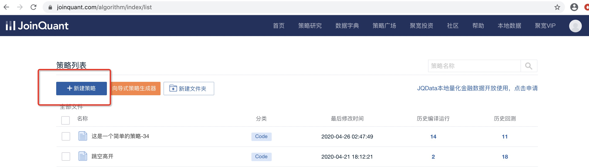
        
    *   进入策略编辑页，左侧就是策略代码编辑区域，初始会默认给你提供代码模板，全删除后写入我们的代码就好了。  
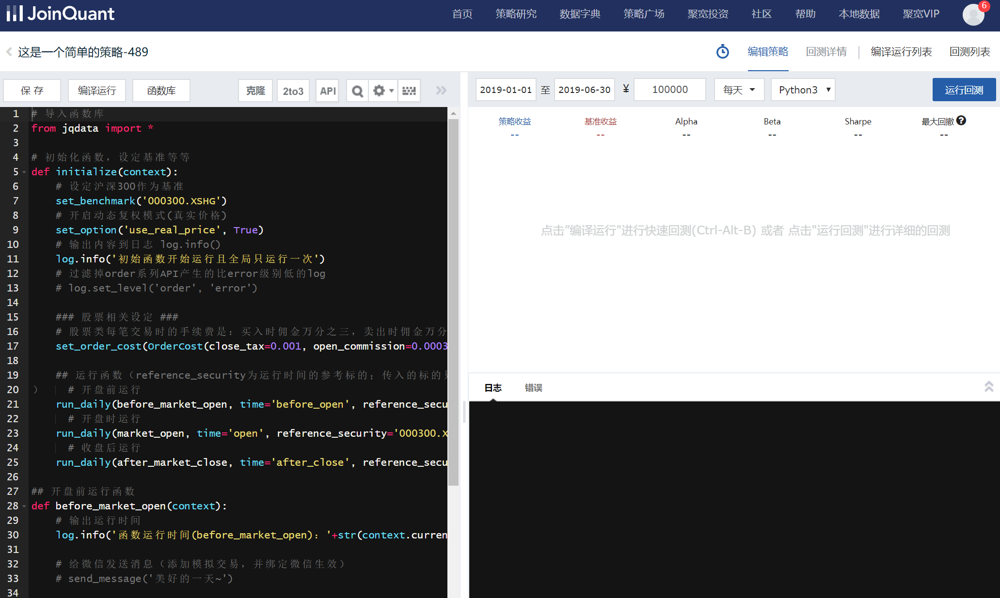
####         
*   **两种写法用哪个好？**
    
    *   写法一是从前的老写法，将逐步弃用，写法二是聚宽系统改进后的新写法，**推荐使用写法二**。
       
    *   **def、context等都是什么意思？**
        
    *   其实是在调用聚宽提供好的函数，展开讲很复杂，不理解的话先记住，后面的学习内容会让你理解。
        

### 五、框架写成代码了，那例子的完整的代码该怎么写呢？

*   剩下的两行代码这么写。完全理解需要学习后续的内容，此处不要求理解。知道大概什么样子往哪里写即可。
####     
*   选定要交易的股票为平安银行：
    
    ~~~
      g.security = '000001.XSHE'
    
    ~~~
####     
*   买100股的平安银行（市价单写法）:
    
    ~~~
      order(g.security, 100)
    
    ~~~
####     
*   以写法二为例把剩下的代码补上后，完整代码为：
    
    ~~~
    def initialize(context):
        run_daily(period,time='every_bar')
        g.security = '000001.XSHE'
    
    def period(context):
        order(g.security, 100)
    
    ~~~
    

### 六、那么现在这些代码就可以运行了吗？

*   是的。以写法二为例，如图把代码写到策略编辑区，设置好**初始资金**与**起止时间**（比如初始资金100000元，起止时间20160601-20161231），**频率**设置成天。点击**编译运行**，运行结束后就可以看到结果了。  
    
    
*   可以看到，若你20160601有初始资金100000元，每个交易日尝试买100股的平安银行，到20161231，你的收益曲线将如图中蓝线般增长。图中红线是基准收益（默认是沪深300指数，代表整个市场增长水平）
    
*   接下来，点击**运行回测**，运行结束后就可以看到更为详细的结果，包括下单记录、持仓记录等。  
    
    

### 八、策略出错不能运行？

*   策略不能运行时，日志中会报错并给出一定的提示信息，像这样：  
    
#### 
*   首先注意，右上角的箭头按钮能展开运行日志。看到日志中，最后一行是错误的提示信息：
    
    ~~~
      SyntaxError: invalid syntax
    
      汉义是 语法错误：不合法的语法。
    
    ~~~
####     
*   最后一行之前的是错误的位置信息，一般只看后面就行。
    
    ~~~
      File "user_code.py", line 1
          def initialize(context)
                                ^
    
    ~~~
####     
*   意思是文件user\_code.py（就是你的策略代码）的第一行，“^”符号指向的位置有错。你到代码中的这个位置看下，会发现少个冒号。
####     
*   为了顺利运行策略，需要耐心解决错误，但错误的原因极度的复杂多样（所以日志的报错信息也多种多样，不止图上一种），故在此只针对例子讲下新手容易犯的错误：
    
    *   符号要用英文输入法。下图，代码第一行的冒号是中文的，所以出错  
        
    *   拼写不要错。下图，security拼写错了  
        
    *   缩进要对齐。下图，缩进没对齐。缩进的时候可以按键盘tab键或四个空格。  
        
*   编程界往往把错误叫bug，而不断调试去除错误的过程叫debug，做量化时也是时常听到的说法，大家应该知道下。
####     
*   而且debug通常就是要耗费不低于~写bug~写代码的时间的，所以会debug是很重要的能力，大家平时debug的时候不妨多思考下，如何更有效率的debug。当然，我们后续也会介绍些debug的技巧。

### 九、回测、编译运行、运行回测都是什么意思？

*   像刚刚那样，用一段时间内的历史的真实行情数据，来验证一个确定的交易策略在这段时间表现如何，这个过程叫**回测**。
####     
*   **运行回测**就是是字面意思，让计算机运行这次回测，运行后会告诉你策略在这段时间表现情况，比如收益率、年化收益率、最大回撤、夏普比率等指标，而且一般也会包括下单记录、持仓记录等。
####     
*   **编译运行**其实也是让计算机运行这次回测，不过相比于点击运行回测，编译运行的结果比运行回测要简单，只有收益率等指标，因此也**速度更快**。所以，当还不必要得到详细的结果时，或只是想调试下策略的代码，看是否无误可运行时，编译运行就比运行回测更方便。
    

### 十、周期循环具体是什么时候开始的呢？

*   如果策略频率为天，是每个交易日开始生效，从9:30直到15:00（从股市开市到收市），所以例子中是每个交易日9:30开市循环就开始，一天一次地循环执行买入股票的操作。
####     
*   如果策略频率为分钟，是每个分钟开始时执行，所以例子中的买入股票的操作是每个交易日从9:30:00开始，然后9:31:00，直到14:59:00。接着下一天9:30:00，如此一分钟一次地循环执行的。  
    
####     
*   虽然频率只有为分钟和每天可选，但通过不同的代码可以实现按周按月周期循环，而且分钟级别里下单时间也是可以自己选的。


# 第三章 我的基本框架

# 第三章 我的基本框架
*****
### 摘要
*   前言
*   我的代码框架（附源代码）
*   怎么使用我的代码框架
*   代码框架讲解
*   代码段详解
*****
#### :-: **前言**
前一章说的是**量化策略的基本框架**，很多人看了前一章后知道了怎么创建策略，但具体怎么做一个策略，代码怎么实现，肯定还是很模糊的。
#### 
我就很明白的告诉你们，前一章看不懂没关系，很多代码看不懂也没关系，这一章，我会把我写策略的代码框架直接给你们，这套框架已经给你们造好了轮子，你们只需要理解每个轮子的作用以及使用方法就可以。
#### 
一般来说要完成一个策略需要写很多函数或者说功能，比如：

1.选股频率
2.买卖频率
3.持仓个数
4.过滤停盘
5.过滤退市
6.过滤ST
7.基础股票池
8.行业过滤
9.概念过滤
10.黑名单
11.下单
12.策略选股和买卖核心程序
#### 
这么多功能，如果每个功能都用代码写出来，工作量大，难度也大，效率也低。所以我的框架里，会把1-11都写好，你们只要做配置就行。也就是说，你们只需要专心完成第12项**策略选股和买卖核心程序**就行。

#### 
这个框架是我这几年日积月累一步步完善的成果，且专门针对小白们做了一些优化和调整。
#### 
好，接下来我们开始学习我这个框架。学习有四部分：
1.我会把我的代码框架的源代码贴出来，大家可以直接复制到聚宽上使用
2.我会一步步告诉大家怎么用我的框架替换持股数，更改选股频率，怎么用我的框架写自己想写的策略等
3.我把我的框架代码截了图，并注明了主要模块的功能和介绍（大家可以看得更直观）
4.我针对主要的几个代码段做了详细解释
#### 
第1，2两部分是重点。3，4部分可以作为补充学习。


## 我的代码框架（附源代码）

# 我的代码框架（附源代码）
*****
往下滑动，你们会发现有一大串python代码。不懂代码的读者看到下面那一大串代码框架肯定一脸懵逼，这都是啥呀，密密麻麻的。看不懂没关系，我们只要会用就行。
#### 
**那具体怎么用呢？**
#### 
1.先复制下面这一大串代码
2.然后进入到网站[https://www.joinquant.com/](https://www.joinquant.com/)
3.接着按照我们前在第二章所说的步骤，把代码复制到一个新建策略里。步骤我再贴一遍：
> *   **代码应该往哪里写？**
>    
>    *   来到聚宽网站后，通过导航栏-策略研究-策略列表

>    *   然后点击新建策略 

   
 >   *   进入策略编辑页，左侧就是策略代码编辑区域，初始会默认给你提供代码模板，全删除后写入我们的代码就好了。  


4.复制好后，把回测时间选定为2020年1月1日-2020年4月26日。金额设置成100万，频率是每天，python3。然后点击运行回测就可以了。
```
from kuanke.wizard import *
from jqdata import *
import numpy as np
import pandas as pd
import talib
import datetime
import time
import math


## 初始化函数，设定要操作的股票、基准等等
def initialize(context):
    # 设定基准
    set_benchmark('000300.XSHG')
    # 设定滑点
    set_slippage(FixedSlippage(0.01))
    # True为开启动态复权模式，使用真实价格交易
    set_option('use_real_price', True)
    # 设定成交量比例
    set_option('order_volume_ratio', 1)
    # 股票类交易手续费是：买入时佣金万分之三，卖出时佣金万分之三加千分之一印花税, 每笔交易佣金最低扣5块钱
    set_order_cost(OrderCost(open_tax=0, close_tax=0.001, open_commission=0.0003, close_commission=0.0003, min_commission=5), type='stock')

    #容器初始化
    check_container_initialize()
    #动态仓位、频率、计数初始化函数
    check_dynamic_initialize()
    # 股票筛选初始化函数
    check_stocks_initialize()
    # 出场初始化函数
    sell_initialize()
    # 入场初始化函数
    buy_initialize()


    # 关闭提示
    log.set_level('order', 'info')

    # 运行函数
    run_daily(check_stocks, '9:15') #选股
    run_daily(main_stock_pick, '9:16') #买入卖出列表
    run_daily(sell_every_day,'open') #卖出未卖出成功的股票
    run_daily(trade, 'open') #交易
    run_daily(selled_security_list_count, 'after_close') #卖出股票日期计数
    
    
    
#######################！！！新手需要使用的地方！！！###################################################
##动态仓位、频率、计数初始化函数(持仓比例，选股频率，买入频率，卖出频率在这里设置)
def check_dynamic_initialize():
    # 个股最大持仓比重
    g.security_max_proportion = 1
    # 选股和买卖频率
    g.check_stocks_refresh_rate = 30
    # 最大建仓数量
    g.max_hold_stocknum = 1
    
    #下面这几项不用管
    # 买入频率
    g.buy_refresh_rate = 1
    # 卖出频率
    g.sell_refresh_rate = 1

    # 选股频率计数器
    g.check_stocks_days = 0
    #机器学习选股频率计数器
    g.days = 0
    # 买卖交易频率计数器
    g.buy_trade_days=0
    g.sell_trade_days=0
    
## 股票池初筛设置函数(股票初筛在这里设置)
def check_stocks_initialize():
    # 是否过滤停盘
    g.filter_paused = True
    # 是否过滤退市
    g.filter_delisted = True
    # 是否只有ST
    g.only_st = False
    # 是否过滤ST
    g.filter_st = True
    # 股票池(填指数)
    g.security_universe_index = ['all_a_securities']#这里填写指数，全部股票就填['all_a_securities']，沪深300股票就填['000300.XSHG'],中证500就填['000905.XSHG'],沪深300+中证500就填['000300.XSHG','000905.XSHG']
    # 填成分股(填成分股)
    g.security_universe_user_securities = []
    # 行业列表
    g.industry_list = ["801010","801020","801030","801040","801050","801080","801110","801120","801130","801140","801150","801160","801170","801180","801200","801210","801230","801710","801720","801730","801740","801750","801760","801770","801780","801790","801880","801890"]
    # 概念列表
    g.concept_list = []
    # 黑名单
    g.blacklist=['300268.XSHE','600035.XSHG','300028.XSHE']
    
## 买入股票，卖出股票筛选函数
def main_stock_pick(context):
    if g.days % g.check_stocks_refresh_rate != 0:
        g.days +=1
        return
    g.sell_stock_list=[]
    g.buy_stock_list = []

####自定义编辑范围#####    

#外资策略

    date = context.current_dt.strftime("%Y-%m-%d")
    today = datetime.datetime.strptime(date, "%Y-%m-%d").date()
    yesterday = shifttradingday(today ,shift = -1)
    print('前一个交易日:',yesterday) 

    q = query(finance.STK_EL_TOP_ACTIVATE).filter(finance.STK_EL_TOP_ACTIVATE.day == yesterday,finance.STK_EL_TOP_ACTIVATE.code.in_(g.check_out_lists))
    df = finance.run_query(q)
  
    
    df['net'] = df.buy - df.sell
    df = df.sort_values('net' , ascending = False)
    df = df[(df.link_id != 310003 ) & (df.link_id != 310004 )]
    a=0
    while df.empty == True:
        a=a+1
        yesterday = shifttradingday(today ,shift = -a)
        print('前一个交易日:',yesterday) 
        q = query(finance.STK_EL_TOP_ACTIVATE).filter(finance.STK_EL_TOP_ACTIVATE.day == yesterday )
        df = finance.run_query(q)
        df['net'] = df.buy - df.sell
        df = df.sort_values('net' , ascending = False)
        df = df[(df.link_id != 310003 ) & (df.link_id != 310004 )]          
    
    stockset = list(df['code'])
    
    g.sell_stock_list1 = list(context.portfolio.positions.keys())
    
    current_data = get_current_data()
    
    paused_list = [stock for stock in g.sell_stock_list1 if  current_data[stock].paused]

    for stock in g.sell_stock_list1:
        if stock in paused_list:
            continue
        elif stock not in stockset[:g.max_hold_stocknum]:
                g.sell_stock_list.append(stock)

    for stock in stockset[:g.max_hold_stocknum]:
        if stock in g.sell_stock_list:
            pass
        else:
            g.buy_stock_list.append(stock)
            
####自定义编辑范围#####              

    log.info('卖出列表:',g.sell_stock_list)
    log.info('购买列表:',g.buy_stock_list)
    g.days =1
    return g.sell_stock_list,g.buy_stock_list  
    
    
#######################！！！新手需要使用的地方！！！###################################################


##容器初始化(有新的全局容器可以加到这里)(新手忽略这里)
def check_container_initialize():
    #卖出股票列表
    g.sell_stock_list=[]
    #买入股票列表
    g.buy_stock_list = []
    # 获取未卖出的股票
    g.open_sell_securities = []
    # 卖出股票的dict
    g.selled_security_list={}
    #涨停股票列表
    g.ZT=[]    
    

## 出场初始化函数(新手忽略这里)
def sell_initialize():
    # 设定是否卖出buy_lists中的股票
    g.sell_will_buy = True

    # 固定出仓的数量或者百分比
    g.sell_by_amount = None
    g.sell_by_percent = None

## 入场初始化函数(新手忽略这里)
def buy_initialize():
    # 是否可重复买入
    g.filter_holded = False

    # 委托类型
    g.order_style_str = 'by_cap_mean'
    g.order_style_value = 100


## 股票初筛(新手忽略这里)
def check_stocks(context):
    if g.check_stocks_days%g.check_stocks_refresh_rate != 0:
        # 计数器加一
        g.check_stocks_days += 1
        return
    # 股票池赋值
    g.check_out_lists = get_security_universe(context, g.security_universe_index, g.security_universe_user_securities)
    # 行业过滤
    g.check_out_lists = industry_filter(context, g.check_out_lists, g.industry_list)
    # 概念过滤
    g.check_out_lists = concept_filter(context, g.check_out_lists, g.concept_list)
    # 过滤ST股票
    g.check_out_lists = st_filter(context, g.check_out_lists)
    # 过滤停牌股票
    g.check_out_lists = paused_filter(context, g.check_out_lists)
    # 过滤退市股票
    g.check_out_lists = delisted_filter(context, g.check_out_lists)
    # 过滤黑名单股票
    g.check_out_lists = [s for s in g.check_out_lists if s not in g.blacklist]
    # 计数器归一
    g.check_stocks_days = 1
    return


## 卖出未卖出成功的股票(新手忽略这里)
def sell_every_day(context):
    g.open_sell_securities = list(set(g.open_sell_securities))
    open_sell_securities = [s for s in context.portfolio.positions.keys() if s in g.open_sell_securities]
    if len(open_sell_securities)>0:
        for stock in open_sell_securities:
            order_target_value(stock, 0)
    g.open_sell_securities = [s for s in g.open_sell_securities if s in context.portfolio.positions.keys()]
    return


## 交易函数(新手忽略这里)
def trade(context):
   # 初始化买入列表
    buy_lists = []

    # 买入股票筛选
    if g.buy_trade_days%g.buy_refresh_rate == 0:
        # 获取 buy_lists 列表
        buy_lists = g.buy_stock_list
        # 过滤涨停股票
        buy_lists = high_limit_filter(context, buy_lists)
        log.info('购买列表最终',buy_lists)

    # 卖出操作
    if g.sell_trade_days%g.sell_refresh_rate != 0:
        # 计数器加一
        g.sell_trade_days += 1
    else:
        # 卖出股票
        sell(context, buy_lists)
        # 计数器归一
        g.sell_trade_days = 1


    # 买入操作
    if g.buy_trade_days%g.buy_refresh_rate != 0:
        # 计数器加一
        g.buy_trade_days += 1
    else:
        # 卖出股票
        buy(context, buy_lists)
        # 计数器归一
        g.buy_trade_days = 1


##################################  交易函数群 ##################################(新手忽略)

# 交易函数 - 出场
def sell(context, buy_lists):
    # 获取 sell_lists 列表
    init_sl = context.portfolio.positions.keys()
    sell_lists = context.portfolio.positions.keys()

    # 判断是否卖出buy_lists中的股票
    if not g.sell_will_buy:
        sell_lists = [security for security in sell_lists if security not in buy_lists]

    ### _出场函数筛选-开始 ###
    sell_lists = g.sell_stock_list
    ### _出场函数筛选-结束 ###

    # 卖出股票
    if len(sell_lists)>0:
        for stock in sell_lists:
            sell_by_amount_or_percent_or_none(context,stock, g.sell_by_amount, g.sell_by_percent, g.open_sell_securities)

    # 获取卖出的股票, 并加入到 g.selled_security_list中
    selled_security_list_dict(context,init_sl)

    return

# 交易函数 - 入场
def buy(context, buy_lists):

    # 判断是否可重复买入
    buy_lists = holded_filter(context,buy_lists)

    # 获取最终的 buy_lists 列表
    Num = g.max_hold_stocknum - len(context.portfolio.positions)
    buy_lists = buy_lists[:Num]

    # 买入股票
    if len(buy_lists)>0:
        # 分配资金
        for stock in buy_lists:
            position_count = len(context.portfolio.positions)
            if g.max_hold_stocknum > position_count:
                value = context.portfolio.cash / (g.max_hold_stocknum - position_count)
                if context.portfolio.positions[stock].total_amount == 0:
                    order_target_value(stock, value)
    return


###################################  公用函数群 ##################################(新手忽略)


## 过滤同一标的继上次卖出N天不再买入
def filter_n_tradeday_not_buy(security, n=0):
    try:
        if (security in g.selled_security_list.keys()) and (g.selled_security_list[security]<n):
            return False
        return True
    except:
        return True

## 是否可重复买入
def holded_filter(context,security_list):
    if not g.filter_holded:
        security_list = [stock for stock in security_list if stock not in context.portfolio.positions.keys()]
    # 返回结果
    return security_list

## 卖出股票加入dict
def selled_security_list_dict(context,security_list):
    selled_sl = [s for s in security_list if s not in context.portfolio.positions.keys()]
    if len(selled_sl)>0:
        for stock in selled_sl:
            g.selled_security_list[stock] = 0

## 过滤停牌股票
def paused_filter(context, security_list):
    if g.filter_paused:
        current_data = get_current_data()
        security_list = [stock for stock in security_list if not current_data[stock].paused]
    # 返回结果
    return security_list

## 过滤退市股票
def delisted_filter(context, security_list):
    if g.filter_delisted:
        current_data = get_current_data()
        security_list = [stock for stock in security_list if not (('退' in current_data[stock].name) or ('*' in current_data[stock].name))]
    # 返回结果
    return security_list


## 过滤ST股票
def st_filter(context, security_list):
    if g.only_st:
        current_data = get_current_data()
        security_list = [stock for stock in security_list if current_data[stock].is_st]
    else:
        if g.filter_st:
            current_data = get_current_data()
            security_list = [stock for stock in security_list if not current_data[stock].is_st]
    # 返回结果
    return security_list

# 过滤涨停股票
def high_limit_filter(context, security_list):
    current_data = get_current_data()
    security_list = [stock for stock in security_list if not (current_data[stock].last_price>= current_data[stock].high_limit)]
    # 返回结果
    return security_list

# 获取股票股票池
def get_security_universe(context, security_universe_index, security_universe_user_securities):
    temp_index = []
    for s in security_universe_index:
        if s == 'all_a_securities':
            temp_index += list(get_all_securities(['stock'], context.current_dt.date()).index)
        else:
            temp_index += get_index_stocks(s)
    for x in security_universe_user_securities:
        temp_index += x
    return  sorted(list(set(temp_index)))

# 行业过滤
def industry_filter(context, security_list, industry_list):
    if len(industry_list) == 0:
        # 返回股票列表
        return security_list
    else:
        securities = []
        for s in industry_list:
            temp_securities = get_industry_stocks(s)
            securities += temp_securities
        security_list = [stock for stock in security_list if stock in securities]
        # 返回股票列表
        return security_list

# 概念过滤
def concept_filter(context, security_list, concept_list):
    if len(concept_list) == 0:
        return security_list
    else:
        securities = []
        for s in concept_list:
            temp_securities = get_concept_stocks(s)
            securities += temp_securities
        security_list = [stock for stock in security_list if stock in securities]
        # 返回股票列表
        return security_list
        
## 卖出股票日期计数
def selled_security_list_count(context):
    #g.daily_risk_management = True
    if len(g.selled_security_list)>0:
        for stock in g.selled_security_list.keys():
            g.selled_security_list[stock] += 1
            
#获取交易日
def shifttradingday(date,shift):
    #获取N天前的交易日日期
    # 获取所有的交易日，返回一个包含所有交易日的 list,元素值为 datetime.date 类型.
    tradingday = get_all_trade_days()
    # 得到date之后shift天那一天在列表中的行标号 返回一个数
    shiftday_index = list(tradingday).index(date)+shift
    # 根据行号返回该日日期 为datetime.date类型
    return tradingday[shiftday_index]            


```


## 怎么使用我的代码框架

# 怎么使用我的代码框架
*****
### 摘要
*   怎么设置持股数量
*   怎么设置选股和买卖频率
*   怎么修改策略运行的时间
*   怎么设置基础股票池
*   怎么筛选行业
*   怎么筛选概念
*   怎么添加黑名单
*  怎么在框架里把外资策略替换成其他自己想要写的策略
*  作业1
*****
运行完我的代码框架后应该是这样的：
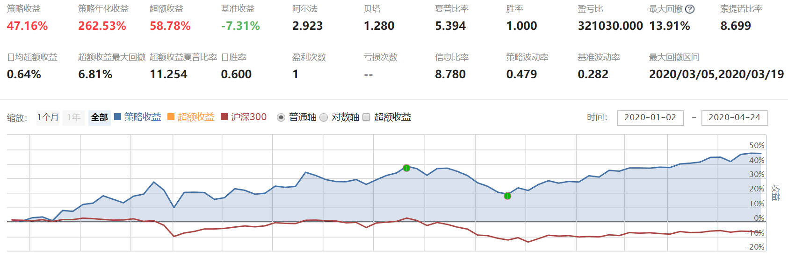
是不是感觉收益还不错，这个框架里默认嵌套的策略就是我之前一直在公众号里说的外资策略。接下来我们详细说说怎么使用这个框架。

### 一、怎么设置持股数量
你们应该也发现了，你们刚才运行的外资策略只会买一只股票，那怎么用我们的框架买多只股票呢？
#### 
只需要在下图框架第56行，途中红框框的位置，设置一下要买入股票的数量就可以了。默认是1，你们改成2就会买2只，改成5就会买5只，你们可以试一试。
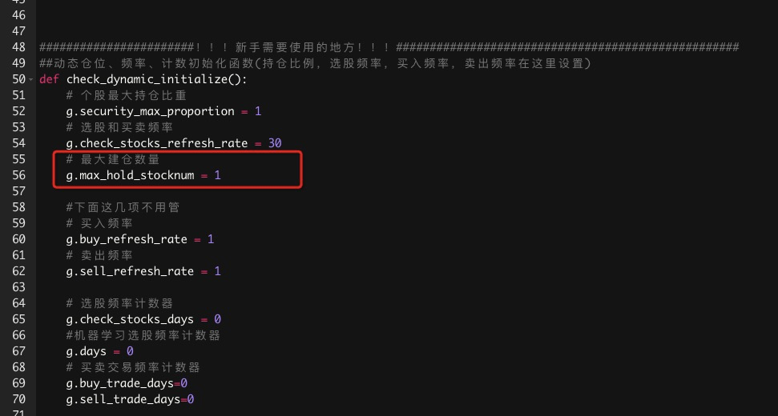
### 二、怎么设置选股和买卖频率
你们应该还发现了，这个策略的运行时间是30个交易日一次，那怎么改成60，或20日交易一次呢？
#### 
只需要在下图红框位置，也就是代码的第54行。把30替换成20或者60就可以了，你们可以改改试试看。
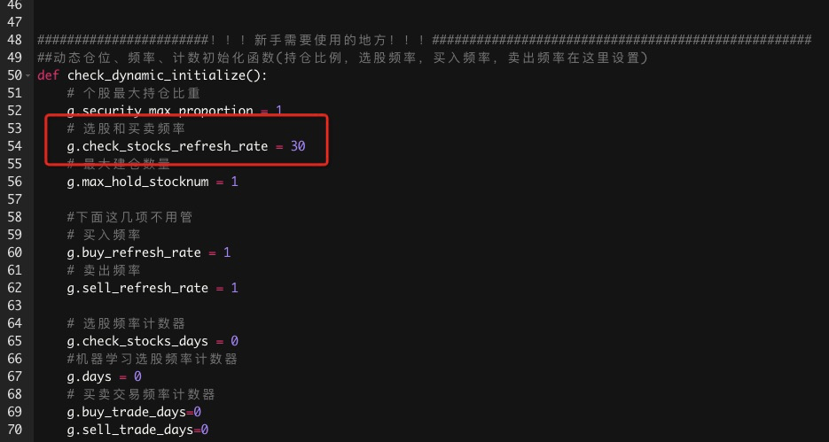

### 三、怎么修改策略运行的时间
你们可以发现，这个策略的买卖时间都在9:30，那我想下午14:30交易，怎么操作？
#### 
你们可以在下面的红框，也就是代码的第43行，把'open'改成'14:30'。

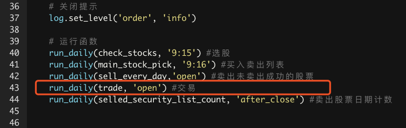

### 四、怎么设置基础股票池
就是说，我策略从什么池子里选股，我默认选择的是全市场股票池，你如果想从沪深300股票池里选股，那就在代码的第83行，把'all_a_securities'替换成'000300.XSHG'，其他指数同理。
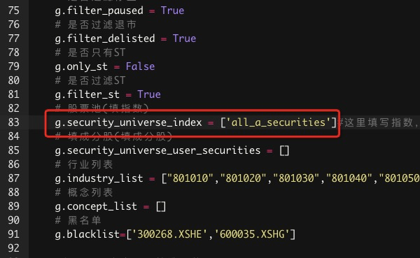
### 五、怎么筛选行业
有人说，我不想买周期股，所以要把钢铁，化工，采掘等周期行业去掉，那怎么操作呢？
#### 
代码的第87行，也就是红框的位置是配置行业的地方。你们可以看到有801010，801020......这一系列编码，每个编码代表的是一个行业（申万一级行业），我默认把所有的行业都填上去了，所有默认会从全行业选股。
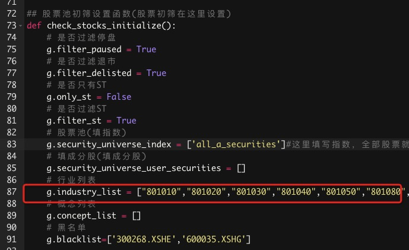
你们如果想把不想要的行业去掉，那就先进入行业查询页面，地址是这个：https://www.joinquant.com/help/api/help?name=plateData#%E7%94%B3%E4%B8%87%E4%B8%80%E7%BA%A7%E8%A1%8C%E4%B8%9A
然后找到采掘，化工和钢铁的行业编码，把他们从87行那个配置项目里删除，那策略在选股的时候就会自动去除这三个行业了
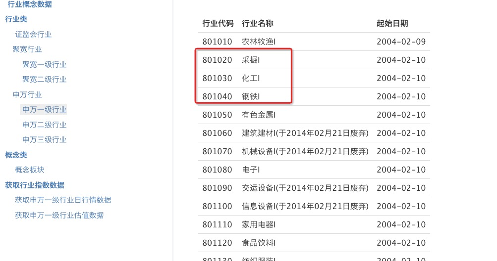

### 六、怎么筛选概念
筛选概念和行业的原理一样，不过是在第89行配置的。但注意，当概念什么都不填的时候就代表了全概念，当填的时候，就代表置灰选你填的这个概念。
#### 
概念编码查询地址：https://www.joinquant.com/help/api/help?name=plateData#%E6%A6%82%E5%BF%B5%E6%9D%BF%E5%9D%97

### 七、怎么添加黑名单
在实际运用策略的时候，你们可能会遇到一个情况，把某些股票排除在我的股票池之外，比如我不想买茅台，因为茅台太贵，或者我不想买亿联网络，因为他财务可能有雷。
#### 
具体怎么操作呢？我们可以在代码的第91行，把默认的两个股票300268.XSHE和600035.XSHG删除。然后把亿联网络300628.XSHE和贵州茅台600519.XSHG黑名单里
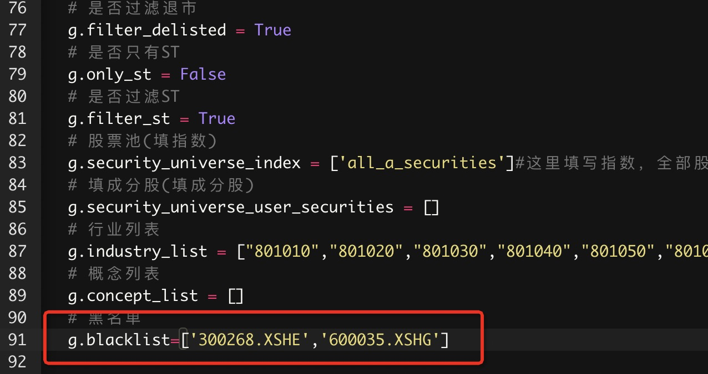

### 八、怎么在框架里把外资策略替换成其他自己想要写的策略
这套框架适应于基本上所有的策略，只是我用外资策略做了一个示例，如果你想用这套框架写另一个策略，改怎么操作呢？
#### 
首先找到代码的第101行，然后找到下图红框框的位置，这个红框框就是外资策略的核心逻辑。你们把红框里的删除，替换成自己想写的策略就可以。
#### 
不过有一点要注意，你想要写的新策略必须要输出g.sell_stock_list（卖出列表）和g.buy_stock_list（买入列表）

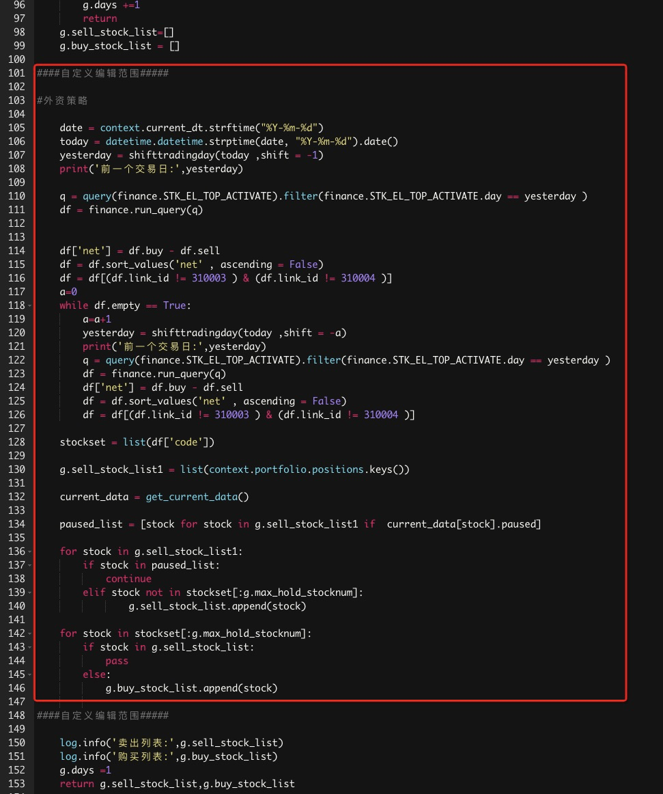
#### 
**那具体怎么操作呢？**
#### 
你们跟着我尝试一下把外资策略替换成60日均线策略：**策略的逻辑是当某只股票的昨日股价大于60日均价就买入，昨日股价小于60日均价就卖出。**
#### 
我这里每写一段代码，你们跟着手打一段代码。下面我们开始操作：
#### 
1.首先把红框的内容删除

#### 
2.然后要获取到我们要操作的股票，这个股票是从全局变量g.check_out_lists中获取的（这点你们可以思考一下为什么是从g.check_out_lists获取股票）。
#### 
所以获取股票的语句就是
```
    x = g.check_out_lists[0]
```
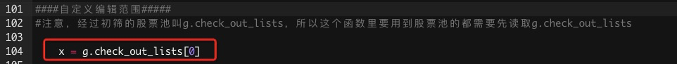
#### 
3.接着我们要计算这只股票的60日均价。计算股票均价需要用聚宽的查询单只股票的历史行情接口，这个接口的名字叫attribute_history。行情数据接口文档可以在聚宽查看[行情数据接口](https://www.joinquant.com/help/data/stock#get1d)
```
    long_df = attribute_history(x, count=60, unit='1d',fields=['close'],skip_paused=True, df=True, fq='pre') #dataframe
    
    long_price = long_df['close'].mean() #这个long_price就是60日均价
```
 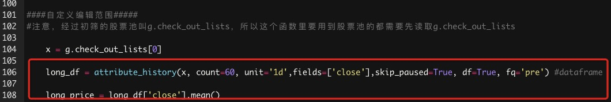
#### 
4.接下来我们要计算这只股票的昨日收盘价。昨日收盘价其实就等于股票昨天的平均价，所以写法类似
```
    short_df = attribute_history(x, count=1, unit='1d',fields=['close'],skip_paused=True, df=True, fq='pre') #dataframe
    
    short_price = short_df['close'].mean() #这个short_price就是昨日收盘价
```
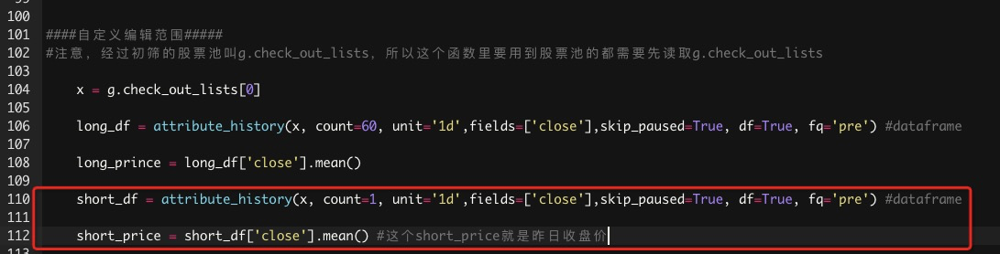
#### 
5.接下来我们来实现**昨日收盘价大于60日均价买入，昨日收盘价小于60日均价卖出**。这里要用到一个python的语法，和一个python的函数。语法叫if.....elif，函数叫append()，这两个我不展开说了，你们自己去看python教程
```
    if  short_price > long_price:
        g.buy_stock_list.append(x)   #如果昨日股价大于60日均价，把股票加入到g.buy_stock_list（买入列表）

    elif short_price < long_price:
        g.sell_stock_list.append(x)  #如果昨日股价小于60日均价，把股票加入到 g.sell_stock_list（卖出列表）
```
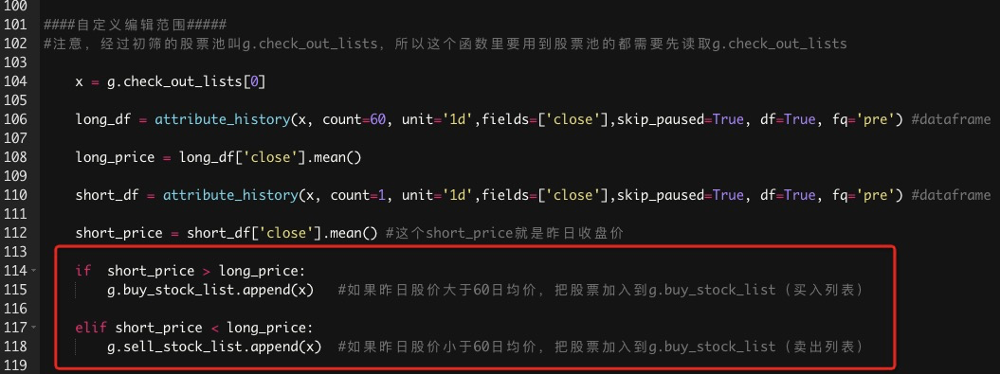
#### 
看到了吧，这里的核心是要把选出来要买入的股票加入到g.buy_stock_list（买入列表）里，然后把要卖出的股票加入到g.sell_stock_list（卖出列表）里。不管是什么策略，最后都要这样做。
#### 
6.填写要测试的股票。因为我们这个60日均线策略不涉及到选股，只涉及到买卖特定的股票，所以我们要找到代码的第83行（下图蓝框），删除中括号里的内容。然后在85行（下图红框）填入我们想要测试的股票。
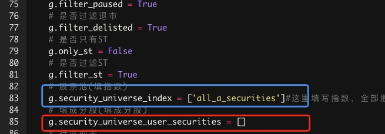
比如我们要测试埃斯顿这只股票，那就在85行填入['002747.XSHE']，85行这里要注意，最后的格式是这样的[[''002747.XSHE'']]如下图
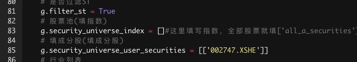
#### 
7.回测的时候会有一条蓝线和红线，蓝线代表策略收益，红线代表基准收益。这个基准收益是可以自己设置的，设置的位置是代码的第14行。默认是沪深300，但这个均线策略我们要和股票本身的走势对比，所以我们要把这个基准改成埃斯顿
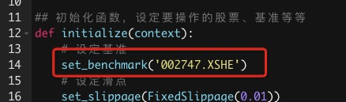
#### 
8.因为是测试一直股票，所以我们还得确认一下我们的最大加仓数是不是1，建仓数你们还记得在哪里找吗？
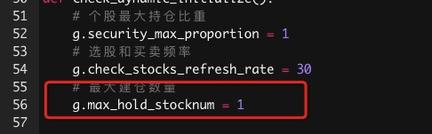
#### 
9.均线策略要每天都运行策略，因为我们也保不定那天就触发了均线信号，所以选股和买卖频率要设置成1

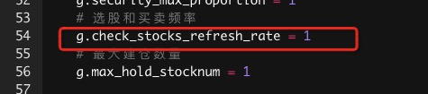
#### 
10.然后设置一下要回测的时间，就可以运行了
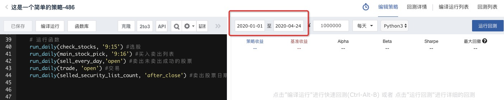
#### 
### 九、作业1
细心的读者会发现如果从2020年1月1日运行就没问题的，但从2017年1月1日开始运行就会报错，给你们留个作业：1.研究研究这个报错是什么原因产生的。2.怎么解决这个报错
#### 
你们思考完后可以在圈子里发动态说说你们这两个问题


## 三份重要的作业

# 三份重要的作业
*****
### 摘要
*   用前面讲的框架实现小市值策略
*   用前面讲的框架实现双均线策略
*   用前面讲的框架实现白马股策略
*****
这三个策略是相对简单的策略，但又包含了量化策略的各种知识。你们如果实现了这三个策略，基本上写其他策略也是没问题的。这里我会给出这三个策略的文字逻辑，然后你们根据我说的文字版逻辑把三个策略实现出来。
### 一、用前面讲的框架实现小市值策略
[第五章 策略评价与建立模拟](#第五章 策略评价与建立模拟)基础股票池：全部A股，且过滤ST，过滤停牌，过滤退市
选股逻辑：选出市值最小的10只股票，30天轮动一次，且轮动当天的9:30分运行
买入逻辑：未持仓的个股只要在市值最小的前10名，那就买入
卖出逻辑：持仓的个股掉出前10名，那就卖出
择时逻辑：不择时
仓位管理：满仓
### 
作业答案：
### 
你们跟着使用我的代码框架，把代码框架的原外资策略替换成小市值轮动策略。
### 
下面我们开始操作：

1.首先把红框的内容删除  
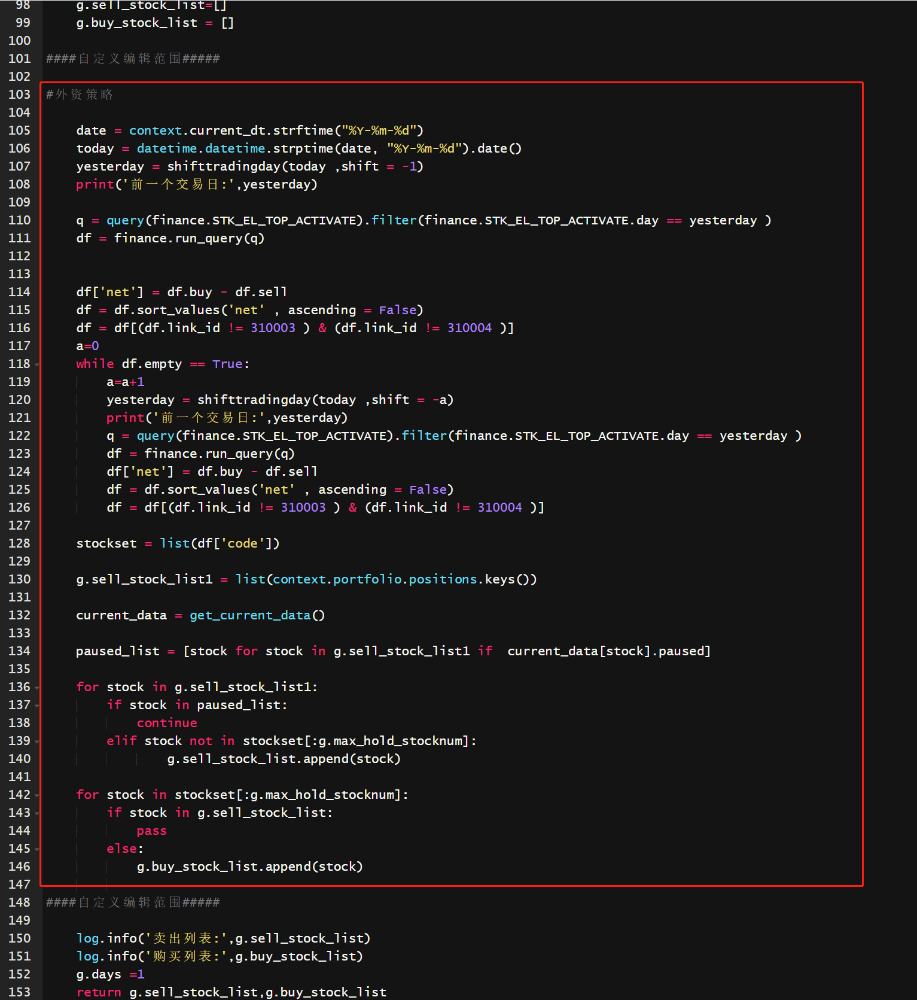

2.然后把下面这段代码复制进去

```
#小市值轮动策略
    q=query(valuation.code).filter(valuation.code.in_(g.check_out_lists)).order_by(valuation.market_cap.asc())
    df=get_fundamentals(q)
    
    stockset = list(df['code'])
    g.sell_stock_list1 = list(context.portfolio.positions.keys())
    
    current_data = get_current_data()
    
    paused_list = [stock for stock in g.sell_stock_list1 if  current_data[stock].paused]

    for stock in g.sell_stock_list1:
        if stock in paused_list:
            continue
        elif stock not in stockset[:g.max_hold_stocknum]:
                g.sell_stock_list.append(stock)

    for stock in stockset[:g.max_hold_stocknum]:
        if stock in g.sell_stock_list:
            pass
        else:
            g.buy_stock_list.append(stock)
```
### 
3.这个时候你会发现策略只买1只票，怎么样才能让策略买10只呢？需要把代码框架红框的这个位置的1改成10。
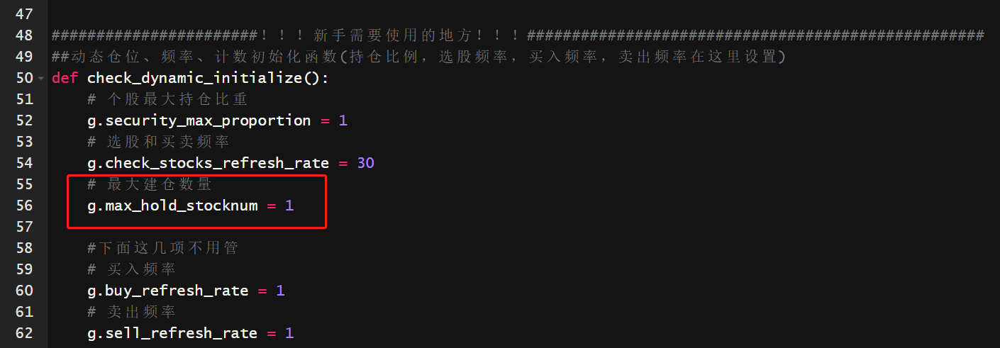
### 
4.此时运行回测就可以了。

对了，这种原版小市值策略效果肯定不太好，这个时候我们可以加几个简单的基本面条件。优化后的逻辑是这样的：
### 
基础股票池：全部A股，且过滤ST，过滤停牌，过滤退市
选股逻辑：选出市值最小的10只股票，且最近一季度营收同比、环比均大于0，最近一季度净利润同比、环比大于0。30天轮动一次，且轮动当天的9:30分运行
买入逻辑：未持仓的个股只要在市值最小的前10名，那就买入
卖出逻辑：持仓的个股掉出前10名，那就卖出
择时逻辑：不择时
仓位管理：满仓

这段的源代码我也给出来，只要按照刚才的方法，把这段代码复制到代码框架里就可以了。
```
#小市值轮动策略-基本面优化版
    q=query(valuation.code).filter(indicator.inc_revenue_annual>0,indicator.inc_revenue_year_on_year>0,indicator.inc_net_profit_to_shareholders_year_on_year>0,indicator.inc_net_profit_to_shareholders_annual>0,valuation.code.in_(g.check_out_lists)).order_by(valuation.market_cap.asc())
    df=get_fundamentals(q)
    
    stockset = list(df['code'])
    
    
    g.sell_stock_list1 = list(context.portfolio.positions.keys())
    
    current_data = get_current_data()
    
    paused_list = [stock for stock in g.sell_stock_list1 if  current_data[stock].paused]

    for stock in g.sell_stock_list1:
        if stock in paused_list:
            continue
        elif stock not in stockset[:g.max_hold_stocknum]:
                g.sell_stock_list.append(stock)

    for stock in stockset[:g.max_hold_stocknum]:
        if stock in g.sell_stock_list:
            pass
        else:
            g.buy_stock_list.append(stock)
```

### 二、用前面讲的框架实现双均线策略
基础股票池：沪深300股票池，且过滤ST，过滤停牌，过滤退市
选股逻辑：在沪深300中找出35日均线恰好上穿95日均线的所有股票，并按照ROE从大到小排名，最终选出前三名；
买入逻辑: 每日14:55等权重买入选出的3只股票。
卖出逻辑:  每日14:55，若35日均线下穿95日均线则卖出，或者4天内跌10%卖出；
择时逻辑: 以上证50的80日均线为基准，80日均线上方可以买入，80日均线下方不再买入。(此处并非是80日均线下就清仓，而是手里的个股一旦卖出后，就不再买入新的股票了)

### 
作业答案：
### 
你们跟着使用我的代码框架，把代码框架的原外资策略替换成双均线-ROE策略。
### 
下面我们开始操作：

1.首先把红框的内容删除  


2.然后把下面这段代码复制进去

```
#双均线策略
    buy_lists = [security for security in g.check_out_lists if MA_judge_jincha(security, 35, 95)] #删选出所有35日线穿95日的股票
    
    buy_lists = [security for security in buy_lists if MA_judge_duotou('000016.XSHG', 1, 80)]

    q=query(valuation.code).filter(valuation.code.in_(buy_lists)).order_by(indicator.roe.desc())
    df=get_fundamentals(q)    
    
    stockset = list(df['code'])
    
    g.sell_stock_list1 = list(context.portfolio.positions.keys())
    
    current_data = get_current_data()
    
    paused_list = [stock for stock in g.sell_stock_list1 if  current_data[stock].paused]

    for stock in g.sell_stock_list1:
        
        lossday_close_price= attribute_history(stock, 4, '1d', ['close'])
        lossday_close_price_max = lossday_close_price['close'].max()
        #计算股票前一天的收盘价
        day_price = attribute_history(stock, 1, '1d', ['close'])
        preday_price = day_price['close'].mean()
        #计算跌幅
        loss_rate = preday_price/lossday_close_price_max
        
        if stock in paused_list:
            continue
        elif MA_judge_sicha(stock, 35, 95) or loss_rate < 0.90:
            g.sell_stock_list.append(stock)

    for stock in stockset[:g.max_hold_stocknum]:
        if stock in g.sell_stock_list:
            pass
        else:
            g.buy_stock_list.append(stock)
```
### 
3.这个时候你会发现策略只买1只票，怎么样才能让策略买3只呢？需要把代码框架红框的这个位置的1改成3。

### 
4.模板里频率是30，要改成1。把代码红框的这个位置30改成1
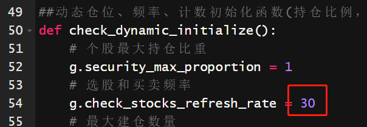
### 
5.把图中红框内函数运行时间都改成14:55
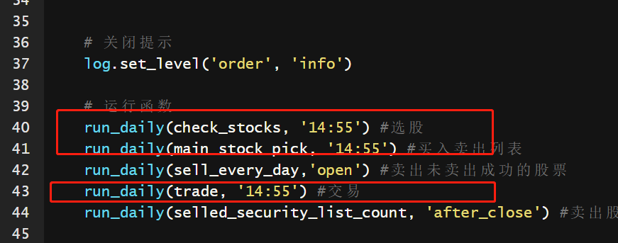
### 
6.此时运行回测就可以了。
### 
这个策略的一个特点就是运行时间不同，购买的股票也不同，但拉长时间来看，这个策略还是不错的。

### 三、用前面讲的框架实现白马股策略
股票池：沪深300成分股+中证500成分股

  

选股逻辑：

  

1\. 业绩筛选：单季度净利润 > 0

2\. 成长性：单季度营收同比增长、环比增长均大于0

3\. 成长性：单季度净利同比增长、环比增长均大于0

4\. 排除妖股：估值在88倍以内

5\. 赚钱能力超过国债：ROE > 4%

6\. 排序：剩余股票ROA由高到低排序，取前10只股票

  
调仓逻辑：策略用轮动的方式进行买卖，每日调仓，在前10名的股票会继续持有，掉出前10名股票就会卖掉。

择时逻辑:  当沪深300指数的70日均线大于前1日收盘价，且90日均线大于70日均线时，清仓，并且不再开仓。直到沪深300前1日收盘价大于70日均线，或者70日均线大于90日均线，才重新开仓。


## 代码框架图解（附录）

# 代码框架图解（附录）
*****
我把几个主要的框架模块都框起来做了简单的解释，大家可以结合着下面的图片已经下一节的代码拆分详解进行学习


## 代码段详解（附录）

# 代码段详解（附录）
*****
这一节我们主要把我的代码框架的几个需要手工判断的地方进行分解

### 1.导入工具包
这段代码没什么好说的，是python的基本操作，就是导入我们需要用的工具包，这点你们具体可以去看看python教程。当然如果暂时不理解，也没关系。
~~~
from kuanke.wizard import *
from jqdata import *
import numpy as np
import pandas as pd
import talib
import datetime
import time
import math

~~~

### 2.初始化函数

这段代码其实就是策略在开始前我们需要准备，或者配置的东西。我把这个模块分成了三块即讲解。
#### 
第一块是基础配置，意思就是配置一些基础性的东西。你们从我在代码里的注释可以看到，这段代码设置了这么几个东西：
#### 
1.设置基准：就是要设置一下，我们策略的收益和什么比。例如和沪深300比，和中证500比。
2.设置滑点：滑点是前一时刻的价格和真实成交价的差值。自动交易的时候特别容易产生滑点，因为自动交易基本用的市价单，而我们手动交易可能经常用限价单。这个不是重点，我就不多解释了，你们只需要记住做策略回测的时候必须要加上滑点。图上我设置了滑点是0.01也就是1%。
3.动态复权：这个也不多解释，用我配置好的就行，你们不需要改动
4.设置成交量比例：这个你们也不用改动。
5.股票手续费：我设置的是万三，万分之三，卖出时佣金万分之三加千分之一印花税, 每笔交易佣金最低扣5块钱。我设置的是市面上普通券商的手续费，你们也不需要改动。

~~~
## 初始化函数，设定要操作的股票、基准等等
def initialize(context):
    # 设定基准
    set_benchmark('000300.XSHG')
    # 设定滑点
    set_slippage(FixedSlippage(0.01))
    # True为开启动态复权模式，使用真实价格交易
    set_option('use_real_price', True)
    # 设定成交量比例
    set_option('order_volume_ratio', 1)
    # 股票类交易手续费是：买入时佣金万分之三，卖出时佣金万分之三加千分之一印花税, 每笔交易佣金最低扣5块钱
    set_order_cost(OrderCost(open_tax=0, close_tax=0.001, open_commission=0.0003, close_commission=0.0003, min_commission=5), type='stock')


~~~
第二块是策略参数配置，你们在这段代码里只看到了5个函数，那是我为了方便，我相应的配置项都封装成了函数。你们可以找找这5个函数在哪。
~~~
    #容器初始化
    check_container_initialize()
    #动态仓位、频率、计数初始化函数
    check_dynamic_initialize()
    # 股票筛选初始化函数
    check_stocks_initialize()
    # 出场初始化函数
    sell_initialize()
    # 入场初始化函数
    buy_initialize()
~~~
第三块是运行函数，这一块相当重要。它是用来配置每个主要函数的运行时间和顺序的。当然你们在使用的时候只需要改时间，因为函数我都写好了，你们不用动。比如你们可以把9:15改成9:20，9:16改成9:30，对了，open代表的就是9:30
~~~
    # 运行函数
    run_daily(check_stocks, '9:15') #选股
    run_daily(main_stock_pick, '9:16') #买入卖出列表
    run_daily(sell_every_day,'open') #卖出未卖出成功的股票
    run_daily(trade, 'open') #交易
    run_daily(selled_security_list_count, 'after_close')
~~~

### 3.动态仓位、频率、计数初始化函数(持仓比例，选股频率，买入频率，卖出频率在这里设置)
这里主要用来设置选股和买卖频率，以及最大减仓数量。其他基本不需要管

~~~
def check_dynamic_initialize():
    # 个股最大持仓比重
    g.security_max_proportion = 1
    # 选股和买卖频率
    g.check_stocks_refresh_rate = 30
    # 最大建仓数量
    g.max_hold_stocknum = 1
    
    #下面这几项不用管
    # 买入频率
    g.buy_refresh_rate = 1
    # 卖出频率
    g.sell_refresh_rate = 1

    # 选股频率计数器
    g.check_stocks_days = 0
    #机器学习选股频率计数器
    g.days = 0
    # 买卖交易频率计数器
    g.buy_trade_days=0
    g.sell_trade_days=0
~~~
### 4.股票池初筛设置函数
这里主要配置股票池初筛的参数，可配置是否过滤停牌，是否过滤退市，是否过滤ST，指数成分股，单个成分股，行业筛选，概念筛选和黑名单

~~~
def check_stocks_initialize():
    # 是否过滤停盘
    g.filter_paused = True
    # 是否过滤退市
    g.filter_delisted = True
    # 是否只有ST
    g.only_st = False
    # 是否过滤ST
    g.filter_st = True
    # 股票池(填指数)
    g.security_universe_index = ['all_a_securities']#这里填写指数，全部股票就填['all_a_securities']，沪深300股票就填['000300.XSHG'],中证500就填['000905.XSHG'],沪深300+中证500就填['000300.XSHG','000905.XSHG']
    # 填成分股(填成分股)
    g.security_universe_user_securities = []
    # 行业列表
    g.industry_list = ["801010","801020","801030","801040","801050","801080","801110","801120","801130","801140","801150","801160","801170","801180","801200","801210","801230","801710","801720","801730","801740","801750","801760","801770","801780","801790","801880","801890"]
    # 概念列表
    g.concept_list = []
    # 黑名单
    g.blacklist=['300268.XSHE','600035.XSHG']
    
~~~

剩下的我就不一一介绍了，大家在做策略的时候可以自己体会，如果有不懂的可以在圈子提问


# 第四章 获取典型常用数据

# 第四章 聚宽获取典型常用数据
*****
这篇主要教大家怎么快速获取聚宽的指数成分股，股票行情数据，股票财务数据。
### 摘要

*   聚宽数据
*   获取指数成分股
*   获取股票行情数据
*   获取股票财务数据
*   自测与自学

* * *

### 聚宽数据

*   在[聚宽数据](https://www.joinquant.com/data)这个页面可以看到聚宽平台集成好的各大类数据，如下图，点击可以查看详情与用法。  
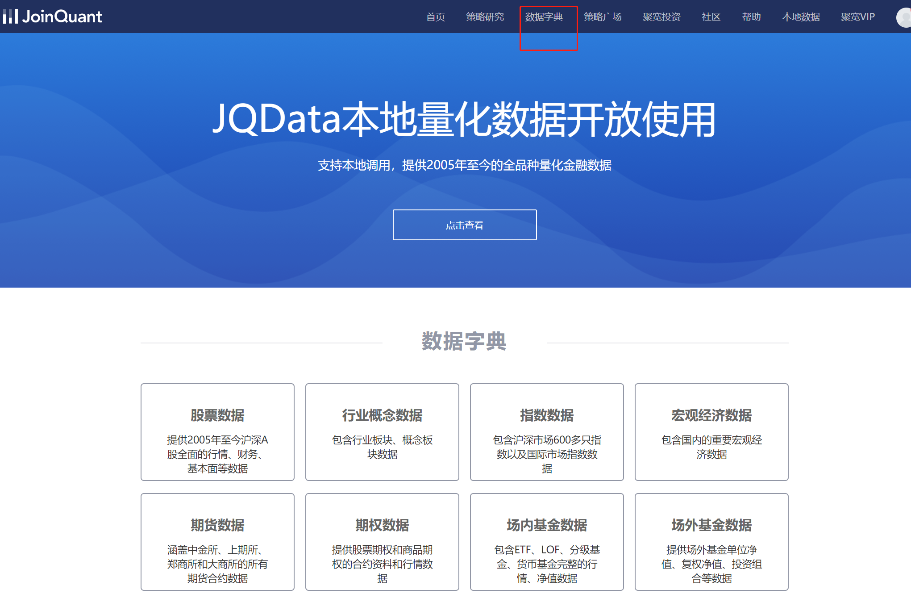
*   但实际上可能有些数据要在API文档里才比较容易能找到，比如龙虎榜数据等。这时用ctrl+f进行网页搜索可以快速搜索需要的数据。  
    
*   接下来会介绍几种常用数据的取用方法，这些取用方法比较典型，掌握后能覆盖基本的数据需求以及较容易的学会使用其他数据。

### 获取指数成分股

*   以免有人不知道指数成分股是什么，简单说明下。为了衡量股市中某一大类股票整体的涨跌情况，通常会用这一类的股票加权平均编制出一个指数，而这些股票则叫做该指数的成分股,一般指数的成分股选取会变动。比如上证指数是用所有上交所的股票编制而成，可以衡量上交所股票整体的涨跌情况，有的股票退市了也就会被剔除成分股。比较常见的指数有上证指数、深证综指、创业板指、沪深300指数、中证500指数、上证50指数等。可以在数据-指数数据-[指数列表](https://www.joinquant.com/indexData)中找到聚宽支持的指数及其指数代码。同样要善用ctrl+f进行搜索。
*   获取指数成分股需要用到的API为[get\_index\_stocks](https://www.joinquant.com/help/api/help?name=api_old#get_index_stocks-%E8%8E%B7%E5%8F%96%E6%8C%87%E6%95%B0%E6%88%90%E4%BB%BD%E8%82%A1)  
    
*   之前讲过怎么看API文档以及函数参数的含义，现在应该能直接看说明使用了。补充一个更详细点的例子应该就会用了。
    
    ~~~
      # 获取20180301时，上证50指数（000016.XSHG）成分股
      t=get_index_stocks("000016.XSHG","2018-03-01")
      print(t[0])
      print(t)
    
      # 打印日志如下。股票代码在list中被打印出来前面会带有的u代表是对字符串进行unicode编码（略复杂，不懂没关系），只是显示效果，单独打印t[0]时就没有u。
    
      # 600000.XSHG
      # [u'600000.XSHG', u'600016.XSHG', u'600019.XSHG', u'600028.XSHG', u'600029.XSHG', u'600030.XSHG', u'600036.XSHG', u'600048.XSHG', u'600050.XSHG', u'600104.XSHG', u'600111.XSHG', u'600309.XSHG', u'600340.XSHG', u'600518.XSHG', u'600519.XSHG', u'600547.XSHG', u'600606.XSHG', u'600837.XSHG', u'600887.XSHG', u'600919.XSHG', u'600958.XSHG', u'600999.XSHG', u'601006.XSHG', u'601088.XSHG', u'601166.XSHG', u'601169.XSHG', u'601186.XSHG', u'601211.XSHG', u'601229.XSHG', u'601288.XSHG', u'601318.XSHG', u'601328.XSHG', u'601336.XSHG', u'601390.XSHG', u'601398.XSHG', u'601601.XSHG', u'601628.XSHG', u'601668.XSHG', u'601669.XSHG', u'601688.XSHG', u'601766.XSHG', u'601800.XSHG', u'601818.XSHG', u'601857.XSHG', u'601878.XSHG', u'601881.XSHG', u'601985.XSHG', u'601988.XSHG', u'601989.XSHG', u'603993.XSHG']
    
    ~~~
    

### 获取股票行情数据

*   此处的股票行情数据指[SecurityUnitData](https://joinquant.com/help/api/help?name=api_old#SecurityUnitData)里面的所有基本属性，以下列举类常用字段，详情请看文档。
    *   open: 时间段开始时价格
    *   close: 时间段结束时价格
    *   low: 最低价
    *   high: 最高价
    *   volume: 成交的股票数量
    *   money: 成交的金额
    *   factor: 前复权因子
    *   avg: 这段时间的平均价
    *   pre\_close: 前一个单位时间结束时的价格
    *   paused: 这只股票是否停牌，是则为1，否则为0
*   history
    
    *   [API文档：history](https://www.joinquant.com/api#history)  
        
    *   **可以同时获得多个股票的数据，但只能获得相同的一个数据字段。**如获得 平安银行，建设银行，农业银行这3只股票，前3天的交易额。
    *   默认不跳过不交易日期，由skip\_paused参数控制。
    *   df参数控制返回结果的数据类型，默认是True代表dataframe类型，稍后我们会讲到，当df为False时就为之前讲过的dict类型。
    *   fq参数控制复权方式，往往可以不管它直接用默认的前复权即可。复权的含义不难，解释略麻烦，建议自行搜索学习下。
    *   接下来介绍的API还会有skip\_paused、df、fq参数，就不再提了。这三个参数新手可以以后慢慢了解，现在不管也没关系，如果不想用dataframe，会把df参数调成False(或0)就行。
        
        ~~~
          # 例子 df=True，返回dataframe类型
          w=history(count=3, field='money', security_list=['000001.XSHE','000002.XSHE'])
          print(w)
        
          # 结果如下：
          #              000001.XSHE   000002.XSHE
          # 2016-08-29  5.322954e+08  1.796321e+09
          # 2016-08-30  5.618541e+08  2.072873e+09
          # 2016-08-31  4.638758e+08  5.748581e+09
        
          # 例子 df=False，返回dict类型
          w=history(count=3, field='money', security_list=['000001.XSHE','000002.XSHE'],df=False)
          print(w)
        
          # 结果如下：
          # {'000001.XSHE': array([  5.32295362e+08,   5.61854066e+08,   4.63875763e+08]), '000002.XSHE': array([  1.79632055e+09,   2.07287325e+09,   5.74858107e+09])}
        
        ~~~
        
*   attribute\_history
    
    *   [API文档：attribute\_history](https://www.joinquant.com/api#attributehistory)  
        
    *   **只能获取单独一个股票的数据，但可以同时获得多个字段的数据。**如获得 平安银行这一只股票，前3天的交易额，交易量，最高价，最低价等。
    *   默认跳过不交易日期，由skip\_paused参数控制。
        
        ~~~
          # 例子
          w=attribute_history(security='000001.XSHE',count=3, fields=['money','high'])
          print(w)
        
          # 结果如下：
          #                    money  high
          # 2016-08-29  5.322954e+08  9.31
          # 2016-08-30  5.618541e+08  9.33
          # 2016-08-31  4.638758e+08  9.36
        
        ~~~
        
*   Pandas.DataFrame
    
    *   返回的财务数据是DataFrame类型，这是一种二维表结构的功能强大的数据类型，常用于数据处理与分析。我们以刚刚的例子介绍下dataframe最常用的获取数据的方法。
        
        ~~~
          # 一个dataframe类型的例子
          w=attribute_history(security='000001.XSHE',count=3, fields=['money','high','open'])
          print(w)
        
          # 结果如下：
          #                    money  high  open
          # 2016-08-30  5.618541e+08  9.33  9.29
          # 2016-08-31  4.638758e+08  9.36  9.32
          # 2016-09-01  4.548486e+08  9.38  9.35
        
        ~~~
        
    *   dataframe是一个二维表，包括index（行标签、索引）、columns（列标签）、values（值）三个部分。取用方法如下，注意三个部分的数据类型不是固定的，因此功能很灵活但也更难使用。
        
        ~~~
          # 获取index
          print(w.index)
          # 结果如下，是datatimeindex类型，很特殊，不常用，建议新手回避。
          # DatetimeIndex(['2016-08-30', '2016-08-31', '2016-09-01'], dtype='datetime64[ns]', freq=None, tz=None)
        
          # 获取columns
          print(w.columns)
          # 结果如下，是index类型
          # Index([u'money', u'high', u'open'], dtype='object')
        
          # 可以用list()将其转成list
          print(list(w.columns))
          # 结果如下
          # ['money', 'high', 'open']
        
          # 获取values
          print(w.values)
          # 结果如下，是一个嵌套的list
          # [[  5.61854066e+08   9.33000000e+00   9.29000000e+00]
          # [  4.63875763e+08   9.36000000e+00   9.32000000e+00]
          # [  4.54848634e+08   9.38000000e+00   9.35000000e+00]]
        
        ~~~
        
    *   选择dataframe某几列
        
        ~~~
          # 按标签获取某几列.loc[:,[列标签名,...]]
          print(w.loc[:,['open','high']])
          # 结果如下
          #             open  high
          # 2016-08-29  9.28  9.31
          # 2016-08-30  9.29  9.33
          # 2016-08-31  9.32  9.36
        
          # 按位置获取某几列.iloc[:,[位置,...]]，位置的含义是第几个，从0开始。下文同。
          print(w.iloc[:,[0,2]])
          # 结果如下
          #                    money  open
          # 2016-08-29  5.322954e+08  9.28
          # 2016-08-30  5.618541e+08  9.29
          # 2016-08-31  4.638758e+08  9.32
        
          # : 即冒号，可以代表全部，iloc或loc都可以。
          print(w.iloc[:,:])
          # 结果如下
          #                    money  high  open
          # 2016-08-29  5.322954e+08  9.31  9.28
          # 2016-08-30  5.618541e+08  9.33  9.29
          # 2016-08-31  4.638758e+08  9.36  9.32
        
          # 选择后的数据依然是dataframe类型，用.values可以获取数据。对后文的行情况也成立。
          print(w.iloc[:,[0,2]].values)
          # 结果如下,是个list
          # [[  5.61854066e+08   9.29000000e+00]
          # [  4.63875763e+08   9.32000000e+00]
          # [  4.54848634e+08   9.35000000e+00]]
        
        ~~~
        
    *   选择dataframe某几行
        
        ~~~
          # 按标签获取某几行.loc[[行标签名,...],:]
          print(w.loc[['2016-08-29','2016-08-31'],:])
          # 此处这样写会报错，原因是当前的行标签类型是DatetimeIndex，不是字符串，所以使用标签名时要注意数据类型。而时间类型的数据处理往往非常麻烦，因此行或列标签名是日期情况下建议新手回避，改使用位置获取。
        
          # 按位置获取某几行.iloc[[位置,...],:]
          print(w.iloc[[0,2],:])
          # 结果如下
          #                    money  high  open
          # 2016-08-29  5.322954e+08  9.31  9.28
          # 2016-08-31  4.638758e+08  9.36  9.32
        
          # : 即冒号，行情况下依然可以代表全部
          print(w.loc[:,:])
          # 结果如下
          #                    money  high  open
          # 2016-08-29  5.322954e+08  9.31  9.28
          # 2016-08-30  5.618541e+08  9.33  9.29
          # 2016-08-31  4.638758e+08  9.36  9.32
        
        ~~~
        
    *   dataframe 行列转置
        
        ~~~
          # 行列转置的意思就是按对角线行列反转，方法是.T
          print(w.T)
          # 结果如下
          #          2016-08-29    2016-08-30    2016-08-31
          # money  5.322954e+08  5.618541e+08  4.638758e+08
          # high   9.310000e+00  9.330000e+00  9.360000e+00
          # open   9.280000e+00  9.290000e+00  9.320000e+00
        
        ~~~
        
    *   回过头来解释下pandas的含义，pandas是一个模块或者叫库，可以让我们直接利用其中包含的已经设计好的函数或数据类型，加快我们的工作效率。pandas主要功能是数据处理与分析，其中dataframe就是属于pandas的，是原生的python语言没有的。随着深入的学习，你会遇到其他的功能模块，一般来说要使用一个模块是要用一行代码加载导入的，但pandas聚宽系统已经自动加载了，不必额外写代码导入了。

### 获取股票财务数据

*   股票财务数据这里是指发股票的公司发布的财务报表中的数据。可以在聚宽数据-[股票财务数据](https://www.joinquant.com/data/dict/fundamentals)查看数据详情。
    
*   财务报表简称财报，是用来向股东汇报企业经营情况的，上市公司必须按季度公布财报，一年有四季所以财报依发布次序一季报、半年报（也称中报）、三季报、年报，而具体的发布日期在一定期限内即可并非固定，年报要求年度结束四个月内披露，半年报是上半年结束后两个月内，一季报与三季报是季度结束后一个月内。特别的是像总市值、市盈率这种跟股价挂钩的市值数据是每天更新的。
    
*   获取股票财务数据需要用到的API为[get\_fundamentals](https://www.joinquant.com/help/api/help?name=api_old#get_fundamentals-%E6%9F%A5%E8%AF%A2%E8%B4%A2%E5%8A%A1%E6%95%B0%E6%8D%AE)。这个语句的用法较为复杂，下文对文档进行补充说明，文档还是要看的。  
    
*   未来函数是什么？
    *   我们做回测去验证策略时，其实是用历史数据去模拟当时的市场从而得知策略在历史上表现如何，但是如果策略利用了历史当时无法得到的信息，往往就会造成回测结果极大失真，这时我们会说这个策略有未来函数。
    *   举一个典型的有未来函数的策略:每天买明天涨停的股票。 事实上你是不能知道明天哪个股票涨停的，所以现实中是不能实现的，但是我们做回测是用的历史数据，所以我们其实是能实现用2012年的数据对这个买明日涨停股的策略做回测的，毕竟现在已经过了2012年，2012年每天哪个股票会涨都是已经知道的了。这样的有未来函数的回测结果肯定是没价值的，因为现实中不能实现，尽管回测结果有时特别喜人。
*   date与statDate的问题
    *   传入date时，查询指定日期date所能看到的最近的数据。 回测时不填则默认值会为回测日期的前一天（模拟现实，避免未来函数）。date参数的要求为格式类似'2015-01-15'的字符串，datetime类型的时间数据也是可以的，不过略复杂不展开。
    *   传入statDate时, 查询 statDate 指定的季度（例如'2015q1'、 '2013q4'的字符串）或者年份（如'2015'、'2013'的字符串）的财务数据。这种用法需要注意的地方比较多，请注意文档中提到的问题。
    *   date和statDate参数只能同时传入其中一个。当 date 和 statDate 都不传入时，相当于使用 date 参数，date 的默认值会为回测日期的前一天。文档中提到的回测模块就是指我们编写策略的功能模块，研究模块我们之后会介绍。因此，为方便在回测中使用，date 和 statDate 都不传入。
*   单季度与报告期。
    *   之前讲过，财务数据按季度发布，一般财经网站上提供的财务数据是默认按报告期提供的，即每季度统计的周期跨度分别为第一季度、前两个季度、前三个季度、前四个季度（全年）。
    *   而聚宽考虑到量化分析，提供的财务数据全是单季度的，即每季度统计的周期跨度分别为第一季度、第二季度、第三季度、第四季度。
    *   因此，当你发现聚宽财务数据比财经网站的财务数据差的很多时，很可能是单季度与报告期的差别造成的。
*   query\_object参数以及快速上手模板
    
    *   query\_object参数是要求传入一个Query对象用于描述所需的数据，这个东西展开讲相当于一门小的编程语言，麻烦而不必要，这里提供一个快速上手的模板用来产生query\_object参数，多数情况下往里套就可以了，例子如下，建议对比文档里的例子看看。
        
        ~~~
          # 快速上手模板
          # query(表.字段).filter(筛选条件).order_by(排序方法).limit(数量上限)
          #比较长的话可以分行写
        
        ~~~
        
    *   表和字段可以在财务数据文档查看，如下。表和字段可以写多个用逗号隔开，只写表名不写字段代表选择该表的所有字段。注意看含义与单位。
        
        
        
    *   筛选条件跟讲if判断时用的条件是一样的，多个条件用逗号隔开代表与（and）的关系。特别的是要用复杂的与或非的逻辑关系时，在此处and、or、not是不能用的，要对应的改用&（与）、|（或）、~（非）。
        
    *   排序的写法比较简单，就是要作为排序标准的字段后面加.desc()即由大到小，或.asc()即由小到大。
    *   数量上限可以自己设置，代表最多返回的数据条数。不过系统强制限制每次最多返回10000条，就算你自己在此处限制比10000多也没用。
        
        ~~~
          # 例子
          # 获取 市值表.股票代码，资产负债表.未分配利润
          q=query(valuation.code,balance.retained_profit
          # 筛选 市值大于100 并且 市盈率小于10
          ).filter(valuation.market_cap>100,valuation.pe_ratio < 10
          # 排序 按市值从大到小排
          ).order_by(valuation.market_cap.desc()
          # 数量 上限10条数据
          ).limit(10)
          w=get_fundamentals(q)
          print(w)
        
          # 结果如下：
          #           code  retained_profit
          # 0  601398.XSHG     8.566400e+11
          # 1  601939.XSHG     7.400340e+11
          # 2  601288.XSHG     4.644490e+11
          # 3  601988.XSHG     5.267460e+11
          # 4  600036.XSHG     1.816520e+11
          # 5  601328.XSHG     9.208500e+10
          # 6  600000.XSHG     1.037620e+11
          # 7  600016.XSHG     1.277570e+11
          # 8  601166.XSHG     1.573490e+11
          # 9  601998.XSHG     1.298680e+11
        
        ~~~
        

### 自学与自测

*   实践下文中例子。
*   浏览聚宽数据中包括的数据，试着取用下。

*   获取任一股票最近5个交易日最高价的平均价。
*   生成一个list，list中为上证指数成分股中流通市值最大的5个股票的股票代码。


# 第五章 策略评价与建立模拟

# 第五章 策略评价与建立模拟
*****
### 摘要

*   评价策略回测的指标
*   建立模拟交易
*   未来函数
*   运行过慢
*   过拟合
*   策略失效
*   收益与风险的取舍
*   自测与自学

* * *

*   在学习了如何编写策略后，我们将介绍下评价策略回测的指标，如何建立模拟交易，以及除回测之外还有哪些需要关注的方面。

### 策略回测指标

*   如下图，一个策略回测后会给出一些指标，可以在[API文档：风险指标](https://joinquant.com/help/api/help?name=api#%E9%A3%8E%E9%99%A9%E6%8C%87%E6%A0%87)查看这些指标的公式及基本说明。下文将补充介绍下几个重要指标。  
    
*   策略收益。这是最基础的指标，衡量回测期间策略收益率的。
*   基准收益。基准默认是沪深300指数，所以此指标是回测期间基准收益率的。一般来说，基准收益代表市场整体的收益情况，所以如果策略收益长期低于基准收益，往往意味着策略是失败的。通过set\_benchmark()这个API可以自定义基准。
*   **年化收益率**。年化收益率是一个衡量策略盈利能力的重要指标，越大越好。刚刚讲的策略收益这个指标是和回测时间长短强相关的，比如一个普通策略运行10年肯定比优秀的策略跑半年策略收益高，但这样就不利于比较策略的盈利能力。因此，通过数学方法，把策略收益统一互相化归为一年时间的收益率，比如10年的变为平均每年的收益率，半年的变为以这半年盈利能力运行一年的收益率，如此一来，让策略盈利能力在比较时有了一个大致等同的时间标准。
*   **最大回撤率**。最大回撤率是一个衡量策略风险的重要指标，越小越好。新手初见这个指标的时候可能会感到一点点的困难，其实这个指标是对应着一个很自然的想法的，比如，你现在要实盘用真钱去跟一个策略操作，而你现在是知道这个策略的过去一段时间的历史收益曲线的，你觉得你的最大亏损率估计是多少？建议读者自己随手画下几条曲线当做历史收益曲线，思考下这个问题。一个经典的回答就是最大回撤率的含义，它的思路是这样的，既然我们还在拿历史数据做回测，说明我们应当还是相信历史对未来有指导意义的，那么我现在实盘用真钱去跟策略操作，接下来我们假设策略收益的未来走势应当是跟历史走势相当的，历史走势有一直涨的时候，也有一直跌的时候，那么我实盘跟策略最大亏损率应该就是，我刚开始跟策略就开始走的跟历史走势中一直跌的那一段那样，而且是一直跌且跌的最多的那段，那么历史走势中一直跌且跌的最多的那段跌跌了多少呢？用人眼一般很容易找到是哪段，而且聚宽的回测图中也标出了，如下图。不过不妨进一步思考下怎么算出最大回撤率，然后看下文档中的公式说明，看你的结果是否正确。当然，初学者知道最大回撤率越小越好可能就够了，但有志者应该借机学习如何思考如何评估风险以及量化风险，因为难度相对不高。  
    
*   **交易次数**。交易次数其实是一个可以初步衡量策略回测结果是否可靠的指标，过少往往意味着回测结果不可靠。试想这样一种情况，别人给你推荐一个策略，策略进行了10年历史数据的回测，年化收益非常高，最大回撤非常小，你很高兴，但仔细一看，交易次数只有2次，此时，你愿意用真金白银去使用这个策略吗？你难免会想可能只是这2次操作运气好而已，这样的回测结果虽好但是不可信不可靠。其实这基于一个简单统计学思想，样本过少，则统计结果不可靠，所以足够多的交易次数才能让回测结果有说服力。目前，回测结果中不能直接看到交易次数了，可以通过回测结果页面的其他指标中的盈利次数与亏损次数相加得到，也可以通过回测结果图表下面的每日买卖大致看出，位置如下图。  
    
*   Alpha（阿尔法）与Beta（贝塔）。在资本资产定价模型（CAPM）中，投资组合的收益被分为和市场系统风险相关与和市场系统风险无关的两部分，而Beta与Alpha这两个希腊字母则是该模型中的两个重要系数，分别代表这相关部分与无关部分。其实策略持有的股票可以看成一个投资组合，基准收益作为市场系统收益，Beta则是代表相关部分的策略收益相对市场波动的倍率，如Beta为2则代表市场涨1%，相关部分的策略收益波动涨大概2%（统计意义上并非实时精确），beta为负数代表与市场反向变动。而Alpha则代表独立于市场波动不受其影响的无关部分的策略收益，越大越好，所以如果策略年化收益为负但Alpha为正而且很大，说明策略有超过市场的盈利能力，不过策略整体盈利被与市场相关部分拉下来了。为了便于理解，Alpha与Beta的含义讲的很粗暴，建议数理基础不错的有志者有空去自学下Alpha与Beta的构造思路与过程。
*   夏普比率（Sharpe Ratio）。代表所承担的单位风险所带来的收益，越大越好。夏普比率是在资本资产定价模型进一步发展得来的，不展开讲。

### 建立模拟交易

*   之前讲过回测是用历史数据模拟执行策略，模拟交易是用未来的实际行情模拟执行策略，因此当策略完善的自以为差不多没什么问题时，建议建立一个模拟交易观察一段时间，当作进一步的检验。建立的模拟交易的方法很简单，点击回测结果界面，如下图，右上部红色模拟交易按钮，即可新建模拟交易。  
    
*   建立模拟交易成功后，点击聚宽导航栏我的交易，可以看到创建的模拟交易，如下图。  
    
*   点击右边的微信通知开关，将OFF调到ON，按照指示扫描二维码，绑定微信，就能微信接收交易信号了。当策略买卖操作，微信会收到信号提醒类似下图。自定义消息内容请看[API send\_message](https://joinquant.com/help/api/help?name=api_old#%E5%8F%91%E9%80%81%E8%87%AA%E5%AE%9A%E4%B9%89%E6%B6%88%E6%81%AF%E2%99%A0)。  
    

### 未来函数

*   未来函数的前文讲过，即指策略利用了历史当时无法得到的信息，造成回测结果极大失真。未来函数排查方法一般是人工查看，重点看一切跟时间有关的地方，尤其注意各个API关于时间的默认处理方法。当然有时未来函数隐藏的很隐蔽，而更好但稍花时间的方法是用策略建立模拟交易，一般让模拟交易运行几天，多数未来函数问题都能被发现，因为模拟交易是不可能引入未来数据的，所以往往引入未来函数的策略无法成功运行模拟交易。
*   需要注意的是有时同一个代码的策略在模拟交易中是没有引入未来函数的，而是在历史回测中引入未来函数。此时会发现历史回测结果很好，模拟交易也能正常运行，但回测结果是失真的，而模拟交易运行时间长了往往也与回测相去甚远。一个具体的情况是，策略无意中引入了未来信息，导致策略选的股票过去一年中涨的最好的股票买，那么当然用过去一年做回测时效果会很好，但在模拟交易中可能就效果很差。
*   一条判断策略引入未来函数的经验法则是，当你发现策略回测收益极高，回撤又极低，而且各个时间段表现都特别好，感觉自己发现了自动印钞机式的交易策略时，则此策略大概率是引入未来函数了：）

### 运行过慢

*   策略的运行效率也是需要关注的问题，尽管新手几乎不会遇到，但需要简单了解下，有个意识。有时策略比较复杂，计算量会很大，极端时可能会造成交易延迟，延误买股票的时机，分钟级策略尤其需要关注下耗时问题，而相关函数就是[enable\_profile() API文档-性能分析](https://www.joinquant.com/help/api/help?name=api_old#%E6%80%A7%E8%83%BD%E5%88%86%E6%9E%90%E2%99%A0)
*   用法就是把enable\_profile()这行代码复制粘贴放到策略代码的第一行。然后你成功回测后可以在回测详情页面查看性能分析的结果，如下图，从而可以查看哪行代码耗时比较多，从而有目的性的去改进。  
    

### 过拟合

*   过拟合（overfitting）常用于描述这样的情况。策略一般都有一些参数，如持股数量、交易频率等，选择不同的参数，固定的一份历史数据下，策略的回测结果好坏也不同，人们往往会选回测结果最好的参数作为策略的参数使用，但随后若换了一份历史数据（换一个时间段）做回测或随后用现实数据运行模拟或实盘，发现效果远不如之前的回测结果，此时很可能策略的参数过拟合了，或说之前选回测结果最好的参数这一行为使参数过拟合了。当参数多的时候，更容易发生。
*   过拟合的核心思想是，过度细致的解读样本数据，从而没有认识到本质的规律，从而使策略或系统失去了普适性，对原样本数据表现极其优异，但对非原样本数据外情况的有效性大大降低。
*   一个关于帮助理解过拟合的比喻是，老师拿一个试卷（样本数据）考学生（策略），学生成绩不理想，老师要教学生（调整参数），此时老师不是教学生学科原理，而是教学生背试卷的答案（过度拟合），当然结果会导致，当再考同一个试卷时学生肯定表现极度优异，但因为只背了答案而没理解原理，所以当换套题目或应用时学生就表现极差了。
*   因此在选择并优化策略的参数时，要考虑参数的**鲁棒性**，即策略好坏对参数变化的敏感性。对于参数优化与选择对应有复杂最优化理论与鲁棒性测试，对初学者在此问题建议是，控制参数数量，多测几组参数大致看下参数变化对策略的影响，另外考虑进行样本外测试，即用一份样本数据回测挑选参数，用另一份样本数据回测看选择的参数在样本外情况下表现如何。

### 策略失效

*   策略一般是有时效的。当你的策略十分完善，并且模拟效果理想，实盘效果也很理想，不要以为策略就会像印钞机一样一直赚钱，策略可以失效的，比如当策略运行中出现历史上罕见的情形时往往就要警惕了，比如最大回撤创历史新高，策略收益率不再增加甚至减少等。如何判断策略是否失效以及找出失效的原因并无通法，但策略失效的原因可能有以下几种，可供参考。
*   策略生效的逻辑基础不再成立。比如策略的有效性是建立在涨跌停制度下的、或是建立在某行业不断成长前提下的、或是建立在全球某资源持续稀缺前提下的等，当这些制度或前提不再成立，如制度调整、新政发布、科技进步等，那么策略自然也就失效了。因此，理解策略有效的逻辑是十分重要的。
*   操作资金量过大。更大的操作资金，会导致更大的冲击成本，即使买入时价更高、卖出时价更低，而当操作资金过大使市场流动性不足承载时，冲击成本会极大的变高，大大降低利润，甚至导致亏损。所以策略是有资金容量的，建议逐步增大策略操作资金量。
*   市场上运行的相似策略过多。同类相似的策略都想赚市场上的同一份钱，然而这份钱是有限的，所以这些策略彼此间会竞争，导致策略赚钱变难，甚至完全失效赚不到钱。具体的表现可能是要买的股票买不到、想卖的股票卖不到理想价位等。因此，交易行业是非常注意保密且不适合分享的行业，而有志者则要注重培养自学能力。
*   市场出现了寄生策略。当你的策略被发现市场中的有心人发现并足够程度的监测时，他可以写出一个针对你策略的策略，从而寄生在你的策略上，比如在比你买之前买入，在你买后拉升股价后卖。这种针对你策略的寄生策略，往往会压缩你策略的盈利空间，使策略失效。

### 收益与风险的取舍

*   往往策略的收益能力与抗风险能力是互相制约不能兼顾的，两者之间如何取舍建议是，达到基本的收益能力后，极力追求低风险，理由是盈利水平往往可以通过增加资金量来提高。具体的讲就是，策略a是一个年化收益率300%，最大回撤率50%的策略，策略b是一个年化收益率30%，最大回撤率5%的策略，只要给策略b提供相当于策略a的10倍的资金量，两者盈利能力就是一样的，但很难让策略a有像策略b一样的抗风险能力。

### 自测与自学

*   尝试下建立模拟以及用微信接收交易信号。
*   策略成功回测后，体验下归因分析这个新功能，位置如图。  
    


# 第六章 经典策略学习

# 第六章 经典策略学习
*****
### 摘要

*   各类经典策略

* * *
这部分主要收集了各类比较经典的策略供大家学习参考。


## RSRS择时+基本面选股

# RSRS择时+基本面选股
2026-0427修改为可以用python3运行
*****
策略出处：聚宽-K先放荡不羁 
*****
*   近期市场早已提前入冬，普通小韭和机构大佬都在裹紧外衣抵御市场寒冬，在春天还没有到来之际，不能只是等待，不如静下来好好做些功课。
*   我们都在市场中苦苦寻找圣杯，希望能够找到长期战胜市场的投资方法，比如曾经风光无限的小市值的思路，带给了我们很大的信心，相信市场中是存在长期有效的超额收益的，直到2017年初失效。毕竟没有什么是一成不变的，市场在牛熊交替中也是不断变换风格，想在市场中一劳永逸，可能只是不像咸鱼的韭菜了。除非是发现了如下的策略方法（滑稽脸）。  
    

#### 十三年超额收益稳健

*   在了解如上策略之前，我们先来看下下面的策略  
    
*   该策略基于财务因子进行选股，从2005年到2018年，十三年的时间，累计获得收益2395.74%的收益，是同期上证指数的20倍左右，年化27%的收益似乎看起来也不是很高，但是该策略却有着长期较为稳定的超额收益，可以看到，收益图中黄线代表超额收益，在长达十三年的时间里都有着平稳上升的超额收益！
*   那这样的策略距离直接拿来用还是有很多可以提升的地方，比如可以在这个基础上拿股指期货进行对冲，或者进行择时。我们看到策略有接近1的贝塔，熊市时候和大盘一起跌，产生较大的回撤，进行归因分析后取回撤的区间统计图示，可以看到和市场本身的熊市一致。那么我们想到，如果策略能够在熊市保住收益，应该会有更好的表现。  
      
    

#### 牛市作为，熊市蛰伏

*   A股市场里个股与大盘的相关性很高，针对前面提到的选择精准的进场出场时间，规避熊市回撤较大的问题，我们想到可以借助近来表现不错的RSRS，支持阻力相对强弱指标进行大盘择时
*   RSRS，阻力支撑相对强度指标（Resistance Support Relative Strength，简称 RSRS），出自光大证券的一篇技术择时系列的研究报告，其思路就是，以每天最高最低价格替代传统技术分析中的支持阻力，以最高价最低价变化的相对强弱替代支撑阻力具体价格阈值。下面是其思路的一些说明，具体也可参考研报和量化课堂的RSRS介绍的内容
    
    *   用最低价每变动 1的时候，最高价变动的幅度来衡量支持阻力的强弱
    *   拿同时间段最高价、最低价的序列，进行回归，模型的 beta 值就是所需要的斜率，即衡量支持阻力的具体指标。
        
        ~~~
        import statsmodels.api as sm
        import matplotlib.pyplot as plt
        #step1 获取数据的高低点
        security = '000001.XSHG'
        prices = get_price(security, '2005-01-05', '2010-01-01', '1d', ['high', 'low'])
        highs = prices.high
        lows = prices.low
        #step2 计算斜率，进行记录
        long = 18
        beta_list = []
        for i in range(long,len(highs)):
          y = highs[i-long:i]
          x = lows[i-long:i]
          X = sm.add_constant(x)
          model = sm.OLS(y,X)
          results = model.fit()
          beta_list.append(results.params[1])
        plt.hist(beta_list,bins=50)
        
        ~~~
        
        
        
    *   拿斜率进行阈值设置的话其波动较大，效果不佳，这里直接采用研报中将斜率值进行标准化（标准分的形式，如上图所示），且考虑拟合效果在内，将标准分进行决定系数(回归结果里的R方值)加权，效果如下图所示，最后我们直接采用效果显著的右偏标准分，右侧标准分决定抄底买入时机  
        
        

*   下图是RSRS择时效果展示，基准为沪深300指数，交易标的同为沪深300指数，自2010至今的回测效果图展示，8年时间，最大回撤仅为17.7%，我们可以看到空仓时机，与大盘顶底基本吻合，简直是逃顶抓底的神器。下图展示就是应用在交易自身标的策略中的收益情况。  
    

#### 完美合璧，1+1>2

*   按如上思路，我们把开篇提到的有超额收益的策略，与这个RSRS大盘择时方法结合，就得到了这次所要分享的策略，通过RSRS指标的精准择时，在熊市中能够保住收益，在非熊市时能够获得市场收益和策略的超额收益。我们通过在研究中调用策略回测结果，在同一时间范围内，分别展示了开篇提到的有超额收益的策略收益、RSRS择时策略收益、前两者结合的策略收益、基准收益的四条收益曲线，收益结果如下所示  
    
*   近5年里，单纯策略的收益为146.50%（价值策略）、RSRS择时策略的收益为178.84%（风险策略）、前两者结合的策略收益为353.85%（综合策略），将价值选股思路与RSRS择时思路结合之后得到了1+1>2的效果！
*   由于策略里需要统计近5年的样本数据，数据最早是2005年，这里将综合策略从2010年开始进行了回测，，策略获得了年化近30%的收益，夏普率达到1.4，回撤控制在20%以内，近八年回测结果如下  
    
*   策略持仓10只股票，八年时间交易1400次交易，一年约20次调仓，风险超过阈值全部清仓，单只股票历史最高仓位占比不超过14%，策略非个别股票贡献大部分收益，持仓收益贡献最大的10只股票如下  
    
*   Brinson归因分析收益分解，超额收益、主动配置为策略贡献几乎全部收益  
    

#### 总结

策略通过将长期拥有超额收益的财务因子策略作为选股，与大盘择时方法RSRS相结合，保证了策略近30%的年化收益，规避了熊市风险，使得策略表现不俗，在2017年大量策略失效的时候依然能够战胜市场，稳定盈利。感兴趣的朋友们可以进一步对参数敏感度以及斜率处理部分进行更细致的处理，亦或参考以RSRS择时加超额收益选股的思路进行更多的探索。


#### 策略源码
大家把下面这段源码直接复制到聚宽上就可以运行
```
'''
策略思路：
选股：财务指标选股
择时：RSRS择时
持仓：有开仓信号时持有10只股票，不满足时保持空仓

'''
'''
策略思路：
选股：财务指标选股
择时：RSRS择时
持仓：有开仓信号时持有10只股票，不满足时保持空仓

'''
# 导入函数库
import statsmodels.api as sm

# 初始化函数，设定基准等等
def initialize(context):
    # 开启动态复权模式(真实价格)
    set_option('use_real_price', True)
    # 过滤掉order系列API产生的比error级别低的log
    # log.set_level('order', 'error')
    set_parameter(context)
    ### 股票相关设定 ###
    # 股票类每笔交易时的手续费是：买入时佣金万分之三，卖出时佣金万分之三加千分之一印花税, 每笔交易佣金最低扣5块钱
    set_order_cost(OrderCost(close_tax=0.001, open_commission=0.0003, close_commission=0.0003, min_commission=5), type='stock')
    
    ## 运行函数（reference_security为运行时间的参考标的；传入的标的只做种类区分，因此传入'000300.XSHG'或'510300.XSHG'是一样的）
      # 开盘前运行
    run_daily(before_market_open, time='before_open', reference_security='000300.XSHG') 
      # 开盘时运行
    run_daily(market_open, time='open', reference_security='000300.XSHG')
      # 收盘后运行
    #run_daily(after_market_close, time='after_close', reference_security='000300.XSHG')
    
'''
==============================参数设置部分================================
'''
def set_parameter(context):
    # 设置RSRS指标中N, M的值
    #统计周期
    g.N = 18
    #统计样本长度
    g.M = 1100
    #首次运行判断
    g.init = True
    #持仓股票数
    g.stock_num = 10
    #风险参考基准
    g.security = '000300.XSHG'
    # 设定策略运行基准
    set_benchmark(g.security)
    #记录策略运行天数
    g.days = 0
    #set_benchmark(g.stock)
    # 买入阈值
    g.buy = 0.7
    g.sell = -0.7
    #用于记录回归后的beta值，即斜率
    g.ans = []
    #用于计算被决定系数加权修正后的贝塔值
    g.ans_rightdev= []
    
    # 计算2005年1月5日至回测开始日期的RSRS斜率指标
    prices = get_price(g.security, '2009-01-05', context.previous_date, '1d', ['high', 'low'])
    highs = prices.high
    lows = prices.low
    g.ans = []
    for i in range(len(highs))[g.N:]:
        data_high = highs.iloc[i-g.N+1:i+1]
        print(data_high)
        data_low = lows.iloc[i-g.N+1:i+1]
        X = sm.add_constant(data_low)
        model = sm.OLS(data_high,X)
        results = model.fit()
        g.ans.append(results.params[1])
        #计算r2
        g.ans_rightdev.append(results.rsquared)
    
## 开盘前运行函数     
def before_market_open(context):
    # 输出运行时间
    #log.info('函数运行时间(before_market_open)：'+str(context.current_dt.time()))
    g.days += 1
    # 给微信发送消息（添加模拟交易，并绑定微信生效）
    send_message('策略正常，运行第%s天~'%g.days)

## 开盘时运行函数
def market_open(context):
    security = g.security
    # 填入各个日期的RSRS斜率值
    beta=0
    r2=0
    if g.init:
        g.init = False
    else:
        #RSRS斜率指标定义
        prices = attribute_history(security, g.N, '1d', ['high', 'low'])
        highs = prices.high
        lows = prices.low
        X = sm.add_constant(lows)
        model = sm.OLS(highs, X)
        beta = model.fit().params[1]
        g.ans.append(beta)
        #计算r2
        r2=model.fit().rsquared
        g.ans_rightdev.append(r2)
    
    # 计算标准化的RSRS指标
    # 计算均值序列    
    section = g.ans[-g.M:]
    # 计算均值序列
    mu = np.mean(section)
    # 计算标准化RSRS指标序列
    sigma = np.std(section)
    zscore = (section[-1]-mu)/sigma  
    #计算右偏RSRS标准分
    zscore_rightdev= zscore*beta*r2
    
    # 如果上一时间点的RSRS斜率大于买入阈值, 则全仓买入
    if zscore_rightdev > g.buy:
        # 记录这次买入
        log.info("市场风险在合理范围")
        #满足条件运行交易
        trade_func(context)
    # 如果上一时间点的RSRS斜率小于卖出阈值, 则空仓卖出
    elif (zscore_rightdev < g.sell) and (len(context.portfolio.positions.keys()) > 0):
        # 记录这次卖出
        log.info("市场风险过大，保持空仓状态")
        # 卖出所有股票,使这只股票的最终持有量为0
        for s in context.portfolio.positions.keys():
            order_target(s, 0)
            
#策略选股买卖部分    
def trade_func(context):
    #获取股票池
    df = get_fundamentals(query(valuation.code,valuation.pb_ratio,indicator.roe))
    #进行pb,roe大于0筛选
    df = df[(df['roe']>0) & (df['pb_ratio']>0)].sort_values('pb_ratio')
    #以股票名词作为index
    df.index = df['code'].values
    #取roe倒数
    df['1/roe'] = 1/df['roe']
    #获取综合得分
    df['point'] = df[['pb_ratio','1/roe']].rank().T.apply(f_sum)
    #按得分进行排序，取指定数量的股票
    df = df.sort_values('point')[:g.stock_num]
    pool = df.index
    log.info('总共选出%s只股票'%len(pool))
    #得到每只股票应该分配的资金
    cash = context.portfolio.total_value/len(pool)
    #获取已经持仓列表
    hold_stock = context.portfolio.positions.keys() 
    #卖出不在持仓中的股票
    for s in hold_stock:
        if s not in pool:
            order_target(s,0)
    #买入股票
    for s in pool:
        order_target_value(s,cash)
#打分工具
def f_sum(x):
    return sum(x)
        
## 收盘后运行函数  
def after_market_close(context):
    #得到当天所有成交记录
    trades = get_trades()
    for _trade in trades.values():
        log.info('成交记录：'+str(_trade))
    #打印账户总资产
    log.info('今日账户总资产：%s'%round(context.portfolio.total_value,2))
    #log.info('##############################################################')


```


## 网格交易

# 网格交易
*****
出处：聚宽-陈小米
#### 网格交易是啥子

这是一种仓位策略，用于动态调仓。该大法秉持的原则是"仓位策略比选股策略更重要"。当然，我们做策略的，选出好的股票池是我们孜孜不倦的追求~~

* * *

#### **一、几个基本概念**

*   1.**底仓价**：价格的标准线，建仓和调仓的重要依据。
*   2.**低吸高抛**：仓位控制贯彻低吸高抛，绝不追涨杀跌。根据网格设置买卖价位。下面举个例子  
    
*   *   在底仓价的附近，我们根据网格的大小，比如每跌3%按仓位买入（第一档：买40%，第二档：买30%，第三档：买20%，第四档：买10%）。要**注意**的是，这里买卖不是绝对的定量，而是调仓到对应仓位。如果第一次跌破3%，而后上涨到5%时，是不操作的，因为下跌时只建了40%的仓，而上涨5%的仓位是60%，不够抛出。
*   3.**网格大小**：上图给出了3种网格大小。特点是**买入网格小于卖出网格**。这种不对称编织网格的道理在于网格的目的是网获利润，将利润建立在趋势的必然性中，而不仅仅是靠震荡的偶然性。

* * *

#### 先讲特点和局限吧

首先，定理&公理：**没有万能的策略**。

*   1.**趋势**决定策略的成败。在长期的上涨趋势中策略才能获得满意回报。
*   2.**选股**集中在波动大、成长性好的中小市值股票。不断盘整的周期股、大盘股和业绩不佳的垃圾股踩中就麻烦了。
*   3.**底仓价格**设定在安全边际内。在估值顶部设立底仓价格风险极大，会造成很大的损失。
*   4.**牛市表现不佳**。分散的仓位策略，没有依据价格形态来修改网格，都可能在牛市中跑输大盘。降低贝塔的代价就是阿尔法也较低。
*   5.**买卖规则不灵活**，可能使一些重要的突破支持或阻力位置的买卖点被忽略在网格之外。

* * *

#### **二、来看看策略步骤**

1.**选股**

*   重点行业：I64 互联网和相关服务，I65 软件和信息技术服务业
*   低估值PE小：PE<50
*   小市值：分行业按市值排列选市值小的30只
*   高波动：分行业在市值最小的30只中选出过去一年波动率最大的5只股票
*   So，我们的股票池有10只股。每3个月按上述条件更新一次股票池，更新时不在新股票池的股票全部清仓。

2.**网格**：\[-3%买，5%卖\]、\[-5%买，10%卖\]、\[-8%买，15%卖\]、\[-12%买，20%卖\]

*   四种大小的网格都会相应尝试一下看看效果。

3.**资金安排**：在仓位控制时，满仓的概念是（总资金/股票池总数\*2.5）

*   后面的乘数是为了提高资金利用率，因为3个月的周期内可能不是每只股票都能达到满仓。

* * *

#### 好啦，收韭菜的时候到了

回测做了很多组，大致是分市场行情（牛、震荡和熊）各做了一次。然后在震荡期调整网格大小分别做了4次。  
  


* * *

#### **三、结论**

*   1.记住啦：**熊市大网格、震荡小网格、长周期中间网格**。这个比较好理解，网格小意味着操作频繁，震荡周期就是勤能补拙了，多多的交易，熊市的话大网格容忍度高一些。
*   2.【熊市】：选取2015-6-1至2016-1-26日，大网格-12%买，20%卖。最好的结果是半年多盈利20%（大盘同期大跌35%），**年化40%+**  
    
*   【长周期】：选取2010-1-1至2015-12-31日，中网格-8%买，15%卖。最好的结果是6年241%（大盘同期4%），**年化23%**。  
    
*   【震荡期】：选取2012-1-1至2013-12-31日，小网格-3%买，5%卖。最好的结果2年68%（大盘同期-0.5%），**年化29.6%**。  
    
*   3.下面上一个**熊市大网格**的回测结果，剩下的大家可以自己**克隆代码**改参数试咯~

* * *

#### **四、补充**

1.**小市值选股对策略的影响**。这是个讲交易方法的策略，那么高收益是否因为按小市值筛选股票得来的呢？  
仔细看代码会发现，这个策略选股的要点是波动率，而非小市值。下面加一下去掉小市值条件的长周期回测效果（加小市值：240%，不加小市值232%，并没太大的影响）  


2.**行业选取对策略的影响**  
高成长性行业的股票本来就收益可观，那我们看看控制单一变量，去掉网格交易方法，长期持有股票池的股票效果如何。注意：这里每3个月股票池轮换还是在做的，大盘止损的条件也不变。（长期持有：157%，运用网格交易：240%，采用网格交易收益更高，回撤也小一些）  


#### **五、策略源码**
可以直接复制到聚宽，运行
```
import numpy
import pandas as pd
from pandas import Series
def initialize(context):
    g.count = 30
    g.cash = 1000000
    g.buy_stock = []
    g.initial_price = {}
    g.month = context.current_dt.month
    run_monthly(select_stock_by_industry,1,'open')
# 选股
# 重点行业，低估值PE小，优质蓝筹市值大，高波动
def select_stock_by_industry(context):
    #每3个月更新
    month = context.current_dt.month
    if month%3 != g.month%3:
        return
    industry_list = [
    #'C27','C39','I63',
    'I64','I65'
    #'K70',
    #'M73','M74'
    #,'N77','R86','R87'
    ]
    stocks = []
    for industry_code in industry_list:
        stock_set = get_industry_stocks(industry_code)
        #选fundamental比较好的前15只,pe_ration<30，market_cap，按market_cap取后20只股票。
        q = query(
            valuation.code, valuation.market_cap, valuation.pe_ratio
        ).filter(
            valuation.code.in_(stock_set),
            valuation.pe_ratio < 50
        ).order_by(
            valuation.market_cap.desc()
        ).limit(
        g.count
        )
        df = get_fundamentals(q)
        stock_set = list(df['code'])
        #取波动率最高的2只
        variance_list = []
        for stock in stock_set:
            variance_list.append(variance(stock))
        s1 =Series(variance_list,index = stock_set).rank()
        stocks = list(s1[s1 < 6].index)
        for stock in stocks:
            g.buy_stock.append(stock)
            g.initial_price[stock]=0
    set_universe(g.buy_stock)
    reset_position(context)
    return None
# 轮换选股后清除新股票池外的持仓
def reset_position(context):
    if context.portfolio.positions.keys() !=[]:
        for stock in context.portfolio.positions.keys():
            if stock not in g.buy_stock:
                order_target_value(stock, 0)
    return None
# 计算波动率
def variance(security_code):
    hist1 = attribute_history(security_code, 180, '1d', 'close',df=False)
    narray=numpy.array(hist1['close'])
    sum1=narray.sum()
    narray2=narray*narray
    sum2=narray2.sum()
    N = len(hist1['close'])
    mean=sum1/N
    var=sum2/N-mean**2
    return var

# 计算股票前n日收益率
def security_return(days,security_code):
    hist1 = attribute_history(security_code, days + 1, '1d', 'close',df=False)
    security_returns = (hist1['close'][-1]-hist1['close'][0])/hist1['close'][0]
    return security_returns

# 止损，根据前n日收益率
def conduct_nday_stoploss(context,security_code,days,bench):
    if  security_return(days,security_code)<= bench:
        for stock in g.buy_stock:
            order_target_value(stock,0)
            log.info("Sell %s for stoploss" %stock)
        return True
    else:
        return False
# 计算股票累计收益率（从建仓至今）
def security_accumulate_return(context,data,stock):
    current_price = data[stock].price
    cost = context.portfolio.positions[stock].avg_cost
    if cost != 0:
        return (current_price-cost)/cost
    else:
        return None

# 个股止损，根据累计收益
def conduct_accumulate_stoploss(context,data,stock,bench):
    if security_accumulate_return(context,data,stock) != None\
    and security_accumulate_return(context,data,stock) < bench:
        order_target_value(stock,0)
        log.info("Sell %s for stoploss" %stock)
        return True
    else:
        return False

# 选股：连续N日下跌
def is_fall_nday(days,stock):
    his = history(days+1,'1d','close',[stock],df =False)
    cnt = 0
    for i in range(days):
    	daily_returns = (his[stock][i+1] - his[stock][i])/his[stock][i]
    	if daily_returns <0:
    	    cnt += 1
    if cnt == 5:
    	return True
    else:
        return False

# 比较现价与N日均价
def compare_current_nmoveavg(data,stock,days,multi):
    current_price = data[stock].price
    moveavg = data[stock].mavg(days)
    if current_price > multi * moveavg:
        return True
    else:
        return False

# 初始底仓选择，判断没有initial_price，则建立基准价
def initial_price(context,data,stock):
    if g.initial_price[stock]==0:
        g.initial_price[stock]=data[stock].price
    return None

# 补仓、空仓：分n买入/卖出
def setup_position(context,data,stock,bench,status):
    bottom_price= g.initial_price[stock]
    if bottom_price == 0:
        return
    cash = context.portfolio.cash
    current_price = data[stock].price
    amount = context.portfolio.positions[stock].amount
    current_value = current_price*amount
    unit_value = g.cash/40
    returns = (current_price-bottom_price)/bottom_price
    #卖出
    if (status == 'short'):
        if returns > bench and current_value > 6*unit_value:
            order_target_value(stock,6*unit_value)
        if returns > 2*bench and current_value > 3*unit_value:
            order_target_value(stock,3*unit_value)
        if returns > 3*bench and current_value >1*unit_value :
            order_target_value(stock,1*unit_value)
        if returns > 4*bench and current_value >0:
            order_target_value(stock,0)
    # 买入
    if (status == 'long') and cash >0:
        if returns < bench and current_value < 4*unit_value:
            order_target_value(stock,4*unit_value)
        if returns < 2*bench and current_value < 7*unit_value:
            order_target_value(stock,7*unit_value)
        if returns < 3*bench and current_value <9*unit_value :
            order_target_value(stock,9*unit_value)
        if returns < 4*bench and current_value < 10*unit_value:
            order_target_value(stock,10*unit_value)
    return True 

# 每个单位时间(如果按天回测,则每天调用一次,如果按分钟,则每分钟调用一次)调用一次
def handle_data(context, data):
    # 指数止损，前一天跌幅大于3%
    if conduct_nday_stoploss(context, '000001.XSHG', 2,-0.03):
        return
    for stock in g.buy_stock:
    	if conduct_accumulate_stoploss(context,data,stock,-0.2):
    	    return
    	#1.连续5日下跌，不操作
    	if is_fall_nday(5,stock):
    		return
    	#2.大于5日平均或10日平均1.5倍以上,不操作
    	if compare_current_nmoveavg(data,stock,5,1.5)\
    	or compare_current_nmoveavg(data,stock,10,1.5):
    		return
    	#初始设置底仓
    	initial_price(context,data,stock)
    	#补仓步长：-3%，-5%，-8%，-12%
    	setup_position(context,data,stock,-0.08,'long')
    	#空仓步长：5%，10%，15%，20%
    	setup_position(context,data,stock,0.15,'short')

```


## 彼得林奇PEG策略

# 彼得林奇PEG策略
*****
出处：聚宽-宏观占卜师&小兵哥
**导语**：投资大师彼得·林奇（Peter Lynch）有过一个著名的论断：任何一家公司股票如果定价合理的话，市盈率就会与收益增长率相等。这就是PEG估值法，PEG在综合考虑了低风险以及未来成长性的因素，可用于股票价值评估。本文浅谈“PEG估值法”，并给出策略，进行回测。  
  
  
  
  
*****
  

#### **1.彼得·林奇与PEG估值法**

**财富的化身--彼得·林奇**  
彼得·林奇（Peter Lynch）生于1944年1月19日，是一位卓越的投资家，曾被《时代杂志》评为首席基金经理。1977年至1990年，在彼得·林奇管理麦哲伦基金的13年间，基金规模大幅扩增，由2000万美元成长至140亿美元！一跃成为全球之最。  
彼得·林奇在投资上的功绩和影响，几乎无人能及。今天，我们介绍一下彼得·林奇推广的“PEG估值法”，来体会大师的投资思想。  
  
  
**PEG估值法简介**  
达·芬奇说过：”把最复杂的变成最简单的，才是最高明的。“PEG估值法就很好的体现了这个思想。下面，小编给出PEG的估值原理。  
一言以蔽之：计算每只股票的PEG值，并排序，取PEG值最小的前n支股票，作为待买股票即可！  
  
  
  
  
  
那么，这个PEG究竟是什么呢？  
先介绍几个基本概念：  
  
  
1.**EPS(Earnings Per Share)**表示**每股收益**（一般按年计算）:  


  
2.**PE（Price to Earning Ratio）**表示**市盈率**，是当前股价（P）相对每股收益（EPS）的比值：  


将EPS按照不同的计算法方法取出，我们可以得出适用范围不同的PE（市盈率）：

若每股收益(EPS)取最近4次的季报的每股收益的平均值，则计算出“滚动市盈率”（又称市盈率TTM）；

若每股收益(EPS)取去年的12个月的每股收益，则计算出“静态市盈率”（又称市盈率LYR）；

若每股收益(EPS)取预测下一年的每股收益，则计算出“动态市盈率”。

**本文取“市盈率TTM”，更加接近现实，靠谱。**  
####   
#### 
  
3.**G（Growth Rate of Expected Profit）**表示企业的**收益增长率**。收益增长率的计算方法不一，简便起见，**本文取EPS增长率**：  


4.基于以上几个指标，得出**PEG的计算公式**:  


  
从以上公式可以看出，PE蕴含着股价的信息，PEG是一个股价相对于收益增长率的比值。直观来讲，PEG越高，代表该公司的股价有被高估的可能性，不建议买。反之，PEG越低，代表该公司的股价有被低估的可能性，考虑买入(*\*一般情况下，PEG越低越好*)。  
  

#### **2.PEG估值法的适用条件**

PEG是一个综合指标，既考察价值，又兼顾成长性。不难看出，PEG估值法侧重于成长型的公司，非常适合对成长型公司的股票价值评估。马克思说过:“任何真理都有自己适用的条件和范围。”在投资的世界里，倘若不在合适的范围内进行操作，就不是一个好策略。  
####   
  
要想成为一个好策略，就必须预先过滤股票池，筛选出符合PEG估值法运用条件的股票。以下几种情况就**不适合用PEG估值法**进行估值：  
  
  
  
  
  
本文仅对股票池的“非成长股”进行排除，有兴趣的用户，可以进行多次过滤。  
  

#### **3.利用PEG寻找成倍牛股**

PEG估值法是彼得·林奇用作评估成长型公司价值的方法。PEG数值通常可分为四档：  
  
  
  
  
  
目前，我国处于高速发展的经济中，我们对A股高成长型公司的合理估值可以定为：PEG=1。举几个例子：  
  
  
  
  
  
大家理解了吗？C公司就是那支能为你带来N倍收益的牛股，依照PEG估值法的思想，PEG值越低越牛哦！！！

  

#### **4.策略思路**

**step1：**  
设置沪深300为初始股票池，实际情况中，当天停牌的股票是无法进行买卖操作的，所以在整体回测前，将当日停牌的股票剔除，得到可行股票池。  
#### 
**step2:**  
前面已说明，本策略仅对成长股有效，所以仅仅过滤掉当日停牌的股票是不完善的。仍需过滤掉市盈率（PE）为负值，或收益增长率（G）为负值的股票。聚宽平台的取数据函数get\_fundamentals可以直接取PE，G值（详见【[数据](https://www.joinquant.com/data)】模块的[股票财务数据](https://www.joinquant.com/fundamentals)）。[get\_fundamentals](https://www.joinquant.com/api#getfundamentals)函数的默认日期是context.current\_dt的前一天（详见API）,因为当天是无法知道今日的某些数据的。本策略使用默认值（缺省），避免未来函数，不建议修改。  
#### 
**step3：**  
整体思路是非常简洁的，下面对股票的PEG进行排序，取出PEG最小(且全都小于0.5)的前n只支股票，作为调仓时待买入的股票列表。  
#### 
**step4：**  
每次调仓时，先卖后买，腾出资金。对不在待买入列表的股票，执行卖出操作。对在待买入列表的股票，分配资金，执行买入操作。  
  

#### **5.应用PEG估值法的误区**

在克隆（见文末，附源码）本策略之前，小编给大家列了一些预先需要注意的地方，防患于未然哈：
#### 

1.取市盈率和收益增长率数据时，应该取回测当天的前一天的数据，避免未来函数。在聚宽平台，取数据函数[get\_fundamentals](https://www.joinquant.com/api#getfundamentals)时间默认值是回测前一天，保持默认即可，不建议修改。
#### 
2.计算出的PEG值并非越小越好，因为计算PEG时所用的收益增长率，是过去n年平均指标这样的历史数据。实际上，决定上市公司潜力的是其未来的增长率。目前小PEG的公司并不代表其今后这一数值一定就小。
#### 
3.怎样选择高增长的公司？  
重要的是你选择的公司是要处在高增长的行业，比如互联网、环保、新材料、医药等，行业高增长是企业高增长的基石。选对了行业，再选择行业内的佼佼者即可。
#### 
4.市盈率或收益增长率为负的公司怎么计算PEG?  
这种公司没什么的研究价值。
#### 
5.市盈率用静态LYR?？滚动TTM？还是动态的?  
市盈率LYR: 以上一年度每股收益计算的市盈率。靠谱，但信息陈旧。  
市盈率TTM: 以最近四个季度每股收益计算的市盈率。靠谱，更接近现实。  
动态市盈率：以未来一年每股收益计算的市盈率。取决于行业研究员的财务报表的数据分析，具有预测未来的效果。  
其中，市盈率LYR和市盈率TTM可以用聚宽平台[get\_fundamentals](https://www.joinquant.com/api#getfundamentals)函数直接取（见[API](https://www.joinquant.com/api)和[数据](https://www.joinquant.com/data)模块的[股票财务数据](https://www.joinquant.com/fundamentals)）。
#### 
上面是聚宽的宏观经济占卜师做的，然后聚宽的小兵哥在这智商又做了一些修正，主要修正了以下条件：
#### 
1、引入修正 PEG，把分红加入到了计算 PEG 的过程中去；  
2、剔除了周期性行业、项目类公司；  
3、参考彼得林奇的原文，剔除掉增长 >50 的股票（原文是要密切关注，因为高增长不可持续，实现里是直接剔除）  
4、修改了配仓策略，从等权重变更为风险平价  
5、日波动约束在 3% 以内；  
6、最大持仓 5 个股票，30个交易日调仓一次，无择时，无止损  
7、PEG < 0.5，进入待选股；按照市值排序，优先买入市值低的（彼得林奇原文也是市值小的优先）  
8、卖条件，如果选进的股票>5 个，则清光持仓；如果 1.0 才清掉。

#### **6.策略源码**
可以直接复制到聚宽，运行

```

import numpy as np
import talib
import pandas
import scipy as sp
import scipy.optimize
import datetime as dt
from scipy import linalg as sla
from scipy import spatial
from jqdata import jy

def initialize(context):
    #用沪深 300 做回报基准
    set_benchmark('000300.XSHG')
    set_slippage(FixedSlippage(0.002))
    set_option('use_real_price', True)

    # 关闭部分log
    log.set_level('order', 'error')
    # 定义策略占用仓位比例
    context.lowPEG_ratio = 1.0

    # for lowPEG algorithms
    # 正态分布概率表，标准差倍数以及置信率
    # 1.96, 95%; 2.06, 96%; 2.18, 97%; 2.34, 98%; 2.58, 99%; 5, 99.9999%
    context.lowPEG_confidencelevel = 1.96
    context.lowPEG_hold_periods, context.lowPEG_hold_cycle = 0, 30
    context.lowPEG_stock_list = []
    context.lowPEG_position_price = {}

    g.quantlib = quantlib()

    run_daily(fun_main, '10:30')

def fun_main(context):

    lowPEG_trade_ratio = lowPEG_algo(context, context.lowPEG_ratio, context.portfolio.portfolio_value)
    # 调仓，执行交易
    g.quantlib.fun_do_trade(context, lowPEG_trade_ratio, context.lowPEG_moneyfund)


def lowPEG_algo(context, lowPEG_ratio, portfolio_value):
    '''
    low PEG algorithms
    输入参数：lowPEG_ratio, protfolio_value
    输出参数：lowPEG_trade_ratio
    自有类  : lowPEG_lib
    调用类  : quantlib
    '''

    # 引用 lib
    g.lowPEG = lowPEG_lib()
    # 引用 quantlib
    g.quantlib = quantlib()

    g.lowPEG.fun_initialize(context)

    recal_flag = False
    if g.lowPEG.fun_needRebalance(context):
        recal_flag = True

    # 配仓，分配持股比例
    equity_ratio = {}
    if recal_flag:
        context.lowPEG_stock_list = g.lowPEG.fun_get_stock_list(context)
        equity_ratio, bonds_ratio = g.lowPEG.fun_assetAllocationSystem(context, context.lowPEG_stock_list)
    else:
        equity_ratio = context.lowPEG_equity_ratio
        bonds_ratio = context.lowPEG_bonds_ratio

    context.lowPEG_equity_ratio = equity_ratio
    context.lowPEG_bonds_ratio = bonds_ratio

    # 分配头寸，配置市值
    trade_ratio = {}
    if recal_flag:
        trade_ratio = g.lowPEG.fun_calPosition(context, equity_ratio, bonds_ratio, lowPEG_ratio, portfolio_value)

        stock_list = list(get_all_securities(['stock']).index)
        for stock in context.portfolio.positions.keys():
            if stock not in trade_ratio and stock in stock_list:
                trade_ratio[stock] = 0
    else:
        trade_ratio = context.lowPEG_trade_ratio

    context.lowPEG_trade_ratio = trade_ratio

    return trade_ratio

class lowPEG_lib():
    
    def __init__(self, _period = '1d'):
        pass
    
    def fun_initialize(self, context):
        # 定义股票池
        lowPEG_equity = context.lowPEG_stock_list

        lowPEG_moneyfund = ['511880.XSHG']

        # 上市不足 60 天的剔除掉
        context.lowPEG_equity    = g.quantlib.fun_delNewShare(context, lowPEG_equity, 60)
        context.lowPEG_moneyfund = g.quantlib.fun_delNewShare(context, lowPEG_moneyfund, 60)

        context.lowPEG_hold_num = 5
        context.lowPEG_risk_ratio = 0.03 / context.lowPEG_hold_num

    def fun_needRebalance(self, context):
        if len(context.lowPEG_stock_list) == 0:
            context.lowPEG_hold_periods = context.lowPEG_hold_cycle
            return True
        
        if context.lowPEG_hold_periods == 0:
            context.lowPEG_hold_periods = context.lowPEG_hold_cycle
            return True
        else:
            context.lowPEG_hold_periods -= 1
            return False

    # 取得净利润增长率参数
    def fun_get_inc(self, context, stock_list):
        # 取最近的四个季度财报的日期
        def __get_quarter(stock_list):
            '''
            输入 stock_list
            返回最近 n 个财报的日期
            返回每个股票最近一个财报的日期
            '''
            # 取最新一季度的统计日期
            q = query(indicator.code, indicator.statDate
                     ).filter(indicator.code.in_(stock_list))
            df = get_fundamentals(q)

            stock_last_statDate = {}
            tmpDict = df.to_dict()
            for i in range(len(tmpDict['statDate'].keys())):
                # 取得每个股票的代码，以及最新的财报发布日
                stock_last_statDate[tmpDict['code'][i]] = tmpDict['statDate'][i]

            df = df.sort(columns='statDate', ascending=False)
            # 取得最新的财报日期
            last_statDate = df.iloc[0,1]

            this_year = int(str(last_statDate)[0:4])
            this_month = str(last_statDate)[5:7]

            if this_month == '12':
                last_quarter       = str(this_year)     + 'q4'
                last_two_quarter   = str(this_year)     + 'q3'
                last_three_quarter = str(this_year)     + 'q2'
                last_four_quarter  = str(this_year)     + 'q1'
                last_five_quarter  = str(this_year - 1) + 'q4'

            elif this_month == '09':
                last_quarter       = str(this_year)     + 'q3'
                last_two_quarter   = str(this_year)     + 'q2'
                last_three_quarter = str(this_year)     + 'q1'
                last_four_quarter  = str(this_year - 1) + 'q4'
                last_five_quarter  = str(this_year - 1) + 'q3'

            elif this_month == '06':
                last_quarter       = str(this_year)     + 'q2'
                last_two_quarter   = str(this_year)     + 'q1'
                last_three_quarter = str(this_year - 1) + 'q4'
                last_four_quarter  = str(this_year - 1) + 'q3'
                last_five_quarter  = str(this_year - 1) + 'q2'

            else:  #this_month == '03':
                last_quarter       = str(this_year)     + 'q1'
                last_two_quarter   = str(this_year - 1) + 'q4'
                last_three_quarter = str(this_year - 1) + 'q3'
                last_four_quarter  = str(this_year - 1) + 'q2'
                last_five_quarter  = str(this_year - 1) + 'q1'
        
            return last_quarter, last_two_quarter, last_three_quarter, last_four_quarter, last_five_quarter, stock_last_statDate

        # 查财报，返回指定值
        def __get_fundamentals_value(stock_list, myDate):
            '''
            输入 stock_list, 查询日期
            返回指定的财务数据，格式 dict
            '''
            q = query(indicator.code, indicator.inc_net_profit_year_on_year, indicator.statDate
                     ).filter(indicator.code.in_(stock_list))

            df = get_fundamentals(q, statDate = myDate).fillna(value=0)

            tmpDict = df.to_dict()
            stock_dict = {}
            for i in range(len(tmpDict['statDate'].keys())):
                tmpList = []
                tmpList.append(tmpDict['statDate'][i])
                tmpList.append(tmpDict['inc_net_profit_year_on_year'][i])
                stock_dict[tmpDict['code'][i]] = tmpList

            return stock_dict

        # 对净利润增长率进行处理
        def __cal_net_profit_inc(inc_list):

            inc = inc_list

            for i in range(len(inc)):   # 约束在 +- 100 之内，避免失真
                if inc[i] > 100:
                    inc[i] = 100
                if inc[i] < -100:
                    inc[i] = -100

            avg_inc = np.mean(inc[:4])
            last_inc = inc[0]
            inc_std = np.std(inc)
                
            return avg_inc, last_inc, inc_std

        # 得到最近 n 个季度的统计时间
        last_quarter, last_two_quarter, last_three_quarter, last_four_quarter, last_five_quarter, stock_last_statDate = __get_quarter(stock_list)
    
        last_quarter_dict       = __get_fundamentals_value(stock_list, last_quarter)
        last_two_quarter_dict   = __get_fundamentals_value(stock_list, last_two_quarter)
        last_three_quarter_dict = __get_fundamentals_value(stock_list, last_three_quarter)
        last_four_quarter_dict  = __get_fundamentals_value(stock_list, last_four_quarter)
        last_five_quarter_dict  = __get_fundamentals_value(stock_list, last_five_quarter)
    
        stock_dict = {}
        for stock in stock_list:
            inc_list = []

            if stock in stock_last_statDate:
                if stock in last_quarter_dict:
                    if stock_last_statDate[stock] == last_quarter_dict[stock][0]:
                        inc_list.append(last_quarter_dict[stock][1])

                if stock in last_two_quarter_dict:
                    inc_list.append(last_two_quarter_dict[stock][1])
                else:
                    inc_list.append(0)

                if stock in last_three_quarter_dict:
                    inc_list.append(last_three_quarter_dict[stock][1])
                else:
                    inc_list.append(0)

                if stock in last_four_quarter_dict:
                    inc_list.append(last_four_quarter_dict[stock][1])
                else:
                    inc_list.append(0)

                if stock in last_five_quarter_dict:
                    inc_list.append(last_five_quarter_dict[stock][1])
                else:
                    inc_list.append(0)
            else:
                inc_list = [0, 0, 0, 0]

            # 取得过去4个季度的平均增长，最后1个季度的增长，增长标准差
            avg_inc, last_inc, inc_std = __cal_net_profit_inc(inc_list)

            stock_dict[stock] = {}
            stock_dict[stock]['avg_inc'] = avg_inc
            stock_dict[stock]['last_inc'] = last_inc
            stock_dict[stock]['inc_std'] = inc_std

        return stock_dict

    def fun_cal_stock_PEG(self, context, stock_list, stock_dict):
        if not stock_list:
            PEG = {}
            return PEG

        q = query(valuation.code, valuation.pe_ratio
                ).filter(valuation.code.in_(stock_list))
        
        df = get_fundamentals(q).fillna(value=0)

        tmpDict = df.to_dict()
        pe_dict = {}
        tmp_dict = {}
        for i in range(len(tmpDict['code'].keys())):
            pe_dict[tmpDict['code'][i]] = tmpDict['pe_ratio'][i]

        # 国泰民安版本
        #df = g.quantlib.fun_get_Divid_by_year(context, stock_list)
        # 聚源版本
        statsDate = context.current_dt.date() - dt.timedelta(1)
        df = g.quantlib.fun_get_Dividend_yield(stock_list, statsDate)
        tmpDict = df.to_dict()

        stock_interest = {}
        for stock in tmpDict['divpercent']:
            stock_interest[stock] = tmpDict['divpercent'][stock]

        h = history(1, '1d', 'close', stock_list, df=False)
        PEG = {}
        for stock in stock_list:
            avg_inc  = stock_dict[stock]['avg_inc']
            last_inc = stock_dict[stock]['last_inc']
            inc_std  = stock_dict[stock]['inc_std']

            pe = -1            
            if stock in pe_dict:
                pe = pe_dict[stock]

            interest = 0
            if stock in stock_interest:
                interest = stock_interest[stock]

            PEG[stock] = -1
            '''
            原话大概是：
            1、增长率 > 50 的公司要小心，高增长不可持续，一旦转差就要卖掉；实现的时候，直接卖掉增长率 > 50 个股票
            2、增长平稳，不知道该怎么表达，用了 inc_std < last_inc。有思路的同学请告诉我
            '''
            if pe > 0 and last_inc <= 50 and last_inc > 0 and inc_std < last_inc:
                PEG[stock] = (pe / (last_inc + interest*100))

        return PEG

    def fun_get_stock_list(self, context):
        
        def fun_get_stock_market_cap(stock_list):
            q = query(valuation.code, valuation.market_cap
                    ).filter(valuation.code.in_(stock_list))
            
            df = get_fundamentals(q).fillna(value=0)
            tmpDict = df.to_dict()
            stock_dict = {}
            for i in range(len(tmpDict['code'].keys())):
                # 取得每个股票的 market_cap
                stock_dict[tmpDict['code'][i]] = tmpDict['market_cap'][i]
                
            return stock_dict
        
        today = context.current_dt
        stock_list = list(get_all_securities(['stock'], today).index)
        
        stock_list = g.quantlib.unpaused(stock_list)
        stock_list = g.quantlib.fun_remove_cycle_industry(context, stock_list)

        stock_dict = self.fun_get_inc(context, stock_list)
        old_stocks_list = []
        for stock in context.portfolio.positions.keys():
            if stock in stock_list:
                old_stocks_list.append(stock)

        stock_PEG = self.fun_cal_stock_PEG(context, stock_list, stock_dict)
        
        stock_list = []
        buydict = {}
    
        for stock in stock_PEG.keys():
            if stock_PEG[stock] < 0.5 and stock_PEG[stock] > 0:
                stock_list.append(stock)
                buydict[stock] = stock_PEG[stock]
        cap_dict = fun_get_stock_market_cap(stock_list)
        buydict = sorted(cap_dict.items(), key=lambda d:d[1], reverse=False)

        buylist = []
        i = 0
        for idx in buydict:
            if i < context.lowPEG_hold_num:
                stock = idx[0]
                buylist.append(stock) # 候选 stocks
                print stock + ", PEG = "+ str(stock_PEG[stock])
                i += 1
        
        if len(buylist) < context.lowPEG_hold_num:
            old_stocks_PEG = self.fun_cal_stock_PEG(context, old_stocks_list, stock_dict)
            tmpDict = {}
            tmpList = []
            for stock in old_stocks_PEG.keys():
                if old_stocks_PEG[stock] < 1.0 and old_stocks_PEG[stock] > 0:
                    tmpDict[stock] = old_stocks_PEG[stock]
            tmpDict = sorted(tmpDict.items(), key=lambda d:d[1], reverse=False)
            i = len(buylist)
            for idx in tmpDict:
                if i < context.lowPEG_hold_num and idx[0] not in buylist:
                    buylist.append(idx[0])
                    i += 1

        print str(len(stock_list)) + " / " + str(len(buylist))
        print buylist

        return buylist

    def fun_assetAllocationSystem(self, context, buylist):
        def __fun_getEquity_ratio(context, __stocklist):
            __ratio = {}
            # 按风险平价配仓
            if __stocklist:
                __ratio = g.quantlib.fun_calStockWeight_by_risk(context, 2.58, __stocklist)

            return __ratio

        equity_ratio = __fun_getEquity_ratio(context, buylist)
        bonds_ratio  = __fun_getEquity_ratio(context, context.lowPEG_moneyfund)
        
        return equity_ratio, bonds_ratio

    def fun_calPosition(self, context, equity_ratio, bonds_ratio, lowPEG_ratio, portfolio_value):

        #risk_ratio = len(equity_ratio.keys())
        risk_ratio = 0
        for stock in equity_ratio.keys():
            if equity_ratio[stock] <> 0 and stock not in context.lowPEG_moneyfund:
                risk_ratio += 1
        risk_money = context.portfolio.portfolio_value * risk_ratio * context.lowPEG_ratio * context.lowPEG_risk_ratio
        maxrisk_money = risk_money * 1.7

        equity_value = 0
        if equity_ratio:
            equity_value = g.quantlib.fun_getEquity_value(equity_ratio, risk_money, maxrisk_money, context.lowPEG_confidencelevel)

        value_ratio = 0
        total_value = portfolio_value * lowPEG_ratio
        if equity_value > total_value:
            bonds_value = 0
            value_ratio = 1.0 * lowPEG_ratio
        else:
            value_ratio = (equity_value / total_value) * lowPEG_ratio
            bonds_value = total_value - equity_value
        
        trade_ratio = {}
        equity_list = equity_ratio.keys()
        for stock in equity_list:
            if stock in trade_ratio:
                trade_ratio[stock] += round((equity_ratio[stock] * value_ratio), 3)
            else:
                trade_ratio[stock] = round((equity_ratio[stock] * value_ratio), 3)
    
        for stock in bonds_ratio.keys():
            if stock in trade_ratio:
                trade_ratio[stock] += round((bonds_ratio[stock] * bonds_value / total_value) * lowPEG_ratio, 3)
            else:
                trade_ratio[stock] = round((bonds_ratio[stock] * bonds_value / total_value) * lowPEG_ratio, 3)
    
        return trade_ratio

class quantlib():
    
    def __init__(self, _period = '1d'):
        pass

    # 剔除周期性行业
    def fun_remove_cycle_industry(self, context, stock_list):
        cycle_industry = [#'A01', #	农业 	1993-09-17
                          #'A02', # 林业 	1996-12-06
                          #'A03', #	畜牧业 	1997-06-11
                          #'A04', #	渔业 	1993-05-07
                          #'A05', #	农、林、牧、渔服务业 	1997-05-30
                          'B06', # 煤炭开采和洗选业 	1994-01-06
                          'B07', # 石油和天然气开采业 	1996-06-28
                          'B08', # 黑色金属矿采选业 	1997-07-08
                          'B09', # 有色金属矿采选业 	1996-03-20
                          'B11', # 开采辅助活动 	2002-02-05
                          #'C13', #	农副食品加工业 	1993-12-15
                          #C14 	食品制造业 	1994-08-18
                          #C15 	酒、饮料和精制茶制造业 	1992-10-12
                          #C17 	纺织业 	1992-06-16
                          #C18 	纺织服装、服饰业 	1993-12-31
                          #C19 	皮革、毛皮、羽毛及其制品和制鞋业 	1994-04-04
                          #C20 	木材加工及木、竹、藤、棕、草制品业 	2005-05-10
                          #C21 	家具制造业 	1996-04-25
                          #C22 	造纸及纸制品业 	1993-03-12
                          #C23 	印刷和记录媒介复制业 	1994-02-24
                          #C24 	文教、工美、体育和娱乐用品制造业 	2007-01-10
                          'C25', # 石油加工、炼焦及核燃料加工业 	1993-10-25
                          'C26', # 化学原料及化学制品制造业 	1990-12-19
                          #C27 	医药制造业 	1993-06-29
                          'C28', # 化学纤维制造业 	1993-07-28
                          'C29', # 橡胶和塑料制品业 	1992-08-28
                          'C30', # 非金属矿物制品业 	1992-02-28
                          'C31', # 黑色金属冶炼及压延加工业 	1994-01-06
                          'C32', # 有色金属冶炼和压延加工业 	1996-02-15
                          'C33', # 金属制品业 	1993-11-30
                          'C34', # 通用设备制造业 	1992-03-27
                          'C35', # 专用设备制造业 	1992-07-01
                          'C36', # 汽车制造业 	1992-07-24
                          'C37', # 铁路、船舶、航空航天和其它运输设备制造业 	1992-03-31
                          'C38', # 电气机械及器材制造业 	1990-12-19
                          #C39 	计算机、通信和其他电子设备制造业 	1990-12-19
                          #C40 	仪器仪表制造业 	1993-09-17
                          'C41', # 其他制造业 	1992-08-14
                          #C42 	废弃资源综合利用业 	2012-10-26
                          'D44', # 电力、热力生产和供应业 	1993-04-16
                          #D45 	燃气生产和供应业 	2000-12-11
                          #D46 	水的生产和供应业 	1994-02-24
                          'E47', # 房屋建筑业 	1993-04-29
                          'E48', # 土木工程建筑业 	1994-01-28
                          'E50', # 建筑装饰和其他建筑业 	1997-05-22
                          #F51 	批发业 	1992-05-06
                          #F52 	零售业 	1992-09-02
                          'G53', # 铁路运输业 	1998-05-11
                          'G54', # 道路运输业 	1991-01-14
                          'G55', # 水上运输业 	1993-11-19
                          'G56', # 航空运输业 	1997-11-05
                          'G58', # 装卸搬运和运输代理业 	1993-05-05
                          #G59 	仓储业 	1996-06-14
                          #H61 	住宿业 	1993-11-18
                          #H62 	餐饮业 	1997-04-30
                          #I63 	电信、广播电视和卫星传输服务 	1992-12-02
                          #I64 	互联网和相关服务 	1992-05-07
                          #I65 	软件和信息技术服务业 	1992-08-20
                          'J66', # 货币金融服务 	1991-04-03
                          'J67', # 资本市场服务 	1994-01-10
                          'J68', # 保险业 	2007-01-09
                          'J69', # 其他金融业 	2012-10-26
                          'K70', # 房地产业 	1992-01-13
                          #L71 	租赁业 	1997-01-30
                          #L72 	商务服务业 	1996-08-29
                          #M73 	研究和试验发展 	2012-10-26
                          'M74', # 专业技术服务业 	2007-02-15
                          #N77 	生态保护和环境治理业 	2012-10-26
                          #N78 	公共设施管理业 	1992-08-07
                          #P82 	教育 	2012-10-26
                          #Q83 	卫生 	2007-02-05
                          #R85 	新闻和出版业 	1992-12-08
                          #R86 	广播、电视、电影和影视录音制作业 	1994-02-24
                          #R87 	文化艺术业 	2012-10-26
                          #S90 	综合 	1990-12-10
                          ]
        today = context.current_dt
        for industry in cycle_industry:
            stocks = get_industry_stocks(industry, today)
            stock_list = list(set(stock_list).difference(set(stocks)))
            
        return stock_list

    def fun_do_trade(self, context, trade_ratio, moneyfund):
    
        def __fun_tradeStock(context, stock, ratio):
            total_value = context.portfolio.portfolio_value
            if stock in moneyfund:
                self.fun_tradeBond(context, stock, total_value * ratio)
            else:
                curPrice = history(1,'1d', 'close', stock, df=False)[stock][-1]
                curValue = context.portfolio.positions[stock].total_amount * curPrice
                Quota = total_value * ratio
                if Quota:
                    if abs(Quota - curValue) / Quota >= 0.25:
                        if Quota > curValue:
                            cash = context.portfolio.cash
                            if cash >= Quota * 0.25:
                                self.fun_trade(context, stock, Quota)
                        else:
                            self.fun_trade(context, stock, Quota)
                else:
                    self.fun_trade(context, stock, Quota)
    
        trade_list = trade_ratio.keys()
    
        myholdstock = context.portfolio.positions.keys()
        total_value = context.portfolio.portfolio_value
    
        # 已有仓位
        holdDict = {}
        h = history(1, '1d', 'close', myholdstock, df=False)
        for stock in myholdstock:
            tmpW = round((context.portfolio.positions[stock].total_amount * h[stock])/total_value, 2)
            holdDict[stock] = float(tmpW)
    
        # 对已有仓位做排序
        tmpDict = {}
        for stock in holdDict:
            if stock in trade_ratio:
                tmpDict[stock] = round((trade_ratio[stock] - holdDict[stock]), 2)
        tradeOrder = sorted(tmpDict.items(), key=lambda d:d[1], reverse=False)
    
        _tmplist = []
        for idx in tradeOrder:
            stock = idx[0]
            __fun_tradeStock(context, stock, trade_ratio[stock])
            _tmplist.append(stock)
    
        # 交易其他股票
        for i in range(len(trade_list)):
            stock = trade_list[i]
            if len(_tmplist) != 0 :
                if stock not in _tmplist:
                    __fun_tradeStock(context, stock, trade_ratio[stock])
            else:
                __fun_tradeStock(context, stock, trade_ratio[stock])

    def fun_getEquity_value(self, equity_ratio, risk_money, maxrisk_money, confidence_ratio):
        def __fun_getdailyreturn(stock, freq, lag):
            hStocks = history(lag, freq, 'close', stock, df=True)
            dailyReturns = hStocks.resample('D',how='last').pct_change().fillna(value=0, method=None, axis=0).values
            #dailyReturns = hStocks.pct_change().fillna(value=0, method=None, axis=0).values

            return dailyReturns

        def __fun_get_portfolio_dailyreturn(ratio, freq, lag):
            __portfolio_dailyreturn = []
            for stock in ratio.keys():
                if ratio[stock] != 0:
                    __dailyReturns = __fun_getdailyreturn(stock, freq, lag)
                    __tmplist = []
                    for i in range(len(__dailyReturns)):
                        __tmplist.append(__dailyReturns[i] * ratio[stock])
                    if __portfolio_dailyreturn:
                        __tmplistB = []
                        for i in range(len(__portfolio_dailyreturn)):
                            __tmplistB.append(__portfolio_dailyreturn[i]+__tmplist[i])
                        __portfolio_dailyreturn = __tmplistB
                    else:
                        __portfolio_dailyreturn = __tmplist
    
            return __portfolio_dailyreturn
    
        def __fun_get_portfolio_ES(ratio, freq, lag, confidencelevel):
            if confidencelevel == 1.96:
                a = (1 - 0.95)
            elif confidencelevel == 2.06:
                a = (1 - 0.96)
            elif confidencelevel == 2.18:
                a = (1 - 0.97)
            elif confidencelevel == 2.34:
                a = (1 - 0.98)
            elif confidencelevel == 2.58:
                a = (1 - 0.99)
            else:
                a = (1 - 0.95)
            dailyReturns = __fun_get_portfolio_dailyreturn(ratio, freq, lag)
            dailyReturns_sort =  sorted(dailyReturns)
    
            count = 0
            sum_value = 0
            for i in range(len(dailyReturns_sort)):
                if i < (lag * a):
                    sum_value += dailyReturns_sort[i]
                    count += 1
            if count == 0:
                ES = 0
            else:
                ES = -(sum_value / (lag * a))

            return ES

        def __fun_get_portfolio_VaR(ratio, freq, lag, confidencelevel):
            __dailyReturns = __fun_get_portfolio_dailyreturn(ratio, freq, lag)
            __portfolio_VaR = 1.0 * confidencelevel * np.std(__dailyReturns)

            return __portfolio_VaR

        # 每元组合资产的 VaR
        __portfolio_VaR = __fun_get_portfolio_VaR(equity_ratio, '1d', 180, confidence_ratio)

        __equity_value_VaR = 0
        if __portfolio_VaR:
            __equity_value_VaR = risk_money / __portfolio_VaR

        __portfolio_ES = __fun_get_portfolio_ES(equity_ratio, '1d', 180, confidence_ratio)

        __equity_value_ES = 0
        if __portfolio_ES:
            __equity_value_ES = maxrisk_money / __portfolio_ES

        if __equity_value_VaR == 0:
            equity_value = __equity_value_ES
        elif __equity_value_ES == 0:
            equity_value = __equity_value_VaR
        else:
            equity_value = min(__equity_value_VaR, __equity_value_ES)

        return equity_value

    def fun_get_Dividend_yield(self, stocks, statsDate):
        # 按照派息日计算，计算过去 12个月的派息率(TTM)
        start_date = statsDate - dt.timedelta(365)
        end_date = statsDate
        year = statsDate.year
        #将当前股票池转换为聚源的6位股票池
        stocks_symbol=[]
        for s in stocks:
            stocks_symbol.append(s[0:6])
        
        #查找聚源的内部编码
        df_code = jy.run_query(query(
                jy.SecuMain.InnerCode,       #证券内部编码
                jy.SecuMain.SecuCode         #证券代码
            ))
        df_code = df_code[df_code.SecuCode.isin(stocks_symbol)]
        list_InnerCode = list(set(list(df_code['InnerCode'])))

        # 按派息日，查找过去12个月的分红记录
        #查找有分红的（受派息日约束）；
        df = jy.run_query(query(
                jy.LC_Dividend.InnerCode,   #证券内部编码
                jy.LC_Dividend.CashDiviRMB, #派现(含税/人民币元)（***说明文档没说明分红单位是每股，还是每十股）
                jy.LC_Dividend.DiviBaseBeforeChange, #变更前分红股本基数(股)（***又是不提单位）
            ).filter(
                jy.LC_Dividend.ToAccountDate <= end_date,
                jy.LC_Dividend.ToAccountDate >= start_date,
                jy.LC_Dividend.IfDividend == 1      #不考虑特殊分红和其他分红
            )).fillna(value=0, method=None, axis=0)

        df = df[df.InnerCode.isin(list_InnerCode)]
        df = df.reset_index(drop = True)

        df.index = df['InnerCode']
        df_code = df_code[df_code.InnerCode.isin(list(set(list(df['InnerCode']))))]
        df = df.drop(['InnerCode'],axis=1)
        df_code.index = df_code['InnerCode']
        df = df.join([df_code])

        df['SecuCode']=map(normalize_code,list(df['SecuCode']))

        # 获取最新股本
        q = query(valuation.code, valuation.capitalization)
        df2 = get_fundamentals(q).fillna(value=0)

        df2 = df2[df2.code.isin(df.SecuCode)]
        df2['SecuCode'] = df2['code']
        df2 = df2.drop(['code'], axis=1)

        # 合并成一个 dataframe
        df = df.merge(df2,on='SecuCode')
        df.index = list(df['SecuCode'])
        df = df.drop(['SecuCode'], axis=1)

        # 转换成 float
        df['DiviBaseBeforeChange'] = map(float, df['DiviBaseBeforeChange'])
        # 计算股份比值
        # *** 因为聚源的 DiviBaseBeforeChange 数据全数为 0，也就是没有记录分红时的股份基数，所以暂时默认都是 1.0
        # 实际市场里，因为送股/配股转股的缘故，分红时的股份基数，往往会与当下的股份不一致
        #df['CAP_RATIO'] = df['DiviBaseBeforeChange'] / (df['capitalization'] * 10000)
        df['CAP_RATIO'] = 1.0

        df['CashDiviRMB'] = map(float, df['CashDiviRMB'])
        # 计算相对于目前股份而言的分红额度
        df['CashDiviRMB'] = df['CashDiviRMB'] * df['CAP_RATIO']

        df = df.drop(['DiviBaseBeforeChange','capitalization','CAP_RATIO'], axis=1)
        
        #接下来这一步是考虑多次分红的股票，因此需要累加股票的多次分红
        df = df.groupby(df.index).sum()
        
        #得到当前股价
        Price=history(1, unit='1d', field='close', security_list=list(df.index), df=True, skip_paused=False, fq='pre')
        Price=Price.T
        
        df['pre_close']=Price
        #计算股息率 = 股息/股票价格，* 10 是因为取到的是每 10 股分红
        df['divpercent']=df['CashDiviRMB']/(df['pre_close'] * 10)
        df = df.drop(['pre_close', 'CashDiviRMB'], axis=1)

        df = df[df.divpercent > 0]
        #print df

        return df

    def fun_get_Divid_by_year(self, context, stocks):
        year = context.current_dt.year - 1
        #将当前股票池转换为国泰安的6位股票池
        stocks_symbol=[]
        for s in stocks:
            stocks_symbol.append(s[0:6])

        df = gta.run_query(query(
                gta.STK_DIVIDEND.SYMBOL,                # 股票代码
                gta.STK_DIVIDEND.DECLAREDATE,           # 分红消息的时间
            ).filter(
                gta.STK_DIVIDEND.ISDIVIDEND == 'Y',     #有分红的股票
                gta.STK_DIVIDEND.DIVDENDYEAR == year,
                gta.STK_DIVIDEND.TERMCODE == 'P2702',   # 年度分红
                gta.STK_DIVIDEND.SYMBOL.in_(stocks_symbol)
            )).fillna(value=0, method=None, axis=0)
        # 转换时间格式
        df['pubtime'] = map(lambda x: int(x.split('-')[0]+x.split('-')[1]+x.split('-')[2]),df['DECLAREDATE'])
        # 取得当前时间
        currenttime  = int(str(context.current_dt)[0:4]+str(context.current_dt)[5:7]+str(context.current_dt)[8:10])
        # 选择在当前时间能看到的记录
        df = df[(df.pubtime < currenttime)]
        # 得到目前看起来，有上一年度年度分红的股票
        stocks_symbol_this_year = list(df['SYMBOL'])
        # 得到目前看起来，上一年度没有年度分红的股票
        stocks_symbol_past_year = list(set(stocks_symbol) - set(stocks_symbol_this_year))
        
        # 查有上一年度年度分红的
        df1 = gta.run_query(query(
                gta.STK_DIVIDEND.SYMBOL,                # 股票代码
                gta.STK_DIVIDEND.DIVIDENTBT,            # 股票分红
                gta.STK_DIVIDEND.DECLAREDATE,           # 分红消息的时间
                gta.STK_DIVIDEND.DISTRIBUTIONBASESHARES # 分红时的股本基数
            ).filter(
                gta.STK_DIVIDEND.ISDIVIDEND == 'Y',     #有分红的股票
                gta.STK_DIVIDEND.DIVDENDYEAR == year,
                gta.STK_DIVIDEND.SYMBOL.in_(stocks_symbol_this_year)
            )).fillna(value=0, method=None, axis=0)

        df1['pubtime'] = map(lambda x: int(x.split('-')[0]+x.split('-')[1]+x.split('-')[2]),df1['DECLAREDATE'])
        currenttime  = int(str(context.current_dt)[0:4]+str(context.current_dt)[5:7]+str(context.current_dt)[8:10])
        df1 = df1[(df1.pubtime < currenttime)]

        # 求上上年的年度分红
        df2 = gta.run_query(query(
                gta.STK_DIVIDEND.SYMBOL,                # 股票代码
                gta.STK_DIVIDEND.DIVIDENTBT,            # 股票分红
                gta.STK_DIVIDEND.DECLAREDATE,           # 分红消息的时间
                gta.STK_DIVIDEND.DISTRIBUTIONBASESHARES # 分红时的股本基数
            ).filter(
                gta.STK_DIVIDEND.ISDIVIDEND == 'Y',     #有分红的股票
                gta.STK_DIVIDEND.DIVDENDYEAR == (year - 1),
                gta.STK_DIVIDEND.SYMBOL.in_(stocks_symbol_past_year)
            )).fillna(value=0, method=None, axis=0)
        
        df2['pubtime'] = map(lambda x: int(x.split('-')[0]+x.split('-')[1]+x.split('-')[2]),df2['DECLAREDATE'])
        currenttime  = int(str(context.current_dt)[0:4]+str(context.current_dt)[5:7]+str(context.current_dt)[8:10])
        df2 = df2[(df2.pubtime < currenttime)]
        
        df= pd.concat((df2,df1))

        df['SYMBOL']=map(normalize_code,list(df['SYMBOL']))
        df.index=list(df['SYMBOL'])
        
        # 获取最新股本
        q = query(valuation.code, valuation.capitalization
                ).filter(valuation.code.in_(list(df.index)))
        
        df3 = get_fundamentals(q).fillna(value=0)
        df3['SYMBOL'] = df3['code']
        df3 = df3.drop(['code'], axis=1)

        # 合并成一个 dataframe
        df = df.merge(df3,on='SYMBOL')
        df.index = list(df['SYMBOL'])

        # 转换成 float
        df['DISTRIBUTIONBASESHARES'] = map(float, df['DISTRIBUTIONBASESHARES'])
        # 计算股份比值
        df['CAP_RATIO'] = df['DISTRIBUTIONBASESHARES'] / (df['capitalization'] * 10000)
        
        df['DIVIDENTBT'] = map(float, df['DIVIDENTBT'])
        # 计算相对于目前股份而言的分红额度
        df['DIVIDENTBT'] = df['DIVIDENTBT'] * df['CAP_RATIO']
        df = df.drop(['SYMBOL','DECLAREDATE','DISTRIBUTIONBASESHARES','capitalization','CAP_RATIO'], axis=1)
        
        #接下来这一步是考虑多次分红的股票，因此需要累加股票的多次分红
        df = df.groupby(df.index).sum()
        
        #得到当前股价
        Price=history(1, unit='1d', field='close', security_list=list(df.index), df=True, skip_paused=False, fq='pre')
        Price=Price.T
        
        df['pre_close']=Price
    
        #计算股息率 = 股息/股票价格，* 10 是因为取到的是每 10 股分红
        df['divpercent']=df['DIVIDENTBT']/(df['pre_close'] * 10)
        
        df['code'] = np.array(df.index)
        
        return df

    def fun_calStockWeight_by_risk(self, context, confidencelevel, stocklist):
        
        def __fun_calstock_risk_ES(stock, lag, confidencelevel):
            hStocks = history(lag, '1d', 'close', stock, df=True)
            dailyReturns = hStocks.resample('D',how='last').pct_change().fillna(value=0, method=None, axis=0).values
            if confidencelevel   == 1.96:
                a = (1 - 0.95)
            elif confidencelevel == 2.06:
                a = (1 - 0.96)
            elif confidencelevel == 2.18:
                a = (1 - 0.97)
            elif confidencelevel == 2.34:
                a = (1 - 0.98)
            elif confidencelevel == 2.58:
                a = (1 - 0.99)
            elif confidencelevel == 5:
                a = (1 - 0.99999)
            else:
                a = (1 - 0.95)
            
            dailyReturns_sort =  sorted(dailyReturns)
    
            count = 0
            sum_value = 0
            for i in range(len(dailyReturns_sort)):
                if i < (lag * a):
                    sum_value += dailyReturns_sort[i]
                    count += 1
            if count == 0:
                ES = 0
            else:
                ES = -(sum_value / (lag * a))
        
            if isnan(ES):
                ES = 0

            return ES

        def __fun_calstock_risk_VaR(stock):
            hStocks = history(180, '1d', 'close', stock, df=True)
            dailyReturns = hStocks.resample('D',how='last').pct_change().fillna(value=0, method=None, axis=0).values
            VaR = 1 * 2.58 * np.std(dailyReturns)

            return VaR
            
        __risk = {}

        stock_list = []
        for stock in stocklist:
            curRisk = __fun_calstock_risk_ES(stock, 180, confidencelevel)

            if curRisk <> 0.0:
                __risk[stock] = curRisk

        __position = {}
        for stock in __risk.keys():
            __position[stock] = 1.0 / __risk[stock]

        total_position = 0
        for stock in __position.keys():
            total_position += __position[stock]

        __ratio = {}
        for stock in __position.keys():
            tmpRatio = __position[stock] / total_position
            if isnan(tmpRatio):
                tmpRatio = 0
            __ratio[stock] = round(tmpRatio, 4)
    
        return __ratio

    def fun_tradeBond(self, context, stock, Value):
        hStocks = history(1, '1d', 'close', stock, df=False)
        curPrice = hStocks[stock]
        curValue = float(context.portfolio.positions[stock].total_amount * curPrice)
        deltaValue = abs(Value - curValue)
        if deltaValue > (curPrice*100):
            if Value > curValue:
                cash = context.portfolio.cash
                if cash > (curPrice*100):
                    self.fun_trade(context, stock, Value)
            else:
                # 如果是银华日利，多卖 100 股，避免个股买少了
                if stock == '511880.XSHG':
                    Value -= curPrice*100
                self.fun_trade(context, stock, Value)

    # 剔除上市时间较短的产品
    def fun_delNewShare(self, context, equity, deltaday):
        deltaDate = context.current_dt.date() - dt.timedelta(deltaday)
    
        tmpList = []
        for stock in equity:
            if get_security_info(stock).start_date < deltaDate:
                tmpList.append(stock)
    
        return tmpList

    def unpaused(self, _stocklist):
        current_data = get_current_data()
        return [s for s in _stocklist if not current_data[s].paused]

    def fun_trade(self, context, stock, value):
        self.fun_setCommission(context, stock)
        order_target_value(stock, value)

    def fun_setCommission(self, context, stock):
        if stock in context.lowPEG_moneyfund:
            set_order_cost(OrderCost(open_tax=0, close_tax=0, open_commission=0, close_commission=0, close_today_commission=0, min_commission=0), type='stock')
        else:
            set_order_cost(OrderCost(open_tax=0, close_tax=0.001, open_commission=0.0003, close_commission=0.0003, close_today_commission=0, min_commission=5), type='stock')
```


## 股指期货对冲策略

# 股指期货对冲策略
*****
出处聚宽-swlaw
前言：本文介绍如何在一个量化策略的基础上使用股指期货进行对冲，以此抵消系统性风险，并获得策略的超额收益。  
*****
#### **一、ALPHA 对冲背景**

作为普通的投资者，大部分投资者都会选择基金这一投资渠道。而面对眼花缭乱的基金产品，投资者如何选择出符合自己风险偏好的基金就显得十分重要。这一选择的过程可能就需要我们对基金产品做一个绩效评价，选出其中表现最好的作为我们的投资组合。而最常见的三个评价标准有下述三个：
#### 
**1、夏普 (Sharpe) 指数：**  
美国经济学家威廉•夏普于 1966 年发表《共同基金的业绩》一文，提出用基金承担单位总风险（包括系统风险和非系统风险）所带来的超额收益来衡量基金业绩，这就是夏普指数。夏普指数通过一定评价期内，基金投资组合的平均收益超过无风险收益率部分与基金收益率的标准差之比来衡量基金的绩效。计算公式为：  


  
其中，SpSpSp为夏普指数，RpRpRp为基金组合的实际收益，RfRfRf为无风险收益率，σpσpσp为基金收益率所对应的标准差（σpσpσp里既包括了系统风险也包括了特有风险）；也可见[CAPM 模型](https://www.joinquant.com/post/2275?f=study&m=financial)。  
#### 
其直观含义是资产组合承担一单位的风险能够获得多少单位的额外收益。因此，可以认为，夏普业绩指数越大,基金绩效就越好；反之，基金绩效就越差。我们也可以通过图形做一个说明，以 CML（资本市场线）为例：在资本市场线以上的组合，其夏普比率较高，也就意味着承担单位的风险能获得更高的收益。
#### 
**2、特雷诺 (Treynor) 指数简介**  
杰克•特雷诺 1965 年发表《如何评价投资基金的管理》一文，认为足够的证券组合可以消除单一资产的非系统性风险,那么系统风险就可以较好地刻画基金的风险，即与收益率变动相联系应为系统性风险。因此，特雷诺指数采用在一段时间内证券组合的平均风险报酬与其系统性风险对比的方法来评价投资基金的绩效。这就是特雷诺指数，它等于基金的超额收益与其系统风险测度β之比。 
#### 
 
计算公式为：  


  
其中，Tp为特雷诺指数，βp表示基金投资组合的β系数，是投资组合要承担的系统风险。  
#### 
特雷诺业绩指数的理论依据也是资本资产定价模型（CAPM 模型），但是是以证券市场线（SML）为评价的基点，当市场处于平衡时，所有的资产组合都落在 SML 上，即 SML 的斜率就表示市场证券组合的特雷诺指数。当基金投资组合的特雷诺指数大于 SML 的斜率时， 该投资组合就位于 SML 线之上，表明其表现优于市场表现；反之，当基金投资组合的特雷诺指数小于 SML 的斜率时，该投资基金组合位于 SML 线之下，表明其表现劣于市场表现。所以，特雷诺业绩指数越大,基金的绩效就越好；反之，基金的绩效就越差。
#### 
**3、詹森 (Jensen) 指数简介**  
美国经济学家迈克尔•詹森 1968 年发表《1945-1964年间共同基金的业绩》一文，提出了一种评价基金业绩德绝对指标，即詹森指数。他认为,基金投资组合的额外收益可衡量基金额外信息的价值,因而可以衡量基金的投资业绩，其计算公式为：  


  
这里Jp为詹森指数，其他符号如之前所定义。 
#### 
 
詹森业绩指数,又称为α值,它反映了基金与市场整体之间的绩效差异。詹森指数也以资本资产定价模型为基础，根据 SML 来估计基金的超额收益率。其实质是反映证券投资组合收益率与按该组合的β系数算出来的均衡收益率之间的差额。当然，差额越大，也就是詹森系数越大,反映基金运作效果越好。如果α为正值，则说明基金经理有超常的选股能力,被评价基金与市场相比，高于市场平均水平，投资业绩良好；α为负值则说明基金经理的选股能力欠佳,不能跑过指数,被评价基金的表现与市场相比较整体表现差；α为零则说明基金经理的选股能力一般,只能与指数持平。  
#### 
#### **二、在策略中的应用**

基于上面的逻辑，我们可以先选出一个 Alpha 较高并且稳定的交易策略组合，然后用沪深 300 股指期货进行对冲，以此以抵消掉系统性风险βββ，并只剩下ααα的部分，使得我们的组合无论在牛熊市都能够获得稳定的收益。思路如下：假设策略选出的股票组合的超额收益为ααα，组合收益RpRpRp与指数收益RmRmRm的线性相关系数为  


  
（具体可见[CAPM 公式](https://www.joinquant.com/post/2275?f=study&m=financial)。）组合的收益可以用公式表示为：


  
所以对于一单位的股票组合，卖空βp单位的股指期货可得到的收益为α，按照这样的操作即可获得α的超额收益。
#### 
根据这个思路，我们构建一个策略：  
(1) 首先找一个 Alpha 比较高的投资组合（此处我们以因子研究系列中的 ALR 因子为例）  
(2) 设置两个仓位，一个用来交易股票，另一个用来交易股指期货。此外由于期货合约采取每日结算，并且当日卖出股票得到的现金要第二日才能转入期货账户，因此期货仓位中的钱除了满足保证金要求外，还要预留出能够扛两个涨停日的准备金。  
(3) 设置调仓频率，根据资产负债率选择 ALR 指标最大的 3% 的股票作为新的股票组合。  
(4) 每日跟踪期货账户准备金情况，如果发现准备金不足，应卖出一定量的股票来补充准备金并调整对冲的仓位。  

#### **三、回测结果**

先看看我们不做 Alpha 对冲，回测的结果：  
  
可以看出从 10 年 5 月到 16 年 11 月这一阶段，不做 Alpha 对冲可得的收益为 278%，但回撤较大，有 40%。做过对冲之后的结果如下：  
  
可以发现后者放弃了很多的收益，但做过对冲后系统性风险基本为零，并且回撤回测明显减小，仅为 13%，而且完全没有受到股灾的影响。  

#### **四、结语**

股指期货的规则和对冲的细节实际上比较复杂。比如说当指数发生变化之后，仓位里股票和股指期货空单就会分别发生一涨一跌的情况，对冲比例发生变化，应该及时调整仓位。又比如说任何时间点都有四个不同交割日期的沪深300期货合约，它们有着不同程度的折价或溢价，选择不同的日期的合约会带来一些差异。本文中没有考虑太多的细节，但这些都是值得考虑的，所以还有很大的提升空间。
#### **五、策略源码**
```
import statsmodels.api as sm
from statsmodels import regression
import numpy as np
import pandas as pd
import time 
from datetime import date
from jqdata import *
import datetime
from dateutil.relativedelta import relativedelta
'''
================================================================================
总体回测前
================================================================================
'''

#总体回测前要做的事情
def initialize(context):
    set_params()        #1设置策参数
    set_variables()     #2设置中间变量
    set_backtest()      #3设置回测条件
    set_subportfolios([SubPortfolioConfig(cash=context.portfolio.starting_cash*(1/1.3) ,type='stock'),SubPortfolioConfig(cash=context.portfolio.starting_cash*0.3/1.3,type='index_futures')])
    

#1
#设置策参数
def set_params():
    g.tc=20      #调仓频率
    g.yb=63      # 样本长度
    g.percentile=0.03 #设置选股的百分比
    g.pre_future=''#用来装上次进入的期货合约名字

#2
#设置中间变量
def set_variables():
    g.t = 0 #运行天数
    g.in_position_stocks = [] #持仓股票
    
#3
#设置回测条件
def set_backtest():
    set_option('use_real_price', True) #用真实价格交易
    log.set_level('order', 'error')
    set_slippage(FixedSlippage(0))     #将滑点设置为0

'''
================================================================================
每天开盘前
================================================================================
'''
#每天开盘前要做的事情
def before_trading_start(context):
    set_slip_fee(context)
    g.all_stocks = set_feasible_stocks(get_all_securities(['stock']).index,g.yb,context)

#4 根据不同的时间段设置滑点与手续费
def set_slip_fee(context):
    # 将滑点设置为0
    set_slippage(FixedSlippage(0)) 
    # 根据不同的时间段设置手续费
    dt=context.current_dt
    log.info(type(context.current_dt))
    
    if dt>datetime.datetime(2013,1, 1):
        set_commission(PerTrade(buy_cost=0.0003, sell_cost=0.0013, min_cost=5)) 
        
    elif dt>datetime.datetime(2011,1, 1):
        set_commission(PerTrade(buy_cost=0.001, sell_cost=0.002, min_cost=5))
            
    elif dt>datetime.datetime(2009,1, 1):
        set_commission(PerTrade(buy_cost=0.002, sell_cost=0.003, min_cost=5))
                
    else:
        set_commission(PerTrade(buy_cost=0.003, sell_cost=0.004, min_cost=5))
    
    # 设置期货合约保证金
    if dt>datetime.datetime(2015,9,7):
        g.futures_margin_rate = 0.2 
    else:
        g.futures_margin_rate = 0.1 
    set_option('futures_margin_rate', g.futures_margin_rate)

#5
# 设置可行股票池：
# 过滤掉当日停牌的股票,且筛选出前days天未停牌股票，这里我们设置为一个季度
# 输入：stock_list-list类型,样本天数days-int类型，context（见API）
# 输出：颗星股票池-list类型
def set_feasible_stocks(stock_list,days,context):
    # 得到是否停牌信息的dataframe，停牌的1，未停牌得0
    suspened_info_df = get_price(list(stock_list), start_date=context.current_dt, end_date=context.current_dt, frequency='daily', fields='paused')['paused'].T
    # 过滤停牌股票 返回dataframe
    unsuspened_index = suspened_info_df.iloc[:,0]<1
    # 得到当日未停牌股票的代码list:
    unsuspened_stocks = suspened_info_df[unsuspened_index].index
    # 进一步，筛选出前days天未曾停牌的股票list:
    feasible_stocks=[]
    current_data=get_current_data()
    for stock in unsuspened_stocks:
        if sum(attribute_history(stock, days, unit='1d',fields=('paused'),skip_paused=False))[0]==0:
            feasible_stocks.append(stock)
    return feasible_stocks


'''
================================================================================
每天交易时
================================================================================
'''
#每个交易日需要运行的函数
def handle_data(context, data):
    # 计算持仓股票
    g.in_position_stocks = compute_signals(context)
    # 计算对冲比例和 beta
    hedge_ratio, beta = compute_hedge_ratio(context, g.in_position_stocks)
    # 调仓
    rebalance(hedge_ratio, beta, context)
    # 天数加一
    g.t += 1

# 6
# 计算持仓股票
# 输出一 list 股票
def compute_signals(context):
    # 如果是调仓日
    if g.t%g.tc==0:
        # 获取所有股票的财务数据总负债和总资产
        q = query(balance.code, balance.total_liability, balance.total_assets).filter(balance.code.in_(g.all_stocks))
        data = get_fundamentals(q)
        # 计算资产负债比
        data['ALR'] = data['total_liability']/data['total_assets']
        # 资产负债比从大到小排列
        try:
            data = data.sort('ALR', ascending=False)
        except AttributeError:
            data = data.sort_values('ALR', ascending=False)
        # 输出最靠前的 3%
        return list(data.code)[:int(float(len(g.all_stocks))*g.percentile)]
    # 如果不是调仓日
    else:
        # 延续旧的持仓股票
        return g.in_position_stocks

# 7 
# 计算对冲比例
# 输出两个 float
def compute_hedge_ratio(context, in_position_stocks):
    # 取股票在样本时间内的价格
    prices = history(g.yb, '1d', 'close', in_position_stocks)
    # 取指数在样本时间内的价格
    index_prices = list(attribute_history('000300.XSHG', g.yb, '1d', 'close').close)
    # 计算股票在样本时间内的日收益率
    rets = [(prices.iloc[i+1,:]-prices.iloc[i,:])/prices.iloc[i,:] for i in range(g.yb-1)]
    # 计算日收益率平均
    mean_rets = [np.mean(x) for x in rets]
    # 计算指数的日收益率
    index_rets = [(y-x)/x for (x,y) in zip(index_prices[:-1],index_prices[1:])]
    # 计算组合和指数的协方差矩阵
    cov_mat = np.cov(mean_rets, index_rets)
    # 计算组合的系统性风险
    beta = cov_mat[0,1]/cov_mat[1,1]
    # 计算并返回对冲比例
    return 1+beta*g.futures_margin_rate+beta/5, beta
    
# 8
# 调仓函数
# 输入对冲比例
def rebalance(hedge_ratio, beta, context):
    # 计算资产总价值
    total_value = context.portfolio.total_value
    # 计算预期的股票账户价值
    expected_stock_value = total_value/hedge_ratio
    
    # 将两个账户的钱调到预期的水平
    transfer_cash(1, 0, min(context.subportfolios[1].transferable_cash, max(0, expected_stock_value-context.subportfolios[0].total_value)))
    transfer_cash(0, 1, min(context.subportfolios[0].transferable_cash, max(0, context.subportfolios[0].total_value-expected_stock_value)))

    # 计算股票账户价值（预期价值和实际价值其中更小的那个）
    stock_value = min(context.subportfolios[0].total_value, expected_stock_value)
    # 计算相应的期货保证金价值
    futures_margin = stock_value * beta * g.futures_margin_rate
    
    # 调整股票仓位，在 g.in_position_stocks 里的等权分配
    for stock in context.subportfolios[0].long_positions.keys():
        if stock not in g.in_position_stocks:
            order_target(stock,0,pindex=0)  
    for stock in g.in_position_stocks:
        order_target_value(stock, stock_value/len(g.in_position_stocks), pindex=0)
    for stock in g.in_position_stocks:
        order_target_value(stock, stock_value/len(g.in_position_stocks), pindex=0)
    
    # 获取下月连续合约 string
    current_future = get_next_month_future(context,'IF')
    # 如果下月合约和原本持仓的期货不一样
    if g.pre_future!='' and g.pre_future!=current_future:
        # 就把仓位里的期货平仓
        order_target(g.pre_future, 0, side='short', pindex=1)
    # 现有期货合约改为刚计算出来的
    g.pre_future = current_future
    # 获取沪深300价格
    index_price = attribute_history('000300.XSHG',1, '1d', 'close').close.iloc[0]
    # 计算并调整需要的空单仓位
    order_target(current_future, int(futures_margin/(index_price*300*g.futures_margin_rate)), side='short', pindex=1)

# 9
# 取下月连续string
# 输入 context 和一个 string，后者是'IF'或'IC'或'IH'
# 输出一 string，如 'IF1509.CCFX'
def get_next_month_future(context, symbol):
    dt = context.current_dt
    month_begin_day = datetime.date(dt.year, dt.month, 1).isoweekday()
    third_friday_date = 20-month_begin_day + 7*(month_begin_day>5)
    # 如果没过第三个星期五或者第三个星期五（包括）至昨日的所有天都停盘
    if dt.day<=third_friday_date or (dt.day>third_friday_date and not any([datetime.date(dt.year, dt.month, third_friday_date+i) in get_all_trade_days() for i in range(dt.day-third_friday_date)])):
        year = str(dt.year+(dt.month)//12)[2:]
        month = str(dt.month%12+1)
    else:
        next_dt = dt + relativedelta(months=2)
        year = str(dt.year+(dt.month)//12)[2:]
        month = str((dt.month)%12+1)
    if len(month)==1:
        month = '0'+month
    return(symbol+year+month+'.CCFX')
    

    


'''
================================================================================
每天收盘后
================================================================================
'''
# 每日收盘后要做的事情（本策略中不需要）
def after_trading_end(context):
    return

```


## 涨停回调短线策略

思路其实很简单，就是找短线强势股：
#### 
  买入条件：上上一日涨停，上一日未涨停，今日9:35分时涨5%以上

  卖出条件：每日14:55检查下当前涨幅是否小于0，如果小于0就卖出

  仓位管理：把资金等分5份，发现一只符合条件的股票就买入一份。
#### 
  

目前这个策略是没择时的，每个交易日都会无脑买入符合条件的股票。但做短线有经验的股民应该知道，做短线择时是非常重要的，如果给这个策略配上择时，我估计效果会更好，择时指标最好用市场情绪，涨停温度计这种。  
#### 
  

虽然收益还是一般，但目前来看，这个已经是众多短线策略里，相对比较靠谱的了。

```

from jqdata import *

def filter_paused_stock(stock_list):
    current_data = get_current_data()
    return [stock for stock in stock_list if not current_data[stock].paused]
    
def delisted_filter(security_list):
    current_data = get_current_data()
    security_list = [stock for stock in security_list if not '退' in current_data[stock].name]
    return security_list

def st_filter(security_list):
    current_data = get_current_data()
    security_list = [stock for stock in security_list if not current_data[stock].is_st]
    return security_list

# 过滤新股
def delect_stop(stocks,begin_date,n=30*4):
    stock_list = list()
    begin_date = datetime.datetime.strptime(begin_date,"%Y-%m-%d")
    for stock in stocks:
        start_date = get_security_info(stock).start_date
        if start_date < (begin_date - datetime.timedelta(days=n)).date():
            stock_list.append(stock)

    return stock_list
    
# 筛选涨停股票
def high_limit_filter(stocks):
    ret = []
    g.info = {}

    cd = get_current_data()

    for stock in stocks:
        h = attribute_history(stock, 4, unit = '1d', fields = ('close', 'high_limit', 'high', 'open'), skip_paused = True)
      
        
        if  h.close[-2] == h.high_limit[-2] and  not (h.close[-1] - h.close[-2]) / h.close[-2] > 0.095:
            ret.append(stock)
            timerange = 240
            item1history = attribute_history(stock,unit='1m',fields=['money','volume'],count=timerange)
            g.info[stock]=max(item1history['volume'])
    return ret
    
    
def get_fullist(context):
    stocks = get_index_stocks('000002.XSHG') + get_index_stocks('399106.XSHE')
    stocks = [stock for stock in stocks if not stock.startswith('300')]
    return list(stocks)

# 初始化函数，设定基准等等
def initialize(context):
    g.stocks = get_fullist(context)
    g.stock = None
    g.last_price = 0.00
    # 设定沪深300作为基准
    set_benchmark('000300.XSHG')
    # 开启动态复权模式(真实价格)
    set_option('use_real_price', True)
    # 输出内容到日志 log.info()
    log.info('初始函数开始运行且全局只运行一次')
    # 过滤掉order系列API产生的比error级别低的log
    # log.set_level('order', 'error')

    ### 股票相关设定 ###
    # 股票类每笔交易时的手续费是：买入时佣金万分之三，卖出时佣金万分之三加千分之一印花税, 每笔交易佣金最低扣5块钱
    set_order_cost(OrderCost(close_tax=0.001, open_commission=0.0003, close_commission=0.0003, min_commission=5), type='stock')

    ## 运行函数（reference_security为运行时间的参考标的；传入的标的只做种类区分，因此传入'000300.XSHG'或'510300.XSHG'是一样的）
      # 开盘前运行
    run_daily(before_market_open, time='before_open', reference_security='000300.XSHG')
      # 开盘时运行
    run_daily(market_sell, time='14:55', reference_security='000300.XSHG')
    run_daily(market_buy, time='09:35', reference_security='000300.XSHG')
    #run_daily(before_market_close, time='14:45', reference_security='000300.XSHG')
      # 收盘后运行
    run_daily(after_market_close, time='after_close', reference_security='000300.XSHG')

def handle_data(context, data):
    return

## 开盘前运行函数
def before_market_open(context):
    # 输出运行时间
    log.info('函数运行时间(before_market_open)：'+str(context.current_dt.time()))

    # 给微信发送消息（添加模拟交易，并绑定微信生效）
    # send_message('美好的一天~')
    g.stocks = get_fullist(context)
    g.stocks = filter_paused_stock(g.stocks)
    g.stocks = delisted_filter(g.stocks)
    g.stocks = st_filter(g.stocks)
    g.stocks = delect_stop(g.stocks,context.current_dt.strftime("%Y-%m-%d"))
    g.stocks = high_limit_filter(g.stocks)
    
    print(g.stocks)
    g.selllist = list(context.portfolio.positions)

def market_sell(context):
    current_data = get_current_data()
    for stock in context.portfolio.positions.keys():
        h = attribute_history(stock, 1, unit = '1d', fields = ('close'), skip_paused = True)
        last_close = h.close[0]
        current_price = current_data[stock].last_price
        cost = context.portfolio.positions[stock].avg_cost
        profit = (current_price - cost) / cost
        change = (current_price - last_close) / last_close
        init_time = context.portfolio.positions[stock].init_time
        # 低开直接卖出
        if change <= 0.00:
            order_target(stock, 0)
            
        
## 开盘时运行函数
def market_buy(context):
    current_data = get_current_data()
    cash = context.portfolio.total_value
    log.info('函数运行时间(market_open):'+str(context.current_dt.time()))
    temp = {}
    print(g.stocks)
    for stock in g.stocks:
        h = attribute_history(stock, 1, unit = '1d', fields = ('close','open'), skip_paused = True)
        last_close = h.close[0]
        current_price = current_data[stock].last_price
        change = (current_price - last_close) / last_close
           #  if (current_data[stock].day_open <= last_close):
        #     print("底开过滤" + stock)
        #     continue
        
        if change >= 0.05 and current_price < current_data[stock].high_limit:
            # temp[change] = stock
            # m1history = attribute_history(stock,unit='1m',fields=['close', 'open', 'money','volume'],count=5)
            # # print(stock + ":1分钟量能ok"+ str(max(m1history['volume'])) + " maxmxaVol:" + str(g.info[stock]) + ":price" +  str(current_price))
            # #5分钟涨幅大于2%
            # if max((m1history['close'] - m1history['open']) / m1history['open'])  <= 0.018:
            #     # print(stock + "量够了，但是涨幅不够"+ str(m1history['open'][0]))
            #     continue
            # if (current_price - current_data[stock].day_open)/ current_data[stock].day_open < 0.01:
            # # if current_price < current_data[stock].day_open:
            #     print("向下" + stock)
            #     continue
           
            temp[change] = stock
            
    temp = [temp[change] for change in sorted(temp.keys(), reverse = True)]
    for stock in temp:
         
        order_value(stock, cash / 5)

def before_market_close(context):
    current_data = get_current_data()
    log.info('函数运行时间(market_open):'+str(context.current_dt.time()))
    

## 收盘后运行函数
def after_market_close(context):
    log.info(str('函数运行时间(after_market_close):'+str(context.current_dt.time())))
    #得到当天所有成交记录
    trades = get_trades()
    for _trade in trades.values():
        log.info('成交记录：'+str(_trade))
    log.info('一天结束')
    log.info('##############################################################')

```


## 净利润断层策略

股票池：消费、医药、电子、通信行业。

选股逻辑：业绩预告、快报、财报的业绩超预期。且公布后的一天高开3%以上，并且当日收阳线。这个超预期其实应该是超过分析师预期，但爬取分析师预期还有点难度，所以我把超预期这个指标，替换成了业绩增长大于20%。

  

买入逻辑：在次日早上9:30买入。  

  

卖出逻辑：持有大于180天，个股盈利大于120%，个股跌幅20%。满足任意一个条件就卖出

  

持仓数：5只

本质上，净利润断层策略是基本面与技术面共振双击下的选股模式，具有较强的选股逻辑和较高的可实操性。

  

这个策略我做了很多研究，其实更适合主观使用，首先超预期其实是需要主观去判断有没有超预期，其次主观可以筛选出更优秀的股票，卖点也比较灵活。

  

还有，其实如果一个票能连续触发净利润断层，那效果绝对是极佳的，比如沪电股份，之前几乎在每一次业绩披露后都跳空高开，一路从3块涨到30块。
```
from kuanke.wizard import *
from jqdata import *
import numpy as np
import pandas as pd
import talib
import datetime
import time
import math

from jqdata import *
from jqdata import jy
import pandas as pd
from jqdata import finance 

## 初始化函数，设定要操作的股票、基准等等
def initialize(context):
    # 设定基准
    set_benchmark('000300.XSHG')
    # 设定滑点
    set_slippage(FixedSlippage(0.02))
    # True为开启动态复权模式，使用真实价格交易
    set_option('use_real_price', True)
    # 设定成交量比例
    set_option('order_volume_ratio', 1)
    # 股票类交易手续费是：买入时佣金万分之三，卖出时佣金万分之三加千分之一印花税, 每笔交易佣金最低扣5块钱
    set_order_cost(OrderCost(open_tax=0, close_tax=0.001, open_commission=0.0003, close_commission=0.0003, min_commission=5), type='stock')
    #卖出股票列表
    g.sell_stock_list=[]

    g.buy_lists123 = []
    # 个股最大持仓比重
    g.security_max_proportion = 1
    # 选股频率
    g.check_stocks_refresh_rate = 1
    # 买入频率
    g.buy_refresh_rate = 1
    # 卖出频率
    g.sell_refresh_rate = 1
    # 最大建仓数量
    g.max_hold_stocknum = 5
    cur_time = context.current_dt
    # 选股频率计数器
    g.check_stocks_days = 0

    g.days = 0
    # 买卖交易频率计数器
    g.buy_trade_days=0
    g.sell_trade_days=0
    # 获取未卖出的股票
    g.open_sell_securities = []
    # 卖出股票的dict
    g.selled_security_list={}

    #涨停
    g.check_out_lists1=[]
    g.check_out_lists2=[]

    g.ZT =[]
    #风险参考基准
    g.security = '000300.XSHG'


    check_stocks_initialize()
    # 股票筛选排序初始化函数
    check_stocks_sort_initialize()
    # 出场初始化函数
    sell_initialize()
    # 入场初始化函数
    buy_initialize()


    # 关闭提示
    log.set_level('order', 'info')

    # 运行函数
    run_daily(check_stocks, '9:15') #选股
    run_daily(day_open_filter123, '9:16') #买入卖出列表
    run_daily(sell_every_day,'open') #卖出未卖出成功的股票
    run_daily(trade, 'open') #交易
    run_daily(selled_security_list_count, 'after_close') #卖出股票日期计数


## 股票筛选初始化函数
def check_stocks_initialize():
    # 是否过滤停盘
    g.filter_paused = True
    # 是否过滤退市
    g.filter_delisted = True
    # 是否只有ST
    g.only_st = False
    # 是否过滤ST
    g.filter_st = True
    # 股票池
    g.security_universe_index = ['all_a_securities']
    g.security_universe_user_securities = []
    # 行业列表
    g.industry_list = ["801080","801120","801150","801770"]
    # 概念列表
    g.concept_list = []
    g.blacklist= ['300601.XSHE']

## 股票筛选排序初始化函数
def check_stocks_sort_initialize():
    # 总排序准则： desc-降序、asc-升序
    g.check_out_lists_ascending = 'desc'

## 出场初始化函数
def sell_initialize():
    # 设定是否卖出buy_lists中的股票
    g.sell_will_buy = True

    # 固定出仓的数量或者百分比
    g.sell_by_amount = None
    g.sell_by_percent = None

## 入场初始化函数
def buy_initialize():
    # 是否可重复买入
    g.filter_holded = False

    # 委托类型
    g.order_style_str = 'by_cap_mean'
    g.order_style_value = 100

## 卖出未卖出成功的股票
def sell_every_day(context):
    g.open_sell_securities = list(set(g.open_sell_securities))
    open_sell_securities = [s for s in context.portfolio.positions.keys() if s in g.open_sell_securities]
    if len(open_sell_securities)>0:
        for stock in open_sell_securities:
            order_target_value(stock, 0)
    g.open_sell_securities = [s for s in g.open_sell_securities if s in context.portfolio.positions.keys()]
    return

## 股票筛选
def check_stocks(context):
    if g.check_stocks_days%g.check_stocks_refresh_rate != 0:
        # 计数器加一
        g.check_stocks_days += 1
        return
    # 股票池赋值
    g.check_out_lists = get_security_universe(context, g.security_universe_index, g.security_universe_user_securities)
    # 行业过滤
    g.check_out_lists = industry_filter(context, g.check_out_lists, g.industry_list)
    # 概念过滤
    g.check_out_lists = concept_filter(context, g.check_out_lists, g.concept_list)
    # 过滤ST股票
    g.check_out_lists = st_filter(context, g.check_out_lists)
    # 过滤停牌股票
    g.check_out_lists = paused_filter(context, g.check_out_lists)
    # 过滤退市股票
    g.check_out_lists = delisted_filter(context, g.check_out_lists)
    g.check_out_lists1=[]
    g.check_out_lists2=[]
    g.check_out_lists1= g.check_out_lists
    g.check_out_lists2= g.check_out_lists

    # 计数器归一
    g.check_stocks_days = 1
    return

## 交易函数
def trade(context):
   # 初始化买入列表
    buy_lists = []

    # 买入股票筛选
    if g.buy_trade_days%g.buy_refresh_rate == 0:
        # 获取 buy_lists 列表
        buy_lists = g.buy_lists123
        # 过滤ST股票
        buy_lists = st_filter(context, buy_lists)
        # 过滤停牌股票
        buy_lists = paused_filter(context, buy_lists)
        # 过滤退市股票
        buy_lists = delisted_filter(context, buy_lists)
        # 过滤涨停股票
        g.ZT = high_limit_filter(context, buy_lists)
        print("zhangt1:",g.ZT)

        ### _入场函数筛选-开始 ###

        ### _入场函数筛选-结束 ###
        log.info('购买列表最终',buy_lists)

    # 卖出操作
    if g.sell_trade_days%g.sell_refresh_rate != 0:
        # 计数器加一
        g.sell_trade_days += 1
    else:
        # 卖出股票
        sell(context, buy_lists)
        # 计数器归一
        g.sell_trade_days = 1


    # 买入操作
    if g.buy_trade_days%g.buy_refresh_rate != 0:
        # 计数器加一
        g.buy_trade_days += 1
    else:
        # 卖出股票
        buy(context, buy_lists)
        # 计数器归一
        g.buy_trade_days = 1

## 卖出股票日期计数
def selled_security_list_count(context):
    #g.daily_risk_management = True
    if len(g.selled_security_list)>0:
        for stock in g.selled_security_list.keys():
            g.selled_security_list[stock] += 1

##################################  选股函数群 ##################################

## 财务指标筛选函数
def financial_statements_filter(context, security_list):
    ### _财务指标筛选函数-开始 ###
    security_list = financial_data_filter_dayu(security_list, indicator.roe, 4)
    ### _财务指标筛选函数-结束 ###

    # 返回列表
    return security_list

## 行情筛选函数
def situation_filter(context, security_list):
    ### _行情筛选函数-开始 ###
    ### _行情筛选函数-结束 ###

    # 返回列表
    return security_list

## 技术指标筛选函数
def technical_indicators_filter(context, security_list):
    ### _技术指标筛选函数-开始 ###
    ### _技术指标筛选函数-结束 ###

    # 返回列表
    return security_list

## 形态指标筛选函数
def pattern_recognition_filter(context, security_list):
    ### _形态指标筛选函数-开始 ###
    ### _形态指标筛选函数-结束 ###

    # 返回列表
    return security_list

## 其他方式筛选函数
def other_func_filter(context, security_list):
    ### _其他方式筛选函数-开始 ###

    ### _其他方式筛选函数-结束 ###
    #log.info('筛选出来的股票',security_list)
    # 返回列表
    return security_list

# 获取选股排序的 input_dict
def get_check_stocks_sort_input_dict():
    input_dict = {
        indicator.roe:('desc',100),
        }
    # 返回结果
    return input_dict

##################################  交易函数群 ##################################
# 交易函数 - 出场
def sell(context, buy_lists):
    # 获取 sell_lists 列表
    init_sl = context.portfolio.positions.keys()
    sell_lists = context.portfolio.positions.keys()

    # 判断是否卖出buy_lists中的股票
    if not g.sell_will_buy:
        sell_lists = [security for security in sell_lists if security not in buy_lists]

    ### _出场函数筛选-开始 ###
    sell_lists = g.sell_stock_list
    ### _出场函数筛选-结束 ###

    # 卖出股票
    if len(sell_lists)>0:
        for stock in sell_lists:
            sell_by_amount_or_percent_or_none(context,stock, g.sell_by_amount, g.sell_by_percent, g.open_sell_securities)

    # 获取卖出的股票, 并加入到 g.selled_security_list中
    selled_security_list_dict(context,init_sl)

    return

# 交易函数 - 入场
def buy(context, buy_lists):

    # 判断是否可重复买入
    buy_lists = holded_filter(context,buy_lists)

    # 获取最终的 buy_lists 列表
    Num = g.max_hold_stocknum - len(context.portfolio.positions)
    buy_lists = buy_lists[:Num]

    # 买入股票
    if len(buy_lists)>0:
        # 分配资金
        result = order_style(context,buy_lists,g.max_hold_stocknum, g.order_style_str, g.order_style_value)
        for stock in buy_lists:
            if len(context.portfolio.positions) < g.max_hold_stocknum:
                # 获取资金
                Cash = result[stock]
                # 判断个股最大持仓比重
                value = judge_security_max_proportion(context,stock,Cash,g.security_max_proportion)
                # 判断单只最大买入股数或金额
                amount = max_buy_value_or_amount(stock,value,None,None)
                # 下单
                order(stock, amount, MarketOrderStyle())
    return

###################################  公用函数群 ##################################
## 排序
def check_stocks_sort(context,security_list,input_dict,ascending='desc'):
    if (len(security_list) == 0) or (len(input_dict) == 0):
        return security_list
    else:
        # 生成 key 的 list
        idk = list(input_dict.keys())
        # 生成矩阵
        a = pd.DataFrame()
        for i in idk:
            b = get_sort_dataframe(security_list, i, input_dict[i])
            a = pd.concat([a,b],axis = 1)
        # 生成 score 列
        a['score'] = a.sum(1,False)
        # 根据 score 排序
        if ascending == 'asc':# 升序
            if hasattr(a, 'sort'):
                a = a.sort(['score'],ascending = True)
            else:
                a = a.sort_values(['score'],ascending = True)
        elif ascending == 'desc':# 降序
            if hasattr(a, 'sort'):
                a = a.sort(['score'],ascending = False)
            else:
                a = a.sort_values(['score'],ascending = False)
        # 返回结果
        return list(a.index)

## 过滤同一标的继上次卖出N天不再买入
def filter_n_tradeday_not_buy(security, n=0):
    try:
        if (security in g.selled_security_list.keys()) and (g.selled_security_list[security]<n):
            return False
        return True
    except:
        return True

## 是否可重复买入
def holded_filter(context,security_list):
    if not g.filter_holded:
        security_list = [stock for stock in security_list if stock not in context.portfolio.positions.keys()]
    # 返回结果
    return security_list

## 卖出股票加入dict
def selled_security_list_dict(context,security_list):
    selled_sl = [s for s in security_list if s not in context.portfolio.positions.keys()]
    if len(selled_sl)>0:
        for stock in selled_sl:
            g.selled_security_list[stock] = 0

## 过滤停牌股票
def paused_filter(context, security_list):
    if g.filter_paused:
        current_data = get_current_data()
        security_list = [stock for stock in security_list if not current_data[stock].paused]
    # 返回结果
    return security_list

## 过滤退市股票
def delisted_filter(context, security_list):
    if g.filter_delisted:
        current_data = get_current_data()
        security_list = [stock for stock in security_list if not (('退' in current_data[stock].name) or ('*' in current_data[stock].name))]
    # 返回结果
    return security_list


## 过滤ST股票
def st_filter(context, security_list):
    if g.only_st:
        current_data = get_current_data()
        security_list = [stock for stock in security_list if current_data[stock].is_st]
    else:
        if g.filter_st:
            current_data = get_current_data()
            security_list = [stock for stock in security_list if not current_data[stock].is_st]
    # 返回结果
    return security_list

# 过滤涨停股票
def high_limit_filter(context, security_list):
    g.ZT = []
    current_data = get_current_data()
    g.ZT = [stock for stock in security_list if  (current_data[stock].day_open >= current_data[stock].high_limit)]
    # 返回结果
    return g.ZT

# 获取股票股票池
def get_security_universe(context, security_universe_index, security_universe_user_securities):
    temp_index = []
    for s in security_universe_index:
        if s == 'all_a_securities':
            temp_index += list(get_all_securities(['stock'], context.current_dt.date()).index)
        else:
            temp_index += get_index_stocks(s)
    for x in security_universe_user_securities:
        temp_index += x
    return  sorted(list(set(temp_index)))

# 行业过滤
def industry_filter(context, security_list, industry_list):
    if len(industry_list) == 0:
        # 返回股票列表
        return security_list
    else:
        securities = []
        for s in industry_list:
            temp_securities = get_industry_stocks(s)
            securities += temp_securities
        security_list = [stock for stock in security_list if stock in securities]
        # 返回股票列表
        return security_list

# 概念过滤
def concept_filter(context, security_list, concept_list):
    if len(concept_list) == 0:
        return security_list
    else:
        securities = []
        for s in concept_list:
            temp_securities = get_concept_stocks(s)
            securities += temp_securities
        security_list = [stock for stock in security_list if stock in securities]
        # 返回股票列表
        return security_list
#自定义函数
def day_open_filter123(context):
    #g.sell_stock_list=[]
    #g.buy_lists123 = []
    if g.days % g.check_stocks_refresh_rate != 0:
        g.days +=1
        return
    list1 = K_yeji(context)
    list2 = Y_yeji(context)
    list3 = R_yeji(context)
    list4 = g.ZT
    print("zhangt2:",list4)
    list_all = list1+list2+list3
    list_fin = list(set(list_all))
    list_fin = [s for s in list_fin if s not in g.blacklist]
    #print(list_fin)
    buylistnew = []
    ZF=[]
    for stock in list_fin:
        df = attribute_history(stock, 2, '1d', ['open','close'])

        prepreday_close_price = df['close'].tolist()
        prepreday_close_price = prepreday_close_price[0]
        preday_open_price = df['open'].tolist()
        preday_open_price = preday_open_price[1]

        preday_close_price = df['close'].tolist()
        preday_close_price = preday_close_price[1]


        open_ZF = (preday_open_price-prepreday_close_price)/prepreday_close_price
        close_ZF1 = (preday_close_price-preday_open_price)/preday_open_price

        close_ZF2 =(preday_close_price-prepreday_close_price)/prepreday_close_price

        if open_ZF > 0.03 and close_ZF1 >=0:

            buylistnew.append(stock)
            ZF.append(close_ZF1)
    p = {'code':buylistnew,'ZF':ZF}
    
    df_ZF = pd.DataFrame(p)
    df_ZF.set_index(['code'],inplace=True)
    factor = df_ZF.sort_index(by = 'ZF',ascending=False) 

    stockset = list(factor.index)
    if len(g.ZT):
        
        stockset = g.ZT+stockset
        
    g.sell_stock_list=[]
    g.buy_lists123 = []
    g.sell_stock_list1 = list(context.portfolio.positions.keys())
    now =context.current_dt
    for stock in g.sell_stock_list1:
        o =[]
        delta =now - context.portfolio.positions[stock].init_time
        days = delta.days
        cost = context.portfolio.positions[stock].avg_cost
        price = context.portfolio.positions[stock].price
        
        ZQ = (price-cost)/cost 
        
        if days >=180:
            g.sell_stock_list.append(stock)
        elif ZQ >=1.2:
            g.sell_stock_list.append(stock)
        
        elif ZQ <= -0.2:
            g.sell_stock_list.append(stock)
        #elif days >=90:
        #    g.sell_stock_list.append(stock)
                
    
    for stock in stockset[:g.max_hold_stocknum]:
        if stock in g.sell_stock_list:
            pass
        else:
            g.buy_lists123.append(stock) 

    log.info('卖出列表:',g.sell_stock_list)
    log.info('购买列表:',g.buy_lists123)
    g.days =1
    return g.sell_stock_list,g.buy_lists123
    
def K_yeji(context):
#获取业绩快报    
    preday1 = context.previous_date
    preday=preday1.strftime('%Y-%m-%d')
    print(preday)
    print(preday)
    #preday = preday1.strptime('%Y-%m-%d')
    #print(preday)
    scu_truncate = g.check_out_lists

    for i in range(len(scu_truncate)): 
        scu_truncate[i]=scu_truncate[i][0:6]
    
    
    df3 = jy.run_query(query(
                    jy.SecuMain.CompanyCode,
                    jy.SecuMain.SecuCode,
                ).filter(
                    jy.SecuMain.SecuCode.in_(scu_truncate)
                    ).limit(5000)
                )
    df3.drop_duplicates(subset=['CompanyCode'], keep='last', inplace=True)
    
    
    q =  query(
                jy.LC_FSPerformedLetters.CompanyCode,
                jy.LC_FSPerformedLetters.InfoPublDate,
                jy.LC_FSPerformedLetters.EndDate,
                jy.LC_FSPerformedLetters.NPParentCompanyOwners.label('归母净利润'),#('归母净利润'),
                jy.LC_FSPerformedLetters.NPCOwnersYOY.label('归母净利润同比增长'),#('归母净利润'), 
    
        ).filter(
            jy.LC_FSPerformedLetters.InfoPublDate == preday,
            jy.LC_FSPerformedLetters.CompanyCode.in_(df3['CompanyCode']),
            jy.LC_FSPerformedLetters.NPCOwnersYOY >= 20,
            jy.LC_FSPerformedLetters.NPParentCompanyOwners > 0
        ).limit(5000)
    
    df  = jy.run_query(q)
    
    df.drop_duplicates(subset=['CompanyCode'], keep='last', inplace=True)
    
    df.index =   df['CompanyCode']
    
    df.sort_index(ascending=False)
    
    df2 = jy.run_query(query(
                    jy.SecuMain.CompanyCode,
                    jy.SecuMain.SecuAbbr,
                    jy.SecuMain.SecuCode,
                ).filter(
                    jy.SecuMain.SecuCategory== 1,
                    jy.SecuMain.CompanyCode.in_(df['CompanyCode'])
                    ).limit(5000)
                )
    
    df2 = df2[df2['SecuCode'].isin(scu_truncate)]
    
    df2.drop_duplicates(subset=['CompanyCode'], keep='last', inplace=True)
    
    
    if df2.empty:
        df2.index == 0
    else:
        df2.index = df['CompanyCode']
    
    df.drop([ 'CompanyCode'],axis=1,inplace=True)
    df2.drop([ 'CompanyCode'],axis=1,inplace=True)
    
    codelist = df2['SecuCode'].tolist()
    
    jq_codelist = []
    
    for i in codelist:
        stock_code = normalize_code(i)
        jq_codelist.append(stock_code)
    
    df2['code'] = jq_codelist
    print(jq_codelist)
    k = g.check_out_lists
    g.check_out_lists =[]

    for i in k:
        stock_code = normalize_code(i)
        g.check_out_lists.append(stock_code)
    print(g.check_out_lists)
    return jq_codelist
    
def Y_yeji(context):

    preday = context.previous_date

    
    q=query(
            finance.STK_FIN_FORCAST.code,
            finance.STK_FIN_FORCAST.end_date,
            finance.STK_FIN_FORCAST.pub_date,
            finance.STK_FIN_FORCAST.profit_ratio_min
                ).filter(
                    finance.STK_FIN_FORCAST.pub_date == preday,
                    finance.STK_FIN_FORCAST.profit_ratio_min >= 20,
                    finance.STK_FIN_FORCAST.code.in_(g.check_out_lists)
        ).limit(5000)

    df=finance.run_query(q)

    codelist = df['code'].tolist()
    print(codelist)

    return codelist

def R_yeji(context):
#财报
    preday = context.previous_date
    q = query(valuation.code, income.pubDate,income.statDate,income.np_parent_company_owners, 
                indicator.inc_net_profit_to_shareholders_year_on_year).filter(
        income.pubDate == preday,
        indicator.inc_net_profit_to_shareholders_year_on_year>=20,
        income.np_parent_company_owners > 0,
        valuation.code.in_(g.check_out_lists)) #balance.development_expenditure
    dfR = get_fundamentals(q, date = None)
    codelist = dfR['code'].tolist()
    print(codelist)
    return codelist
        


```


## 趋势形态策略

最近几个大牛股的形态，比如恒立液压、山西汾酒、隆基股份、长城汽车。我贴一下它们的形态：

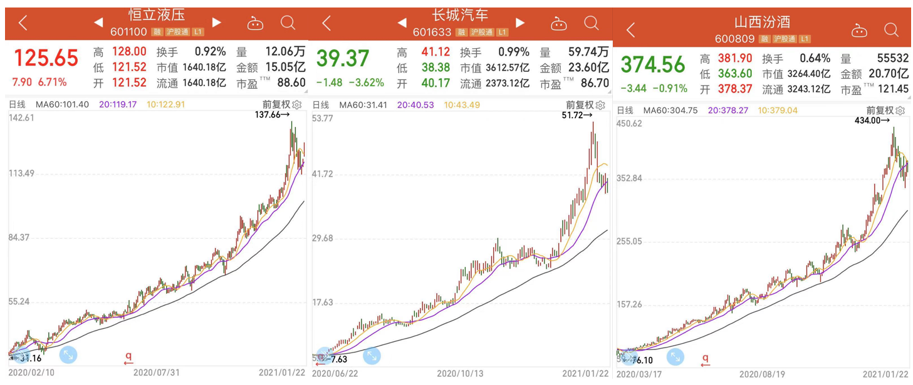

你们应该也发现了，**基本上就是很平稳的45度角上扬，波动很小，且成交量非常稳定。**

  

总结一下，就是：

  

**1\. 股价平稳，且有趋势的上涨**

  

**2\. 成交量稳定，不会因为股价上涨而出现大放量，或大缩量的情况**

  

**3\. 每次回调都不会很深**

  

**4\. 市值相对比较大**

  

基于此，制定量化指标：

  

1\. 市值相对较大，我们就设定为股票池是沪深300，沪深300成分股都是中大型市值票。

  

2\. 每次回调都不会很深，那就拍脑袋定一个，最新价距离最近30日的最高价，回调没超过8%。

  

3\. 放量稳定，这条我想的一个指标是最近7个交易日的均值，与最近200个交易日（大概1年）相比，交易量不超过160%

  

4\. 股价平稳，且有趋势的上涨。要量化这一条最难，所以引进了最简单的机器学习函数----线性回归，原理你们很简单，小学生都会，就是Y=aX+b，用股票的历史股价，算出斜率a和截距b，其实还可以算出浮动比例，然后限定a、b和浮动比例在一个范围内。

  

这个函数的目的很简单，就是让程序识别出，股价是在平稳上涨的。说这么多，可能有些人还不清楚，我画个图，你们大致应该就能理解了。

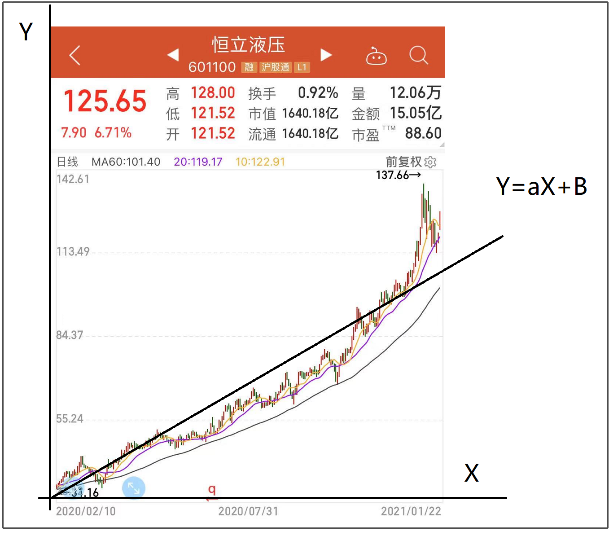

  

通过以上条件选股后，再通过第4条的线性回归函数来计算R方（R方越大，股价趋势越好，拟合度预告）进行排序，R方越大，排名越前面。  

  

选择排名前5的票买入，一周选一次股，不符合前5就卖出，符合前5就继续持有。

  

2020年1月2日---2021年1月22日的回测结果是这样的：
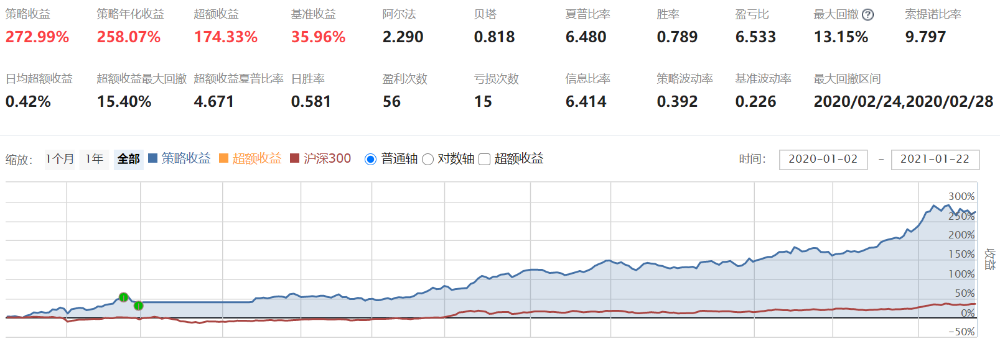

  

一年时间，收益272%，最大回撤13.15%，是不是非常优秀，简直无敌。选中的票也很牛批，都是这些大牛股。

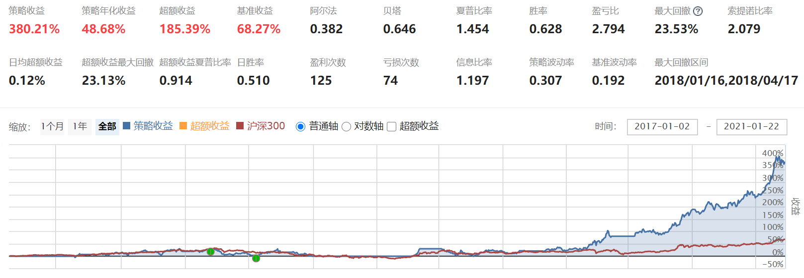](images/screenshot_1611418893419.png)

  

但如果把回测拉长到2017年1月1日---2021年1月22日，收益就比较一般了：

](images/screenshot_1611418853986.png)

  

我估计原因是这样形态的票，主要还是出现在最近两年，前几年经常会出现选不到票的情况。但说实话，未来不好说，可能类似的趋势股会越来越多，这个策略也可能会越来越有效。

  

总之，抛砖引玉吧，仁者见仁，大家保持自己的一份思考。对了，这个策略并非完全原创，去网上找了一些资料，并且也借助了一些其他人的思路
源码如下：

```

from jqdata import *
import numpy as np
from scipy.stats import linregress


# 初始化函数，设定要操作的股票、基准等等
def initialize(context):
    # 设定基准
    set_benchmark('000300.XSHG')
    # True为开启动态复权模式，使用真实价格交易
    set_option('use_real_price', True)
    # 关闭提示
    log.set_level('order', 'error')

    # 最大建仓数量
    g.max_hold_stock_nums = 3
    # 选出来的股票
    g.target_lists = []

    # 运行函数
    run_weekly(check_stocks, 1, 'open')  # 选股
    run_weekly(trade, 1, 'open')  # 交易


# 股票筛选
def check_stocks(context):
    # type: (Context) -> None
    current_data = get_current_data()

    # 沪深300成分股
    check_out_lists = get_index_stocks("000300.XSHG", date=context.previous_date)

    # 未停牌、未涨跌停、非科创板
    check_out_lists = [stock for stock in check_out_lists if
                       (not current_data[stock].paused) and
                       (current_data[stock].low_limit < current_data[stock].day_open < current_data[
                           stock].high_limit) and
                       (not stock.startswith('688'))
                       ]

    # 昨收盘价不高于500元/股
    s_close_1 = history(1, '1d', 'close', check_out_lists).iloc[-1]
    check_out_lists = list(s_close_1[s_close_1 <= 500].index)

    # 近30个交易日的最高价 / 昨收盘价 <=1.08, 即HHV(HIGH,30)/C[-1] <= 1.1
    high_max_30 = history(30, '1d', 'high', check_out_lists).max()
    s_fall = high_max_30 / s_close_1
    check_out_lists = list(s_fall[s_fall <= 1.08].index)

    # 近7个交易日的交易量均值 与 近180给交易日的成交量均值 相比，放大不超过1.6倍  MA(VOL,7)/MA(VOL,180) <=1.6
    df_vol = history(180, '1d', 'volume', check_out_lists)
    s_vol_ratio = df_vol.iloc[-7:].mean() / df_vol.mean()
    check_out_lists = list(s_vol_ratio[s_vol_ratio <= 1.6].index)

    # 对近120个交易日的股价进行线性回归：入选条件 slope / intercept > 0.005 and r_value**2 > 0.8
    target_dict = {}
    x = np.arange(120)
    for stock in check_out_lists:
        y = attribute_history(stock, 120, '1d', 'close', df=False)['close']
        print(y)
        slope, intercept, r_value, p_value, std_err = linregress(x, y)
        print(slope)
        if slope / intercept > 0.005 and r_value > 0.9:  #  
            target_dict[stock] = slope # r_value ** 2

    # 入选股票按照R Square 降序排序, 取前N名
    g.target_lists = []
    if target_dict:
        df_score = pd.DataFrame.from_dict(
            target_dict, orient='index', columns=['score', ]
        ).sort_values(
            by='score', ascending=False
        )
        #
        g.target_lists = list(df_score.index[:g.max_hold_stock_nums])


# 交易函数
def trade(context):
    # 获取 buy_lists 列表
    buy_lists = g.target_lists
    # 卖出操作
    for s in context.portfolio.positions:
        if s not in buy_lists:
            _order = order_target_value(s, 0)
            if _order is not None:
                log.info('卖出: %s (%s)' % (get_security_info(s).display_name, s))

    if buy_lists:
        amount = context.portfolio.total_value / len(buy_lists)
        for stock in buy_lists:
            if stock in context.portfolio.positions:
                _order = order_target_value(stock, amount)
                if _order is not None:
                    log.info('调仓: %s (%s)' % (get_security_info(stock).display_name, stock))

        for stock in buy_lists:
            if stock not in context.portfolio.positions:
                _order = order_target_value(stock, amount)
                if _order is not None:
                    log.info('买入: %s (%s)' % (get_security_info(stock).display_name, stock))

```


## 医药股策略

逻辑：
**股票池：**申万一级行业医药生物。

**筛选机制：**过滤ST，过滤退市股。

**选股条件：**PE在20-80倍之间，营收、净利润同比皆增长20%以上。并按照ROE从大到小排序，取排名前10的股票。

**调仓逻辑：**策略用轮动的方式进行买卖，每日触发一次选股条件，在前10名的股票会继续持有，掉出前10名股票就会卖掉

以下是源代码

```
from kuanke.wizard import *
from jqdata import *
import numpy as np
import pandas as pd
import talib
import datetime

## 初始化函数，设定要操作的股票、基准等等
def initialize(context):
    # 设定基准
    set_benchmark('000300.XSHG')
    # 设定滑点
    set_slippage(FixedSlippage(0.02))
    # True为开启动态复权模式，使用真实价格交易
    set_option('use_real_price', True)
    # 设定成交量比例
    set_option('order_volume_ratio', 1)
    # 股票类交易手续费是：买入时佣金万分之三，卖出时佣金万分之三加千分之一印花税, 每笔交易佣金最低扣5块钱
    set_order_cost(OrderCost(open_tax=0, close_tax=0.001, open_commission=0.0003, close_commission=0.0003, min_commission=5), type='stock')
    # 个股最大持仓比重
    g.security_max_proportion = 1
    # 选股频率
    g.check_stocks_refresh_rate = 1
    # 买入频率
    g.buy_refresh_rate = 1
    # 卖出频率
    g.sell_refresh_rate = 1
    # 最大建仓数量
    g.max_hold_stocknum = 10

    # 选股频率计数器
    g.check_stocks_days = 0
    # 买卖交易频率计数器
    g.buy_trade_days=0
    g.sell_trade_days=0
    # 获取未卖出的股票
    g.open_sell_securities = []
    # 卖出股票的dict
    g.selled_security_list={}

    # 股票筛选初始化函数
    check_stocks_initialize()
    # 股票筛选排序初始化函数
    check_stocks_sort_initialize()
    # 出场初始化函数
    sell_initialize()
    # 入场初始化函数
    buy_initialize()
    # 风控初始化函数
    risk_management_initialize()

    # 关闭提示
    log.set_level('order', 'info')

    # 运行函数
    run_daily(sell_every_day,'open') #卖出未卖出成功的股票
    run_daily(risk_management, 'every_bar') #风险控制
    run_daily(check_stocks, 'open') #选股
    run_daily(trade, 'open') #交易
    run_daily(selled_security_list_count, 'after_close') #卖出股票日期计数


## 股票筛选初始化函数
def check_stocks_initialize():
    # 是否过滤停盘
    g.filter_paused = True
    # 是否过滤退市
    g.filter_delisted = True
    # 是否只有ST
    g.only_st = False
    # 是否过滤ST
    g.filter_st = True
    # 股票池
    g.security_universe_index = ["all_a_securities"]
    g.security_universe_user_securities = []
    # 行业列表
    g.industry_list = ["801150"]
    # 概念列表
    g.concept_list = []

## 股票筛选排序初始化函数
def check_stocks_sort_initialize():
    # 总排序准则： desc-降序、asc-升序
    g.check_out_lists_ascending = 'desc'

## 出场初始化函数
def sell_initialize():
    # 设定是否卖出buy_lists中的股票
    g.sell_will_buy = False

    # 固定出仓的数量或者百分比
    g.sell_by_amount = None
    g.sell_by_percent = None

## 入场初始化函数
def buy_initialize():
    # 是否可重复买入
    g.filter_holded = False

    # 委托类型
    g.order_style_str = 'by_cap_mean'
    g.order_style_value = 100

## 风控初始化函数
def risk_management_initialize():
    # 策略风控信号
    g.risk_management_signal = True

    # 策略当日触发风控清仓信号
    g.daily_risk_management = True

    # 单只最大买入股数或金额
    g.max_buy_value = None
    g.max_buy_amount = None


## 卖出未卖出成功的股票
def sell_every_day(context):
    g.open_sell_securities = list(set(g.open_sell_securities))
    open_sell_securities = [s for s in context.portfolio.positions.keys() if s in g.open_sell_securities]
    if len(open_sell_securities)>0:
        for stock in open_sell_securities:
            order_target_value(stock, 0)
    g.open_sell_securities = [s for s in g.open_sell_securities if s in context.portfolio.positions.keys()]
    return

## 风控
def risk_management(context):
    ### _风控函数筛选-开始 ###
    ### _风控函数筛选-结束 ###
    return

## 股票筛选
def check_stocks(context):
    if g.check_stocks_days%g.check_stocks_refresh_rate != 0:
        # 计数器加一
        g.check_stocks_days += 1
        return
    # 股票池赋值
    g.check_out_lists = get_security_universe(context, g.security_universe_index, g.security_universe_user_securities)
    # 行业过滤
    g.check_out_lists = industry_filter(context, g.check_out_lists, g.industry_list)
    # 概念过滤
    g.check_out_lists = concept_filter(context, g.check_out_lists, g.concept_list)
    # 过滤ST股票
    g.check_out_lists = st_filter(context, g.check_out_lists)
    # 过滤退市股票
    g.check_out_lists = delisted_filter(context, g.check_out_lists)
    # 财务筛选
    g.check_out_lists = financial_statements_filter(context, g.check_out_lists)
    # 行情筛选
    g.check_out_lists = situation_filter(context, g.check_out_lists)
    # 技术指标筛选
    g.check_out_lists = technical_indicators_filter(context, g.check_out_lists)
    # 形态指标筛选函数
    g.check_out_lists = pattern_recognition_filter(context, g.check_out_lists)
    # 其他筛选函数
    g.check_out_lists = other_func_filter(context, g.check_out_lists)

    # 排序
    input_dict = get_check_stocks_sort_input_dict()
    g.check_out_lists = check_stocks_sort(context,g.check_out_lists,input_dict,g.check_out_lists_ascending)

    # 计数器归一
    g.check_stocks_days = 1
    return

## 交易函数
def trade(context):
   # 初始化买入列表
    buy_lists = []

    # 买入股票筛选
    if g.buy_trade_days%g.buy_refresh_rate == 0:
        # 获取 buy_lists 列表
        buy_lists = g.check_out_lists
        # 过滤ST股票
        buy_lists = st_filter(context, buy_lists)
        # 过滤停牌股票
        buy_lists = paused_filter(context, buy_lists)
        # 过滤退市股票
        buy_lists = delisted_filter(context, buy_lists)
        # 过滤涨停股票
        buy_lists = high_limit_filter(context, buy_lists)

        ### _入场函数筛选-开始 ###
        ### _入场函数筛选-结束 ###

    # 卖出操作
    if g.sell_trade_days%g.sell_refresh_rate != 0:
        # 计数器加一
        g.sell_trade_days += 1
    else:
        # 卖出股票
        sell(context, buy_lists)
        # 计数器归一
        g.sell_trade_days = 1


    # 买入操作
    if g.buy_trade_days%g.buy_refresh_rate != 0:
        # 计数器加一
        g.buy_trade_days += 1
    else:
        # 卖出股票
        buy(context, buy_lists)
        # 计数器归一
        g.buy_trade_days = 1

## 卖出股票日期计数
def selled_security_list_count(context):
    g.daily_risk_management = True
    if len(g.selled_security_list)>0:
        for stock in g.selled_security_list.keys():
            g.selled_security_list[stock] += 1

##################################  选股函数群 ##################################

## 财务指标筛选函数
def financial_statements_filter(context, security_list):
    ### _财务指标筛选函数-开始 ###
    security_list = financial_data_filter_qujian(security_list, valuation.pe_ratio, (20,80))
    security_list = financial_data_filter_dayu(security_list, indicator.inc_revenue_year_on_year, 20)
    security_list = financial_data_filter_dayu(security_list, indicator.inc_net_profit_year_on_year, 20)
    ### _财务指标筛选函数-结束 ###

    # 返回列表
    return security_list

## 行情筛选函数
def situation_filter(context, security_list):
    ### _行情筛选函数-开始 ###
    ### _行情筛选函数-结束 ###

    # 返回列表
    return security_list

## 技术指标筛选函数
def technical_indicators_filter(context, security_list):
    ### _技术指标筛选函数-开始 ###
    ### _技术指标筛选函数-结束 ###

    # 返回列表
    return security_list

## 形态指标筛选函数
def pattern_recognition_filter(context, security_list):
    ### _形态指标筛选函数-开始 ###
    ### _形态指标筛选函数-结束 ###

    # 返回列表
    return security_list

## 其他方式筛选函数
def other_func_filter(context, security_list):
    ### _其他方式筛选函数-开始 ###
    ### _其他方式筛选函数-结束 ###

    # 返回列表
    return security_list

# 获取选股排序的 input_dict
def get_check_stocks_sort_input_dict():
    input_dict = {
        indicator.roe:('desc',100),
        }
    # 返回结果
    return input_dict

##################################  交易函数群 ##################################
# 交易函数 - 出场
def sell(context, buy_lists):
    # 获取 sell_lists 列表
    init_sl = context.portfolio.positions.keys()
    sell_lists = context.portfolio.positions.keys()

    # 判断是否卖出buy_lists中的股票
    if not g.sell_will_buy:
        sell_lists = [security for security in sell_lists if security not in buy_lists]

    ### _出场函数筛选-开始 ###
    ### _出场函数筛选-结束 ###

    # 卖出股票
    if len(sell_lists)>0:
        for stock in sell_lists:
            sell_by_amount_or_percent_or_none(context,stock, g.sell_by_amount, g.sell_by_percent, g.open_sell_securities)

    # 获取卖出的股票, 并加入到 g.selled_security_list中
    selled_security_list_dict(context,init_sl)

    return

# 交易函数 - 入场
def buy(context, buy_lists):
    # 风控信号判断
    if not g.risk_management_signal:
        return

    # 判断当日是否触发风控清仓止损
    if not g.daily_risk_management:
        return
    # 判断是否可重复买入
    buy_lists = holded_filter(context,buy_lists)

    # 获取最终的 buy_lists 列表
    Num = g.max_hold_stocknum - len(context.portfolio.positions)
    buy_lists = buy_lists[:Num]

    # 买入股票
    if len(buy_lists)>0:
        # 分配资金
        result = order_style(context,buy_lists,g.max_hold_stocknum, g.order_style_str, g.order_style_value)
        for stock in buy_lists:
            if len(context.portfolio.positions) < g.max_hold_stocknum:
                # 获取资金
                Cash = result[stock]
                # 判断个股最大持仓比重
                value = judge_security_max_proportion(context,stock,Cash,g.security_max_proportion)
                # 判断单只最大买入股数或金额
                amount = max_buy_value_or_amount(stock,value,g.max_buy_value,g.max_buy_amount)
                # 下单
                order(stock, amount, MarketOrderStyle())
    return

###################################  公用函数群 ##################################
## 排序
def check_stocks_sort(context,security_list,input_dict,ascending='desc'):
    if (len(security_list) == 0) or (len(input_dict) == 0):
        return security_list
    else:
        # 生成 key 的 list
        idk = list(input_dict.keys())
        # 生成矩阵
        a = pd.DataFrame()
        for i in idk:
            b = get_sort_dataframe(security_list, i, input_dict[i])
            a = pd.concat([a,b],axis = 1)
        # 生成 score 列
        a['score'] = a.sum(1,False)
        # 根据 score 排序
        if ascending == 'asc':# 升序
            if hasattr(a, 'sort'):
                a = a.sort(['score'],ascending = True)
            else:
                a = a.sort_values(['score'],ascending = True)
        elif ascending == 'desc':# 降序
            if hasattr(a, 'sort'):
                a = a.sort(['score'],ascending = False)
            else:
                a = a.sort_values(['score'],ascending = False)
        # 返回结果
        return list(a.index)

## 过滤同一标的继上次卖出N天不再买入
def filter_n_tradeday_not_buy(security, n=0):
    try:
        if (security in g.selled_security_list.keys()) and (g.selled_security_list[security]<n):
            return False
        return True
    except:
        return True

## 是否可重复买入
def holded_filter(context,security_list):
    if not g.filter_holded:
        security_list = [stock for stock in security_list if stock not in context.portfolio.positions.keys()]
    # 返回结果
    return security_list

## 卖出股票加入dict
def selled_security_list_dict(context,security_list):
    selled_sl = [s for s in security_list if s not in context.portfolio.positions.keys()]
    if len(selled_sl)>0:
        for stock in selled_sl:
            g.selled_security_list[stock] = 0

## 过滤停牌股票
def paused_filter(context, security_list):
    if g.filter_paused:
        current_data = get_current_data()
        security_list = [stock for stock in security_list if not current_data[stock].paused]
    # 返回结果
    return security_list

## 过滤退市股票
def delisted_filter(context, security_list):
    if g.filter_delisted:
        current_data = get_current_data()
        security_list = [stock for stock in security_list if not (('退' in current_data[stock].name) or ('*' in current_data[stock].name))]
    # 返回结果
    return security_list


## 过滤ST股票
def st_filter(context, security_list):
    if g.only_st:
        current_data = get_current_data()
        security_list = [stock for stock in security_list if current_data[stock].is_st]
    else:
        if g.filter_st:
            current_data = get_current_data()
            security_list = [stock for stock in security_list if not current_data[stock].is_st]
    # 返回结果
    return security_list

# 过滤涨停股票
def high_limit_filter(context, security_list):
    current_data = get_current_data()
    security_list = [stock for stock in security_list if not (current_data[stock].day_open >= current_data[stock].high_limit)]
    # 返回结果
    return security_list

# 获取股票股票池
def get_security_universe(context, security_universe_index, security_universe_user_securities):
    temp_index = []
    for s in security_universe_index:
        if s == 'all_a_securities':
            temp_index += list(get_all_securities(['stock'], context.current_dt.date()).index)
        else:
            temp_index += get_index_stocks(s)
    for x in security_universe_user_securities:
        temp_index += x
    return  sorted(list(set(temp_index)))

# 行业过滤
def industry_filter(context, security_list, industry_list):
    if len(industry_list) == 0:
        # 返回股票列表
        return security_list
    else:
        securities = []
        for s in industry_list:
            temp_securities = get_industry_stocks(s)
            securities += temp_securities
        security_list = [stock for stock in security_list if stock in securities]
        # 返回股票列表
        return security_list

# 概念过滤
def concept_filter(context, security_list, concept_list):
    if len(concept_list) == 0:
        return security_list
    else:
        securities = []
        for s in concept_list:
            temp_securities = get_concept_stocks(s)
            securities += temp_securities
        security_list = [stock for stock in security_list if stock in securities]
        # 返回股票列表
        return security_list
```


## 超跌次新股策略

这个策略是某个读者和我交流的时候，提供的一个炒股思路，**核心的逻辑：选出流通值小的超跌次新股，然后买入博反抽。**

  

他说他平时就喜欢用这种方法选股，所以我就根据他的描述做成了量化策略。

  

当时测了一下，2015年9月---2019年3月的收益是这样的：

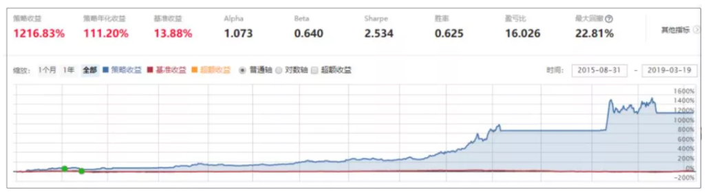

  

看起来非常不错，3年半的时间总共有12倍的收益，平均年化111%，胜率为62.5%，最大回撤22.8%。

  

时隔2年，这个策略还行不行呢？  

  

于是，我翻出以前写的代码，又测了一下2015年9月---2021年3月的收益：  
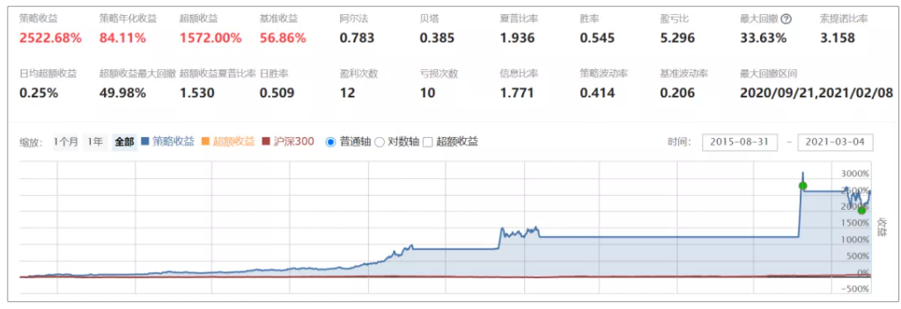

  

真是让我感到惊讶，竟然还是非常有效，收益达到了2522%，年化84%。

  

这个策略的思路其实特别简单:  

**选股方式: **就是在上市天数小于180天的次新股里挑选出跌幅大于60%的股票，然后按照流通市值的大小，由小到大排序  

  

**买入方式: **买入流通市值最小的前几个

  

**卖出方式: **5天内涨幅超过20%就止盈，或者4天内跌幅超过10%就止损

  

**仓位管理: **全仓买卖

源代码如下

```
from kuanke.wizard import *
from jqdata import *
import numpy as np
import pandas as pd
import talib
import datetime
import time
import math


## 初始化函数，设定要操作的股票、基准等等
def initialize(context):
    # 设定基准
    set_benchmark('000300.XSHG')
    # 设定滑点
    set_slippage(FixedSlippage(0.01))
    # True为开启动态复权模式，使用真实价格交易
    set_option('use_real_price', True)
    # 设定成交量比例
    set_option('order_volume_ratio', 1)
    # 股票类交易手续费是：买入时佣金万分之三，卖出时佣金万分之三加千分之一印花税, 每笔交易佣金最低扣5块钱
    set_order_cost(OrderCost(open_tax=0, close_tax=0.001, open_commission=0.0003, close_commission=0.0003, min_commission=5), type='stock')

    #容器初始化
    check_container_initialize()
    #动态仓位、频率、计数初始化函数
    check_dynamic_initialize()
    # 股票筛选初始化函数
    check_stocks_initialize()
    # 出场初始化函数
    sell_initialize()
    # 入场初始化函数
    buy_initialize()


    # 关闭提示
    log.set_level('order', 'info')

    # 运行函数
    run_daily(check_stocks, '9:15') #选股
    run_daily(main_stock_pick, '9:16') #买入卖出列表
    run_daily(sell_every_day,'open') #卖出未卖出成功的股票
    run_daily(trade, 'open') #交易
    run_daily(selled_security_list_count, 'after_close') #卖出股票日期计数
    
    
    
#######################！！！新手需要使用的地方！！！###################################################
##动态仓位、频率、计数初始化函数(持仓比例，选股频率，买入频率，卖出频率在这里设置)
def check_dynamic_initialize():
    # 个股最大持仓比重
    g.security_max_proportion = 1
    # 选股和买卖频率
    g.check_stocks_refresh_rate = 1
    # 最大建仓数量
    g.max_hold_stocknum = 1
    
    #下面这几项不用管
    # 买入频率
    g.buy_refresh_rate = 1
    # 卖出频率
    g.sell_refresh_rate = 1

    # 选股频率计数器
    g.check_stocks_days = 0
    #机器学习选股频率计数器
    g.days = 0
    # 买卖交易频率计数器
    g.buy_trade_days=0
    g.sell_trade_days=0
    
## 股票池初筛设置函数(股票初筛在这里设置)
def check_stocks_initialize():
    # 是否过滤停盘
    g.filter_paused = True
    # 是否过滤退市
    g.filter_delisted = True
    # 是否只有ST
    g.only_st = False
    # 是否过滤ST
    g.filter_st = True
    # 股票池(填指数)
    g.security_universe_index = ["all_a_securities"]#这里填写指数，全部股票就填['all_a_securities']，沪深300股票就填['000300.XSHG'],中证500就填['000905.XSHG'],沪深300+中证500就填['000300.XSHG','000905.XSHG']
    # 填成分股(填成分股)
    g.security_universe_user_securities = []
    # 行业列表
    g.industry_list = ["801010","801020","801030","801040","801050","801080","801110","801120","801130","801140","801150","801160","801170","801180","801200","801210","801230","801710","801720","801730","801740","801750","801760","801770","801780","801790","801880","801890"]
    # 概念列表
    g.concept_list = []
    # 黑名单
    g.blacklist=[]
    
## 买入股票，卖出股票筛选函数
def main_stock_pick(context):
    if g.days % g.check_stocks_refresh_rate != 0:
        g.days +=1
        return
    g.sell_stock_list=[]
    g.buy_stock_list = []

####自定义编辑范围#####    

#超跌次新策略
    g.check_out_lists = [stock for stock in g.check_out_lists if ((context.current_dt.date() - get_security_info(stock).start_date).days)<180]
    g.check_out_lists = [stock for stock in g.check_out_lists if stock[:3]!= "688"]
    uuzhang2=[]
    for stock in g.check_out_lists:
        df2=attribute_history(stock,count=180,unit='1d',fields=['close'],fq='pre')
        Maxjiage = df2['close'].max() 
        current_pricedata = attribute_history(stock, 1, '1d', ['close'])
        current_price = current_pricedata['close'].mean()
        if current_price/Maxjiage <0.4:
            uuzhang2.append(stock)
    stockset = uuzhang2
    
    g.u=[]
    #security_list22 = [stock for stock in g.sell_stock_list1 if  current_data[stock].paused]
    #print security_list22
    g.sell_stock_list=[]
    g.buy_stock_list = []
    g.sell_stock_list1 = list(context.portfolio.positions.keys())
    stockset = [stock for stock in stockset if stock not in g.sell_stock_list1]
    for stock in g.sell_stock_list1:
        df2=attribute_history(stock,count=1,unit='1d',\
                      fields=['open','close','volume','high','low','money','high_limit','low_limit','paused'],\
                      fq='pre')
        if df2['close'][-1]==df2['high_limit'][-1] and df2['volume'][-1]>0 and df2['money'][-1]>0:
            g.u.append(stock)
        else:
            Minjiage=attribute_history(stock,count=5,unit='1d',fields=['close'],fq='pre')
            Minjiage = df2['close'].min()
            current_pricedata = attribute_history(stock, 1, '1d', ['close'])
            current_price = current_pricedata['close'].mean()
            loss_data3= attribute_history(stock, 4, '1d', ['close'])
            loss3 = loss_data3['close'].max()
            current_pricedata = attribute_history(stock, 1, '1d', ['close'])
            current_price = current_pricedata['close'].mean()
            loss_rate = current_price/loss3
            if current_price/Minjiage >1.2 or loss_rate < 0.90:
                g.sell_stock_list.append(stock)

    for stock in stockset:
        if stock in g.sell_stock_list1:
            pass
        else:
            g.buy_stock_list.append(stock) 
            
####自定义编辑范围#####              

    log.info('卖出列表:',g.sell_stock_list)
    log.info('购买列表:',g.buy_stock_list)
    g.days =1
    return g.sell_stock_list,g.buy_stock_list  
    
    
#######################！！！新手需要使用的地方！！！###################################################


##容器初始化(有新的全局容器可以加到这里)(新手忽略这里)
def check_container_initialize():
    #卖出股票列表
    g.sell_stock_list=[]
    #买入股票列表
    g.buy_stock_list = []
    # 获取未卖出的股票
    g.open_sell_securities = []
    # 卖出股票的dict
    g.selled_security_list={}
    #涨停股票列表
    g.ZT=[]    
    

## 出场初始化函数(新手忽略这里)
def sell_initialize():
    # 设定是否卖出buy_lists中的股票
    g.sell_will_buy = True

    # 固定出仓的数量或者百分比
    g.sell_by_amount = None
    g.sell_by_percent = None

## 入场初始化函数(新手忽略这里)
def buy_initialize():
    # 是否可重复买入
    g.filter_holded = False

    # 委托类型
    g.order_style_str = 'by_cap_mean'
    g.order_style_value = 100


## 股票初筛(新手忽略这里)
def check_stocks(context):
    if g.check_stocks_days%g.check_stocks_refresh_rate != 0:
        # 计数器加一
        g.check_stocks_days += 1
        return
    # 股票池赋值
    g.check_out_lists = get_security_universe(context, g.security_universe_index, g.security_universe_user_securities)
    # 行业过滤
    #g.check_out_lists = industry_filter(context, g.check_out_lists, g.industry_list)
    # 概念过滤
    #g.check_out_lists = concept_filter(context, g.check_out_lists, g.concept_list)
    # 过滤ST股票
    g.check_out_lists = st_filter(context, g.check_out_lists)
    # 过滤停牌股票
    g.check_out_lists = paused_filter(context, g.check_out_lists)
    # 过滤退市股票
    g.check_out_lists = delisted_filter(context, g.check_out_lists)
    # 过滤黑名单股票
    g.check_out_lists = [s for s in g.check_out_lists if s not in g.blacklist]
    # 计数器归一
    g.check_stocks_days = 1
    return


## 卖出未卖出成功的股票(新手忽略这里)
def sell_every_day(context):
    g.open_sell_securities = list(set(g.open_sell_securities))
    open_sell_securities = [s for s in context.portfolio.positions.keys() if s in g.open_sell_securities]
    if len(open_sell_securities)>0:
        for stock in open_sell_securities:
            order_target_value(stock, 0)
    g.open_sell_securities = [s for s in g.open_sell_securities if s in context.portfolio.positions.keys()]
    return


## 交易函数(新手忽略这里)
def trade(context):
   # 初始化买入列表
    buy_lists = []

    # 买入股票筛选
    if g.buy_trade_days%g.buy_refresh_rate == 0:
        # 获取 buy_lists 列表
        buy_lists = g.buy_stock_list
        # 过滤涨停股票
        buy_lists = high_limit_filter(context, buy_lists)
        log.info('购买列表最终',buy_lists)

    # 卖出操作
    if g.sell_trade_days%g.sell_refresh_rate != 0:
        # 计数器加一
        g.sell_trade_days += 1
    else:
        # 卖出股票
        sell(context, buy_lists)
        # 计数器归一
        g.sell_trade_days = 1


    # 买入操作
    if g.buy_trade_days%g.buy_refresh_rate != 0:
        # 计数器加一
        g.buy_trade_days += 1
    else:
        # 卖出股票
        buy(context, buy_lists)
        # 计数器归一
        g.buy_trade_days = 1


##################################  交易函数群 ##################################(新手忽略)

# 交易函数 - 出场
def sell(context, buy_lists):
    # 获取 sell_lists 列表
    init_sl = context.portfolio.positions.keys()
    sell_lists = context.portfolio.positions.keys()

    # 判断是否卖出buy_lists中的股票
    if not g.sell_will_buy:
        sell_lists = [security for security in sell_lists if security not in buy_lists]

    ### _出场函数筛选-开始 ###
    sell_lists = g.sell_stock_list
    ### _出场函数筛选-结束 ###

    # 卖出股票
    if len(sell_lists)>0:
        for stock in sell_lists:
            sell_by_amount_or_percent_or_none(context,stock, g.sell_by_amount, g.sell_by_percent, g.open_sell_securities)

    # 获取卖出的股票, 并加入到 g.selled_security_list中
    selled_security_list_dict(context,init_sl)

    return

# 交易函数 - 入场
def buy(context, buy_lists):

    # 判断是否可重复买入
    buy_lists = holded_filter(context,buy_lists)

    # 获取最终的 buy_lists 列表
    Num = g.max_hold_stocknum - len(context.portfolio.positions)
    buy_lists = buy_lists[:Num]

    # 买入股票
    if len(buy_lists)>0:
        # 分配资金
        result = order_style(context,buy_lists,g.max_hold_stocknum, g.order_style_str, g.order_style_value)
        for stock in buy_lists:
            if len(context.portfolio.positions) < g.max_hold_stocknum:
                # 获取资金
                Cash = result[stock]
                # 判断个股最大持仓比重
                value = judge_security_max_proportion(context,stock,Cash,g.security_max_proportion)
                # 判断单只最大买入股数或金额
                amount = max_buy_value_or_amount(stock,value,None,None)
                # 下单
                order(stock, amount, MarketOrderStyle())
    return


###################################  公用函数群 ##################################(新手忽略)


## 过滤同一标的继上次卖出N天不再买入
def filter_n_tradeday_not_buy(security, n=0):
    try:
        if (security in g.selled_security_list.keys()) and (g.selled_security_list[security]<n):
            return False
        return True
    except:
        return True

## 是否可重复买入
def holded_filter(context,security_list):
    if not g.filter_holded:
        security_list = [stock for stock in security_list if stock not in context.portfolio.positions.keys()]
    # 返回结果
    return security_list

## 卖出股票加入dict
def selled_security_list_dict(context,security_list):
    selled_sl = [s for s in security_list if s not in context.portfolio.positions.keys()]
    if len(selled_sl)>0:
        for stock in selled_sl:
            g.selled_security_list[stock] = 0

## 过滤停牌股票
def paused_filter(context, security_list):
    if g.filter_paused:
        current_data = get_current_data()
        security_list = [stock for stock in security_list if not current_data[stock].paused]
    # 返回结果
    return security_list

## 过滤退市股票
def delisted_filter(context, security_list):
    if g.filter_delisted:
        current_data = get_current_data()
        security_list = [stock for stock in security_list if not (('退' in current_data[stock].name) or ('*' in current_data[stock].name))]
    # 返回结果
    return security_list


## 过滤ST股票
def st_filter(context, security_list):
    if g.only_st:
        current_data = get_current_data()
        security_list = [stock for stock in security_list if current_data[stock].is_st]
    else:
        if g.filter_st:
            current_data = get_current_data()
            security_list = [stock for stock in security_list if not current_data[stock].is_st]
    # 返回结果
    return security_list

# 过滤涨停股票
def high_limit_filter(context, security_list):
    current_data = get_current_data()
    security_list = [stock for stock in security_list if not (current_data[stock].day_open >= current_data[stock].high_limit)]
    # 返回结果
    return security_list

# 获取股票股票池
def get_security_universe(context, security_universe_index, security_universe_user_securities):
    temp_index = []
    for s in security_universe_index:
        if s == 'all_a_securities':
            temp_index += list(get_all_securities(['stock'], context.current_dt.date()).index)
        else:
            temp_index += get_index_stocks(s)
    for x in security_universe_user_securities:
        temp_index += x
    return  sorted(list(set(temp_index)))

# 行业过滤
def industry_filter(context, security_list, industry_list):
    if len(industry_list) == 0:
        # 返回股票列表
        return security_list
    else:
        securities = []
        for s in industry_list:
            temp_securities = get_industry_stocks(s)
            securities += temp_securities
        security_list = [stock for stock in security_list if stock in securities]
        # 返回股票列表
        return security_list

# 概念过滤
def concept_filter(context, security_list, concept_list):
    if len(concept_list) == 0:
        return security_list
    else:
        securities = []
        for s in concept_list:
            temp_securities = get_concept_stocks(s)
            securities += temp_securities
        security_list = [stock for stock in security_list if stock in securities]
        # 返回股票列表
        return security_list
        
## 卖出股票日期计数
def selled_security_list_count(context):
    #g.daily_risk_management = True
    if len(g.selled_security_list)>0:
        for stock in g.selled_security_list.keys():
            g.selled_security_list[stock] += 1
            
#获取交易日
def shifttradingday(date,shift):
    #获取N天前的交易日日期
    # 获取所有的交易日，返回一个包含所有交易日的 list,元素值为 datetime.date 类型.
    tradingday = get_all_trade_days()
    # 得到date之后shift天那一天在列表中的行标号 返回一个数
    shiftday_index = list(tradingday).index(date)+shift
    # 根据行号返回该日日期 为datetime.date类型
    return tradingday[shiftday_index]            
```


## 医药消费低估高增长策略

说一下这个策略的逻辑：

  

股票池：沪深300+中证500成分股，且行业为医药生物、食品饮料。

  

选股条件：动态PE在30倍以下，营收同比大于0、净利润同比大于20%以上。

  

排序逻辑：按照ROA和市值综合排序，ROA越大排在越前面，市值越大排在越前面，且ROA和市值对排序影响的权重是1:1。

  

调仓逻辑：策略用轮动的方式进行买卖，每10日触发一次选股条件，符合条件，且在前3名的股票会继续持有，不符合条件，且掉出前3名股票就会卖掉。

###   

很多人对排序逻辑不理解，我举个简单的例子：

###   

股票A：按照ROA排序是排在第10名，但按照市值排序是排在第2名，那他的综合分是10\*1+2\*1=12。
### 
  

股票B：按照ROA排序是第30名，按照市值排序是第1名，综合分是30\*1+1\*1=31。

###   

股票A的12>股票B的31，所以A排在B的前面。

```
from kuanke.wizard import *
from jqdata import *
import numpy as np
import pandas as pd
import talib
import datetime
import time
import math


## 初始化函数，设定要操作的股票、基准等等
def initialize(context):
    # 设定基准
    set_benchmark('000300.XSHG')
    # 设定滑点
    set_slippage(FixedSlippage(0.01))
    # True为开启动态复权模式，使用真实价格交易
    set_option('use_real_price', True)
    # 设定成交量比例
    set_option('order_volume_ratio', 1)
    # 股票类交易手续费是：买入时佣金万分之三，卖出时佣金万分之三加千分之一印花税, 每笔交易佣金最低扣5块钱
    set_order_cost(OrderCost(open_tax=0, close_tax=0.001, open_commission=0.0003, close_commission=0.0003, min_commission=5), type='stock')

    #容器初始化
    check_container_initialize()
    #动态仓位、频率、计数初始化函数
    check_dynamic_initialize()
    # 股票筛选初始化函数
    check_stocks_initialize()
    # 出场初始化函数
    sell_initialize()
    # 入场初始化函数
    buy_initialize()


    # 关闭提示
    log.set_level('order', 'info')

    # 运行函数
    run_daily(check_stocks, '9:15') #选股
    run_daily(main_stock_pick, '9:16') #买入卖出列表
    run_daily(sell_every_day,'open') #卖出未卖出成功的股票
    run_daily(trade, 'open') #交易
    run_daily(selled_security_list_count, 'after_close') #卖出股票日期计数
    
    
    
#######################！！！新手需要使用的地方！！！###################################################
##动态仓位、频率、计数初始化函数(持仓比例，选股频率，买入频率，卖出频率在这里设置)
def check_dynamic_initialize():
    # 个股最大持仓比重
    g.security_max_proportion = 1
    # 选股和买卖频率
    g.check_stocks_refresh_rate = 1
    # 最大建仓数量
    g.max_hold_stocknum = 3
    
    #下面这几项不用管
    # 买入频率
    g.buy_refresh_rate = 1
    # 卖出频率
    g.sell_refresh_rate = 1

    # 选股频率计数器
    g.check_stocks_days = 0
    #机器学习选股频率计数器
    g.days = 0
    # 买卖交易频率计数器
    g.buy_trade_days=0
    g.sell_trade_days=0
    # 总排序准则： desc-降序、asc-升序
    g.check_out_lists_ascending = 'desc'
    
## 股票池初筛设置函数(股票初筛在这里设置)
def check_stocks_initialize():
    # 是否过滤停盘
    g.filter_paused = True
    # 是否过滤退市
    g.filter_delisted = True
    # 是否只有ST
    g.only_st = False
    # 是否过滤ST
    g.filter_st = True
    # 股票池(填指数)
    g.security_universe_index = ['000300.XSHG','000905.XSHG']#这里填写指数，全部股票就填['all_a_securities']，沪深300股票就填['000300.XSHG'],中证500就填['000905.XSHG'],沪深300+中证500就填['000300.XSHG','000905.XSHG']
    # 填成分股(填成分股)
    g.security_universe_user_securities = []
    # 行业列表
    g.industry_list = ["801120","801150"]
    # 概念列表
    g.concept_list = []
    # 黑名单
    g.blacklist=['300268.XSHE','600035.XSHG']
    
## 买入股票，卖出股票筛选函数
def main_stock_pick(context):
    if g.days % g.check_stocks_refresh_rate != 0:
        g.days +=1
        return
    g.sell_stock_list=[]
    g.buy_stock_list = []

####自定义编辑范围#####    

#外资策略

    q = query(valuation.code).filter(
                valuation.code.in_(g.check_out_lists),
                indicator.inc_revenue_year_on_year > 0,
                indicator.inc_net_profit_year_on_year > 20,
                valuation.pe_ratio < 30) #balance.development_expenditure

    df = get_fundamentals(q, date = None)    
    
    stockset = list(df['code'])
    
    g.sell_stock_list1 = list(context.portfolio.positions.keys())
    
    current_data = get_current_data()
    
    paused_list = [stock for stock in g.sell_stock_list1 if  current_data[stock].paused]

    for stock in g.sell_stock_list1:
        if stock in paused_list:
            continue
        elif stock not in stockset[:g.max_hold_stocknum]:
                g.sell_stock_list.append(stock)

    for stock in stockset[:g.max_hold_stocknum]:
        if stock in g.sell_stock_list:
            pass
        else:
            g.buy_stock_list.append(stock)
            
####自定义编辑范围#####              

    log.info('卖出列表:',g.sell_stock_list)
    log.info('购买列表:',g.buy_stock_list)
    g.days =1
    return g.sell_stock_list,g.buy_stock_list  
    
    
#######################！！！新手需要使用的地方！！！###################################################


##容器初始化(有新的全局容器可以加到这里)(新手忽略这里)
def check_container_initialize():
    #卖出股票列表
    g.sell_stock_list=[]
    #买入股票列表
    g.buy_stock_list = []
    # 获取未卖出的股票
    g.open_sell_securities = []
    # 卖出股票的dict
    g.selled_security_list={}
    #涨停股票列表
    g.ZT=[]    
    

## 出场初始化函数(新手忽略这里)
def sell_initialize():
    # 设定是否卖出buy_lists中的股票
    g.sell_will_buy = True

    # 固定出仓的数量或者百分比
    g.sell_by_amount = None
    g.sell_by_percent = None

## 入场初始化函数(新手忽略这里)
def buy_initialize():
    # 是否可重复买入
    g.filter_holded = False

    # 委托类型
    g.order_style_str = 'by_cap_mean'
    g.order_style_value = 100


## 股票初筛(新手忽略这里)
def check_stocks(context):
    if g.check_stocks_days%g.check_stocks_refresh_rate != 0:
        # 计数器加一
        g.check_stocks_days += 1
        return
    # 股票池赋值
    g.check_out_lists = get_security_universe(context, g.security_universe_index, g.security_universe_user_securities)
    # 行业过滤
    g.check_out_lists = industry_filter(context, g.check_out_lists, g.industry_list)
    # 概念过滤
    g.check_out_lists = concept_filter(context, g.check_out_lists, g.concept_list)
    # 过滤ST股票
    g.check_out_lists = st_filter(context, g.check_out_lists)
    # 过滤停牌股票
    g.check_out_lists = paused_filter(context, g.check_out_lists)
    # 过滤退市股票
    g.check_out_lists = delisted_filter(context, g.check_out_lists)
    # 过滤黑名单股票
    g.check_out_lists = [s for s in g.check_out_lists if s not in g.blacklist]
    # 排序
    input_dict = get_check_stocks_sort_input_dict()
    g.check_out_lists = check_stocks_sort(context,g.check_out_lists,input_dict,g.check_out_lists_ascending)
    # 计数器归一
    g.check_stocks_days = 1
    return


## 卖出未卖出成功的股票(新手忽略这里)
def sell_every_day(context):
    g.open_sell_securities = list(set(g.open_sell_securities))
    open_sell_securities = [s for s in context.portfolio.positions.keys() if s in g.open_sell_securities]
    if len(open_sell_securities)>0:
        for stock in open_sell_securities:
            order_target_value(stock, 0)
    g.open_sell_securities = [s for s in g.open_sell_securities if s in context.portfolio.positions.keys()]
    return


## 交易函数(新手忽略这里)
def trade(context):
   # 初始化买入列表
    buy_lists = []

    # 买入股票筛选
    if g.buy_trade_days%g.buy_refresh_rate == 0:
        # 获取 buy_lists 列表
        buy_lists = g.buy_stock_list
        # 过滤涨停股票
        buy_lists = high_limit_filter(context, buy_lists)
        log.info('购买列表最终',buy_lists)

    # 卖出操作
    if g.sell_trade_days%g.sell_refresh_rate != 0:
        # 计数器加一
        g.sell_trade_days += 1
    else:
        # 卖出股票
        sell(context, buy_lists)
        # 计数器归一
        g.sell_trade_days = 1


    # 买入操作
    if g.buy_trade_days%g.buy_refresh_rate != 0:
        # 计数器加一
        g.buy_trade_days += 1
    else:
        # 卖出股票
        buy(context, buy_lists)
        # 计数器归一
        g.buy_trade_days = 1


##################################  交易函数群 ##################################(新手忽略)

# 交易函数 - 出场
def sell(context, buy_lists):
    # 获取 sell_lists 列表
    init_sl = context.portfolio.positions.keys()
    sell_lists = context.portfolio.positions.keys()

    # 判断是否卖出buy_lists中的股票
    if not g.sell_will_buy:
        sell_lists = [security for security in sell_lists if security not in buy_lists]

    ### _出场函数筛选-开始 ###
    sell_lists = g.sell_stock_list
    ### _出场函数筛选-结束 ###

    # 卖出股票
    if len(sell_lists)>0:
        for stock in sell_lists:
            order_target(stock, 0)


    # 获取卖出的股票, 并加入到 g.selled_security_list中
    selled_security_list_dict(context,init_sl)

    return

# 交易函数 - 入场
def buy(context, buy_lists):

    # 判断是否可重复买入
    buy_lists = holded_filter(context,buy_lists)

    # 获取最终的 buy_lists 列表
    Num = g.max_hold_stocknum - len(context.portfolio.positions)
    buy_lists = buy_lists[:Num]

    # 买入股票
    if len(buy_lists)>0:
        # 分配资金
        result = order_style(context,buy_lists,g.max_hold_stocknum, g.order_style_str, g.order_style_value)
        for stock in buy_lists:
            if len(context.portfolio.positions) < g.max_hold_stocknum:
                # 获取资金
                Cash = result[stock]
                # 判断个股最大持仓比重
                value = judge_security_max_proportion(context,stock,Cash,g.security_max_proportion)
                # 判断单只最大买入股数或金额
                amount = max_buy_value_or_amount(stock,value,None,None)
                # 下单
                order(stock, amount, MarketOrderStyle())
    return


###################################  公用函数群 ##################################(新手忽略)


## 过滤同一标的继上次卖出N天不再买入
def filter_n_tradeday_not_buy(security, n=0):
    try:
        if (security in g.selled_security_list.keys()) and (g.selled_security_list[security]<n):
            return False
        return True
    except:
        return True

## 是否可重复买入
def holded_filter(context,security_list):
    if not g.filter_holded:
        security_list = [stock for stock in security_list if stock not in context.portfolio.positions.keys()]
    # 返回结果
    return security_list

## 卖出股票加入dict
def selled_security_list_dict(context,security_list):
    selled_sl = [s for s in security_list if s not in context.portfolio.positions.keys()]
    if len(selled_sl)>0:
        for stock in selled_sl:
            g.selled_security_list[stock] = 0

## 过滤停牌股票
def paused_filter(context, security_list):
    if g.filter_paused:
        current_data = get_current_data()
        security_list = [stock for stock in security_list if not current_data[stock].paused]
    # 返回结果
    return security_list

## 过滤退市股票
def delisted_filter(context, security_list):
    if g.filter_delisted:
        current_data = get_current_data()
        security_list = [stock for stock in security_list if not (('退' in current_data[stock].name) or ('*' in current_data[stock].name))]
    # 返回结果
    return security_list


## 过滤ST股票
def st_filter(context, security_list):
    if g.only_st:
        current_data = get_current_data()
        security_list = [stock for stock in security_list if current_data[stock].is_st]
    else:
        if g.filter_st:
            current_data = get_current_data()
            security_list = [stock for stock in security_list if not current_data[stock].is_st]
    # 返回结果
    return security_list

# 过滤涨停股票
def high_limit_filter(context, security_list):
    current_data = get_current_data()
    security_list = [stock for stock in security_list if not (current_data[stock].day_open >= current_data[stock].high_limit)]
    # 返回结果
    return security_list

# 获取股票股票池
def get_security_universe(context, security_universe_index, security_universe_user_securities):
    temp_index = []
    for s in security_universe_index:
        if s == 'all_a_securities':
            temp_index += list(get_all_securities(['stock'], context.current_dt.date()).index)
        else:
            temp_index += get_index_stocks(s)
    for x in security_universe_user_securities:
        temp_index += x
    return  sorted(list(set(temp_index)))
    
# 获取选股排序的 input_dict
def get_check_stocks_sort_input_dict():
    input_dict = {
        valuation.market_cap:('desc',100),
        indicator.roa:('desc',100),
        }
    # 返回结果
    return input_dict

# 行业过滤
def industry_filter(context, security_list, industry_list):
    if len(industry_list) == 0:
        # 返回股票列表
        return security_list
    else:
        securities = []
        for s in industry_list:
            temp_securities = get_industry_stocks(s)
            securities += temp_securities
        security_list = [stock for stock in security_list if stock in securities]
        # 返回股票列表
        return security_list

# 概念过滤
def concept_filter(context, security_list, concept_list):
    if len(concept_list) == 0:
        return security_list
    else:
        securities = []
        for s in concept_list:
            temp_securities = get_concept_stocks(s)
            securities += temp_securities
        security_list = [stock for stock in security_list if stock in securities]
        # 返回股票列表
        return security_list
## 排序
def check_stocks_sort(context,security_list,input_dict,ascending='desc'):
    if (len(security_list) == 0) or (len(input_dict) == 0):
        return security_list
    else:
        # 生成 key 的 list
        idk = list(input_dict.keys())
        # 生成矩阵
        a = pd.DataFrame()
        for i in idk:
            b = get_sort_dataframe(security_list, i, input_dict[i])
            a = pd.concat([a,b],axis = 1)
        # 生成 score 列
        a['score'] = a.sum(1,False)
        # 根据 score 排序
        if ascending == 'asc':# 升序
            if hasattr(a, 'sort'):
                a = a.sort(['score'],ascending = True)
            else:
                a = a.sort_values(['score'],ascending = True)
        elif ascending == 'desc':# 降序
            if hasattr(a, 'sort'):
                a = a.sort(['score'],ascending = False)
            else:
                a = a.sort_values(['score'],ascending = False)
        # 返回结果
        return list(a.index)
        
## 卖出股票日期计数
def selled_security_list_count(context):
    #g.daily_risk_management = True
    if len(g.selled_security_list)>0:
        for stock in g.selled_security_list.keys():
            g.selled_security_list[stock] += 1
            
#获取交易日
def shifttradingday(date,shift):
    #获取N天前的交易日日期
    # 获取所有的交易日，返回一个包含所有交易日的 list,元素值为 datetime.date 类型.
    tradingday = get_all_trade_days()
    # 得到date之后shift天那一天在列表中的行标号 返回一个数
    shiftday_index = list(tradingday).index(date)+shift
    # 根据行号返回该日日期 为datetime.date类型
    return tradingday[shiftday_index]            
```


## ROA择时策略

股票池：沪深300成分股+中证500成分股

选股逻辑：

1\. 业绩筛选：单季度净利润 > 0

2\. 成长性：单季度营收同比增长、环比增长均大于0

3\. 成长性：单季度净利同比增长、环比增长均大于0

4\. 排除妖股：估值在88倍以内

5\. 赚钱能力超过国债：ROE > 4%

6\. 排序：剩余股票ROA由高到低排序，取前3只股票

调仓逻辑：策略用轮动的方式进行买卖，每日调仓，在前3名的股票会继续持有，掉出前3名股票就会卖掉。

择时逻辑:  当沪深300指数的70日均线大于前1日收盘价，且90日均线大于70日均线时，清仓，并且不再开仓。直到沪深300前1日收盘价大于70日均线，或者70日均线大于90日均线，才重新开仓。
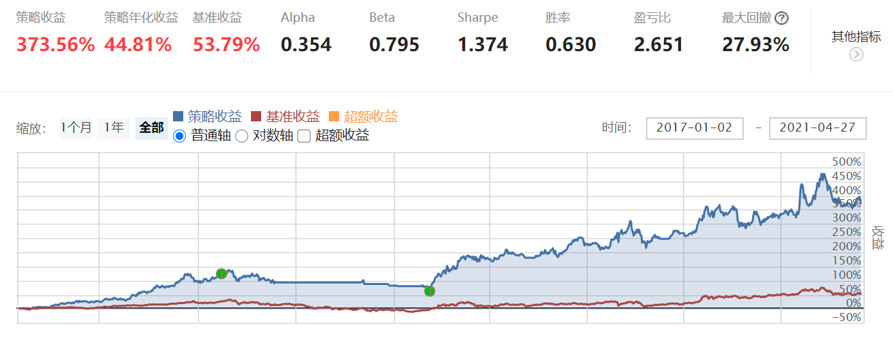

代码如下

```
from kuanke.wizard import *
from jqdata import *
import numpy as np
import pandas as pd
import talib
import datetime
import time
import math


## 初始化函数，设定要操作的股票、基准等等
def initialize(context):
    # 设定基准
    set_benchmark('000300.XSHG')
    # 设定滑点
    set_slippage(FixedSlippage(0.01))
    # True为开启动态复权模式，使用真实价格交易
    set_option('use_real_price', True)
    # 设定成交量比例
    set_option('order_volume_ratio', 1)
    # 股票类交易手续费是：买入时佣金万分之三，卖出时佣金万分之三加千分之一印花税, 每笔交易佣金最低扣5块钱
    set_order_cost(OrderCost(open_tax=0, close_tax=0.001, open_commission=0.0003, close_commission=0.0003, min_commission=5), type='stock')
    #容器初始化
    check_container_initialize()
    #动态仓位、频率、计数初始化函数
    check_dynamic_initialize()
    # 股票筛选初始化函数
    check_stocks_initialize()
    # 出场初始化函数
    sell_initialize()
    # 入场初始化函数
    buy_initialize()


    # 关闭提示
    log.set_level('order', 'info')

    # 运行函数
    run_daily(check_stocks, '9:15') #选股
    run_daily(main_stock_pick, '9:16') #买入卖出列表
    run_daily(sell_every_day,'open') #卖出未卖出成功的股票
    run_daily(trade, 'open') #交易
    run_daily(selled_security_list_count, 'after_close') #卖出股票日期计数
    
    
    
#######################！！！新手需要使用的地方！！！###################################################
##动态仓位、频率、计数初始化函数(持仓比例，选股频率，买入频率，卖出频率在这里设置)
def check_dynamic_initialize():
    # 个股最大持仓比重
    g.security_max_proportion = 1
    # 选股和买卖频率
    g.check_stocks_refresh_rate = 1
    # 最大建仓数量
    g.max_hold_stocknum = 3
    
    #下面这几项不用管
    # 买入频率
    g.buy_refresh_rate = 1
    # 卖出频率
    g.sell_refresh_rate = 1

    # 选股频率计数器
    g.check_stocks_days = 0
    #机器学习选股频率计数器
    g.days = 0
    # 买卖交易频率计数器
    g.buy_trade_days=0
    g.sell_trade_days=0

    
## 股票池初筛设置函数(股票初筛在这里设置)
def check_stocks_initialize():
    # 是否过滤停盘
    g.filter_paused = True
    # 是否过滤退市
    g.filter_delisted = True
    # 是否只有ST
    g.only_st = False
    # 是否过滤ST
    g.filter_st = True
    # 股票池(填指数)
    g.security_universe_index = ['000905.XSHG','000300.XSHG']#这里填写指数，全部股票就填['all_a_securities']，沪深300股票就填['000300.XSHG'],中证500就填['000905.XSHG'],沪深300+中证500就填['000300.XSHG','000905.XSHG']
    # 填成分股(填成分股)
    g.security_universe_user_securities = []
    # 行业列表
    g.industry_list = ["801010","801020","801030","801040","801050","801080","801110","801120","801130","801140","801150","801160","801170","801180","801200","801210","801230","801710","801720","801730","801740","801750","801760","801770","801780","801790","801880","801890"]
    # 概念列表
    g.concept_list = []
    # 黑名单
    g.blacklist=['300268.XSHE','600035.XSHG','300028.XSHE']
    
## 买入股票，卖出股票筛选函数
def main_stock_pick(context):
    if g.days % g.check_stocks_refresh_rate != 0:
        g.days +=1
        return
    g.sell_stock_list=[]
    g.buy_stock_list = []

####自定义编辑范围#####    

#ROA白马策略

    q = query(valuation.code).filter(
                    valuation.code.in_(g.check_out_lists),
                    indicator.inc_revenue_year_on_year > 0,
                    indicator.inc_net_profit_year_on_year > 0,
                    indicator.inc_revenue_annual > 0,
                    indicator.inc_net_profit_annual > 0 ,
                    indicator.net_profit_margin > 0 ,
                    valuation.pe_ratio > 0, 
                    valuation.pe_ratio < 88,
                    indicator.roe > 4).order_by(indicator.roa.desc()) 

    df=get_fundamentals(q)
    
    stockset = list(df['code'])
    g.sell_stock_list1 = list(context.portfolio.positions.keys())
    
    current_data = get_current_data()
    
    paused_list = [stock for stock in g.sell_stock_list1 if  current_data[stock].paused]
    

    for stock in g.sell_stock_list1:
        if stock in paused_list:
            continue
        elif stock not in stockset[:g.max_hold_stocknum]:
                g.sell_stock_list.append(stock)
        elif Stop_loss(context):
            g.sell_stock_list.append(stock)
            
        
    for stock in stockset[:g.max_hold_stocknum]:
        if stock in g.sell_stock_list:
            pass
        if Stop_loss(context):
            pass
        else:
            g.buy_stock_list.append(stock)
####自定义编辑范围#####              

    log.info('卖出列表:',g.sell_stock_list)
    log.info('购买列表:',g.buy_stock_list)
    g.days =1
    return g.sell_stock_list,g.buy_stock_list  
    
    
#######################！！！新手需要使用的地方！！！###################################################


##容器初始化(有新的全局容器可以加到这里)(新手忽略这里)
def check_container_initialize():
    #卖出股票列表
    g.sell_stock_list=[]
    #买入股票列表
    g.buy_stock_list = []
    # 获取未卖出的股票
    g.open_sell_securities = []
    # 卖出股票的dict
    g.selled_security_list={}
    #涨停股票列表
    g.ZT=[]    
    

## 出场初始化函数(新手忽略这里)
def sell_initialize():
    # 设定是否卖出buy_lists中的股票
    g.sell_will_buy = True

    # 固定出仓的数量或者百分比
    g.sell_by_amount = None
    g.sell_by_percent = None

## 入场初始化函数(新手忽略这里)
def buy_initialize():
    # 是否可重复买入
    g.filter_holded = False

    # 委托类型
    g.order_style_str = 'by_cap_mean'
    g.order_style_value = 100


## 股票初筛(新手忽略这里)
def check_stocks(context):
    if g.check_stocks_days%g.check_stocks_refresh_rate != 0:
        # 计数器加一
        g.check_stocks_days += 1
        return
    # 股票池赋值
    g.check_out_lists = get_security_universe(context, g.security_universe_index, g.security_universe_user_securities)
    # 行业过滤
    g.check_out_lists = industry_filter(context, g.check_out_lists, g.industry_list)
    # 概念过滤
    g.check_out_lists = concept_filter(context, g.check_out_lists, g.concept_list)
    # 过滤ST股票
    g.check_out_lists = st_filter(context, g.check_out_lists)
    # 过滤停牌股票
    g.check_out_lists = paused_filter(context, g.check_out_lists)
    # 过滤退市股票
    g.check_out_lists = delisted_filter(context, g.check_out_lists)
    # 过滤黑名单股票
    g.check_out_lists = [s for s in g.check_out_lists if s not in g.blacklist]
    # 计数器归一
    g.check_stocks_days = 1
    return


## 卖出未卖出成功的股票(新手忽略这里)
def sell_every_day(context):
    g.open_sell_securities = list(set(g.open_sell_securities))
    open_sell_securities = [s for s in context.portfolio.positions.keys() if s in g.open_sell_securities]
    if len(open_sell_securities)>0:
        for stock in open_sell_securities:
            order_target_value(stock, 0)
    g.open_sell_securities = [s for s in g.open_sell_securities if s in context.portfolio.positions.keys()]
    return


## 交易函数(新手忽略这里)
def trade(context):
   # 初始化买入列表
    buy_lists = []

    # 买入股票筛选
    if g.buy_trade_days%g.buy_refresh_rate == 0:
        # 获取 buy_lists 列表
        buy_lists = g.buy_stock_list
        # 过滤涨停股票
        buy_lists = high_limit_filter(context, buy_lists)
        log.info('购买列表最终',buy_lists)
        

    # 卖出操作
    if g.sell_trade_days%g.sell_refresh_rate != 0:
        # 计数器加一
        g.sell_trade_days += 1
    else:
        # 卖出股票
        sell(context, buy_lists)
        # 计数器归一
        g.sell_trade_days = 1


    # 买入操作
    if g.buy_trade_days%g.buy_refresh_rate != 0:
        # 计数器加一
        g.buy_trade_days += 1
    else:
        # 卖出股票
        buy(context, buy_lists)
        # 计数器归一
        g.buy_trade_days = 1


##################################  交易函数群 ##################################(新手忽略)

# 交易函数 - 出场
def sell(context, buy_lists):
    # 获取 sell_lists 列表
    init_sl = context.portfolio.positions.keys()
    sell_lists = context.portfolio.positions.keys()

    # 判断是否卖出buy_lists中的股票
    if not g.sell_will_buy:
        sell_lists = [security for security in sell_lists if security not in buy_lists]

    ### _出场函数筛选-开始 ###
    sell_lists = g.sell_stock_list
    ### _出场函数筛选-结束 ###

    # 卖出股票
    if len(sell_lists)>0:
        for stock in sell_lists:
            sell_by_amount_or_percent_or_none(context,stock, g.sell_by_amount, g.sell_by_percent, g.open_sell_securities)

    # 获取卖出的股票, 并加入到 g.selled_security_list中
    selled_security_list_dict(context,init_sl)

    return

# 交易函数 - 入场
def buy(context, buy_lists):

    # 判断是否可重复买入
    buy_lists = holded_filter(context,buy_lists)

    # 获取最终的 buy_lists 列表
    Num = g.max_hold_stocknum - len(context.portfolio.positions)
    buy_lists = buy_lists[:Num]

    # 买入股票
    if len(buy_lists)>0:
        # 分配资金
        result = order_style(context,buy_lists,g.max_hold_stocknum, g.order_style_str, g.order_style_value)
        for stock in buy_lists:
            if len(context.portfolio.positions) < g.max_hold_stocknum:
                # 获取资金
                Cash = result[stock]
                # 判断个股最大持仓比重
                value = judge_security_max_proportion(context,stock,Cash,g.security_max_proportion)
                # 判断单只最大买入股数或金额
                amount = max_buy_value_or_amount(stock,value,None,None)
                # 下单
                order(stock, amount, MarketOrderStyle())
    return


###################################  公用函数群 ##################################(新手忽略)


## 过滤同一标的继上次卖出N天不再买入
def filter_n_tradeday_not_buy(security, n=0):
    try:
        if (security in g.selled_security_list.keys()) and (g.selled_security_list[security]<n):
            return False
        return True
    except:
        return True

## 是否可重复买入
def holded_filter(context,security_list):
    if not g.filter_holded:
        security_list = [stock for stock in security_list if stock not in context.portfolio.positions.keys()]
    # 返回结果
    return security_list

## 卖出股票加入dict
def selled_security_list_dict(context,security_list):
    selled_sl = [s for s in security_list if s not in context.portfolio.positions.keys()]
    if len(selled_sl)>0:
        for stock in selled_sl:
            g.selled_security_list[stock] = 0

## 过滤停牌股票
def paused_filter(context, security_list):
    if g.filter_paused:
        current_data = get_current_data()
        security_list = [stock for stock in security_list if not current_data[stock].paused]
    # 返回结果
    return security_list

## 过滤退市股票
def delisted_filter(context, security_list):
    if g.filter_delisted:
        current_data = get_current_data()
        security_list = [stock for stock in security_list if not (('退' in current_data[stock].name) or ('*' in current_data[stock].name))]
    # 返回结果
    return security_list


## 过滤ST股票
def st_filter(context, security_list):
    if g.only_st:
        current_data = get_current_data()
        security_list = [stock for stock in security_list if current_data[stock].is_st]
    else:
        if g.filter_st:
            current_data = get_current_data()
            security_list = [stock for stock in security_list if not current_data[stock].is_st]
    # 返回结果
    return security_list

# 过滤涨停股票
def high_limit_filter(context, security_list):
    current_data = get_current_data()
    security_list = [stock for stock in security_list if not (current_data[stock].day_open >= current_data[stock].high_limit)]
    # 返回结果
    return security_list

# 获取股票股票池
def get_security_universe(context, security_universe_index, security_universe_user_securities):
    temp_index = []
    for s in security_universe_index:
        if s == 'all_a_securities':
            temp_index += list(get_all_securities(['stock'], context.current_dt.date()).index)
        else:
            temp_index += get_index_stocks(s)
    for x in security_universe_user_securities:
        temp_index += x
    return  sorted(list(set(temp_index)))

# 行业过滤
def industry_filter(context, security_list, industry_list):
    if len(industry_list) == 0:
        # 返回股票列表
        return security_list
    else:
        securities = []
        for s in industry_list:
            temp_securities = get_industry_stocks(s)
            securities += temp_securities
        security_list = [stock for stock in security_list if stock in securities]
        # 返回股票列表
        return security_list

# 概念过滤
def concept_filter(context, security_list, concept_list):
    if len(concept_list) == 0:
        return security_list
    else:
        securities = []
        for s in concept_list:
            temp_securities = get_concept_stocks(s)
            securities += temp_securities
        security_list = [stock for stock in security_list if stock in securities]
        # 返回股票列表
        return security_list
        
## 卖出股票日期计数
def selled_security_list_count(context):
    #g.daily_risk_management = True
    if len(g.selled_security_list)>0:
        for stock in g.selled_security_list.keys():
            g.selled_security_list[stock] += 1
            
#获取交易日
def shifttradingday(date,shift):
    #获取N天前的交易日日期
    # 获取所有的交易日，返回一个包含所有交易日的 list,元素值为 datetime.date 类型.
    tradingday = get_all_trade_days()
    # 得到date之后shift天那一天在列表中的行标号 返回一个数
    shiftday_index = list(tradingday).index(date)+shift
    # 根据行号返回该日日期 为datetime.date类型
    return tradingday[shiftday_index]     
#自定义函数
def Stop_loss(context):
    n1 = 1
    n2 = 70
    n3 = 90
    prices = get_bars('000300.XSHG', n3, unit='1d',fields=['close'],include_now=True)
    close = prices['close']

    MA1 = close[-1]
    MA2 = sum(close[-n2:])/n2
    MA3 = sum(close[-n3:])/n3
    if (MA1<MA2 and MA2<MA3):
        log.info('警告！大盘危险，空仓！')
        return True
    else:
        return False
```


## 科创板医疗医药股策略

2020年1月到今年的6月26日，总收益达到了472%，折合成年化238%，还有非常优秀的：

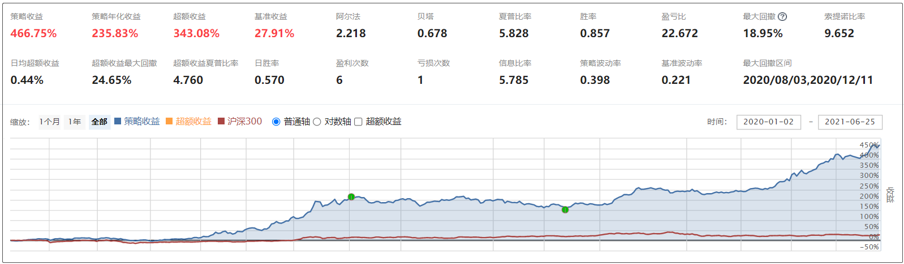
  

进入正题，说一下这个策略的思路：**就是选业绩增长稳定且ROA高的科创板医疗医药股，然后不断轮动。**
### 
逻辑细节是这样的：

**股票池：**申万一级行业医药生物。
### 
 **筛选机制：**过滤ST，过滤退市股。
### 
 **选股条件：**PE在20-150倍之间，营收、净利润同比皆增长20%以上。并按照ROA从大到小排序，取排名前3的股票。
### 
 **调仓逻辑：**策略用轮动的方式进行买卖，每日触发一次选股条件，在前3名的股票会继续持有，掉出前3名股票就会卖掉
### 
 科创板的门槛高，主要是大户和机构在参与，他们相对偏好医疗和消费。而科创板没消费，只有医疗。并且很多在科创板上市的医药医疗股赛道都不错，挺有想象力的。
```
from kuanke.wizard import *
from jqdata import *
import numpy as np
import pandas as pd
import talib
import datetime

## 初始化函数，设定要操作的股票、基准等等
def initialize(context):
    # 设定基准
    set_benchmark('000300.XSHG')
    # 设定滑点
    set_slippage(FixedSlippage(0.02))
    # True为开启动态复权模式，使用真实价格交易
    set_option('use_real_price', True)
    # 设定成交量比例
    set_option('order_volume_ratio', 1)
    # 股票类交易手续费是：买入时佣金万分之三，卖出时佣金万分之三加千分之一印花税, 每笔交易佣金最低扣5块钱
    set_order_cost(OrderCost(open_tax=0, close_tax=0.001, open_commission=0.0003, close_commission=0.0003, min_commission=5), type='stock')
    # 个股最大持仓比重
    g.security_max_proportion = 1
    # 选股频率
    g.check_stocks_refresh_rate = 1
    # 买入频率
    g.buy_refresh_rate = 1
    # 卖出频率
    g.sell_refresh_rate = 1
    # 最大建仓数量
    g.max_hold_stocknum = 3

    # 选股频率计数器
    g.check_stocks_days = 0
    # 买卖交易频率计数器
    g.buy_trade_days=0
    g.sell_trade_days=0
    # 获取未卖出的股票
    g.open_sell_securities = []
    # 卖出股票的dict
    g.selled_security_list={}

    # 股票筛选初始化函数
    check_stocks_initialize()
    # 股票筛选排序初始化函数
    check_stocks_sort_initialize()
    # 出场初始化函数
    sell_initialize()
    # 入场初始化函数
    buy_initialize()
    # 风控初始化函数
    risk_management_initialize()

    # 关闭提示
    log.set_level('order', 'info')

    # 运行函数
    run_daily(sell_every_day,'open') #卖出未卖出成功的股票
    run_daily(risk_management, 'every_bar') #风险控制
    run_daily(check_stocks, 'open') #选股
    run_daily(trade, 'open') #交易
    run_daily(selled_security_list_count, 'after_close') #卖出股票日期计数


## 股票筛选初始化函数
def check_stocks_initialize():
    # 是否过滤停盘
    g.filter_paused = True
    # 是否过滤退市
    g.filter_delisted = True
    # 是否只有ST
    g.only_st = False
    # 是否过滤ST
    g.filter_st = True
    # 股票池
    g.security_universe_index = ["all_a_securities"]
    g.security_universe_user_securities = []
    # 行业列表
    g.industry_list = ["801150"]
    # 概念列表
    g.concept_list = []

## 股票筛选排序初始化函数
def check_stocks_sort_initialize():
    # 总排序准则： desc-降序、asc-升序
    g.check_out_lists_ascending = 'desc'

## 出场初始化函数
def sell_initialize():
    # 设定是否卖出buy_lists中的股票
    g.sell_will_buy = False

    # 固定出仓的数量或者百分比
    g.sell_by_amount = None
    g.sell_by_percent = None

## 入场初始化函数
def buy_initialize():
    # 是否可重复买入
    g.filter_holded = False

    # 委托类型
    g.order_style_str = 'by_cap_mean'
    g.order_style_value = 100

## 风控初始化函数
def risk_management_initialize():
    # 策略风控信号
    g.risk_management_signal = True

    # 策略当日触发风控清仓信号
    g.daily_risk_management = True

    # 单只最大买入股数或金额
    g.max_buy_value = None
    g.max_buy_amount = None


## 卖出未卖出成功的股票
def sell_every_day(context):
    g.open_sell_securities = list(set(g.open_sell_securities))
    open_sell_securities = [s for s in context.portfolio.positions.keys() if s in g.open_sell_securities]
    if len(open_sell_securities)>0:
        for stock in open_sell_securities:
            order_target_value(stock, 0)
    g.open_sell_securities = [s for s in g.open_sell_securities if s in context.portfolio.positions.keys()]
    return

## 风控
def risk_management(context):
    ### _风控函数筛选-开始 ###
    ### _风控函数筛选-结束 ###
    return

## 股票筛选
def check_stocks(context):
    if g.check_stocks_days%g.check_stocks_refresh_rate != 0:
        # 计数器加一
        g.check_stocks_days += 1
        return
    # 股票池赋值
    g.check_out_lists = get_security_universe(context, g.security_universe_index, g.security_universe_user_securities)
    g.check_out_lists = [stock for stock in g.check_out_lists if stock[:3]== "688"]
    # 行业过滤
    g.check_out_lists = industry_filter(context, g.check_out_lists, g.industry_list)
    # 概念过滤
    g.check_out_lists = concept_filter(context, g.check_out_lists, g.concept_list)
    # 过滤ST股票
    g.check_out_lists = st_filter(context, g.check_out_lists)
    # 过滤退市股票
    g.check_out_lists = delisted_filter(context, g.check_out_lists)
    # 财务筛选
    g.check_out_lists = financial_statements_filter(context, g.check_out_lists)
    # 行情筛选
    g.check_out_lists = situation_filter(context, g.check_out_lists)
    # 技术指标筛选
    g.check_out_lists = technical_indicators_filter(context, g.check_out_lists)
    # 形态指标筛选函数
    g.check_out_lists = pattern_recognition_filter(context, g.check_out_lists)
    # 其他筛选函数
    g.check_out_lists = other_func_filter(context, g.check_out_lists)

    # 排序
    input_dict = get_check_stocks_sort_input_dict()
    g.check_out_lists = check_stocks_sort(context,g.check_out_lists,input_dict,g.check_out_lists_ascending)

    # 计数器归一
    g.check_stocks_days = 1
    return

## 交易函数
def trade(context):
   # 初始化买入列表
    buy_lists = []

    # 买入股票筛选
    if g.buy_trade_days%g.buy_refresh_rate == 0:
        # 获取 buy_lists 列表
        buy_lists = g.check_out_lists
        # 过滤ST股票
        buy_lists = st_filter(context, buy_lists)
        # 过滤停牌股票
        buy_lists = paused_filter(context, buy_lists)
        # 过滤退市股票
        buy_lists = delisted_filter(context, buy_lists)
        # 过滤涨停股票
        buy_lists = high_limit_filter(context, buy_lists)

        ### _入场函数筛选-开始 ###
        ### _入场函数筛选-结束 ###

    # 卖出操作
    if g.sell_trade_days%g.sell_refresh_rate != 0:
        # 计数器加一
        g.sell_trade_days += 1
    else:
        # 卖出股票
        sell(context, buy_lists)
        # 计数器归一
        g.sell_trade_days = 1


    # 买入操作
    if g.buy_trade_days%g.buy_refresh_rate != 0:
        # 计数器加一
        g.buy_trade_days += 1
    else:
        # 卖出股票
        buy(context, buy_lists)
        # 计数器归一
        g.buy_trade_days = 1

## 卖出股票日期计数
def selled_security_list_count(context):
    g.daily_risk_management = True
    if len(g.selled_security_list)>0:
        for stock in g.selled_security_list.keys():
            g.selled_security_list[stock] += 1

##################################  选股函数群 ##################################

## 财务指标筛选函数
def financial_statements_filter(context, security_list):
    ### _财务指标筛选函数-开始 ###
    security_list = financial_data_filter_qujian(security_list, valuation.pe_ratio, (20,150))
    security_list = financial_data_filter_dayu(security_list, indicator.inc_revenue_year_on_year, 20)
    security_list = financial_data_filter_dayu(security_list, indicator.inc_net_profit_year_on_year, 20)
    ### _财务指标筛选函数-结束 ###

    # 返回列表
    return security_list

## 行情筛选函数
def situation_filter(context, security_list):
    ### _行情筛选函数-开始 ###
    ### _行情筛选函数-结束 ###

    # 返回列表
    return security_list

## 技术指标筛选函数
def technical_indicators_filter(context, security_list):
    ### _技术指标筛选函数-开始 ###
    ### _技术指标筛选函数-结束 ###

    # 返回列表
    return security_list

## 形态指标筛选函数
def pattern_recognition_filter(context, security_list):
    ### _形态指标筛选函数-开始 ###
    ### _形态指标筛选函数-结束 ###

    # 返回列表
    return security_list

## 其他方式筛选函数
def other_func_filter(context, security_list):
    ### _其他方式筛选函数-开始 ###
    ### _其他方式筛选函数-结束 ###

    # 返回列表
    return security_list

# 获取选股排序的 input_dict
def get_check_stocks_sort_input_dict():
    input_dict = {
        indicator.roa:('desc',100),
        }
    # 返回结果
    return input_dict

##################################  交易函数群 ##################################
# 交易函数 - 出场
def sell(context, buy_lists):
    # 获取 sell_lists 列表
    init_sl = context.portfolio.positions.keys()
    sell_lists = context.portfolio.positions.keys()

    # 判断是否卖出buy_lists中的股票
    if not g.sell_will_buy:
        sell_lists = [security for security in sell_lists if security not in buy_lists]

    ### _出场函数筛选-开始 ###
    ### _出场函数筛选-结束 ###

    # 卖出股票
    if len(sell_lists)>0:
        for stock in sell_lists:
            limit_price = attribute_history(stock, 1, unit='1m',fields=['close'],skip_paused=True, df=True, fq='pre')
            limit_price  = limit_price['close'][-1]
            order_target_value(stock, 0, MarketOrderStyle(limit_price*0.9))

    # 获取卖出的股票, 并加入到 g.selled_security_list中
    selled_security_list_dict(context,init_sl)

    return

# 交易函数 - 入场
def buy(context, buy_lists):
    # 风控信号判断
    if not g.risk_management_signal:
        return

    # 判断当日是否触发风控清仓止损
    if not g.daily_risk_management:
        return
    # 判断是否可重复买入
    buy_lists = holded_filter(context,buy_lists)

    # 获取最终的 buy_lists 列表
    Num = g.max_hold_stocknum - len(context.portfolio.positions)
    buy_lists = buy_lists[:Num]

    # 买入股票
    if len(buy_lists)>0:
        # 分配资金
        
        for stock in buy_lists:
            if len(context.portfolio.positions) < g.max_hold_stocknum:
                buyNum = g.max_hold_stocknum - len(context.portfolio.positions)
                # 获取资金
                Cash =  context.portfolio.available_cash/buyNum
                # 判断个股最大持仓比重
                
                value = judge_security_max_proportion(context,stock,Cash,g.security_max_proportion)
                # 判断单只最大买入股数或金额
                amount = max_buy_value_or_amount(stock,value,g.max_buy_value,g.max_buy_amount)
                print(stock,Cash,value,amount)
                limit_price = attribute_history(stock, 1, unit='1m',fields=['close'],skip_paused=True, df=True, fq='pre')
                limit_price  = limit_price['close'][-1]
                # 下单
                order(stock, amount, MarketOrderStyle(limit_price*1.03))
    return

###################################  公用函数群 ##################################
## 排序
def check_stocks_sort(context,security_list,input_dict,ascending='desc'):
    if (len(security_list) == 0) or (len(input_dict) == 0):
        return security_list
    else:
        # 生成 key 的 list
        idk = list(input_dict.keys())
        # 生成矩阵
        a = pd.DataFrame()
        for i in idk:
            b = get_sort_dataframe(security_list, i, input_dict[i])
            a = pd.concat([a,b],axis = 1)
        # 生成 score 列
        a['score'] = a.sum(1,False)
        # 根据 score 排序
        if ascending == 'asc':# 升序
            if hasattr(a, 'sort'):
                a = a.sort(['score'],ascending = True)
            else:
                a = a.sort_values(['score'],ascending = True)
        elif ascending == 'desc':# 降序
            if hasattr(a, 'sort'):
                a = a.sort(['score'],ascending = False)
            else:
                a = a.sort_values(['score'],ascending = False)
        # 返回结果
        return list(a.index)

## 过滤同一标的继上次卖出N天不再买入
def filter_n_tradeday_not_buy(security, n=0):
    try:
        if (security in g.selled_security_list.keys()) and (g.selled_security_list[security]<n):
            return False
        return True
    except:
        return True

## 是否可重复买入
def holded_filter(context,security_list):
    if not g.filter_holded:
        security_list = [stock for stock in security_list if stock not in context.portfolio.positions.keys()]
    # 返回结果
    return security_list

## 卖出股票加入dict
def selled_security_list_dict(context,security_list):
    selled_sl = [s for s in security_list if s not in context.portfolio.positions.keys()]
    if len(selled_sl)>0:
        for stock in selled_sl:
            g.selled_security_list[stock] = 0

## 过滤停牌股票
def paused_filter(context, security_list):
    if g.filter_paused:
        current_data = get_current_data()
        security_list = [stock for stock in security_list if not current_data[stock].paused]
    # 返回结果
    return security_list

## 过滤退市股票
def delisted_filter(context, security_list):
    if g.filter_delisted:
        current_data = get_current_data()
        security_list = [stock for stock in security_list if not (('退' in current_data[stock].name) or ('*' in current_data[stock].name))]
    # 返回结果
    return security_list


## 过滤ST股票
def st_filter(context, security_list):
    if g.only_st:
        current_data = get_current_data()
        security_list = [stock for stock in security_list if current_data[stock].is_st]
    else:
        if g.filter_st:
            current_data = get_current_data()
            security_list = [stock for stock in security_list if not current_data[stock].is_st]
    # 返回结果
    return security_list

# 过滤涨停股票
def high_limit_filter(context, security_list):
    current_data = get_current_data()
    security_list = [stock for stock in security_list if not (current_data[stock].day_open >= current_data[stock].high_limit)]
    # 返回结果
    return security_list

# 获取股票股票池
def get_security_universe(context, security_universe_index, security_universe_user_securities):
    temp_index = []
    for s in security_universe_index:
        if s == 'all_a_securities':
            temp_index += list(get_all_securities(['stock'], context.current_dt.date()).index)
        else:
            temp_index += get_index_stocks(s)
    for x in security_universe_user_securities:
        temp_index += x
    return  sorted(list(set(temp_index)))

# 行业过滤
def industry_filter(context, security_list, industry_list):
    if len(industry_list) == 0:
        # 返回股票列表
        return security_list
    else:
        securities = []
        for s in industry_list:
            temp_securities = get_industry_stocks(s)
            securities += temp_securities
        security_list = [stock for stock in security_list if stock in securities]
        # 返回股票列表
        return security_list

# 概念过滤
def concept_filter(context, security_list, concept_list):
    if len(concept_list) == 0:
        return security_list
    else:
        securities = []
        for s in concept_list:
            temp_securities = get_concept_stocks(s)
            securities += temp_securities
        security_list = [stock for stock in security_list if stock in securities]
        # 返回股票列表
        return security_list

#自定义函数
```


## 净利润断层修正版-随机排序

买净利润断层票，胜率怎么样，收益怎么样，我做了一个随机排序策略，就是选出断层股后，随机排序，盲买断层股，这种策略，每次回测买的断层股都会有不同。那么就能通过多次回测，来模拟盲买断层股，最终大致会有一个什么样的收益了。

股票池：所有行业无限制

选股逻辑：业绩预告、快报、财报的业绩超预期。且公布后的一天高开3%以上，并且当日收阳线。这个超预期其实应该是超过分析师预期，但爬取分析师预期还有点难度，所以我把超预期这个指标，替换成了业绩增长大于20%。

  

买入逻辑：选出断层票后，随机排序，在次日早上9:30买入。  

  

卖出逻辑：持有大于180天，个股盈利大于120%，个股跌幅20%。满足任意一个条件就卖出

  

持仓数：3只

本质上，净利润断层策略是基本面与技术面共振双击下的选股模式，具有较强的选股逻辑和较高的可实操性。

从2019年1月到2021年9月8日的回测，去除了各种限制，收益依然还是不错的：
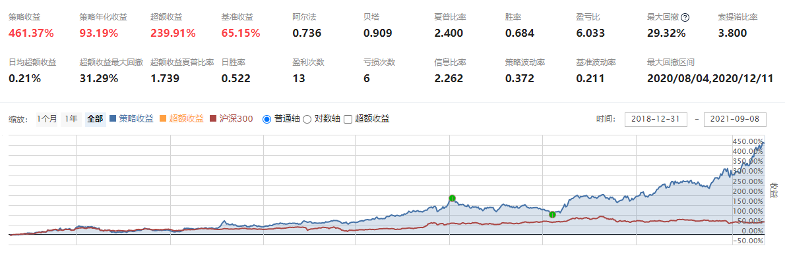

  

这个策略我做了很多研究，其实更适合主观使用，首先超预期其实是需要主观去判断有没有超预期，其次主观可以筛选出更优秀的股票，卖点也比较灵活。

源码如下：
```
from kuanke.wizard import *
from jqdata import *
import numpy as np
import pandas as pd
import talib
import datetime
import time
import math

from jqdata import *
from jqdata import jy
import pandas as pd
from jqdata import finance 

## 初始化函数，设定要操作的股票、基准等等
def initialize(context):
    # 设定基准
    set_benchmark('000300.XSHG')
    # 设定滑点
    set_slippage(FixedSlippage(0.02))
    # True为开启动态复权模式，使用真实价格交易
    set_option('use_real_price', True)
    # 设定成交量比例
    set_option('order_volume_ratio', 1)
    # 股票类交易手续费是：买入时佣金万分之三，卖出时佣金万分之三加千分之一印花税, 每笔交易佣金最低扣5块钱
    set_order_cost(OrderCost(open_tax=0, close_tax=0.001, open_commission=0.0003, close_commission=0.0003, min_commission=5), type='stock')
    #卖出股票列表
    g.sell_stock_list=[]

    g.buy_lists123 = []
    # 个股最大持仓比重
    g.security_max_proportion = 1
    # 选股频率
    g.check_stocks_refresh_rate = 1
    # 买入频率
    g.buy_refresh_rate = 1
    # 卖出频率
    g.sell_refresh_rate = 1
    # 最大建仓数量
    g.max_hold_stocknum = 3
    cur_time = context.current_dt
    # 选股频率计数器
    g.check_stocks_days = 0

    g.days = 0
    # 买卖交易频率计数器
    g.buy_trade_days=0
    g.sell_trade_days=0
    # 获取未卖出的股票
    g.open_sell_securities = []
    # 卖出股票的dict
    g.selled_security_list={}

    #涨停
    g.check_out_lists1=[]
    g.check_out_lists2=[]

    g.ZT =[]
    #风险参考基准
    g.security = '000300.XSHG'


    check_stocks_initialize()
    # 股票筛选排序初始化函数
    check_stocks_sort_initialize()
    # 出场初始化函数
    sell_initialize()
    # 入场初始化函数
    buy_initialize()


    # 关闭提示
    log.set_level('order', 'info')

    # 运行函数
    run_daily(check_stocks, '9:15') #选股
    run_daily(day_open_filter123, '9:16') #买入卖出列表
    run_daily(sell_every_day,'open') #卖出未卖出成功的股票
    run_daily(trade, 'open') #交易
    run_daily(selled_security_list_count, 'after_close') #卖出股票日期计数


## 股票筛选初始化函数
def check_stocks_initialize():
    # 是否过滤停盘
    g.filter_paused = True
    # 是否过滤退市
    g.filter_delisted = True
    # 是否只有ST
    g.only_st = False
    # 是否过滤ST
    g.filter_st = True
    # 股票池
    g.security_universe_index = ['all_a_securities']
    g.security_universe_user_securities = []
    # 行业列表
    g.industry_list = ["801010","801020","801030","801040","801050","801080","801110","801120","801130","801140","801150","801160","801170","801180","801200","801210","801230","801710","801720","801730","801740","801750","801760","801770","801780","801790","801880","801890"]
    # 概念列表
    g.concept_list = []
    g.blacklist= ['300601.XSHE']

## 股票筛选排序初始化函数
def check_stocks_sort_initialize():
    # 总排序准则： desc-降序、asc-升序
    g.check_out_lists_ascending = 'desc'

## 出场初始化函数
def sell_initialize():
    # 设定是否卖出buy_lists中的股票
    g.sell_will_buy = True

    # 固定出仓的数量或者百分比
    g.sell_by_amount = None
    g.sell_by_percent = None

## 入场初始化函数
def buy_initialize():
    # 是否可重复买入
    g.filter_holded = False

    # 委托类型
    g.order_style_str = 'by_cap_mean'
    g.order_style_value = 100

## 卖出未卖出成功的股票
def sell_every_day(context):
    g.open_sell_securities = list(set(g.open_sell_securities))
    open_sell_securities = [s for s in context.portfolio.positions.keys() if s in g.open_sell_securities]
    if len(open_sell_securities)>0:
        for stock in open_sell_securities:
            order_target_value(stock, 0)
    g.open_sell_securities = [s for s in g.open_sell_securities if s in context.portfolio.positions.keys()]
    return

## 股票筛选
def check_stocks(context):
    if g.check_stocks_days%g.check_stocks_refresh_rate != 0:
        # 计数器加一
        g.check_stocks_days += 1
        return
    # 股票池赋值
    g.check_out_lists = get_security_universe(context, g.security_universe_index, g.security_universe_user_securities)
    # 行业过滤
    g.check_out_lists = industry_filter(context, g.check_out_lists, g.industry_list)
    # 概念过滤
    g.check_out_lists = concept_filter(context, g.check_out_lists, g.concept_list)
    # 过滤ST股票
    g.check_out_lists = st_filter(context, g.check_out_lists)
    # 过滤停牌股票
    g.check_out_lists = paused_filter(context, g.check_out_lists)
    # 过滤退市股票
    g.check_out_lists = delisted_filter(context, g.check_out_lists)
    g.check_out_lists1=[]
    g.check_out_lists2=[]
    g.check_out_lists1= g.check_out_lists
    g.check_out_lists2= g.check_out_lists

    # 计数器归一
    g.check_stocks_days = 1
    return

## 交易函数
def trade(context):
   # 初始化买入列表
    buy_lists = []

    # 买入股票筛选
    if g.buy_trade_days%g.buy_refresh_rate == 0:
        # 获取 buy_lists 列表
        buy_lists = g.buy_lists123
        # 过滤ST股票
        buy_lists = st_filter(context, buy_lists)
        # 过滤停牌股票
        buy_lists = paused_filter(context, buy_lists)
        # 过滤退市股票
        buy_lists = delisted_filter(context, buy_lists)
        # 过滤涨停股票
        g.ZT = high_limit_filter(context, buy_lists)
        print("zhangt1:",g.ZT)

        ### _入场函数筛选-开始 ###

        ### _入场函数筛选-结束 ###
        log.info('购买列表最终',buy_lists)

    # 卖出操作
    if g.sell_trade_days%g.sell_refresh_rate != 0:
        # 计数器加一
        g.sell_trade_days += 1
    else:
        # 卖出股票
        sell(context, buy_lists)
        # 计数器归一
        g.sell_trade_days = 1


    # 买入操作
    if g.buy_trade_days%g.buy_refresh_rate != 0:
        # 计数器加一
        g.buy_trade_days += 1
    else:
        # 卖出股票
        buy(context, buy_lists)
        # 计数器归一
        g.buy_trade_days = 1

## 卖出股票日期计数
def selled_security_list_count(context):
    #g.daily_risk_management = True
    if len(g.selled_security_list)>0:
        for stock in g.selled_security_list.keys():
            g.selled_security_list[stock] += 1

##################################  选股函数群 ##################################

## 财务指标筛选函数
def financial_statements_filter(context, security_list):
    ### _财务指标筛选函数-开始 ###
    security_list = financial_data_filter_dayu(security_list, indicator.roe, 4)
    ### _财务指标筛选函数-结束 ###

    # 返回列表
    return security_list

## 行情筛选函数
def situation_filter(context, security_list):
    ### _行情筛选函数-开始 ###
    ### _行情筛选函数-结束 ###

    # 返回列表
    return security_list

## 技术指标筛选函数
def technical_indicators_filter(context, security_list):
    ### _技术指标筛选函数-开始 ###
    ### _技术指标筛选函数-结束 ###

    # 返回列表
    return security_list

## 形态指标筛选函数
def pattern_recognition_filter(context, security_list):
    ### _形态指标筛选函数-开始 ###
    ### _形态指标筛选函数-结束 ###

    # 返回列表
    return security_list

## 其他方式筛选函数
def other_func_filter(context, security_list):
    ### _其他方式筛选函数-开始 ###

    ### _其他方式筛选函数-结束 ###
    #log.info('筛选出来的股票',security_list)
    # 返回列表
    return security_list

# 获取选股排序的 input_dict
def get_check_stocks_sort_input_dict():
    input_dict = {
        indicator.roa:('desc',100),
        }
    # 返回结果
    return input_dict

##################################  交易函数群 ##################################
# 交易函数 - 出场
def sell(context, buy_lists):
    # 获取 sell_lists 列表
    init_sl = context.portfolio.positions.keys()
    sell_lists = context.portfolio.positions.keys()

    # 判断是否卖出buy_lists中的股票
    if not g.sell_will_buy:
        sell_lists = [security for security in sell_lists if security not in buy_lists]

    ### _出场函数筛选-开始 ###
    sell_lists = g.sell_stock_list
    ### _出场函数筛选-结束 ###

    # 卖出股票
    if len(sell_lists)>0:
        for stock in sell_lists:
            sell_by_amount_or_percent_or_none(context,stock, g.sell_by_amount, g.sell_by_percent, g.open_sell_securities)

    # 获取卖出的股票, 并加入到 g.selled_security_list中
    selled_security_list_dict(context,init_sl)

    return

# 交易函数 - 入场
def buy(context, buy_lists):

    # 判断是否可重复买入
    buy_lists = holded_filter(context,buy_lists)

    # 获取最终的 buy_lists 列表
    Num = g.max_hold_stocknum - len(context.portfolio.positions)
    buy_lists = buy_lists[:Num]

    # 买入股票
    if len(buy_lists)>0:
        # 分配资金
        result = order_style(context,buy_lists,g.max_hold_stocknum, g.order_style_str, g.order_style_value)
        for stock in buy_lists:
            if len(context.portfolio.positions) < g.max_hold_stocknum:
                # 获取资金
                Cash = result[stock]
                # 判断个股最大持仓比重
                value = judge_security_max_proportion(context,stock,Cash,g.security_max_proportion)
                # 判断单只最大买入股数或金额
                amount = max_buy_value_or_amount(stock,value,None,None)
                # 下单
                order(stock, amount, MarketOrderStyle())
    return

###################################  公用函数群 ##################################
## 排序
def check_stocks_sort(context,security_list,input_dict,ascending='desc'):
    if (len(security_list) == 0) or (len(input_dict) == 0):
        return security_list
    else:
        # 生成 key 的 list
        idk = list(input_dict.keys())
        # 生成矩阵
        a = pd.DataFrame()
        for i in idk:
            b = get_sort_dataframe(security_list, i, input_dict[i])
            a = pd.concat([a,b],axis = 1)
        # 生成 score 列
        a['score'] = a.sum(1,False)
        # 根据 score 排序
        if ascending == 'asc':# 升序
            if hasattr(a, 'sort'):
                a = a.sort(['score'],ascending = True)
            else:
                a = a.sort_values(['score'],ascending = True)
        elif ascending == 'desc':# 降序
            if hasattr(a, 'sort'):
                a = a.sort(['score'],ascending = False)
            else:
                a = a.sort_values(['score'],ascending = False)
        # 返回结果
        return list(a.index)

## 过滤同一标的继上次卖出N天不再买入
def filter_n_tradeday_not_buy(security, n=0):
    try:
        if (security in g.selled_security_list.keys()) and (g.selled_security_list[security]<n):
            return False
        return True
    except:
        return True

## 是否可重复买入
def holded_filter(context,security_list):
    if not g.filter_holded:
        security_list = [stock for stock in security_list if stock not in context.portfolio.positions.keys()]
    # 返回结果
    return security_list

## 卖出股票加入dict
def selled_security_list_dict(context,security_list):
    selled_sl = [s for s in security_list if s not in context.portfolio.positions.keys()]
    if len(selled_sl)>0:
        for stock in selled_sl:
            g.selled_security_list[stock] = 0

## 过滤停牌股票
def paused_filter(context, security_list):
    if g.filter_paused:
        current_data = get_current_data()
        security_list = [stock for stock in security_list if not current_data[stock].paused]
    # 返回结果
    return security_list

## 过滤退市股票
def delisted_filter(context, security_list):
    if g.filter_delisted:
        current_data = get_current_data()
        security_list = [stock for stock in security_list if not (('退' in current_data[stock].name) or ('*' in current_data[stock].name))]
    # 返回结果
    return security_list


## 过滤ST股票
def st_filter(context, security_list):
    if g.only_st:
        current_data = get_current_data()
        security_list = [stock for stock in security_list if current_data[stock].is_st]
    else:
        if g.filter_st:
            current_data = get_current_data()
            security_list = [stock for stock in security_list if not current_data[stock].is_st]
    # 返回结果
    return security_list

# 过滤涨停股票
def high_limit_filter(context, security_list):
    g.ZT = []
    current_data = get_current_data()
    g.ZT = [stock for stock in security_list if  (current_data[stock].day_open >= current_data[stock].high_limit)]
    # 返回结果
    return g.ZT

# 获取股票股票池
def get_security_universe(context, security_universe_index, security_universe_user_securities):
    temp_index = []
    for s in security_universe_index:
        if s == 'all_a_securities':
            temp_index += list(get_all_securities(['stock'], context.current_dt.date()).index)
        else:
            temp_index += get_index_stocks(s)
    for x in security_universe_user_securities:
        temp_index += x
    return  sorted(list(set(temp_index)))

# 行业过滤
def industry_filter(context, security_list, industry_list):
    if len(industry_list) == 0:
        # 返回股票列表
        return security_list
    else:
        securities = []
        for s in industry_list:
            temp_securities = get_industry_stocks(s)
            securities += temp_securities
        security_list = [stock for stock in security_list if stock in securities]
        # 返回股票列表
        return security_list

# 概念过滤
def concept_filter(context, security_list, concept_list):
    if len(concept_list) == 0:
        return security_list
    else:
        securities = []
        for s in concept_list:
            temp_securities = get_concept_stocks(s)
            securities += temp_securities
        security_list = [stock for stock in security_list if stock in securities]
        # 返回股票列表
        return security_list
#自定义函数
def day_open_filter123(context):
    #g.sell_stock_list=[]
    #g.buy_lists123 = []
    if g.days % g.check_stocks_refresh_rate != 0:
        g.days +=1
        return
    list1 = K_yeji(context)
    list2 = Y_yeji(context)
    list3 = R_yeji(context)
    list4 = g.ZT
    print("zhangt2:",list4)
    list_all = list1+list2+list3
    list_fin = list(set(list_all))
    list_fin = [s for s in list_fin if s not in g.blacklist]
    #print(list_fin)
    buylistnew = []
    ZF=[]
    for stock in list_fin:
        df = attribute_history(stock, 2, '1d', ['open','close'])

        prepreday_close_price = df['close'].tolist()
        prepreday_close_price = prepreday_close_price[0]
        preday_open_price = df['open'].tolist()
        preday_open_price = preday_open_price[1]

        preday_close_price = df['close'].tolist()
        preday_close_price = preday_close_price[1]


        open_ZF = (preday_open_price-prepreday_close_price)/prepreday_close_price
        close_ZF1 = (preday_close_price-preday_open_price)/preday_open_price

        close_ZF2 =(preday_close_price-prepreday_close_price)/prepreday_close_price

        if open_ZF > 0.03 and close_ZF1 >=0:

            buylistnew.append(stock)
            ZF.append(close_ZF1)
    p = {'code':buylistnew,'ZF':ZF}
    
    df_ZF = pd.DataFrame(p)
    df_ZF.set_index(['code'],inplace=True)
    #factor = df_ZF.sort_index(by = 'ZF',ascending=False) 
    stockset = list(df_ZF.index)
    #stockset = list(factor.index)
    if len(g.ZT):
        
        stockset = g.ZT+stockset
        
    g.sell_stock_list=[]
    g.buy_lists123 = []
    g.sell_stock_list1 = list(context.portfolio.positions.keys())
    now =context.current_dt
    for stock in g.sell_stock_list1:
        o =[]
        buy_time = context.portfolio.positions[stock].init_time #开仓时间
        
        delta =now - buy_time
        days = delta.days
        buy_time_s = buy_time.strftime('%Y-%m-%d')
        df_cost = get_price(stock, count=1, end_date=buy_time_s, frequency='daily', fields=['open'])

        cost = df_cost.iloc[0,0]
        price = context.portfolio.positions[stock].price
        
        ZQ = (price-cost)/cost 
        
        if days >=180:
            g.sell_stock_list.append(stock)
        elif ZQ >=1.2:
            g.sell_stock_list.append(stock)
        
        elif ZQ <= -0.2:
            g.sell_stock_list.append(stock)
        #elif days >=90:
        #    g.sell_stock_list.append(stock)
                
    
    for stock in stockset[:g.max_hold_stocknum]:
        if stock in g.sell_stock_list:
            pass
        else:
            g.buy_lists123.append(stock) 

    log.info('卖出列表:',g.sell_stock_list)
    log.info('购买列表:',g.buy_lists123)
    g.days =1
    return g.sell_stock_list,g.buy_lists123
    
def K_yeji(context):
#获取业绩快报    
    preday1 = context.previous_date
    preday=preday1.strftime('%Y-%m-%d')
    print(preday)
    print(preday)
    #preday = preday1.strptime('%Y-%m-%d')
    #print(preday)
    scu_truncate = g.check_out_lists

    for i in range(len(scu_truncate)): 
        scu_truncate[i]=scu_truncate[i][0:6]
    
    
    df3 = jy.run_query(query(
                    jy.SecuMain.CompanyCode,
                    jy.SecuMain.SecuCode,
                ).filter(
                    jy.SecuMain.SecuCode.in_(scu_truncate)
                    ).limit(5000)
                )
    df3.drop_duplicates(subset=['CompanyCode'], keep='last', inplace=True)
    
    
    q =  query(
                jy.LC_FSPerformedLetters.CompanyCode,
                jy.LC_FSPerformedLetters.InfoPublDate,
                jy.LC_FSPerformedLetters.EndDate,
                jy.LC_FSPerformedLetters.NPParentCompanyOwners.label('归母净利润'),#('归母净利润'),
                jy.LC_FSPerformedLetters.NPCOwnersYOY.label('归母净利润同比增长'),#('归母净利润'), 
    
        ).filter(
            jy.LC_FSPerformedLetters.InfoPublDate == preday,
            jy.LC_FSPerformedLetters.CompanyCode.in_(df3['CompanyCode']),
            jy.LC_FSPerformedLetters.NPCOwnersYOY >= 20,
            jy.LC_FSPerformedLetters.NPParentCompanyOwners > 0
        ).limit(5000)
    
    df  = jy.run_query(q)
    
    df.drop_duplicates(subset=['CompanyCode'], keep='last', inplace=True)
    
    df.index =   df['CompanyCode']
    
    df.sort_index(ascending=False)
    
    df2 = jy.run_query(query(
                    jy.SecuMain.CompanyCode,
                    jy.SecuMain.SecuAbbr,
                    jy.SecuMain.SecuCode,
                ).filter(
                    jy.SecuMain.SecuCategory== 1,
                    jy.SecuMain.CompanyCode.in_(df['CompanyCode'])
                    ).limit(5000)
                )
    
    df2 = df2[df2['SecuCode'].isin(scu_truncate)]
    
    df2.drop_duplicates(subset=['CompanyCode'], keep='last', inplace=True)
    
    print(df2)
    if df2.empty:
        df2.index == 0
    else:
        df2.index = df['CompanyCode']
    
    df.drop([ 'CompanyCode'],axis=1,inplace=True)
    df2.drop([ 'CompanyCode'],axis=1,inplace=True)
    
    codelist = df2['SecuCode'].tolist()
    
    jq_codelist = []
    
    for i in codelist:
        stock_code = normalize_code(i)
        jq_codelist.append(stock_code)
    
    df2['code'] = jq_codelist
    print(jq_codelist)
    k = g.check_out_lists
    g.check_out_lists =[]

    for i in k:
        stock_code = normalize_code(i)
        g.check_out_lists.append(stock_code)
    print(g.check_out_lists)
    return jq_codelist
    
def Y_yeji(context):

    preday = context.previous_date

    
    q=query(
            finance.STK_FIN_FORCAST.code,
            finance.STK_FIN_FORCAST.end_date,
            finance.STK_FIN_FORCAST.pub_date,
            finance.STK_FIN_FORCAST.profit_ratio_min
                ).filter(
                    finance.STK_FIN_FORCAST.pub_date == preday,
                    finance.STK_FIN_FORCAST.profit_ratio_min >= 20,
                    finance.STK_FIN_FORCAST.code.in_(g.check_out_lists)
        ).limit(5000)

    df=finance.run_query(q)

    codelist = df['code'].tolist()
    print(codelist)

    return codelist

def R_yeji(context):
#财报
    preday = context.previous_date
    q = query(valuation.code, income.pubDate,income.statDate,income.np_parent_company_owners, 
                indicator.inc_net_profit_to_shareholders_year_on_year).filter(
        income.pubDate == preday,
        indicator.inc_net_profit_to_shareholders_year_on_year>=20,
        income.np_parent_company_owners > 0,
        valuation.code.in_(g.check_out_lists)) #balance.development_expenditure
    dfR = get_fundamentals(q, date = None)
    codelist = dfR['code'].tolist()
    print(codelist)
    return codelist
        

```


## 动量简单

一个简单的动量策略，**逻辑是：****从沪深300成分股里，选取近60日涨幅最大的5只股票，20天轮动一次。**

  

看下结果：

  

2019年1月1日到2021年9月14日，收益223.98%，年化56.20%，最大回撤36.22%
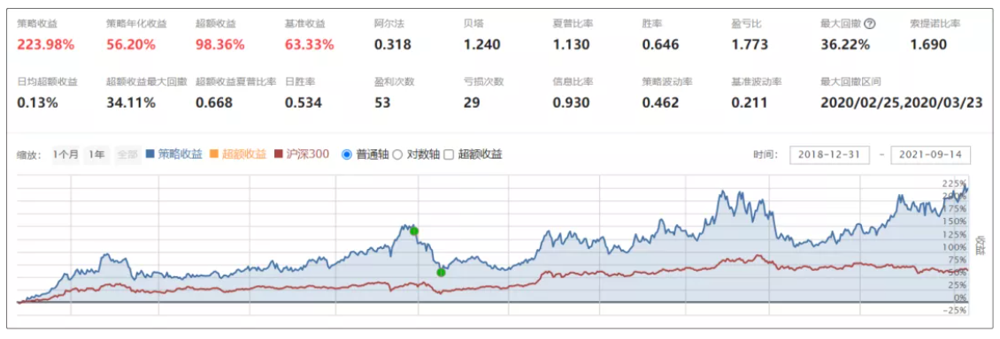

  

如果持有2只的话，画面更美好，收益447.37%，年化90.58%，最大回撤40.90%：
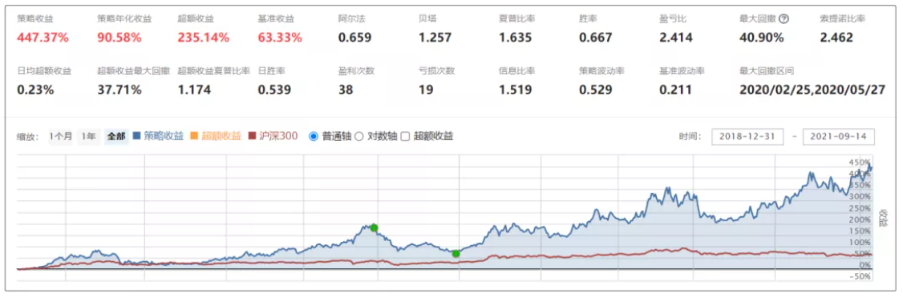

  

很明显，2019年之后，动量策略确实非常给力。这还是限定在沪深300成分股里选股的收益，如果放开到全市场选股，可能会有更加不错的效果，但现在已经23:52，我来不及做更多的尝试。

但2019年之前，动量策略并没有那么美好，如果我们把时间再拉长到2010年，从2010年1月1日到2021年9月14日，那画面就会变成这样子：

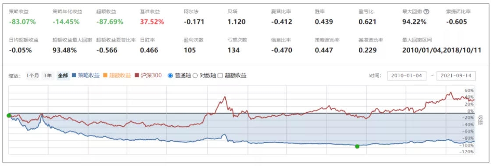

  

可以看到2019年之前是完全失效的，甚至是一个老虎机，吞金钱利器。最惨的时候跌到了-93%。但2019年开始，这个策略就像嗑了药，猛涨。

  

总之，目前的结论是：动量策略2019年以后确实有效，有很显著的赚钱效应，但是否能持续赚钱，是存疑的。毕竟2019年之前，它有过长期惨亏的经历。

 


```

from jqdata import *

'''
================================================================================
总体回测前
================================================================================
'''
#总体回测前要做的事情
def initialize(context):
    set_params()    #1设置策参数
    set_variables() #2设置中间变量
    set_backtest()  #3设置回测条件

#1
#设置策略参数
def set_params():
    g.N = 60   # 设置收益率回测区间（天数）
    g.tc = 20  # 设置调仓天数
    g.num_stocks = 2  # 设置每次调仓选取的股票数量
    # 定义股票池，创业板指数成分股
    g.index='000300.XSHG'
    # 每次持股占股票池的比例
    g.ratio = 0.15

#2
#设置中间变量
def set_variables():
    g.t = 0 #记录回测运行的天数
    g.if_trade = False #当天是否交易

#3
#设置回测条件
def set_backtest():
    set_benchmark('000300.XSHG')
    set_option('use_real_price',True) # 用真实价格交易
    log.set_level('order','error')    # 设置报错等级


'''
================================================================================
每天开盘前
================================================================================
'''
#每天开盘前要做的事情
def before_trading_start(context):
    if g.t%g.tc==0:
        #每g.tc天，交易一次行
        g.if_trade=True 
        # 设置手续费与手续费
        set_slip_fee(context) 
        # 设置可行股票池：获得当前开盘的沪深300股票池并剔除当前或者计算样本期间停牌的股票
        g.feasible_stocks = set_feasible_stocks(get_index_stocks(g.index),g.N,context)
    g.t+=1
    
#4
# 设置可行股票池
# 过滤掉当日停牌的股票,且筛选出前days天未停牌股票
# 输入：stock_list为list类型,样本天数days为int类型，context（见API）
# 输出：list
def set_feasible_stocks(stock_list,days,context):
    # 得到是否停牌信息的dataframe，停牌的1，未停牌得0
    suspened_info_df = get_price(list(stock_list), start_date=context.current_dt, end_date=context.current_dt, frequency='daily', fields='paused')['paused'].T
    # 过滤停牌股票 返回dataframe
    unsuspened_index = suspened_info_df.iloc[:,0]<1
    # 得到当日未停牌股票的代码list:
    unsuspened_stocks = suspened_info_df[unsuspened_index].index
    # 进一步，筛选出前days天未曾停牌的股票list:
    feasible_stocks=[]
    current_data=get_current_data()
    for stock in unsuspened_stocks:
        if sum(attribute_history(stock, days, unit='1d',fields=('paused'),skip_paused=False))[0]==0:
            feasible_stocks.append(stock)
    return feasible_stocks
    
#5
# 根据不同的时间段设置滑点与手续费
def set_slip_fee(context):
    # 将滑点设置为0
    set_slippage(FixedSlippage(0)) 
    # 根据不同的时间段设置手续费
    dt=context.current_dt
    log.info(type(context.current_dt))
    
    if dt>datetime.datetime(2013,1, 1):
        set_commission(PerTrade(buy_cost=0.0003, sell_cost=0.0013, min_cost=5)) 
        
    elif dt>datetime.datetime(2011,1, 1):
        set_commission(PerTrade(buy_cost=0.001, sell_cost=0.002, min_cost=5))
            
    elif dt>datetime.datetime(2009,1, 1):
        set_commission(PerTrade(buy_cost=0.002, sell_cost=0.003, min_cost=5))
                
    else:
        set_commission(PerTrade(buy_cost=0.003, sell_cost=0.004, min_cost=5))


'''
================================================================================
每天交易时
================================================================================
'''
def handle_data(context,data):
    if g.if_trade == True:
        # 依本策略的买入信号，得到应该买的股票列表
        MS_should_buy = buy_signal(context, data)
        # 计算现在的总资产，以分配资金，这里是等额权重分配 返回一个数
        MonPerStock=context.portfolio.portfolio_value/g.num_stocks
        # 得到当前持仓中可卖出的股票
        if len(context.portfolio.positions)>0:
            #当持仓不为零时，剔除持仓股票中停牌股即可 返回list
            holding = context.portfolio.positions
        else:
            # 当持仓为0时，可卖出股票为0 返回list
            holding = []
        # 对于不需要持仓的股票，全仓卖出
        for stock in holding:
            if stock not in MS_should_buy:
                order_target_value(stock, 0)
        # 对于需要持仓的股票，按分配到的份额买入
        for stock in MS_should_buy:
            order_target_value(stock, MonPerStock)
    g.if_trade = False

#6
# 依本策略的买入信号，得到应该买的股票列表
# 输入：context, data（见API）
# 输出：应该买的股票列表，list类型
def buy_signal(context, data):
    # 将昨天设置为收益率计算最后一天 返回datetime.date对象
    enddate = context.previous_date
    # 将昨日日期向前推g.N(这是个整数）得到收益率计算周期第一天 返回datetime.date对象
    startdate = ShiftTradingDay(enddate,-g.N)
    # 得到回测收益率的股票列表（由于上市、退市等因素，此列表与我们实际可交易股票有一定差异）返回list
    stocks = set_feasible_stocks(get_index_stocks(g.index),g.N,context)
    # 按收益率降序排列 返回list
    sorted_list = stock_ret(stocks,startdate,enddate,asc = False)
    # 截取最高的g.num_stocks个
    should_buy = sorted_list[0:g.num_stocks]
    return should_buy

#7
# 某一日的前shift个交易日日期 
# 输入：date为datetime.date对象(是一个date，而不是datetime)；shift为int类型
# 输出：datetime.date对象(是一个date，而不是datetime)
def ShiftTradingDay(date,shift):
    # 获取所有的交易日，返回一个包含所有交易日的 list,元素值为 datetime.date 类型.
    tradingday = list(get_all_trade_days())
    # 得到date之后shift天那一天在列表中的行标号 返回一个数
    shiftday_index = tradingday.index(date)+shift
    # 根据行号返回该日日期 为datetime.date类型
    return tradingday[shiftday_index]  

#8   
# 根据期间收益率（用前复权收盘价计算）给股票排名
# 输入：stock_list为list类型；startdate enddate为datetime.date对象；asc为布尔类型
# 输出：list类型
def stock_ret(stock_list,startdate,enddate,asc = False):
    # 得到回测区间内股票收盘价 返回dataframe
    log.info(startdate)
    log.info(enddate)
    df_close = get_price(list(stock_list),start_date = startdate, end_date = enddate)['close'].T
    # 删去空值 返回dataframe
    df_close = df_close.dropna(axis = 0)
    # 计算回测区间收益率 返回dataframe
    df_close['ret']=(df_close[enddate]-df_close[startdate])/df_close[startdate]
    #按收益率降序排列，获取股票代码，返回list
    try:
        stocks = df_close.sort('ret', ascending = asc).index
    except AttributeError:
        stocks = df_close.sort_values('ret', ascending = asc).index
    # 返回股票代码list
    return stocks
    


'''
================================================================================
每天收盘后
================================================================================
'''
# 每日收盘后要做的事情（本策略中不需要）
def after_trading_end(context):
    return


```


## ST垃圾股策略

选股逻辑很简单，就是选择ST股票里，市盈率和市净率都是负的股票，然后两个月调仓一次。

详细逻辑是这样的：

**股票池**：所有ST股票。

 **选股逻辑**：市盈率<0，且市净率<0

**排序逻辑**：算出市盈率\*市净率的数值，然后从大到小排序，取前10个股票。

 **调仓逻辑**：策略用轮动的方式进行买卖，两个月调一次仓，到了调仓日，在前10名的股票会继续持有，掉出前10名股票就会卖掉。

 简单一句话，就是无脑选择最垃圾的10只ST股票。

这个策略2021年的收益特别炸裂，可以**作为一个监控指标，用来监控两个事情：1.市场对反转的偏好。2.市场的投机力度。**
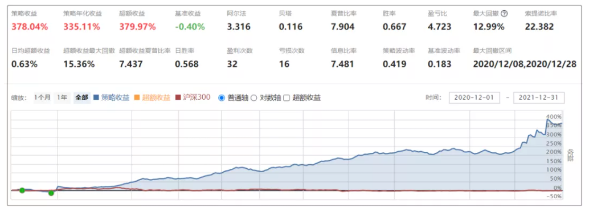
```
## 初始化函数，设定要操作的股票、基准等等
def initialize(context):
    # 设定沪深300作为基准
    set_benchmark('000300.XSHG')
    # True为开启动态复权模式，使用真实价格交易
    set_option('use_real_price', True) 
    # 设定成交量比例
    set_option('order_volume_ratio', 1)
    # 股票类交易手续费是：买入时佣金万分之三，卖出时佣金万分之三加千分之一印花税, 每笔交易佣金最低扣5块钱
    set_order_cost(OrderCost(open_tax=0, close_tax=0.001, \
                             open_commission=0.0003, close_commission=0.0003,\
                             close_today_commission=0, min_commission=5), type='stock')
    # 持仓数量
    g.stocknum = 10
    # 交易日计时器
    g.days = 0 
    # 调仓频率
    g.refresh_rate = 40
    # 运行函数
    run_daily(trade, 'every_bar')

## 选出小市值股票
def check_stocks(context,date):
    # 设定查询条件
    q = query(
                valuation.code,
                valuation.pb_ratio,
                valuation.pe_ratio
            ).filter(
                valuation.pb_ratio<0,
                valuation.pe_ratio<0
            ).order_by(
                valuation.pe_ratio*valuation.pb_ratio
            )
    # 选出负市盈率负市净率的股票，构成buylist
    df = get_fundamentals(q)
    buylist =list(df['code'])

    # 过滤停牌股票
    buylist = filter_paused_stock(buylist)

    return buylist[:g.stocknum]
  
## 交易函数
def trade(context):
    if g.days%g.refresh_rate == 0:

        ## 获取持仓列表
        sell_list = list(context.portfolio.positions.keys())
        # 如果有持仓，则卖出
        if len(sell_list) > 0 :
            for stock in sell_list:
                order_target_value(stock, 0)

        ## 分配资金
        if len(context.portfolio.positions) < g.stocknum :
            Num = g.stocknum - len(context.portfolio.positions)
            Cash = context.portfolio.cash/Num
        else: 
            Cash = 0

        ## 选股
        date = context.current_dt.year
        stock_list = check_stocks(context,date)

        ## 买入股票
        for stock in stock_list:
            if len(context.portfolio.positions.keys()) < g.stocknum:
                order_value(stock, Cash)

        # 天计数加一
        g.days = 1
    else:
        g.days += 1

# 过滤停牌股票
def filter_paused_stock(stock_list):
    current_data = get_current_data()
    return [stock for stock in stock_list if not current_data[stock].paused]

```


## 基本面小市值策略（旧）

### **这版很粗造，建议看我优化后的新版，新版地址：[基本面小市值（新）](#基本面小市值（新）)，择时优化版地址：[基本面小市值-周调仓-1月底和4月底空仓](#基本面小市值-周调仓-1月底和4月底空仓)
基本面市值策略，是在小市值的基础上，加上了PEG和EBIT（息税前利润），总体效果不错。
2009年到2022年，收益曲线都是向上，年化有50%左右，非常稳定。
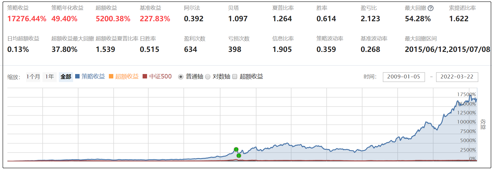

即便是2019年-2022年，这段小市值不吃香的年份，依然有很不错的收益，年化达到76%。
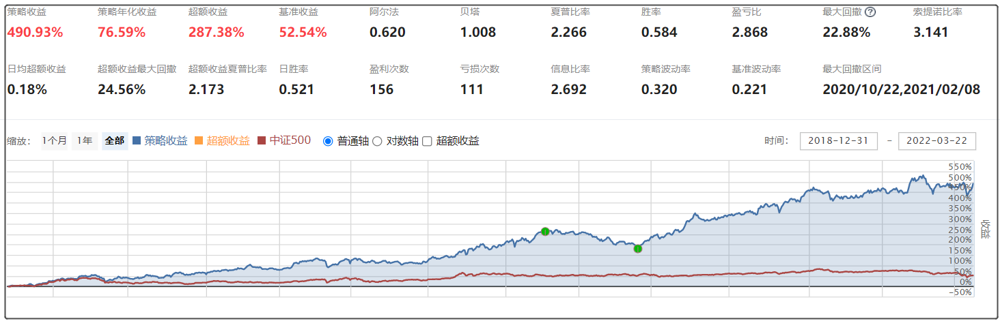

详细逻辑是这样的：

**股票池**：所有A股股票。

 **选股逻辑**：先选出全市场PEG最小的10%的股票，然后再从这些股票里再选出EBIT（息税前利润）最低的25%股票。

**排序逻辑**：按照市值从小到大排序，取前5个股票。

 **调仓逻辑**：策略用轮动的方式进行买卖，一天轮动一次，在前5名的股票会继续持有，掉出前5名股票就会卖掉。

代码如下
```

#导入函数库
from jqdata import *
from jqfactor import get_factor_values
import numpy as np
import pandas as pd

#初始化函数 
def initialize(context):
    set_benchmark('000905.XSHG')
    # 用真实价格交易
    set_option('use_real_price', True)
    # 打开防未来函数
    set_option("avoid_future_data", True)
    # 将滑点设置为0
    set_slippage(FixedSlippage(0))
    # 设置交易成本万分之三
    set_order_cost(OrderCost(open_tax=0, close_tax=0.001, open_commission=0.0003, close_commission=0.0003, close_today_commission=0, min_commission=5),type='fund')
    # 过滤order中低于error级别的日志
    log.set_level('order', 'error')
    #选股参数
    g.stock_num = 5 #持仓数
    # 设置交易时间，每天运行
    run_daily(my_trade, time='9:30', reference_security='000300.XSHG')
    run_daily(print_trade_info, time='15:30', reference_security='000300.XSHG')


#2-1 选股模块
def get_factor_filter_list(context,stock_list,jqfactor,sort,p1,p2):
    yesterday = context.previous_date
    score_list = get_factor_values(stock_list, jqfactor, end_date=yesterday, count=1)[jqfactor].iloc[0].tolist()
    df = pd.DataFrame(columns=['code','score'])
    df['code'] = stock_list
    df['score'] = score_list
    df.dropna(inplace=True)
    df.sort_values(by='score', ascending=sort, inplace=True)
    filter_list = list(df.code)[int(p1*len(stock_list)):int(p2*len(stock_list))]
    return filter_list

#2-2 选股模块
def get_stock_list(context):
    initial_list = get_all_securities().index.tolist()
    initial_list = filter_new_stock(context,initial_list)
    initial_list = filter_kcb_stock(context, initial_list)
    initial_list = filter_st_stock(initial_list)
    peg_list = get_factor_filter_list(context, initial_list, 'PEG', True, 0, 0.1)
    test_list = get_factor_filter_list(context, peg_list, 'EBIT', True, 0, 0.25)
    q = query(valuation.code,valuation.circulating_market_cap).filter(valuation.code.in_(test_list)).order_by(valuation.circulating_market_cap.asc())
    df = get_fundamentals(q)
    final_list = list(df.code)
    return final_list


#3-1 过滤模块-过滤停牌股票
#输入选股列表，返回剔除停牌股票后的列表
def filter_paused_stock(stock_list):
	current_data = get_current_data()
	return [stock for stock in stock_list if not current_data[stock].paused]

#3-2 过滤模块-过滤ST及其他具有退市标签的股票
#输入选股列表，返回剔除ST及其他具有退市标签股票后的列表
def filter_st_stock(stock_list):
	current_data = get_current_data()
	return [stock for stock in stock_list
			if not current_data[stock].is_st
			and 'ST' not in current_data[stock].name
			and '*' not in current_data[stock].name
			and '退' not in current_data[stock].name]

#3-3 过滤模块-过滤涨停的股票
#输入选股列表，返回剔除未持有且已涨停股票后的列表
def filter_limitup_stock(context, stock_list):
	last_prices = history(1, unit='1m', field='close', security_list=stock_list)
	current_data = get_current_data()
	# 已存在于持仓的股票即使涨停也不过滤，避免此股票再次可买，但因被过滤而导致选择别的股票
	return [stock for stock in stock_list if stock in context.portfolio.positions.keys()
			or last_prices[stock][-1] < current_data[stock].high_limit]

#3-4 过滤模块-过滤跌停的股票
#输入股票列表，返回剔除已跌停股票后的列表
def filter_limitdown_stock(context, stock_list):
	last_prices = history(1, unit='1m', field='close', security_list=stock_list)
	current_data = get_current_data()
	return [stock for stock in stock_list if stock in context.portfolio.positions.keys()
			or last_prices[stock][-1] > current_data[stock].low_limit]

#3-5 过滤模块-过滤科创板
#输入股票列表，返回剔除科创板后的列表
def filter_kcb_stock(context, stock_list):
    return [stock for stock in stock_list  if stock[0:3] != '688']

#3-6 过滤次新股
#输入股票列表，返回剔除上市日期不足250日股票后的列表
def filter_new_stock(context,stock_list):
    yesterday = context.previous_date
    return [stock for stock in stock_list if not yesterday - get_security_info(stock).start_date < datetime.timedelta(days=250)]

#4-1 交易模块-自定义下单
#报单成功返回报单(不代表一定会成交),否则返回None,应用于
def order_target_value_(security, value):
	if value == 0:
		log.debug("Selling out %s" % (security))
	else:
		log.debug("Order %s to value %f" % (security, value))
	# 如果股票停牌，创建报单会失败，order_target_value 返回None
	# 如果股票涨跌停，创建报单会成功，order_target_value 返回Order，但是报单会取消
	# 部成部撤的报单，聚宽状态是已撤，此时成交量>0，可通过成交量判断是否有成交
	return order_target_value(security, value)

#4-2 交易模块-开仓
#买入指定价值的证券,报单成功并成交(包括全部成交或部分成交,此时成交量大于0)返回True,报单失败或者报单成功但被取消(此时成交量等于0),返回False
def open_position(security, value):
	order = order_target_value_(security, value)
	if order != None and order.filled > 0:
		return True
	return False

#4-3 交易模块-平仓
#卖出指定持仓,报单成功并全部成交返回True，报单失败或者报单成功但被取消(此时成交量等于0),或者报单非全部成交,返回False
def close_position(position):
	security = position.security
	order = order_target_value_(security, 0)  # 可能会因停牌失败
	if order != None:
		if order.status == OrderStatus.held and order.filled == order.amount:
			return True
	return False

#4-4 交易模块-调仓
#当择时信号为买入时开始调仓，输入过滤模块处理后的股票列表，执行交易模块中的开平仓操作
def adjust_position(context, buy_stocks):
	for stock in context.portfolio.positions:
		if stock not in buy_stocks:
			log.info("[%s]已不在应买入列表中" % (stock))
			position = context.portfolio.positions[stock]
			close_position(position)
		else:
			log.info("[%s]已经持有无需重复买入" % (stock))
	# 根据股票数量分仓
	# 此处只根据可用金额平均分配购买，不能保证每个仓位平均分配
	position_count = len(context.portfolio.positions)
	if g.stock_num > position_count:
		value = context.portfolio.cash / (g.stock_num - position_count)
		for stock in buy_stocks:
			if context.portfolio.positions[stock].total_amount == 0:
				if open_position(stock, value):
					if len(context.portfolio.positions) == g.stock_num:
						break

#4-5 交易模块-择时交易
#结合择时模块综合信号进行交易
def my_trade(context):
    #获取选股列表并过滤掉:st,st*,退市,涨停,跌停,停牌
    check_out_list = get_stock_list(context)
    check_out_list = filter_limitup_stock(context, check_out_list)
    check_out_list = filter_limitdown_stock(context, check_out_list)
    check_out_list = filter_paused_stock(check_out_list)
    check_out_list = check_out_list[:g.stock_num]
    print('今日自选股:{}'.format(check_out_list))
    adjust_position(context, check_out_list)


#5-1 复盘模块-打印
#打印每日持仓信息
def print_trade_info(context):
    #打印当天成交记录
    trades = get_trades()
    for _trade in trades.values():
        print('成交记录：'+str(_trade))
    #打印账户信息
    for position in list(context.portfolio.positions.values()):
        securities=position.security
        cost=position.avg_cost
        price=position.price
        ret=100*(price/cost-1)
        value=position.value
        amount=position.total_amount    
        print('代码:{}'.format(securities))
        print('成本价:{}'.format(format(cost,'.2f')))
        print('现价:{}'.format(price))
        print('收益率:{}%'.format(format(ret,'.2f')))
        print('持仓(股):{}'.format(amount))
        print('市值:{}'.format(format(value,'.2f')))
        print('———————————————————————————————————')
    print('———————————————————————————————————————分割线————————————————————————————————————————')

```


## 行业动量计算代码

搞了一份计算行业动量的代码，效果是这样的：
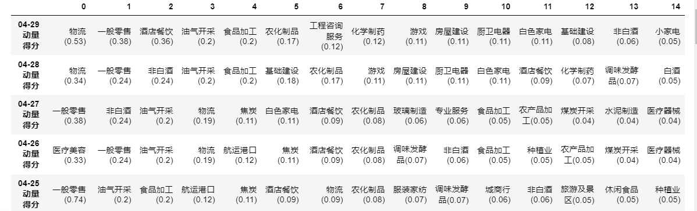
使用方法很简单，先打开聚宽网站，然后打开“研究环境”
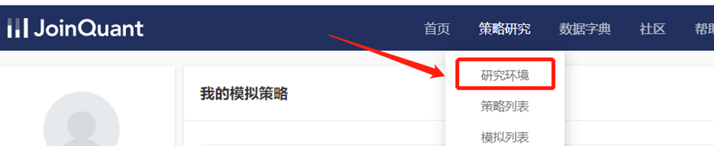

进入研究环境后，点击新建Python3（下图红色箭头位置）：

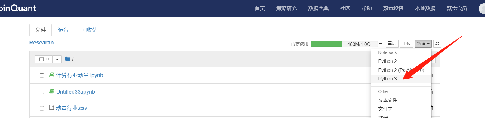
新建完成后，会进入下面这个页面，直接在里面复制我下面贴的那段代码。
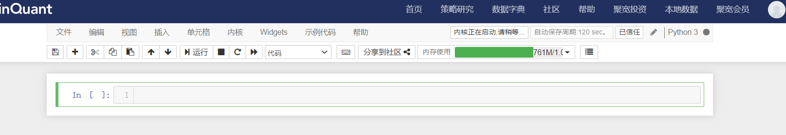
然后，点击“运行所有”，就可以了：
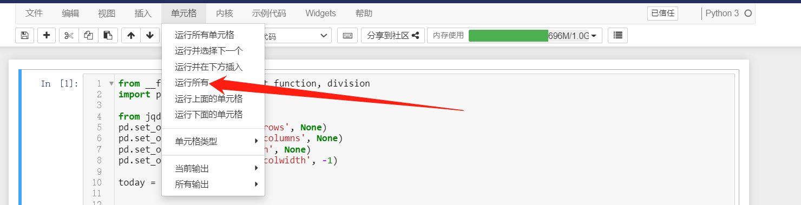
最后运行出来的结果，是这样的：
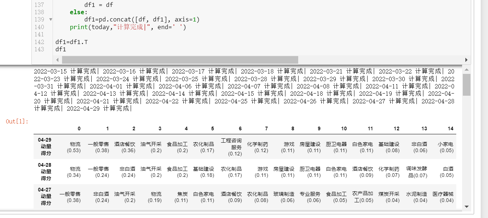
如果要改日期，在下图红框的位置改就行

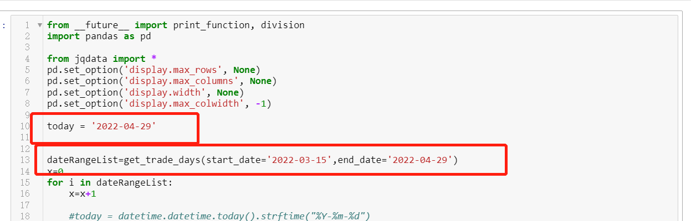

以下是计算动量的代码：

```
from __future__ import print_function, division
import pandas as pd

from jqdata import *
pd.set_option('display.max_rows', None)
pd.set_option('display.max_columns', None)
pd.set_option('display.width', None)
pd.set_option('display.max_colwidth', -1)

today = '2022-04-29'


dateRangeList=get_trade_days(start_date='2022-03-15',end_date='2022-04-29')
x=0
for i in dateRangeList:
    x=x+1
    
    #today = datetime.datetime.today().strftime("%Y-%m-%d")
    today = i.strftime("%Y-%m-%d")
    # 获取行业列表
    #print("使用申万二级行业")
    industries_pd = get_industries(name='sw_l2')

    INDUSTRY_CODE_NAME_DICT = {}
    for index in industries_pd.index:
        INDUSTRY_CODE_NAME_DICT[index] = industries_pd.loc[index]['name'][:-2]

    # 获取行业成份股
    industry_code_count_dict = {}
    for industry_code in industries_pd.index:
        stocks = get_industry_stocks(industry_code)
        industry_code_count_dict[industry_code] = len(stocks)

    security_industry_dict = {}
    for industry_code in industries_pd.index:
        stocks = get_industry_stocks(industry_code)
        for security_code in stocks:
            security_industry_dict[security_code] = industry_code

    #print("过滤掉退市股、上市未满 150 天的新股")
    # 获取所有标的信息
    all_securities_pd = get_all_securities()

    # 过滤掉退市股
    filtered_securities_pd = all_securities_pd[all_securities_pd.end_date>datetime.date.today()]

    # 过滤掉最近 150 天上市的新股
    last_150_days = datetime.date.today() - datetime.timedelta(days=150)
    filtered_securities_pd = filtered_securities_pd[filtered_securities_pd.start_date<last_150_days]

    security_code_list = filtered_securities_pd.index.tolist()

    #获取一支或者多只标的的行情数据
    date_security_close_money_pd = get_price(security_code_list, start_date=None, end_date=today, frequency='daily', fields=['close', 'money'], skip_paused=False, fq='pre', count=25, panel=False)

    security_date_close_money_dict = {}
    for row in date_security_close_money_pd.itertuples():

        security_code = row.code

        date = row.time.strftime("%Y-%m-%d")
        close = row.close
        money = row.money

        info = [date, close, money]

        if security_code not in security_date_close_money_dict:
            security_date_close_money_dict[security_code] = [info]
        else:
            security_date_close_money_dict[security_code].append(info)

    ###########
    #print("按 20 日涨幅排序，统计涨幅超过 20% 的前排个股")
    all_result = []

    # for day in [-1, -2, -3, -4, -5]:   
    # print(day+6)

    day = -1
    security_growth = {}
    for security_code, date_close_money_list in security_date_close_money_dict.items():
        date = date_close_money_list[day][0]
        growth = (date_close_money_list[day][1]-date_close_money_list[day-20][1])/date_close_money_list[day-20][1]
        security_growth[security_code] = growth

    sorted_security_growth =sorted(security_growth.items(), key=lambda t: t[1], reverse=True)


    index = []
    data = {}
    data["twenty_day_growth"] = []

    for item in sorted_security_growth:

        security_code = item[0]
        growth = item[1]

        index.append(security_code)
        data["twenty_day_growth"].append(growth)

    sorted_security_growth_pd = pd.DataFrame(data, index=index)
    top_security_growth_pd = sorted_security_growth_pd[sorted_security_growth_pd.twenty_day_growth>0.2]

    front_industry_count_dict = {}
    for security_code in top_security_growth_pd.index.tolist():
        industry_code = security_industry_dict.get(security_code)
        if industry_code:
            if industry_code not in front_industry_count_dict:
                front_industry_count_dict[industry_code] = 1
            else:
                front_industry_count_dict[industry_code] += 1

    # 计算动量 （momentum）
    industry_code_result = {}
    for industry_code, count in front_industry_count_dict.items():
        industry_code_result[industry_code] = float(format(count * count / industry_code_count_dict[industry_code], '.2f'))

    sorted_industry_code_result = sorted(industry_code_result.items(), key = lambda kv:(kv[1], kv[0]), reverse=True)[:15]

    # 行业代码转换为行业名称
    index = []
    data = []
    for item in sorted_industry_code_result:

        industry_code = item[0]
        if not industry_code:
            continue

        data.append("{}({})".format(INDUSTRY_CODE_NAME_DICT[industry_code], item[1]))
        #data.append(item[1])
    df = pd.DataFrame(data, columns=["{}动量得分".format(date[5:])])
   # df = pd.DataFrame(data, index=index, columns=["{}动量得分".format(date[5:])])
    #df = df.reset_index(drop = False)

    #df = df .rename(columns={'index':'行业'})
    if x==1:
        df1 = df
    else:
        df1=pd.concat([df, df1], axis=1)
    print(today,"计算完成|", end=' ')

df1=df1.T
df1
```
如果想要把计算的结果导出成excel，还可以点一下下面这个加号
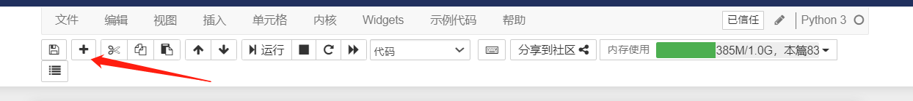
然后在新加的模块里复制这段代码：
```
write_file('动量行业.csv',df1.to_csv(encoding="utf-8-sig"), append=False) 
```
运行一下，就可以导出成excel文件了，效果是这样的：
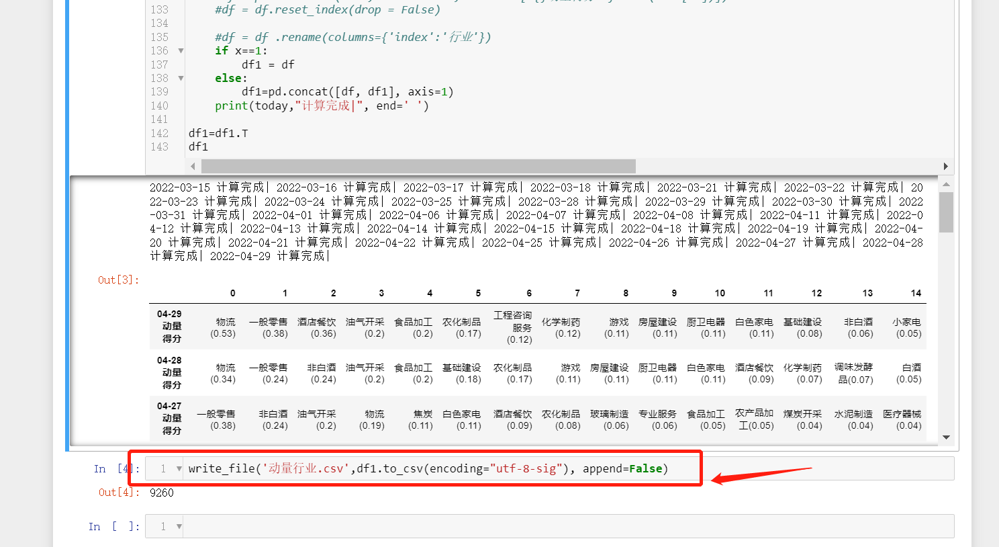
有些人找不到导出的文件在哪，返回到聚宽研究的列表页面，就可以看到了。


## 净利润断层修正版-ROA排序

对第一版净利润断层做了一些修改，第一版限制了行业是消费医药和科技，这一版不限制行业，第一版排序按照断层日高开幅度来排，这一版按照ROA来排。

股票池：所有行业无限制

选股逻辑：业绩预告、快报、财报的业绩超预期。且公布后的一天高开3%以上，并且当日收阳线。这个超预期其实应该是超过分析师预期，但爬取分析师预期还有点难度，所以我把超预期这个指标，替换成了业绩增长大于20%。

  

买入逻辑：按照ROA排序，在次日早上9:30买入。  

  

卖出逻辑：持有大于180天，个股盈利大于120%，个股跌幅20%。满足任意一个条件就卖出

  

持仓数：3只

本质上，净利润断层策略是基本面与技术面共振双击下的选股模式，具有较强的选股逻辑和较高的可实操性。

从2019年1月到2022年4月29日的回测，去除了各种限制，收益依然还是不错的：


这个策略我做了很多研究，其实更适合主观使用，首先超预期其实是需要主观去判断有没有超预期，其次主观可以筛选出更优秀的股票，卖点也比较灵活。

源码如下：
```
from kuanke.wizard import *
from jqdata import *
import numpy as np
import pandas as pd
import talib
import datetime
import time
import math

from jqdata import *
from jqdata import jy
import pandas as pd
from jqdata import finance 

## 初始化函数，设定要操作的股票、基准等等
def initialize(context):
    # 设定基准
    set_benchmark('000300.XSHG')
    # 设定滑点
    set_slippage(FixedSlippage(0.02))
    # True为开启动态复权模式，使用真实价格交易
    set_option('use_real_price', True)
    # 设定成交量比例
    set_option('order_volume_ratio', 1)
    # 股票类交易手续费是：买入时佣金万分之三，卖出时佣金万分之三加千分之一印花税, 每笔交易佣金最低扣5块钱
    set_order_cost(OrderCost(open_tax=0, close_tax=0.001, open_commission=0.0003, close_commission=0.0003, min_commission=5), type='stock')
    #卖出股票列表
    g.sell_stock_list=[]

    g.buy_lists123 = []
    # 个股最大持仓比重
    g.security_max_proportion = 1
    # 选股频率
    g.check_stocks_refresh_rate = 1
    # 买入频率
    g.buy_refresh_rate = 1
    # 卖出频率
    g.sell_refresh_rate = 1
    # 最大建仓数量
    g.max_hold_stocknum = 3
    cur_time = context.current_dt
    # 选股频率计数器
    g.check_stocks_days = 0

    g.days = 0
    # 买卖交易频率计数器
    g.buy_trade_days=0
    g.sell_trade_days=0
    # 获取未卖出的股票
    g.open_sell_securities = []
    # 卖出股票的dict
    g.selled_security_list={}

    #涨停
    g.check_out_lists1=[]
    g.check_out_lists2=[]

    g.ZT =[]
    #风险参考基准
    g.security = '000300.XSHG'


    check_stocks_initialize()
    # 股票筛选排序初始化函数
    check_stocks_sort_initialize()
    # 出场初始化函数
    sell_initialize()
    # 入场初始化函数
    buy_initialize()


    # 关闭提示
    log.set_level('order', 'info')

    # 运行函数
    run_daily(check_stocks, '9:15') #选股
    run_daily(day_open_filter123, '9:16') #买入卖出列表
    run_daily(sell_every_day,'open') #卖出未卖出成功的股票
    run_daily(trade, 'open') #交易
    run_daily(selled_security_list_count, 'after_close') #卖出股票日期计数


## 股票筛选初始化函数
def check_stocks_initialize():
    # 是否过滤停盘
    g.filter_paused = True
    # 是否过滤退市
    g.filter_delisted = True
    # 是否只有ST
    g.only_st = False
    # 是否过滤ST
    g.filter_st = True
    # 股票池
    g.security_universe_index = ['all_a_securities']
    g.security_universe_user_securities = []
    # 行业列表
    g.industry_list = ["801010","801020","801030","801040","801050","801080","801110","801120","801130","801140","801150","801160","801170","801180","801200","801210","801230","801710","801720","801730","801740","801750","801760","801770","801780","801790","801880","801890"]
    # 概念列表
    g.concept_list = []
    g.blacklist= ['300601.XSHE']

## 股票筛选排序初始化函数
def check_stocks_sort_initialize():
    # 总排序准则： desc-降序、asc-升序
    g.check_out_lists_ascending = 'desc'

## 出场初始化函数
def sell_initialize():
    # 设定是否卖出buy_lists中的股票
    g.sell_will_buy = True

    # 固定出仓的数量或者百分比
    g.sell_by_amount = None
    g.sell_by_percent = None

## 入场初始化函数
def buy_initialize():
    # 是否可重复买入
    g.filter_holded = False

    # 委托类型
    g.order_style_str = 'by_cap_mean'
    g.order_style_value = 100

## 卖出未卖出成功的股票
def sell_every_day(context):
    g.open_sell_securities = list(set(g.open_sell_securities))
    open_sell_securities = [s for s in context.portfolio.positions.keys() if s in g.open_sell_securities]
    if len(open_sell_securities)>0:
        for stock in open_sell_securities:
            order_target_value(stock, 0)
    g.open_sell_securities = [s for s in g.open_sell_securities if s in context.portfolio.positions.keys()]
    return

## 股票筛选
def check_stocks(context):
    if g.check_stocks_days%g.check_stocks_refresh_rate != 0:
        # 计数器加一
        g.check_stocks_days += 1
        return
    # 股票池赋值
    g.check_out_lists = get_security_universe(context, g.security_universe_index, g.security_universe_user_securities)
    # 行业过滤
    g.check_out_lists = industry_filter(context, g.check_out_lists, g.industry_list)
    # 概念过滤
    g.check_out_lists = concept_filter(context, g.check_out_lists, g.concept_list)
    # 过滤ST股票
    g.check_out_lists = st_filter(context, g.check_out_lists)
    # 过滤停牌股票
    g.check_out_lists = paused_filter(context, g.check_out_lists)
    # 过滤退市股票
    g.check_out_lists = delisted_filter(context, g.check_out_lists)
    g.check_out_lists1=[]
    g.check_out_lists2=[]
    g.check_out_lists1= g.check_out_lists
    g.check_out_lists2= g.check_out_lists
  # 排序
    input_dict = get_check_stocks_sort_input_dict()
    g.check_out_lists = check_stocks_sort(context,g.check_out_lists,input_dict,g.check_out_lists_ascending)

    # 计数器归一
    g.check_stocks_days = 1
    return

## 交易函数
def trade(context):
   # 初始化买入列表
    buy_lists = []

    # 买入股票筛选
    if g.buy_trade_days%g.buy_refresh_rate == 0:
        # 获取 buy_lists 列表
        buy_lists = g.buy_lists123
        # 过滤ST股票
        buy_lists = st_filter(context, buy_lists)
        # 过滤停牌股票
        buy_lists = paused_filter(context, buy_lists)
        # 过滤退市股票
        buy_lists = delisted_filter(context, buy_lists)
        # 过滤涨停股票
        g.ZT = high_limit_filter(context, buy_lists)
        print("zhangt1:",g.ZT)

        ### _入场函数筛选-开始 ###

        ### _入场函数筛选-结束 ###
        log.info('购买列表最终',buy_lists)

    # 卖出操作
    if g.sell_trade_days%g.sell_refresh_rate != 0:
        # 计数器加一
        g.sell_trade_days += 1
    else:
        # 卖出股票
        sell(context, buy_lists)
        # 计数器归一
        g.sell_trade_days = 1


    # 买入操作
    if g.buy_trade_days%g.buy_refresh_rate != 0:
        # 计数器加一
        g.buy_trade_days += 1
    else:
        # 卖出股票
        buy(context, buy_lists)
        # 计数器归一
        g.buy_trade_days = 1

## 卖出股票日期计数
def selled_security_list_count(context):
    #g.daily_risk_management = True
    if len(g.selled_security_list)>0:
        for stock in g.selled_security_list.keys():
            g.selled_security_list[stock] += 1

##################################  选股函数群 ##################################

## 财务指标筛选函数
def financial_statements_filter(context, security_list):
    ### _财务指标筛选函数-开始 ###
    security_list = financial_data_filter_dayu(security_list, indicator.roe, 4)
    ### _财务指标筛选函数-结束 ###

    # 返回列表
    return security_list

## 行情筛选函数
def situation_filter(context, security_list):
    ### _行情筛选函数-开始 ###
    ### _行情筛选函数-结束 ###

    # 返回列表
    return security_list

## 技术指标筛选函数
def technical_indicators_filter(context, security_list):
    ### _技术指标筛选函数-开始 ###
    ### _技术指标筛选函数-结束 ###

    # 返回列表
    return security_list

## 形态指标筛选函数
def pattern_recognition_filter(context, security_list):
    ### _形态指标筛选函数-开始 ###
    ### _形态指标筛选函数-结束 ###

    # 返回列表
    return security_list

## 其他方式筛选函数
def other_func_filter(context, security_list):
    ### _其他方式筛选函数-开始 ###

    ### _其他方式筛选函数-结束 ###
    #log.info('筛选出来的股票',security_list)
    # 返回列表
    return security_list

# 获取选股排序的 input_dict
def get_check_stocks_sort_input_dict():
    input_dict = {
        indicator.roa:('desc',100),
        }
    # 返回结果
    return input_dict

##################################  交易函数群 ##################################
# 交易函数 - 出场
def sell(context, buy_lists):
    # 获取 sell_lists 列表
    init_sl = context.portfolio.positions.keys()
    sell_lists = context.portfolio.positions.keys()

    # 判断是否卖出buy_lists中的股票
    if not g.sell_will_buy:
        sell_lists = [security for security in sell_lists if security not in buy_lists]

    ### _出场函数筛选-开始 ###
    sell_lists = g.sell_stock_list
    ### _出场函数筛选-结束 ###

    # 卖出股票
    if len(sell_lists)>0:
        for stock in sell_lists:
            sell_by_amount_or_percent_or_none(context,stock, g.sell_by_amount, g.sell_by_percent, g.open_sell_securities)

    # 获取卖出的股票, 并加入到 g.selled_security_list中
    selled_security_list_dict(context,init_sl)

    return

# 交易函数 - 入场
def buy(context, buy_lists):

    # 判断是否可重复买入
    buy_lists = holded_filter(context,buy_lists)

    # 获取最终的 buy_lists 列表
    Num = g.max_hold_stocknum - len(context.portfolio.positions)
    buy_lists = buy_lists[:Num]

    # 买入股票
    if len(buy_lists)>0:
        # 分配资金
        result = order_style(context,buy_lists,g.max_hold_stocknum, g.order_style_str, g.order_style_value)
        for stock in buy_lists:
            if len(context.portfolio.positions) < g.max_hold_stocknum:
                # 获取资金
                Cash = result[stock]
                # 判断个股最大持仓比重
                value = judge_security_max_proportion(context,stock,Cash,g.security_max_proportion)
                # 判断单只最大买入股数或金额
                amount = max_buy_value_or_amount(stock,value,None,None)
                # 下单
                order(stock, amount, MarketOrderStyle())
    return

###################################  公用函数群 ##################################
## 排序
def check_stocks_sort(context,security_list,input_dict,ascending='desc'):
    if (len(security_list) == 0) or (len(input_dict) == 0):
        return security_list
    else:
        # 生成 key 的 list
        idk = list(input_dict.keys())
        # 生成矩阵
        a = pd.DataFrame()
        for i in idk:
            b = get_sort_dataframe(security_list, i, input_dict[i])
            a = pd.concat([a,b],axis = 1)
        # 生成 score 列
        a['score'] = a.sum(1,False)
        # 根据 score 排序
        if ascending == 'asc':# 升序
            if hasattr(a, 'sort'):
                a = a.sort(['score'],ascending = True)
            else:
                a = a.sort_values(['score'],ascending = True)
        elif ascending == 'desc':# 降序
            if hasattr(a, 'sort'):
                a = a.sort(['score'],ascending = False)
            else:
                a = a.sort_values(['score'],ascending = False)
        # 返回结果
        return list(a.index)

## 过滤同一标的继上次卖出N天不再买入
def filter_n_tradeday_not_buy(security, n=0):
    try:
        if (security in g.selled_security_list.keys()) and (g.selled_security_list[security]<n):
            return False
        return True
    except:
        return True

## 是否可重复买入
def holded_filter(context,security_list):
    if not g.filter_holded:
        security_list = [stock for stock in security_list if stock not in context.portfolio.positions.keys()]
    # 返回结果
    return security_list

## 卖出股票加入dict
def selled_security_list_dict(context,security_list):
    selled_sl = [s for s in security_list if s not in context.portfolio.positions.keys()]
    if len(selled_sl)>0:
        for stock in selled_sl:
            g.selled_security_list[stock] = 0

## 过滤停牌股票
def paused_filter(context, security_list):
    if g.filter_paused:
        current_data = get_current_data()
        security_list = [stock for stock in security_list if not current_data[stock].paused]
    # 返回结果
    return security_list

## 过滤退市股票
def delisted_filter(context, security_list):
    if g.filter_delisted:
        current_data = get_current_data()
        security_list = [stock for stock in security_list if not (('退' in current_data[stock].name) or ('*' in current_data[stock].name))]
    # 返回结果
    return security_list


## 过滤ST股票
def st_filter(context, security_list):
    if g.only_st:
        current_data = get_current_data()
        security_list = [stock for stock in security_list if current_data[stock].is_st]
    else:
        if g.filter_st:
            current_data = get_current_data()
            security_list = [stock for stock in security_list if not current_data[stock].is_st]
    # 返回结果
    return security_list

# 过滤涨停股票
def high_limit_filter(context, security_list):
    g.ZT = []
    current_data = get_current_data()
    g.ZT = [stock for stock in security_list if  (current_data[stock].day_open >= current_data[stock].high_limit)]
    # 返回结果
    return g.ZT

# 获取股票股票池
def get_security_universe(context, security_universe_index, security_universe_user_securities):
    temp_index = []
    for s in security_universe_index:
        if s == 'all_a_securities':
            temp_index += list(get_all_securities(['stock'], context.current_dt.date()).index)
        else:
            temp_index += get_index_stocks(s)
    for x in security_universe_user_securities:
        temp_index += x
    return  sorted(list(set(temp_index)))

# 行业过滤
def industry_filter(context, security_list, industry_list):
    if len(industry_list) == 0:
        # 返回股票列表
        return security_list
    else:
        securities = []
        for s in industry_list:
            temp_securities = get_industry_stocks(s)
            securities += temp_securities
        security_list = [stock for stock in security_list if stock in securities]
        # 返回股票列表
        return security_list

# 概念过滤
def concept_filter(context, security_list, concept_list):
    if len(concept_list) == 0:
        return security_list
    else:
        securities = []
        for s in concept_list:
            temp_securities = get_concept_stocks(s)
            securities += temp_securities
        security_list = [stock for stock in security_list if stock in securities]
        # 返回股票列表
        return security_list
#自定义函数
def day_open_filter123(context):
    #g.sell_stock_list=[]
    #g.buy_lists123 = []
    if g.days % g.check_stocks_refresh_rate != 0:
        g.days +=1
        return
    list1 = K_yeji(context)
    list2 = Y_yeji(context)
    list3 = R_yeji(context)
    list4 = g.ZT
    print("zhangt2:",list4)
    list_all = list1+list2+list3
    list_fin = list(set(list_all))
    list_fin = [s for s in list_fin if s not in g.blacklist]
    #print(list_fin)
    buylistnew = []
    ZF=[]
    for stock in list_fin:
        df = attribute_history(stock, 2, '1d', ['open','close'])

        prepreday_close_price = df['close'].tolist()
        prepreday_close_price = prepreday_close_price[0]
        preday_open_price = df['open'].tolist()
        preday_open_price = preday_open_price[1]

        preday_close_price = df['close'].tolist()
        preday_close_price = preday_close_price[1]


        open_ZF = (preday_open_price-prepreday_close_price)/prepreday_close_price
        close_ZF1 = (preday_close_price-preday_open_price)/preday_open_price

        close_ZF2 =(preday_close_price-prepreday_close_price)/prepreday_close_price

        if open_ZF > 0.03 and close_ZF1 >=0:

            buylistnew.append(stock)
            ZF.append(close_ZF1)
    p = {'code':buylistnew,'ZF':ZF}
    
    df_ZF = pd.DataFrame(p)
    df_ZF.set_index(['code'],inplace=True)
    #factor = df_ZF.sort_index(by = 'ZF',ascending=False) 
    stockset = list(df_ZF.index)
    #stockset = list(factor.index)
    if len(g.ZT):
        
        stockset = g.ZT+stockset
        
    g.sell_stock_list=[]
    g.buy_lists123 = []
    g.sell_stock_list1 = list(context.portfolio.positions.keys())
    now =context.current_dt
    for stock in g.sell_stock_list1:
        o =[]
        buy_time = context.portfolio.positions[stock].init_time #开仓时间
        
        delta =now - buy_time
        days = delta.days
        buy_time_s = buy_time.strftime('%Y-%m-%d')
        df_cost = get_price(stock, count=1, end_date=buy_time_s, frequency='daily', fields=['open'])

        cost = df_cost.iloc[0,0]
        price = context.portfolio.positions[stock].price
        
        ZQ = (price-cost)/cost 
        if days >=180:
            g.sell_stock_list.append(stock)
        elif ZQ >=1.2:
            g.sell_stock_list.append(stock)
        
        elif ZQ <= -0.2:
            g.sell_stock_list.append(stock)
        #elif days >=90:
        #    g.sell_stock_list.append(stock)
                
    
    for stock in stockset[:g.max_hold_stocknum]:
        if stock in g.sell_stock_list:
            pass
        else:
            g.buy_lists123.append(stock) 

    log.info('卖出列表:',g.sell_stock_list)
    log.info('购买列表:',g.buy_lists123)
    g.days =1
    return g.sell_stock_list,g.buy_lists123
    
def K_yeji(context):
#获取业绩快报    
    preday1 = context.previous_date
    preday=preday1.strftime('%Y-%m-%d')
    print(preday)
    print(preday)
    #preday = preday1.strptime('%Y-%m-%d')
    #print(preday)
    scu_truncate = g.check_out_lists

    for i in range(len(scu_truncate)): 
        scu_truncate[i]=scu_truncate[i][0:6]
    
    
    df3 = jy.run_query(query(
                    jy.SecuMain.CompanyCode,
                    jy.SecuMain.SecuCode,
                ).filter(
                    jy.SecuMain.SecuCode.in_(scu_truncate)
                    ).limit(5000)
                )
    df3.drop_duplicates(subset=['CompanyCode'], keep='last', inplace=True)
    
    
    q =  query(
                jy.LC_FSPerformedLetters.CompanyCode,
                jy.LC_FSPerformedLetters.InfoPublDate,
                jy.LC_FSPerformedLetters.EndDate,
                jy.LC_FSPerformedLetters.NPParentCompanyOwners.label('归母净利润'),#('归母净利润'),
                jy.LC_FSPerformedLetters.NPCOwnersYOY.label('归母净利润同比增长'),#('归母净利润'), 
    
        ).filter(
            jy.LC_FSPerformedLetters.InfoPublDate == preday,
            jy.LC_FSPerformedLetters.CompanyCode.in_(df3['CompanyCode']),
            jy.LC_FSPerformedLetters.NPCOwnersYOY >= 20,
            jy.LC_FSPerformedLetters.NPParentCompanyOwners > 0
        ).limit(5000)
    
    df  = jy.run_query(q)
    
    df.drop_duplicates(subset=['CompanyCode'], keep='last', inplace=True)
    
    df.index =   df['CompanyCode']
    
    df.sort_index(ascending=False)
    
    df2 = jy.run_query(query(
                    jy.SecuMain.CompanyCode,
                    jy.SecuMain.SecuAbbr,
                    jy.SecuMain.SecuCode,
                ).filter(
                    jy.SecuMain.SecuCategory== 1,
                    jy.SecuMain.CompanyCode.in_(df['CompanyCode'])
                    ).limit(5000)
                )
    
    df2 = df2[df2['SecuCode'].isin(scu_truncate)]
    
    df2.drop_duplicates(subset=['CompanyCode'], keep='last', inplace=True)
    
    print(df2)
    if df2.empty:
        df2.index == 0
    else:
        df2.index = df['CompanyCode']
    
    df.drop([ 'CompanyCode'],axis=1,inplace=True)
    df2.drop([ 'CompanyCode'],axis=1,inplace=True)
    
    codelist = df2['SecuCode'].tolist()
    
    jq_codelist = []
    
    for i in codelist:
        stock_code = normalize_code(i)
        jq_codelist.append(stock_code)
    
    df2['code'] = jq_codelist
    print(jq_codelist)
    k = g.check_out_lists
    g.check_out_lists =[]

    for i in k:
        stock_code = normalize_code(i)
        g.check_out_lists.append(stock_code)
    print(g.check_out_lists)
    return jq_codelist
    
def Y_yeji(context):

    preday = context.previous_date

    
    q=query(
            finance.STK_FIN_FORCAST.code,
            finance.STK_FIN_FORCAST.end_date,
            finance.STK_FIN_FORCAST.pub_date,
            finance.STK_FIN_FORCAST.profit_ratio_min
                ).filter(
                    finance.STK_FIN_FORCAST.pub_date == preday,
                    finance.STK_FIN_FORCAST.profit_ratio_min >= 20,
                    finance.STK_FIN_FORCAST.code.in_(g.check_out_lists)
        ).limit(5000)

    df=finance.run_query(q)

    codelist = df['code'].tolist()
    print(codelist)

    return codelist

def R_yeji(context):
#财报
    preday = context.previous_date
    q = query(valuation.code, income.pubDate,income.statDate,income.np_parent_company_owners, 
                indicator.inc_net_profit_to_shareholders_year_on_year).filter(
        income.pubDate == preday,
        indicator.inc_net_profit_to_shareholders_year_on_year>=20,
        income.np_parent_company_owners > 0,
        valuation.code.in_(g.check_out_lists)) #balance.development_expenditure
    dfR = get_fundamentals(q, date = None)
    codelist = dfR['code'].tolist()
    print(codelist)
    return codelist
```


## 净利润断层-一创聚宽版

此版本可以在一创聚宽上运行，可以实现自动交易，但因为一创聚宽无法取到业绩快报，所以针对快报引发的断层，就买不带了。只能买到预告和正式季报引发的断层。

此版本，我把市值范围、持股天数、止盈比例、止损比例都做成了可以修改的参数，大家可以修改以下的数字，进行不同条件的断层股测试。

比如我把最大建仓数量调仓为1，选股的市值范围调整为50-800亿，卖出的条件为触发到以下其中一条就卖出：持股天数180、止盈比例120%、止损比例-20%。


回测一下，2019年1月1日到2022年6月20日的收益就是661%，最大回撤51%。在一创聚宽上回测是不限制时长的，所以可以尽兴去做测试。

以下是代码：
```
from kuanke.wizard import *
from jqdata import *
import numpy as np
import pandas as pd
import talib
import datetime
import time
import math

from jqdata import *
import pandas as pd
from jqdata import finance 

## 初始化函数，设定要操作的股票、基准等等
def initialize(context):
    # 设定基准
    set_benchmark('000300.XSHG')
    # 设定滑点
    set_slippage(FixedSlippage(0.02))
    # True为开启动态复权模式，使用真实价格交易
    set_option('use_real_price', True)
    # 设定成交量比例
    set_option('order_volume_ratio', 1)
    # 股票类交易手续费是：买入时佣金万分之三，卖出时佣金万分之三加千分之一印花税, 每笔交易佣金最低扣5块钱
    set_order_cost(OrderCost(open_tax=0, close_tax=0.001, open_commission=0.0003, close_commission=0.0003, min_commission=5), type='stock')
    #卖出股票列表
    g.sell_stock_list=[]

    g.buy_lists123 = []
    # 个股最大持仓比重
    g.security_max_proportion = 1
    # 选股频率
    g.check_stocks_refresh_rate = 1
    # 买入频率
    g.buy_refresh_rate = 1
    # 卖出频率
    g.sell_refresh_rate = 1
    # 最大建仓数量
    g.max_hold_stocknum = 1
    #最小市值
    g.mini_marketv = 50
    #最大市值
    g.max_marketv = 800
    #持股天数
    g.takedays = 180
    #止盈比例
    g.profit = 1.2
    #止损比例
    g.loss = -0.2
    cur_time = context.current_dt
    # 选股频率计数器
    g.check_stocks_days = 0

    g.days = 0
    # 买卖交易频率计数器
    g.buy_trade_days=0
    g.sell_trade_days=0
    # 获取未卖出的股票
    g.open_sell_securities = []
    # 卖出股票的dict
    g.selled_security_list={}

    #涨停

    g.ZT =[]
    #风险参考基准
    g.security = '000300.XSHG'


    check_stocks_initialize()
    # 股票筛选排序初始化函数
    check_stocks_sort_initialize()
    # 出场初始化函数
    sell_initialize()
    # 入场初始化函数
    buy_initialize()


    # 关闭提示
    log.set_level('order', 'info')

    # 运行函数
    run_daily(check_stocks, '9:15') #选股
    run_daily(day_open_filter123, '9:16') #买入卖出列表
    run_daily(sell_every_day,'open') #卖出未卖出成功的股票
    run_daily(trade, 'open') #交易
    run_daily(selled_security_list_count, 'after_close') #卖出股票日期计数


## 股票筛选初始化函数
def check_stocks_initialize():
    # 是否过滤停盘
    g.filter_paused = True
    # 是否过滤退市
    g.filter_delisted = True
    # 是否只有ST
    g.only_st = False
    # 是否过滤ST
    g.filter_st = True
    # 股票池
    g.security_universe_index = ['all_a_securities']
    g.security_universe_user_securities = []
    # 行业列表
    g.industry_list = ["801010","801020","801030","801040","801050","801080","801110","801120","801130","801140","801150","801160","801170","801180","801200","801210","801230","801710","801720","801730","801740","801750","801760","801770","801780","801790","801880","801890"]
    # 概念列表
    g.concept_list = []
    g.blacklist= ['300601.XSHE']

## 股票筛选排序初始化函数
def check_stocks_sort_initialize():
    # 总排序准则： desc-降序、asc-升序
    g.check_out_lists_ascending = 'desc'

## 出场初始化函数
def sell_initialize():
    # 设定是否卖出buy_lists中的股票
    g.sell_will_buy = True

    # 固定出仓的数量或者百分比
    g.sell_by_amount = None
    g.sell_by_percent = None

## 入场初始化函数
def buy_initialize():
    # 是否可重复买入
    g.filter_holded = False

    # 委托类型
    g.order_style_str = 'by_cap_mean'
    g.order_style_value = 100

## 卖出未卖出成功的股票
def sell_every_day(context):
    g.open_sell_securities = list(set(g.open_sell_securities))
    open_sell_securities = [s for s in context.portfolio.positions.keys() if s in g.open_sell_securities]
    if len(open_sell_securities)>0:
        for stock in open_sell_securities:
            order_target_value(stock, 0)
    g.open_sell_securities = [s for s in g.open_sell_securities if s in context.portfolio.positions.keys()]
    return

## 股票筛选
def check_stocks(context):
    if g.check_stocks_days%g.check_stocks_refresh_rate != 0:
        # 计数器加一
        g.check_stocks_days += 1
        return
    # 股票池赋值
    g.check_out_lists = get_security_universe(context, g.security_universe_index, g.security_universe_user_securities)
    # 行业过滤
    #g.check_out_lists = industry_filter(context, g.check_out_lists, g.industry_list)
    # 概念过滤
    #g.check_out_lists = concept_filter(context, g.check_out_lists, g.concept_list)
    
    g.check_out_lists = financial_statements_filter(context, g.check_out_lists)   
    # 过滤ST股票
    g.check_out_lists = st_filter(context, g.check_out_lists)
    # 过滤停牌股票
    g.check_out_lists = paused_filter(context, g.check_out_lists)
    # 过滤退市股票
    g.check_out_lists = delisted_filter(context, g.check_out_lists)

  # 排序
    input_dict = get_check_stocks_sort_input_dict()
    g.check_out_lists = check_stocks_sort(context,g.check_out_lists,input_dict,g.check_out_lists_ascending)

    # 计数器归一
    g.check_stocks_days = 1
    return

## 交易函数
def trade(context):
   # 初始化买入列表
    buy_lists = []

    # 买入股票筛选
    if g.buy_trade_days%g.buy_refresh_rate == 0:
        # 获取 buy_lists 列表
        buy_lists = g.buy_lists123
        # 过滤ST股票
        buy_lists = st_filter(context, buy_lists)
        # 过滤停牌股票
        buy_lists = paused_filter(context, buy_lists)
        # 过滤退市股票
        buy_lists = delisted_filter(context, buy_lists)
        # 过滤涨停股票
        g.ZT = high_limit_filter(context, buy_lists)
        print("zhangt1:",g.ZT)

        ### _入场函数筛选-开始 ###

        ### _入场函数筛选-结束 ###
        log.info('购买列表最终',buy_lists)

    # 卖出操作
    if g.sell_trade_days%g.sell_refresh_rate != 0:
        # 计数器加一
        g.sell_trade_days += 1
    else:
        # 卖出股票
        sell(context, buy_lists)
        # 计数器归一
        g.sell_trade_days = 1


    # 买入操作
    if g.buy_trade_days%g.buy_refresh_rate != 0:
        # 计数器加一
        g.buy_trade_days += 1
    else:
        # 卖出股票
        buy(context, buy_lists)
        # 计数器归一
        g.buy_trade_days = 1

## 卖出股票日期计数
def selled_security_list_count(context):
    #g.daily_risk_management = True
    if len(g.selled_security_list)>0:
        for stock in g.selled_security_list.keys():
            g.selled_security_list[stock] += 1

##################################  选股函数群 ##################################

## 财务指标筛选函数
def financial_statements_filter(context, security_list):
    ### _财务指标筛选函数-开始 ###
    security_list = financial_data_filter_qujian(security_list, valuation.market_cap, (g.mini_marketv,g.max_marketv))
    ### _财务指标筛选函数-结束 ###

    # 返回列表
    return security_list

## 行情筛选函数
def situation_filter(context, security_list):
    ### _行情筛选函数-开始 ###
    ### _行情筛选函数-结束 ###

    # 返回列表
    return security_list

## 技术指标筛选函数
def technical_indicators_filter(context, security_list):
    ### _技术指标筛选函数-开始 ###
    ### _技术指标筛选函数-结束 ###

    # 返回列表
    return security_list

## 形态指标筛选函数
def pattern_recognition_filter(context, security_list):
    ### _形态指标筛选函数-开始 ###
    ### _形态指标筛选函数-结束 ###

    # 返回列表
    return security_list

## 其他方式筛选函数
def other_func_filter(context, security_list):
    ### _其他方式筛选函数-开始 ###

    ### _其他方式筛选函数-结束 ###
    #log.info('筛选出来的股票',security_list)
    # 返回列表
    return security_list

# 获取选股排序的 input_dict
def get_check_stocks_sort_input_dict():
    input_dict = {
        indicator.roa:('desc',100),
        }
    # 返回结果
    return input_dict

##################################  交易函数群 ##################################
# 交易函数 - 出场
def sell(context, buy_lists):
    # 获取 sell_lists 列表
    init_sl = context.portfolio.positions.keys()
    sell_lists = context.portfolio.positions.keys()

    # 判断是否卖出buy_lists中的股票
    if not g.sell_will_buy:
        sell_lists = [security for security in sell_lists if security not in buy_lists]

    ### _出场函数筛选-开始 ###
    sell_lists = g.sell_stock_list
    ### _出场函数筛选-结束 ###

    # 卖出股票
    if len(sell_lists)>0:
        for stock in sell_lists:
            sell_by_amount_or_percent_or_none(context,stock, g.sell_by_amount, g.sell_by_percent, g.open_sell_securities)

    # 获取卖出的股票, 并加入到 g.selled_security_list中
    selled_security_list_dict(context,init_sl)

    return

# 交易函数 - 入场
def buy(context, buy_lists):

    # 判断是否可重复买入
    buy_lists = holded_filter(context,buy_lists)

    # 获取最终的 buy_lists 列表
    Num = g.max_hold_stocknum - len(context.portfolio.positions)
    buy_lists = buy_lists[:Num]

    # 买入股票
    if len(buy_lists)>0:
        # 分配资金
        result = order_style(context,buy_lists,g.max_hold_stocknum, g.order_style_str, g.order_style_value)
        for stock in buy_lists:
            if len(context.portfolio.positions) < g.max_hold_stocknum:
                # 获取资金
                Cash = result[stock]
                # 判断个股最大持仓比重
                value = judge_security_max_proportion(context,stock,Cash,g.security_max_proportion)
                # 判断单只最大买入股数或金额
                amount = max_buy_value_or_amount(stock,value,None,None)
                # 下单
                order(stock, amount, MarketOrderStyle())
    return

###################################  公用函数群 ##################################
## 排序
def check_stocks_sort(context,security_list,input_dict,ascending='desc'):
    if (len(security_list) == 0) or (len(input_dict) == 0):
        return security_list
    else:
        # 生成 key 的 list
        idk = list(input_dict.keys())
        # 生成矩阵
        a = pd.DataFrame()
        for i in idk:
            b = get_sort_dataframe(security_list, i, input_dict[i])
            a = pd.concat([a,b],axis = 1)
        # 生成 score 列
        a['score'] = a.sum(1,False)
        # 根据 score 排序
        if ascending == 'asc':# 升序
            if hasattr(a, 'sort'):
                a = a.sort(['score'],ascending = True)
            else:
                a = a.sort_values(['score'],ascending = True)
        elif ascending == 'desc':# 降序
            if hasattr(a, 'sort'):
                a = a.sort(['score'],ascending = False)
            else:
                a = a.sort_values(['score'],ascending = False)
        # 返回结果
        return list(a.index)

## 过滤同一标的继上次卖出N天不再买入
def filter_n_tradeday_not_buy(security, n=0):
    try:
        if (security in g.selled_security_list.keys()) and (g.selled_security_list[security]<n):
            return False
        return True
    except:
        return True

## 是否可重复买入
def holded_filter(context,security_list):
    if not g.filter_holded:
        security_list = [stock for stock in security_list if stock not in context.portfolio.positions.keys()]
    # 返回结果
    return security_list

## 卖出股票加入dict
def selled_security_list_dict(context,security_list):
    selled_sl = [s for s in security_list if s not in context.portfolio.positions.keys()]
    if len(selled_sl)>0:
        for stock in selled_sl:
            g.selled_security_list[stock] = 0

## 过滤停牌股票
def paused_filter(context, security_list):
    if g.filter_paused:
        current_data = get_current_data()
        security_list = [stock for stock in security_list if not current_data[stock].paused]
    # 返回结果
    return security_list

## 过滤退市股票
def delisted_filter(context, security_list):
    if g.filter_delisted:
        current_data = get_current_data()
        security_list = [stock for stock in security_list if not (('退' in current_data[stock].name) or ('*' in current_data[stock].name))]
    # 返回结果
    return security_list


## 过滤ST股票
def st_filter(context, security_list):
    if g.only_st:
        current_data = get_current_data()
        security_list = [stock for stock in security_list if current_data[stock].is_st]
    else:
        if g.filter_st:
            current_data = get_current_data()
            security_list = [stock for stock in security_list if not current_data[stock].is_st]
    # 返回结果
    return security_list

# 过滤涨停股票
def high_limit_filter(context, security_list):
    g.ZT = []
    current_data = get_current_data()
    g.ZT = [stock for stock in security_list if  (current_data[stock].day_open >= current_data[stock].high_limit)]
    # 返回结果
    return g.ZT

# 获取股票股票池
def get_security_universe(context, security_universe_index, security_universe_user_securities):
    temp_index = []
    for s in security_universe_index:
        if s == 'all_a_securities':
            temp_index += list(get_all_securities(['stock'], context.current_dt.date()).index)
        else:
            temp_index += get_index_stocks(s)
    for x in security_universe_user_securities:
        temp_index += x
    return  sorted(list(set(temp_index)))

# 行业过滤
def industry_filter(context, security_list, industry_list):
    if len(industry_list) == 0:
        # 返回股票列表
        return security_list
    else:
        securities = []
        for s in industry_list:
            temp_securities = get_industry_stocks(s)
            securities += temp_securities
        security_list = [stock for stock in security_list if stock in securities]
        # 返回股票列表
        return security_list

# 概念过滤
def concept_filter(context, security_list, concept_list):
    if len(concept_list) == 0:
        return security_list
    else:
        securities = []
        for s in concept_list:
            temp_securities = get_concept_stocks(s)
            securities += temp_securities
        security_list = [stock for stock in security_list if stock in securities]
        # 返回股票列表
        return security_list
#自定义函数
def day_open_filter123(context):
    #g.sell_stock_list=[]
    #g.buy_lists123 = []
    if g.days % g.check_stocks_refresh_rate != 0:
        g.days +=1
        return
    #list1 = K_yeji(context)
    list2 = Y_yeji(context)
    list3 = R_yeji(context)
    list4 = g.ZT
    print("zhangt2:",list4)
    list_all = list2+list3
    list_fin = list(set(list_all))
    list_fin = [s for s in list_fin if s not in g.blacklist]
    #print(list_fin)
    buylistnew = []
    ZF=[]
    for stock in list_fin:
        df = attribute_history(stock, 2, '1d', ['open','close'])

        prepreday_close_price = df['close'].tolist()
        prepreday_close_price = prepreday_close_price[0]
        preday_open_price = df['open'].tolist()
        preday_open_price = preday_open_price[1]

        preday_close_price = df['close'].tolist()
        preday_close_price = preday_close_price[1]


        open_ZF = (preday_open_price-prepreday_close_price)/prepreday_close_price
        close_ZF1 = (preday_close_price-preday_open_price)/preday_open_price

        close_ZF2 =(preday_close_price-prepreday_close_price)/prepreday_close_price

        if open_ZF > 0.03 and close_ZF1 >=0:

            buylistnew.append(stock)
            ZF.append(close_ZF1)
    p = {'code':buylistnew,'ZF':ZF}
    
    df_ZF = pd.DataFrame(p)
    df_ZF.set_index(['code'],inplace=True)
    #factor = df_ZF.sort_index(by = 'ZF',ascending=False) 
    stockset = list(df_ZF.index)
    #stockset = list(factor.index)
    if len(g.ZT):
        
        stockset = g.ZT+stockset
        
    g.sell_stock_list=[]
    g.buy_lists123 = []
    g.sell_stock_list1 = list(context.portfolio.positions.keys())
    now =context.current_dt
    for stock in g.sell_stock_list1:
        o =[]
        buy_time = context.portfolio.positions[stock].init_time #开仓时间
        
        delta =now - buy_time
        days = delta.days
        buy_time_s = buy_time.strftime('%Y-%m-%d')
        df_cost = get_price(stock, count=1, end_date=buy_time_s, frequency='daily', fields=['open'])

        cost = df_cost.iloc[0,0]
        price = context.portfolio.positions[stock].price
        
        ZQ = (price-cost)/cost 
        
        if days >=g.takedays:
            g.sell_stock_list.append(stock)
        elif ZQ >=g.profit:
            g.sell_stock_list.append(stock)
        
        elif ZQ <= g.loss:
            g.sell_stock_list.append(stock)
        #elif days >=90:
        #    g.sell_stock_list.append(stock)
                
    
    for stock in stockset[:g.max_hold_stocknum]:
        if stock in g.sell_stock_list:
            pass
        else:
            g.buy_lists123.append(stock) 

    log.info('卖出列表:',g.sell_stock_list)
    log.info('购买列表:',g.buy_lists123)
    g.days =1
    return g.sell_stock_list,g.buy_lists123

    
def Y_yeji(context):

    preday = context.previous_date

    
    q=query(
            finance.STK_FIN_FORCAST.code,
            finance.STK_FIN_FORCAST.end_date,
            finance.STK_FIN_FORCAST.pub_date,
            finance.STK_FIN_FORCAST.profit_ratio_min
                ).filter(
                    finance.STK_FIN_FORCAST.pub_date == preday,
                    finance.STK_FIN_FORCAST.profit_ratio_min >= 20,
                    finance.STK_FIN_FORCAST.code.in_(g.check_out_lists)
        ).limit(5000)

    df=finance.run_query(q)

    codelist = df['code'].tolist()
    print(codelist)

    return codelist

def R_yeji(context):
#财报
    preday = context.previous_date
    q = query(valuation.code, income.pubDate,income.statDate,income.np_parent_company_owners, 
                indicator.inc_net_profit_to_shareholders_year_on_year).filter(
        income.pubDate == preday,
        indicator.inc_net_profit_to_shareholders_year_on_year>=20,
        income.np_parent_company_owners > 0,
        valuation.code.in_(g.check_out_lists)) #balance.development_expenditure
    dfR = get_fundamentals(q, date = None)
    codelist = dfR['code'].tolist()
    print(codelist)
    return codelist
```


## 最高板策略

思路是买一段时间内的最高板，且最少连板不能小于3板。
#### 
卖出条件：满足以下两个条件中的任意一个就卖出，①每天下午2:55检测一下，不继续涨停则卖出。②任意时刻，一旦亏损超过5%则卖出。
#### 
风控机制：昨日跌停数大于前日跌停数，并且昨日跌停数大于15，则不开仓。
#### 
注意：回测时，需要调整成按分钟回测，python版本为python3

ps：该策略存在很大风险，仅供学习研究，实盘要谨慎

代码：
```
from jqdata import *
import datetime as dt
from sklearn.linear_model import LinearRegression


# 2020=9-14：禁止短期内反复买入， 例如2019-1-附近，反复买卖风范股份

# 初始化程序, 整个回测只运行一次
def initialize(context):
    # 设定沪深300作为基准
    set_benchmark('000300.XSHG')

    # 开启动态复权模式(真实价格)
    set_option('use_real_price', True)

    log.info('初始函数开始运行且全局只运行一次')
    # 过滤掉order系列API产生的比error级别低的log
    log.set_level('order', 'error')

    # 最多持有的股票只数
    g.max_hold_nums = 1
    #涨停板数量最少为多少
    g.ZT_num = 3
    #非一字最大连板数至少为多少
    g.yzb = 2
    
    g.recent_bought_stocks = {}  # 记录近期（7日内）买卖过的股票

    # 股票类每笔交易时的手续费是：买入时佣金万分之三，卖出时佣金万分之三加千分之一印花税, 每笔交易佣金最低扣5块钱
    set_order_cost(OrderCost(close_tax=0.001, open_commission=0.0003, close_commission=0.0003, min_commission=5),
                   type='stock')

    run_daily(before_market_open, time='before_open', reference_security='000300.XSHG')
    run_daily(market_open, time='every_bar', reference_security='000300.XSHG')


def market_open(context):
    # type: (Context) -> NoReturn
    curr_data = get_current_data()
    hour = context.current_dt.hour
    minute = context.current_dt.minute

    # ------------------处理卖出-------------------
    for security in context.portfolio.positions:
        closeable_amount = context.portfolio.positions[security].closeable_amount
        if closeable_amount > 0:
            if minute > 55 and hour == 14:
                if curr_data[security].last_price < curr_data[security].high_limit:  # 尾盘未涨停
                    order_target(security, 0)  # 卖出
                    log.info("尾盘未涨停，卖出： %s %s" % (curr_data[security].name, security))
            else:
                # 止损
                if curr_data[security].last_price < context.portfolio.positions[security].avg_cost*0.95:
                    order_target(security, 0)  # 卖出
                    log.info("亏损超过5%%，止损： %s %s" % (curr_data[security].name, security))

    if g.buy_list is None:
        return
    # 最多持有这么多只股票
    if len(context.portfolio.positions) >= g.max_hold_nums:
        return

    # 涨停板数量>3
    if not (fit_linear(g.ZT_num) > 0 and g.max_zt_days > g.yzb):
        return

    if hour < 11 and len(context.portfolio.positions) < g.max_hold_nums:  # 冲天炮龙头
        for security in g.buy_list:
            if security not in context.portfolio.positions:
                # 防止买入已经涨停的股票
                if curr_data[security].last_price >= curr_data[security].high_limit:
                    continue
                # 计算今天还需要买入的股票数量
                need_count = g.max_hold_nums - len(context.portfolio.positions)
                if need_count > 0:
                    buy_cash = context.portfolio.available_cash / need_count
                    if buy_cash > (curr_data[security].last_price * 500):
                        # 买入这么多现金的股票
                        result = order_value(security, buy_cash)
                        if result is not None:
                            g.recent_bought_stocks[security] = 1  # 第一天
                            log.info("买入： %s %s 买入价：%.2f 涨停价: %.2f" % (
                                curr_data[security].name, security, result.avg_cost, curr_data[security].high_limit))


# 直线拟合
def fit_linear(count):
    """
    count:拟合天数
    """
    security = '000001.XSHG'#'399006.XSHE'
    df = history(count=count, unit='1d', field='close', security_list=security, df=True, skip_paused=False, fq='pre')
    model = LinearRegression()
    x_train = np.arange(0, len(df[security])).reshape(-1, 1)
    y_train = df[security].values.reshape(-1, 1)
    # print(x_train,y_train)

    model.fit(x_train, y_train)

    # # 计算出拟合的最小二乘法方程
    # # y = mx + c
    # c = model.intercept_
    m = model.coef_
    # c1 = round(float(c), 2)
    m1 = round(float(m), 2)
    # print("最小二乘法方程 : y = {} + {}x".format(c1,m1))
    return m1


def before_market_open(context):
    if risk_management(context): #弱风险太大，则不买
        g.buy_list = None
        return
    # type: (Context) -> NoReturn
    log.info('_' * 30)
    #
    end_dt = context.previous_date
    review_days = 10
    #     获取交易日
    trd_days = get_trade_days(end_date=end_dt, count=1 + 60)
    #     获取60个交易日之前前上市股票
    stock_list = get_all_securities('stock', trd_days[0]).index.tolist()
    #
    curr_data = get_current_data()
    stock_list = [stock for stock in stock_list if not (
            curr_data[stock].paused or
            curr_data[stock].is_st or
            ('ST' in curr_data[stock].name) or
            ('*' in curr_data[stock].name) or
            ('退' in curr_data[stock].name) or
            (stock.startswith('688'))
    )]

    #     获取数据，停牌股价亦满足：收盘价==涨停价
    df = get_price(stock_list, end_date=end_dt, count=1 + review_days,
                   fields=['close', 'low', 'high_limit', 'paused'],
                   panel=False)
    #     涨停条件: 非一字漲停
    cond = (df.close == df.high_limit)  # & (df.low < df.high_limit)
    df = df[cond].set_index('time')

    #     缩短日期的时间段至所需天数及其前10天
    trd_days = trd_days[-review_days - 1:]
    #     给日期计数
    day_count = pd.Series(range(len(trd_days)), index=trd_days)
    df['day_count'] = day_count

    #     重置index
    df = df.reset_index()
    #     连板数
    ups = []
    #     股票，连板数
    stock, preday_count = '', 0
    for index, row in df.iterrows():
        #    非同一股票，或日期不连续：
        if row.code != stock or row.day_count - preday_count != 1:
            ups += [1 - row.paused]
            stock = row.code
        #   同一股票，且日期连续
        else:
            ups += [ups[-1] + 1 - row.paused]
        preday_count = row.day_count
    #
    df['ups'] = pd.Series(ups, dtype=np.uint8)
    #    去除停牌日期
    df = df[df.paused == 0]

    # 非一字涨停最大连扳数, 以及相应的股票列表
    g.max_zt_days = df[df.day_count == review_days].ups.max()

    stock_list = df[(df.day_count == review_days) & (df.ups == g.max_zt_days)]['code'].tolist()

    # 整理已经近期买入过的股票
    temp_dict = {}
    for key in g.recent_bought_stocks:
        if g.recent_bought_stocks[key] < 7:
            print("近期买入的股票{0}以及持股天数{1}".format(key,g.recent_bought_stocks[key]))
            temp_dict[key] = g.recent_bought_stocks[key] + 1  # 天数 + 1
    g.recent_bought_stocks = temp_dict
    # 防止同一股票，反复买卖
    stock_list = [stock for stock in stock_list if stock not in g.recent_bought_stocks]

    # MA60上升且大于MA60
    h1 = history(61, '1d', 'close', stock_list)
    # print("h1[-61:-1]为{0}".format(h1[-61:-1]))
    print("h1为{0}".format(h1))
    s = h1[-60:].mean() > h1[-61:-1].mean()
    #print(h1)
    # print("s[s]是{0},index.tolist是{1}".format(s[s],s[s].index.tolist()))
    # print("s是{0}".format(s))
    g.buy_list = s[s].index.tolist()
    

    # g.buy_list = stock_list
    
    if len(g.buy_list):
        log.info('股票池：%d 最高板：%d' % (len(g.buy_list), g.max_zt_days))
        log.info(g.buy_list)

# 跌停数量
def risk_management(context):
    current_data = get_current_data()
    security_list = list(get_all_securities(['stock']).index)
    security_list = [stock for stock in security_list
                    if not current_data[stock].is_st
                    and not current_data[stock].paused
                    and 'ST' not in current_data[stock].name
                    and '*' not in current_data[stock].name
                    and '退' not in current_data[stock].name]
    pre_data = get_price(security_list, end_date=context.previous_date, frequency='daily', fields=['close', 'low_limit'], skip_paused=True, fq='pre', count=1, panel=False)
    pre_pre_data = get_price(security_list, end_date=context.previous_date-dt.timedelta(1), frequency='daily', fields=['close', 'low_limit'], skip_paused=True, fq='pre', count=1, panel=False)

    pre_limit_down = pre_data[pre_data.close == pre_data.low_limit]
    pre_pre_limit_down = pre_pre_data[pre_pre_data.close == pre_pre_data.low_limit]
    pre_limit_down_num = len(pre_limit_down)
    pre_pre_limit_down_num = len(pre_pre_limit_down)
    print("前日跌停数量为{0},昨日跌停数量为{1}".format(pre_pre_limit_down_num, pre_limit_down_num))
    
    if pre_limit_down_num>pre_pre_limit_down_num and pre_limit_down_num>15: #昨日跌停数大于前日跌停数，并且昨日跌停数大于15
        return True
    else:
        return False
```


## 中小板小市值策略

给大家分享一个非常经典的小市值策略，我自己也小仓位实盘了两年多，中短期很磨人，但拉长时间看，效果很好，策略交易频率很低，在持仓3只的情况下，2019年到现在，接近4年的时间里，也就交易了85次，平均一个年也就交易20次左右。
#### 
看看这个策略，2019年1月1日-2022年9月13日，收益是631%，最大回撤27.75%，年化73%左右，还是挺稳的。

2009年1月1日--2022年9月13日，收益是88510%，年化在66%左右，最大回撤49%。

#### 
对了，这在实盘中是不可能完成的收益，因为这个策略只持有3只票，每只票流动性很小，你初始10万，涨幅50倍的时候就500万了，这个时候你的资金量对那几个股就会产生影响。说这个就是想让打架明白一点，小市值策略容量有限，资金量大了，就跑不动。
#### 
这个策略逻辑很简单，简单说就是选择中小板中流通市值最小的3只股票。逻辑在于深圳中小板的小盘股，流动性相对不错，深交所对小市值的监管比较松，从字面上看这个逻辑其实没什么两点，相当简单，但简单的东西，有时候就是很顶用。
#### 
说一下详细的逻辑：
#### 
选股逻辑：选择股票代码开头三位是“002”开头，且流通市值小于100亿的股票。
#### 
排序逻辑：按照流通市值从小到大排序，买入流通市值最小的3只票。
#### 
买卖逻辑：按照流通市值轮动，每天检查一次，一旦市值掉出最小的前5，就卖出，并重新买入当前排名前3的票。
#### 
资金分配：动态等权重买入，比如用10万跑这个策略，当前持仓1只（4万元），还剩6万，且还有2只可以买，那么剩下2只就是6/2=3万元每只。
#### 
目前这个小市值还未失效，但不保证以后用的人多了，会失效，所以真要参考的话，也不建议重仓去搞。
#### 
小市值策略还有一个特点，也是我一直在说的，就是它可能会保持一个长期震荡，或者小幅阴跌的状态，比如2020年10月到2021年10月，几乎没怎么涨，但其他白马股却张翻天，这个时候，很容易耐不住。
#### 
还有就是策略没有择时，也没有风控，有一定概率会有较大回撤，这都是需要提前考虑好，并去接受的风险点。

源代码如下，复制到聚宽或者一创聚宽，都可运行：
```
from kuanke.wizard import *
from jqdata import *
import numpy as np
import pandas as pd
import talib
import datetime
import time
import math


## 初始化函数，设定要操作的股票、基准等等
def initialize(context):
    # 设定基准
    set_benchmark('000300.XSHG')
    # 设定滑点
    set_slippage(FixedSlippage(0.01))
    # True为开启动态复权模式，使用真实价格交易
    set_option('use_real_price', True)
    # 设定成交量比例
    set_option('order_volume_ratio', 1)
    # 股票类交易手续费是：买入时佣金万分之三，卖出时佣金万分之三加千分之一印花税, 每笔交易佣金最低扣5块钱
    set_order_cost(OrderCost(open_tax=0, close_tax=0.001, open_commission=0.0003, close_commission=0.0003, min_commission=5), type='stock')

    #容器初始化
    check_container_initialize()
    #动态仓位、频率、计数初始化函数
    check_dynamic_initialize()
    # 股票筛选初始化函数
    check_stocks_initialize()
    # 出场初始化函数
    sell_initialize()
    # 入场初始化函数
    buy_initialize()


    # 关闭提示
    log.set_level('order', 'info')

    # 运行函数
    run_daily(check_stocks, '14:50') #选股
    run_daily(main_stock_pick, '14:50') #买入卖出列表
    #run_daily(sell_every_day,'open') #卖出未卖出成功的股票
    run_daily(trade, '14:51') #交易
    run_daily(no_zt_sell, '14:51')
    run_daily(selled_security_list_count, 'after_close') #卖出股票日期计数
    run_daily(after_market_close, 'after_close') #卖出股票日期计数
    
    
    
#######################！！！新手需要使用的地方！！！###################################################
##动态仓位、频率、计数初始化函数(持仓比例，选股频率，买入频率，卖出频率在这里设置)
def check_dynamic_initialize():
    # 个股最大持仓比重
    g.security_max_proportion = 1
    # 选股和买卖频率
    g.check_stocks_refresh_rate = 1
    # 最大建仓数量
    g.max_hold_stocknum = 3
    
    #下面这几项不用管
    # 买入频率
    g.buy_refresh_rate = 1
    # 卖出频率
    g.sell_refresh_rate = 1

    # 选股频率计数器
    g.check_stocks_days = 0
    #机器学习选股频率计数器
    g.days = 0
    # 买卖交易频率计数器
    g.buy_trade_days=0
    g.sell_trade_days=0
    
    
## 股票池初筛设置函数(股票初筛在这里设置)
def check_stocks_initialize():
    # 是否过滤停盘
    g.filter_paused = True
    # 是否过滤退市
    g.filter_delisted = True
    # 是否只有ST
    g.only_st = False
    # 是否过滤ST
    g.filter_st = True
    # 股票池(填指数)
    g.security_universe_index = ['all_a_securities']#这里填写指数，全部股票就填['all_a_securities']，沪深300股票就填['000300.XSHG'],中证500就填['000905.XSHG'],沪深300+中证500就填['000300.XSHG','000905.XSHG']
    # 填成分股(填成分股)
    g.security_universe_user_securities = []
    # 行业列表
    g.industry_list = ["801010","801020","801030","801040","801050","801080","801110","801120","801130","801140","801150","801160","801170","801180","801200","801210","801230","801710","801720","801730","801740","801750","801760","801770","801780","801790","801880","801890"]
    # 概念列表
    g.concept_list = []
    # 黑名单
    g.blacklist=[]
    
## 买入股票，卖出股票筛选函数
def main_stock_pick(context):
    if g.days % g.check_stocks_refresh_rate != 0:
        g.days +=1
        return
    g.sell_stock_list=[]
    g.buy_stock_list = []

####自定义编辑范围#####    

#中小板小市值

    g.check_out_lists = [stock for stock in g.check_out_lists if stock[0:3] == '002'] #只买深市A股中小板

    q = query(valuation.code, valuation.circulating_market_cap).order_by(
            valuation.circulating_market_cap.asc()).filter(
            valuation.code.in_(g.check_out_lists),
            valuation.circulating_market_cap <= 100).limit(100)
    df = get_fundamentals(q)
    stockset = list(df['code'])
    stockset = stockset[:20]

    g.sell_stock_list1 = list(context.portfolio.positions.keys())

    g.ZT=[] #涨停列表
    
    for stock in g.sell_stock_list1:
        if stock in g.paused:
            continue
        elif stock not in stockset[:5]:
            
            df2=attribute_history(stock,count=2,unit='1d',\
                          fields=['open','close','volume','high','low','money','high_limit','low_limit','paused'],\
                          fq='pre')

            if (df2['close'][-1]==df2['high_limit'][-1] and df2['volume'][-1]>0 and df2['money'][-1]>0):
                g.ZT.append(stock)
            else:
                g.sell_stock_list.append(stock)


    for stock in stockset[:g.max_hold_stocknum]:
        if stock in g.sell_stock_list:
            pass
        else:
            g.buy_stock_list.append(stock) 

    g.paused = []        
    current_data = get_current_data()
    g.paused = [stock for stock in g.sell_stock_list1 if  current_data[stock].paused]
            
####自定义编辑范围#####              

    log.info('卖出列表:',g.sell_stock_list)
    log.info('购买列表:',g.buy_stock_list)
    g.days =1
    return g.sell_stock_list,g.buy_stock_list  
    
    
#######################！！！新手需要使用的地方！！！###################################################

#不涨停就卖出

def no_zt_sell(context):
    c=[]
    for stock in g.ZT:
        df2_3=attribute_history(stock,count=1,unit='1m',fields=['close','high_limit'],fq='pre')
        if df2_3['close'][-1]==df2_3['high_limit'][-1]:
            c.append(stock)
        else:
            order_target(stock, 0)


## 收盘后运行函数  
def after_market_close(context):
    #得到当天所有成交记录
    trades = get_trades()
    for _trade in trades.values():
        log.info('成交记录：'+str(_trade))
    #打印账户总资产
    log.info('今日账户总资产：%s'%round(context.portfolio.total_value,2))
    #log.info('##############################################################')
    # 计算当前仓位
    record(P=(100-math.ceil(context.portfolio.available_cash / context.portfolio.total_value * 100)))


##容器初始化(有新的全局容器可以加到这里)(新手忽略这里)
def check_container_initialize():
    #卖出股票列表
    g.sell_stock_list=[]
    #买入股票列表
    g.buy_stock_list = []
    # 获取未卖出的股票
    g.open_sell_securities = []
    # 卖出股票的dict
    g.selled_security_list={}
    #涨停股票列表
    g.ZT=[]    
    

## 出场初始化函数(新手忽略这里)
def sell_initialize():
    # 设定是否卖出buy_lists中的股票
    g.sell_will_buy = True

    # 固定出仓的数量或者百分比
    g.sell_by_amount = None
    g.sell_by_percent = None

## 入场初始化函数(新手忽略这里)
def buy_initialize():
    # 是否可重复买入
    g.filter_holded = False

    # 委托类型
    g.order_style_str = 'by_cap_mean'
    g.order_style_value = 100


## 股票初筛(新手忽略这里)
def check_stocks(context):
    if g.check_stocks_days%g.check_stocks_refresh_rate != 0:
        # 计数器加一
        g.check_stocks_days += 1
        return
    # 股票池赋值
    g.check_out_lists = get_security_universe(context, g.security_universe_index, g.security_universe_user_securities)
    # 行业过滤
    #g.check_out_lists = industry_filter(context, g.check_out_lists, g.industry_list)
    # 概念过滤
    #g.check_out_lists = concept_filter(context, g.check_out_lists, g.concept_list)
    # 过滤ST股票
    g.check_out_lists = st_filter(context, g.check_out_lists)
    # 过滤停牌股票
    g.check_out_lists = paused_filter(context, g.check_out_lists)
    # 过滤退市股票
    g.check_out_lists = delisted_filter(context, g.check_out_lists)
    # 过滤黑名单股票
    g.check_out_lists = [s for s in g.check_out_lists if s not in g.blacklist]
    # 计数器归一
    g.check_stocks_days = 1
    return


## 卖出未卖出成功的股票(新手忽略这里)
def sell_every_day(context):
    g.open_sell_securities = list(set(g.open_sell_securities))
    open_sell_securities = [s for s in context.portfolio.positions.keys() if s in g.open_sell_securities]
    if len(open_sell_securities)>0:
        for stock in open_sell_securities:
            order_target_value(stock, 0)
    g.open_sell_securities = [s for s in g.open_sell_securities if s in context.portfolio.positions.keys()]
    return


## 交易函数(新手忽略这里)
def trade(context):
   # 初始化买入列表
    buy_lists = []

    # 买入股票筛选
    if g.buy_trade_days%g.buy_refresh_rate == 0:
        # 获取 buy_lists 列表
        buy_lists = g.buy_stock_list
        # 过滤涨停股票
        buy_lists = high_limit_filter(context, buy_lists)
        log.info('购买列表最终',buy_lists)

    # 卖出操作
    if g.sell_trade_days%g.sell_refresh_rate != 0:
        # 计数器加一
        g.sell_trade_days += 1
    else:
        # 卖出股票
        sell(context, buy_lists)
        # 计数器归一
        g.sell_trade_days = 1


    # 买入操作
    if g.buy_trade_days%g.buy_refresh_rate != 0:
        # 计数器加一
        g.buy_trade_days += 1
    else:
        # 卖出股票
        buy(context, buy_lists)
        # 计数器归一
        g.buy_trade_days = 1


##################################  交易函数群 ##################################(新手忽略)

# 交易函数 - 出场
def sell(context, buy_lists):
    # 获取 sell_lists 列表
    init_sl = context.portfolio.positions.keys()
    sell_lists = context.portfolio.positions.keys()

    # 判断是否卖出buy_lists中的股票
    if not g.sell_will_buy:
        sell_lists = [security for security in sell_lists if security not in buy_lists]

    ### _出场函数筛选-开始 ###
    sell_lists = g.sell_stock_list
    ### _出场函数筛选-结束 ###

    # 卖出股票
    if len(sell_lists)>0:
        for stock in sell_lists:
            order_target(stock, 0)

    # 获取卖出的股票, 并加入到 g.selled_security_list中
    selled_security_list_dict(context,init_sl)

    return

# 交易函数 - 入场
def buy(context, buy_lists):

    # 判断是否可重复买入
    buy_lists = holded_filter(context,buy_lists)

    # 获取最终的 buy_lists 列表
    Num = g.max_hold_stocknum - len(context.portfolio.positions)
    buy_lists = buy_lists[:Num]

    # 买入股票
    if len(buy_lists)>0:
        # 分配资金
        for stock in buy_lists:
            position_count = len(context.portfolio.positions)
            if g.max_hold_stocknum > position_count:
                value = context.portfolio.cash / (g.max_hold_stocknum - position_count)
                if context.portfolio.positions[stock].total_amount == 0:
                    order_target_value(stock, value)
    return


###################################  公用函数群 ##################################(新手忽略)


## 过滤同一标的继上次卖出N天不再买入
def filter_n_tradeday_not_buy(security, n=0):
    try:
        if (security in g.selled_security_list.keys()) and (g.selled_security_list[security]<n):
            return False
        return True
    except:
        return True

## 是否可重复买入
def holded_filter(context,security_list):
    if not g.filter_holded:
        security_list = [stock for stock in security_list if stock not in context.portfolio.positions.keys()]
    # 返回结果
    return security_list

## 卖出股票加入dict
def selled_security_list_dict(context,security_list):
    selled_sl = [s for s in security_list if s not in context.portfolio.positions.keys()]
    if len(selled_sl)>0:
        for stock in selled_sl:
            g.selled_security_list[stock] = 0

## 过滤停牌股票
def paused_filter(context, security_list):
    if g.filter_paused:
        current_data = get_current_data()
        security_list = [stock for stock in security_list if not current_data[stock].paused]
    # 返回结果
    return security_list

## 过滤退市股票
def delisted_filter(context, security_list):
    if g.filter_delisted:
        current_data = get_current_data()
        security_list = [stock for stock in security_list if not (('退' in current_data[stock].name) or ('*' in current_data[stock].name))]
    # 返回结果
    return security_list


## 过滤ST股票
def st_filter(context, security_list):
    if g.only_st:
        current_data = get_current_data()
        security_list = [stock for stock in security_list if current_data[stock].is_st]
    else:
        if g.filter_st:
            current_data = get_current_data()
            security_list = [stock for stock in security_list if not current_data[stock].is_st]
    # 返回结果
    return security_list

# 过滤涨停股票
def high_limit_filter(context, security_list):
    current_data = get_current_data()
    security_list = [stock for stock in security_list if not (current_data[stock].last_price >= current_data[stock].high_limit)]
    # 返回结果
    return security_list

# 获取股票股票池
def get_security_universe(context, security_universe_index, security_universe_user_securities):
    temp_index = []
    for s in security_universe_index:
        if s == 'all_a_securities':
            temp_index += list(get_all_securities(['stock'], context.current_dt.date()).index)
        else:
            temp_index += get_index_stocks(s)
    for x in security_universe_user_securities:
        temp_index += x
    return  sorted(list(set(temp_index)))

# 行业过滤
def industry_filter(context, security_list, industry_list):
    if len(industry_list) == 0:
        # 返回股票列表
        return security_list
    else:
        securities = []
        for s in industry_list:
            temp_securities = get_industry_stocks(s)
            securities += temp_securities
        security_list = [stock for stock in security_list if stock in securities]
        # 返回股票列表
        return security_list

# 概念过滤
def concept_filter(context, security_list, concept_list):
    if len(concept_list) == 0:
        return security_list
    else:
        securities = []
        for s in concept_list:
            temp_securities = get_concept_stocks(s)
            securities += temp_securities
        security_list = [stock for stock in security_list if stock in securities]
        # 返回股票列表
        return security_list
        
## 卖出股票日期计数
def selled_security_list_count(context):
    #g.daily_risk_management = True
    if len(g.selled_security_list)>0:
        for stock in g.selled_security_list.keys():
            g.selled_security_list[stock] += 1
            
#获取交易日
def shifttradingday(date,shift):
    #获取N天前的交易日日期
    # 获取所有的交易日，返回一个包含所有交易日的 list,元素值为 datetime.date 类型.
    tradingday = get_all_trade_days()
    # 得到date之后shift天那一天在列表中的行标号 返回一个数
    shiftday_index = list(tradingday).index(date)+shift
    # 根据行号返回该日日期 为datetime.date类型
    return tradingday[shiftday_index]            
```


## 高股息低价小市值策略

今天在量化社区看到一个很有意思的策略，原创是聚宽社区的开心果。核心思路是选择股息高、市值小、股价低的票，一个月轮动一次。
#### 


2010年至今的平均年化达到42%，最大回撤-37%，收益曲线很好看。并且持仓数和交易频率，都算是比较稳定的。

#### 


这个策略引入了一个高股息率这个概念，相当于是另一个小市值的变种，而且这策略历史上没有失效过，除了2011年-11%、2018年-19%，其他年份皆为正收益，稳定性很高。

#### 


策略详细逻辑：

股票池：全A股票，过滤科创板、过滤北交所、过滤ST、过滤停牌、过滤涨停、过滤跌停。
#### 


选股逻辑：先筛选出全市场股息率最高的前25%的股票，并且只选择股价低于9元的票。
#### 


排序逻辑：按照市值，从小到大排序，选择市值最小的前10只票。
#### 


买卖逻辑：选取排名前10的票，一个月轮动调仓一次，依然排名前10的继续持有，掉出前10的卖出。
#### 


并非推荐大家实盘，只是觉得这个策略值得研究、参考。
#### 


源码如下：
```
import pandas as pd
from jqdata import *

def initialize(context):
    # setting
    log.set_level('order', 'error')
    set_option('use_real_price', True)
    set_benchmark('000905.XSHG')
    # 设置滑点为理想情况，纯为了跑分好看，实际使用注释掉为好
    set_slippage(PriceRelatedSlippage(0.01))
    # 设置交易成本
    set_order_cost(OrderCost(open_tax=0, close_tax=0.001, open_commission=0.0003, close_commission=0.0003, close_today_commission=0, min_commission=5),type='fund')
    # strategy
    g.stock_num = 10
    run_daily(prepare_stock_list, time='9:05', reference_security='000300.XSHG') #每日9:05跑一次股票池（不交易）
    run_monthly(my_Trader, 1 ,time='9:30') #每月的第一个交易日的9:30调仓
    run_daily(check_limit_up, time='14:00') #每日14:00检查一下持仓股中是否有涨停票


#1-1 根据最近一年分红除以当前总市值计算股息率并筛选    
def get_dividend_ratio_filter_list(context, stock_list, sort, p1, p2):
    time1 = context.previous_date
    time0 = time1 - datetime.timedelta(days=365)
    #获取分红数据，由于finance.run_query最多返回4000行，以防未来数据超限，最好把stock_list拆分后查询再组合
    interval = 1000 #某只股票可能一年内多次分红，导致其所占行数大于1，所以interval不要取满4000
    list_len = len(stock_list)
    #截取不超过interval的列表并查询
    q = query(finance.STK_XR_XD.code, finance.STK_XR_XD.a_registration_date, finance.STK_XR_XD.bonus_amount_rmb
    ).filter(
        finance.STK_XR_XD.a_registration_date >= time0,
        finance.STK_XR_XD.a_registration_date <= time1,
        finance.STK_XR_XD.code.in_(stock_list[:min(list_len, interval)]))
    df = finance.run_query(q)
    #对interval的部分分别查询并拼接
    if list_len > interval:
        df_num = list_len // interval
        for i in range(df_num):
            q = query(finance.STK_XR_XD.code, finance.STK_XR_XD.a_registration_date, finance.STK_XR_XD.bonus_amount_rmb
            ).filter(
                finance.STK_XR_XD.a_registration_date >= time0,
                finance.STK_XR_XD.a_registration_date <= time1,
                finance.STK_XR_XD.code.in_(stock_list[interval*(i+1):min(list_len,interval*(i+2))]))
            temp_df = finance.run_query(q)
            df = df.append(temp_df)
    dividend = df.fillna(0)
    #dividend = dividend.set_index('code')
    print(dividend)
    dividend = dividend.groupby('code').sum()
    print(dividend)
    temp_list = list(dividend.index) #query查询不到无分红信息的股票，所以temp_list长度会小于stock_list
    #获取市值相关数据
    q = query(valuation.code,valuation.market_cap).filter(valuation.code.in_(temp_list))
    cap = get_fundamentals(q, date=time1)
    cap = cap.set_index('code')
    #计算股息率
    DR = pd.concat([dividend, cap] ,axis=1)
    DR['dividend_ratio'] = (DR['bonus_amount_rmb']/10000) / DR['market_cap']
    #排序并筛选
    DR = DR.sort_values('dividend_ratio', ascending=sort)
    final_list = list(DR.index)[int(p1*len(DR)):int(p2*len(DR))]
    return final_list

def my_Trader(context):
    # all stocks
    dt_last = context.previous_date
    stocks = get_all_securities('stock', dt_last).index.tolist()
    stocks = filter_kcbj_stock(stocks)
     #高股息(全市场最大25%)
    stocks = get_dividend_ratio_filter_list(context, stocks, False, 0, 0.25)
    # fuandamental data，按照市值排序，市值越小排在越靠前
    df = get_fundamentals(query(valuation.code).filter(valuation.code.in_(stocks)).order_by(valuation.market_cap.asc()))
    
    choice = list(df.code)
    choice = filter_st_stock(choice) #过滤ST
    choice = filter_paused_stock(choice) #过滤停牌股票
    choice = filter_limitup_stock(context,choice) #过滤涨停的股票
    choice = filter_limitdown_stock(context,choice) #过滤跌停的股票
    choice = filter_highprice_stock(context,choice) #过滤股价高于9元的股票
    choice = choice[:g.stock_num] #选前前N只票
    cdata = get_current_data()
    # Sell
    for s in context.portfolio.positions:
        if (s  not in choice) :
            log.info('Sell', s, cdata[s].name)
            order_target(s, 0)
    # buy
    position_count = len(context.portfolio.positions)
    if g.stock_num > position_count:
        psize = context.portfolio.available_cash/(g.stock_num - position_count)
        for s in choice:
            if s not in context.portfolio.positions:
                log.info('buy', s, cdata[s].name)
                order_value(s, psize)
                if len(context.portfolio.positions) == g.stock_num:
                    break
            

# 准备股票池
def prepare_stock_list(context):
    #获取已持有列表
    g.high_limit_list = []
    hold_list = list(context.portfolio.positions)
    if hold_list:
        panel = get_price(hold_list, end_date=context.previous_date, frequency='daily',
                       fields=['close', 'high_limit'],
                       count=1)

        df_close = panel['close'].T
        df_close.columns = ['close']
        print(df_close)
        df_high_limit = panel['high_limit'].T
        df_high_limit.columns = ['high_limit']
        print(df_high_limit)
        df = pd.concat([df_close, df_high_limit] ,axis=1)
        print(df)
        g.high_limit_list = df[df['close'] == df['high_limit']].index.tolist()
        
#  调整昨日涨停股票
def check_limit_up(context):
     # 获取持仓的昨日涨停列表
    current_data = get_current_data()
    if g.high_limit_list:
        for stock in g.high_limit_list:
            if current_data[stock].last_price < current_data[stock].high_limit:
                log.info("[%s]涨停打开，卖出" % stock)
                order_target(stock, 0)
            else:
                log.info("[%s]涨停，继续持有" % stock)
 
 
# 过滤科创北交股票
def filter_kcbj_stock(stock_list):
    for stock in stock_list[:]:
        if stock[0] == '4' or stock[0] == '8' or stock[:2] == '68':
            stock_list.remove(stock)
    return stock_list

# 过滤停牌股票
def filter_paused_stock(stock_list):
	current_data = get_current_data()
	return [stock for stock in stock_list if not current_data[stock].paused]


# 过滤ST及其他具有退市标签的股票
def filter_st_stock(stock_list):
	current_data = get_current_data()
	return [stock for stock in stock_list
			if not current_data[stock].is_st
			and 'ST' not in current_data[stock].name
			and '*' not in current_data[stock].name
			and '退' not in current_data[stock].name]


# 过滤涨停的股票
def filter_limitup_stock(context, stock_list):
	last_prices = history(1, unit='1m', field='close', security_list=stock_list)
	current_data = get_current_data()
	
	# 已存在于持仓的股票即使涨停也不过滤，避免此股票再次可买，但因被过滤而导致选择别的股票
	return [stock for stock in stock_list if stock in context.portfolio.positions.keys()
			or last_prices[stock][-1] < current_data[stock].high_limit]

# 过滤跌停的股票
def filter_limitdown_stock(context, stock_list):
	last_prices = history(1, unit='1m', field='close', security_list=stock_list)
	current_data = get_current_data()
	
	return [stock for stock in stock_list if stock in context.portfolio.positions.keys()
			or last_prices[stock][-1] > current_data[stock].low_limit]

#2-4 过滤股价高于9元的股票	
def filter_highprice_stock(context,stock_list):
	last_prices = history(1, unit='1m', field='close', security_list=stock_list)
	return [stock for stock in stock_list if stock in context.portfolio.positions.keys()
			or last_prices[stock][-1] < 9]
						
# end
```

对了，有圈友希望可以筛选行业，然后筛选黑名单，在以上基础上，只要添加行业筛选和黑名单过滤功能就可以了，支持行业和黑名单筛选的代码如下，有一点说明一下，加了行业筛选，策略的回测速度会慢很多。
#### 
以下为支持行业过滤和黑名单过滤的版本：

```
import pandas as pd
from jqdata import *

def initialize(context):
    # setting
    log.set_level('order', 'error')
    set_option('use_real_price', True)
    set_benchmark('000905.XSHG')
    # 设置滑点为理想情况，纯为了跑分好看，实际使用注释掉为好
    set_slippage(PriceRelatedSlippage(0.01))
    # 设置交易成本
    set_order_cost(OrderCost(open_tax=0, close_tax=0.001, open_commission=0.0003, close_commission=0.0003, close_today_commission=0, min_commission=5),type='fund')
    
    # 行业列表
    g.industry_list = ["801010","801020","801030","801040","801050","801080","801110","801120","801130","801140","801150","801160","801170","801180","801200","801210","801230","801710","801720","801730","801740","801750","801760","801770","801780","801790","801880","801890"]
    # 黑名单
    g.blacklist=[]
    # strategy
    g.stock_num = 10
    run_daily(prepare_stock_list, time='9:05', reference_security='000300.XSHG')
    run_monthly(my_Trader, 1 ,time='9:30')
    run_daily(check_limit_up, time='14:00')


#1-1 根据最近一年分红除以当前总市值计算股息率并筛选    
def get_dividend_ratio_filter_list(context, stock_list, sort, p1, p2):
    time1 = context.previous_date
    time0 = time1 - datetime.timedelta(days=365)
    #获取分红数据，由于finance.run_query最多返回4000行，以防未来数据超限，最好把stock_list拆分后查询再组合
    interval = 1000 #某只股票可能一年内多次分红，导致其所占行数大于1，所以interval不要取满4000
    list_len = len(stock_list)
    #截取不超过interval的列表并查询
    q = query(finance.STK_XR_XD.code, finance.STK_XR_XD.a_registration_date, finance.STK_XR_XD.bonus_amount_rmb
    ).filter(
        finance.STK_XR_XD.a_registration_date >= time0,
        finance.STK_XR_XD.a_registration_date <= time1,
        finance.STK_XR_XD.code.in_(stock_list[:min(list_len, interval)]))
    df = finance.run_query(q)
    #对interval的部分分别查询并拼接
    if list_len > interval:
        df_num = list_len // interval
        for i in range(df_num):
            q = query(finance.STK_XR_XD.code, finance.STK_XR_XD.a_registration_date, finance.STK_XR_XD.bonus_amount_rmb
            ).filter(
                finance.STK_XR_XD.a_registration_date >= time0,
                finance.STK_XR_XD.a_registration_date <= time1,
                finance.STK_XR_XD.code.in_(stock_list[interval*(i+1):min(list_len,interval*(i+2))]))
            temp_df = finance.run_query(q)
            df = df.append(temp_df)
    dividend = df.fillna(0)
    #dividend = dividend.set_index('code')
    print(dividend)
    dividend = dividend.groupby('code').sum()
    print(dividend)
    temp_list = list(dividend.index) #query查询不到无分红信息的股票，所以temp_list长度会小于stock_list
    #获取市值相关数据
    q = query(valuation.code,valuation.market_cap).filter(valuation.code.in_(temp_list))
    cap = get_fundamentals(q, date=time1)
    cap = cap.set_index('code')
    #计算股息率
    DR = pd.concat([dividend, cap] ,axis=1)
    DR['dividend_ratio'] = (DR['bonus_amount_rmb']/10000) / DR['market_cap']
    #排序并筛选
    DR = DR.sort_values('dividend_ratio', ascending=sort)
    final_list = list(DR.index)[int(p1*len(DR)):int(p2*len(DR))]
    return final_list

def my_Trader(context):
    # all stocks
    dt_last = context.previous_date
    stocks = get_all_securities('stock', dt_last).index.tolist()
    stocks = filter_kcbj_stock(stocks)
    stocks  = industry_filter(context, stocks,g.industry_list) # 行业过滤
     #高股息(全市场最大25%)
    stocks = get_dividend_ratio_filter_list(context, stocks, False, 0, 0.25)
    # fuandamental data，按照市值排序，市值越小排在越靠前
    df = get_fundamentals(query(valuation.code).filter(valuation.code.in_(stocks)).order_by(valuation.market_cap.asc()))
    
    choice = list(df.code)
    choice = filter_st_stock(choice) #过滤ST
    choice = filter_paused_stock(choice) #过滤停牌股票
    choice = filter_limitup_stock(context,choice) #过滤涨停的股票
    choice = filter_limitdown_stock(context,choice) #过滤跌停的股票
    choice = filter_highprice_stock(context,choice) #过滤股价高于9元的股票
    choice = [s for s in choice if s not in g.blacklist]    # 过滤黑名单股票
    choice = choice[:g.stock_num] #选前前N只票
    cdata = get_current_data()
    # Sell
    for s in context.portfolio.positions:
        if (s  not in choice) :
            log.info('Sell', s, cdata[s].name)
            order_target(s, 0)
    # buy
    position_count = len(context.portfolio.positions)
    if g.stock_num > position_count:
        psize = context.portfolio.available_cash/(g.stock_num - position_count)
        for s in choice:
            if s not in context.portfolio.positions:
                log.info('buy', s, cdata[s].name)
                order_value(s, psize)
                if len(context.portfolio.positions) == g.stock_num:
                    break
            

# 准备股票池
def prepare_stock_list(context):
    #获取已持有列表
    g.high_limit_list = []
    hold_list = list(context.portfolio.positions)
    if hold_list:
        panel = get_price(hold_list, end_date=context.previous_date, frequency='daily',
                       fields=['close', 'high_limit'],
                       count=1)

        df_close = panel['close'].T
        df_close.columns = ['close']
        print(df_close)
        df_high_limit = panel['high_limit'].T
        df_high_limit.columns = ['high_limit']
        print(df_high_limit)
        df = pd.concat([df_close, df_high_limit] ,axis=1)
        print(df)
        g.high_limit_list = df[df['close'] == df['high_limit']].index.tolist()
        
#  调整昨日涨停股票
def check_limit_up(context):
     # 获取持仓的昨日涨停列表
    current_data = get_current_data()
    if g.high_limit_list:
        for stock in g.high_limit_list:
            if current_data[stock].last_price < current_data[stock].high_limit:
                log.info("[%s]涨停打开，卖出" % stock)
                order_target(stock, 0)
            else:
                log.info("[%s]涨停，继续持有" % stock)
 
 
# 过滤科创北交股票
def filter_kcbj_stock(stock_list):
    for stock in stock_list[:]:
        if stock[0] == '4' or stock[0] == '8' or stock[:2] == '68':
            stock_list.remove(stock)
    return stock_list

# 过滤停牌股票
def filter_paused_stock(stock_list):
	current_data = get_current_data()
	return [stock for stock in stock_list if not current_data[stock].paused]


# 过滤ST及其他具有退市标签的股票
def filter_st_stock(stock_list):
	current_data = get_current_data()
	return [stock for stock in stock_list
			if not current_data[stock].is_st
			and 'ST' not in current_data[stock].name
			and '*' not in current_data[stock].name
			and '退' not in current_data[stock].name]


# 过滤涨停的股票
def filter_limitup_stock(context, stock_list):
	last_prices = history(1, unit='1m', field='close', security_list=stock_list)
	current_data = get_current_data()
	
	# 已存在于持仓的股票即使涨停也不过滤，避免此股票再次可买，但因被过滤而导致选择别的股票
	return [stock for stock in stock_list if stock in context.portfolio.positions.keys()
			or last_prices[stock][-1] < current_data[stock].high_limit]

# 过滤跌停的股票
def filter_limitdown_stock(context, stock_list):
	last_prices = history(1, unit='1m', field='close', security_list=stock_list)
	current_data = get_current_data()
	
	return [stock for stock in stock_list if stock in context.portfolio.positions.keys()
			or last_prices[stock][-1] > current_data[stock].low_limit]

#2-4 过滤股价高于9元的股票	
def filter_highprice_stock(context,stock_list):
	last_prices = history(1, unit='1m', field='close', security_list=stock_list)
	return [stock for stock in stock_list if stock in context.portfolio.positions.keys()
			or last_prices[stock][-1] < 9]
						
# 行业过滤
def industry_filter(context, security_list, industry_list):
    if len(industry_list) == 0:
        # 返回股票列表
        return security_list
    else:
        securities = []
        for s in industry_list:
            temp_securities = get_industry_stocks(s)
            securities += temp_securities
        security_list = [stock for stock in security_list if stock in securities]
        # 返回股票列表
        return security_list
```


## 股东数连续下降的股票列表

搞了一份股东数连续下降的代码，效果是这样的：

使用方法很简单，先打开聚宽网站，然后打开“研究环境”


进入研究环境后，点击新建Python3（下图红色箭头位置）：


新建完成后，会进入下面这个页面，直接在里面复制我下面贴的那段代码。

然后，点击“运行所有”，就可以了：

最后运行出来的结果，是这样的：

如果要改日期，在下图红框的位置改就行


运行完后，会自动导出excel，返回到研究环境的列表，勾选后，可以下载


以下是计算股东数下降的代码，代码写的比较着急，很简陋，大家有不懂的可以问我，也可以自己优化代码。
```
from jqdata import finance
import pandas as pd
blacklist=[]
b=[]
date = '2022-12-06'
b += list(get_all_securities(['stock'], date).index)
# 过滤ST股票
# 去除停牌
# 去除ST，*ST
st_df  =  get_extras('is_st', b,end_date=date, df=True, count=1).T
st_list = st_df[st_df.iloc[:,0]].index.tolist()

b=[i for i in b if i not in st_list]

codex=[]
num = 0

lxxj=[]

for stock in b:
    q=query(finance.STK_HOLDER_NUM).filter(finance.STK_HOLDER_NUM.code==stock,finance.STK_HOLDER_NUM.pub_date>'2020-12-01').limit(10)
    df=finance.run_query(q)
    df= df[['code', 'end_date', 'pub_date', 'share_holders']]
   # print(df)

    df['diff']=df['share_holders'].diff()

    listx = df['diff'].tolist()
    del(listx[0])
    number=len(listx)
    final=[x for x in listx if x > 0]
    
    if len(final) == 0:
        codex.append(stock)
        lxxj.append(number)
        print("股票：",stock,"满足条件")
        print("股东数连续下降的股票列表",codex)
    num=num+1
    print("计算中：",num)
x=[]

for i in codex:
    r=get_security_info(i)
    t=r.display_name 
    x.append(t) 
p = {'code':codex,'股票名称':x,'股东数连续减少季度数':lxxj}
dfx=pd.DataFrame(p)
print(dfx)
dfx.to_csv('股东数连续下降的股票列表.csv',index=True,encoding='utf_8_sig')
```


## 北上每月净买入策略

策略出处：聚宽-daa
前言：这个外资策略是聚宽的一个研究人出的，和我之前搞的外资策略有点不太一样，有圈友想要我复制下来给分享一下源码。

这个策略我也没细看，大家可以自己研究研究。PS：回测的时候，把运行频率从每天改为“分钟”。


策略的逻辑：
1、选择每个月第七天净买入最多的沪深股票各一支  
2、持仓时间:一个月  
3、止损:16%止损  
4、2017年之前没有沪港通的数据,所以只能从17年开始回测,4年接近7倍的收益, 2018年跌11%,比沪深300好很多


```

# 导入函数库
from jqdata import *

# 初始化函数，设定基准等等
def initialize(context):
    # 设定沪深300作为基准
    set_benchmark('000300.XSHG')
    # 开启动态复权模式(真实价格)
    set_option('use_real_price', True)
    # 输出内容到日志 log.info()
    log.info('初始函数开始运行且全局只运行一次')
    # 过滤掉order系列API产生的比error级别低的log
    log.set_level('order', 'error')

    ### 股票相关设定 ###
    # 股票类每笔交易时的手续费是：买入时佣金万分之三，卖出时佣金万分之三加千分之一印花税, 每笔交易佣金最低扣5块钱
    set_order_cost(OrderCost(close_tax=0.001, open_commission=0.0003, close_commission=0.0003, min_commission=5), type='stock')
    g.N=2
    
    run_daily(period2,time='every_bar')
    #run_weekly(period2,-1)
    #run_monthly(period, 1)
    run_monthly(period, 7)

def period2(context):
    if len(context.portfolio.positions)>0:
        for stock in context.portfolio.positions:
            cost=context.portfolio.positions[stock].avg_cost
            # 获得股票现价
            price=context.portfolio.positions[stock].price
            # 计算收益率
            if cost > 0 :
                ret=price/cost-1
                if ret < -0.16 :
                    order_target(stock,0)
                    log.info('止损卖出:{}'.format(get_security_info(stock).display_name))
                    log.info(cost)
                    log.info(price)
                    #log.info('自损卖出')
                    log.info(ret)
                    period(context)

def period(context):
    toBuy=selectStock(context, -1)
    #print(toBuy)
    # for stock in toBuy:
    #     print('{}:{}'.format(stock[:6],get_security_info(stock).display_name))
    adjustPostion(context,toBuy)
    
def adjustPostion(context,toBuy):
    #卖出:现持仓的股票，如果不在目标池中，且没有涨停，卖出
    if len(context.portfolio.positions)>0:
        lastPrice=history(1,'1m','close',context.portfolio.positions.keys()) 
        #print(lastPrice)
        for stock in context.portfolio.positions:
            if not stock in toBuy:
                if lastPrice[stock][-1]<get_current_data()[stock].high_limit:
                    order_target(stock,0)
                    log.info('卖出:{}'.format(get_security_info(stock).display_name))
            
    #买入:依次买入目标池中的股票
    #cash=context.portfolio.available_cash/g.N
    for stock in toBuy:
        positionsCount=len(context.portfolio.positions)
        if g.N>positionsCount:
            div = (g.N-positionsCount)
            cash=context.portfolio.available_cash 
            if div > 0 :
                cash=context.portfolio.available_cash/div
            if stock not in context.portfolio.positions:
                order_value(stock,cash)
                log.info('买入:{}'.format(get_security_info(stock).display_name))

def selectStock(context, mix):
    today=context.current_dt.date()
    yesterday=shiftTradingDay(today, mix)
    q=query(finance.STK_EL_TOP_ACTIVATE
        ).filter(finance.STK_EL_TOP_ACTIVATE.day==yesterday,
        finance.STK_EL_TOP_ACTIVATE.link_id.in_([310001]))
    df=finance.run_query(q)
    df['net']=df['buy']-df['sell']
    df.sort_values(by=['net'],ascending=False,inplace=True)
    stockList=df['code'].tolist()
    stockList=filterStock(context,stockList)
    #print(stockList)
    
    q2=query(finance.STK_EL_TOP_ACTIVATE
        ).filter(finance.STK_EL_TOP_ACTIVATE.day==yesterday,
        finance.STK_EL_TOP_ACTIVATE.link_id.in_([310002]))
    df2=finance.run_query(q2)
    df2['net']=df2['buy']-df2['sell']
    df2.sort_values(by=['net'],ascending=False,inplace=True)
    stockList2=df2['code'].tolist()
    stockList2=filterStock(context,stockList2)
    #print(stockList2)

    allList = []
    if len(stockList) > 0 :
        hStock = stockList[0]
        allList.append(hStock)
    if len(stockList2) > 0 :
        sStock = stockList2[0]
        allList.append(sStock)

    if len(allList) <= 0 :
        nexta = mix - 1
        allList = selectStock(context, nexta)
    
    print(allList)
    
    return allList
    

#获取N天前的交易日日期
def shiftTradingDay(date,shift):
    tradingDays=get_all_trade_days()
    return tradingDays[list(tradingDays).index(date)+shift]
    
    
#综合过滤
def filterStock(context,stockList):
    currData=get_current_data()
    return [stock for stock in stockList if not (
        currData[stock].paused or                   #停牌
        currData[stock].is_st or                    #ST
        'ST' in currData[stock].name or          #ST
        '*'  in currData[stock].name or          #ST
        '退' in currData[stock].name           #退市
        #or stock.startswith('300') or              #创业板
        #stock.startswith('688')               #科创板
        #or currData[stock].day_open>=currData[stock].high_limit  #开盘涨停
        # or currData[stock].day_open<=currData[stock].low_limit  #开盘跌停
        # or (context.current_dt.date()-get_security_info(stock).start_date).days<250    #上市不满一年
        )]
```


## 二八轮动策略

上证50和创业板指的二八轮动策略，我写好了，也放到了量化教程里，这个的逻辑：

1. 最近二十个交易日，上证50指数和创业板指数哪个指数涨幅更大，就买哪个指数对应的ETF。

2. 如果最近二十个交易日，两个指数均为下跌，那么就空仓。
#### 


收益看起来不错，2013年至今，总收益496%，年化有20%。但一定要注意一点，我之前也反复强调过，ETF策略最大的问题是滑点，包括聚宽社区很多ETF策略看起来收益非常好，但实盘下来会发现并非如此，原因就是没设置滑点。
#### 


这个策略也一样，滑点设置为0的时候，2013年至今，总收益496%，年化有20%。

但滑点设为0.01（1%），2013年至今，总收益就变成了229%，年化有12.7%。
#### 


滑点就是实际交易中产生的摩擦，比如当前盘口卖单挂的是100块，如果没滑点，你成交就是100块。但实际交易的时候，卖盘挂100，但你用市价单扫单，会把101,102块的胆子都买下来，实际成交价会高于100。
#### 


对于流动性差的ETF，滑点有可能是巨大的，但上证50和创业板指ETF，每天成交几十亿，按理说滑点可以忽略不记，所以在这个ETF策略上，可以忽略这个滑点的影响。

以下是代码，回测时，放在一创聚宽中回测，速度会比较快：

```
from kuanke.wizard import *
from jqdata import *
import numpy as np
import pandas as pd
import talib
import datetime
import time
import math


## 初始化函数，设定要操作的股票、基准等等
def initialize(context):
    # 设定基准
    set_benchmark('000300.XSHG')
    # 设定滑点
    set_slippage(FixedSlippage(0))
    # True为开启动态复权模式，使用真实价格交易
    set_option('use_real_price', True)
    # 设定成交量比例
    set_option('order_volume_ratio', 1)
    # 股票类交易手续费是：买入时佣金万分之三，卖出时佣金万分之三加千分之一印花税, 每笔交易佣金最低扣5块钱
    set_order_cost(OrderCost(open_tax=0, close_tax=0.001, open_commission=0.0003, close_commission=0.0003, min_commission=5), type='stock')

    #容器初始化
    check_container_initialize()
    #动态仓位、频率、计数初始化函数
    check_dynamic_initialize()
    # 股票筛选初始化函数
    check_stocks_initialize()
    # 出场初始化函数
    sell_initialize()
    # 入场初始化函数
    buy_initialize()


    # 关闭提示
    log.set_level('order', 'info')

    # 运行函数
    #run_daily(check_stocks, '9:15') #选股
    run_daily(main_stock_pick, '14:53') #买入卖出列表
    #run_daily(sell_every_day,'14:53') #卖出未卖出成功的股票
    run_daily(trade, '14:53') #交易
    run_daily(selled_security_list_count, 'after_close') #卖出股票日期计数
    
    
    
#######################！！！新手需要使用的地方！！！###################################################
##动态仓位、频率、计数初始化函数(持仓比例，选股频率，买入频率，卖出频率在这里设置)
def check_dynamic_initialize():
    # 个股最大持仓比重
    g.security_max_proportion = 1
    # 选股和买卖频率
    g.check_stocks_refresh_rate = 1
    # 最大建仓数量
    g.max_hold_stocknum = 1
    
    #下面这几项不用管
    # 买入频率
    g.buy_refresh_rate = 1
    # 卖出频率
    g.sell_refresh_rate = 1

    # 选股频率计数器
    g.check_stocks_days = 0
    #机器学习选股频率计数器
    g.days = 0
    # 买卖交易频率计数器
    g.buy_trade_days=0
    g.sell_trade_days=0
    
## 股票池初筛设置函数(股票初筛在这里设置)
def check_stocks_initialize():
    # 是否过滤停盘
    g.filter_paused = True
    # 是否过滤退市
    g.filter_delisted = True
    # 是否只有ST
    g.only_st = False
    # 是否过滤ST
    g.filter_st = True
    # 股票池(填指数)
    g.security_universe_index = []#这里填写指数，全部股票就填['all_a_securities']，沪深300股票就填['000300.XSHG'],中证500就填['000905.XSHG'],沪深300+中证500就填['000300.XSHG','000905.XSHG']
    # 填成分股(填成分股)
    g.security_universe_user_securities = []
    # 行业列表
    g.industry_list = ["801010","801020","801030","801040","801050","801080","801110","801120","801130","801140","801150","801160","801170","801180","801200","801210","801230","801710","801720","801730","801740","801750","801760","801770","801780","801790","801880","801890"]
    # 概念列表
    g.concept_list = []
    # 黑名单
    g.blacklist=[]
    
## 买入股票，卖出股票筛选函数
def main_stock_pick(context):
    if g.days % g.check_stocks_refresh_rate != 0:
        g.days +=1
        return
    g.sell_stock_list=[]
    g.buy_stock_list = []

####自定义编辑范围#####    

#二八轮动
    zs_1 = '000016.XSHG' #上证50
    zs_2 = '399006.XSHE' #沪深300
    
    etf_1 = '510100.XSHG'#上证50ETF
    etf_2 = '159915.XSHE'#创业板指ETF
    
    #计算指数1（上证50）收盘价
    h1 = attribute_history(zs_1, 20, unit='1d', fields=('close'), skip_paused=True)
    zs_1_close = h1['close'].values[0]
    zs_1_close1 = h1['close'].values[-1]
    #计算指数2（创业板指）收盘价
    h2 = attribute_history(zs_2, 20, unit='1d', fields=('close'), skip_paused=True)
    zs_2_close = h2['close'].values[0]
    zs_2_close1 = h2['close'].values[-1]    

    #计算前20日变动
    zs_1_increase = (zs_1_close1 - zs_1_close) / zs_1_close
    zs_2_increase = (zs_2_close1 - zs_2_close) / zs_2_close

    hold_etf_1 = context.portfolio.positions[etf_1].total_amount
    hold_etf_2 = context.portfolio.positions[etf_2].total_amount
    
    g.sell_stock_list1 = list(context.portfolio.positions.keys())
    
    
    #如果两个指数与前20日比均为下跌，则空仓
    if (zs_1_increase<=0 and hold_etf_1>0) or (zs_2_increase<=0 and hold_etf_2>0):
        for stock in g.sell_stock_list1:
            g.sell_stock_list.append(stock)
    #如果指数1（上证50）二十日涨幅大，就买入ETF1（上证50ETF）
    elif zs_1_increase>zs_2_increase and zs_1_increase>0 and (hold_etf_1==0 and hold_etf_2==0):
        g.buy_stock_list.append(etf_1)
    #如果指数2（创业板指）二十日涨幅大，就买入ETF2（创业板指）
    elif zs_2_increase>zs_1_increase and zs_2_increase>0 and (hold_etf_1==0 and hold_etf_2==0):
        g.buy_stock_list.append(etf_2)
            
####自定义编辑范围#####              

    log.info('卖出列表:',g.sell_stock_list)
    log.info('购买列表:',g.buy_stock_list)
    g.days =1
    return g.sell_stock_list,g.buy_stock_list  
    
    
#######################！！！新手需要使用的地方！！！###################################################


##容器初始化(有新的全局容器可以加到这里)(新手忽略这里)
def check_container_initialize():
    #卖出股票列表
    g.sell_stock_list=[]
    #买入股票列表
    g.buy_stock_list = []
    # 获取未卖出的股票
    g.open_sell_securities = []
    # 卖出股票的dict
    g.selled_security_list={}
    #涨停股票列表
    g.ZT=[]    
    

## 出场初始化函数(新手忽略这里)
def sell_initialize():
    # 设定是否卖出buy_lists中的股票
    g.sell_will_buy = True

    # 固定出仓的数量或者百分比
    g.sell_by_amount = None
    g.sell_by_percent = None

## 入场初始化函数(新手忽略这里)
def buy_initialize():
    # 是否可重复买入
    g.filter_holded = False

    # 委托类型
    g.order_style_str = 'by_cap_mean'
    g.order_style_value = 100


## 股票初筛(新手忽略这里)
def check_stocks(context):
    if g.check_stocks_days%g.check_stocks_refresh_rate != 0:
        # 计数器加一
        g.check_stocks_days += 1
        return
    # 股票池赋值
    g.check_out_lists = get_security_universe(context, g.security_universe_index, g.security_universe_user_securities)
    # 行业过滤
    g.check_out_lists = industry_filter(context, g.check_out_lists, g.industry_list)
    # 概念过滤
    g.check_out_lists = concept_filter(context, g.check_out_lists, g.concept_list)
    # 过滤ST股票
    g.check_out_lists = st_filter(context, g.check_out_lists)
    # 过滤停牌股票
    g.check_out_lists = paused_filter(context, g.check_out_lists)
    # 过滤退市股票
    g.check_out_lists = delisted_filter(context, g.check_out_lists)
    # 过滤黑名单股票
    g.check_out_lists = [s for s in g.check_out_lists if s not in g.blacklist]
    # 计数器归一
    g.check_stocks_days = 1
    return


## 卖出未卖出成功的股票(新手忽略这里)
def sell_every_day(context):
    g.open_sell_securities = list(set(g.open_sell_securities))
    open_sell_securities = [s for s in context.portfolio.positions.keys() if s in g.open_sell_securities]
    if len(open_sell_securities)>0:
        for stock in open_sell_securities:
            order_target_value(stock, 0)
    g.open_sell_securities = [s for s in g.open_sell_securities if s in context.portfolio.positions.keys()]
    return


## 交易函数(新手忽略这里)
def trade(context):
   # 初始化买入列表
    buy_lists = []

    # 买入股票筛选
    if g.buy_trade_days%g.buy_refresh_rate == 0:
        # 获取 buy_lists 列表
        buy_lists = g.buy_stock_list
        # 过滤涨停股票
        buy_lists = high_limit_filter(context, buy_lists)
        log.info('购买列表最终',buy_lists)

    # 卖出操作
    if g.sell_trade_days%g.sell_refresh_rate != 0:
        # 计数器加一
        g.sell_trade_days += 1
    else:
        # 卖出股票
        sell(context, buy_lists)
        # 计数器归一
        g.sell_trade_days = 1


    # 买入操作
    if g.buy_trade_days%g.buy_refresh_rate != 0:
        # 计数器加一
        g.buy_trade_days += 1
    else:
        # 卖出股票
        buy(context, buy_lists)
        # 计数器归一
        g.buy_trade_days = 1


##################################  交易函数群 ##################################(新手忽略)

# 交易函数 - 出场
def sell(context, buy_lists):
    # 获取 sell_lists 列表
    init_sl = context.portfolio.positions.keys()
    sell_lists = context.portfolio.positions.keys()

    # 判断是否卖出buy_lists中的股票
    if not g.sell_will_buy:
        sell_lists = [security for security in sell_lists if security not in buy_lists]

    ### _出场函数筛选-开始 ###
    sell_lists = g.sell_stock_list
    ### _出场函数筛选-结束 ###

    # 卖出股票
    if len(sell_lists)>0:
        for stock in sell_lists:
            sell_by_amount_or_percent_or_none(context,stock, g.sell_by_amount, g.sell_by_percent, g.open_sell_securities)

    # 获取卖出的股票, 并加入到 g.selled_security_list中
    selled_security_list_dict(context,init_sl)

    return

# 交易函数 - 入场
def buy(context, buy_lists):

    # 判断是否可重复买入
    buy_lists = holded_filter(context,buy_lists)

    # 获取最终的 buy_lists 列表
    Num = g.max_hold_stocknum - len(context.portfolio.positions)
    buy_lists = buy_lists[:Num]

    # 买入股票
    if len(buy_lists)>0:
        # 分配资金
        result = order_style(context,buy_lists,g.max_hold_stocknum, g.order_style_str, g.order_style_value)
        for stock in buy_lists:
            if len(context.portfolio.positions) < g.max_hold_stocknum:
                # 获取资金
                Cash = result[stock]
                # 判断个股最大持仓比重
                value = judge_security_max_proportion(context,stock,Cash,g.security_max_proportion)
                # 判断单只最大买入股数或金额
                amount = max_buy_value_or_amount(stock,value,None,None)
                # 下单
                order(stock, amount, MarketOrderStyle())
    return


###################################  公用函数群 ##################################(新手忽略)


## 过滤同一标的继上次卖出N天不再买入
def filter_n_tradeday_not_buy(security, n=0):
    try:
        if (security in g.selled_security_list.keys()) and (g.selled_security_list[security]<n):
            return False
        return True
    except:
        return True

## 是否可重复买入
def holded_filter(context,security_list):
    if not g.filter_holded:
        security_list = [stock for stock in security_list if stock not in context.portfolio.positions.keys()]
    # 返回结果
    return security_list

## 卖出股票加入dict
def selled_security_list_dict(context,security_list):
    selled_sl = [s for s in security_list if s not in context.portfolio.positions.keys()]
    if len(selled_sl)>0:
        for stock in selled_sl:
            g.selled_security_list[stock] = 0

## 过滤停牌股票
def paused_filter(context, security_list):
    if g.filter_paused:
        current_data = get_current_data()
        security_list = [stock for stock in security_list if not current_data[stock].paused]
    # 返回结果
    return security_list

## 过滤退市股票
def delisted_filter(context, security_list):
    if g.filter_delisted:
        current_data = get_current_data()
        security_list = [stock for stock in security_list if not (('退' in current_data[stock].name) or ('*' in current_data[stock].name))]
    # 返回结果
    return security_list


## 过滤ST股票
def st_filter(context, security_list):
    if g.only_st:
        current_data = get_current_data()
        security_list = [stock for stock in security_list if current_data[stock].is_st]
    else:
        if g.filter_st:
            current_data = get_current_data()
            security_list = [stock for stock in security_list if not current_data[stock].is_st]
    # 返回结果
    return security_list

# 过滤涨停股票
def high_limit_filter(context, security_list):
    current_data = get_current_data()
    security_list = [stock for stock in security_list if not (current_data[stock].day_open >= current_data[stock].high_limit)]
    # 返回结果
    return security_list

# 获取股票股票池
def get_security_universe(context, security_universe_index, security_universe_user_securities):
    temp_index = []
    for s in security_universe_index:
        if s == 'all_a_securities':
            temp_index += list(get_all_securities(['stock'], context.current_dt.date()).index)
        else:
            temp_index += get_index_stocks(s)
    for x in security_universe_user_securities:
        temp_index += x
    return  sorted(list(set(temp_index)))

# 行业过滤
def industry_filter(context, security_list, industry_list):
    if len(industry_list) == 0:
        # 返回股票列表
        return security_list
    else:
        securities = []
        for s in industry_list:
            temp_securities = get_industry_stocks(s)
            securities += temp_securities
        security_list = [stock for stock in security_list if stock in securities]
        # 返回股票列表
        return security_list

# 概念过滤
def concept_filter(context, security_list, concept_list):
    if len(concept_list) == 0:
        return security_list
    else:
        securities = []
        for s in concept_list:
            temp_securities = get_concept_stocks(s)
            securities += temp_securities
        security_list = [stock for stock in security_list if stock in securities]
        # 返回股票列表
        return security_list
        
## 卖出股票日期计数
def selled_security_list_count(context):
    #g.daily_risk_management = True
    if len(g.selled_security_list)>0:
        for stock in g.selled_security_list.keys():
            g.selled_security_list[stock] += 1
            
#获取交易日
def shifttradingday(date,shift):
    #获取N天前的交易日日期
    # 获取所有的交易日，返回一个包含所有交易日的 list,元素值为 datetime.date 类型.
    tradingday = get_all_trade_days()
    # 得到date之后shift天那一天在列表中的行标号 返回一个数
    shiftday_index = list(tradingday).index(date)+shift
    # 根据行号返回该日日期 为datetime.date类型
    return tradingday[shiftday_index]            

```


## ETF动量轮动策略

这个策略的核心逻辑：对相对性较弱的全球核心资产ETF（大宗商品、纳斯达克、A股成长股、A股红蓝筹股）进行轮动，哪个动量好就买哪个。
### 


**详细逻辑：**

ETF池：黄金ETF、纳指ETF、创业板ETF、沪深300ETF

交易逻辑：计算各ETF的动量，哪个动量最强，就全仓买哪一只ETF。
### 


收益非常不错，2014年至今，总收益1400%，年化+34%，同期的纳斯达克涨幅是377%，远远高过同期纳斯达克涨幅。

交易频率也不算高，10年时间，总共交易了138次。


远古时期可能没什么代表性，把时间拉近到2017年至今，总收益是478%，年化32%，同期纳斯达涨幅是205%，依然远远高过同期纳斯达克涨幅。


评估动量轮动有没有效，很直接的一种方式，就是去对比策略和ETF池中同期涨幅最高的一个标的，很明显4个ETF中，纳斯达克是同期涨幅最高的，如果策略涨的比纳斯达克还要好，那就说明策略有效。
### 


**还有几点要说明：**

1. 动量的计算方式，我提供了三种，分别是：基于年化收益和判定系数打分的动量因子轮动、收益率动量、线性回归动量。可以看图一，默认设置的是第一种，你们如果把参数改成2，那么就是第2中，改成3就是第三种。其实3种效果差不多，我之所以把三种都放出来，也想表达策略思路的有效性。
说明：不管用哪种方法计算动量，策略都有效，也是一种说明有效性的方式。

2. 核心资产ETF轮动，我建议持有1只就够了，毕竟一只宽基ETF，代表了几十只，甚至几百只股票，没必要分散。

3. 这个轮动策略，还有一种玩法，就是行业ETF轮动，我在ETF列表中把一些行业ETF也放进去了，不过我没启用，大家把图二中ETF代码前的这些井号去掉，就可以生效了。如果要搞行业ETF轮动，那么最好持有3只左右，这个和宽基ETF逻辑不一样。而且很多行业ETF是2019年之后才上市，所以回测时间必须是2019年之后。行业ETF轮动目前感觉靠谱性还比较一般，只作为一个探索项，实盘的话还是要谨慎。

4. ETF策略的容量有限，并且我还没进行过历史的实盘测试，不建议上大仓位，要玩的话，可以先轻仓试一试。

5. ETF盘口每一档梯度都是0.001，每次成交基本要到第二档，甚至更多档，那么小资金可以设置固定滑点为0.002，大资金固定滑点设置为0.005，我这里设置的是0.005，换句话说就是5档都扫完。

6. 我设置的默认交易时间是9:50，大家不一定要按照这个时间，不然所有人都在同一时刻买卖，会造成很大的滑点。

7. 策略思路来自社区的很多大神，第一种动量的计算方法来自于一本书，叫《趋势永存：打败市场的动量策略》，术中原话是：对价格序列取自然对数，对处理后的价格序列计算线性回归方程，将方程的斜率作为日收益，再计算其250次方获得年化收益。然后借助r-squared，获取判定系数。将二者乘积作为动量的分值。最重要的还是要多读书，多学习别人的思路和方法。

8. 差不多了，代码里我写了很多注释，认真看基本能看懂，看不懂可以在圈子提问。
### 
源码如下

```
import numpy as np
import pandas as pd
from jqdata import *
from pykalman import KalmanFilter
from scipy.stats import linregress


#初始化函数 
def initialize(context):
    # 设定基准,我这里用纳斯达克ETF作为基准，跑不赢纳斯达克ETF，就代表拉胯，不如直接卖纳斯达克ETF
    set_benchmark('513100.XSHG')
    # 用真实价格交易
    set_option('use_real_price', True)
    #etf盘口一档是0.001，每次成交基本要到第二档，甚至更多档，那么小资金可以设置滑点为0.002，大资金滑点设置为0.005
    set_slippage(FixedSlippage(0.005))
    # 设置交易成本，手续费设置为万二，最低5元
    set_order_cost(OrderCost(open_tax=0, close_tax=0, open_commission=0.0002, close_commission=0.0002, close_today_commission=0, min_commission=5), type='fund')
    
    
    g.etf_num = 1 #持有etf的数量，eft本身就代表一揽子股票，没必要持有多只分摊暴雷风险，建议持有1只即可
    
    g.momentum_type = 1 #动量计算的方式，1：基于年化收益和判定系数打分的动量因子轮动。2：收益率动量。3：线性回归动量。
    
    # etf池子
    g.etf_list = [
        '518880.XSHG', #黄金ETF（最佳避险大宗商品）
        '513100.XSHG', #纳指100（美股最优资产）
        '159915.XSHE', #创业板100（成长股）
        '510300.XSHG', #沪深300（价值股，中大市值蓝筹股）
        #'510050.XSHG', #上证50
        #'510180.XSHG', #上证180
        #'161725.XSHE', #白酒
        #'159992.XSHE', #创新药
        #'560080.XSHG', #中药
        #'515700.XSHG', #新能源车 
        #'515250.XSHG', #智能汽车
        #'515790.XSHG', #光伏
        #'515880.XSHG', #通信
        #'159819.XSHE', #人工智能
        #'512720.XSHG', #计算机（云计算，大数据）
        #'159740.XSHE', #恒生科技
        #'159985.XSHE', #豆粕
        #'162411.XSHE', #华宝油气
        #'159981.XSHE', #能源化工ETF        
        
    ]
    
    run_daily(trade, '9:50') #每天运行

# 交易
def trade(context):
    
    if g.momentum_type == 1:
        target_list = get_rank1(g.etf_list)[:g.etf_num]
    if g.momentum_type == 2:
        target_list = get_rank2(g.etf_list)[:g.etf_num]
    if g.momentum_type == 3:
        target_list = get_rank3(g.etf_list)[:g.etf_num]
    # 卖出    
    hold_list = list(context.portfolio.positions)
    for etf in hold_list:
        if etf not in target_list:
            order_target_value(etf, 0)
            print('卖出' + str(etf))
        else:
            print('继续持有' + str(etf))
    
    # 买入
    hold_list = list(context.portfolio.positions)
    if len(target_list)>0:
        if len(hold_list) < g.etf_num:
            value = context.portfolio.available_cash / (g.etf_num - len(hold_list))
            for etf in target_list:
                if context.portfolio.positions[etf].total_amount == 0:
                        order_target_value(etf, value)
                        print('买入' + str(etf))
    else:
        print('继续空仓')
    

# 动量因子1：基于年化收益和判定系数打分的动量因子轮动
def get_rank1(etf_list):
    momentum_day = 25 #动量的天数，设置的太短轮动时间会很快，交易过于频繁，设置太长，灵敏度又很差，一个月左右较为合适。
    score_list = []
    for etf in etf_list:
        df = attribute_history(etf, momentum_day, '1d', ['close'])
        y = df['log'] = np.log(df.close)
        x = df['num'] = np.arange(df.log.size)
        slope, intercept = np.polyfit(x, y, 1)
        annualized_returns = math.pow(math.exp(slope), 250) - 1
        r_squared = 1 - (sum((y - (slope * x + intercept))**2) / ((len(y) - 1) * np.var(y, ddof=1)))
        score = annualized_returns * r_squared
        score_list.append(score)
    df = pd.DataFrame(index=etf_list, data={'score':score_list})
    df = df.sort_values('score', ascending=False)
    print(df)
    rank_list = list(df.index)    
    return rank_list

# 动量因子2：收益率动量
def get_rank2(etf_list):
    momentum_day = 25 #动量的天数，设置的太短轮动时间会很快，交易过于频繁，设置太长，灵敏度又很差，一个月左右较为合适。
    score_list = []
    for stock in etf_list:
        df = attribute_history(stock, momentum_day, '1d', ['close'])
        score = np.polyfit(np.arange(momentum_day),df.close/df.close[0],1)[0].real # 乖离动量拟合
        score_list.append(score)
    df = pd.DataFrame(index=etf_list, data={'score':score_list})
    df = df.sort_values('score', ascending=False)
    print(df)
    rank_list = list(df.index)   
    return rank_list
 
# 动量因子3：线性回归动量
def get_rank3(etf_list):
    momentum_day = 25 #动量的天数，设置的太短轮动时间会很快，交易过于频繁，设置太长，灵敏度又很差，一个月左右较为合适。
    score_list = []
    x = np.arange(momentum_day)
    for etf in etf_list:
        y =  attribute_history(etf, momentum_day, '1d', ['close'])['close']
        slope, intercept, r_value, p_value, std_err = linregress(x, y)
        score = slope
        score_list.append(score)
            
    df = pd.DataFrame(index=etf_list, data={'score':score_list})
    df = df.sort_values('score', ascending=False)
    print(df)
    rank_list = list(df.index)   
    return rank_list 


#用来计算ETF昨日涨幅，暂时没用      
def zhangfu(etf):
    
    df = attribute_history(etf, 2, '1d', ['close'])

    prepreday_close_price = df['close'].tolist()
    prepreday_close_price = prepreday_close_price[0]
    
    preday_close_price = df['close'].tolist()
    preday_close_price = preday_close_price[1]

    zf =  (preday_close_price- prepreday_close_price)/prepreday_close_price
   
    return zf
```


## 龙策略（仅供学习）

策略的详细逻辑很简单：**选出股票名称中带有“龙”字的，然后按照市值从小到大排名，等权重买入排名前10的票，然后每天都计算排名，掉出前10的票就卖出，进入前10的票就买入，一直保持满仓。**  

2021年1月1日----2023年11月8日，策略收益+364%，年化+74%，最牛的是最大回撤仅-15%。  


胜率也相当恐怖，3年时间总共交易118次，盈利次数92次，胜率78%。简单理解，就是你找到名字中带有“龙”的票，然后买市值最小的10只，一直做高抛低吸，就可以获得很不错的收益。

看起来很不可思议，很无厘头，但细想一下也有一定的逻辑：A股炒题材很讲究流量，也就是关注度，“龙”在中国，天生有曝光度，所以在炒题材的时候会更有优势，在此基础上，去埋伏低位“龙”字票，然后等炒起来在高位跑掉，做高抛低吸的成功率理论上就会更高一些。  

对了，3年时间可能太短，于是又拉长到10年，2014年1月1日----2023年11月8日，依然炸裂，收益达到了+4341%，年化近+50%。  


量化有意思的点就是可以把一些表面的现象给抽象出来，做成逻辑明确的系统性策略，然后再验证它的有效性，如果有效，那就可以进一步探究它的底层逻辑，再反过来给我们投资做参考。

源码如下：
```
from kuanke.wizard import *
from jqdata import *
import numpy as np
import pandas as pd
import talib
import datetime
import time
import math


## 初始化函数，设定要操作的股票、基准等等
def initialize(context):
    # 设定基准
    set_benchmark('000300.XSHG')
    # 设定滑点
    set_slippage(FixedSlippage(0.005))
    # True为开启动态复权模式，使用真实价格交易
    set_option('use_real_price', True)
    # 设定成交量比例
    set_option('order_volume_ratio', 1)
    # 股票类交易手续费是：买入时佣金万分之三，卖出时佣金万分之三加千分之一印花税, 每笔交易佣金最低扣5块钱
    set_order_cost(OrderCost(open_tax=0, close_tax=0.0005, open_commission=0.0003, close_commission=0.0003, min_commission=5), type='stock')

    #容器初始化
    check_container_initialize()
    #动态仓位、频率、计数初始化函数
    check_dynamic_initialize()
    # 股票筛选初始化函数
    check_stocks_initialize()
    # 出场初始化函数
    sell_initialize()
    # 入场初始化函数
    buy_initialize()


    # 关闭提示
    log.set_level('order', 'info')

    # 运行函数
    run_daily(check_stocks, '9:30') #选股
    run_daily(main_stock_pick, '9:30') #买入卖出列表
    #run_daily(sell_every_day,'open') #卖出未卖出成功的股票
    run_daily(trade, '9:30') #交易
    run_daily(no_zt_sell, '14:50')
    run_daily(selled_security_list_count, 'after_close') #卖出股票日期计数
    run_daily(after_market_close, 'after_close') #卖出股票日期计数
    
    
    
#######################！！！新手需要使用的地方！！！###################################################
##动态仓位、频率、计数初始化函数(持仓比例，选股频率，买入频率，卖出频率在这里设置)
def check_dynamic_initialize():
    # 个股最大持仓比重
    g.security_max_proportion = 1
    # 选股和买卖频率
    g.check_stocks_refresh_rate = 1
    # 最大建仓数量
    g.max_hold_stocknum = 10
    
    #下面这几项不用管
    # 买入频率
    g.buy_refresh_rate = 1
    # 卖出频率
    g.sell_refresh_rate = 1

    # 选股频率计数器
    g.check_stocks_days = 0
    #机器学习选股频率计数器
    g.days = 0
    # 买卖交易频率计数器
    g.buy_trade_days=0
    g.sell_trade_days=0
    
    
## 股票池初筛设置函数(股票初筛在这里设置)
def check_stocks_initialize():
    # 是否过滤停盘
    g.filter_paused = True
    # 是否过滤退市
    g.filter_delisted = True
    # 是否只有ST
    g.only_st = False
    # 是否过滤ST
    g.filter_st = True
    # 股票池(填指数)
    g.security_universe_index = ['all_a_securities']#这里填写指数，全部股票就填['all_a_securities']，沪深300股票就填['000300.XSHG'],中证500就填['000905.XSHG'],沪深300+中证500就填['000300.XSHG','000905.XSHG']
    # 填成分股(填成分股)
    g.security_universe_user_securities = []
    # 行业列表
    g.industry_list = ["801010","801020","801030","801040","801050","801080","801110","801120","801130","801140","801150","801160","801170","801180","801200","801210","801230","801710","801720","801730","801740","801750","801760","801770","801780","801790","801880","801890"]
    # 概念列表
    g.concept_list = []
    # 黑名单
    g.blacklist=[]
    
## 买入股票，卖出股票筛选函数
def main_stock_pick(context):
    if g.days % g.check_stocks_refresh_rate != 0:
        g.days +=1
        return
    g.sell_stock_list=[]
    g.buy_stock_list = []

####自定义编辑范围#####    

#龙策略
    
    fin_list =[]
    for i in g.check_out_lists:
                r=get_security_info(i)
                t=r.display_name 
                if "龙" in t:
                    fin_list.append(i)
                    

    q = query(valuation.code, valuation.market_cap).order_by(
            valuation.market_cap.asc()).filter(
            valuation.code.in_(fin_list),
            valuation.market_cap <= 1000).limit(100)
    df = get_fundamentals(q)
    stockset = list(df['code'])
    stockset = stockset[:20]

    g.sell_stock_list1 = list(context.portfolio.positions.keys())

    g.ZT=[] #涨停列表
    
    for stock in g.sell_stock_list1:
        if stock in g.paused:
            continue
        elif stock not in stockset[:11]:
            
            df2=attribute_history(stock,count=2,unit='1m',\
                          fields=['open','close','volume','high','low','money','high_limit','low_limit','paused'],\
                          fq='pre')

            if (df2['close'][-1]==df2['high_limit'][-1] and df2['volume'][-1]>0 and df2['money'][-1]>0):
                g.ZT.append(stock)
            else:
                g.sell_stock_list.append(stock)


    for stock in stockset[:g.max_hold_stocknum]:
        if stock in g.sell_stock_list:
            pass
        else:
            g.buy_stock_list.append(stock) 

    g.paused = []        
    current_data = get_current_data()
    g.paused = [stock for stock in g.sell_stock_list1 if  current_data[stock].paused]
            
####自定义编辑范围#####              

    log.info('卖出列表:',g.sell_stock_list)
    log.info('购买列表:',g.buy_stock_list)
    g.days =1
    return g.sell_stock_list,g.buy_stock_list  
    
    
#######################！！！新手需要使用的地方！！！###################################################

#不涨停就卖出

def no_zt_sell(context):
    c=[]
    for stock in g.ZT:
        df2_3=attribute_history(stock,count=1,unit='1m',fields=['close','high_limit'],fq='pre')
        if df2_3['close'][-1]==df2_3['high_limit'][-1]:
            c.append(stock)
        else:
            order_target(stock, 0)


## 收盘后运行函数  
def after_market_close(context):
    #得到当天所有成交记录
    trades = get_trades()
    for _trade in trades.values():
        log.info('成交记录：'+str(_trade))
    #打印账户总资产
    log.info('今日账户总资产：%s'%round(context.portfolio.total_value,2))
    #log.info('##############################################################')
    # 计算当前仓位
    record(P=(100-math.ceil(context.portfolio.available_cash / context.portfolio.total_value * 100)))


##容器初始化(有新的全局容器可以加到这里)(新手忽略这里)
def check_container_initialize():
    #卖出股票列表
    g.sell_stock_list=[]
    #买入股票列表
    g.buy_stock_list = []
    # 获取未卖出的股票
    g.open_sell_securities = []
    # 卖出股票的dict
    g.selled_security_list={}
    #涨停股票列表
    g.ZT=[]    
    

## 出场初始化函数(新手忽略这里)
def sell_initialize():
    # 设定是否卖出buy_lists中的股票
    g.sell_will_buy = True

    # 固定出仓的数量或者百分比
    g.sell_by_amount = None
    g.sell_by_percent = None

## 入场初始化函数(新手忽略这里)
def buy_initialize():
    # 是否可重复买入
    g.filter_holded = False

    # 委托类型
    g.order_style_str = 'by_cap_mean'
    g.order_style_value = 100


## 股票初筛(新手忽略这里)
def check_stocks(context):
    if g.check_stocks_days%g.check_stocks_refresh_rate != 0:
        # 计数器加一
        g.check_stocks_days += 1
        return
    # 股票池赋值
    g.check_out_lists = get_security_universe(context, g.security_universe_index, g.security_universe_user_securities)
    # 行业过滤
    #g.check_out_lists = industry_filter(context, g.check_out_lists, g.industry_list)
    # 概念过滤
    #g.check_out_lists = concept_filter(context, g.check_out_lists, g.concept_list)
    # 过滤ST股票
    g.check_out_lists = st_filter(context, g.check_out_lists)
    # 过滤停牌股票
    g.check_out_lists = paused_filter(context, g.check_out_lists)
    # 过滤退市股票
    g.check_out_lists = delisted_filter(context, g.check_out_lists)
    # 过滤黑名单股票
    g.check_out_lists = [s for s in g.check_out_lists if s not in g.blacklist]
    # 计数器归一
    g.check_stocks_days = 1
    return


## 卖出未卖出成功的股票(新手忽略这里)
def sell_every_day(context):
    g.open_sell_securities = list(set(g.open_sell_securities))
    open_sell_securities = [s for s in context.portfolio.positions.keys() if s in g.open_sell_securities]
    if len(open_sell_securities)>0:
        for stock in open_sell_securities:
            order_target_value(stock, 0)
    g.open_sell_securities = [s for s in g.open_sell_securities if s in context.portfolio.positions.keys()]
    return


## 交易函数(新手忽略这里)
def trade(context):
   # 初始化买入列表
    buy_lists = []

    # 买入股票筛选
    if g.buy_trade_days%g.buy_refresh_rate == 0:
        # 获取 buy_lists 列表
        buy_lists = g.buy_stock_list
        # 过滤涨停股票
        buy_lists = high_limit_filter(context, buy_lists)
        log.info('购买列表最终',buy_lists)

    # 卖出操作
    if g.sell_trade_days%g.sell_refresh_rate != 0:
        # 计数器加一
        g.sell_trade_days += 1
    else:
        # 卖出股票
        sell(context, buy_lists)
        # 计数器归一
        g.sell_trade_days = 1


    # 买入操作
    if g.buy_trade_days%g.buy_refresh_rate != 0:
        # 计数器加一
        g.buy_trade_days += 1
    else:
        # 卖出股票
        buy(context, buy_lists)
        # 计数器归一
        g.buy_trade_days = 1


##################################  交易函数群 ##################################(新手忽略)

# 交易函数 - 出场
def sell(context, buy_lists):
    # 获取 sell_lists 列表
    init_sl = context.portfolio.positions.keys()
    sell_lists = context.portfolio.positions.keys()

    # 判断是否卖出buy_lists中的股票
    if not g.sell_will_buy:
        sell_lists = [security for security in sell_lists if security not in buy_lists]

    ### _出场函数筛选-开始 ###
    sell_lists = g.sell_stock_list
    ### _出场函数筛选-结束 ###

    # 卖出股票
    if len(sell_lists)>0:
        for stock in sell_lists:
            order_target(stock, 0)
            
    # 获取卖出的股票, 并加入到 g.selled_security_list中
    selled_security_list_dict(context,init_sl)

    return

# 交易函数 - 入场
def buy(context, buy_lists):

    # 判断是否可重复买入
    buy_lists = holded_filter(context,buy_lists)

    # 获取最终的 buy_lists 列表
    Num = g.max_hold_stocknum - len(context.portfolio.positions)
    buy_lists = buy_lists[:Num]

    # 买入股票
    if len(buy_lists)>0:
        # 分配资金
        for stock in buy_lists:
            position_count = len(context.portfolio.positions)
            if g.max_hold_stocknum > position_count:
                value = context.portfolio.cash / (g.max_hold_stocknum - position_count)
                if context.portfolio.positions[stock].total_amount == 0:
                    order_target_value(stock, value)
    return


###################################  公用函数群 ##################################(新手忽略)


## 过滤同一标的继上次卖出N天不再买入
def filter_n_tradeday_not_buy(security, n=0):
    try:
        if (security in g.selled_security_list.keys()) and (g.selled_security_list[security]<n):
            return False
        return True
    except:
        return True

## 是否可重复买入
def holded_filter(context,security_list):
    if not g.filter_holded:
        security_list = [stock for stock in security_list if stock not in context.portfolio.positions.keys()]
    # 返回结果
    return security_list

## 卖出股票加入dict
def selled_security_list_dict(context,security_list):
    selled_sl = [s for s in security_list if s not in context.portfolio.positions.keys()]
    if len(selled_sl)>0:
        for stock in selled_sl:
            g.selled_security_list[stock] = 0

## 过滤停牌股票
def paused_filter(context, security_list):
    if g.filter_paused:
        current_data = get_current_data()
        security_list = [stock for stock in security_list if not current_data[stock].paused]
    # 返回结果
    return security_list

## 过滤退市股票
def delisted_filter(context, security_list):
    if g.filter_delisted:
        current_data = get_current_data()
        security_list = [stock for stock in security_list if not (('退' in current_data[stock].name) or ('*' in current_data[stock].name))]
    # 返回结果
    return security_list


## 过滤ST股票
def st_filter(context, security_list):
    if g.only_st:
        current_data = get_current_data()
        security_list = [stock for stock in security_list if current_data[stock].is_st]
    else:
        if g.filter_st:
            current_data = get_current_data()
            security_list = [stock for stock in security_list if not current_data[stock].is_st]
    # 返回结果
    return security_list

# 过滤涨停股票
def high_limit_filter(context, security_list):
    current_data = get_current_data()
    security_list = [stock for stock in security_list if not (current_data[stock].day_open >= current_data[stock].high_limit)]
    # 返回结果
    return security_list

# 获取股票股票池
def get_security_universe(context, security_universe_index, security_universe_user_securities):
    temp_index = []
    for s in security_universe_index:
        if s == 'all_a_securities':
            temp_index += list(get_all_securities(['stock'], context.current_dt.date()).index)
        else:
            temp_index += get_index_stocks(s)
    for x in security_universe_user_securities:
        temp_index += x
    return  sorted(list(set(temp_index)))

# 行业过滤
def industry_filter(context, security_list, industry_list):
    if len(industry_list) == 0:
        # 返回股票列表
        return security_list
    else:
        securities = []
        for s in industry_list:
            temp_securities = get_industry_stocks(s)
            securities += temp_securities
        security_list = [stock for stock in security_list if stock in securities]
        # 返回股票列表
        return security_list

# 概念过滤
def concept_filter(context, security_list, concept_list):
    if len(concept_list) == 0:
        return security_list
    else:
        securities = []
        for s in concept_list:
            temp_securities = get_concept_stocks(s)
            securities += temp_securities
        security_list = [stock for stock in security_list if stock in securities]
        # 返回股票列表
        return security_list
        
## 卖出股票日期计数
def selled_security_list_count(context):
    #g.daily_risk_management = True
    if len(g.selled_security_list)>0:
        for stock in g.selled_security_list.keys():
            g.selled_security_list[stock] += 1
            
#获取交易日
def shifttradingday(date,shift):
    #获取N天前的交易日日期
    # 获取所有的交易日，返回一个包含所有交易日的 list,元素值为 datetime.date 类型.
    tradingday = get_all_trade_days()
    # 得到date之后shift天那一天在列表中的行标号 返回一个数
    shiftday_index = list(tradingday).index(date)+shift
    # 根据行号返回该日日期 为datetime.date类型
    return tradingday[shiftday_index]         


```


## 涨停后低开策略

策略出处：聚宽-wywy1995
前言：这个外资策略是聚宽的一个大神写的，思路很不错，是我目前了解到的短线最有效的一个思路。
策略的核心逻辑：**选出首板次日低开的票，开盘就买入，买入后第二天上午如果赚钱了就卖出。不赚钱就拿到尾盘，无论盈利与否都卖出。这个票还要满足一个条件，就是股价在中短期处于相对低位。**

我测了一下，2017年1月---2023年11月的收益是这样的：


看起来非常不错，7年时间总共有27倍的收益，平均年化65%，盈利144次，亏损71次，胜率达到了67%，最大回撤仅-19%。

不过这个策略有个缺点，就是筛选条件太过苛刻，导致经常选不出来票，这也是为什么上面那张收益图有很多直线。

很多读者应该会好奇今年情况怎么样，我测了下，今年收益+23%，总共交易了11次，7次盈利，4次亏损，情况也还不错。我圈红的位置，就是选不出来票，导致空仓的时间点。

### 

说说这票的详细逻辑：
### 

股票池：过滤ST、过滤科创板、过滤北交所、过滤刚上市一年的次新股。
### 

选股逻辑，需同时满足以下三个条件：

①前一日涨停，且是首板

②股价在相对低位。相对低位的定义是股价在最近60个交易日的一半以下，比如最近60个交易日股价最高是100块，最低是50块，那当前股价必须在75元以下。

③次日低开，低开幅度在-3%到-4%之间。选择这个区间是有一定道理的，低开太多说明风险很大，低开太少又没什么空间，-3%到-4%这个区间刚好比较合适。
### 
买入方式：买入符合条件的所有股票，等权重买入。
### 
卖出方式：买入后第二天上午如果赚钱了就卖出。不赚钱就拿到尾盘，无论盈利与否都卖出。

文字说起来不直观，我用这策略实际交易过的票来举例讲讲大家应该就能明白了，比如7月3日交易的仁东控股：


可以很直观看到，这票7月2日涨停，7月3日低开-3.55%，7月4日上午这票继续涨，符合卖出条件，就被卖出了。买入价5.43，卖出价5.84，盈利+7.5%。

其实细想一下，这策略的每一个条件都是有道理的，低位意味着风险很小，首板涨停意味着有热度，次日低开意味着有套利空间。几个条件结合起来，短线胜率就可以大大提高。

源代码：

```

from jqlib.technical_analysis import *
from jqfactor import *
from jqdata import *
import datetime as dt
import pandas as pd

def initialize(context):
    # 检测未来函数
    set_option("avoid_future_data", True)
    # 系统设置
    set_option('use_real_price', True)
    set_option('avoid_future_data', True)
    log.set_level('system', 'error')
    # 设定滑点
    set_slippage(FixedSlippage(0.005))
    # 股票类交易手续费是：买入时佣金万分之三，卖出时佣金万分之三加千分之一印花税, 每笔交易佣金最低扣5块钱
    set_order_cost(OrderCost(open_tax=0, close_tax=0.0005, open_commission=0.0003, close_commission=0.0003, min_commission=5), type='stock')
    # 每日运行
    run_daily(buy, '09:30') #9:25分知道开盘价后可以提前下单
    run_daily(sell, '11:28')
    run_daily(sell, '14:50')


# 选股
def buy(context):
    
    # 基础信息
    date = transform_date(context.previous_date, 'str')
    current_data = get_current_data()
    
    # 昨日涨停列表
    initial_list = prepare_stock_list(date)
    hl_list = get_hl_stock(initial_list, date)
    
    if len(hl_list) != 0:
        
        # 昨日首板
        stock_list = get_first_hl_stock(hl_list, date)
        
        # 计算相对位置
        rpd = get_relative_position_df(stock_list, date, 60) #60日内的相对位置
        rpd = rpd[rpd['rp'] <= 0.5] #低于50%
        stock_list = list(rpd.index)
        
        # 低开
        df =  get_price(stock_list, end_date=date, frequency='daily', fields=['close'], count=1, panel=False, fill_paused=False, skip_paused=True).set_index('code') if len(stock_list) != 0 else pd.DataFrame()
        df['open_pct'] = [current_data[s].day_open/df.loc[s, 'close'] for s in stock_list]
        df = df[(0.96 <= df['open_pct']) & (df['open_pct'] <= 0.97)] #低开越多风险越大，选择3个多点即可
        stock_list = list(df.index)
        
        # 买入
        if len(context.portfolio.positions) == 0:
            for s in stock_list:
                order_target_value(s, context.portfolio.total_value/len(stock_list))
                print( '买入', [get_security_info(s, date).display_name, s])
                print('———————————————————————————————————')


def sell(context):
    
    # 基础信息
    date = transform_date(context.previous_date, 'str')
    current_data = get_current_data()
    
    # 根据时间执行不同的卖出策略
    if str(context.current_dt)[-8:] == '11:28:00':
        for s in list(context.portfolio.positions):
            if ((context.portfolio.positions[s].closeable_amount != 0) and (current_data[s].last_price < current_data[s].high_limit) and (current_data[s].last_price > context.portfolio.positions[s].avg_cost)):
                order_target_value(s, 0)
                print( '止盈卖出', [get_security_info(s, date).display_name, s])
                print('———————————————————————————————————')
    
    if str(context.current_dt)[-8:] == '14:50:00':
        for s in list(context.portfolio.positions):
            if ((context.portfolio.positions[s].closeable_amount != 0) and (current_data[s].last_price < current_data[s].high_limit)):
                order_target_value(s, 0)
                print( '止损卖出', [get_security_info(s, date).display_name, s])
                print('———————————————————————————————————')


############################################################################################################################################################################

# 处理日期相关函数
def transform_date(date, date_type):
    if type(date) == str:
        str_date = date
        dt_date = dt.datetime.strptime(date, '%Y-%m-%d')
        d_date = dt_date.date()
    elif type(date) == dt.datetime:
        str_date = date.strftime('%Y-%m-%d')
        dt_date = date
        d_date = dt_date.date()
    elif type(date) == dt.date:
        str_date = date.strftime('%Y-%m-%d')
        dt_date = dt.datetime.strptime(str_date, '%Y-%m-%d')
        d_date = date
    dct = {'str':str_date, 'dt':dt_date, 'd':d_date}
    return dct[date_type]

def get_shifted_date(date, days, days_type='T'):
    #获取上一个自然日
    d_date = transform_date(date, 'd')
    yesterday = d_date + dt.timedelta(-1)
    #移动days个自然日
    if days_type == 'N':
        shifted_date = yesterday + dt.timedelta(days+1)
    #移动days个交易日
    if days_type == 'T':
        all_trade_days = [i.strftime('%Y-%m-%d') for i in list(get_all_trade_days())]
        #如果上一个自然日是交易日，根据其在交易日列表中的index计算平移后的交易日        
        if str(yesterday) in all_trade_days:
            shifted_date = all_trade_days[all_trade_days.index(str(yesterday)) + days + 1]
        #否则，从上一个自然日向前数，先找到最近一个交易日，再开始平移
        else: #否则，从上一个自然日向前数，先找到最近一个交易日，再开始平移
            for i in range(100):
                last_trade_date = yesterday - dt.timedelta(i)
                if str(last_trade_date) in all_trade_days:
                    shifted_date = all_trade_days[all_trade_days.index(str(last_trade_date)) + days + 1]
                    break
    return str(shifted_date)


# 过滤函数
def filter_new_stock(initial_list, date, days=250):
    d_date = transform_date(date, 'd')
    return [stock for stock in initial_list if d_date - get_security_info(stock).start_date > dt.timedelta(days=days)]

def filter_st_stock(initial_list, date):
    str_date = transform_date(date, 'str')
    if get_shifted_date(str_date, 0, 'N') != get_shifted_date(str_date, 0, 'T'):
        str_date = get_shifted_date(str_date, -1, 'T')
    df = get_extras('is_st', initial_list, start_date=str_date, end_date=str_date, df=True)
    df = df.T
    df.columns = ['is_st']
    df = df[df['is_st'] == False]
    filter_list = list(df.index)
    return filter_list

def filter_kcbj_stock(initial_list):
    return [stock for stock in initial_list if stock[0] != '4' and stock[0] != '8' and stock[:2] != '68']

def filter_paused_stock(initial_list, date):
    df = get_price(initial_list, end_date=date, frequency='daily', fields=['paused'], count=1, panel=False, fill_paused=True, skip_paused=False)
    df = df[df['paused'] == 0]
    filter_list = list(df.code)
    return filter_list


# 每日初始股票池
def prepare_stock_list(date): 
    initial_list = get_all_securities('stock', date).index.tolist()
    initial_list = filter_kcbj_stock(initial_list)
    initial_list = filter_new_stock(initial_list, date)
    initial_list = filter_st_stock(initial_list, date)
    initial_list = filter_paused_stock(initial_list, date)
    return initial_list

# 获取某一日涨停的股票
def get_hl_stock(initial_list, date):
    df = get_price(initial_list, end_date=date, frequency='daily', fields=['close','high_limit'], count=1, panel=False, fill_paused=False, skip_paused=False)
    df = df.dropna() #去除停牌
    df = df[df['close'] == df['high_limit']]
    hl_list = list(df.code)
    return hl_list

# 获取首板股票
def get_first_hl_stock(hl_list, date):
    df = get_price(hl_list, end_date=get_shifted_date(date, -1), frequency='daily', fields=['close','high_limit'], count=1, panel=False, fill_paused=False, skip_paused=False)
    df = df.dropna() #去除停牌
    df = df[df['close'] == df['high_limit']]
    fhl_list = [s for s in hl_list if s not in list(df.code)]
    return fhl_list

# 计算股票处于一段时间内相对位置
def get_relative_position_df(stock_list, date, watch_days):
    if len(stock_list) != 0:
        df = get_price(stock_list, end_date=date, fields=['high', 'low', 'close'], count=watch_days, fill_paused=False, skip_paused=False, panel=False).dropna()
        close = df.groupby('code').apply(lambda df: df.iloc[-1,-1])
        high = df.groupby('code').apply(lambda df: df['high'].max())
        low = df.groupby('code').apply(lambda df: df['low'].min())
        result = pd.DataFrame()
        result['rp'] = (close-low) / (high-low)
        return result
    else:
        return pd.DataFrame(columns=['rp'])


```


## 基本面小市值（新）

基于旧版的基本面小市值改造的，依然还是PEG和EBIT这两个因子，但把调仓日期从每日换仓了每月的第一个交易日，另外还增加了连续涨停不卖出的逻辑，其他小细节也做了些优化。
### 
看图，优化前2017年1月至今的总收益是307%，优化后是1052%。并且交易次数也大幅降低了，从580次降低到了180次，相当于原来是年均83次交易，现在是年均25次交易。

详细逻辑是这样的：

**股票池**：所有A股股票，过滤科创板、北交所。

 **选股逻辑**：先选出全市场PEG最小的10%的股票，然后再从这些股票里再选出EBIT（息税前利润）最低的25%股票。

**排序逻辑**：按照市值从小到大排序，取前5个股票。

 **调仓逻辑**：策略用轮动的方式进行买卖，每月轮动一次，在前5名的股票会继续持有，掉出前5名股票就会卖掉。如果遇到连续涨停的票，一旦不涨停，就会卖掉。

代码如下：
```
#导入函数库
from jqdata import *
from jqfactor import get_factor_values
import numpy as np
import pandas as pd

#初始化函数 
def initialize(context):
    set_benchmark('000905.XSHG')
    # 用真实价格交易
    set_option('use_real_price', True)
    # 将滑点设置为0.005
    set_slippage(FixedSlippage(0.005))
    # 设置交易成本万分之三
    set_order_cost(OrderCost(open_tax=0, close_tax=0.0005, open_commission=0.0003, close_commission=0.0003, close_today_commission=0, min_commission=5),type='fund')
    # 过滤order中低于error级别的日志
    log.set_level('order', 'error')
    #选股参数
    g.ZT=[]
    g.high_limit_list = []
    g.stock_num = 5 #持仓数
    # 设置交易时间，每天运行
    run_daily(prepare_stock_list, time='9:15') #每日9:15跑一次股票池
    run_monthly(my_trade, 1, time='9:35')
    run_daily(check_limit_up, time='14:00') #每日14:30检查一下持仓股中是否有涨停票
    run_daily(print_trade_info, time='15:30')

#2-1 选股模块
def get_factor_filter_list(context,stock_list,jqfactor,sort,p1,p2):
    yesterday = context.previous_date
    score_list = get_factor_values(stock_list, jqfactor, end_date=yesterday, count=1)[jqfactor].iloc[0].tolist()
    df = pd.DataFrame(columns=['code','score'])
    df['code'] = stock_list
    df['score'] = score_list
    df.dropna(inplace=True)
    df.sort_values(by='score', ascending=sort, inplace=True)
    filter_list = list(df.code)[int(p1*len(stock_list)):int(p2*len(stock_list))]
    return filter_list

#2-2 选股模块
def get_stock_list(context):
    initial_list = get_all_securities().index.tolist()
    initial_list = filter_new_stock(context,initial_list)
    initial_list = filter_kcbj_stock(initial_list)
    initial_list = filter_st_stock(initial_list)
    peg_list = get_factor_filter_list(context, initial_list, 'PEG', True, 0, 0.1)
    test_list = get_factor_filter_list(context, peg_list, 'EBIT', True, 0, 0.25)
    q = query(valuation.code,valuation.market_cap).filter(valuation.code.in_(test_list)).order_by(valuation.market_cap.asc())
    df = get_fundamentals(q)
    final_list = list(df.code)
    return final_list


#3-1 过滤模块-过滤停牌股票
#输入选股列表，返回剔除停牌股票后的列表
def filter_paused_stock(stock_list):
	current_data = get_current_data()
	return [stock for stock in stock_list if not current_data[stock].paused]

#3-2 过滤模块-过滤ST及其他具有退市标签的股票
#输入选股列表，返回剔除ST及其他具有退市标签股票后的列表
def filter_st_stock(stock_list):
	current_data = get_current_data()
	return [stock for stock in stock_list
			if not current_data[stock].is_st
			and 'ST' not in current_data[stock].name
			and '*' not in current_data[stock].name
			and '退' not in current_data[stock].name]

#3-3 过滤模块-过滤涨停的股票
#输入选股列表，返回剔除未持有且已涨停股票后的列表
def filter_limitup_stock(context, stock_list):
	last_prices = history(1, unit='1m', field='close', security_list=stock_list)
	current_data = get_current_data()
	# 已存在于持仓的股票即使涨停也不过滤，避免此股票再次可买，但因被过滤而导致选择别的股票
	return [stock for stock in stock_list if stock in context.portfolio.positions.keys()
			or last_prices[stock][-1] < current_data[stock].high_limit]

#3-4 过滤模块-过滤跌停的股票
#输入股票列表，返回剔除已跌停股票后的列表
def filter_limitdown_stock(context, stock_list):
	last_prices = history(1, unit='1m', field='close', security_list=stock_list)
	current_data = get_current_data()
	return [stock for stock in stock_list if stock in context.portfolio.positions.keys()
			or last_prices[stock][-1] > current_data[stock].low_limit]

#3-5 过滤模块-过滤科创板北交所
def filter_kcbj_stock(stock_list):
    for stock in stock_list[:]:
        if stock[0] == '4' or stock[0] == '8' or stock[:2] == '68':
            stock_list.remove(stock)
    return stock_list

#3-6 过滤次新股
#输入股票列表，返回剔除上市日期不足250日股票后的列表
def filter_new_stock(context,stock_list):
    yesterday = context.previous_date
    return [stock for stock in stock_list if not yesterday - get_security_info(stock).start_date < datetime.timedelta(days=250)]

#4-1 交易模块
def my_trade(context):  
    #获取选股列表并过滤掉:st,st*,退市,涨停,跌停,停牌  
    check_out_list = get_stock_list(context)  
    check_out_list = filter_limitup_stock(context, check_out_list)  
    check_out_list = filter_limitdown_stock(context, check_out_list)  
    check_out_list = filter_paused_stock(check_out_list)  
    #check_out_list = filter_highprice_stock(context,check_out_list)
    buy_stocks = check_out_list[:g.stock_num]  
    print('今日自选股:{}'.format(buy_stocks))  

    for stock in list(context.portfolio.positions.keys()):
        if stock not in buy_stocks:
            df2=attribute_history(stock,count=2,unit='1d',\
                          fields=['open','close','volume','high','low','money','high_limit','low_limit','paused'],\
                          fq='pre')
            if (df2['close'][-1]==df2['high_limit'][-1] and df2['volume'][-1]>0 and df2['money'][-1]>0):
                g.high_limit_list.append(stock)
            else:
                order_target_value(stock, 0) 
  
    # 根据股票数量分仓  
    # 此处只根据可用金额平均分配购买，不能保证每个仓位平均分配  
    position_count = len(context.portfolio.positions)  
    if g.stock_num > position_count:  
        value = context.portfolio.cash / (g.stock_num - position_count)  
        for stock in buy_stocks:  
            if context.portfolio.positions[stock].total_amount == 0:  
                order_target_value(stock, value)

# 准备股票池
def prepare_stock_list(context):
    #获取已持有列表
    g.high_limit_list = []
    hold_list = list(context.portfolio.positions)
    if hold_list:
        panel = get_price(hold_list, end_date=context.previous_date, frequency='daily',
                       fields=['close', 'high_limit'],
                       count=1)

        df_close = panel['close'].T
        df_close.columns = ['close']
        print(df_close)
        df_high_limit = panel['high_limit'].T
        df_high_limit.columns = ['high_limit']
        print(df_high_limit)
        df = pd.concat([df_close, df_high_limit] ,axis=1)
        print(df)
        g.high_limit_list = df[df['close'] == df['high_limit']].index.tolist()
        
#  调整昨日涨停股票
def check_limit_up(context):
     # 获取持仓的昨日涨停列表
    current_data = get_current_data()
    if g.high_limit_list:
        for stock in g.high_limit_list:
            if current_data[stock].last_price < current_data[stock].high_limit:
                log.info("[%s]涨停打开，卖出" % stock)
                order_target(stock, 0)
            else:
                log.info("[%s]涨停，继续持有" % stock)
#5-1 复盘模块-打印
#打印每日持仓信息
def print_trade_info(context):
    #打印当天成交记录
    trades = get_trades()
    for _trade in trades.values():
        print('成交记录：'+str(_trade))
    #打印账户信息
    for position in list(context.portfolio.positions.values()):
        securities=position.security
        cost=position.avg_cost
        price=position.price
        ret=100*(price/cost-1)
        value=position.value
        amount=position.total_amount    
        print('代码:{}'.format(securities))
        print('成本价:{}'.format(format(cost,'.2f')))
        print('现价:{}'.format(price))
        print('收益率:{}%'.format(format(ret,'.2f')))
        print('持仓(股):{}'.format(amount))
        print('市值:{}'.format(format(value,'.2f')))
        print('———————————————————————————————————')
    print('———————————————————————————————————————分割线————————————————————————————————————————')
```


## 上证指数阶梯定投策略

这个策略是指数分阶梯定投策略，收益不高，但还挺稳健。逻辑如下：
1. 还是把资金分成100份。

2. 3400点以下分批加仓，**一周买一次**。越跌越买，3300-3400点，每次买0.5份；3100-3300点，每次买0.7份；3000点-3100点，每次买1份；3000点以下，每次买1.5份。

3. 3400点以上分批减仓，**一天卖一次**。越涨越卖，3300-3600点，每次卖0.5份；3600-4000点，每次卖1份；4000点以上，每次卖1.5份。

4. 空闲资金都拿来买理财，银华日利。

再看收益，2013年1月---2023年12月，收益达到了205%，年化+11%，重点是最大回撤仅-8.43%，持有体验非常不错。下面红框是仓位变化图，可以很明显看到，建仓的时候都是慢慢爬坡，只要暴涨，就会迅速卖完，很契合牛短熊长的A股特性。


分年来看，最近11年，除了2013年亏-0.27%，其他年份都是赚钱的，这几年大盘跌成熊，但用这个策略操作上证综指ETF，依然可以取得正收益。还有一点，我这个回测是按照万3，最低5元来设置手续费的，正常ETF应该可以做到更低的手续费，所以实际收益可能比这还要再高一点。


代码如下，回测的时候，回测资金设置成10万以上，不然买不了银华日利：
```
# 导入函数库
from jqdata import *

# 初始化函数，设定基准等等
def initialize(context):
    # 设定沪深300作为基准
    set_benchmark('000001.XSHG')
    # 开启动态复权模式(真实价格)
    set_option('use_real_price', True)
    # 股票类每笔交易时的手续费是：买入时佣金万分之三，卖出时佣金万分之三加千分之一印花税, 每笔交易佣金最低扣5块钱
    set_order_cost(OrderCost(close_tax=0.0005, open_commission=0.0002, close_commission=0.0003, min_commission=5), type='stock')
  
    g.security = '510210.XSHG'  # 要操作的标的：上证指数ETF，也可以用510760.XSHG
    g.index = '000001.XSHG'  # 要参考的指数，上证指数
    g.imf = '511880.XSHG'  #银华日利，空仓的资金用来买的理财
    g.per_cash = context.portfolio.available_cash/100 #定义初始资金份数（100份）
    
    run_weekly(BUY, 4, time="open")   # 买入的时候，每周四买入
    run_daily(SELL, time='open') #卖出的时候，每天都卖出
    run_daily(imf, time='10:30') #10点30，空闲资金买入银华日利
    
    run_daily(after_market_close, time='after_close')

## 开盘时运行函数
def BUY(context):
    close_data = get_bars(g.index, count=1, unit='1d', fields=['close'])
    current_price = close_data['close'][-1]
    if 3300 < current_price < 3400:
        if g.imf in context.portfolio.positions.keys():
            #order(g.imf, -100)
            order_target_value(g.imf, 0)
        order_value(g.security, 0.5*g.per_cash)
    elif 3100 < current_price < 3300:
        if g.imf in context.portfolio.positions.keys():
            #order(g.imf, -100)
            order_target_value(g.imf, 0)
        order_value(g.security, 0.7*g.per_cash)
    elif 3000 < current_price < 3100:
        if g.imf in context.portfolio.positions.keys():
            #order(g.imf, -100)
            order_target_value(g.imf, 0)
        order_value(g.security, 1*g.per_cash)
    elif current_price < 3000:
        if g.imf in context.portfolio.positions.keys():
            #order(g.imf, -100)
            order_target_value(g.imf, 0)
        order_value(g.security, 1.5*g.per_cash)
        log.info('买入后可用资金：',context.portfolio.available_cash)
        
def SELL(context):
    close_data = get_bars(g.index, count=1, unit='1d', fields=['close'])
    current_price = close_data['close'][-1]
    if 3600>current_price > 3400:
        order(g.security, -0.5*g.per_cash)
    if 4000>current_price > 3600:
        order(g.security, -1*g.per_cash)
    if current_price > 4000:
        order(g.security, -1.5*g.per_cash)
        log.info('卖出后可用资金：',context.portfolio.available_cash)            

def imf(context):
    cash=context.portfolio.available_cash
    order_value(g.imf, cash)

## 收盘后运行函数  
def after_market_close(context):
    #得到当天所有成交记录
    trades = get_trades()
    for _trade in trades.values():
        log.info('成交记录：'+str(_trade))
    #打印账户总资产
    log.info('今日账户总资产：%s'%round(context.portfolio.total_value,2))
    #log.info('##############################################################')
    # 计算当前仓位
    if g.security in context.portfolio.positions.keys():
        print(context.portfolio.positions[g.security].value)
        record(P=(math.ceil(context.portfolio.positions[g.security].value / context.portfolio.total_value * 100)))
    else:
        record(P=(math.ceil(0 /context.portfolio.total_value * 100)))
 
```


## 超跌次新短线策略

这是我前段时间睡觉的时候想出来的一个超跌次新股做超短线的思路，**核心的逻辑：选出放量反弹的超跌次新股，然后买入博反抽，第二日就卖出。**

我先测了一下2019年以来的收益，回测是这样的：


看起来非常不错，5年的时间总共有11倍的收益，平均年化65%，最大回撤29%。
### 
在往前看是否有效，又测了一下2014年1月---2024年3月的收益：


依然还是非常有效，收益达到了5296%，年化50%。但可以看到，最大回撤高了不少，说明还是存在一定的风险。
### 
这个策略的思路其实特别简单:
### 
选股方式: 
①上市天数小于360天的次新股
②跌幅大，相对位置很低，相对低位的定义是股价在最近100个交易日的40%以下，比如最近100个交易日股价最高是100块，最低是50块，那当前股价必须在70元以下。
③前一日放量1.3倍，且收阳线。
④不能高开。（高开会给资金套利空间，所以设定为不能高开）

排序：按照流通市值的大小，由小到大排序，买入前3只。

卖出方式: 第二日下午14:30，不涨停就卖出。

仓位管理:全仓买卖。
### 
上面这么说可能不太形象，我找几个这个策略买过的几只票举个例子，大概就是类似这样形态的：


我平时不做短线策略，所以策略做的比较粗，可优化空间挺大的，有兴趣的可以自己研究研究。
### 
源代码如下：

```
from kuanke.wizard import *
from jqdata import *
import numpy as np
import pandas as pd
import datetime as dt
import talib
import datetime
import time
import math


## 初始化函数，设定要操作的股票、基准等等
def initialize(context):
    # 设定基准
    set_benchmark('000300.XSHG')
    # 设定滑点
    set_slippage(FixedSlippage(0.005))
    # True为开启动态复权模式，使用真实价格交易
    set_option('use_real_price', True)
    # 设定成交量比例
    set_option('order_volume_ratio', 1)
    # 股票类交易手续费是：买入时佣金万分之三，卖出时佣金万分之三加千分之一印花税, 每笔交易佣金最低扣5块钱
    set_order_cost(OrderCost(open_tax=0, close_tax=0.0005, open_commission=0.000085, close_commission=0.000085, min_commission=0), type='stock')
    #持仓数量
    g.max_hold_stocknum = 3
    
    # 关闭提示
    log.set_level('order', 'info')

    run_daily(buy_stock, '9:30') 
    run_daily(sell_stock, '14:30') 
    
## 买入股票，卖出股票筛选函数
def buy_stock(context):
    
    date = transform_date(context.previous_date, 'str')

    df = get_all_securities(types=['stock'], date=context.current_dt.date())
    df["predate"] = date 
    # 确保这两列是日期类型  
    df['start_date'] = pd.to_datetime(df['start_date'])  
    df['predate'] = pd.to_datetime(df['predate'])  
      
    # 计算两个日期之间的天数差，并将结果添加到新列'days_difference'中  
    df['days_difference'] = (df['predate'] - df['start_date']).dt.days  
    df = df[df['days_difference']<=360]
    
    g.check_out_lists = list(df.index)
    g.check_out_lists = [stock for stock in g.check_out_lists if stock[0] != '4' and stock[0] != '8' and stock[:2] != '68'] #过滤科创板和北交所
    
    if len(g.check_out_lists)!=0:
        g.check_out_lists = get_fl_stock(g.check_out_lists, 1.3 , date) #获取放量1.3倍的股票
        if len(g.check_out_lists)!=0:
            g.check_out_lists = get_yx_stock(g.check_out_lists, date) #获取上一日是阳线的票
    
            data_today = get_current_data()
            
            stock_list = []
            
            for stock in g.check_out_lists:
                df=attribute_history(stock,count=100,unit='1d',fields=['high', 'low', 'close'],fq='pre')
                Maxjiage = df['high'].max() 
                Minjiage = df['low'].min() 
                pricedata = attribute_history(stock, 1, '1d', ['close'])
                pre_close = pricedata['close'].mean()
                position = (pre_close-Minjiage) / (Maxjiage-Minjiage)  #最近100个交易日内，当前股价位置在40%以下
                if position <0.4:
                    today_open = data_today[stock].day_open #今日开盘价
                    prev_close = df['close'][-1] #昨日收盘价
                    prev_low = df['low'][-1] #昨日最低价
                    chg = (today_open-prev_close)/prev_close*100  #计算开盘时跌幅，不能高开
                    if (-5 <= chg <= 0):   
                        stock_list.append(stock)
            fundamentals_data = get_fundamentals(query(valuation.code, valuation.circulating_market_cap).filter(
                             valuation.code.in_(stock_list)).order_by(valuation.circulating_market_cap.asc()).limit(10))
            stock_list = list(fundamentals_data['code'])
                        
            if len(stock_list) != 0:
                    if context.portfolio.total_value >= 10000:
                        for s in stock_list[:g.max_hold_stocknum]:
                            limit_price = attribute_history(s, 1, unit='1m',fields=['close'],skip_paused=True, df=True, fq='pre')
                            limit_price  = limit_price['close'][-1]
                            # 下单
                            order_target_value(s, context.portfolio.total_value/len(stock_list[:g.max_hold_stocknum]), MarketOrderStyle(limit_price*1.01))


def sell_stock(context):
    
    # 基础信息
    date = transform_date(context.previous_date, 'str')
    current_data = get_current_data()

    for s in list(context.portfolio.positions):
        if ((context.portfolio.positions[s].closeable_amount != 0) and (current_data[s].last_price < current_data[s].high_limit)):
            limit_price = attribute_history(s, 1, unit='1m',fields=['close'],skip_paused=True, df=True, fq='pre')
            limit_price  = limit_price['close'][-1]
            order_target_value(s, 0, MarketOrderStyle(limit_price*0.99))

###########################################################
    

## 过滤停牌股票
def paused_filter(context, security_list):
    if g.filter_paused:
        current_data = get_current_data()
        security_list = [stock for stock in security_list if not current_data[stock].paused]
    # 返回结果
    return security_list


            
#获取交易日
def shifttradingday(date,shift):
    #获取N天前的交易日日期
    # 获取所有的交易日，返回一个包含所有交易日的 list,元素值为 datetime.date 类型.
    tradingday = get_all_trade_days()
    # 得到date之后shift天那一天在列表中的行标号 返回一个数
    shiftday_index = list(tradingday).index(date)+shift
    # 根据行号返回该日日期 为datetime.date类型
    return tradingday[shiftday_index]  
    
# 处理日期相关函数
def transform_date(date, date_type):
    if type(date) == str:
        str_date = date
        dt_date = dt.datetime.strptime(date, '%Y-%m-%d')
        d_date = dt_date.date()
    elif type(date) == dt.datetime:
        str_date = date.strftime('%Y-%m-%d')
        dt_date = date
        d_date = dt_date.date()
    elif type(date) == dt.date:
        str_date = date.strftime('%Y-%m-%d')
        dt_date = dt.datetime.strptime(str_date, '%Y-%m-%d')
        d_date = date
    dct = {'str':str_date, 'dt':dt_date, 'd':d_date}
    return dct[date_type]
    
# 获取放量的股票
def get_fl_stock(initial_list, times, date):
    df = get_price(initial_list, end_date=date, frequency='daily', fields=['volume'], count=2, panel=False, fill_paused=False, skip_paused=False)
    df = df.dropna() #去除停牌
    grouped = df.groupby('code').apply(lambda df: (df.iloc[-1]['volume']-df.iloc[0]['volume'])/df.iloc[0]['volume'])
    high_df = pd.DataFrame()
    high_df["FL"] = grouped
    print(high_df)
    high_df = high_df[high_df['FL'] >= times]
    
    fl_list = list(high_df.index)
    return fl_list
    
# 获取阳线的股票
def get_yx_stock(initial_list, date):
    df = get_price(initial_list, end_date=date, frequency='daily', fields=['open','close'], count=1, panel=False, fill_paused=False, skip_paused=False)
    df = df.dropna() #去除停牌
    df = df[df['close'] > df['open']]
    
    yx_list = list(df.code)
    return yx_list
```


## 中小板小市值(1月底和4月底清仓不买)

中小板小市值，1月20日以后和4月20日以后清仓不买入版本，收益如下：

代码：
```
from kuanke.wizard import *
from jqdata import *
import numpy as np
import pandas as pd
import talib
import datetime
import time
import math
import pandas as pd


## 初始化函数，设定要操作的股票、基准等等
def after_code_changed(context):
    now = context.current_dt.time()
    print("{0}替换了代码".format(now))
    unschedule_all()
    # 设定基准
    set_benchmark('000300.XSHG')
    # 设定滑点
    set_slippage(FixedSlippage(0.01))
    # True为开启动态复权模式，使用真实价格交易
    set_option('use_real_price', True)
    # 设定成交量比例
    set_option('order_volume_ratio', 1)
    # 股票类交易手续费是：买入时佣金万分之三，卖出时佣金万分之三加千分之一印花税, 每笔交易佣金最低扣5块钱
    set_order_cost(OrderCost(open_tax=0, close_tax=0.0005, open_commission=0.0003, close_commission=0.0003, min_commission=5), type='stock')

    #容器初始化
    check_container_initialize()
    #动态仓位、频率、计数初始化函数
    check_dynamic_initialize()
    # 股票筛选初始化函数
    check_stocks_initialize()
    # 出场初始化函数
    sell_initialize()
    # 入场初始化函数
    buy_initialize()


    # 关闭提示
    log.set_level('order', 'info')

    # 运行函数
    run_daily(check_stocks, '9:31') #选股
    run_daily(main_stock_pick, '9:31') #买入卖出列表
    #run_daily(sell_every_day,'open') #卖出未卖出成功的股票
    run_daily(trade, '9:31') #交易
    run_daily(no_zt_sell, '14:50')
    run_daily(selled_security_list_count, 'after_close') #卖出股票日期计数
    run_daily(after_market_close, 'after_close') #卖出股票日期计数
    
    
    
#######################！！！新手需要使用的地方！！！###################################################
##动态仓位、频率、计数初始化函数(持仓比例，选股频率，买入频率，卖出频率在这里设置)
def check_dynamic_initialize():
    # 个股最大持仓比重
    g.security_max_proportion = 1
    # 选股和买卖频率
    g.check_stocks_refresh_rate = 1
    # 最大建仓数量
    g.max_hold_stocknum = 5
    #跌出多少排名卖出
    g.sell_rank = 7
    
    #下面这几项不用管
    # 买入频率
    g.buy_refresh_rate = 1
    # 卖出频率
    g.sell_refresh_rate = 1

    # 选股频率计数器
    g.check_stocks_days = 0
    #机器学习选股频率计数器
    g.days = 0
    # 买卖交易频率计数器
    g.buy_trade_days=0
    g.sell_trade_days=0
    
    
## 股票池初筛设置函数(股票初筛在这里设置)
def check_stocks_initialize():
    # 是否过滤停盘
    g.filter_paused = True
    # 是否过滤退市
    g.filter_delisted = True
    # 是否只有ST
    g.only_st = False
    # 是否过滤ST
    g.filter_st = True
    # 股票池(填指数)
    g.security_universe_index = ['all_a_securities']#这里填写指数，全部股票就填['all_a_securities']，沪深300股票就填['000300.XSHG'],中证500就填['000905.XSHG'],沪深300+中证500就填['000300.XSHG','000905.XSHG']
    # 填成分股(填成分股)
    g.security_universe_user_securities = []
    # 行业列表
    g.industry_list = ["801010","801020","801030","801040","801050","801080","801110","801120","801130","801140","801150","801160","801170","801180","801200","801210","801230","801710","801720","801730","801740","801750","801760","801770","801780","801790","801880","801890"]
    # 概念列表
    g.concept_list = []
    # 黑名单
    g.blacklist=[]
    
## 买入股票，卖出股票筛选函数
def main_stock_pick(context):
    if g.days % g.check_stocks_refresh_rate != 0:
        g.days +=1
        return
    g.sell_stock_list=[]
    g.buy_stock_list = []
    
    mon = context.current_dt.month
    day = context.current_dt.day
    if (mon ==4 or mon == 1) and day>=20:
        s_list = list(context.portfolio.positions.keys())
        print(s_list)
        for s in s_list:
            order_target_value(s, 0)
        return

####自定义编辑范围#####    

#中小板小市值

    g.check_out_lists = [stock for stock in g.check_out_lists if stock[0:3] == '002'] #只买深市A股中小板

    q = query(valuation.code, valuation.circulating_market_cap).order_by(
            valuation.circulating_market_cap.asc()).filter(
            valuation.code.in_(g.check_out_lists),
            valuation.circulating_market_cap <= 100).limit(100)
    df = get_fundamentals(q)
    stockset = list(df['code'])
    stockset = stockset[:20]

    g.sell_stock_list1 = list(context.portfolio.positions.keys())


    g.ZT=[] #涨停列表
    
    for stock in g.sell_stock_list1:
        if stock in g.paused:
            continue
        elif stock not in stockset[:g.sell_rank]:
            
            df2=attribute_history(stock,count=2,unit='1d',\
                          fields=['open','close','volume','high','low','money','high_limit','low_limit','paused'],\
                          fq='pre')

            if (df2['close'][-1]==df2['high_limit'][-1] and df2['volume'][-1]>0 and df2['money'][-1]>0):
                g.ZT.append(stock)
            else:
                g.sell_stock_list.append(stock)


    for stock in stockset[:g.max_hold_stocknum]:
        if stock in g.sell_stock_list:
            pass
        else:
            g.buy_stock_list.append(stock) 

    g.paused = []        
    current_data = get_current_data()
    g.paused = [stock for stock in g.sell_stock_list1 if  current_data[stock].paused]
            
####自定义编辑范围#####              

    log.info('卖出列表:',g.sell_stock_list)
    log.info('购买列表:',g.buy_stock_list)
    g.days =1
    return g.sell_stock_list,g.buy_stock_list  
    
    
#######################！！！新手需要使用的地方！！！###################################################

#不涨停就卖出

def no_zt_sell(context):
    c=[]
    for stock in g.ZT:
        df2_3=attribute_history(stock,count=1,unit='1m',fields=['close','high_limit'],fq='pre')
        if df2_3['close'][-1]==df2_3['high_limit'][-1]:
            c.append(stock)
        else:
            order_target(stock, 0)


## 收盘后运行函数  
def after_market_close(context):
    #得到当天所有成交记录
    trades = get_trades()
    for _trade in trades.values():
        log.info('成交记录：'+str(_trade))
    #打印账户总资产
    log.info('今日账户总资产：%s'%round(context.portfolio.total_value,2))
    #log.info('##############################################################')
    # 计算当前仓位
    record(P=(100-math.ceil(context.portfolio.available_cash / context.portfolio.total_value * 100)))


##容器初始化(有新的全局容器可以加到这里)(新手忽略这里)
def check_container_initialize():
    #卖出股票列表
    g.sell_stock_list=[]
    #买入股票列表
    g.buy_stock_list = []
    # 获取未卖出的股票
    g.open_sell_securities = []
    # 卖出股票的dict
    g.selled_security_list={}
    #涨停股票列表
    g.ZT=[]    
    

## 出场初始化函数(新手忽略这里)
def sell_initialize():
    # 设定是否卖出buy_lists中的股票
    g.sell_will_buy = True

    # 固定出仓的数量或者百分比
    g.sell_by_amount = None
    g.sell_by_percent = None

## 入场初始化函数(新手忽略这里)
def buy_initialize():
    # 是否可重复买入
    g.filter_holded = False

    # 委托类型
    g.order_style_str = 'by_cap_mean'
    g.order_style_value = 100


## 股票初筛(新手忽略这里)
def check_stocks(context):
    if g.check_stocks_days%g.check_stocks_refresh_rate != 0:
        # 计数器加一
        g.check_stocks_days += 1
        return
    # 股票池赋值
    g.check_out_lists = get_security_universe(context, g.security_universe_index, g.security_universe_user_securities)
    # 行业过滤
    #g.check_out_lists = industry_filter(context, g.check_out_lists, g.industry_list)
    # 概念过滤
    #g.check_out_lists = concept_filter(context, g.check_out_lists, g.concept_list)
    # 过滤ST股票
    g.check_out_lists = st_filter(context, g.check_out_lists)
    # 过滤停牌股票
    g.check_out_lists = paused_filter(context, g.check_out_lists)
    # 过滤退市股票
    g.check_out_lists = delisted_filter(context, g.check_out_lists)
    # 过滤黑名单股票
    g.check_out_lists = [s for s in g.check_out_lists if s not in g.blacklist]
    # 计数器归一
    g.check_stocks_days = 1
    return


## 卖出未卖出成功的股票(新手忽略这里)
def sell_every_day(context):
    g.open_sell_securities = list(set(g.open_sell_securities))
    open_sell_securities = [s for s in context.portfolio.positions.keys() if s in g.open_sell_securities]
    if len(open_sell_securities)>0:
        for stock in open_sell_securities:
            order_target_value(stock, 0)
    g.open_sell_securities = [s for s in g.open_sell_securities if s in context.portfolio.positions.keys()]
    return


## 交易函数(新手忽略这里)
def trade(context):
    
   # 初始化买入列表
    buy_lists = []

    # 买入股票筛选
    if g.buy_trade_days%g.buy_refresh_rate == 0:
        # 获取 buy_lists 列表
        buy_lists = g.buy_stock_list
        # 过滤涨停股票
        buy_lists = high_limit_filter(context, buy_lists)
        log.info('购买列表最终',buy_lists)

    # 卖出操作
    if g.sell_trade_days%g.sell_refresh_rate != 0:
        # 计数器加一
        g.sell_trade_days += 1
    else:
        # 卖出股票
        sell(context, buy_lists)
        # 计数器归一
        g.sell_trade_days = 1


    # 买入操作
    if g.buy_trade_days%g.buy_refresh_rate != 0:
        # 计数器加一
        g.buy_trade_days += 1
    else:
        # 卖出股票
        buy(context, buy_lists)
        # 计数器归一
        g.buy_trade_days = 1


##################################  交易函数群 ##################################(新手忽略)

# 交易函数 - 出场
def sell(context, buy_lists):
    # 获取 sell_lists 列表
    init_sl = context.portfolio.positions.keys()
    sell_lists = context.portfolio.positions.keys()

    # 判断是否卖出buy_lists中的股票
    if not g.sell_will_buy:
        sell_lists = [security for security in sell_lists if security not in buy_lists]

    ### _出场函数筛选-开始 ###
    sell_lists = g.sell_stock_list
    ### _出场函数筛选-结束 ###

    # 卖出股票
    if len(sell_lists)>0:
        for stock in sell_lists:
            order_target(stock, 0)

    # 获取卖出的股票, 并加入到 g.selled_security_list中
    selled_security_list_dict(context,init_sl)

    return

# 交易函数 - 入场
def buy(context, buy_lists):

    # 判断是否可重复买入
    buy_lists = holded_filter(context,buy_lists)

    # 获取最终的 buy_lists 列表
    Num = g.max_hold_stocknum - len(context.portfolio.positions)
    buy_lists = buy_lists[:Num]

    # 买入股票
    if len(buy_lists)>0:
        # 分配资金
        for stock in buy_lists:
            position_count = len(context.portfolio.positions)
            if g.max_hold_stocknum > position_count:
                value = (context.portfolio.cash) / (g.max_hold_stocknum - position_count)
                if context.portfolio.positions[stock].total_amount == 0:
                    order_target_value(stock, value)
    return


###################################  公用函数群 ##################################(新手忽略)


## 过滤同一标的继上次卖出N天不再买入
def filter_n_tradeday_not_buy(security, n=0):
    try:
        if (security in g.selled_security_list.keys()) and (g.selled_security_list[security]<n):
            return False
        return True
    except:
        return True

## 是否可重复买入
def holded_filter(context,security_list):
    if not g.filter_holded:
        security_list = [stock for stock in security_list if stock not in context.portfolio.positions.keys()]
    # 返回结果
    return security_list

## 卖出股票加入dict
def selled_security_list_dict(context,security_list):
    selled_sl = [s for s in security_list if s not in context.portfolio.positions.keys()]
    if len(selled_sl)>0:
        for stock in selled_sl:
            g.selled_security_list[stock] = 0

## 过滤停牌股票
def paused_filter(context, security_list):
    if g.filter_paused:
        current_data = get_current_data()
        security_list = [stock for stock in security_list if not current_data[stock].paused]
    # 返回结果
    return security_list

## 过滤退市股票
def delisted_filter(context, security_list):
    if g.filter_delisted:
        current_data = get_current_data()
        security_list = [stock for stock in security_list if not (('退' in current_data[stock].name) or ('*' in current_data[stock].name))]
    # 返回结果
    return security_list


## 过滤ST股票
def st_filter(context, security_list):
    if g.only_st:
        current_data = get_current_data()
        security_list = [stock for stock in security_list if current_data[stock].is_st]
    else:
        if g.filter_st:
            current_data = get_current_data()
            security_list = [stock for stock in security_list if not current_data[stock].is_st]
    # 返回结果
    return security_list

# 过滤涨停股票
def high_limit_filter(context, security_list):
    current_data = get_current_data()
    security_list = [stock for stock in security_list if not (current_data[stock].last_price >= current_data[stock].high_limit)]
    # 返回结果
    return security_list

# 获取股票股票池
def get_security_universe(context, security_universe_index, security_universe_user_securities):
    temp_index = []
    for s in security_universe_index:
        if s == 'all_a_securities':
            temp_index += list(get_all_securities(['stock'], context.current_dt.date()).index)
        else:
            temp_index += get_index_stocks(s)
    for x in security_universe_user_securities:
        temp_index += x
    return  sorted(list(set(temp_index)))

# 行业过滤
def industry_filter(context, security_list, industry_list):
    if len(industry_list) == 0:
        # 返回股票列表
        return security_list
    else:
        securities = []
        for s in industry_list:
            temp_securities = get_industry_stocks(s)
            securities += temp_securities
        security_list = [stock for stock in security_list if stock in securities]
        # 返回股票列表
        return security_list

# 概念过滤
def concept_filter(context, security_list, concept_list):
    if len(concept_list) == 0:
        return security_list
    else:
        securities = []
        for s in concept_list:
            temp_securities = get_concept_stocks(s)
            securities += temp_securities
        security_list = [stock for stock in security_list if stock in securities]
        # 返回股票列表
        return security_list
        
## 卖出股票日期计数
def selled_security_list_count(context):
    #g.daily_risk_management = True
    if len(g.selled_security_list)>0:
        for stock in g.selled_security_list.keys():
            g.selled_security_list[stock] += 1
            
#获取交易日
def shifttradingday(date,shift):
    #获取N天前的交易日日期
    # 获取所有的交易日，返回一个包含所有交易日的 list,元素值为 datetime.date 类型.
    tradingday = get_all_trade_days()
    # 得到date之后shift天那一天在列表中的行标号 返回一个数
    shiftday_index = list(tradingday).index(date)+shift
    # 根据行号返回该日日期 为datetime.date类型
    return tradingday[shiftday_index]    

# end
```


## 基本面小市值-周调仓-1月底和4月底空仓

升级了基本面小市值，调整为按照周调仓，并且1月20日、4月20日以后空仓。收益是原版的4倍：


```
#导入函数库
from jqdata import *
from jqfactor import get_factor_values
import numpy as np
import pandas as pd

#初始化函数 
def initialize(context):
    set_benchmark('000905.XSHG')
    # 用真实价格交易
    set_option('use_real_price', True)
    # 将滑点设置为0.005
    set_slippage(FixedSlippage(0.005))
    # 设置交易成本万分之三
    set_order_cost(OrderCost(open_tax=0, close_tax=0.0005, open_commission=0.0003, close_commission=0.0003, close_today_commission=0, min_commission=5),type='fund')
    # 过滤order中低于error级别的日志
    log.set_level('order', 'error')
    #选股参数
    g.ZT=[]
    g.high_limit_list = []
    g.stock_num = 5 #持仓数
    # 设置交易时间，每天运行
    run_daily(prepare_stock_list, time='9:15') #每日9:15跑一次股票池
    run_daily(no_trade,time='9:31')
    run_weekly(my_trade, 1, time='9:35')
    run_daily(check_limit_up, time='14:00') #每日14:30检查一下持仓股中是否有涨停票
    run_daily(print_trade_info, time='15:30')

#2-1 选股模块
def get_factor_filter_list(context,stock_list,jqfactor,sort,p1,p2):
    yesterday = context.previous_date
    score_list = get_factor_values(stock_list, jqfactor, end_date=yesterday, count=1)[jqfactor].iloc[0].tolist()
    df = pd.DataFrame(columns=['code','score'])
    df['code'] = stock_list
    df['score'] = score_list
    df.dropna(inplace=True)
    df.sort_values(by='score', ascending=sort, inplace=True)
    filter_list = list(df.code)[int(p1*len(stock_list)):int(p2*len(stock_list))]
    return filter_list

#2-2 选股模块
def get_stock_list(context):
    initial_list = get_all_securities().index.tolist()
    initial_list = filter_new_stock(context,initial_list)
    initial_list = filter_kcbj_stock(initial_list)
    initial_list = filter_st_stock(initial_list)
    peg_list = get_factor_filter_list(context, initial_list, 'PEG', True, 0, 0.1)
    test_list = get_factor_filter_list(context, peg_list, 'EBIT', True, 0, 0.25)
    q = query(valuation.code,valuation.market_cap).filter(valuation.code.in_(test_list)).order_by(valuation.market_cap.asc())
    df = get_fundamentals(q)
    final_list = list(df.code)
    stock_name =[]
    for i in final_list:
        r=get_security_info(i)
        t=r.display_name 
        stock_name.append(t)
    df["name"] = stock_name
    print(df)
    return final_list


#3-1 过滤模块-过滤停牌股票
#输入选股列表，返回剔除停牌股票后的列表
def filter_paused_stock(stock_list):
	current_data = get_current_data()
	return [stock for stock in stock_list if not current_data[stock].paused]

#3-2 过滤模块-过滤ST及其他具有退市标签的股票
#输入选股列表，返回剔除ST及其他具有退市标签股票后的列表
def filter_st_stock(stock_list):
	current_data = get_current_data()
	return [stock for stock in stock_list
			if not current_data[stock].is_st
			and 'ST' not in current_data[stock].name
			and '*' not in current_data[stock].name
			and '退' not in current_data[stock].name]

#3-3 过滤模块-过滤涨停的股票
#输入选股列表，返回剔除未持有且已涨停股票后的列表
def filter_limitup_stock(context, stock_list):
	last_prices = history(1, unit='1m', field='close', security_list=stock_list)
	current_data = get_current_data()
	# 已存在于持仓的股票即使涨停也不过滤，避免此股票再次可买，但因被过滤而导致选择别的股票
	return [stock for stock in stock_list if stock in context.portfolio.positions.keys()
			or last_prices[stock][-1] < current_data[stock].high_limit]

#3-4 过滤模块-过滤跌停的股票
#输入股票列表，返回剔除已跌停股票后的列表
def filter_limitdown_stock(context, stock_list):
	last_prices = history(1, unit='1m', field='close', security_list=stock_list)
	current_data = get_current_data()
	return [stock for stock in stock_list if stock in context.portfolio.positions.keys()
			or last_prices[stock][-1] > current_data[stock].low_limit]

#3-5 过滤模块-过滤科创板北交所
def filter_kcbj_stock(stock_list):
    for stock in stock_list[:]:
        if stock[0] == '4' or stock[0] == '8' or stock[:2] == '68':
            stock_list.remove(stock)
    return stock_list

#3-6 过滤次新股
#输入股票列表，返回剔除上市日期不足250日股票后的列表
def filter_new_stock(context,stock_list):
    yesterday = context.previous_date
    return [stock for stock in stock_list if not yesterday - get_security_info(stock).start_date < datetime.timedelta(days=250)]

def no_trade(context):
    mon = context.current_dt.month
    day = context.current_dt.day
    if (mon ==4 or mon == 1) and day>=20:
        s_list = list(context.portfolio.positions.keys())
        print(s_list)
        for s in s_list:
            order_target_value(s, 0)
        return
    

#4-1 交易模块
def my_trade(context):  
    mon = context.current_dt.month
    day = context.current_dt.day
    if (mon ==4 or mon == 1) and day>=20:
        s_list = list(context.portfolio.positions.keys())
        print(s_list)
        for s in s_list:
            order_target_value(s, 0)
        return
    #获取选股列表并过滤掉:st,st*,退市,涨停,跌停,停牌  
    check_out_list = get_stock_list(context)  
    check_out_list = filter_limitup_stock(context, check_out_list)  
    check_out_list = filter_limitdown_stock(context, check_out_list)  
    check_out_list = filter_paused_stock(check_out_list)  
    #check_out_list = filter_highprice_stock(context,check_out_list)
    buy_stocks = check_out_list[:g.stock_num]  
    print('今日自选股:{}'.format(buy_stocks))  

    for stock in list(context.portfolio.positions.keys()):
        if stock not in buy_stocks:
            df2=attribute_history(stock,count=2,unit='1d',\
                          fields=['open','close','volume','high','low','money','high_limit','low_limit','paused'],\
                          fq='pre')
            if (df2['close'][-1]==df2['high_limit'][-1] and df2['volume'][-1]>0 and df2['money'][-1]>0):
                g.high_limit_list.append(stock)
            else:
                order_target_value(stock, 0) 
  
    # 根据股票数量分仓  
    # 此处只根据可用金额平均分配购买，不能保证每个仓位平均分配  
    position_count = len(context.portfolio.positions)  
    if g.stock_num > position_count:  
        value = context.portfolio.cash / (g.stock_num - position_count)  
        for stock in buy_stocks:  
            if context.portfolio.positions[stock].total_amount == 0:  
                order_target_value(stock, value)

# 准备股票池
def prepare_stock_list(context):
    #获取已持有列表
    g.high_limit_list = []
    hold_list = list(context.portfolio.positions)
    if hold_list:
        panel = get_price(hold_list, end_date=context.previous_date, frequency='daily',
                       fields=['close', 'high_limit'],
                       count=1)

        df_close = panel['close'].T
        df_close.columns = ['close']
        print(df_close)
        df_high_limit = panel['high_limit'].T
        df_high_limit.columns = ['high_limit']
        print(df_high_limit)
        df = pd.concat([df_close, df_high_limit] ,axis=1)
        print(df)
        g.high_limit_list = df[df['close'] == df['high_limit']].index.tolist()
        
#  调整昨日涨停股票
def check_limit_up(context):
     # 获取持仓的昨日涨停列表
    current_data = get_current_data()
    if g.high_limit_list:
        for stock in g.high_limit_list:
            if current_data[stock].last_price < current_data[stock].high_limit:
                log.info("[%s]涨停打开，卖出" % stock)
                order_target(stock, 0)
            else:
                log.info("[%s]涨停，继续持有" % stock)
#5-1 复盘模块-打印
#打印每日持仓信息
def print_trade_info(context):
    #打印当天成交记录
    trades = get_trades()
    for _trade in trades.values():
        print('成交记录：'+str(_trade))
    #打印账户信息
    for position in list(context.portfolio.positions.values()):
        securities=position.security
        cost=position.avg_cost
        price=position.price
        ret=100*(price/cost-1)
        value=position.value
        amount=position.total_amount    
        print('代码:{}'.format(securities))
        print('成本价:{}'.format(format(cost,'.2f')))
        print('现价:{}'.format(price))
        print('收益率:{}%'.format(format(ret,'.2f')))
        print('持仓(股):{}'.format(amount))
        print('市值:{}'.format(format(value,'.2f')))
        print('———————————————————————————————————')
    print('———————————————————————————————————————分割线————————————————————————————————————————')
```


## 高股息小市值-1月底和4月底清仓-增加止损

高股息小市值也改造好了，主要加了几个逻辑：

1. 1月19日-1月31日，4月19日-4月31日空仓。
### 
2. 增加止损逻辑：每日早上10点检查好，只要持仓股票跌幅大于-10%，就卖出。
### 
3. 尾盘14:50，判断是否异常放量，当日异常放量就卖出。单日放量的定义：当日成交量超过过去120天中最大量能的90%。
### 
4. 增加了筛选条件：过去四个季度营收必须大于5亿，eps必须大于0。
### 
5. 如果因为连续不涨停卖出，则次日会把仓位重新买满。如果因为止损而卖出，次日不会重新买满，而是等到下一个调仓日再买满。
### 
6. 调仓日期，我发现不一定要每月第一个交易日调仓，设定为每日第3/4/5个交易日也不错。还有就是也可以设定为周调仓，周调仓设定很简单，把run_monthly，换成run_weekly就好了。如果设定为周调仓，且每周第二个交易日调仓，我发现效果特别好，不知道是否有拟合的因素。新代码里，我设定的还是月调仓，每月的第5个交易日调仓，有兴趣的可以自己改改试试，不一定要按照原代码来。
### 
修改后，收益增强挺明显的，原策略2016年---2024年，收益是864%，最大回撤-40%。修改后是3259%，最大回撤-24.8%。
### 
我还是那个观点，我做这些改造和优化，增加止损，只要是给低风险偏好的圈友一个选择，不一定说必须要去择时，毕竟择时也可能会付出踏空的代价，但择时和止损，确实可以降低一定的风险，这是一个取舍的问题。
### 
另外，这次加上了应对新规的财务筛选，营收和eps都做了最低筛选，财务安全性应该还是比较高的。


```
import pandas as pd
import numpy as np
import jqdata
from kuanke.wizard import *
from six import StringIO,BytesIO
from jqfactor import get_factor_values
 
    
def after_code_changed(context):
    now = context.current_dt.time()
    print("{0}替换了代码".format(now))
    unschedule_all()
    g.first = 1
    g.out_cash = 0
    g.high_limit_list = []
    set_option('use_real_price', True)
    set_benchmark('000905.XSHG')
    # 模拟的时候，有滑点会导致没跌停也卖不掉的情况，所以滑点设置为0
    set_slippage(PriceRelatedSlippage(0))
    # 设置交易成本
    set_order_cost(OrderCost(open_tax=0, close_tax=0.0005, open_commission=0.0003, close_commission=0.0003, close_today_commission=0, min_commission=5),type='fund')
    # strategy
    g.stock_num = 10
    g.stoploss_rate = 0.90  #止损率为10%
    
    #单日放量超过过去120天中最大量能的90%，就卖出
    g.HV_duration = 120 
    g.HV_ratio = 0.9   
    
    g.not_buy_again = []
    g.target_list = []
    
    g.reason_to_sell = 0
    

    run_daily(prepare_stock_list, time='9:05', reference_security='000300.XSHG') #每日9:05跑一次股票池（不交易）
    run_daily(no_trade,time='9:31')
    run_monthly(my_Trader, 5 ,time='9:31') #每月的第一个交易日的9:31调仓
    run_daily(stoploss, time='10:00') # 止损函数
    run_daily(check_limit_up, time='14:20') #每日14:20检查一下持仓股中是否有涨停票
    run_daily(check_high_volume, time='14:50') #每日14:50检查一下是否异常放量，如果异常放量就卖出
  


#1-1 根据最近一年分红除以当前总市值计算股息率并筛选    
def get_dividend_ratio_filter_list(context, stock_list, sort, p1, p2):
    time1 = context.previous_date
    time0 = time1 - datetime.timedelta(days=365)
    #获取分红数据，由于finance.run_query最多返回4000行，以防未来数据超限，最好把stock_list拆分后查询再组合
    interval = 1000 #某只股票可能一年内多次分红，导致其所占行数大于1，所以interval不要取满4000
    list_len = len(stock_list)
    #截取不超过interval的列表并查询
    q = query(finance.STK_XR_XD.code, finance.STK_XR_XD.a_registration_date, finance.STK_XR_XD.bonus_amount_rmb
    ).filter(
        finance.STK_XR_XD.a_registration_date >= time0,
        finance.STK_XR_XD.a_registration_date <= time1,
        finance.STK_XR_XD.code.in_(stock_list[:min(list_len, interval)]))
    df = finance.run_query(q)
    #对interval的部分分别查询并拼接
    if list_len > interval:
        df_num = list_len // interval
        for i in range(df_num):
            q = query(finance.STK_XR_XD.code, finance.STK_XR_XD.a_registration_date, finance.STK_XR_XD.bonus_amount_rmb
            ).filter(
                finance.STK_XR_XD.a_registration_date >= time0,
                finance.STK_XR_XD.a_registration_date <= time1,
                finance.STK_XR_XD.code.in_(stock_list[interval*(i+1):min(list_len,interval*(i+2))]))
            temp_df = finance.run_query(q)
            df = df.append(temp_df)
    dividend = df.fillna(0)
    #dividend = dividend.set_index('code')
    #print(dividend)
    dividend = dividend.groupby('code').sum()
   # print(dividend)
    temp_list = list(dividend.index) #query查询不到无分红信息的股票，所以temp_list长度会小于stock_list
    #获取市值相关数据
    q = query(valuation.code,valuation.market_cap).filter(valuation.code.in_(temp_list))
    cap = get_fundamentals(q, date=time1)
    cap = cap.set_index('code')
    #计算股息率
    DR = pd.concat([dividend, cap] ,axis=1)
    DR['dividend_ratio'] = (DR['bonus_amount_rmb']/10000) / DR['market_cap']
    #排序并筛选
    DR = DR.sort_values(by=['dividend_ratio'], ascending=sort)
    print(len(DR))
    final_list = list(DR.index)[int(p1*len(DR)):int(p2*len(DR))]
    return final_list

def no_trade(context):
    mon = context.current_dt.month
    day = context.current_dt.day
    if (mon ==4 or mon == 1) and day>=19:
        s_list = list(context.portfolio.positions.keys())
        print(s_list)
        for s in s_list:
            order_target_value(s, 0)
    else:
        check_remain_amount(context)
    


def my_Trader(context):
    mon = context.current_dt.month
    day = context.current_dt.day
    if (mon ==4 or mon == 1) and day>=19:
        s_list = list(context.portfolio.positions.keys())
        print(s_list)
        for s in s_list:
            order_target_value(s, 0)
        return
    
    # all stocks
    dt_last = context.previous_date
    stocks = get_all_securities('stock', dt_last).index.tolist()
    stocks = filter_kcbj_stock(stocks)
     #高股息(全市场最大25%)
    stocks = get_dividend_ratio_filter_list(context, stocks, False, 0, 0.25)
    df = get_factor_values(stocks, "operating_revenue_ttm", end_date=dt_last, count=1)
    df = df["operating_revenue_ttm"].T
    
    df.columns = ["operating_revenue_ttm"]
    
    df = df[df["operating_revenue_ttm"]>500000000]
    stocks = list(df.index)
    # fuandamental data，按照市值排序，市值越小排在越靠前
    df = get_fundamentals(query(valuation.code,valuation.market_cap,indicator.eps).filter(valuation.code.in_(stocks)).order_by(valuation.market_cap.asc()))
    df = df[df['eps']>0]
    

    choice = list(df.code)
    choice = filter_st_stock(choice) #过滤ST
    choice = filter_paused_stock(choice) #过滤停牌股票
    choice = filter_limitup_stock(context,choice) #过滤涨停的股票
    choice = filter_limitdown_stock(context,choice) #过滤跌停的股票
    choice = filter_highprice_stock(context,choice) #过滤股价高于9元的股票
    g.target_list = choice
    choice = choice[:g.stock_num] #选前前N只票
    cdata = get_current_data()
    # Sell
    for s in context.portfolio.positions:
        if (s  not in choice) :
            log.info('Sell', s, cdata[s].name)
            order_target(s, 0)
    # buy
    g.not_buy_again=[]
    position_count = len(context.portfolio.positions)
    if g.stock_num > position_count:
        psize = (context.portfolio.available_cash+g.out_cash)/(g.stock_num - position_count)
        for s in choice:
            if s not in context.portfolio.positions:
                log.info('buy', s, cdata[s].name)
                order_value(s, psize)
                g.not_buy_again.append(s)
                if len(context.portfolio.positions) == g.stock_num:
                    break
            

# 准备股票池
def prepare_stock_list(context):
    #获取已持有列表
    g.high_limit_list = []
    hold_list = list(context.portfolio.positions)
    if hold_list:
        panel = get_price(hold_list, end_date=context.previous_date, frequency='daily',
                       fields=['close', 'high_limit'],
                       count=1)

        df_close = panel['close'].T
        df_close.columns = ['close']
        print(df_close)
        df_high_limit = panel['high_limit'].T
        df_high_limit.columns = ['high_limit']
        print(df_high_limit)
        df = pd.concat([df_close, df_high_limit] ,axis=1)
        print(df)
        g.high_limit_list = df[df['close'] == df['high_limit']].index.tolist()
        
#  调整昨日涨停股票
def check_limit_up(context):
     # 获取持仓的昨日涨停列表
    current_data = get_current_data()
    if g.high_limit_list:
        for stock in g.high_limit_list:
            if current_data[stock].last_price < current_data[stock].high_limit:
                log.info("[%s]涨停打开，卖出" % stock)
                g.reason_to_sell = 1
                order_target(stock, 0)
            else:
                log.info("[%s]涨停，继续持有" % stock)
                
def stoploss(context):
    
    for stock in context.portfolio.positions.keys():
        if context.portfolio.positions[stock].price < context.portfolio.positions[stock].avg_cost * g.stoploss_rate:
            order_target_value(stock, 0)
            log.debug("收益止损,卖出{}".format(stock))

                
#如果昨天有股票卖出或者买入失败，剩余的金额今天早上买入
def check_remain_amount(context):
    if g.reason_to_sell ==1: #判断提前售出原因，如果是涨停售出则次日再次交易，如果是止损售出则不交易
        g.hold_list= []
        for position in list(context.portfolio.positions.values()):
            stock = position.security
            g.hold_list.append(stock)
        if len(g.hold_list) < g.stock_num:
            target_list = g.target_list
            #剔除本次调仓买入的股票，不再买入
            target_list = [stock for stock in target_list if stock not in g.not_buy_again]
            target_list = target_list[:min(g.stock_num, len(target_list))]
            log.info('有余额可用'+str(round((context.portfolio.cash),2))+'元。'+ str(target_list))
              
            value = (context.portfolio.cash+g.out_cash) / (g.stock_num - len(g.hold_list))  
            for stock in target_list:  
                if context.portfolio.positions[stock].total_amount == 0:  
                    order_target_value(stock, value)
                    g.not_buy_again.append(stock)
                    
        g.reason_to_sell = 0
    else:
        log.info('虽然有余额可用，但是为止损后余额，下周再交易')
        g.reason_to_sell = 0
        
# 过滤科创北交股票
def filter_kcbj_stock(stock_list):
    for stock in stock_list[:]:
        if stock[0] == '4' or stock[0] == '8' or stock[:2] == '68':
            stock_list.remove(stock)
    return stock_list

# 过滤停牌股票
def filter_paused_stock(stock_list):
	current_data = get_current_data()
	return [stock for stock in stock_list if not current_data[stock].paused]


# 过滤ST及其他具有退市标签的股票
def filter_st_stock(stock_list):
	current_data = get_current_data()
	return [stock for stock in stock_list
			if not current_data[stock].is_st
			and 'ST' not in current_data[stock].name
			and '*' not in current_data[stock].name
			and '退' not in current_data[stock].name]


# 过滤涨停的股票
def filter_limitup_stock(context, stock_list):
	current_data = get_current_data()
	
	
	# 已存在于持仓的股票即使涨停也不过滤，避免此股票再次可买，但因被过滤而导致选择别的股票
	return [stock for stock in stock_list if stock in context.portfolio.positions.keys()
			or current_data[stock].day_open < current_data[stock].high_limit]

# 过滤跌停的股票
def filter_limitdown_stock(context, stock_list):
	last_prices = history(1, unit='1m', field='close', security_list=stock_list)
	current_data = get_current_data()
	
	return [stock for stock in stock_list if stock in context.portfolio.positions.keys()
			or current_data[stock].day_open > current_data[stock].low_limit]

#2-4 过滤股价高于9元的股票	
def filter_highprice_stock(context,stock_list):
	last_prices = history(1, unit='1m', field='close', security_list=stock_list)
	return [stock for stock in stock_list if stock in context.portfolio.positions.keys()
			or last_prices[stock][-1] < 9]
			
# 3-2 调整放量股票
def check_high_volume(context):
    current_data = get_current_data()
    for stock in context.portfolio.positions:
        if current_data[stock].paused == True:
            continue
        if current_data[stock].last_price == current_data[stock].high_limit:
            continue
        if context.portfolio.positions[stock].closeable_amount ==0:
            continue
        df_volume = get_bars(stock,count=g.HV_duration,unit='1d',fields=['volume'],include_now=True, df=True)
        if df_volume['volume'].values[-1] > g.HV_ratio*df_volume['volume'].values.max():
            log.info("[%s]天量，卖出" % stock)
            position = context.portfolio.positions[stock]
            order_target_value(stock, 0)


# end


```


## 纯高股息基本面策略

纯高股息策略，没有任何小市值因子，纯纯的高股息+基本面筛选的策略。按照持股数不同，最近12年的年化不同，持有3只，年化可以接近50%，最大回撤-28%。持有5只，年化42%，最大回撤-28%。持有8只，年化31%，最大回撤-28%。


这个策略其实很简单，是在高股息小市值的基础上演变的，去掉了小市值排序改为最近3年股息率排序，还加了一些基本面的筛选因子。

具体逻辑：

1. 筛选最近三年股息率排名前10%的票。

2. PEG要在0.1-2之间。PEG太低是不合理的，比如PE是10，但业绩增速达到了200%，PEG达到0.05，这种要么是周期股，要么业绩有异常。PEG太高也不行，比如PE是10，但业绩增速只有2%，PEG达到5，这种增速太低了。相对来说，限制在0.1-2之间，就比较合适。

3. 营收增速同比大于3%，净利润增速同比大于8%，季度ROE大于4.5%，保证有一定的增长性。

4. 筛选完成后，按照股息率排行，买股息率最高的那几只票。

5. 一周调仓一次，每周一调仓。

6. 昨日涨幅大于8%，就暂时卖出。

大致就是这些，挺简单的，选出来的票主要是几百亿市值的中大盘股，小盘很少会被选中。这个策略从道理上讲，基本是靠谱的，高股息，合理的PEG，有一定的业绩增速，这种票确实挑不出毛病了。

风格的话，不算严格意义上的大票风格，小中大，都有可能会选上，中大盘选的会比较多，举个例子，最近6月份持有的5支票分别是4400亿市值的美的集团、86亿的陕天然气、462亿的海澜之家、33亿的宁波精达、300亿的养元饮品。

对了，这个策略我默认持有的事5只，因为8只太多了，有时候甚至可能都选不满，3只太少了，风险相对比较大，5只就恰恰好，不多也不少。PS：激进点的话，或者资金不多，选择3只比较合适。策略默认是5只。


```
import pandas as pd
import numpy as np
import jqdata
from kuanke.wizard import *
 
    
def after_code_changed(context):
    now = context.current_dt.time()
    print("{0}替换了代码".format(now))
    unschedule_all()
    g.high_limit_list = []
    g.hold_list= []
    set_option('use_real_price', True)
    set_benchmark('000300.XSHG')
    # 设置滑点为理想情况，纯为了跑分好看，实际使用注释掉为好
    set_slippage(FixedSlippage(0.005))# 设置滑点
    # 设置交易成本
    set_order_cost(OrderCost(open_tax=0, close_tax=0.0005, open_commission=0.0003, close_commission=0.0003, close_today_commission=0, min_commission=5),type='fund')
    # strategy
    g.stock_num = 5

    run_daily(prepare_stock_list, time='9:05', reference_security='000300.XSHG') #每日9:05跑一次股票池（不交易）
    run_weekly(my_Trader, 1 ,time='9:31') #每周的第一个交易日的9:31调仓
    run_daily(check_limit_up, time='14:00') #每日14:00检查一下持仓股中是否涨幅过大的票
  

#1-1 根据最近一年分红除以当前总市值计算股息率并筛选    
def get_dividend_ratio_filter_list(context, stock_list, sort, p1, p2):
    time1 = context.previous_date
    time0 = time1 - datetime.timedelta(days=365*3)
    #获取分红数据，由于finance.run_query最多返回4000行，以防未来数据超限，最好把stock_list拆分后查询再组合
    interval = 1000 #某只股票可能一年内多次分红，导致其所占行数大于1，所以interval不要取满4000
    list_len = len(stock_list)
    #截取不超过interval的列表并查询
    q = query(finance.STK_XR_XD.code, finance.STK_XR_XD.a_registration_date, finance.STK_XR_XD.bonus_amount_rmb
    ).filter(
        finance.STK_XR_XD.a_registration_date >= time0,
        finance.STK_XR_XD.a_registration_date <= time1,
        finance.STK_XR_XD.code.in_(stock_list[:min(list_len, interval)]))
    df = finance.run_query(q)
    #对interval的部分分别查询并拼接
    if list_len > interval:
        df_num = list_len // interval
        for i in range(df_num):
            q = query(finance.STK_XR_XD.code, finance.STK_XR_XD.a_registration_date, finance.STK_XR_XD.bonus_amount_rmb
            ).filter(
                finance.STK_XR_XD.a_registration_date >= time0,
                finance.STK_XR_XD.a_registration_date <= time1,
                finance.STK_XR_XD.code.in_(stock_list[interval*(i+1):min(list_len,interval*(i+2))]))
            temp_df = finance.run_query(q)
            df = df.append(temp_df)
    dividend = df.fillna(0)
    dividend = dividend.groupby('code').sum()
    temp_list = list(dividend.index) #query查询不到无分红信息的股票，所以temp_list长度会小于stock_list
    #获取市值相关数据
    q = query(valuation.code,valuation.market_cap).filter(valuation.code.in_(temp_list))
    cap = get_fundamentals(q, date=time1)
    cap = cap.set_index('code')
    #计算股息率
    DR = pd.concat([dividend, cap] ,axis=1)
    DR['dividend_ratio'] = (DR['bonus_amount_rmb']/10000) / DR['market_cap']
    #排序并筛选
    DR = DR.sort_values(by=['dividend_ratio'], ascending=sort)
    print(len(DR))
    final_list = list(DR.index)[int(p1*len(DR)):int(p2*len(DR))]
    return final_list

def my_Trader(context):
    # all stocks
    dt_last = context.previous_date
    stocks = get_all_securities('stock', dt_last).index.tolist()
    choice = filter_kcbj_stock(stocks)
    choice = filter_st_stock(choice) #过滤ST
    choice = filter_paused_stock(choice) #过滤停牌股票
    choice = filter_limitup_stock(context,choice) #过滤涨停的股票
    choice = filter_limitdown_stock(context,choice) #过滤跌停的股票
    #高股息(全市场最大10%)
    stock_list = get_dividend_ratio_filter_list(context, choice, False, 0, 0.1)
    print(stock_list)
    #PEG合理区间(PEG在0.1和2之间的)
    stock_list = peg_stock(context,stock_list,0.1,2)
    #业绩筛选
    q = query(valuation.code).filter(
                valuation.code.in_(stock_list),
                indicator.inc_total_revenue_year_on_year>3,
                indicator.inc_net_profit_year_on_year>8,
                indicator.inc_return >4.5)
    df=get_fundamentals(q)
    stockset = list(df['code'])
    
    stock_list =  stockset[:g.stock_num] #选前前N只票
    cdata = get_current_data()
    # Sell
    for s in context.portfolio.positions:
        if (s  not in stock_list) and (cdata[s].last_price <  cdata[s].high_limit) :
            log.info('Sell', s, cdata[s].name)
            order_target(s, 0)
    # buy
    position_count = len(context.portfolio.positions)
    if g.stock_num > position_count:
        psize = (context.portfolio.available_cash)/(g.stock_num - position_count)
        for s in stock_list:
            if s not in context.portfolio.positions:
                log.info('buy', s, cdata[s].name)
                order_value(s, psize)
                if len(context.portfolio.positions) == g.stock_num:
                    break
            

# 准备股票池
def prepare_stock_list(context):
    #获取已持有列表
    g.hold_list= []
    g.high_limit_list=[]
    for position in list(context.portfolio.positions.values()):
        stock = position.security
        g.hold_list.append(stock)
    #获取昨日涨停列表
    if g.hold_list != []:
        for stock in g.hold_list:
            df = get_price(stock, end_date=context.previous_date, frequency='daily', fields=['close','high_limit'], count=1)
            if df['close'][0] >= df['high_limit'][0]*0.98:#如果昨天有股票涨停，则放入列表
                g.high_limit_list.append(stock)
        
#  调整昨日涨停股票
def check_limit_up(context):
     # 获取持仓的昨日涨停列表
    current_data = get_current_data()
    if g.high_limit_list:
        for stock in g.high_limit_list:
            if current_data[stock].last_price < current_data[stock].high_limit:
                log.info("[%s]涨停打开，卖出" % stock)
                order_target(stock, 0)
            else:
                log.info("[%s]涨停，继续持有" % stock)
 
 
# 过滤科创北交股票
def filter_kcbj_stock(stock_list):
    for stock in stock_list[:]:
        if stock[0] == '4' or stock[0] == '8' or stock[:2] == '68':
            stock_list.remove(stock)
    return stock_list

# 过滤停牌股票
def filter_paused_stock(stock_list):
	current_data = get_current_data()
	return [stock for stock in stock_list if not current_data[stock].paused]


# 过滤ST及其他具有退市标签的股票
def filter_st_stock(stock_list):
	current_data = get_current_data()
	return [stock for stock in stock_list
			if not current_data[stock].is_st
			and 'ST' not in current_data[stock].name
			and '*' not in current_data[stock].name
			and '退' not in current_data[stock].name]


# 过滤涨停的股票
def filter_limitup_stock(context, stock_list):
	current_data = get_current_data()
	
	
	# 已存在于持仓的股票即使涨停也不过滤，避免此股票再次可买，但因被过滤而导致选择别的股票
	return [stock for stock in stock_list if stock in context.portfolio.positions.keys()
			or current_data[stock].day_open < current_data[stock].high_limit]

# 过滤跌停的股票
def filter_limitdown_stock(context, stock_list):
	last_prices = history(1, unit='1m', field='close', security_list=stock_list)
	current_data = get_current_data()
	
	return [stock for stock in stock_list if stock in context.portfolio.positions.keys()
			or current_data[stock].day_open > current_data[stock].low_limit]

#2-4 筛选PEG	
def peg_stock(context,stock_list,pegmin,pegmax):
    
    q = query(valuation.code).filter(
                valuation.code.in_(stock_list),
                valuation.pe_ratio / indicator.inc_net_profit_year_on_year>pegmin,
                valuation.pe_ratio / indicator.inc_net_profit_year_on_year<pegmax)
    df=get_fundamentals(q)
    stock_list = list(df['code'])
    return stock_list

```


## 动态持仓中小板小市值国九条版

圈友@飞扬 提供了一个动态持仓中小板小市值策略，看起来还不错，2024年收益136%，可以研究研究。

这个策略比原版中小板小市值强，加了动态持仓逻辑，行情好的时候集中持仓，行情差分散持仓，挺好的。另外，还加了部分国九条的条件，安全性比原版的也好一些。

我看了下，大致是以下逻辑：

股票池：中小板成分股

选股逻辑：

1. 总市值在10-100亿之间

2. 上个季度净利润净利润大于0

3. 上个季度归母净利润净利润大于0

4. 最近一个季度营收大于1亿

5. 过滤近一年审计建议无法出具或者为负面建议的

6. 股价不高于50块

排序逻辑：按照总市值，从小到大排序

择时逻辑：1月和4月时，计算国证2000指是否止跌，止跌则买入，不止跌则空仓。

止盈止损逻辑：持仓个股赚100%，或者持仓个股亏损-9%，或者中小板指数单日跌-5%

持股数量逻辑：

默认持有4只，但会根据中小板综指（399101）的diff来判断持有多少只：

diff大于等于500时，持有3只；
diff在200和500之间时，持有3只；
diff在-200和200之间时，持有4只；
diff在-500和-200之间时，持有5只；
其他情况，持有6只。

diff的计算方法是用指数最新收盘价-过去10个交易日的均价

调仓频次：每周三的9点31进行调仓，每日10点止盈止损，每日14:20卖出连续不涨停的票。

这个策略具体实盘表现怎么样我没研究过，提供的圈友认为是挺不错的，感兴趣可以自己研究一下。

```
from jqdata import *
from jqfactor import *
import numpy as np
import pandas as pd
from datetime import time,date
from jqdata import finance


 
    
def after_code_changed(context):
    now = context.current_dt.time()
    print("{0}替换了代码".format(now))
    unschedule_all()    
    # 设定基准
    set_benchmark('399101.XSHE')
    # 用真实价格交易
    set_option('use_real_price', True)
    # 将滑点设置为0
    set_slippage(FixedSlippage(3/10000))
    # 设置交易成本万分之三，不同滑点影响可在归因分析中查看
    set_order_cost(OrderCost(open_tax=0, close_tax=0.001, open_commission=2.5/10000, close_commission=2.5/10000, close_today_commission=0, min_commission=5),type='stock')
    # 过滤order中低于error级别的日志
    log.set_level('order', 'error')
    log.set_level('system', 'error')
    log.set_level('strategy', 'debug')
    #初始化全局变量 bool
    
    g.trading_signal = True  # 是否为可交易日
    g.run_stoploss = True  # 是否进行止损
    g.filter_audit = False  # 是否筛选审计意见
    g.adjust_num = True  # 是否调整持仓数量
    #全局变量list
    g.hold_list = [] #当前持仓的全部股票    
    g.yesterday_HL_list = [] #记录持仓中昨日涨停的股票
    g.target_list = []
    g.pass_months = [1, 4]  # 空仓的月份
    g.limitup_stocks = []   # 记录涨停的股票避免再次买入
    #全局变量float/str
    g.min_mv = 10  # 股票最小市值要求
    g.max_mv = 100  # 股票最大市值要求
    g.stock_num = 4  # 持股数量

    g.stoploss_list = []  # 止损卖出列表
    g.other_sale    = []  # 其他卖出列表
    g.stoploss_strategy = 3  # 1为止损线止损，2为市场趋势止损, 3为联合1、2策略
    g.stoploss_limit = 0.09  # 止损线
    g.stoploss_market = 0.05  # 市场趋势止损参数
    g.highest = 50  # 股票单价上限设置
    # 设置交易运行时间
    run_daily(prepare_stock_list, '9:05')
    run_daily(trade_afternoon, time='14:20', reference_security='399101.XSHE') #检查持仓中的涨停股是否需要卖出
    run_daily(stop_loss, time='10:00') # 止损函数
    run_daily(close_account, '14:50')
    run_weekly(weekly_adjustment,3,'09:31') #每周三:31调仓
    #run_weekly(print_position_info, 5, time='15:10', reference_security='000300.XSHG')

#1-1 准备股票池
def prepare_stock_list(context):
    #获取已持有列表
    g.limitup_stocks = []
    g.hold_list = list(context.portfolio.positions)
    #获取昨日涨停列表
    if g.hold_list:
        df = get_price(g.hold_list, end_date=context.previous_date, frequency='daily', fields=['close','high_limit','low_limit'], count=1, panel=False, fill_paused=False)
        df = df[df['close'] == df['high_limit']]
        g.yesterday_HL_list = df['code'].tolist()
    else:
        g.yesterday_HL_list = []
    #判断今天是否为账户资金再平衡的日期
    g.trading_signal = today_is_between(context)

#1-2 选股模块
def get_stock_list(context):
    final_list = []
    MKT_index = '399101.XSHE'
    initial_list = filter_stocks(context, get_index_stocks(MKT_index))
    # 国九更新：过滤近一年净利润为负且营业收入小于1亿的
    # 国九更新：过滤近一年期末净资产为负的 (经查询没有为负数的，所以直接pass这条)
    # 国九更新：过滤近一年审计建议无法出具或者为负面建议的 (经过净利润等筛选，审计意见几乎不会存在异常)
    q = query(
        valuation.code,
    ).filter(
        valuation.code.in_(initial_list),
        valuation.market_cap.between(g.min_mv,g.max_mv),  # 总市值 circulating_market_cap/market_cap 单位：亿元
        income.np_parent_company_owners > 0,   # 归属于母公司所有者的净利润(元)
        income.net_profit > 0,  # 净利润(元)
        income.operating_revenue > 1e8  # 营业收入 (元)
    ).order_by(valuation.market_cap.asc()).limit(g.stock_num*3)
    df = get_fundamentals(q)
    # 如果筛选审计意见会大幅度增加回测时长，实测增加此项筛选不影响选股
    if g.filter_audit:
        before_audit_filter = len(df)
        df['audit'] = df['code'].apply(lambda x: filter_audit(context, x))
        df_audit = df[df['audit'] == True]
        log.info('去除掉了存在审计问题的股票{}只'.format(len(df)-before_audit_filter))
    final_list = df['code'].tolist()

    if final_list:
        last_prices = history(1, unit='1d', field='close', security_list=final_list)
        return [stock for stock in final_list if stock in g.hold_list or last_prices[stock][-1] <= g.highest]
    else:
        # 由于有时候选股条件苛刻，所以会没有股票入选，这时买入银华日利ETF
        log.info('无适合股票')

#1-3 整体调整持仓
def weekly_adjustment(context):
    if g.trading_signal:
        if g.adjust_num:
            new_num = adjust_stock_num(context)
            g.stock_num = new_num
            log.info(f'持仓数量修改为{new_num}')
        g.target_list = get_stock_list(context)[:g.stock_num]
        log.info(str(g.target_list))
        
        sell_list = [stock for stock in g.hold_list if stock not in g.target_list and stock not in g.yesterday_HL_list]
        hold_list = [stock for stock in g.hold_list if stock in g.target_list or stock in g.yesterday_HL_list]
        log.info("卖出[%s]" % (str(sell_list)))
        log.info("已持有[%s]" % (str(hold_list)))

        for stock in sell_list:
            order_target_value(stock, 0)
        
        buy_list = [stock for stock in g.target_list if stock not in g.hold_list]
        buy_security(context, buy_list,len(buy_list))

    else:
        log.info('该月份为空仓月份')


#1-4 调整昨日涨停股票
def check_limit_up(context):
    now_time = context.current_dt
    if g.yesterday_HL_list != []:
        #对昨日涨停股票观察到尾盘如不涨停则提前卖出，如果涨停即使不在应买入列表仍暂时持有
        for stock in g.yesterday_HL_list:
            current_data = get_price(stock, end_date=now_time, frequency='1m', fields=['close','high_limit'], skip_paused=False, fq='pre', count=1, panel=False, fill_paused=True)
            if current_data.iloc[0,0] <    current_data.iloc[0,1]:
                log.info("[%s]涨停打开，卖出" % (stock))
                order_target_value(stock, 0)
                g.other_sale.append(stock)
                g.limitup_stocks.append(stock)
            else:
                log.info("[%s]涨停，继续持有" % (stock))

#1-5 如果昨天有股票卖出或者买入失败造成空仓，剩余的金额当日买入
def check_remain_amount(context):
    addstock_num = len(g.other_sale)
    loss_num = len(g.stoploss_list)
    empty_num = addstock_num + loss_num
    
    g.hold_list = context.portfolio.positions
    if len(g.hold_list) < g.stock_num:   
        # 计算需要买入的股票数量，止损仓位补足货币etf
        # 可替换下一行代码以更换逻辑：改为将清空仓位全部补足股票，而非原作中止损仓位补充货币etf
        # num_stocks_to_buy = min(empty_num,g.stock_num-len(g.hold_list))
        num_stocks_to_buy = min(addstock_num,g.stock_num-len(g.hold_list))
        target_list = [stock for stock in g.target_list if stock not in g.limitup_stocks][:num_stocks_to_buy]
        log.info('有余额可用'+str(round((context.portfolio.cash),2))+'元。买入'+ str(target_list))
        buy_security(context,target_list,len(target_list))
        if loss_num !=0:
            log.info('有余额可用'+str(round((context.portfolio.cash),2))+'元')
    
    g.stoploss_list = []
    g.other_sale    = []

#1-6 下午检查交易
def trade_afternoon(context):
    if g.trading_signal:
        check_limit_up(context)
        check_remain_amount(context)
        
#1-7 止盈止损
def stop_loss(context):
    if g.run_stoploss:
        current_positions = context.portfolio.positions
        if g.stoploss_strategy == 1 or g.stoploss_strategy == 3:
            for stock in current_positions.keys():
                price = current_positions[stock].price
                avg_cost = current_positions[stock].avg_cost
                # 个股盈利止盈
                if price >= avg_cost * 2:
                    order_target_value(stock, 0)
                    log.debug("收益100%止盈,卖出{}".format(stock))
                    g.other_sale.append(stock)
                # 个股止损
                elif price < avg_cost * (1 - g.stoploss_limit):
                    order_target_value(stock, 0)
                    log.debug("收益止损,卖出{}".format(stock))
                    g.stoploss_list.append(stock)

        if g.stoploss_strategy == 2 or g.stoploss_strategy == 3:
            stock_df = get_price(security=get_index_stocks('399101.XSHE')
                        ,end_date=context.previous_date, frequency='daily'
                        ,fields=['close', 'open'], count=1, panel=False)
            # 计算成分股平均涨跌，即指数涨跌幅
            down_ratio = (1 - stock_df['close'] / stock_df['open']).mean()
            # 市场大跌止损
            if down_ratio >= g.stoploss_market:
                log.debug("大盘惨跌,平均降幅{:.2%}".format(down_ratio))
                for stock in current_positions.keys():
                    order_target_value(stock, 0)
                    g.stoploss_list.append(stock)


#1-8 动态调仓代码
def adjust_stock_num(context):
    ma_para = 10  # 设置MA参数
    today = context.previous_date
    index_df = get_price('399101.XSHE', end_date=today,count = ma_para,fields = 'close', frequency='daily')
    ma = index_df['close'].mean()
    last_row = index_df['close'].iloc[-1]
    diff = last_row - ma
    # 根据差值结果返回数字
    result = 3 if diff >= 500 else \
             3 if 200 <= diff < 500 else \
             4 if -200 <= diff < 200 else \
             5 if -500 <= diff < -200 else \
             6
    print("diff：",diff)
    print("num：",result)
    return result
    

#2 过滤各种股票
def filter_stocks(context, stock_list):
    current_data = get_current_data()
        # 涨跌停和最近价格的判断
    last_prices = history(1, unit='1m', field='close', security_list=stock_list)
        # 过滤标准
    filtered_stocks = []
    for stock in stock_list:
        if current_data[stock].paused:  # 停牌
            continue
        if current_data[stock].is_st:  # ST
            continue
        if '退' in current_data[stock].name:  # 退市
            continue
        if stock.startswith('30') or stock.startswith('68') or stock.startswith('8') or stock.startswith('4'):  # 市场类型
            continue
        if not (stock in context.portfolio.positions or last_prices[stock][-1] < current_data[stock].high_limit):  # 涨停
            continue
        if not (stock in context.portfolio.positions or last_prices[stock][-1] > current_data[stock].low_limit):  # 跌停
            continue
        # 次新股过滤
        start_date = get_security_info(stock).start_date
        if context.previous_date - start_date < timedelta(days=375):
            continue
        filtered_stocks.append(stock)
    return filtered_stocks

#2.1 筛选审计意见
def filter_audit(context, code):
    # 获取审计意见，近三年内如果有不合格(report_type为2、3、4、5)的审计意见则返回False，否则返回True
    lstd = context.previous_date
    last_year = lstd.replace(year=lstd.year - 3, month=1, day=1)
    q=query(finance.STK_AUDIT_OPINION.code, finance.STK_AUDIT_OPINION.report_type
          ).filter(finance.STK_AUDIT_OPINION.code==code,finance.STK_AUDIT_OPINION.pub_date>=last_year)
    df=finance.run_query(q)
    df['report_type'] = df['report_type'].astype(str)
    contains_nums = df['report_type'].str.contains(r'2|3|4|5')
    return not contains_nums.any()


#3-4 买入模块
def buy_security(context,target_list,num):
    #调仓买入
    position_count = len(context.portfolio.positions)
    target_num = num
    if target_num !=0:
        value = context.portfolio.cash / target_num
        for stock in target_list:
            order_target_value(stock, value)
            log.info("买入[%s]（%s元）" % (stock,value))
            if len(context.portfolio.positions) == g.stock_num:
                break


#4-1 判断今天是否跳过月份
def today_is_between(context):
    # 根据g.pass_month跳过指定月份
    month = context.current_dt.month
    # 判断当前月份是否在指定月份范围内
    if month in g.pass_months:
        code = '399303.XSHE'
        close = history(count = 3, unit='1d', field='close', security_list= [code], df = False, skip_paused = False, fq = 'none')[code]
        if close[-1] > close[-2] * 0.995 and close[-1] > close[-3] * 0.994:
            return True
        # 判断当前日期是否在指定日期范围内
        return False
    else:
        return True

def close_account(context):
    if not g.trading_signal:
        curr_data = get_current_data()
        if len(g.hold_list) != 0 :
            for stock in g.hold_list:
                if curr_data[stock].last_price == curr_data[stock].low_limit or curr_data[stock].paused:
                    continue
                order_target_value(stock, 0)
                log.info("卖出[%s]" % (stock))

def print_position_info(context):
    for position in list(context.portfolio.positions.values()):
        securities=position.security
        cost=position.avg_cost
        price=position.price
        ret=100*(price/cost-1)
        value=position.value
        amount=position.total_amount    
        print('代码:{}'.format(securities))
        print('成本价:{}'.format(format(cost,'.2f')))
        print('现价:{}'.format(price))
        print('收益率:{}%'.format(format(ret,'.2f')))
        print('持仓(股):{}'.format(amount))
        print('市值:{}'.format(format(value,'.2f')))
    print('———————————————————————————————————————分割线————————————————————————————————————————')

```


## 动态持仓创业板小市值

由圈友提出思路，动态持仓中小板小市值策略改造而来，看起来还不错，2024年收益136%，可以研究研究。

相比于动态中小板，不同的点有：

1.只买创业板股票。
2.使用流通市值排序。

2017年10月至2024年11月14日的收益曲线如下：


代码：
```
from jqdata import *
from jqfactor import *
import numpy as np
import pandas as pd
from datetime import time,date
from jqdata import finance

    
def after_code_changed(context):
    now = context.current_dt.time()
    print("{0}替换了代码".format(now))
    unschedule_all()    
    # 设定基准
    set_benchmark('399101.XSHE')
    # 用真实价格交易
    set_option('use_real_price', True)
    # 将滑点设置为0
    set_slippage(FixedSlippage(3/10000))
    # 设置交易成本万分之三，不同滑点影响可在归因分析中查看
    set_order_cost(OrderCost(open_tax=0, close_tax=0.001, open_commission=2.5/10000, close_commission=2.5/10000, close_today_commission=0, min_commission=5),type='stock')
    # 过滤order中低于error级别的日志
    log.set_level('order', 'error')
    log.set_level('system', 'error')
    log.set_level('strategy', 'debug')
    #初始化全局变量 bool
    
    g.trading_signal = True  # 是否为可交易日
    g.run_stoploss = True  # 是否进行止损
    g.filter_audit = False  # 是否筛选审计意见
    g.adjust_num = True  # 是否调整持仓数量
    #全局变量list
    g.hold_list = [] #当前持仓的全部股票    
    g.yesterday_HL_list = [] #记录持仓中昨日涨停的股票
    g.target_list = []
    g.pass_months = [1, 4]  # 空仓的月份
    g.limitup_stocks = []   # 记录涨停的股票避免再次买入
    #全局变量float/str
    g.min_mv = 10  # 股票最小市值要求
    g.max_mv = 100  # 股票最大市值要求
    g.stock_num = 4  # 持股数量


    g.stoploss_list = []  # 止损卖出列表
    g.other_sale    = []  # 其他卖出列表
    g.stoploss_strategy = 3  # 1为止损线止损，2为市场趋势止损, 3为联合1、2策略
    g.stoploss_limit = 0.09  # 止损线
    g.stoploss_market = 0.05  # 市场趋势止损参数
    g.highest = 50  # 股票单价上限设置
    # 设置交易运行时间
    run_daily(prepare_stock_list, '9:05')
    run_daily(trade_afternoon, time='14:20', reference_security='399101.XSHE') #检查持仓中的涨停股是否需要卖出
    run_daily(stop_loss, time='10:00') # 止损函数
    run_daily(close_account, '14:50')
    run_weekly(weekly_adjustment,3,'09:35') #每周三:31调仓
    #run_weekly(print_position_info, 5, time='15:10', reference_security='000300.XSHG')


#1-1 准备股票池
def prepare_stock_list(context):
    #获取已持有列表
    g.limitup_stocks = []
    g.hold_list = list(context.portfolio.positions)
    #获取昨日涨停列表
    if g.hold_list:
        df = get_price(g.hold_list, end_date=context.previous_date, frequency='daily', fields=['close','high_limit','low_limit'], count=1, panel=False, fill_paused=False)
        df = df[df['close'] == df['high_limit']]
        g.yesterday_HL_list = df['code'].tolist()
    else:
        g.yesterday_HL_list = []
    #判断今天是否为账户资金再平衡的日期
    g.trading_signal = today_is_between(context)


#1-2 选股模块
def get_stock_list(context):
    
    #today = context.current_dt.date()
    #df = get_all_securities(types=['stock'], date=today)
    final_list = []
    MKT_index = '399102.XSHE'
    #stocklist = get_index_stocks(MKT_index)
    #print(stocklist)
    initial_list = filter_stocks(context, get_index_stocks(MKT_index))
    # 国九更新：过滤近一年净利润为负且营业收入小于1亿的
    # 国九更新：过滤近一年期末净资产为负的 (经查询没有为负数的，所以直接pass这条)
    # 国九更新：过滤近一年审计建议无法出具或者为负面建议的 (经过净利润等筛选，审计意见几乎不会存在异常)
    q = query(
        valuation.code,
    ).filter(
        valuation.code.in_(initial_list),
        valuation.market_cap.between(g.min_mv,g.max_mv),  # 总市值 circulating_market_cap/market_cap 单位：亿元
        income.np_parent_company_owners > 0,   # 归属于母公司所有者的净利润(元)
        income.net_profit > 0,  # 净利润(元)
        income.operating_revenue > 1e8  # 营业收入 (元)
    ).order_by(valuation.circulating_market_cap.asc()).limit(g.stock_num*3)
    df = get_fundamentals(q)
    # 如果筛选审计意见会大幅度增加回测时长，实测增加此项筛选不影响选股
    if g.filter_audit:
        before_audit_filter = len(df)
        df['audit'] = df['code'].apply(lambda x: filter_audit(context, x))
        df_audit = df[df['audit'] == True]
        log.info('去除掉了存在审计问题的股票{}只'.format(len(df)-before_audit_filter))
    final_list = df['code'].tolist()


    if final_list:
        last_prices = history(1, unit='1d', field='close', security_list=final_list)
        return [stock for stock in final_list if stock in g.hold_list or last_prices[stock][-1] <= g.highest]
    else:
        # 由于有时候选股条件苛刻，所以会没有股票入选，这时买入银华日利ETF
        log.info('无适合股票')


#1-3 整体调整持仓
def weekly_adjustment(context):
    if g.trading_signal:
        if g.adjust_num:
            new_num = adjust_stock_num(context)
            g.stock_num = new_num
            log.info(f'持仓数量修改为{new_num}')
        g.target_list = get_stock_list(context)[:g.stock_num]
        log.info(str(g.target_list))
        
        sell_list = [stock for stock in g.hold_list if stock not in g.target_list and stock not in g.yesterday_HL_list]
        hold_list = [stock for stock in g.hold_list if stock in g.target_list or stock in g.yesterday_HL_list]
        log.info("卖出[%s]" % (str(sell_list)))
        log.info("已持有[%s]" % (str(hold_list)))


        for stock in sell_list:
            order_target_value(stock, 0)
        
        buy_list = [stock for stock in g.target_list if stock not in g.hold_list]
        buy_security(context, buy_list,len(buy_list))


    else:
        log.info('该月份为空仓月份')


#1-4 调整昨日涨停股票
def check_limit_up(context):
    now_time = context.current_dt
    if g.yesterday_HL_list != []:
        #对昨日涨停股票观察到尾盘如不涨停则提前卖出，如果涨停即使不在应买入列表仍暂时持有
        for stock in g.yesterday_HL_list:
            current_data = get_price(stock, end_date=now_time, frequency='1m', fields=['close','high_limit'], skip_paused=False, fq='pre', count=1, panel=False, fill_paused=True)
            if current_data.iloc[0,0] <    current_data.iloc[0,1]:
                log.info("[%s]涨停打开，卖出" % (stock))
                order_target_value(stock, 0)
                g.other_sale.append(stock)
                g.limitup_stocks.append(stock)
            else:
                log.info("[%s]涨停，继续持有" % (stock))


#1-5 如果昨天有股票卖出或者买入失败造成空仓，剩余的金额当日买入
def check_remain_amount(context):
    addstock_num = len(g.other_sale)
    loss_num = len(g.stoploss_list)
    empty_num = addstock_num + loss_num
    
    g.hold_list = context.portfolio.positions
    if len(g.hold_list) < g.stock_num:   
        # 计算需要买入的股票数量，止损仓位补足货币etf
        # 可替换下一行代码以更换逻辑：改为将清空仓位全部补足股票，而非原作中止损仓位补充货币etf
        # num_stocks_to_buy = min(empty_num,g.stock_num-len(g.hold_list))
        num_stocks_to_buy = min(addstock_num,g.stock_num-len(g.hold_list))
        target_list = [stock for stock in g.target_list if stock not in g.limitup_stocks][:num_stocks_to_buy]
        log.info('有余额可用'+str(round((context.portfolio.cash),2))+'元。买入'+ str(target_list))
        buy_security(context,target_list,len(target_list))
        if loss_num !=0:
            log.info('有余额可用'+str(round((context.portfolio.cash),2))+'元')
    
    g.stoploss_list = []
    g.other_sale    = []


#1-6 下午检查交易
def trade_afternoon(context):
    if g.trading_signal:
        check_limit_up(context)
        check_remain_amount(context)
        
#1-7 止盈止损
def stop_loss(context):
    if g.run_stoploss:
        current_positions = context.portfolio.positions
        if g.stoploss_strategy == 1 or g.stoploss_strategy == 3:
            for stock in current_positions.keys():
                price = current_positions[stock].price
                avg_cost = current_positions[stock].avg_cost
                # 个股盈利止盈
                if price >= avg_cost * 2:
                    order_target_value(stock, 0)
                    log.debug("收益100%止盈,卖出{}".format(stock))
                    g.other_sale.append(stock)
                # 个股止损
                elif price < avg_cost * (1 - g.stoploss_limit):
                    order_target_value(stock, 0)
                    log.debug("收益止损,卖出{}".format(stock))
                    g.stoploss_list.append(stock)


        if g.stoploss_strategy == 2 or g.stoploss_strategy == 3:
            stock_df = get_price(security=get_index_stocks('399101.XSHE')
                        ,end_date=context.previous_date, frequency='daily'
                        ,fields=['close', 'open'], count=1, panel=False)
            # 计算成分股平均涨跌，即指数涨跌幅
            down_ratio = (1 - stock_df['close'] / stock_df['open']).mean()
            # 市场大跌止损
            if down_ratio >= g.stoploss_market:
                log.debug("大盘惨跌,平均降幅{:.2%}".format(down_ratio))
                for stock in current_positions.keys():
                    order_target_value(stock, 0)
                    g.stoploss_list.append(stock)


#1-8 动态调仓代码
def adjust_stock_num(context):
    ma_para = 10  # 设置MA参数
    today = context.previous_date
    index_df = get_price('399101.XSHE', end_date=today,count = ma_para,fields = 'close', frequency='daily')
    ma = index_df['close'].mean()
    last_row = index_df['close'].iloc[-1]
    diff = last_row - ma
    # 根据差值结果返回数字
    result = 3 if diff >= 500 else \
             3 if 200 <= diff < 500 else \
             4 if -200 <= diff < 200 else \
             5 if -500 <= diff < -200 else \
             6
    print("diff：",diff)
    print("num：",result)
    return result
    


#2 过滤各种股票
def filter_stocks(context, stock_list):
    current_data = get_current_data()
        # 涨跌停和最近价格的判断
    last_prices = history(1, unit='1m', field='close', security_list=stock_list)
        # 过滤标准
    filtered_stocks = []
    for stock in stock_list:
        if current_data[stock].paused:  # 停牌
            continue
        if current_data[stock].is_st:  # ST
            continue
        if '退' in current_data[stock].name:  # 退市
            continue
        if stock.startswith('68') or stock.startswith('8') or stock.startswith('4'):  # 市场类型
            continue
        if not (stock in context.portfolio.positions or last_prices[stock][-1] < current_data[stock].high_limit):  # 涨停
            continue
        if not (stock in context.portfolio.positions or last_prices[stock][-1] > current_data[stock].low_limit):  # 跌停
            continue
        # 次新股过滤
        start_date = get_security_info(stock).start_date
        if context.previous_date - start_date < timedelta(days=375):
            continue
        filtered_stocks.append(stock)
    return filtered_stocks


#2.1 筛选审计意见
def filter_audit(context, code):
    # 获取审计意见，近三年内如果有不合格(report_type为2、3、4、5)的审计意见则返回False，否则返回True
    lstd = context.previous_date
    last_year = lstd.replace(year=lstd.year - 3, month=1, day=1)
    q=query(finance.STK_AUDIT_OPINION.code, finance.STK_AUDIT_OPINION.report_type
          ).filter(finance.STK_AUDIT_OPINION.code==code,finance.STK_AUDIT_OPINION.pub_date>=last_year)
    df=finance.run_query(q)
    df['report_type'] = df['report_type'].astype(str)
    contains_nums = df['report_type'].str.contains(r'2|3|4|5')
    return not contains_nums.any()


#3-4 买入模块
def buy_security(context,target_list,num):
    #调仓买入
    position_count = len(context.portfolio.positions)
    target_num = num
    if target_num !=0:
        value = context.portfolio.cash / target_num
        for stock in target_list:
            order_target_value(stock, value)
            log.info("买入[%s]（%s元）" % (stock,value))
            if len(context.portfolio.positions) == g.stock_num:
                break


#4-1 判断今天是否跳过月份
def today_is_between(context):
    # 根据g.pass_month跳过指定月份
    month = context.current_dt.month
    # 判断当前月份是否在指定月份范围内
    if month in g.pass_months:
        code = '399303.XSHE'
        close = history(count = 3, unit='1d', field='close', security_list= [code], df = False, skip_paused = False, fq = 'none')[code]
        if close[-1] > close[-2] * 0.995 and close[-1] > close[-3] * 0.994:
            return True
        # 判断当前日期是否在指定日期范围内
        return False
    else:
        return True


def close_account(context):
    if not g.trading_signal:
        curr_data = get_current_data()
        if len(g.hold_list) != 0 :
            for stock in g.hold_list:
                if curr_data[stock].last_price == curr_data[stock].low_limit or curr_data[stock].paused:
                    continue
                order_target_value(stock, 0)
                log.info("卖出[%s]" % (stock))


def print_position_info(context):
    for position in list(context.portfolio.positions.values()):
        securities=position.security
        cost=position.avg_cost
        price=position.price
        ret=100*(price/cost-1)
        value=position.value
        amount=position.total_amount    
        print('代码:{}'.format(securities))
        print('成本价:{}'.format(format(cost,'.2f')))
        print('现价:{}'.format(price))
        print('收益率:{}%'.format(format(ret,'.2f')))
        print('持仓(股):{}'.format(amount))
        print('市值:{}'.format(format(value,'.2f')))
    print('———————————————————————————————————————分割线————————————————————————————————————————')

```


## 中小板小市值-国九升级版-1月和4月空仓-交易时间随机

中小板小市值更新了一版，主要是为了适应新国九的条件，国九对小票影响最大的条件是【财务类退市】：年报利润总额、净利润、扣非净利润三者孰低为负值且主板扣除后营收低于3亿元。

主要针对这条进行筛选，至于分红被ST的问题，这个我认为不是特别大的风险，只要规避掉4月下半月，基本没什么问题。

这次还增加了一个调仓时间随机的逻辑，策略会在首次运行的时候，随机在9点32分-9点45分之间选择一个时间，之后策略就会按照随机的这个时间进行交易。这样做的目的是尽量规避掉大家集中交易的问题，当然如果自己自定义为自己想要的时间也很简单，只要把这两处的g.trade_time删除，并修改为你想要的时间即可。


另外，空仓的时间也设置了两个参数，策略默认是1月1日-1月31日空仓，4月1日到4月30日空仓。如果想修改，只需要在下图这里改就行了，比如你想改为1月和4月的15号后空仓，那么就把g.notrade_day设置为15即可。


中小板小市值策略，依然会贯彻大道至简的原则，不会增加复杂的止损止盈和择时逻辑，只会加必要的筛选逻辑。

加上以上条件后，2019年1月1日----2024年12月25日，收益是2884%，年化80%，最大回撤-30%，总体还是不错的。


详细说一下这个策略优化后的逻辑：

选股逻辑：选择股票代码开头1位是“0”开头，净利润大于0，归母净利润大于0，扣非净利润大于0，上个季度营收大于1亿。

排序逻辑：按照市值从小到大排序，买入市值最小的5只票。

买卖逻辑：按照市值轮动，每天检查一次，一旦市值掉出最小的前7，就卖出，并重新买入当前排名前5的票。

择时逻辑：每年1月1日-1月31日空仓，4月1日到4月30日空仓。

资金分配：动态等权重买入，比如用10万跑这个策略，当前持仓1只（4万元），还剩6万，且还有4只可以买，那么剩下4只就是6/4=1.5万元每只。

源代码如下：
```
from kuanke.wizard import *
from jqdata import *
import numpy as np
import pandas as pd
import talib
import datetime
import time
import math
from six import StringIO,BytesIO
import pandas as pd


## 初始化函数，设定要操作的股票、基准等等
def after_code_changed(context):
    now = context.current_dt.time()
    print("{0}替换了代码".format(now))
    unschedule_all()
    g.filename = '中小板修改资金.csv' #入金配置文件名称
    
    g.first = 1
    g.out_cash = 0
    g.paused = []

    # 设定基准
    set_benchmark('000300.XSHG')
    # 设定滑点
    set_slippage(FixedSlippage(0))
    # True为开启动态复权模式，使用真实价格交易
    set_option('use_real_price', True)
    # 设定成交量比例
    set_option('order_volume_ratio', 1)
    # 股票类交易手续费是：买入时佣金万分之三，卖出时佣金万分之三加千分之一印花税, 每笔交易佣金最低扣5块钱
    set_order_cost(OrderCost(open_tax=0, close_tax=0.0005, open_commission=0.0003, close_commission=0.0003, min_commission=5), type='stock')

    #容器初始化
    check_container_initialize()
    #动态仓位、频率、计数初始化函数
    check_dynamic_initialize()
    # 股票筛选初始化函数
    check_stocks_initialize()
    # 出场初始化函数
    sell_initialize()
    # 入场初始化函数
    buy_initialize()
    # 计算时间范围内的分钟数
    start_minute = 9 * 60 + 32  # 9点32分转换为一天中的分钟数
    end_minute = 9 * 60 + 45    # 9点45分转换为一天中的分钟数
    # 生成随机分钟数
    random_minute = random.randint(start_minute, end_minute)
    # 将随机分钟数转换回小时和分钟
    random_hour = random_minute // 60
    random_minute = random_minute % 60
    g.trade_time=f"{random_hour}:{random_minute}"
    print("trade_time",g.trade_time)
    # 关闭提示
    log.set_level('order', 'info')

    # 运行函数
    #run_daily(change_cash, "9:30")#检查入金
    run_daily(check_stocks, '9:31') #选股
    run_daily(main_stock_pick, g.trade_time) #买入卖出列表
    run_daily(trade, g.trade_time) #交易
    run_daily(no_zt_sell, '14:49')
    run_daily(selled_security_list_count, 'after_close') #卖出股票日期计数
    run_daily(after_market_close, 'after_close') #卖出股票日期计数
    
    
    
#######################！！！新手需要使用的地方！！！###################################################
##动态仓位、频率、计数初始化函数(持仓比例，选股频率，买入频率，卖出频率在这里设置)
def check_dynamic_initialize():
    # 个股最大持仓比重
    g.security_max_proportion = 1
    # 选股和买卖频率
    g.check_stocks_refresh_rate = 1
    # 最大建仓数量
    g.max_hold_stocknum = 5
    #跌出多少排名卖出
    g.sell_rank = 7
    
    g.notrade_mon = [1,4] #1月和4月空仓
    g.notrade_day = 1 #1月和4月的1号后空仓
    #下面这几项不用管
    # 买入频率
    g.buy_refresh_rate = 1
    # 卖出频率
    g.sell_refresh_rate = 1

    # 选股频率计数器
    g.check_stocks_days = 1
    #机器学习选股频率计数器
    g.days = 0
    # 买卖交易频率计数器
    g.buy_trade_days=0
    g.sell_trade_days=0
    
    
## 股票池初筛设置函数(股票初筛在这里设置)
def check_stocks_initialize():
    # 是否过滤停盘
    g.filter_paused = True
    # 是否过滤退市
    g.filter_delisted = True
    # 是否只有ST
    g.only_st = False
    # 是否过滤ST
    g.filter_st = True
    # 股票池(填指数)
    g.security_universe_index = ['all_a_securities']#这里填写指数，全部股票就填['all_a_securities']，沪深300股票就填['000300.XSHG'],中证500就填['000905.XSHG'],沪深300+中证500就填['000300.XSHG','000905.XSHG']
    # 填成分股(填成分股)
    g.security_universe_user_securities = []
    # 行业列表
    g.industry_list = ["801010","801020","801030","801040","801050","801080","801110","801120","801130","801140","801150","801160","801170","801180","801200","801210","801230","801710","801720","801730","801740","801750","801760","801770","801780","801790","801880","801890"]
    # 概念列表
    g.concept_list = []
    # 黑名单
    g.blacklist=[]
    g.notbuy = []
    
## 买入股票，卖出股票筛选函数
def main_stock_pick(context):
    if g.days % g.check_stocks_refresh_rate != 0:
        g.days +=1
        return
    g.sell_stock_list=[]
    g.buy_stock_list = []
    
    mon = context.current_dt.month
    day = context.current_dt.day
    if (mon in g.notrade_mon) and day>=g.notrade_day:
        s_list = list(context.portfolio.positions.keys())
        print(s_list)
        for s in s_list:
            order_target_value(s, 0)
        return

####自定义编辑范围#####    

#中小板小市值

    g.check_out_lists = [stock for stock in g.check_out_lists if stock[0:1] == '0'] #只买深市A股中小板

    q = query(
        valuation.code,
    ).filter(
        valuation.code.in_(g.check_out_lists),
        income.np_parent_company_owners > 0,   # 归属于母公司所有者的净利润(元)
        income.net_profit > 0,  # 净利润(元)
        indicator.adjusted_profit>0,#扣非净利润（元）
        income.operating_revenue > 1e8 # 营业收入 (元)
    ).order_by(valuation.market_cap.asc()).limit(g.max_hold_stocknum*5)
    df = get_fundamentals(q)
    final_list = df['code'].tolist()
    stockset = final_list[:20]
    stockset = [stock for stock in stockset if stock not in g.notbuy] #过滤卖掉的股票
    

    g.sell_stock_list1 = list(context.portfolio.positions.keys())


    g.ZT=[] #涨停列表
    
    for stock in g.sell_stock_list1:
        
        df2=attribute_history(stock,count=2,unit='1d',\
                      fields=['open','close','volume','high','low','money','high_limit','low_limit','paused'],\
                      fq='pre')

        if stock in g.paused:
            continue
        elif df2['close'][-1]==df2['high_limit'][-1]:
            g.ZT.append(stock)
            
        elif (stock not in stockset[:g.sell_rank]) and (stock not in g.ZT):
                g.sell_stock_list.append(stock)


    for stock in stockset[:g.max_hold_stocknum]:
        if stock in g.sell_stock_list:
            pass
        else:
            g.buy_stock_list.append(stock) 

    g.paused = []        
    current_data = get_current_data()
    g.paused = [stock for stock in g.sell_stock_list1 if  current_data[stock].paused]
            
####自定义编辑范围#####              

    log.info('卖出列表:',g.sell_stock_list)
    log.info('购买列表:',g.buy_stock_list)
    g.days =1
    return g.sell_stock_list,g.buy_stock_list  
    
    
#######################！！！新手需要使用的地方！！！###################################################

#不涨停就卖出

def no_zt_sell(context):
    c=[]
    g.notbuy = []
    for stock in g.ZT:
        df2_3=attribute_history(stock,count=1,unit='1m',fields=['close','high_limit'],fq='pre')
        if df2_3['close'][-1]==df2_3['high_limit'][-1]:
            c.append(stock)
        else:
            order_target(stock, 0)
            g.notbuy.append(stock)


## 收盘后运行函数  
def after_market_close(context):
    #得到当天所有成交记录
    trades = get_trades()
    for _trade in trades.values():
        log.info('成交记录：'+str(_trade))
    #打印账户总资产
    log.info('今日账户总资产：%s'%round(context.portfolio.total_value,2))
    #log.info('##############################################################')
    # 计算当前仓位
    record(P=(100-math.ceil(context.portfolio.available_cash / context.portfolio.total_value * 100)))


##容器初始化(有新的全局容器可以加到这里)(新手忽略这里)
def check_container_initialize():
    #卖出股票列表
    g.sell_stock_list=[]
    #买入股票列表
    g.buy_stock_list = []
    # 获取未卖出的股票
    g.open_sell_securities = []
    # 卖出股票的dict
    g.selled_security_list={}
    #涨停股票列表
    g.ZT=[]    
    

## 出场初始化函数(新手忽略这里)
def sell_initialize():
    # 设定是否卖出buy_lists中的股票
    g.sell_will_buy = True

    # 固定出仓的数量或者百分比
    g.sell_by_amount = None
    g.sell_by_percent = None

## 入场初始化函数(新手忽略这里)
def buy_initialize():
    # 是否可重复买入
    g.filter_holded = False

    # 委托类型
    g.order_style_str = 'by_cap_mean'
    g.order_style_value = 100


## 股票初筛(新手忽略这里)
def check_stocks(context):
    if g.check_stocks_days%g.check_stocks_refresh_rate != 0:
        # 计数器加一
        g.check_stocks_days += 1
        return
    # 股票池赋值
    g.check_out_lists = get_security_universe(context, g.security_universe_index, g.security_universe_user_securities)
    # 行业过滤
    #g.check_out_lists = industry_filter(context, g.check_out_lists, g.industry_list)
    # 概念过滤
    #g.check_out_lists = concept_filter(context, g.check_out_lists, g.concept_list)
    # 过滤ST股票
    g.check_out_lists = st_filter(context, g.check_out_lists)
    # 过滤停牌股票
    g.check_out_lists = paused_filter(context, g.check_out_lists)
    # 过滤退市股票
    g.check_out_lists = delisted_filter(context, g.check_out_lists)
    # 过滤黑名单股票
    g.check_out_lists = [s for s in g.check_out_lists if s not in g.blacklist]
    # 计数器归一
    g.check_stocks_days = 1
    return


## 卖出未卖出成功的股票(新手忽略这里)
def sell_every_day(context):
    g.open_sell_securities = list(set(g.open_sell_securities))
    open_sell_securities = [s for s in context.portfolio.positions.keys() if s in g.open_sell_securities]
    if len(open_sell_securities)>0:
        for stock in open_sell_securities:
            order_target_value(stock, 0)
    g.open_sell_securities = [s for s in g.open_sell_securities if s in context.portfolio.positions.keys()]
    return


## 交易函数(新手忽略这里)
def trade(context):
    
   # 初始化买入列表
    buy_lists = []

    # 买入股票筛选
    if g.buy_trade_days%g.buy_refresh_rate == 0:
        # 获取 buy_lists 列表
        buy_lists = g.buy_stock_list
        # 过滤涨停股票
        buy_lists = high_limit_filter(context, buy_lists)
        log.info('购买列表最终',buy_lists)

    # 卖出操作
    if g.sell_trade_days%g.sell_refresh_rate != 0:
        # 计数器加一
        g.sell_trade_days += 1
    else:
        # 卖出股票
        sell(context, buy_lists)
        # 计数器归一
        g.sell_trade_days = 1


    # 买入操作
    if g.buy_trade_days%g.buy_refresh_rate != 0:
        # 计数器加一
        g.buy_trade_days += 1
    else:
        # 卖出股票
        buy(context, buy_lists)
        # 计数器归一
        g.buy_trade_days = 1


##################################  交易函数群 ##################################(新手忽略)

# 交易函数 - 出场
def sell(context, buy_lists):
    # 获取 sell_lists 列表
    init_sl = context.portfolio.positions.keys()
    sell_lists = context.portfolio.positions.keys()

    # 判断是否卖出buy_lists中的股票
    if not g.sell_will_buy:
        sell_lists = [security for security in sell_lists if security not in buy_lists]

    ### _出场函数筛选-开始 ###
    sell_lists = g.sell_stock_list
    ### _出场函数筛选-结束 ###

    # 卖出股票
    if len(sell_lists)>0:
        for stock in sell_lists:
            order_target(stock, 0)

    # 获取卖出的股票, 并加入到 g.selled_security_list中
    selled_security_list_dict(context,init_sl)

    return

# 交易函数 - 入场
def buy(context, buy_lists):

    # 判断是否可重复买入
    buy_lists = holded_filter(context,buy_lists)

    # 获取最终的 buy_lists 列表
    Num = g.max_hold_stocknum - len(context.portfolio.positions)
    buy_lists = buy_lists[:Num]

    # 买入股票
    if len(buy_lists)>0:
        # 分配资金
        for stock in buy_lists:
            position_count = len(context.portfolio.positions)
            if g.max_hold_stocknum > position_count:
                value = (context.portfolio.cash+g.out_cash) / (g.max_hold_stocknum - position_count)
                if context.portfolio.positions[stock].total_amount == 0:
                    order_target_value(stock, value)
    return


###################################  公用函数群 ##################################(新手忽略)


## 过滤同一标的继上次卖出N天不再买入
def filter_n_tradeday_not_buy(security, n=0):
    try:
        if (security in g.selled_security_list.keys()) and (g.selled_security_list[security]<n):
            return False
        return True
    except:
        return True

## 是否可重复买入
def holded_filter(context,security_list):
    if not g.filter_holded:
        security_list = [stock for stock in security_list if stock not in context.portfolio.positions.keys()]
    # 返回结果
    return security_list

## 卖出股票加入dict
def selled_security_list_dict(context,security_list):
    selled_sl = [s for s in security_list if s not in context.portfolio.positions.keys()]
    if len(selled_sl)>0:
        for stock in selled_sl:
            g.selled_security_list[stock] = 0

## 过滤停牌股票
def paused_filter(context, security_list):
    if g.filter_paused:
        current_data = get_current_data()
        security_list = [stock for stock in security_list if not current_data[stock].paused]
    # 返回结果
    return security_list

## 过滤退市股票
def delisted_filter(context, security_list):
    if g.filter_delisted:
        current_data = get_current_data()
        security_list = [stock for stock in security_list if not (('退' in current_data[stock].name) or ('*' in current_data[stock].name))]
    # 返回结果
    return security_list


## 过滤ST股票
def st_filter(context, security_list):
    if g.only_st:
        current_data = get_current_data()
        security_list = [stock for stock in security_list if current_data[stock].is_st]
    else:
        if g.filter_st:
            current_data = get_current_data()
            security_list = [stock for stock in security_list if not current_data[stock].is_st]
    # 返回结果
    return security_list

# 过滤涨停股票
def high_limit_filter(context, security_list):
    current_data = get_current_data()
    security_list = [stock for stock in security_list if not (current_data[stock].last_price >= current_data[stock].high_limit)]
    # 返回结果
    return security_list

# 获取股票股票池
def get_security_universe(context, security_universe_index, security_universe_user_securities):
    temp_index = []
    for s in security_universe_index:
        if s == 'all_a_securities':
            temp_index += list(get_all_securities(['stock'], context.current_dt.date()).index)
        else:
            temp_index += get_index_stocks(s)
    for x in security_universe_user_securities:
        temp_index += x
    return  sorted(list(set(temp_index)))

# 行业过滤
def industry_filter(context, security_list, industry_list):
    if len(industry_list) == 0:
        # 返回股票列表
        return security_list
    else:
        securities = []
        for s in industry_list:
            temp_securities = get_industry_stocks(s)
            securities += temp_securities
        security_list = [stock for stock in security_list if stock in securities]
        # 返回股票列表
        return security_list

# 概念过滤
def concept_filter(context, security_list, concept_list):
    if len(concept_list) == 0:
        return security_list
    else:
        securities = []
        for s in concept_list:
            temp_securities = get_concept_stocks(s)
            securities += temp_securities
        security_list = [stock for stock in security_list if stock in securities]
        # 返回股票列表
        return security_list
        
## 卖出股票日期计数
def selled_security_list_count(context):
    #g.daily_risk_management = True
    if len(g.selled_security_list)>0:
        for stock in g.selled_security_list.keys():
            g.selled_security_list[stock] += 1
            
#获取交易日
def shifttradingday(date,shift):
    #获取N天前的交易日日期
    # 获取所有的交易日，返回一个包含所有交易日的 list,元素值为 datetime.date 类型.
    tradingday = get_all_trade_days()
    # 得到date之后shift天那一天在列表中的行标号 返回一个数
    shiftday_index = list(tradingday).index(date)+shift
    # 根据行号返回该日日期 为datetime.date类型
    return tradingday[shiftday_index]  
    
#2.1 筛选审计意见
def filter_audit(context, code):
    # 获取审计意见，近三年内如果有不合格(report_type为2、3、4、5)的审计意见则返回False，否则返回True
    lstd = context.previous_date
    last_year = lstd.replace(year=lstd.year - 3, month=1, day=1)
    q=query(finance.STK_AUDIT_OPINION.code, finance.STK_AUDIT_OPINION.report_type
          ).filter(finance.STK_AUDIT_OPINION.code==code,finance.STK_AUDIT_OPINION.pub_date>=last_year)
    df=finance.run_query(q)
    df['report_type'] = df['report_type'].astype(str)
    contains_nums = df['report_type'].str.contains(r'2|3|4|5')
    return not contains_nums.any()
    
    
def change_cash(context): 
    if g.first == 1:
        data1 = {  
            '入金金额': 0,  
            '是否生效': "否",  
            '是否清仓后重新买入': "否"
        }  
        df2 = pd.DataFrame([data1], columns=['入金金额', '是否生效', '是否清仓后重新买入'])  
        write_file(g.filename, df2.to_csv(index=False), append=False)
        g.first = 0
    if g.out_cash < 0:
        inout_cash(g.out_cash, pindex=0)
        g.out_cash = 0
    else:
        try:
    
            df2 = pd.read_csv(BytesIO(read_file(g.filename)))
            log.info("入金文件",df2)
            single =  df2.at[0,"是否生效"]
            log.info("入金信号",single)
            is_sell = df2.at[0,"是否清仓后重新买入"]
            if single =="是":
                if is_sell == "是":
                    log.info("入金后先清仓，再重新买入，清仓股票为",list(context.portfolio.positions.keys()))
                    for s in context.portfolio.positions:
                        order_target(s, 0)
                df2.loc[0,"是否清仓后重新买入"] = "否"    
                change_cash = df2.at[0,"入金金额"]
                log.info("入金金额",change_cash)
                if change_cash < 0 :
                    g.out_cash = change_cash
                else:
                    inout_cash(change_cash, pindex=0)
                df2.loc[0,"是否生效"] = "否" 
                log.info("重置后",df2)
                write_file(g.filename, df2.to_csv(index=False), append=False)
    
        except Exception as e:
            log.info("修改资金发生错误: {}".format(e))  

# end
```


## 低资产回报小市值

低资产回报小市值。底层逻辑：固定资产越少，资产回报率越低的小市值公司，躺平的概率越低，寻求转型或者并购的概率越高，能产生更大的潜在预期差。

策略录入时间：2026-04-30。
策略更新：修复了获取全市场股票的问题，2026-05-07。
提醒：不要分享到社区，用的人越多，拥挤度越高，没必要这么做。

详细逻辑如下：

股票池：排除科创北交外，所有A股股票。

选股逻辑：先选出全市场资产回报率最低的10%的股票，然后再从这些股票里再选出固定资产最低的25%股票。

排序逻辑：按照市值从小到大排序，取前10个股票。

调仓逻辑：策略用轮动的方式进行买卖，每周轮动一次，在前12名的股票会继续持有，掉出前12名股票就会卖掉。轮动时间为每周的第1个交易日。

择时逻辑：每年的1月和4月的20号之后空仓，其他时间皆满仓。

2019年1月1日---2026年5月6日的收益如下，初始资金15万的回测，历史收益还是不错的，不过未来怎么样还没经过实践。

代码如下：
```
#导入函数库
from jqdata import *
from jqfactor import get_factor_values
import numpy as np
import pandas as pd
from six import StringIO,BytesIO

def after_code_changed(context):
    now = context.current_dt.time()
    print("{0}替换了代码".format(now))
    unschedule_all()
    
    set_benchmark('000905.XSHG')
    set_option("avoid_future_data", True)
    # 用真实价格交易
    set_option('use_real_price', True)
    # 将滑点设置为0.005
    set_slippage(FixedSlippage(0.005))
    # 设置交易成本万分之三
    set_order_cost(OrderCost(open_tax=0, close_tax=0.0005, open_commission=0.0003, close_commission=0.0003, close_today_commission=0, min_commission=5),type='fund')
    # 过滤order中低于error级别的日志

    g.filename = '低资产回报小市值修改资金.csv' #入金配置文件名称

    g.first = 1
    g.out_cash = 0
    g.high_limit_list = []
    g.stock_num = 10 #持仓数
    g.rank = 12 #掉出排名卖出
    
    g.notrade_mon = [1,4] #1月和4月空仓
    g.notrade_day = 20 #1月和4月的20号后空仓
    
    # 设置交易时间
    run_daily(prepare_stock_list, time='9:15') #每日9:15跑一次股票池
    run_daily(change_cash, "9:30")#检查入金
    run_daily(no_trade,time='9:31')
    run_weekly(my_trade, 1, time='9:35') #调仓
    run_daily(check_limit_up, time='14:00') #每日14:00检查一下持仓股中是否有涨停票
    run_daily(print_trade_info, time='15:30')

#选股模块
def get_stock_list(context):
    initial_list = list(get_all_securities(['stock'], context.previous_date).index)
    initial_list = filter_new_stock(context,initial_list)
    initial_list = filter_kcbj_stock(initial_list)
    initial_list = filter_st_stock(initial_list)
    roaebit_list = get_factor_filter_list(context, initial_list, 'ROAEBITTTM', True, 0, 0.1)
    test_list = get_factor_filter_list(context, roaebit_list, 'fixed_asset_ratio', True, 0, 0.25)
    q = query(valuation.code,valuation.market_cap).filter(valuation.code.in_(test_list)).order_by(valuation.market_cap.asc())
    df = get_fundamentals(q)
    final_list = list(df.code)
    
    stock_name =[]
    for i in final_list:
        r=get_security_info(i)
        t=r.display_name 
        stock_name.append(t)
    df["name"] = stock_name
    print(df)
    
    return final_list


#过滤模块-过滤停牌股票
#输入选股列表，返回剔除停牌股票后的列表
def filter_paused_stock(stock_list):
	current_data = get_current_data()
	return [stock for stock in stock_list if not current_data[stock].paused]

#过滤模块-过滤ST及其他具有退市标签的股票
#输入选股列表，返回剔除ST及其他具有退市标签股票后的列表
def filter_st_stock(stock_list):
	current_data = get_current_data()
	return [stock for stock in stock_list
			if not current_data[stock].is_st
			and 'ST' not in current_data[stock].name
			and '*' not in current_data[stock].name
			and '退' not in current_data[stock].name]

#过滤模块-过滤涨停的股票
#输入选股列表，返回剔除未持有且已涨停股票后的列表
def filter_limitup_stock(context, stock_list):
	last_prices = history(1, unit='1m', field='close', security_list=stock_list)
	current_data = get_current_data()
	# 已存在于持仓的股票即使涨停也不过滤，避免此股票再次可买，但因被过滤而导致选择别的股票
	return [stock for stock in stock_list if stock in context.portfolio.positions.keys()
			or last_prices[stock][-1] < current_data[stock].high_limit]

#过滤模块-过滤跌停的股票
#输入股票列表，返回剔除已跌停股票后的列表
def filter_limitdown_stock(context, stock_list):
	last_prices = history(1, unit='1m', field='close', security_list=stock_list)
	current_data = get_current_data()
	return [stock for stock in stock_list if stock in context.portfolio.positions.keys()
			or last_prices[stock][-1] > current_data[stock].low_limit]

#过滤模块-过滤科创板北交所
def filter_kcbj_stock(stock_list):
    for stock in stock_list[:]:
        if stock[0] == '4' or stock[0] == '8' or stock[:2] == '68':
            stock_list.remove(stock)
    return stock_list

#输入股票列表，返回剔除上市日期不足250日股票后的列表
def filter_new_stock(context,stock_list):
    yesterday = context.previous_date
    return [stock for stock in stock_list if not yesterday - get_security_info(stock).start_date < datetime.timedelta(days=250)]


def no_trade(context):
    mon = context.current_dt.month
    day = context.current_dt.day
    if (mon in g.notrade_mon) and day>=g.notrade_day:
        s_list = list(context.portfolio.positions.keys())
        print(s_list)
        for s in s_list:
            order_target_value(s, 0)
        return

#4-1 交易模块
def my_trade(context):  
    mon = context.current_dt.month
    day = context.current_dt.day
    if (mon in g.notrade_mon) and day>=g.notrade_day:
        s_list = list(context.portfolio.positions.keys())
        print(s_list)
        for s in s_list:
            order_target_value(s, 0)
        return
    #获取选股列表并过滤掉:st,st*,退市,涨停,跌停,停牌  
    check_out_list = get_stock_list(context)  
    check_out_list = filter_limitup_stock(context, check_out_list)  
    check_out_list = filter_limitdown_stock(context, check_out_list)  
    check_out_list = filter_paused_stock(check_out_list)  
    #check_out_list = filter_highprice_stock(context,check_out_list)
    rank = check_out_list[:g.rank] 
    buy_stocks = check_out_list[:g.stock_num]  
    print('今日自选股:{}'.format(buy_stocks))  

    for stock in list(context.portfolio.positions.keys()):
        if (stock not in rank) and (stock not in g.high_limit_list):
            order_target_value(stock, 0) 
  
    # 根据股票数量分仓  
    # 此处只根据可用金额平均分配购买，不能保证每个仓位平均分配  
    position_count = len(context.portfolio.positions)  
    if g.stock_num > position_count:  
        value = (context.portfolio.cash+g.out_cash) / (g.stock_num - position_count)  
        for stock in buy_stocks:  
            if context.portfolio.positions[stock].total_amount == 0:  
                order_target_value(stock, value)
                
def get_factor_filter_list(context,stock_list,jqfactor,sort,p1,p2):
    yesterday = context.previous_date
    score_list = get_factor_values(stock_list, jqfactor, end_date=yesterday, count=1)[jqfactor].iloc[0].tolist()
    df = pd.DataFrame(columns=['code','score'])

    df['code'] = stock_list
    df['score'] = score_list
    df.dropna(inplace=True)
    df.sort_values(by='score', ascending=sort, inplace=True)
    filter_list = list(df.code)[int(p1*len(stock_list)):int(p2*len(stock_list))]
    return filter_list  
    
# 准备股票池
def prepare_stock_list(context):
    #获取已持有列表
    g.high_limit_list = []
    hold_list = list(context.portfolio.positions)
    if hold_list:
        panel = get_price(hold_list, end_date=context.previous_date, frequency='daily',
                       fields=['close', 'high_limit'],
                       count=1)

        df_close = panel['close'].T
        df_close.columns = ['close']
        print(df_close)
        df_high_limit = panel['high_limit'].T
        df_high_limit.columns = ['high_limit']
        print(df_high_limit)
        df = pd.concat([df_close, df_high_limit] ,axis=1)
        print(df)
        g.high_limit_list = df[df['close'] == df['high_limit']].index.tolist()
        
#  调整昨日涨停股票
def check_limit_up(context):
     # 获取持仓的昨日涨停列表
    current_data = get_current_data()
    if g.high_limit_list:
        for stock in g.high_limit_list:
            if current_data[stock].last_price < current_data[stock].high_limit:
                log.info("[%s]涨停打开，卖出" % stock)
                order_target(stock, 0)
            else:
                log.info("[%s]涨停，继续持有" % stock)
                
def change_cash(context): 
    if g.first == 1:
        data1 = {  
            '入金金额': 0,  
            '是否生效': "否",  
            '是否清仓后重新买入': "否"
        }  
        df2 = pd.DataFrame([data1], columns=['入金金额', '是否生效', '是否清仓后重新买入'])  
        write_file(g.filename, df2.to_csv(index=False), append=False)
        g.first = 0
    if g.out_cash < 0:
        inout_cash(g.out_cash, pindex=0)
        g.out_cash = 0
    else:
        try:
    
            df2 = pd.read_csv(BytesIO(read_file(g.filename)))
            log.info("入金文件",df2)
            single =  df2.at[0,"是否生效"]
            log.info("入金信号",single)
            is_sell = df2.at[0,"是否清仓后重新买入"]
            if single =="是":
                if is_sell == "是":
                    log.info("入金后先清仓，再重新买入，清仓股票为",list(context.portfolio.positions.keys()))
                    for s in context.portfolio.positions:
                        order_target(s, 0)
                        
                df2.loc[0,"是否清仓后重新买入"] = "否"    
                change_cash = df2.at[0,"入金金额"]
                log.info("入金金额",change_cash)
                if change_cash < 0 :
                    g.out_cash = change_cash
                else:
                    inout_cash(change_cash, pindex=0)
                df2.loc[0,"是否生效"] = "否" 
                log.info("重置后",df2)
                my_trade(context)
                write_file(g.filename, df2.to_csv(index=False), append=False)
    
        except Exception as e:
            log.info("修改资金发生错误: {}".format(e))  

#5-1 复盘模块-打印
#打印每日持仓信息
def print_trade_info(context):
    #打印当天成交记录
    trades = get_trades()
    for _trade in trades.values():
        print('成交记录：'+str(_trade))
    #打印账户信息
    for position in list(context.portfolio.positions.values()):
        securities=position.security
        cost=position.avg_cost
        price=position.price
        ret=100*(price/cost-1)
        value=position.value
        amount=position.total_amount    
        print('代码:{}'.format(securities))
        print('成本价:{}'.format(format(cost,'.2f')))
        print('现价:{}'.format(price))
        print('收益率:{}%'.format(format(ret,'.2f')))
        print('持仓(股):{}'.format(amount))
        print('市值:{}'.format(format(value,'.2f')))
        print('———————————————————————————————————')
    print('———————————————————————————————————————分割线————————————————————————————————————————')


```


## 大类资产动态平衡策略

更新日期：2026-6-21

相比于绝对收益策略，大类资产再平衡更关注风险，多低相关资产对冲最大的优势并不是产生绝对收益，而是不同风格产生对冲，降低回撤。

多风格配置的核心一定是低相关性的核心大类资产，最典型的就是纳指、黄金、A股科技成长，A股小市值。

纳指（纳指ETF），是美国最优质的科技资产，降息周期+美国复苏+产业革命，纳斯达克都会起飞。

黄金（黄金ETF）， 是优质避险资产，在全球风险剧增时，黄金可能走出独立行情。

A股科技成长（创业板ETF）： 属于抽风资产，在特定环境下，弹性巨大，涨幅可以超过纳斯达克。

A股小市值：熊市扛把子，市场越熊，小市值可能走得越好。

就用最简单的方案去做组合，每一种风格固定仓位权重，比如黄金20%，纳指20%，创业板20%，小市值40%。每个月再平衡一次，全年满仓，不择时。

2019年1月至今，总收益是1180%，年化42%，同期的纳指ETF涨幅是405%，远远高于同期纳指ETF的涨幅。亮点是最大回撤仅15%

下图，蓝线是策略收益，红线是纳指ETF：

2014年1月至今，总收益是4145%，年化36%，同期的纳指ETF涨幅是874%，远远高于同期纳指ETF的涨幅。亮点是最大回撤仅19%

这个策略思路非常简单，大道至简，逻辑越简单，鲁棒性就越强。

PS：策略中的小市值，用的是全市场选股，过滤ST和退市，过滤北交所和科创板，只取市值最小的5只票，掉出第7卖出，每周轮动一次。

这几种资产的权重，可以在策略里设置，小市值权重=100%-ETF相加的权重，比如你黄金20%，纳指20%，创业板20%，那么小市值就是40%。

不过，说实话，我心中最佳配比是黄金20%，纳指30%，创业板10%，小市值40%。我不喜欢创业板，创业板我认为不是一个非常好的资产，降低它的比率，可以有效降低回撤和波动率。

策略代码：

```
# 导入相关库
import pandas as pd
import numpy as np
import math
from jqdata import *

def initialize(context):
    # 设置基准
    set_benchmark('513100.XSHG')

    # 设置交易成本和滑点
    set_commission(PerTrade(buy_cost=0.0003, sell_cost=0.0008, min_cost=0))
    set_slippage(FixedSlippage(0.02),type='stock')
    set_slippage(FixedSlippage(0.002),type='fund')
    set_slippage(FixedSlippage(0.002),type='QDII_fund')

    # 使用真实价格交易
    set_option('use_real_price', True)

    g.weights = {
        '518880.XSHG': 0.2,  # 黄金ETF
        '513100.XSHG': 0.2,  # 纳指ETF
        '159915.XSHE': 0.2,  # 创业板ETF
        # '小市值' 的权重将由 1- 其他ETF总权重 自动计算得出
    }

    g.etf_pool = {code: name for code, name in [
        ('518880.XSHG', '黄金ETF'),
        ('513100.XSHG', '纳指ETF'),
        ('159915.XSHE', '创业板ETF'),
    ]}
    g.etf_codes = list(g.etf_pool.keys())
    g.etf_count = len(g.etf_codes)
    
    
    etf_total_weight = sum(list(g.weights.values()))
    g.small_cap_weight = 1.0 - etf_total_weight
    
    if g.small_cap_weight < 0:
        log.error("ETF总权重超过1.0，请检查g.weights设置！小市值权重为负，策略可能异常。")
        
    log.info("当前权重配置：ETF各 %.2f%% | 小市值 %.2f%%" % 
             (etf_total_weight * 100, g.small_cap_weight * 100))

    # 小市值策略参数
    g.smallest_stock_num = 5               # 持仓前10只
    g.smallest_sell_threshold = 7          # 掉出前15名卖出
    g.high_limit_list = []
    g.sold_from_limit_up = []
    g.need_small_cap_rebalance = False      # 标记是否需要次日执行小市值调仓
    
    g.cached_small_cap_targets = None       # 缓存小市值目标股票列表
    g.cached_candidate_stocks = None        # 缓存小市值候选池
    
    # 定时运行任务
    run_daily(prepare_high_limit_list, time='9:10')
    run_monthly(rebalance_monthly, 1, time='9:30')
    run_weekly(weekly_small_cap_rotation, 1, time='9:30') #小市值调仓
    
    run_daily(replenish_sold_stocks, time='9:35') #小市值次日补仓
    run_daily(delayed_small_cap_adjust, time='9:35')
    run_daily(check_limit_up_small_cap, time='14:00')


def is_empty_month(context):
    return context.current_dt.month in [1, 4]

def prepare_high_limit_list(context):
    g.high_limit_list = []
    
    # 如果小市值持仓为0，直接跳过
    hold_small_cap_stocks = [stock for stock in context.portfolio.positions.keys()
                             if stock not in g.etf_codes]
    
    if not hold_small_cap_stocks:
        return
    
    yesterday = context.previous_date
    df = get_price(hold_small_cap_stocks, end_date=yesterday, frequency='daily',
                   fields=['close', 'high_limit'], count=1, panel=False, fill_paused=False)
    limit_up_stocks = df[df['close'] == df['high_limit']]
    g.high_limit_list = list(limit_up_stocks.code)
    if g.high_limit_list:
        log.info("昨日涨停的小市值股票: %s" % g.high_limit_list)

def check_limit_up_small_cap(context):
    if not g.high_limit_list:
        return

    if is_empty_month(context):
        g.high_limit_list = []
        return

    now_time = context.current_dt
    for stock in g.high_limit_list:
        current_data = get_price(stock, end_date=now_time, frequency='1m',
                                 fields=['close', 'high_limit'], skip_paused=False,
                                 fq='pre', count=1, panel=False, fill_paused=True)
        if len(current_data) == 0:
            continue

        close_price = current_data.iloc[0, 0]
        high_limit_price = current_data.iloc[0, 1]

        if close_price < high_limit_price:
            order_target_value(stock, 0)
            g.sold_from_limit_up.append(stock)

    g.high_limit_list = []

def replenish_sold_stocks(context):
    if not g.sold_from_limit_up:
        return

    if is_empty_month(context):
        g.sold_from_limit_up = []
        return

    log.info("需要补仓的股票: %s" % g.sold_from_limit_up)

    if g.cached_candidate_stocks is None:
        yesterday = context.previous_date
        all_stocks = get_all_securities(types=['stock'], date=yesterday).index.tolist()
        stocks = filter_stocks(all_stocks)

        q = query(valuation.code).filter(
            valuation.code.in_(stocks)
        ).order_by(
            valuation.market_cap.asc()
        ).limit(g.smallest_sell_threshold)

        df = get_fundamentals(q)
        g.cached_candidate_stocks = list(df.code)
        g.cached_small_cap_targets = g.cached_candidate_stocks[:g.smallest_stock_num]

    candidate_stocks = g.cached_candidate_stocks
    replenish_targets = [stock for stock in g.sold_from_limit_up if stock in candidate_stocks]

    if replenish_targets:
        log.info("补仓目标股票: %s" % replenish_targets)
        total_value = context.portfolio.total_value
        small_cap_target = total_value * g.small_cap_weight
        valid_target_value = small_cap_target * 0.98
        every_value = valid_target_value / g.smallest_stock_num

        for stock in replenish_targets:
            current_data = get_current_data()
            if current_data[stock].last_price >= current_data[stock].high_limit * 0.995:
                continue
            order_target_value(stock, every_value)
            log.info("补仓 %s" % stock)

    g.sold_from_limit_up = []


def delayed_small_cap_adjust(context):
    if not g.need_small_cap_rebalance:
        return

    if is_empty_month(context):
        g.need_small_cap_rebalance = False
        return

    # 满仓时跳过选股和调仓
    current_hold_count = len([s for s in context.portfolio.positions.keys() if s not in g.etf_codes])
    if current_hold_count >= g.smallest_stock_num:
        log.info("小市值持仓已满(%d只)，跳过延迟调仓。" % current_hold_count)
        g.need_small_cap_rebalance = False
        return

    log.info("== 执行延迟的小市值调仓 ==")
    total_value = context.portfolio.total_value
    small_cap_target = total_value * g.small_cap_weight
    
    # 执行调仓时同时更新缓存
    adjust_small_cap_position(context, small_cap_target)
    
    g.need_small_cap_rebalance = False
    log.info("延迟的小市值调仓已完成")

def rebalance_monthly(context):
    log.info('== 开始每月再平衡 ==')

    total_value = context.portfolio.total_value
    current_month = context.current_dt.month
    empty_month = is_empty_month(context)

    # 重置缓存，确保下次调仓使用最新数据
    g.cached_small_cap_targets = None
    g.cached_candidate_stocks = None

    if empty_month:
        # 清仓小市值
        for stock in list(context.portfolio.positions.keys()):
            if stock not in g.etf_codes:
                order_target_value(stock, 0)
        log.info("小市值策略已清仓")

        # 空仓月份：每只ETF占 1/3
        per_etf_value = total_value / g.etf_count
        for etf in g.etf_codes:
            order_target_value(etf, per_etf_value)
            log.info("调整 %s 至目标市值 %.2f" % (g.etf_pool[etf], per_etf_value))

    else:
        log.info("非空仓月份，按全局权重配置调仓")
        g.need_small_cap_rebalance = True

        for etf in g.etf_codes:
            per_etf_value = total_value * g.weights.get(etf, 0.25)
            order_target_value(etf, per_etf_value)
            log.info("调整 %s 至目标市值 %.2f (权重 %.1f%%)" % 
                     (g.etf_pool[etf], per_etf_value, g.weights.get(etf, 0.25)*100))

def weekly_small_cap_rotation(context):
    if is_empty_month(context):
        return

    if g.need_small_cap_rebalance:
        log.info("本月第一个交易日，月度再平衡已执行，跳过每周轮动。")
        return

    # 满仓时跳过选股和调仓
    current_hold_count = len([s for s in context.portfolio.positions.keys() if s not in g.etf_codes])
    if current_hold_count >= g.smallest_stock_num:
        log.info("小市值持仓已满(%d只)，跳过每周轮动。" % current_hold_count)
        return

    log.info('== 开始每周小市值轮动 ==')
    total_value = context.portfolio.total_value
    small_cap_target = total_value * g.small_cap_weight
    
    # 执行调仓时同时更新缓存
    adjust_small_cap_position(context, small_cap_target)


def adjust_small_cap_position(context, target_value):
    if g.cached_candidate_stocks is None:
        yesterday = context.previous_date
        all_stocks = get_all_securities(types=['stock'], date=yesterday).index.tolist()
        stocks = filter_stocks(all_stocks)

        q = query(valuation.code).filter(
            valuation.code.in_(stocks)
        ).order_by(
            valuation.market_cap.asc()
        ).limit(g.smallest_sell_threshold)

        df = get_fundamentals(q)
        g.cached_candidate_stocks = list(df.code)
        g.cached_small_cap_targets = g.cached_candidate_stocks[:g.smallest_stock_num]

    candidate_stocks = g.cached_candidate_stocks
    target_stocks = g.cached_small_cap_targets

    if not candidate_stocks or target_value <= 0:
        for stock in list(context.portfolio.positions.keys()):
            if stock not in g.etf_codes:
                order_target_value(stock, 0)
        return

    for stock in list(context.portfolio.positions.keys()):
        if stock not in g.etf_codes:
            if stock not in candidate_stocks:
                if stock in g.high_limit_list:
                    pass  # 涨停保留
                else:
                    order_target_value(stock, 0)
            elif stock not in target_stocks:
                if stock in g.high_limit_list:
                    pass
                else:
                    order_target_value(stock, 0)

    every_value = (target_value) / g.smallest_stock_num
    for stock in target_stocks:
        current_data = get_current_data()
        if current_data[stock].last_price >= current_data[stock].high_limit * 0.995:
            continue
        order_target_value(stock, every_value)
        log.info("调整 %s 至目标市值 %.2f" % (stock, every_value))

def filter_stocks(stock_list):
    current_data = get_current_data()
    return [stock for stock in stock_list if 
            not current_data[stock].is_st and
            not current_data[stock].paused and
            '退' not in current_data[stock].name and
            not stock.startswith('688') and
            current_data[stock].last_price != current_data[stock].high_limit and
            current_data[stock].last_price != current_data[stock].low_limit]
```


# 第七章 python编程

# 第七章 python编程
*****
### 摘要

*   python学习资源
*   python基础（快速学习）聚宽版
*   python使用语句集合（聚宽）
*   python系统学习
*****
python课程网上有很多，我整理了几个比较好的学习资源，大家可以直接在学习资源里学习python。
#### 
当然我也通过聚宽和其他平台筛选了一些我觉得非常适合新手的教程。
#### 
第一个是python基础（快速学习）聚宽版，这个课程可以快速了解python，做一些简单的操作，但只是够用，如果像快速做策略的可以先看这个课程。
#### 
第二部分是python系统学习，有六节课程，大家可以慢慢学，慢慢看。


## python学习资源

# python学习资源：
*****

*   [【英文】python 官方文档](https://www.python.org/doc/)
*   [python 官方教程中文版](http://www.pythondoc.com/)
*   [廖雪峰的Python新手教程](https://www.liaoxuefeng.com/wiki/0014316089557264a6b348958f449949df42a6d3a2e542c000)
*   [Python 基础教程 | 菜鸟教程](http://www.runoob.com/python/python-tutorial.html)
*   [【视频】Python入门 | 慕课网](https://www.imooc.com/learn/177)
*   [简明 Python 教程](https://www.2cto.com/shouce/pythonjc/index.html)
*   [Python快速教程 | Vamei](http://www.cnblogs.com/vamei/archive/2012/09/13/2682778.html)
*   [深入 Python :Dive Into Python 中文版](https://www.2cto.com/shouce/diveintopythonzh/index.html)
*   [笨办法学Python （Learn Python The Hard Way） 中文版](https://www.2cto.com/shouce/Pythonbbf/index.html)
*   [Python 基础教程 | 自强学堂](https://code.ziqiangxuetang.com/python/python-tutorial.html)
*   [Python编程语言 | 实验楼](https://www.shiyanlou.com/courses/3)
*   [Python3 简明教程 | 实验楼](https://www.shiyanlou.com/courses/596)


## python基础（快速学习）聚宽版

# python基础（快速学习）聚宽版
*****

### 摘要

*   python是什么
*   python的基础语法
*   变量与赋值
*   Python 保留字符
*   打印 print
*   全局变量
*   基本数据类型-数字与字符串
*   算术运算
*   查看数据类型 type
*   数据类型-列表与字典
*   自测与自学

* * *

*   前文讲解了量化交易中策略运行的基本框架以及实现方法，其中虽然给出一个简单策略的完整代码，但只是初步认识，想完全看懂并自己写需要掌握python这门编程语言。
*   一般常见的python教程都是针对程序员的，所以很多内容在做量化写策略时都往往用不到。而本教程则是以量化的情景从零讲解python编程，所以将更适合想学做量化策略的人。
*   当然，对如果想更完备而全面的学习python语言的人，不妨看下这个文章（可能会繁杂些，也可能更适合你）：[python教程合集](https://www.joinquant.com/post/10760)
    
*   我们将以前文策略代码为例进行讲解，如下：
    
    ~~~
      def initialize(context):
          run_daily(period,time='every_bar')
          g.security = '000001.XSHE'
    
      def period(context):
          order(g.security, 100)
    
    ~~~
    

### python是什么

*   python是与计算机交流的一种语言。我们把想让计算机做的事情用python写出来，就如同前文那样的一行行代码，从而，计算机才能理解并去按我们的想法去做。这是一种通俗易懂的理解，但已经足够了。想了解更多专业角度的介绍就自行搜索了解吧。
    
*   Python2与Python3
    
    *   Python语言本身也是如同自然语言般在不断变化的，升级到python3.0版本时出现了较大的变化，以至于python分为了python2与python3两个不互相兼容的版本。
    *   由于世界上有很多流行功能函数库对python3的支持并非很好，而有些量化过程中策略或系统可能会用到，所以我们用python2来写策略，而且聚宽做策略回测代码也只支持python2。（聚宽投资研究功能中支持使用python3）
    *   不过对写策略来说，python2与python3的区别并不明显。具体区别见[python官方文档](https://wiki.python.org/moin/Python2orPython3)。

### python的基础语法

*   大小写敏感
    *   比较容易理解，就是字母的大写与小写是区分的，所以如果你把前文例子的代码中的若干个字母从小写变成大写，系统会报错。
*   要用英文符号
    *   之前讲过，冒号、逗号、分号、括号、引号等各种符号必须用英文的，中文的会不识别而报错。
*   注释
    
    *   为了让代码的便于交流理解，通常都会在代码中写入注释用以说明代码，注释是给人看的，所以计算机会忽略（顺便提下，空行也会被忽略），用中文记录思路也没关系。**强烈建议**养成写注释的好习惯。注释的方法有二：
    *   (#)会把所在行的其后的所有内容设定为注释，如下
        
        ~~~
          # 注释样例
          # 这是一一个每天买平安银行的策略
        
          # 初始化
          def initialize(context):
              run_daily(period,time='every_bar')
              # 设定要买入的股票是平安银行
              g.security = '000001.XSHE'
          # 周期循环
          def period(context):
              #买入100股平安银行
              order(g.security, 100)
        
        ~~~
        
    *   三个单引号(''')或三个双引号(""")会把之间的内容设定为注释，以单引号为例如下：
        
        ~~~
          '''
          注释样例
          这是一一个每天买平安银行的策略
          是我写的：）
          '''
          '''初始化'''
          def initialize(context):
              run_daily(period,time='every_bar')
              g.security = '000001.XSHE'
          '''周期循环'''
          def period(context):
              '''买入100股平安银行'''
              order(g.security, 100)
        
        ~~~
        
*   行与缩进
    
    *   之前讲过，代码缩进的时候要对齐，缩进方法是四个空格或一个tab键(推荐用tab)，不要混着用。比如例子中周期循环部分除第一句都是要缩进的。
    *   缩进的含义是这样的，有些语句是要包含其他连续若干条语句才成立的，这些语句通过缩进表示这种被包含的关系。如下：
        
        ~~~
          # initialize这条语句包含了其下的两条语句
          def initialize(context):
              # 这两条语句是要被其上的initialize包含的，要缩进
              run_daily(period,time='every_bar')
              g.security = '000001.XSHE'
        
        ~~~
        
*   一行写多条语句
    
    *   一般习惯是一行只写一条语句，如果要一行写多条语句要用分号隔开，不常用但要认识，如下，我把例子中原本的第二行与第三行写在一行了（比较长排版可能会自动换行显示）。
        
        ~~~
          def initialize(context):
              run_daily(period,time='every_bar');g.security = '000001.XSHE'
        
        ~~~
        
*   一条语句写在多行
    
    *   有时一条语句可能就会很长，为了便于阅读会用斜杠（不是除号，是从左上到右下的）分隔后写在多行。如下，例子的第二行代码被斜杠分隔后写在两行。
        
        ~~~
          def initialize(context):
              run_daily(period,\
              time='every_bar')
              g.security = '000001.XSHE'
        
        ~~~
        

### 变量与赋值

*   我们在之前的例子中见过这样一行语句
    
    ~~~
      g.security = '000001.XSHE'
    
    ~~~
    
*   当时没细讲，含义是把'000001.XSHE'这个字符串赋值给名为g.security的变量(security是英文证券的意思)。
    
*   **变量**通俗的理解是，计算机中存放数据的有名字的盒子。另外变量名字是在赋值语句中定义的。
    
*   **赋值**，即赋予变量数据，写法是等号，含义是把等号右边的数据（或变量里的数据）放入左边的变量中去。用法如下：
    
    ~~~
      # 用法： 变量名 = 数据或变量
    
      a=1
      b='你好'
    
      # 把a中的数据1赋值给了c
      c=a  
      # 把b中的数据'你好'赋值给了a,此时a中的1被替换了
      a=b
    
    ~~~
    

### Python 保留字符

*   有些名字被系统所占用不能用作变量名，或任何其他标识符名称，如下：
    
    ~~~
      and        exec    not     assert    finally    continue
      break    for        pass    class    from    print
      or      global    raise   def        if        return
      del        import    try     elif    in        while
      else    is        with    except    lambda    yield
    
    ~~~
    

### 打印 print

*   print是非常常用而重要的语句，它能把变量里的内容在日志中打印输出出来，通过它我们能了解程序运行的细节。 用法如下：
    
    ~~~
      # 用法： print(变量名)
      a=1
      print(a)
      b='你好'
      print(b)
    
    ~~~
    
*   如下图，把代码放到周期循环里后，点编译运行执行代码，每个交易日都打印了a、b，因为运行了两个交易日，所以打印了2组a、b。注意，**后面的例子都可以这个方法来执行**。
    
    
    
*   print也可以直接打印数据，如下
    
    ~~~
      # 用法： print(数据)
      print(1)
      print('你好')
    
    ~~~
    
*   为了能在日志中看出打印内容的含义，可以采用如下方法，此方法经常用于记录策略的运行情况。
    
    ~~~
      # 用法：print("说明、解释等,用%s表示变量的位置" % (变量或数据))
    
      a=1
      b='hello'
    
      print("a=%s" % （a))
      print("b=%s" % (b))
      print("%s是你好的意思" % (b))
      #\n是在所在位置换行的意思，能让日志在日期信息的下一行开始打印
      print("\na=%s" % (a))
    
      # 用之前的方法执行后结果如下：
      2016-06-01 09:30:00 - INFO  - a=1
      2016-06-01 09:30:00 - INFO  - b=hello
      2016-06-01 09:30:00 - INFO  - hello是你好的意思
      2016-06-01 09:30:00 - INFO  - 
      a=1
    
    ~~~
    

### 全局变量

*   你可能会发现初始化里的变量与周期循环里的变量是不通的，比如你运行如下的代码会报错：
    
    ~~~
      def initialize(context):
          run_daily(period,time='every_bar')
          a=1
      def period(context):
          print(a)
    
    ~~~
    
*   报错信息如下，含义是a没有被定义
    
    ~~~
      NameError: global name 'a' is not defined
    
    ~~~
    
*   为了让变量能在全局被使用，需要在变量前加'g.'，使之成为**全局变量**。所以，把刚刚的代码中的a改为全局变量就能正确运行了。
    
    ~~~
      def initialize(context):
          run_daily(period,time='every_bar')
          g.a=1
      def period(context):
          print(g.a)
    
    ~~~
    

### 基本数据类型-数字与字符串

*   对计算机来说，不同的数据往往需要不同的操作与存储要求，因此在赋值时python会自动为数据分类，从而对不同的数据采取不同的应对方法。比如，数字可以数学运算，但文本就不可以，字母可以转换大小写，数字不行。
    
*   数字（Number）
    
    *   数字就是数字，可以做诸如加减乘除的计算操作，具体可分为多种类型，比如股价一般就是浮点数型。因为在赋值变量的时候，python会自动调整变量类型。所以需要关注数字类型的时候并不多。
    *   数字具体分为int（整数）、float（浮点数，即 包含小数位）、bool（布尔值，即True和False，True是1，False是0）等。
        
        ~~~
          a = 3      # 整数
          b = 3.1415 # 浮点数
          c = True   # 布尔值
        
        ~~~
        
*   字符串（String）
    
    *   字符串可以理解为文本或文字，不能像数字进行数学运算，有其特别的操作，比如股票代码、股票名称一般都是字符串。
    *   Python 可使用引号( ' )、双引号( " )、三引号( ''' 或 """ ) 来表示字符串，引号的开始与结束必须的相同类型的。如下，不妨用刚讲的print打印下看看。
        
        ~~~
          # 其中三引号可以由多行组成来编写多行文本
          a = '九歌'
          b = "袅袅兮秋风"
          c ="""袅袅兮秋风，
          洞庭波兮木叶下。
          ——屈原《九歌》""" 
        
        ~~~
        

### 算术运算

*   数字变量之间是可以进行算术运算的，如下：
    
    ~~~
      a=3.0
      b=2.0
    
      # 为了查看结果我用了print打印
      # 加
      print("a+b=%s" % (a+b))
      # 减
      print("a-b=%s" % (a-b))
      # 乘
      print("a*b=%s" % (a*b))
      # 除
      print("a/b=%s" % (a/b))
      # a除以b的商的整数部分
      print("a//b=%s" % (a//b))
      # a的b次幂，即指数运算
      print("a**b=%s" % (a**b))
      # a除以b的余数，即取余运算，为了打印“%”百分号要用两个百分号代表“%”百分号
      print("a%%b=%s" % (a%b)) 
    
      # 用之前的方法执行后结果如下，日期信息省去了
      a+b=5.0
      a-b=1.0
      a*b=6.0
      a/b=1.5
      a//b=1.0
      a**b=9.0
      a%b=1.0
    
    ~~~
    
*   注意如果两个整数类型进行计算，结果默认还是整数。如下：
    
    ~~~
      # 这样写没有.0，系统会默认当成整数
      a=3
      b=2
    
      # 为了查看结果我用了print打印
      # 加
      print("a+b=%s" % (a+b))
      # 减
      print("a-b=%s" % (a-b))
      # 乘
      print("a*b=%s" % (a*b))
      # 除
      print("a/b=%s" % (a/b))
      # a除以b的商的整数部分
      print("a//b=%s" % (a//b))
      # a的b次幂，即指数运算
      print("a**b=%s" % (a**b))
      # a除以b的余数，即取余运算，为了打印“%”百分号要用两个百分号代表“%”百分号
      print("a%%b=%s" % (a%b)) 
    
      # 用之前的方法执行后结果如下，日期信息省去了
      a+b=5
      a-b=1
      a*b=6
      a/b=1 # 3/2=1.5 .5被省略了
      a//b=1
      a**b=9
      a%b=1
    
    ~~~
    

### 查看数据类型 type

*   type语句可以，告诉我们变量里存放的是什么类型的数据。用法如下：
    
    ~~~
          # 用法：type(变量名)
          a=1
          b='1'
          # 为了看到结果需要用print把结果在日志中打印
          print(type(a))
          print(type(b))
    
          # 用之前的方法执行后结果如下，可以看到a是int即整数，b是str即字符串。
          2016-06-01 09:30:00 - INFO  - 
          2016-06-01 09:30:00 - INFO  - 
    
    ~~~
    

### 数据类型-列表与字典

*   为了更方便的取用数据，在最基本的数据类型-数字与字符串基础上，还有其他的数据类型，他们往往具有更复杂的结构更便捷的功能。比如接下来要介绍的列表（List）、字典（Dictionary），不过这里的内容实在是繁多，此处只介绍最常用的内容，其他内容后续用到再讲。
    
*   列表（list）
    
    *   列表数据类型能方便我们操作一组数据。比如一组股价、一组股票名等。
    *   建立方法如下：
        
        ~~~
          # 建立一个list： 变量名=[数据或变量名，数据或变量名，......]
        
          a=[1,1,2,3,5,8,13,21]
          b=['000001.XSHE','002043.XSHE','002582.XSHE','600000.XSHG']
          c=[1,2,'good',[1,2,'luck'],a,b]
        
          # 值得注意的是例子中的c，c是一个list，其中的包含了6个元素，其中有数字（1,2），有字符串（'good'）,以及三个list（[1,2,'luck'],a,b）。
          # 因此你应该知道，list中可混合的存放多种数据类型，list中放一个list也行。
        
        ~~~
        
    *   选取list中的某个元素的用法如下：
        
        ~~~
          # 方法： list类型的变量[位置（或称下标或索引）]
          # 索引从0开始
          # 可以用负数代表倒数第几
        
          c=[1,2,3,4]
        
          # 为了看到结果我们用print打印
          print(c[0])
          print(c[1])
          print(c[2])
          print(c[-1])
        
          # 用之前的方法执行后结果如下:(前面的日期以后就不写了)
          1
          2
          3
          4
        
        ~~~
        
    *   选取list中的一段的用法如下：
        
        ~~~
          # 方法： list类型的变量[起点索引:终点索引]
          # 起点索引省略则默认为0
          # 终点索引省略则默认为最后的索引
          # 注意此时的结果仍是一个list
        
          c=[1,2,3,4]
        
          # 为了看到结果我们用print打印
          print(c[2:3])
          print(c[:-1])
          print(c[3:])
          print(c[:])
        
          # 执行后结果如下:
          [3]
          [1, 2, 3]
          [4]
          [1, 2, 3, 4]
        
        ~~~
        
*   字典（dictionary）
    
    *   字典数据类型同样能方便我们操作一组数据，与list不同的是我们可以为这组数据自定义地建立索引。
    *   建立方法如下：
        
        ~~~
          # 建立方法: 变量名={索引名:数据,索引名:数据,....}
          # dict中的索引也叫键(key)，数据也叫值(value)
        
          a={'平安银行':'000001.XSHE','浦发银行':'600000.XSHG'}
          b={'开盘价':10.0,'收盘价':11.0,'涨跌幅':0.10}
        
        ~~~
        
    *   选取dict中的某个key的值方法如下：
        
        ~~~
          # 选取方法 dict类型的变量[key]
          a={'平安银行':'000001.XSHE','浦发银行':'600000.XSHG'}
        
          # 为了看到结果我们用print打印
          print(a['平安银行'])
        
          # 执行后结果如下:
          000001.XSHE
        
        ~~~
        
    *   选取dict中的所有key与所有value
        
        ~~~
          # 选取dict中的所有key: dict类型变量.keys()
          # 选取dict中的所有value: dict类型变量.values()
          # 注意返回的结果是list类型的
        
          a={'平安银行':'000001.XSHE','浦发银行':'600000.XSHG'}
          b=a.keys()
          c=a.values()
        
          # 为了看到结果我们用print打印
          print("a.keys()=%s" % (a.keys()))
          print("b=%s" % (b))
          print("c=%s" % (c))
          # list中的中文难以正常显示，需如下这样单独打印
          print("b[0]=%s" % (b[0]))
        
          # 执行后结果如下:
          a.keys()=['\xe5\xb9\xb3\xe5\xae\x89\xe9\x93\xb6\xe8\xa1\x8c', '\xe6\xb5\xa6\xe5\x8f\x91\xe9\x93\xb6\xe8\xa1\x8c']
          b=['\xe5\xb9\xb3\xe5\xae\x89\xe9\x93\xb6\xe8\xa1\x8c', '\xe6\xb5\xa6\xe5\x8f\x91\xe9\x93\xb6\xe8\xa1\x8c']
          c=['000001.XSHE', '600000.XSHG']
          b[0]=平安银行
        
          # 可以看到，list中的中文难以正常显示。
          # 而且结果都是list（有中括号）
        
        ~~~
        

### 自测与自学

*   实践下本文中的各个例子
*   了解下list与dict的更多用法。参考资料：[列表](https://www.joinquant.com/post/1970)、[字典](https://www.joinquant.com/post/1971)
*   以下代码打印结果是？
    
    ~~~
      a=1
      b=2
      c=a+b
      b=a+c
      a=b+c
      print(a+b+c)
    
    ~~~
    
*   以下代码的打印结果是？
    
    ~~~
      lt=[1,2,[3,4],5]
      print(lt[1])
      print(lt[1],lt[2][1])
    
    ~~~


## python使用语句集合（聚宽）

# python实用语句集  
*****

1.如何在策略里去除上市不到30天的股票？

~~~
for stock in stock_list:
days_public=(context.current_dt.date() - get_security_info(stock).start_date).days
if days_public<30:
stock_list.remove(stock)

~~~

~~~
stocks = get_all_securities(['stock'])
stocks = stocks[(context.current_dt.date() - stocks.start_date) > datetime.timedelta(30)]

~~~

2.如何根据股票代码取对应的中文名称？  
get\_security\_info 取到的是最新的, 而 data\[stock\].name 在回测里可以得到当时的名称

3.如何判断历史上的某一天是否交易日？

~~~
from jqdata import *
#获取所有交易日, 不需要传入参数, 返回一个包含所有交易日的 list, 每个元素为一个 datetime.date 类型.
trade_days = get_all_trade_days()

~~~

然后判断你的日期是否在 trade\_days 列表中。如果我要获取1月1日至4月1日的交易日，get\_all\_trade\_days()括号里的格式是怎样的？  
用另一个API 函数 get\_trade\_days:  
jqdata.get\_trade\_days - 获取指定范围交易日

jqdata.get\_trade\_days(start\_date=None, end\_date=None, count=None)  
获取指定日期范围内的所有交易日, 返回 numpy.ndarray, 包含指定的 start\_date 和 end\_date, 默认返回至 datatime.date.today() 的所有交易日

注： 需导入 jqdata 模块，即在策略或研究起始位置加入import jqdata

参数

start\_date: 开始日期, 与 count 二选一, 不可同时使用. str/datetime.date/datetime.datetime 对象  
end\_date: 结束日期, str/datetime.date/datetime.datetime 对象, 默认为 datetime.date.today()  
count: 数量, 与 start\_date 二选一, 不可同时使用, 必须大于 0. 表示取 end\_date 往前的 count 个交易日，包含 end\_date 当天。  
4.初级股票列表循环

~~~
for i in stock_list:
        h = attribute_history(i, 60, "1d", fields=['close', 'high_limit'] ,skip_paused=True, df=True, fq='pre')
        high_limit_days = h[h.close==h.high_limit].close.count() 
        stock_list1 = []
        if high_limit_days > 0:
            stock_list1.append(i)
        print(stock_list1)

~~~

5.如何找出过去3０ 天的最高价格？

~~~
#获取最近30天的收盘价，最高价，最低价的表格
 close_data = attribute_history(security, 30, '1d', ['close', 'high', 'low']) 

 # 获取30天的最高价。
high_30 = close_data['high'].max()

~~~

6.怎么获得股票指标（如市盈率）的全市场排名和行业排名？

~~~
import numpy as np
import tushare as ts
from pandas import Series, DataFrame
import pandas as pd
df2=ts.get_stock_basics()
df2=df2.sort(columns='pe')
print(df2.insert(4, 'pe全市场排名', Series(np.arange(1,len(df2)+1), index=df2.index)))#获得pe全市场排名
df2
s1=df2.groupby('industry').size()
df2=df2.sort(columns=['industry','pe'])
count = 0
s=[]
while (count < len(s1)):
    s = s + list(np.arange(1,s1[count]+1))
    count = count + 1
s=Series(s)
s.index=df2.index
print(df2.insert(5, 'pe行业排名', s))#获得pe行业排名
df2

~~~

后来发现有专门用于排名的函数rank

~~~
import tushare as ts
df=ts.get_stock_basics()
df=df[['name','industry','pe','gpr']]
print(df.insert(3,'pe全市场排名', df['pe'].rank(method='first')))#获得pe全市场排名
print(df.insert(4,'pe行业排名', df.groupby('industry')['pe'].rank(method='first')))#获得pe行业排名
print(df.insert(6,'毛利率行业排名', df.groupby('industry')['gpr'].rank(method='first', ascending=False)))#获得毛利率行业排名
print(df.insert(6,'毛利率全市场排名', df['gpr'].rank(method='first', ascending=False)))#获得毛利率全市场排名
df['综合排名']=df['pe全市场排名']+df['毛利率全市场排名']
#可以使用以下语句查看排序是否正确
df=df.sort(columns=['pe','pe全市场排名'])
df
df=df.sort(columns=['industry','pe','pe行业排名'])
df
df=df.sort(columns=['industry','gpr','毛利率行业排名'],ascending=[True, False, True])
df
df=df.sort(columns=['gpr','毛利率全市场排名'],ascending=[False, True])
df
df=df.sort(columns='综合排名')
df

~~~

7.怎么获取创业板所有股票的财务数据？  
是类SQL语法，不是类字符串操作语法

~~~
query(valuation.code).filter(valuation.code.like('300%'))

~~~

就算是python的字符串语法，也是

~~~
'abcd'.startswith('a')

~~~

valuation.code.startwith("300")

8.如何快速获得年度财务数据？  
写了个根据年获得当年数据的方法，方便使用。

~~~
def get_year_fundamentals(query_object, stat_year):
    quarter_fundamentals = [get_fundamentals(query_object, statDate=str(stat_year)+'q'+str(i)) for i in range(1,5)]
    concat_quarter_fundamentals = pd.concat(quarter_fundamentals)
    result = concat_quarter_fundamentals.groupby('code').sum()
    return result

~~~

9.任何类似下面代码形式的for循环：摘自[http://treyhunner.com/2015/12/python-list-comprehensions-now-in-color/](http://treyhunner.com/2015/12/python-list-comprehensions-now-in-color/)

~~~
new_things = []
for ITEM in old_things:
    if condition_based_on(ITEM):
        new_things.append("something with " + ITEM)

~~~

都可以被改写为下面这种列表解析式：

~~~
new_things = ["something with " + ITEM for ITEM in old_things if condition_based_on(ITEM)]

~~~

10.Python合并字典的方式：摘自[http://treyhunner.com/2016/02/how-to-merge-dictionaries-in-python/](http://treyhunner.com/2016/02/how-to-merge-dictionaries-in-python/)  
我们有两个字典user和defaults。我们想将这两个字典合并到新字典context中。有以下合并要求：  
1)如果键key重复的话，user的值应该覆盖defaults的值。  
2)defaults和user中的键可以是任何有效的键  
3)defaults和user中的值可以是任何有效值  
4)在创建context期间defaults和user不应该更改  
5)对context做出的更新不会改变defaults或user

~~~
user = {'name': "Trey", 'website': "http://treyhunner.com"}
defaults = {'name': "Anonymous User", 'page_name': "Profile Page"}
context = merge_dicts(defaults, user)  # magical merge function
context
{'website': 'http://treyhunner.com', 'name': 'Trey', 'page_name': 'Profile Page'}

~~~

a.多次更新

~~~
context = {}
context.update(defaults)
context.update(user)

~~~

b.复制并更新

~~~
context = defaults.copy()
context.update(user)

~~~

c.Python 3.5中合并字典的新方式。

~~~
context = {**defaults, **user}

~~~

11.在Python中如何使用索引进行循环：摘自[http://treyhunner.com/2016/04/how-to-loop-with-indexes-in-python/](http://treyhunner.com/2016/04/how-to-loop-with-indexes-in-python/)  
如果只需要循环单个列表，使用for-in循环就好

~~~
for n in numbers:
    print(n)
colors = ["red", "green", "blue", "purple"]
for color in colors:
    print(color)

~~~

使用zip同时循环多个列表

~~~
for header, rows in zip(headers, columns):
    print("{}: {}".format(header, ", ".join(rows)))
colors = ["red", "green", "blue", "purple"]
ratios = [0.2, 0.3, 0.1, 0.4]
for color, ratio in zip(colors, ratios):
    print("{}% {}".format(ratio * 100, color))

~~~

如果需要循环一个列表并且需要项目索引，则使用enumerate

~~~
for num, line in enumerate(lines):
    print("{0:03d}: {}".format(num, line))
colors = ["red", "green", "blue", "purple"]
ratios = [0.2, 0.3, 0.1, 0.4]
for i, color in enumerate(colors):
    ratio = ratios[i]
    print("{}% {}".format(ratio * 100, color))

~~~

12.在Python中检查所有项目是否都符合某个条件：摘自[http://treyhunner.com/2016/11/check-whether-all-items-match-a-condition-in-python/](http://treyhunner.com/2016/11/check-whether-all-items-match-a-condition-in-python/)

~~~
def is_prime(candidate):
    for n in range(2, candidate):
        if candidate % n == 0:
            return False
    return True

~~~

转换成生成器表达式传递给all函数

~~~
def is_prime(candidate):
    return all(
        candidate % n != 0
        for n in range(2, candidate)
    )

~~~

~~~
if all(condition(item) for item in iterable):
    message = "All good"
else:
    message = "Bad value found"

~~~

任何时候看到像这样的代码

~~~
all_good = True
for item in iterable:
    if not condition(item):
        all_good = False
        break

~~~

都可以将该代码替换为

~~~
all_good = all(
    condition(item)
    for item in iterable
)

~~~

任何时候看到像这样的代码

~~~
any_good = False
for item in iterable:
    if condition(item):
        any_good = True
        break

~~~

都可以将该代码替换为

~~~
ny_good = any(
    condition(item)
    for item in iterable
)

~~~

便条：any(item == 'something' for item in iterable)与'something' in iterable相同。  
13.使用get\_all\_securities获取所有股票信息后，如何再从中选择几个特定股票？但还是想保留这个DataFrame结构

~~~
df=get_all_securities()
df[df.index.isin(['601628.XSHG', '000001.XSHE', '600030.XSHG'])]

~~~

14.如何通过股票代码返回股票名称？

~~~
def get_stock_display_name(stock):
      return get_security_info(stock).display_name

~~~

~~~
def handle_data(context, data):
current_data = get_current_data()
print current_data['000001.XSHE'].name

~~~

15.如何通过股票名称获取股票代码？

~~~
scu0 = get_all_securities()
scu1 = [code for code in scu0.index if scu0['display_name'][code]=='平安银行']#通过股票名称获取股票代码
scu1

~~~

16.如何获得深证综指和深证成指的真实成交额数据（单位亿元）？

~~~
df=get_price(security=['399106.XSHE','399001.XSHE'],start_date='2017-01-01',end_date='2017-05-11', frequency='daily', fields='money', skip_paused=False, fq='pre')
df.money = df.money.applymap(lambda x: '%.2f亿' % (x/1e8))
df.money

~~~

17.如何获得某只股票最近20日的成交量并比较今天收盘的成交量是否是20日最低成交量？

~~~
stock='600685.XSHG'
#选择测试的时间段
start_date='2017-03-01'
end_date='2017-05-17'
his=get_price(stock,start_date,end_date,'daily',['volume'],True,'pre')
his.ix[-1,'volume']==np.min(his.ix[-20:-1,'volume'])
~~~


## python系统学习【第一课】

# python系统学习【第一课】

## “谁来给我讲讲Python？”

作为无基础的初学者，只想先大概了解一下Python，随便编个小程序，并能看懂一般的程序，那些什么JAVA啊、C啊、继承啊、异常啊通通不懂怎么办，于是我找了很多资料，写成下面这篇日记，希望以完全初学者的角度入手来认识Python这个在量化领域日益重要的语言

## 一，熟悉基本

在正式介绍python之前，了解下面两个基本操作对后面的学习是有好处的：

1）基本的输入输出 可以在Python中使用`+`、`-`、`*`、`/`直接进行四则运算。

~~~py
1+3*3

10

~~~

（2）导入模块 使用`import`可以导入模块，导入之后，就可以使用这个模块下面的函数了。 比如导入`math`模块，然后使用`math`模块下面的`sqrt`函数：

~~~py
from math import sqrt
sqrt(9)

3.0
32.0

~~~

## 二，容器

### 1，什么是容器

开始学Python时，被它的数据结构，什么字典、序列、元组等等搞的很混乱，估计有跟我一样的初学者，所以我梳理了一下留存： 首先要从容器说起，Python中有一种名为容器的数据结构，顾名思义，容器，就是装数据的器具，它主要包括序列和词典，其中序列又主要包括列表、元组、字符串等（见下面那张图）。


列表的基本形式比如：`[1,3,6,10]`或者`[‘yes’,’no’,’OK’]`

元组的基本形式比如：`(1,3,6,10)`或者`(‘yes’,’no’,’OK’)`

字符串的基本形式比如：`’hello’`

以上几种属于序列，序列中的每一个元素都被分配一个序号——即元素的位置，也称为“索引”，第一个索引，即第一个元素的位置是0，第二个是1，依次类推。列表和元组的区别主要在于，列表可以修改，而元组不能（注意列表用中括号而元组用括号）。序列的这个特点，使得我们可以利用索引来访问序列中的某个或某几个元素，比如：

~~~py
a=[1,3,6,10]
a[2]

6

~~~

~~~py
b=(1,3,6,10)
b[2]

6

~~~

~~~py
c='hello'
c[0:3]

'hel'

~~~

而与序列对应的“字典”则不一样，它是一个无序的容器，

它的基本形式比如：`d={7:'seven',8:'eight',9:'nine'}`

这是一个“键—值”映射的结构，因此字典不能通过索引来访问其中的元素，而要根据键来访问其中的元素：

~~~py
d={7:'seven',8:'eight',9:'nine'}
d[8]

'eight'

~~~

### 2、序列的一些通用操作

除了上面说到的索引，列表、元组、字符串等这些序列还有一些共同的操作。

（1）索引（补充上面）

序列的最后一个元素的索引，也可以是-1，倒数第二个也可以用-2，依次类推：

~~~py
a=[1,3,6,10]
print a[3]
print a[-1]

10
10

~~~

（2）分片

使用分片操作来访问一定范围内的元素，它的格式为：

~~~
a[开始索引:结束索引:步长]

~~~

那么访问的是，从开始索引号的那个元素，到结束索引号-1的那个元素，每间隔步长个元素访问一次，步长可以忽略，默认步长为1。

~~~py
c='hello'
c[0:3]

'hel'

~~~

这个就好像把一个序列给分成几片几片的，所以叫做“分片”


（3）序列相加

即两种序列合并在一起，两种相同类型的序列才能相加

~~~py
[1,2,3]+[4,5,6]

[1, 2, 3, 4, 5, 6]

~~~

~~~py
'hello,'+'world!'

'hello,world!'

~~~

（4）成员资格

为了检查一个值是否在序列中，可以用`in`运算符

~~~py
a='hello'
print 'o' in a
print 't' in a

True
False

~~~

### 3、列表操作

以上是序列共有的一些操作，列表也有一些自己独有的操作，这是其他序列所没有的

（1）`List`函数

可以通过`list`(序列)函数把一个序列转换成一个列表：

~~~py
list('hello')

['h', 'e', 'l', 'l', 'o']

~~~

（2）元素赋值、删除

元素删除——`del a[索引号]`

元素赋值——`a[索引号]=值`

~~~py
a

'hello'

~~~

~~~py
b=list(a)
b

['h', 'e', 'l', 'o']

~~~

~~~py
b[2]='t'
b

['h', 'e', 't', 'o']

~~~

分片赋值——`a[开始索引号:结束索引号]=list(值)`

为列表的某一范围内的元素赋值，即在开始索引号到结束索引号-1的区间几个元素赋值，比如，利用上面语句，如何把hello变成heyyo？

~~~py
b=list('hello')
b

['h', 'e', 'l', 'l', 'o']

~~~

~~~py
b[2:4]=list('yy')
b

['h', 'e', 'y', 'y', 'o']

~~~

注意虽然`“ll”`处于`“hello”`这个单词的第2、3号索引的位置，但赋值时是用`b[2:4]`而不是`b[2:3]`，另外注意`list()`用小括号。

（3）列表方法

上面说过`list`函数，函数这个东西在很多语言中都有，比如excel里面的`if`函数、`vlookup`函数，SQL里面的`count`函数，以及各种语言中都有的`sqrt`函数等等，python中也有很多函数。 Python中的方法，是一个“与某些对象有紧密联系的”函数，所以列表方法，就是属于列表的函数，它可以对列表实现一些比较深入的操作，方法这样调用：

~~~
对象.方法(参数)

~~~

那么列表方法的调用就理所当然是：

~~~
列表.方法(参数)

~~~

常用的列表方法这么几个，以`a=['h','e','l','l','o']`为例：

~~~py
a=['h','e','l','l','o']
a

['h', 'e', 'l', 'l', 'o']

~~~

给列表`a`的`n`索引位置插入一个元素`m`:`a.insert(n,m)`

~~~py
a.insert(2,'t')
a

['h', 'e', 't', 'l', 'l', 'o']

~~~

给列表的最后添加元素`m`:`a.append(m)`

~~~py
a.append('q')
a

['h', 'e', 't', 'l', 'l', 'o', 'q']

~~~

返回`a`列表中，元素`m`第一次出现的索引位置:`a.index(m)`

~~~py
a.index('e')

1

~~~

删除`a`中的第一个`m`元素:`a.remove(m)`

~~~py
a.remove('e')
a

['h', 't', 'l', 'l', 'o', 'q']

~~~

将列表`a`从大到小排列:`a.sort()`

~~~py
a.sort()
a

['h', 'l', 'l', 'o', 'q', 't']

~~~

### 4、字典操作

（1）`dict`函数

`dict`函数可以通过关键字参数来创建字典，格式为：

~~~
dict(参数1=值1,参数2=值2, …)={参数1:值1, 参数2=值2, …}

~~~

比如，如何创建一个名字`name`为`jiayounet`，年龄`age`为`28`的字典？

~~~py
dict(name='jiayounet',age=27)

{'age': 27, 'name': 'jiayounet'}

~~~

（2）基本操作

字典的基本行为与列表在很多地方都相似，下面的例子以序列`a=[1,3,6,10]`，字典`f={'age': 27, 'name': 'shushuo'}`为例


日记小结： 今天学习了Python的基本页面、操作，以及几种主要的容器类型，天还要学习Python的函数、循环和条件、类，然后才算是对Python有一个大致的了解。


## python系统学习【第二课】

# python系统学习【第二课】
###“谁来给我讲讲Python？”

第一天学习了Python的基本操作，以及几种主要的容器类型，今天学习python的函数、循环和条件、类，这样才算对Python有一个大致的了解。今天的学习大纲如下：

三、函数

1、定义函数

四、循环与条件

1、`if`语句

2、`while true/break`语句

3、`for`语句

4、列表推导式

五、类

1、闲说类与对象

2、定义一个类

## 三，函数

### 1、定义函数

（1）定义规则

介绍列表方法的时候已经大概说过函数，学过数学的人都知道函数，给一个参数返回一个值。函数也可以自己定义。用如下的格式：

~~~
def 函数名(参数): 输入函数代码

~~~

函数代码中，`return`表示返回的值。比如定义一个平方函数`square(x)`，输入参数`x`，返回`x`的平方：

~~~py
def square(x):return x*x
square(9)

81

~~~

（2）定义变参数函数

有时需要定义参数个数可变的函数，有几个方法可以做到：

给参数指定默认值  
比如，定义参数`f(a,b=1,c=’hehe’)`，那么在调用的时候，后面两个参数可以定义也可以不定义，不定义的话默认为`b=1，c=’hehe’`，因此如下调用都可以：

~~~py
F(‘dsds’);
F(‘dsds’,2);
F(‘dsds’,2,’hdasda’);

~~~

参数关键字  
上面的方法等于固定了参数的位置，第一个值就是第一个参数的赋值。而“参数关键字”方法，其实是固定了参数关键字，比如仍然定义参数`f(a,b=1,c=’hehe’)`，调用的时候可以用关键字来固定：

~~~py
F(b=2,a=11)

~~~

位置可以动，只要参数关键指出来就可以了。

## 四、循环与条件

注意Python是用缩进来标识出哪一段属于本循环。

### 1、`if`语句

也是注意一是缩进，二是条件后面有冒号：

~~~py
j=2.67
if j<3:
    print 'j<3'
    
j<3

~~~

对于多条件，注意的是elseif要写成elif，标准格式为：

~~~
if 条件1:
    执行语句1 
elif 条件2:
    执行语句2 
else:
    执行语句3 

~~~

注意`if…elif…else`三个是并列的，不能有缩进：

~~~py
t=3
if t<3:
    print 't<3'
elif t==3:
    print 't=3'
else:
    print 't>3'
    
t=3

~~~

### 2、`while true/break`语句

该语句的格式为

~~~
while true即条件为真:
    执行语句
    if中断语句条件 : break 

~~~

看个例子：

~~~py
a=3
while a<10:
    a=a+1
    print a
    if a==8: break
    
4
5
6
7
8

~~~

虽然`while`后面的条件是`a<10`，即`a`小于10的时候一直执行，但是`if`条件中规定了`a`为8时就`break`掉，因此，输出只能输到8。

### 3、`for`语句

不多说了，可以遍历一个序列/字典等。

~~~py
a=[1,2,3,4,5]
for i in a:
    print i
    
1
2
3
4
5

~~~

### 5、列表推导式：轻量级循环

列表推导式，是利用其它列表来创建一个新列表的方法，工作方式类似于`for`循环，格式为：

~~~
[输出值 for 条件]

~~~

当满足条件时，输出一个值，最终形成一个列表：

~~~py
[x*x for x in range(10)]

[0, 1, 4, 9, 16, 25, 36, 49, 64, 81]

~~~

~~~py
[x*x for x in range(10) if x%3==0]

[0, 9, 36, 81]

~~~

## 六、类

作为第二天的Python学习，先对类有一个大致的印象吧。

### 1、闲说类与对象

类是一个抽象的概念，它不存在于现实中的时间/空间里，类只是为所有的对象定义了抽象的属性与行为。就好像“Person（人）”这个类，它虽然可以包含很多个体，但它本身不存在于现实世界上。

而对象，是类的一个具体。它是一个实实在在存在的东西。如果上面说的“人”是一个抽象的类，那么你自己，就是这个类里一个具体的对象。

一个类的对象，也叫一个类的实例。再打个比方，类好比一个模具，对象就是用这个模具造出来的具有相同属性和方法的具体事物，俗话说：“他俩真像，好像一个模子刻出来的”，就是指的这个意思。 那么用这个模具造一个具体事物，就叫类的实例化。下面看一个具体的类：

### 2、定义一个类

~~~py
class boy:
    gender='male'
    interest='girl'
    def say(self):
        return 'i am a boy'

~~~

上面的语句定义了一个类`boy`，我们来根据这儿类的模型构造一个具体的对象：

~~~py
peter=boy()

~~~

现在来看看`peter`这个具体的实例有哪些属性和方法。

“什么叫属性和方法？”

它们都是“类”的两种表现，静态的叫属性，动态的叫方法。比如“人”类的属性有姓名、性别、身高、年龄、体重等等，“人”类的方法有走、跑、跳等等。

~~~py
peter.gender

'male'

~~~

~~~py
peter.interest

'girl'

~~~

~~~py
peter.say()

'i am a boy

~~~

这里`gender`和`interest`是`peter`的属性，而`say`是他的方法。如果再实例化另一个对象比如`sam`：

~~~py
sam=boy()

~~~

那么`sam`和`peter`有一样的属性和方法，可以说，“他们真是一个模子刻出来的！”


## python系统学习【第三课】

# python系统学习【第三课】
接下来要给大家介绍的系列中包含了Python在量化金融中运用最广泛的几个Library:

*   numpy
*   scipy
*   pandas
*   matplotlib

会给初学者一一介绍

NumPy 简介

## 一、NumPy是什么？

量化分析的工作涉及到大量的数值运算，一个高效方便的科学计算工具是必不可少的。Python语言一开始并不是设计为科学计算使用的语言，随着越来越多的人发现Python的易用性，逐渐出现了关于Python的大量外部扩展，NumPy (Numeric Python)就是其中之一。NumPy提供了大量的数值编程工具，可以方便地处理向量、矩阵等运算，极大地便利了人们在科学计算方面的工作。另一方面，Python是免费，相比于花费高额的费用使用Matlab，NumPy的出现使Python得到了更多人的青睐。

我们可以简单看一下如何开始使用NumPy：

~~~py
import numpy
numpy.version.full_version

'1.8.0'

~~~

我们使用了`import`命令导入了NumPy，并使用`numpy.version.full_version`查出了量化实验室里使用的NumPy版本为1.8.0。在往后的介绍中，我们将大量使用NumPy中的函数，每次都添加`numpy`在函数前作为前缀比较费劲，在之前的介绍中，我们提及了引入外部扩展模块时的小技巧，可以使用`from numpy import *`解决这一问题。

那么问题解决了？慢！Python的外部扩展成千上万，在使用中很可能会`import`好几个外部扩展模块，如果某个模块包含的属性和方法与另一个模块同名，就必须使用`import module`来避免名字的冲突。即所谓的名字空间（namespace）混淆了，所以这前缀最好还是带上。

那有没有简单的办法呢？有的，我们可以在`import`扩展模块时添加模块在程序中的别名，调用时就不必写成全名了，例如，我们使用`np`作为别名并调用`version.full_version`函数：

~~~py
import numpy as np
np.version.full_version

'1.8.0'

~~~

## 二、初窥NumPy对象：数组

NumPy中的基本对象是同类型的多维数组（homogeneous multidimensional array），这和C++中的数组是一致的，例如字符型和数值型就不可共存于同一个数组中。先上例子：

~~~py
a = np.arange(20)

~~~

这里我们生成了一个一维数组`a`，从0开始，步长为1，长度为20。Python中的计数是从0开始的，R和Matlab的使用者需要小心。可以使用`print`查看：

~~~py
print a

numpy.ndarray

~~~

通过函数`reshape`，我们可以重新构造一下这个数组，例如，我们可以构造一个`4*5`的二维数组，其中`reshape`的参数表示各维度的大小，且按各维顺序排列（两维时就是按行排列，这和R中按列是不同的）：

~~~py
a = a.reshape(4, 5)
print a

[[ 0  1  2  3  4]
 [ 5  6  7  8  9]
 [10 11 12 13 14]
 [15 16 17 18 19]]

~~~

构造更高维的也没问题:

~~~py
a = a.reshape(2, 2, 5)
print a

[[[ 0  1  2  3  4]
  [ 5  6  7  8  9]]

 [[10 11 12 13 14]
  [15 16 17 18 19]]]

~~~

既然`a`是`array`，我们还可以调用`array`的函数进一步查看`a`的相关属性：`ndim`查看维度；`shape`查看各维度的大小；`size`查看全部的元素个数，等于各维度大小的乘积；`dtype`可查看元素类型；`dsize`查看元素占位（bytes）大小。

~~~py
a.ndim

3

~~~

~~~py
a.shape

(2, 2, 5)

~~~

~~~py
a.size

20

~~~

~~~py
a.dtype

dtype('int64')

~~~

## 三、创建数组

数组的创建可通过转换列表实现，高维数组可通过转换嵌套列表实现：

~~~py
raw = [0,1,2,3,4]
a = np.array(raw)
a

array([0, 1, 2, 3, 4])

~~~

~~~py
raw = [[0,1,2,3,4], [5,6,7,8,9]]
b = np.array(raw)
b

array([[0, 1, 2, 3, 4],
       [5, 6, 7, 8, 9]])

~~~

一些特殊的数组有特别定制的命令生成，如`4*5`的全零矩阵：

~~~py
d = (4, 5)
np.zeros(d)

array([[ 0.,  0.,  0.,  0.,  0.],
       [ 0.,  0.,  0.,  0.,  0.],
       [ 0.,  0.,  0.,  0.,  0.],
       [ 0.,  0.,  0.,  0.,  0.]])

~~~

默认生成的类型是浮点型，可以通过指定类型改为整型：

~~~py
d = (4, 5)
np.ones(d, dtype=int)

array([[1, 1, 1, 1, 1],
       [1, 1, 1, 1, 1],
       [1, 1, 1, 1, 1],
       [1, 1, 1, 1, 1]])

~~~

`[0, 1)`区间的随机数数组：

~~~py
np.random.rand(5)

array([ 0.93807818,  0.45307847,  0.90732828,  0.36099623,  0.71981451])

~~~

## 四、数组操作

简单的四则运算已经重载过了，全部的`+`，`-`，`*`，`/`运算都是基于全部的数组元素的，以加法为例：

~~~py
a = np.array([[1.0, 2], [2, 4]])
print "a:"
print a
b = np.array([[3.2, 1.5], [2.5, 4]])
print "b:"
print b
print "a+b:"
print a+b

a:
[[ 1.  2.]
 [ 2.  4.]]
b:
[[ 3.2  1.5]
 [ 2.5  4. ]]
a+b:
[[ 4.2  3.5]
 [ 4.5  8. ]]

~~~

这里可以发现，`a`中虽然仅有一个与元素是浮点数，其余均为整数，在处理中Python会自动将整数转换为浮点数（因为数组是同质的），并且，两个二维数组相加要求各维度大小相同。当然，NumPy里这些运算符也可以对标量和数组操作，结果是数组的全部元素对应这个标量进行运算，还是一个数组：

~~~py
print "3 * a:"
print 3 * a
print "b + 1.8:"
print b + 1.8

3 * a:
[[  3.   6.]
 [  6.  12.]]
b + 1.8:
[[ 5.   3.3]
 [ 4.3  5.8]]

~~~

类似C++，`+=`、`-=`、`*=`、`/=`操作符在NumPy中同样支持：

~~~py
a /= 2
print a

[[ 0.5  1. ]
 [ 1.   2. ]]

~~~

开根号求指数也很容易：

~~~py
print "a:"
print a
print "np.exp(a):"
print np.exp(a)
print "np.sqrt(a):"
print np.sqrt(a)
print "np.square(a):"
print np.square(a)
print "np.power(a, 3):"
print np.power(a, 3)

a:
[[ 0.5  1. ]
 [ 1.   2. ]]
np.exp(a):
[[ 1.64872127  2.71828183]
 [ 2.71828183  7.3890561 ]]
np.sqrt(a):
[[ 0.70710678  1.        ]
 [ 1.          1.41421356]]
np.square(a):
[[ 0.25  1.  ]
 [ 1.    4.  ]]
np.power(a, 3):
[[ 0.125  1.   ]
 [ 1.     8.   ]]

~~~

需要知道二维数组的最大最小值怎么办？想计算全部元素的和、按行求和、按列求和怎么办？`for`循环吗？不，NumPy的`ndarray`类已经做好函数了：

~~~py
a = np.arange(20).reshape(4,5)
print "a:"
print a
print "sum of all elements in a: " + str(a.sum())
print "maximum element in a: " + str(a.max())
print "minimum element in a: " + str(a.min())
print "maximum element in each row of a: " + str(a.max(axis=1))
print "minimum element in each column of a: " + str(a.min(axis=0))

a:
[[ 0  1  2  3  4]
 [ 5  6  7  8  9]
 [10 11 12 13 14]
 [15 16 17 18 19]]
sum of all elements in a: 190
maximum element in a: 19
minimum element in a: 0
maximum element in each row of a: [ 4  9 14 19]
minimum element in each column of a: [0 1 2 3 4]

~~~

科学计算中大量使用到矩阵运算，除了数组，NumPy同时提供了矩阵对象（`matrix`）。矩阵对象和数组的主要有两点差别：一是矩阵是二维的，而数组的可以是任意正整数维；二是矩阵的`*`操作符进行的是矩阵乘法，乘号左侧的矩阵列和乘号右侧的矩阵行要相等，而在数组中`*`操作符进行的是每一元素的对应相乘，乘号两侧的数组每一维大小需要一致。数组可以通过`asmatrix`或者`mat`转换为矩阵，或者直接生成也可以：

~~~py
a = np.arange(20).reshape(4, 5)
a = np.asmatrix(a)
print type(a)

b = np.matrix('1.0 2.0; 3.0 4.0')
print type(b)

<class 'numpy.matrixlib.defmatrix.matrix'>
<class 'numpy.matrixlib.defmatrix.matrix'>

~~~

再来看一下矩阵的乘法，这使用`arange`生成另一个矩阵`b`，`arange`函数还可以通过`arange(起始，终止，步长)`的方式调用生成等差数列，注意含头不含尾。

~~~py
b = np.arange(2, 45, 3).reshape(5, 3)
b = np.mat(b)
print b

[[ 2  5  8]
 [11 14 17]
 [20 23 26]
 [29 32 35]
 [38 41 44]]

~~~

有人要问了，`arange`指定的是步长，如果想指定生成的一维数组的长度怎么办？好办，`linspace`就可以做到：

~~~py
np.linspace(0, 2, 9)

array([ 0.  ,  0.25,  0.5 ,  0.75,  1.  ,  1.25,  1.5 ,  1.75,  2.  ])

~~~

回到我们的问题，矩阵`a`和`b`做矩阵乘法：

~~~py
print "matrix a:"
print a
print "matrix b:"
print b
c = a * b
print "matrix c:"
print c

print c
查看全部
matrix a:
[[ 0  1  2  3  4]
 [ 5  6  7  8  9]
 [10 11 12 13 14]
 [15 16 17 18 19]]
matrix b:
[[ 2  5  8]
 [11 14 17]
 [20 23 26]
 [29 32 35]
 [38 41 44]]
matrix c:
[[ 290  320  350]
 [ 790  895 1000]
 [1290 1470 1650]
 [1790 2045 2300]]

~~~

## 五、数组元素访问

数组和矩阵元素的访问可通过下标进行，以下均以二维数组（或矩阵）为例：

~~~py
a = np.array([[3.2, 1.5], [2.5, 4]])
print a[0][1]
print a[0, 1]

1.5
1.5

~~~

可以通过下标访问来修改数组元素的值：

~~~py
b = a
a[0][1] = 2.0
print "a:"
print a
print "b:"
print b

a:
[[ 3.2  2. ]
 [ 2.5  4. ]]
b:
[[ 3.2  2. ]
 [ 2.5  4. ]]

~~~

现在问题来了，明明改的是`a[0][1]`，怎么连`b[0][1]`也跟着变了？这个陷阱在Python编程中很容易碰上，其原因在于Python不是真正将`a`复制一份给`b`，而是将`b`指到了`a`对应数据的内存地址上。想要真正的复制一份`a`给`b`，可以使用`copy`：

~~~py
a = np.array([[3.2, 1.5], [2.5, 4]])
b = a.copy()
a[0][1] = 2.0
print "a:"
print a
print "b:"
print b

a:
[[ 3.2  2. ]
 [ 2.5  4. ]]
b:
[[ 3.2  1.5]
 [ 2.5  4. ]]

~~~

若对`a`重新赋值，即将`a`指到其他地址上，`b`仍在原来的地址上：

~~~py
a = np.array([[3.2, 1.5], [2.5, 4]])
b = a
a = np.array([[2, 1], [9, 3]])
print "a:"
print a
print "b:"
print b

a:
[[2 1]
 [9 3]]
b:
[[ 3.2  1.5]
 [ 2.5  4. ]]

~~~

利用`:`可以访问到某一维的全部数据，例如取矩阵中的指定列：

~~~py
a = np.arange(20).reshape(4, 5)
print "a:"
print a
print "the 2nd and 4th column of a:"
print a[:,[1,3]]

a:
[[ 0  1  2  3  4]
 [ 5  6  7  8  9]
 [10 11 12 13 14]
 [15 16 17 18 19]]
the 2nd and 4th column of a:
[[ 1  3]
 [ 6  8]
 [11 13]
 [16 18]]

~~~

稍微复杂一些，我们尝试取出满足某些条件的元素，这在数据的处理中十分常见，通常用在单行单列上。下面这个例子是将第一列大于5的元素（10和15）对应的第三列元素（12和17）取出来：

~~~py
a[:, 2][a[:, 0] > 5]

array([12, 17])

~~~

可使用`where`函数查找特定值在数组中的位置：

~~~py
loc = numpy.where(a==11)
print loc
print a[loc[0][0], loc[1][0]]

(array([2]), array([1]))
11

~~~

## 六、数组操作

还是拿矩阵（或二维数组）作为例子，首先来看矩阵转置：

~~~py
a = np.random.rand(2,4)
print "a:"
print a
a = np.transpose(a)
print "a is an array, by using transpose(a):"
print a
b = np.random.rand(2,4)
b = np.mat(b)
print "b:"
print b
print "b is a matrix, by using b.T:"
print b.T

a:
[[ 0.17571282  0.98510461  0.94864387  0.50078988]
 [ 0.09457965  0.70251658  0.07134875  0.43780173]]
a is an array, by using transpose(a):
[[ 0.17571282  0.09457965]
 [ 0.98510461  0.70251658]
 [ 0.94864387  0.07134875]
 [ 0.50078988  0.43780173]]
b:
[[ 0.09653644  0.46123468  0.50117363  0.69752578]
 [ 0.60756723  0.44492537  0.05946373  0.4858369 ]]
b is a matrix, by using b.T:
[[ 0.09653644  0.60756723]
 [ 0.46123468  0.44492537]
 [ 0.50117363  0.05946373]
 [ 0.69752578  0.4858369 ]]

~~~

矩阵求逆：

~~~py
import numpy.linalg as nlg
a = np.random.rand(2,2)
a = np.mat(a)
print "a:"
print a
ia = nlg.inv(a)
print "inverse of a:"
print ia
print "a * inv(a)"
print a * ia

a:
[[ 0.86211266  0.6885563 ]
 [ 0.28798536  0.70810425]]
inverse of a:
[[ 1.71798445 -1.6705577 ]
 [-0.69870271  2.09163573]]
a * inv(a)
[[ 1.  0.]
 [ 0.  1.]]

~~~

求特征值和特征向量

~~~py
a = np.random.rand(3,3)
eig_value, eig_vector = nlg.eig(a)
print "eigen value:"
print eig_value
print "eigen vector:"
print eig_vector

eigen value:
[ 1.35760609  0.43205379 -0.53470662]
eigen vector:
[[-0.76595379 -0.88231952 -0.07390831]
 [-0.55170557  0.21659887 -0.74213622]
 [-0.33005418  0.41784829  0.66616169]]

~~~

按列拼接两个向量成一个矩阵：

~~~py
a = np.array((1,2,3))
b = np.array((2,3,4))
print np.column_stack((a,b))

[[1 2]
 [2 3]
 [3 4]]

~~~

在循环处理某些数据得到结果后，将结果拼接成一个矩阵是十分有用的，可以通过`vstack`和`hstack`完成：

~~~py
a = np.random.rand(2,2)
b = np.random.rand(2,2)
print "a:"
print a
print "b:"
print a
c = np.hstack([a,b])
d = np.vstack([a,b])
print "horizontal stacking a and b:"
print c
print "vertical stacking a and b:"
print d

a:
[[ 0.6738195   0.4944045 ]
 [ 0.25702675  0.15422012]]
b:
[[ 0.6738195   0.4944045 ]
 [ 0.25702675  0.15422012]]
horizontal stacking a and b:
[[ 0.6738195   0.4944045   0.28058267  0.0967197 ]
 [ 0.25702675  0.15422012  0.55191041  0.04694485]]
vertical stacking a and b:
[[ 0.6738195   0.4944045 ]
 [ 0.25702675  0.15422012]
 [ 0.28058267  0.0967197 ]
 [ 0.55191041  0.04694485]]

~~~

## 七、缺失值

缺失值在分析中也是信息的一种，NumPy提供`nan`作为缺失值的记录，通过`isnan`判定。

~~~py
a = np.random.rand(2,2)
a[0, 1] = np.nan
print np.isnan(a)

[[False  True]
 [False False]]

~~~

`nan_to_num`可用来将`nan`替换成0，在后面会介绍到的更高级的模块`pandas`时，我们将看到`pandas`提供能指定`nan`替换值的函数。

~~~py
print np.nan_to_num(a)

[[ 0.58144238  0.        ]
 [ 0.26789784  0.48664306]]

~~~

NumPy还有很多的函数，想详细了解可参考链接[http://wiki.scipy.org/Numpy\_Example\_List](http://wiki.scipy.org/Numpy_Example_List)和[http://docs.scipy.org/doc/numpy](http://docs.scipy.org/doc/numpy)

最后献上NumPy SciPy Pandas Cheat Sheet


## python系统学习【第四课】

# python系统学习【第四课】
上一篇介绍了`numpy`,本篇中着重介绍一下另一个量化金融中常用的库`scipy`

## 一、SciPy概述

前篇已经大致介绍了NumPy，接下来让我们看看SciPy能做些什么。NumPy替我们搞定了向量和矩阵的相关操作，基本上算是一个高级的科学计算器。SciPy基于NumPy提供了更为丰富和高级的功能扩展，在统计、优化、插值、数值积分、时频转换等方面提供了大量的可用函数，基本覆盖了基础科学计算相关的问题。

在量化分析中，运用最广泛的是统计和优化的相关技术，本篇重点介绍SciPy中的统计和优化模块，其他模块在随后系列文章中用到时再做详述。

本篇会涉及到一些矩阵代数，如若感觉不适，可考虑跳过第三部分或者在理解时简单采用一维的标量代替高维的向量。

首先还是导入相关的模块，我们使用的是SciPy里面的统计和优化部分：

~~~py
import numpy as np
import scipy.stats as stats
import scipy.optimize as opt

~~~

## 二、统计部分

### 2.1 生成随机数

我们从生成随机数开始，这样方便后面的介绍。生成n个随机数可用`rv_continuous.rvs(size=n)`或`rv_discrete.rvs(size=n)`，其中`rv_continuous`表示连续型的随机分布，如均匀分布（uniform）、正态分布（norm）、贝塔分布（beta）等；`rv_discrete`表示离散型的随机分布，如伯努利分布（bernoulli）、几何分布（geom）、泊松分布（poisson）等。我们生成10个`[0, 1]`区间上的随机数和10个服从参数`a=4`，`b=2`的贝塔分布随机数：

~~~py
rv_unif = stats.uniform.rvs(size=10)
print rv_unif
rv_beta = stats.beta.rvs(size=10, a=4, b=2)
print rv_beta

[ 0.6419336   0.48403001  0.89548809  0.73837498  0.65744886  0.41845577
  0.3823512   0.0985301   0.66785949  0.73163835]
[ 0.82164685  0.69563836  0.74207073  0.94348192  0.82979411  0.87013796
  0.78412952  0.47508183  0.29296073  0.52551156]

~~~

在每个随机分布的生成函数里，都内置了默认的参数，如均匀分布的上下界默认是0和1。可是一旦需要修改这些参数，每次生成随机都要敲这么老长一串有点麻烦，能不能简单点？SciPy里头有一个Freezing的功能，可以提供简便版本的命令。`SciPy.stats`支持定义出某个具体的分布的对象，我们可以做如下的定义，让`beta`直接指代具体参数`a=4`和`b=2`的贝塔分布。为让结果具有可比性，这里指定了随机数的生成种子，由NumPy提供。

~~~py
np.random.seed(seed=2015)
rv_beta = stats.beta.rvs(size=10, a=4, b=2)
print "method 1:"
print rv_beta

np.random.seed(seed=2015)
beta = stats.beta(a=4, b=2)
print "method 2:"
print beta.rvs(size=10)

method 1:
[ 0.43857338  0.9411551   0.75116671  0.92002864  0.62030521  0.56585548
  0.41843548  0.5953096   0.88983036  0.94675351]
method 2:
[ 0.43857338  0.9411551   0.75116671  0.92002864  0.62030521  0.56585548
  0.41843548  0.5953096   0.88983036  0.94675351]

~~~

### 2.2 假设检验

好了，现在我们生成一组数据，并查看相关的统计量（相关分布的参数可以在[这里](http://docs.scipy.org/doc/scipy/reference/stats.html)查到）：

~~~py
norm_dist = stats.norm(loc=0.5, scale=2)
n = 200
dat = norm_dist.rvs(size=n)
print "mean of data is: " + str(np.mean(dat))
print "median of data is: " + str(np.median(dat))
print "standard deviation of data is: " + str(np.std(dat))

mean of data is: 0.383309149888
median of data is: 0.394980561217
standard deviation of data is: 2.00589851641

~~~

假设这个数据是我们获取到的实际的某些数据，如股票日涨跌幅，我们对数据进行简单的分析。最简单的是检验这一组数据是否服从假设的分布，如正态分布。这个问题是典型的单样本假设检验问题，最为常见的解决方案是采用K-S检验（ Kolmogorov-Smirnov test）。单样本K-S检验的原假设是给定的数据来自和原假设分布相同的分布，在SciPy中提供了`kstest`函数，参数分别是数据、拟检验的分布名称和对应的参数：

~~~py
mu = np.mean(dat)
sigma = np.std(dat)
stat_val, p_val = stats.kstest(dat, 'norm', (mu, sigma))
print 'KS-statistic D = %6.3f p-value = %6.4f' % (stat_val, p_val)

KS-statistic D =  0.037 p-value = 0.9428

~~~

假设检验的p-value值很大（在原假设下，p-value是服从`[0, 1]`区间上的均匀分布的随机变量，可参考[http://en.wikipedia.org/wiki/P-value](http://en.wikipedia.org/wiki/P-value)），因此我们接受原假设，即该数据通过了正态性的检验。在正态性的前提下，我们可进一步检验这组数据的均值是不是0。典型的方法是t检验（t-test），其中单样本的t检验函数为`ttest_1samp`：

~~~py
stat_val, p_val = stats.ttest_1samp(dat, 0)
print 'One-sample t-statistic D = %6.3f, p-value = %6.4f' % (stat_val, p_val)

One-sample t-statistic D =  2.696, p-value = 0.0076

~~~

我们看到`p-value<0.05`，即给定显著性水平0.05的前提下，我们应拒绝原假设：数据的均值为0。我们再生成一组数据，尝试一下双样本的t检验（`ttest_ind`）：

~~~py
norm_dist2 = stats.norm(loc=-0.2, scale=1.2)
dat2 = norm_dist2.rvs(size=n/2)
stat_val, p_val = stats.ttest_ind(dat, dat2, equal_var=False)
print 'Two-sample t-statistic D = %6.3f, p-value = %6.4f' % (stat_val, p_val)

Two-sample t-statistic D =  3.572, p-value = 0.0004

~~~

注意，这里我们生成的第二组数据样本大小、方差和第一组均不相等，在运用t检验时需要使用Welch's t-test，即指定`ttest_ind`中的`equal_var=False`。我们同样得到了比较小的`p-value$`，在显著性水平0.05的前提下拒绝原假设，即认为两组数据均值不等。

`stats`还提供其他大量的假设检验函数，如`bartlett`和`levene`用于检验方差是否相等；`anderson_ksam`p用于进行Anderson-Darling的K-样本检验等。

### 2.3 其他函数

有时需要知道某数值在一个分布中的分位，或者给定了一个分布，求某分位上的数值。这可以通过`cdf`和`ppf`函数完成：

~~~py
g_dist = stats.gamma(a=2)
print "quantiles of 2, 4 and 5:"
print g_dist.cdf([2, 4, 5])
print "Values of 25%, 50% and 90%:"
print g_dist.pdf([0.25, 0.5, 0.95])

quantiles of 2, 4 and 5:
[ 0.59399415  0.90842181  0.95957232]
Values of 25%, 50% and 90%:
[ 0.1947002   0.30326533  0.36740397]

~~~

对于一个给定的分布，可以用`moment`很方便的查看分布的矩信息，例如我们查看`N(0,1)`的六阶原点矩：

~~~py
stats.norm.moment(6, loc=0, scale=1)

15.000000000895332

~~~

`describe`函数提供对数据集的统计描述分析，包括数据样本大小，极值，均值，方差，偏度和峰度：

~~~py
norm_dist = stats.norm(loc=0, scale=1.8)
dat = norm_dist.rvs(size=100)
info = stats.describe(dat)
print "Data size is: " + str(info[0])
print "Minimum value is: " + str(info[1][0])
print "Maximum value is: " + str(info[1][1])
print "Arithmetic mean is: " + str(info[2])
print "Unbiased variance is: " + str(info[3])
print "Biased skewness is: " + str(info[4])
print "Biased kurtosis is: " + str(info[5])

Data size is: 100
Minimum value is: -5.73556523159
Maximum value is: 3.77439818033
Arithmetic mean is: -0.00559348382755
Unbiased variance is: 3.64113204268
Biased skewness is: -0.600615731841
Biased kurtosis is: 0.432147856587

~~~

当我们知道一组数据服从某些分布的时候，可以调用`fit`函数来得到对应分布参数的极大似然估计（MLE, maximum-likelihood estimation）。以下代码示例了假设数据服从正态分布，用极大似然估计分布参数：

~~~py
norm_dist = stats.norm(loc=0, scale=1.8)
dat = norm_dist.rvs(size=100)
mu, sigma = stats.norm.fit(dat)
print "MLE of data mean:" + str(mu)
print "MLE of data standard deviation:" + str(sigma)

MLE of data mean:0.00712958665203
MLE of data standard deviation:1.71228079199

~~~

`pearsonr`和`spearmanr`可以计算`Pearson`和`Spearman`相关系数，这两个相关系数度量了两组数据的相互线性关联程度：

~~~py
norm_dist = stats.norm()
dat1 = norm_dist.rvs(size=100)
exp_dist = stats.expon()
dat2 = exp_dist.rvs(size=100)
cor, pval = stats.pearsonr(dat1, dat2)
print "Pearson correlation coefficient: " + str(cor)
cor, pval = stats.pearsonr(dat1, dat2)
print "Spearman's rank correlation coefficient: " + str(cor)

Pearson correlation coefficient: -0.0345336831321
Spearman's rank correlation coefficient: -0.0345336831321

~~~

其中的p-value表示原假设（两组数据不相关）下，相关系数的显著性。

最后，在分析金融数据中使用频繁的线性回归在SciPy中也有提供，我们来看一个例子：

~~~py
x = stats.chi2.rvs(3, size=50)
y = 2.5 + 1.2 * x + stats.norm.rvs(size=50, loc=0, scale=1.5)
slope, intercept, r_value, p_value, std_err = stats.linregress(x, y)
print "Slope of fitted model is:" , slope
print "Intercept of fitted model is:", intercept
print "R-squared:", r_value**2

Slope of fitted model is: 1.20010505908
Intercept of fitted model is: 2.04778311819
R-squared: 0.781316678233

~~~

在前面的链接中，可以查到大部分`stat`中的函数，本节权作简单介绍，挖掘更多功能的最好方法还是直接读原始的文档。另外，StatsModels（[http://statsmodels.sourceforge.net](http://statsmodels.sourceforge.net/)）模块提供了更为专业，更多的统计相关函数。若在SciPy没有满足需求，可以采用StatsModels。

## 三、优化部分

优化问题在投资中可谓是根本问题，如果手上有众多可选的策略，应如何从中选择一个“最好”的策略进行投资呢？这时就需要用到一些优化技术针对给定的指标进行寻优。随着越来越多金融数据的出现，机器学习逐渐应用在投资领域，在机器学习中，优化也是十分重要的一个部分。以下介绍一些常见的优化方法，虽然例子是人工生成的，不直接应用于实际金融数据，我们希望读者在后面遇到优化问题时，能够从这些简单例子迅速上手解决。

### 3.1 无约束优化问题

所谓的无约束优化问题指的是一个优化问题的寻优可行集合是目标函数自变量的定义域，即没有外部的限制条件。例如，求解优化问题


就是一个无约束优化问题，而求解


则是一个带约束的优化问题。更进一步，我们假设考虑的问题全部是凸优化问题，即目标函数是凸函数，其自变量的可行集是凸集。（详细定义可参考斯坦福大学Stephen Boyd教授的教材convex optimization，下载链接：[http://stanford.edu/~boyd/cvxbook](http://stanford.edu/~boyd/cvxbook)）

我们以Rosenbrock函数


作为寻优的目标函数来简要介绍在SciPy中使用优化模块`scipy.optimize`。

首先需要定义一下这个Rosenbrock函数：

~~~py
def rosen(x):
    """The Rosenbrock function"""
    return sum(100.0*(x[1:]-x[:-1]**2.0)**2.0 + (1-x[:-1])**2.0)

~~~

3.1.1 Nelder-Mead单纯形法

单纯形法是运筹学中介绍的求解线性规划问题的通用方法，这里的Nelder-Mead单纯形法与其并不相同，只是用到单纯形的概念。设定起始点`x0=(1.3,0.7,0.8,1.9,1.2)`，并进行最小化的寻优。这里`xtol`表示迭代收敛的容忍误差上界：

~~~py
x_0 = np.array([0.5, 1.6, 1.1, 0.8, 1.2])
res = opt.minimize(rosen, x_0, method='nelder-mead', options={'xtol': 1e-8, 'disp': True})
print "Result of minimizing Rosenbrock function via Nelder-Mead Simplex algorithm:"
print res

Optimization terminated successfully.
         Current function value: 0.000000
         Iterations: 436
         Function evaluations: 706
Result of minimizing Rosenbrock function via Nelder-Mead Simplex algorithm:
  status: 0
    nfev: 706
 success: True
     fun: 1.6614969876635003e-17
       x: array([ 1.,  1.,  1.,  1.,  1.])
 message: 'Optimization terminated successfully.'
     nit: 436

~~~

Rosenbrock函数的性质比较好，简单的优化方法就可以处理了，还可以在`minimize`中使用`method='powell'`来指定使用Powell's method。这两种简单的方法并不使用函数的梯度，在略微复杂的情形下收敛速度比较慢，下面让我们来看一下用到函数梯度进行寻优的方法。

3.1.2 Broyden-Fletcher-Goldfarb-Shanno法

Broyden-Fletcher-Goldfarb-Shanno（BFGS）法用到了梯度信息，首先求一下Rosenbrock函数的梯度：


其中当`i=j`时，`δi,j=1`，否则`δi,j=0`。

边界的梯度是特例，有如下形式：


我们可以如下定义梯度向量的计算函数了：

~~~py
def rosen_der(x):
    xm = x[1:-1]
    xm_m1 = x[:-2]
    xm_p1 = x[2:]
    der = np.zeros_like(x)
    der[1:-1] = 200*(xm-xm_m1**2) - 400*(xm_p1 - xm**2)*xm - 2*(1-xm)
    der[0] = -400*x[0]*(x[1]-x[0]**2) - 2*(1-x[0])
    der[-1] = 200*(x[-1]-x[-2]**2)
    return der

~~~

梯度信息的引入在`minimize`函数中通过参数`jac`指定：

~~~py
res = opt.minimize(rosen, x_0, method='BFGS', jac=rosen_der, options={'disp': True})
print "Result of minimizing Rosenbrock function via Broyden-Fletcher-Goldfarb-Shanno algorithm:"
print res

Optimization terminated successfully.
         Current function value: 0.000000
         Iterations: 52
         Function evaluations: 63
         Gradient evaluations: 63
Result of minimizing Rosenbrock function via Broyden-Fletcher-Goldfarb-Shanno algorithm:
   status: 0
  success: True
     njev: 63
     nfev: 63
 hess_inv: array([[ 0.00726515,  0.01195827,  0.0225785 ,  0.04460906,  0.08923649],
       [ 0.01195827,  0.02417936,  0.04591135,  0.09086889,  0.18165604],
       [ 0.0225785 ,  0.04591135,  0.09208689,  0.18237695,  0.36445491],
       [ 0.04460906,  0.09086889,  0.18237695,  0.36609277,  0.73152922],
       [ 0.08923649,  0.18165604,  0.36445491,  0.73152922,  1.46680958]])
      fun: 3.179561068096293e-14
        x: array([ 1.        ,  0.99999998,  0.99999996,  0.99999992,  0.99999983])
  message: 'Optimization terminated successfully.'
      jac: array([  4.47207141e-06,   1.30357917e-06,  -1.86454207e-07,
        -2.00564982e-06,   4.98799446e-07])

~~~

3.1.3 牛顿共轭梯度法（Newton-Conjugate-Gradient algorithm）

用到梯度的方法还有牛顿法，牛顿法是收敛速度最快的方法，其缺点在于要求Hessian矩阵（二阶导数矩阵）。牛顿法大致的思路是采用泰勒展开的二阶近似：


其中`H(x0)`表示二阶导数矩阵。若Hessian矩阵是正定的，函数的局部最小值可以通过使上面的二次型的一阶导数等于0来获取，我们有：


这里可使用共轭梯度近似Hessian矩阵的逆矩阵。下面给出Rosenbrock函数的Hessian矩阵元素通式：


其中`i,j∈[1,N−2]`。其他边界上的元素通式为：


例如，当`N=5`时的Hessian矩阵为：


为使用牛顿共轭梯度法，我们需要提供一个计算Hessian矩阵的函数：

~~~py
def rosen_hess(x):
    x = np.asarray(x)
    H = np.diag(-400*x[:-1],1) - np.diag(400*x[:-1],-1)
    diagonal = np.zeros_like(x)
    diagonal[0] = 1200*x[0]**2-400*x[1]+2
    diagonal[-1] = 200
    diagonal[1:-1] = 202 + 1200*x[1:-1]**2 - 400*x[2:]
    H = H + np.diag(diagonal)
    return H

~~~

~~~py
res = opt.minimize(rosen, x_0, method='Newton-CG', jac=rosen_der, hess=rosen_hess, options={'xtol': 1e-8, 'disp': True})
print "Result of minimizing Rosenbrock function via Newton-Conjugate-Gradient algorithm (Hessian):"
print res

Optimization terminated successfully.
         Current function value: 0.000000
         Iterations: 20
         Function evaluations: 22
         Gradient evaluations: 41
         Hessian evaluations: 20
Result of minimizing Rosenbrock function via Newton-Conjugate-Gradient algorithm:
  status: 0
 success: True
    njev: 41
    nfev: 22
     fun: 1.47606641102778e-19
       x: array([ 1.,  1.,  1.,  1.,  1.])
 message: 'Optimization terminated successfully.'
    nhev: 20
     jac: array([ -3.62847530e-11,   2.68148992e-09,   1.16637362e-08,
         4.81693414e-08,  -2.76999090e-08])

~~~

对于一些大型的优化问题，Hessian矩阵将异常大，牛顿共轭梯度法用到的仅是Hessian矩阵和一个任意向量的乘积，为此，用户可以提供两个向量，一个是Hessian矩阵和一个任意向量`p`的乘积，另一个是向量`p`，这就减少了存储的开销。记向量`p=(p1,…,pN−1)`，可有


我们定义如下函数并使用牛顿共轭梯度方法寻优：

~~~py
def rosen_hess_p(x, p):
    x = np.asarray(x)
    Hp = np.zeros_like(x)
    Hp[0] = (1200*x[0]**2 - 400*x[1] + 2)*p[0] - 400*x[0]*p[1]
    Hp[1:-1] = -400*x[:-2]*p[:-2]+(202+1200*x[1:-1]**2-400*x[2:])*p[1:-1] \
               -400*x[1:-1]*p[2:]
    Hp[-1] = -400*x[-2]*p[-2] + 200*p[-1]
    return Hp

res = opt.minimize(rosen, x_0, method='Newton-CG', jac=rosen_der, hessp=rosen_hess_p, options={'xtol': 1e-8, 'disp': True})
print "Result of minimizing Rosenbrock function via Newton-Conjugate-Gradient algorithm (Hessian times arbitrary vector):"
print res

Optimization terminated successfully.
         Current function value: 0.000000
         Iterations: 20
         Function evaluations: 22
         Gradient evaluations: 41
         Hessian evaluations: 58
Result of minimizing Rosenbrock function via Newton-Conjugate-Gradient algorithm (Hessian times arbitrary vector):
  status: 0
 success: True
    njev: 41
    nfev: 22
     fun: 1.47606641102778e-19
       x: array([ 1.,  1.,  1.,  1.,  1.])
 message: 'Optimization terminated successfully.'
    nhev: 58
     jac: array([ -3.62847530e-11,   2.68148992e-09,   1.16637362e-08,
         4.81693414e-08,  -2.76999090e-08])

~~~

### 3.2. 约束优化问题

无约束优化问题的一种标准形式为：


其中为空间上的二次可微的凸函数；`A`为`p×n`矩阵且秩`rankA=p<n`。

我们考察如下一个例子：


定义目标函数及其导数为：

~~~py
def func(x, sign=1.0):
    """ Objective function """
    return sign*(2*x[0]*x[1] + 2*x[0] - x[0]**2 - 2*x[1]**2)

def func_deriv(x, sign=1.0):
    """ Derivative of objective function """
    dfdx0 = sign*(-2*x[0] + 2*x[1] + 2)
    dfdx1 = sign*(2*x[0] - 4*x[1])
    return np.array([ dfdx0, dfdx1 ])

~~~

其中`sign`表示求解最小或者最大值，我们进一步定义约束条件：

~~~py
cons = ({'type': 'eq',  'fun': lambda x: np.array([x[0]**3 - x[1]]), 'jac': lambda x: np.array([3.0*(x[0]**2.0), -1.0])},
      {'type': 'ineq', 'fun': lambda x: np.array([x[1] - 1]), 'jac': lambda x: np.array([0.0, 1.0])})

~~~

最后我们使用SLSQP（Sequential Least SQuares Programming optimization algorithm）方法进行约束问题的求解（作为比较，同时列出了无约束优化的求解）：

~~~py
res = opt.minimize(func, [-1.0, 1.0], args=(-1.0,), jac=func_deriv, method='SLSQP', options={'disp': True})
print "Result of unconstrained optimization:"
print res
res = opt.minimize(func, [-1.0, 1.0], args=(-1.0,), jac=func_deriv, constraints=cons, method='SLSQP', options={'disp': True})
print "Result of constrained optimization:"
print res

Optimization terminated successfully.    (Exit mode 0)
            Current function value: -2.0
            Iterations: 4
            Function evaluations: 5
            Gradient evaluations: 4
Result of unconstrained optimization:
  status: 0
 success: True
    njev: 4
    nfev: 5
     fun: -1.9999999999999996
       x: array([ 2.,  1.])
 message: 'Optimization terminated successfully.'
     jac: array([ -2.22044605e-16,  -0.00000000e+00,   0.00000000e+00])
     nit: 4
Optimization terminated successfully.    (Exit mode 0)
            Current function value: -1.00000018311
            Iterations: 9
            Function evaluations: 14
            Gradient evaluations: 9
Result of constrained optimization:
  status: 0
 success: True
    njev: 9
    nfev: 14
     fun: -1.0000001831052137
       x: array([ 1.00000009,  1.        ])
 message: 'Optimization terminated successfully.'
     jac: array([-1.99999982,  1.99999982,  0.        ])
     nit: 9

~~~

和统计部分一样，Python也有专门的优化扩展模块，CVXOPT（[http://cvxopt.org](http://cvxopt.org/)）专门用于处理凸优化问题，在约束优化问题上提供了更多的备选方法。CVXOPT是著名的凸优化教材convex optimization的作者之一，加州大学洛杉矶分校Lieven Vandenberghe教授的大作，是处理优化问题的利器。

SciPy中的优化模块还有一些特殊定制的函数，专门处理能够转化为优化求解的一些问题，如方程求根、最小方差拟合等，可到SciPy优化部分的指引页面查看。


## python系统学习【第五课】

# python系统学习【第五课】
## 第一篇：基本数据结构介绍

## 一、Pandas介绍

终于写到了作者最想介绍，同时也是Python在数据处理方面功能最为强大的扩展模块了。在处理实际的金融数据时，一个条数据通常包含了多种类型的数据，例如，股票的代码是字符串，收盘价是浮点型，而成交量是整型等。在C++中可以实现为一个给定结构体作为单元的容器，如向量（`vector`，C++中的特定数据结构）。在Python中，`pandas`包含了高级的数据结构`Series`和`DataFrame`，使得在Python中处理数据变得非常方便、快速和简单。

`pandas`不同的版本之间存在一些不兼容性，为此，我们需要清楚使用的是哪一个版本的`pandas`。现在我们就查看一下量化实验室的`pandas`版本：

~~~py
import pandas as pd
pd.__version__

'0.14.1'

~~~

`pandas`主要的两个数据结构是`Series`和`DataFrame`，随后两节将介绍如何由其他类型的数据结构得到这两种数据结构，或者自行创建这两种数据结构，我们先导入它们以及相关模块：

~~~py
import numpy as np
from pandas import Series, DataFrame

~~~

## 二、Pandas数据结构：`Series`

从一般意义上来讲，`Series`可以简单地被认为是一维的数组。`Series`和一维数组最主要的区别在于`Series`类型具有索引（`index`），可以和另一个编程中常见的数据结构哈希（Hash）联系起来。

### 2.1 创建`Series`

创建一个`Series`的基本格式是`s = Series(data, index=index, name=name)`，以下给出几个创建`Series`的例子。首先我们从数组创建`Series`：

~~~py
a = np.random.randn(5)
print "a is an array:"
print a
s = Series(a)
print "s is a Series:"
print s

a is an array:
[-1.24962807 -0.85316907  0.13032511 -0.19088881  0.40475505]
s is a Series:
0   -1.249628
1   -0.853169
2    0.130325
3   -0.190889
4    0.404755
dtype: float64

~~~

可以在创建`Series`时添加`index`，并可使用`Series.index`查看具体的`index`。需要注意的一点是，当从数组创建`Series`时，若指定`index`，那么`index`长度要和`data`的长度一致：

~~~py
s = Series(np.random.randn(5), index=['a', 'b', 'c', 'd', 'e'])
print s
s.index

a    0.509906
b   -0.764549
c    0.919338
d   -0.084712
e    1.896407
dtype: float64
Index([u'a', u'b', u'c', u'd', u'e'], dtype='object')

~~~

创建`Series`的另一个可选项是`name`，可指定`Series`的名称，可用`Series.name`访问。在随后的`DataFrame`中，每一列的列名在该列被单独取出来时就成了`Series`的名称：

~~~py
s = Series(np.random.randn(5), index=['a', 'b', 'c', 'd', 'e'], name='my_series')
print s
print s.name

a   -1.898245
b    0.172835
c    0.779262
d    0.289468
e   -0.947995
Name: my_series, dtype: float64
my_series

~~~

`Series`还可以从字典（`dict`）创建：

~~~py
d = {'a': 0., 'b': 1, 'c': 2}
print "d is a dict:"
print d
s = Series(d)
print "s is a Series:"
print s

d is a dict:
{'a': 0.0, 'c': 2, 'b': 1}
s is a Series:
a    0
b    1
c    2
dtype: float64

~~~

让我们来看看使用字典创建`Series`时指定`index`的情形（`index`长度不必和字典相同）：

~~~py
Series(d, index=['b', 'c', 'd', 'a'])

b     1
c     2
d   NaN
a     0
dtype: float64

~~~

我们可以观察到两点：一是字典创建的`Series`，数据将按`index`的顺序重新排列；二是`index`长度可以和字典长度不一致，如果多了的话，`pandas`将自动为多余的`index`分配`NaN`（not a number，`pandas`中数据缺失的标准记号)，当然`index`少的话就截取部分的字典内容。

如果数据就是一个单一的变量，如数字4，那么`Series`将重复这个变量：

~~~py
Series(4., index=['a', 'b', 'c', 'd', 'e'])

a    4
b    4
c    4
d    4
e    4
dtype: float64

~~~

### 2.2`Series`数据的访问

访问`Series`数据可以和数组一样使用下标，也可以像字典一样使用索引，还可以使用一些条件过滤：

~~~py
s = Series(np.random.randn(10),index=['a', 'b', 'c', 'd', 'e', 'f', 'g', 'h', 'i', 'j'])
s[0]

1.4328106520571824

~~~

~~~py
s[:2]

a    1.432811
b    0.120681
dtype: float64

~~~

~~~py
s[[2,0,4]]

c    0.578146
a    1.432811
e    1.327594
dtype: float64

~~~

~~~py
s[['e', 'i']]

e    1.327594
i   -0.634347
dtype: float64

~~~

~~~py
s[s > 0.5]

a    1.432811
c    0.578146
e    1.327594
g    1.850783
dtype: float64

~~~

~~~py
'e' in s

True

~~~

## 三、Pandas数据结构：`DataFrame`

在使用`DataFrame`之前，我们说明一下`DataFrame`的特性。`DataFrame`是将数个`Series`按列合并而成的二维数据结构，每一列单独取出来是一个`Series`，这和SQL数据库中取出的数据是很类似的。所以，按列对一个`DataFrame`进行处理更为方便，用户在编程时注意培养按列构建数据的思维。`DataFrame`的优势在于可以方便地处理不同类型的列，因此，就不要考虑如何对一个全是浮点数的`DataFrame`求逆之类的问题了，处理这种问题还是把数据存成NumPy的`matrix`类型比较便利一些。

### 3.1 创建`DataFrame`

首先来看如何从字典创建`DataFrame`。`DataFrame`是一个二维的数据结构，是多个`Series`的集合体。我们先创建一个值是`Series`的字典，并转换为`DataFrame`：

~~~py
d = {'one': Series([1., 2., 3.], index=['a', 'b', 'c']), 'two': Series([1., 2., 3., 4.], index=['a', 'b', 'c', 'd'])}
df = DataFrame(d)
print df

   one  two
a    1    1
b    2    2
c    3    3
d  NaN    4

~~~

可以指定所需的行和列，若字典中不含有对应的元素，则置为`NaN`：

~~~py
df = DataFrame(d, index=['r', 'd', 'a'], columns=['two', 'three'])
print df

   two three
r  NaN   NaN
d    4   NaN
a    1   NaN

~~~

可以使用`dataframe.index`和`dataframe.columns`来查看`DataFrame`的行和列，`dataframe.values`则以数组的形式返回`DataFrame`的元素：

~~~py
print "DataFrame index:"
print df.index
print "DataFrame columns:"
print df.columns
print "DataFrame values:"
print df.values

DataFrame index:
Index([u'alpha', u'beta', u'gamma', u'delta', u'eta'], dtype='object')
DataFrame columns:
Index([u'a', u'b', u'c', u'd', u'e'], dtype='object')
DataFrame values:
[[  0.   0.   0.   0.   0.]
 [  1.   2.   3.   4.   5.]
 [  2.   4.   6.   8.  10.]
 [  3.   6.   9.  12.  15.]
 [  4.   8.  12.  16.  20.]]

~~~

`DataFrame`也可以从值是数组的字典创建，但是各个数组的长度需要相同：

~~~py
d = {'one': [1., 2., 3., 4.], 'two': [4., 3., 2., 1.]}
df = DataFrame(d, index=['a', 'b', 'c', 'd'])
print df

   one  two
a    1    4
b    2    3
c    3    2
d    4    1

~~~

值非数组时，没有这一限制，并且缺失值补成`NaN`：

~~~py
d= [{'a': 1.6, 'b': 2}, {'a': 3, 'b': 6, 'c': 9}]
df = DataFrame(d)
print df

     a  b   c
0  1.6  2 NaN
1  3.0  6   9

~~~

在实际处理数据时，有时需要创建一个空的`DataFrame`，可以这么做：

~~~py
df = DataFrame()
print df

Empty DataFrame
Columns: []
Index: []

~~~

另一种创建`DataFrame`的方法十分有用，那就是使用`concat`函数基于`Series`或者`DataFrame`创建一个`DataFrame`

~~~py
a = Series(range(5))
b = Series(np.linspace(4, 20, 5))
df = pd.concat([a, b], axis=1)
print df

   0   1
0  0   4
1  1   8
2  2  12
3  3  16
4  4  20

~~~

其中的`axis=1`表示按列进行合并，`axis=0`表示按行合并，并且，`Series`都处理成一列，所以这里如果选`axis=0`的话，将得到一个`10×1`的`DataFrame`。下面这个例子展示了如何按行合并`DataFrame`成一个大的`DataFrame`：

~~~py
df = DataFrame()
index = ['alpha', 'beta', 'gamma', 'delta', 'eta']
for i in range(5):
    a = DataFrame([np.linspace(i, 5*i, 5)], index=[index[i]])
    df = pd.concat([df, a], axis=0)
print df

       0  1   2   3   4
alpha  0  0   0   0   0
beta   1  2   3   4   5
gamma  2  4   6   8  10
delta  3  6   9  12  15
eta    4  8  12  16  20

~~~

### 3.2`DataFrame`数据的访问

首先，再次强调一下`DataFrame`是以列作为操作的基础的，全部操作都想象成先从`DataFrame`里取一列，再从这个`Series`取元素即可。可以用`datafrae.column_name`选取列，也可以使用`dataframe[]`操作选取列，我们可以马上发现前一种方法只能选取一列，而后一种方法可以选择多列。若`DataFrame`没有列名，`[]`可以使用非负整数，也就是“下标”选取列；若有列名，则必须使用列名选取，另外`datafrae.column_name`在没有列名的时候是无效的：

~~~py
print df[1]
print type(df[1])
df.columns = ['a', 'b', 'c', 'd', 'e']
print df['b']
print type(df['b'])
print df.b
print type(df.b)
print df[['a', 'd']]
print type(df[['a', 'd']])

alpha    0
beta     2
gamma    4
delta    6
eta      8
Name: 1, dtype: float64
<class 'pandas.core.series.Series'>
alpha    0
beta     2
gamma    4
delta    6
eta      8
Name: b, dtype: float64
<class 'pandas.core.series.Series'>
alpha    0
beta     2
gamma    4
delta    6
eta      8
Name: b, dtype: float64
<class 'pandas.core.series.Series'>
       a   d
alpha  0   0
beta   1   4
gamma  2   8
delta  3  12
eta    4  16
<class 'pandas.core.frame.DataFrame'>

~~~

以上代码使用了`dataframe.columns`为`DataFrame`赋列名，并且我们看到单独取一列出来，其数据结构显示的是`Series`，取两列及两列以上的结果仍然是`DataFrame`。访问特定的元素可以如`Series`一样使用下标或者是索引:

~~~py
print df['b'][2]
print df['b']['gamma']

4.0
4.0

~~~

若需要选取行，可以使用`dataframe.iloc`按下标选取，或者使用`dataframe.loc`按索引选取：

~~~py
print df.iloc[1]
print df.loc['beta']

a    1
b    2
c    3
d    4
e    5
Name: beta, dtype: float64
a    1
b    2
c    3
d    4
e    5
Name: beta, dtype: float64

~~~

选取行还可以使用切片的方式或者是布尔类型的向量：

~~~py
print "Selecting by slices:"
print df[1:3]
bool_vec = [True, False, True, True, False]
print "Selecting by boolean vector:"
print df[bool_vec]

Selecting by slices:
       a  b  c  d   e
beta   1  2  3  4   5
gamma  2  4  6  8  10
Selecting by boolean vector:
       a  b  c   d   e
alpha  0  0  0   0   0
gamma  2  4  6   8  10
delta  3  6  9  12  15

~~~

行列组合起来选取数据：

~~~py
print df[['b', 'd']].iloc[[1, 3]]
print df.iloc[[1, 3]][['b', 'd']]
print df[['b', 'd']].loc[['beta', 'delta']]
print df.loc[['beta', 'delta']][['b', 'd']]

       b   d
beta   2   4
delta  6  12
       b   d
beta   2   4
delta  6  12
       b   d
beta   2   4
delta  6  12
       b   d
beta   2   4
delta  6  12

~~~

如果不是需要访问特定行列，而只是某个特殊位置的元素的话，`dataframe.at`和`dataframe.iat`是最快的方式，它们分别用于使用索引和下标进行访问：

~~~py
print df.iat[2, 3]
print df.at['gamma', 'd']

8.0
8.0

~~~

`dataframe.ix`可以混合使用索引和下标进行访问，唯一需要注意的地方是行列内部需要一致，不可以同时使用索引和标签访问行或者列，不然的话，将会得到意外的结果：

~~~py
print df.ix['gamma', 4]
print df.ix[['delta', 'gamma'], [1, 4]]
print df.ix[[1, 2], ['b', 'e']]
print "Unwanted result:"
print df.ix[['beta', 2], ['b', 'e']]
print df.ix[[1, 2], ['b', 4]]

10.0
       b   e
delta  6  15
gamma  4  10
       b   e
beta   2   5
gamma  4  10
Unwanted result:
       b   e
beta   2   5
2    NaN NaN
       b   4
beta   2 NaN
gamma  4 NaN
~~~


## python系统学习【第六课】

## 第二篇：快速进阶

在上一篇中我们介绍了如何创建并访问`pandas`的`Series`和`DataFrame`型的数据，本篇将介绍如何对`pandas`数据进行操作，掌握这些操作之后，基本可以处理大多数的数据了。首先，导入本篇中使用到的模块：

~~~py
import numpy as np
import pandas as pd
from pandas import Series, DataFrame

~~~

为了看数据方便一些，我们设置一下输出屏幕的宽度

~~~py
pd.set_option('display.width', 200)

~~~

## 一、数据创建的其他方式

数据结构的创建不止是上篇中介绍的标准形式，本篇再介绍几种。例如，我们可以创建一个以日期为元素的`Series`：

~~~py
dates = pd.date_range('20150101', periods=5)
print dates

<class 'pandas.tseries.index.DatetimeIndex'>
[2015-01-01, ..., 2015-01-05]
Length: 5, Freq: D, Timezone: None

~~~

将这个日期`Series`作为索引赋给一个`DataFrame`：

~~~py
df = pd.DataFrame(np.random.randn(5, 4),index=dates,columns=list('ABCD'))
print df

                   A         B         C         D
2015-01-01 -0.168870  0.191945 -0.906788 -1.295211
2015-01-02 -0.985849  0.312378 -1.513870 -0.876869
2015-01-03 -0.241945  1.437763  0.209494  0.061032
2015-01-04  0.139199  0.124118 -0.204801 -1.745327
2015-01-05  0.243644 -0.373126  0.333583  2.640955

~~~

只要是能转换成`Series`的对象，都可以用于创建`DataFrame`：

~~~py
df2 = pd.DataFrame({ 'A' : 1., 'B': pd.Timestamp('20150214'), 'C': pd.Series(1.6,index=list(range(4)),dtype='float64'), 'D' : np.array([4] * 4, dtype='int64'), 'E' : 'hello pandas!' })
print df2

   A          B    C  D              E
0  1 2015-02-14  1.6  4  hello pandas!
1  1 2015-02-14  1.6  4  hello pandas!
2  1 2015-02-14  1.6  4  hello pandas!
3  1 2015-02-14  1.6  4  hello pandas!

~~~

## 二、数据的查看

在多数情况下，数据并不由分析数据的人员生成，而是通过数据接口、外部文件或者其他方式获取。这里我们通过量化实验室的数据接口获取一份数据作为示例：

~~~py
stock_list = ['000001.XSHE', '000002.XSHE', '000568.XSHE', '000625.XSHE', '000768.XSHE', '600028.XSHG', '600030.XSHG', '601111.XSHG', '601390.XSHG', '601998.XSHG']
raw_data = DataAPI.MktEqudGet(secID=stock_list, beginDate='20150101', endDate='20150131', pandas='1')
df = raw_data[['secID', 'tradeDate', 'secShortName', 'openPrice', 'highestPrice', 'lowestPrice', 'closePrice', 'turnoverVol']]

~~~

以上代码获取了2015年一月份全部的交易日内十支股票的日行情信息，首先我们来看一下数据的大小：

~~~py
print df.shape

(200, 8)

~~~

我们可以看到有200行，表示我们获取到了200条记录，每条记录有8个字段，现在预览一下数据，`dataframe.head()`和`dataframe.tail()`可以查看数据的头五行和尾五行，若需要改变行数，可在括号内指定：

~~~py
print "Head of this DataFrame:"
print df.head()
print "Tail of this DataFrame:"
print df.tail(3)

Head of this DataFrame:
         secID   tradeDate secShortName  openPrice  highestPrice  lowestPrice  closePrice  turnoverVol
0  000001.XSHE  2015-01-05         平安银行      15.99         16.28        15.60       16.02    286043643
1  000001.XSHE  2015-01-06         平安银行      15.85         16.39        15.55       15.78    216642140
2  000001.XSHE  2015-01-07         平安银行      15.56         15.83        15.30       15.48    170012067
3  000001.XSHE  2015-01-08         平安银行      15.50         15.57        14.90       14.96    140771421
4  000001.XSHE  2015-01-09         平安银行      14.90         15.87        14.71       15.08    250850023
Tail of this DataFrame:
           secID   tradeDate secShortName  openPrice  highestPrice  lowestPrice  closePrice  turnoverVol
197  601998.XSHG  2015-01-28         中信银行       7.04          7.32         6.95        7.15    163146128
198  601998.XSHG  2015-01-29         中信银行       6.97          7.05         6.90        7.01     93003445
199  601998.XSHG  2015-01-30         中信银行       7.10          7.14         6.92        6.95     68146718

~~~

`dataframe.describe()`提供了`DataFrame`中纯数值数据的统计信息：

~~~py
print df.describe()

       openPrice  highestPrice  lowestPrice  closePrice   turnoverVol
count  200.00000    200.000000    200.00000  200.000000  2.000000e+02
mean    15.17095     15.634000     14.86545   15.242750  2.384811e+08
std      7.72807      7.997345      7.56136    7.772184  2.330510e+08
min      6.14000      6.170000      6.02000    6.030000  1.242183e+07
25%      8.09500      8.250000      7.98750    8.127500  7.357002e+07
50%     13.96000     14.335000     13.75500   13.925000  1.554569e+08
75%     19.95000     20.500000     19.46250   20.012500  3.358617e+08
max     36.40000     37.250000     34.68000   36.150000  1.310855e+09

~~~

对数据的排序将便利我们观察数据，`DataFrame`提供了两种形式的排序。一种是按行列排序，即按照索引（行名）或者列名进行排序，可调用`dataframe.sort_index`，指定`axis=0`表示按索引（行名）排序，`axis=1`表示按列名排序，并可指定升序或者降序：

~~~py
print "Order by column names, descending:"
print df.sort_index(axis=1, ascending=False).head()

Order by column names, descending:
   turnoverVol   tradeDate secShortName        secID  openPrice  lowestPrice  highestPrice  closePrice
0    286043643  2015-01-05         平安银行  000001.XSHE      15.99        15.60         16.28       16.02
1    216642140  2015-01-06         平安银行  000001.XSHE      15.85        15.55         16.39       15.78
2    170012067  2015-01-07         平安银行  000001.XSHE      15.56        15.30         15.83       15.48
3    140771421  2015-01-08         平安银行  000001.XSHE      15.50        14.90         15.57       14.96
4    250850023  2015-01-09         平安银行  000001.XSHE      14.90        14.71         15.87       15.08

~~~

第二种排序是按值排序，可指定列名和排序方式，默认的是升序排序：

~~~py
print "Order by column value, ascending:"
print df.sort(columns='tradeDate').head()
print "Order by multiple columns value:"
df = df.sort(columns=['tradeDate', 'secID'], ascending=[False, True])
print df.head()

Order by column value, ascending:
          secID   tradeDate secShortName  openPrice  highestPrice  lowestPrice  closePrice  turnoverVol
0   000001.XSHE  2015-01-05         平安银行      15.99         16.28        15.60       16.02    286043643
20  000002.XSHE  2015-01-05          万科A      14.39         15.29        14.22       14.91    656083570
40  000568.XSHE  2015-01-05         泸州老窖      20.50         21.99        20.32       21.90     59304755
60  000625.XSHE  2015-01-05         长安汽车      16.40         18.07        16.32       18.07     82087982
80  000768.XSHE  2015-01-05         中航飞机      18.76         19.88        18.41       19.33     84199357
Order by multiple columns value:
          secID   tradeDate secShortName  openPrice  highestPrice  lowestPrice  closePrice  turnoverVol
19  000001.XSHE  2015-01-30         平安银行      13.93         14.12        13.76       13.93     93011669
39  000002.XSHE  2015-01-30          万科A      13.09         13.49        12.80       13.12    209624706
59  000568.XSHE  2015-01-30         泸州老窖      19.15         19.51        19.11       19.12     14177179
79  000625.XSHE  2015-01-30         长安汽车      19.16         19.45        18.92       19.18     21233495
99  000768.XSHE  2015-01-30         中航飞机      25.38         25.65        24.28       24.60     59550293

~~~

## 三、数据的访问和操作

### 3.1 再谈数据的访问

上篇中已经介绍了使用`loc`、`iloc`、`at`、`iat`、`ix`以及`[]`访问`DataFrame`数据的几种方式，这里再介绍一种方法，使用`:`来获取部行或者全部列：

~~~py
print df.iloc[1:4][:]

          secID   tradeDate secShortName  openPrice  highestPrice  lowestPrice  closePrice  turnoverVol
39  000002.XSHE  2015-01-30          万科A      13.09         13.49        12.80       13.12    209624706
59  000568.XSHE  2015-01-30         泸州老窖      19.15         19.51        19.11       19.12     14177179
79  000625.XSHE  2015-01-30         长安汽车      19.16         19.45        18.92       19.18     21233495

~~~

我们可以扩展上篇介绍的使用布尔类型的向量获取数据的方法，可以很方便地过滤数据，例如，我们要选出收盘价在均值以上的数据：

~~~py
print df[df.closePrice > df.closePrice.mean()].head()

           secID   tradeDate secShortName  openPrice  highestPrice  lowestPrice  closePrice  turnoverVol
59   000568.XSHE  2015-01-30         泸州老窖      19.15         19.51        19.11       19.12     14177179
79   000625.XSHE  2015-01-30         长安汽车      19.16         19.45        18.92       19.18     21233495
99   000768.XSHE  2015-01-30         中航飞机      25.38         25.65        24.28       24.60     59550293
139  600030.XSHG  2015-01-30         中信证券      28.50         28.72        27.78       27.86    304218245
58   000568.XSHE  2015-01-29         泸州老窖      19.04         19.23        19.00       19.15     12421826

~~~

`isin()`函数可方便地过滤`DataFrame`中的数据：

~~~py
print df[df['secID'].isin(['601628.XSHG', '000001.XSHE', '600030.XSHG'])].head()
print df.shape

           secID   tradeDate secShortName  openPrice  highestPrice  lowestPrice  closePrice  turnoverVol
19   000001.XSHE  2015-01-30         平安银行      13.93         14.12        13.76       13.93     93011669
139  600030.XSHG  2015-01-30         中信证券      28.50         28.72        27.78       27.86    304218245
18   000001.XSHE  2015-01-29         平安银行      13.82         14.01        13.75       13.90    101675329
138  600030.XSHG  2015-01-29         中信证券      28.10         28.58        27.81       28.18    386310957
17   000001.XSHE  2015-01-28         平安银行      13.87         14.30        13.80       14.06    124087755
(200, 8)

~~~

### 3.2 处理缺失数据

在访问数据的基础上，我们可以更改数据，例如，修改某些元素为缺失值：

~~~py
df['openPrice'][df['secID'] == '000001.XSHE'] = np.nan
df['highestPrice'][df['secID'] == '601111.XSHG'] = np.nan
df['lowestPrice'][df['secID'] == '601111.XSHG'] = np.nan
df['closePrice'][df['secID'] == '000002.XSHE'] = np.nan
df['turnoverVol'][df['secID'] == '601111.XSHG'] = np.nan
print df.head(10)

           secID   tradeDate secShortName  openPrice  highestPrice  lowestPrice  closePrice  turnoverVol
19   000001.XSHE  2015-01-30         平安银行        NaN         14.12        13.76       13.93     93011669
39   000002.XSHE  2015-01-30          万科A      13.09         13.49        12.80         NaN    209624706
59   000568.XSHE  2015-01-30         泸州老窖      19.15         19.51        19.11       19.12     14177179
79   000625.XSHE  2015-01-30         长安汽车      19.16         19.45        18.92       19.18     21233495
99   000768.XSHE  2015-01-30         中航飞机      25.38         25.65        24.28       24.60     59550293
119  600028.XSHG  2015-01-30         中国石化       6.14          6.17         6.02        6.03    502445638
139  600030.XSHG  2015-01-30         中信证券      28.50         28.72        27.78       27.86    304218245
159  601111.XSHG  2015-01-30         中国国航       7.92           NaN          NaN        7.69          NaN
179  601390.XSHG  2015-01-30         中国中铁       8.69          8.69         8.12        8.14    352357431
199  601998.XSHG  2015-01-30         中信银行       7.10          7.14         6.92        6.95     68146718

~~~

原始数据的中很可能存在一些数据的缺失，就如同现在处理的这个样例数据一样，处理缺失数据有多种方式。通常使用`dataframe.dropna()`，`dataframe.dropna()`可以按行丢弃带有`nan`的数据；若指定`how='all'`（默认是`'any'`），则只在整行全部是`nan`时丢弃数据；若指定`thresh`，则表示当某行数据非缺失列数超过指定数值时才保留；要指定根据某列丢弃可以通过`subset`完成。

~~~py
print "Data size before filtering:"
print df.shape

print "Drop all rows that have any NaN values:"
print "Data size after filtering:"
print df.dropna().shape
print df.dropna().head(10)

print "Drop only if all columns are NaN:"
print "Data size after filtering:"
print df.dropna(how='all').shape
print df.dropna(how='all').head(10)

print "Drop rows who do not have at least six values that are not NaN"
print "Data size after filtering:"
print df.dropna(thresh=6).shape
print df.dropna(thresh=6).head(10)

print "Drop only if NaN in specific column:"
print "Data size after filtering:"
print df.dropna(subset=['closePrice']).shape
print df.dropna(subset=['closePrice']).head(10)

Data size before filtering:
(200, 8)
Drop all rows that have any NaN values:
Data size after filtering:
(140, 8)
           secID   tradeDate secShortName  openPrice  highestPrice  lowestPrice  closePrice  turnoverVol
59   000568.XSHE  2015-01-30         泸州老窖      19.15         19.51        19.11       19.12     14177179
79   000625.XSHE  2015-01-30         长安汽车      19.16         19.45        18.92       19.18     21233495
99   000768.XSHE  2015-01-30         中航飞机      25.38         25.65        24.28       24.60     59550293
119  600028.XSHG  2015-01-30         中国石化       6.14          6.17         6.02        6.03    502445638
139  600030.XSHG  2015-01-30         中信证券      28.50         28.72        27.78       27.86    304218245
179  601390.XSHG  2015-01-30         中国中铁       8.69          8.69         8.12        8.14    352357431
199  601998.XSHG  2015-01-30         中信银行       7.10          7.14         6.92        6.95     68146718
58   000568.XSHE  2015-01-29         泸州老窖      19.04         19.23        19.00       19.15     12421826
78   000625.XSHE  2015-01-29         长安汽车      19.60         19.64        18.90       19.24     25546060
98   000768.XSHE  2015-01-29         中航飞机      24.65         25.63        24.53       24.98     67095945
Drop only if all columns are NaN:
Data size after filtering:
(200, 8)
           secID   tradeDate secShortName  openPrice  highestPrice  lowestPrice  closePrice  turnoverVol
19   000001.XSHE  2015-01-30         平安银行        NaN         14.12        13.76       13.93     93011669
39   000002.XSHE  2015-01-30          万科A      13.09         13.49        12.80         NaN    209624706
59   000568.XSHE  2015-01-30         泸州老窖      19.15         19.51        19.11       19.12     14177179
79   000625.XSHE  2015-01-30         长安汽车      19.16         19.45        18.92       19.18     21233495
99   000768.XSHE  2015-01-30         中航飞机      25.38         25.65        24.28       24.60     59550293
119  600028.XSHG  2015-01-30         中国石化       6.14          6.17         6.02        6.03    502445638
139  600030.XSHG  2015-01-30         中信证券      28.50         28.72        27.78       27.86    304218245
159  601111.XSHG  2015-01-30         中国国航       7.92           NaN          NaN        7.69          NaN
179  601390.XSHG  2015-01-30         中国中铁       8.69          8.69         8.12        8.14    352357431
199  601998.XSHG  2015-01-30         中信银行       7.10          7.14         6.92        6.95     68146718
Drop rows who do not have at least six values that are not NaN
Data size after filtering:
(180, 8)
           secID   tradeDate secShortName  openPrice  highestPrice  lowestPrice  closePrice  turnoverVol
19   000001.XSHE  2015-01-30         平安银行        NaN         14.12        13.76       13.93     93011669
39   000002.XSHE  2015-01-30          万科A      13.09         13.49        12.80         NaN    209624706
59   000568.XSHE  2015-01-30         泸州老窖      19.15         19.51        19.11       19.12     14177179
79   000625.XSHE  2015-01-30         长安汽车      19.16         19.45        18.92       19.18     21233495
99   000768.XSHE  2015-01-30         中航飞机      25.38         25.65        24.28       24.60     59550293
119  600028.XSHG  2015-01-30         中国石化       6.14          6.17         6.02        6.03    502445638
139  600030.XSHG  2015-01-30         中信证券      28.50         28.72        27.78       27.86    304218245
179  601390.XSHG  2015-01-30         中国中铁       8.69          8.69         8.12        8.14    352357431
199  601998.XSHG  2015-01-30         中信银行       7.10          7.14         6.92        6.95     68146718
18   000001.XSHE  2015-01-29         平安银行        NaN         14.01        13.75       13.90    101675329
Drop only if NaN in specific column:
Data size after filtering:
(180, 8)
           secID   tradeDate secShortName  openPrice  highestPrice  lowestPrice  closePrice  turnoverVol
19   000001.XSHE  2015-01-30         平安银行        NaN         14.12        13.76       13.93     93011669
59   000568.XSHE  2015-01-30         泸州老窖      19.15         19.51        19.11       19.12     14177179
79   000625.XSHE  2015-01-30         长安汽车      19.16         19.45        18.92       19.18     21233495
99   000768.XSHE  2015-01-30         中航飞机      25.38         25.65        24.28       24.60     59550293
119  600028.XSHG  2015-01-30         中国石化       6.14          6.17         6.02        6.03    502445638
139  600030.XSHG  2015-01-30         中信证券      28.50         28.72        27.78       27.86    304218245
159  601111.XSHG  2015-01-30         中国国航       7.92           NaN          NaN        7.69          NaN
179  601390.XSHG  2015-01-30         中国中铁       8.69          8.69         8.12        8.14    352357431
199  601998.XSHG  2015-01-30         中信银行       7.10          7.14         6.92        6.95     68146718
18   000001.XSHE  2015-01-29         平安银行        NaN         14.01        13.75       13.90    101675329

~~~

有数据缺失时也未必是全部丢弃，`dataframe.fillna(value=value)`可以指定填补缺失值的数值

~~~py
print df.fillna(value=20150101).head()

          secID   tradeDate secShortName    openPrice  highestPrice  lowestPrice   closePrice  turnoverVol
19  000001.XSHE  2015-01-30         平安银行  20150101.00         14.12        13.76        13.93     93011669
39  000002.XSHE  2015-01-30          万科A        13.09         13.49        12.80  20150101.00    209624706
59  000568.XSHE  2015-01-30         泸州老窖        19.15         19.51        19.11        19.12     14177179
79  000625.XSHE  2015-01-30         长安汽车        19.16         19.45        18.92        19.18     21233495
99  000768.XSHE  2015-01-30         中航飞机        25.38         25.65        24.28        24.60     59550293

~~~

### 3.3 数据操作

`Series`和`DataFrame`的类函数提供了一些函数，如`mean()`、`sum()`等，指定0按列进行，指定1按行进行：

~~~py
df = raw_data[['secID', 'tradeDate', 'secShortName', 'openPrice', 'highestPrice', 'lowestPrice', 'closePrice', 'turnoverVol']]
print df.mean(0)

openPrice       1.517095e+01
highestPrice    1.563400e+01
lowestPrice     1.486545e+01
closePrice      1.524275e+01
turnoverVol     2.384811e+08
dtype: float64

~~~

`value_counts`函数可以方便地统计频数：

~~~py
print df['closePrice'].value_counts().head()

6.58     3
13.12    2
9.13     2
8.58     2
6.93     2
dtype: int64

~~~

在`panda`中，`Series`可以调用`map`函数来对每个元素应用一个函数，`DataFrame`可以调用`apply`函数对每一列（行）应用一个函数，`applymap`对每个元素应用一个函数。这里面的函数可以是用户自定义的一个lambda函数，也可以是已有的其他函数。下例展示了将收盘价调整到`[0, 1]`区间：

~~~py
print df[['closePrice']].apply(lambda x: (x - x.min()) / (x.max() - x.min())).head()

   closePrice
0    0.331673
1    0.323705
2    0.313745
3    0.296481
4    0.300465

~~~

使用`append`可以在`Series`后添加元素，以及在`DataFrame`尾部添加一行：

~~~py
dat1 = df[['secID', 'tradeDate', 'closePrice']].head()
dat2 = df[['secID', 'tradeDate', 'closePrice']].iloc[2]
print "Before appending:"
print dat1
dat = dat1.append(dat2, ignore_index=True)
print "After appending:"
print dat

Before appending:
         secID   tradeDate  closePrice
0  000001.XSHE  2015-01-05       16.02
1  000001.XSHE  2015-01-06       15.78
2  000001.XSHE  2015-01-07       15.48
3  000001.XSHE  2015-01-08       14.96
4  000001.XSHE  2015-01-09       15.08
After appending:
         secID   tradeDate  closePrice
0  000001.XSHE  2015-01-05       16.02
1  000001.XSHE  2015-01-06       15.78
2  000001.XSHE  2015-01-07       15.48
3  000001.XSHE  2015-01-08       14.96
4  000001.XSHE  2015-01-09       15.08
5  000001.XSHE  2015-01-07       15.48

~~~

`DataFrame`可以像在SQL中一样进行合并，在上篇中，我们介绍了使用`concat`函数创建`DataFrame`，这就是一种合并的方式。另外一种方式使用`merge`函数，需要指定依照哪些列进行合并，下例展示了如何根据security ID和交易日合并数据：

~~~py
dat1 = df[['secID', 'tradeDate', 'closePrice']]
dat2 = df[['secID', 'tradeDate', 'turnoverVol']]
dat = dat1.merge(dat2, on=['secID', 'tradeDate'])
print "The first DataFrame:"
print dat1.head()
print "The second DataFrame:"
print dat2.head()
print "Merged DataFrame:"
print dat.head()

The first DataFrame:
         secID   tradeDate  closePrice
0  000001.XSHE  2015-01-05       16.02
1  000001.XSHE  2015-01-06       15.78
2  000001.XSHE  2015-01-07       15.48
3  000001.XSHE  2015-01-08       14.96
4  000001.XSHE  2015-01-09       15.08
The second DataFrame:
         secID   tradeDate  turnoverVol
0  000001.XSHE  2015-01-05    286043643
1  000001.XSHE  2015-01-06    216642140
2  000001.XSHE  2015-01-07    170012067
3  000001.XSHE  2015-01-08    140771421
4  000001.XSHE  2015-01-09    250850023
Merged DataFrame:
         secID   tradeDate  closePrice  turnoverVol
0  000001.XSHE  2015-01-05       16.02    286043643
1  000001.XSHE  2015-01-06       15.78    216642140
2  000001.XSHE  2015-01-07       15.48    170012067
3  000001.XSHE  2015-01-08       14.96    140771421
4  000001.XSHE  2015-01-09       15.08    250850023

~~~

`DataFrame`另一个强大的函数是`groupby`，可以十分方便地对数据分组处理，我们对2015年一月内十支股票的开盘价，最高价，最低价，收盘价和成交量求平均值：

~~~py
df_grp = df.groupby('secID')
grp_mean = df_grp.mean()
print grp_mean

             openPrice  highestPrice  lowestPrice  closePrice  turnoverVol
secID                                                                     
000001.XSHE    14.6550       14.9840      14.4330     14.6650    154710615
000002.XSHE    13.3815       13.7530      13.0575     13.4100    277459431
000568.XSHE    19.7220       20.1015      19.4990     19.7935     29199107
000625.XSHE    19.4915       20.2275      19.1040     19.7170     42633332
000768.XSHE    22.4345       23.4625      21.8830     22.6905     92781199
600028.XSHG     6.6060        6.7885       6.4715      6.6240    531966632
600030.XSHG    31.1505       32.0825      30.4950     31.2325    611544509
601111.XSHG     8.4320        8.6520       8.2330      8.4505    104143358
601390.XSHG     8.4060        8.6625       8.2005      8.4100    362831455
601998.XSHG     7.4305        7.6260       7.2780      7.4345    177541066

~~~

如果希望取每只股票的最新数据，应该怎么操作呢？`drop_duplicates`可以实现这个功能，首先对数据按日期排序，再按security ID去重：

~~~py
df2 = df.sort(columns=['secID', 'tradeDate'], ascending=[True, False])
print df2.drop_duplicates(subset='secID')

           secID   tradeDate secShortName  openPrice  highestPrice  lowestPrice  closePrice  turnoverVol
19   000001.XSHE  2015-01-30         平安银行      13.93         14.12        13.76       13.93     93011669
39   000002.XSHE  2015-01-30          万科A      13.09         13.49        12.80       13.12    209624706
59   000568.XSHE  2015-01-30         泸州老窖      19.15         19.51        19.11       19.12     14177179
79   000625.XSHE  2015-01-30         长安汽车      19.16         19.45        18.92       19.18     21233495
99   000768.XSHE  2015-01-30         中航飞机      25.38         25.65        24.28       24.60     59550293
119  600028.XSHG  2015-01-30         中国石化       6.14          6.17         6.02        6.03    502445638
139  600030.XSHG  2015-01-30         中信证券      28.50         28.72        27.78       27.86    304218245
159  601111.XSHG  2015-01-30         中国国航       7.92          8.03         7.65        7.69     61877792
179  601390.XSHG  2015-01-30         中国中铁       8.69          8.69         8.12        8.14    352357431
199  601998.XSHG  2015-01-30         中信银行       7.10          7.14         6.92        6.95     68146718

~~~

若想要保留最老的数据，可以在降序排列后取最后一个记录，通过指定`take_last=True`（默认值为`False`，取第一条记录）可以实现：

~~~py
print df2.drop_duplicates(subset='secID', take_last=True)

           secID   tradeDate secShortName  openPrice  highestPrice  lowestPrice  closePrice  turnoverVol
0    000001.XSHE  2015-01-05         平安银行      15.99         16.28        15.60       16.02    286043643
20   000002.XSHE  2015-01-05          万科A      14.39         15.29        14.22       14.91    656083570
40   000568.XSHE  2015-01-05         泸州老窖      20.50         21.99        20.32       21.90     59304755
60   000625.XSHE  2015-01-05         长安汽车      16.40         18.07        16.32       18.07     82087982
80   000768.XSHE  2015-01-05         中航飞机      18.76         19.88        18.41       19.33     84199357
100  600028.XSHG  2015-01-05         中国石化       6.59          7.14         6.45        7.14   1186499645
120  600030.XSHG  2015-01-05         中信证券      33.90         35.25        33.01       34.66    698627215
140  601111.XSHG  2015-01-05         中国国航       7.98          8.62         7.98        8.62    231611758
160  601390.XSHG  2015-01-05         中国中铁       9.37          9.37         8.90        9.13    469902172
180  601998.XSHG  2015-01-05         中信银行       8.15          8.33         7.91        8.16    337368242

~~~

## 四、数据可视化

`pandas`数据直接可以绘图查看，下例中我们采用中国石化一月的收盘价进行绘图，其中`set_index('tradeDate')['closePrice']`表示将`DataFrame`的`'tradeDate'`这一列作为索引，将`'closePrice'`这一列作为`Series`的值，返回一个`Series`对象，随后调用`plot`函数绘图，更多的参数可以在`matplotlib`的文档中查看。

~~~py
dat = df[df['secID'] == '600028.XSHG'].set_index('tradeDate')['closePrice']
dat.plot(title="Close Price of SINOPEC (600028) during Jan, 2015")

<matplotlib.axes.AxesSubplot at 0x49b6510>

~~~


# 第八章 实盘交易

# 实盘交易
*****
有合适的量化策略后，最重要的就是去实盘跟踪，实盘的方法有两种，第一种是根据策略的买卖信号，手动跟踪。第二种是自动交易。
#### 
我的建议是用自动交易，手动跟踪很难跟上，时间长了节奏会乱掉，自动交易的好处我就不多说了，主打就是一个省心省力。不过我还是会介绍关于手动跟踪的方法，毕竟每个人的需求不一样，条条大路通罗马，教程的关键点在于把这些“路”都打通，让大家有得选择。
### 

* * *

这一章，我会介绍手动跟踪和自动交易的方法：
**经过十年多的实践，推荐自动交易，支持的策略多，且简单容易上手，可以先开PT，目前国盛PT比较稳定。也可以开国金PT，有一定概率会被风控，如果国金PT不能用了，可以切换为QMT，如果都是开的国金，那么两个方案可以互相平替**


**上面每一种我都会介绍具体的方法，都是保姆级教程，大家可以根据自己的需要选择其中的一种来操作：**
**经过一年多的实践，推荐自动交易，支持的策略多，且简单容易上手**
**券商支持自动交易的软件有两种，分别叫QMT和PT，我后面会逐一介绍**
### 
1.[手动跟踪：微信通知(手动跟踪)](#手动跟踪：微信通知(手动跟踪))
2.[自动交易：聚宽实时模拟，通过ptrade自动下单](<自动交易：聚宽实时模拟，通过ptrade自动下单.md>)


## 手动跟踪：微信通知(手动跟踪)

#手动跟踪：聚宽实时模拟+微信通知（手动跟踪）
*****
这篇主要教大家怎么通过微信接收聚宽的实时交易信号，然后手动跟踪 。
此方法的预计成本：
1.最大花费999元一年
2.最小花费0元

### 摘要

*   一、开通聚宽实时模拟
*   二、开通微信通知
*   三、如何进行模拟交易

* * *
### 一、开通聚宽实时模拟
聚宽默认是延时模拟，延时模拟会延时一天交易，比如策略12月14日9点35分买进股票A，但延时模拟会延时到15日的凌晨3点发出交易信号，并且延时模拟不支持微信通知。
### 
所以如果想要微信通知，就要先开通实时模拟权限。
### 
开通实时模拟有两种方式：
1.购买聚宽的蓝V会员，价格是999元一年，会员会送三个实时模拟的坑位。
2.通过聚宽的社区的积分，兑换实时模拟坑位。兑换的流程可以看这个帖子：[用积分兑换实时模拟的流程](https://t.zsxq.com/15qQPMp7A)
积分不要钱，但需每天去聚宽签到、看帖子、留言。
### 
开通完实时模拟后，可以在聚宽模拟交易列表页（[链接](https://www.joinquant.com/algorithm/trade/list?process=1)），看到模拟交易的状态，如果显示是“实时进行中”，那就说明实时模拟设置成功了。

* * *
### 二、开通微信通知
只要开通了实时模拟，点击下面这个按钮，开通微信通知开关就可以了，只要按钮的状态显示“ON”，就代表这个策略已经开启微信通知。


* * *

### 三、如何进行模拟交易？
这个老圈友就不用看了，有些新圈友可能还不清楚进行模拟交易的方法，可以看这个

可以通过以下两种方法进行模拟交易(推荐使用方法一)，**创建模拟交易的前提是已经运行了回测，如果没有回测的话，请先[创建回测](https://www.joinquant.com/help/api/help?name=faq#%E5%A6%82%E4%BD%95%E5%88%9B%E5%BB%BA%E5%B9%B6%E8%BF%90%E8%A1%8C%E7%AD%96%E7%95%A5%EF%BC%9F)**

##### 方法一，使用回测结果创建

找到需要创建模拟交易的回测，点击模拟交易，输入参数，点击确定


##### 方法二，在模拟交易列表中创建

1.进入[模拟交易列表](https://www.joinquant.com/algorithm/trade/list)

2.点击新建模拟交易，在跳出的窗口中依次输入交易名称和初始资金，并选择策略及其回测后点击确定。


#### 如果提示没有可用的模拟交易位，请点击[模拟交易列表](https://www.joinquant.com/algorithm/trade/list?process=1)最下面的**获取新的模拟交易位**，使用积分兑换模拟交易位；


## 自动交易Ptrade：聚宽实时模拟，通过ptrade自动下单

# 自动交易Ptrade：聚宽实时模拟，通过ptrade自动下单
*****
本章主要教大家实现聚宽实时模拟，然后通过ptrade自动下单。**好处就是： 1.可以实时自动跟单聚宽模拟策略。2.只要聚宽支持的策略，都可以实现自动交易**。大致的架构可以看下图：

这个方案设置完后，你们就可以把聚宽实时模拟当成以前的一创聚宽了，第一次设置完后，之后都可以忽略ptrade的存在，还实现了邮件提醒，ptrade下单成功，或者是报错都会通过邮件告知，不用经常登ptrade去查看，可以把ptrade理解成一个隐形的下单工具。

参考资料：聚宽---蒋老师

### 
此方法的预计成本：
1.最大花费999元一年
2.最小花费0元

### 摘要

*   一、国金/国盛证券开户
*   二、开通ptrade权限
*   三、申请mysql数据库
*   四、在ptrade上运行接收聚宽信号的自动交易代码
*   五、下载自定义库
*   六、对聚宽的策略进行修改
*   七、开通聚宽实时模拟
*   八、将修改后的策略源码在聚宽上进行实时模拟
*   九、其他进阶功能


* * *
### 一、证券开户

支持两种证券，分别是国金和国盛，但目前国金PT会封外网，开了也可能用不了，所以只支持开国盛。

国金证券：ptrade权限的开通门槛10万，手续费是万1。可以联系客户经理直接开户。国盛证券：nb823412


### 
还是要强调一下，目前只有国金/国盛才支持该方案。

* * *
### 二、开通ptrade权限
开完户后，只要入金的金额达到了要求，就可以让客户经理帮你们开通ptrade的权限了，监管目前对量化有很多要求，所以开权限的时候客户经理会让你们填很多材料，按照要求填就可以了，这个有问题可以找客户经理。
### 
开完ptrade权限后，客户经理会告诉你们怎么下载ptrade软件。
* * *
### 三、申请mysql数据库
先说明一下，mysql数据库的作用是转发下单消息，目的是用它把聚宽的信号转移到Ptrade上，Ptrade一旦下单成功，就会从数据库删除这条交易信息。
### 
申请mysql数据库的方法：
### 
微信联系doudougua2，我会给你一个星球专属的数据库账号密码和连接地址，但这个数据库账号到期时间同星球到期时间，星球到期不续费就没法用了，续费才可以继续用。这个的好处是数据库很稳定，不容易出问题。
### 

* * *
### 
### 四、在ptrade上运行接收聚宽信号的自动交易代码
1.登录ptrade软件，先点击左侧【量化】按钮，再点击顶部的【回测】按钮，就可以看到量化的界面了。

2.点击左上角的【+】按钮，会弹出一个框框，你在框内输入策略的名称，名称可以随便取，比如我就叫mysql实盘。


3.创建完成后，会出现几行默认的代码，把红框内的这些默认代码全部删除。

4.把我提供的ptrade自动交易策略代码直接复制进去。如果开了国盛PT，可以询问客户经理自己开的是旧版，还是信创版，不同的版本需要用不同的自动交易代码。

国金ptrade自动交易代码：[点击查看国金ptrade自动交易代码](#国金ptrade自动交易代码)
国盛ptrade自动交易代码：[点击查看国盛ptrade自动交易代码](#国盛ptrade自动交易代码)
国盛（信创版）ptrade自动交易代码：[国盛（信创版）ptrade自动交易代码](#国盛（信创版）ptrade自动交易代码)

复制粘贴完源码后，一定要检测一下，看看是否复制完整。

5.填写数据库的信息，在下面红框的对应位置，把第三步拿到的数据库连接信息填进去。这个千万不能填错，这步有问题的可以星球提问，或者联系微信doudougua2

6.填写邮箱信息，这个地方即便不填也没关系，填了的话，策略下单成功，或者代码出问题，都会发邮件到你的邮箱，比较省心。这里邮箱只支持QQ邮箱，不支持其他邮箱。发送邮箱和接收邮箱可以填同一个。

QQ邮箱，SMTP授权码获取的流程如下：

7.以上修改完成后，一定要点击下图中的保存按钮。回测周期默认是分钟，这个千万**别改成天**，千万**别改成天**，千万**别改成天**。

8.开启实盘，如下图，先点击顶部的【交易】按钮，再点击【新增】按钮，再选择刚才保存的策略。选完后写个交易名称，再点击【确定】按钮，即可开启自动交易。这个是没有延迟的，当天设置，当天就可交易。最好不要在盘中（早上9点---下午4点）开启交易，我的建议是盘后开启交易，这样不容易出错。

9.开启实盘交易后，前几天，记得每天都来看下交易日志，如果不报错，就代表没问题了。下图红色区域就是看日志的地方。

10.ptrade设置完成了，接下来就要移步聚宽，去设置其他内容了。**PS：PT端接收聚宽信号的自动交易代码，只需要运行一个，即便聚宽有100个策略，PT也只需要一个。**
### 五、下载自定义库
1.下载百度网盘的文件：链接: 链接: https://pan.baidu.com/s/1nmHJBUZRBXb-eA4VbCMlMA?pwd=aupc 提取码: aupc

2.打开聚宽的研究环境

3.把刚才下载的文件，上传到聚宽的研究环境。可以点左上角【上传】按钮上传，也可以把文件直接拖进去。

4.在研究环境中，打开这个文件，然后把第三步拿到的数据库连接信息填进去。这个千万不能填错，这步有问题的可以星球提问，或者联系微信doudougua2。

5.填完后，切记一定要点左上角的保存。

### 
* * *
### 
### 六、对聚宽的策略进行修改

修改的目的是为了让聚宽的策略可以把交易信息发送到数据库。
**部分策略我已经修改，源码已经上传，如果你们还想实盘这几个策略，那么直接复制我的源码就可以。**
[高股息小市值（自动交易）](#高股息小市值（自动交易）)
[高股息小市值-增加了1底和4月底择时-增加了止损（自动交易）](#高股息小市值-增加了1底和4月底择时-增加了止损（自动交易）)
[中小板小市值（自动交易）](#中小板小市值（自动交易）)
[中小板小市值-1月底和4月底不买入(自动交易)](#中小板小市值-1月底和4月底不买入(自动交易))
[中小板小市值-国九升级版-1月4月空仓-调仓时间随机(自动交易)](#中小板小市值-国九升级版-1月4月空仓-调仓时间随机(自动交易))
[基本面小市值（自动交易）](#基本面小市值（自动交易）)
[基本面小市值-周调仓-1月底和4月底空仓（自动交易）](#基本面小市值-周调仓-1月底和4月底空仓（自动交易）)
[动态持仓中小板小市值国九条版（自动交易）](#动态持仓中小板小市值国九条版（自动交易）)
[动态持仓创业板小市值（自动交易）](#动态持仓创业板小市值（自动交易）)
[纯高股息基本面策略(自动交易)](#纯高股息基本面策略(自动交易))
### 

### 
如果想实盘其他策略，可以按照以下三个步骤对自己想实盘的策略进行修改：
### 
1.在策略最顶部加入下面的语句，意思是引入"研究"中的mysqltrade.py这个文件的内容。
```
from mysqltrade import *
```
 入下图所示：

2.再策略里，增加一个全局变量:`g.strategy`，这个我们不用做修改，统计都叫dougua1就可以。
```
g.strategy = 'dougua1' # 策略名
```
如下图所示：


3.修改策略的下单函数order系列。例如：

~~~
order(stock, 100) 修改为： order_(context, stock, 100)
order_target(stock, 0) 修改为： order_target_(context, stock, 0)
order_value(stock, 10000)修改为： order_value_(context, stock, 10000)
order_target_value(stock, value) 修改为： order_target_value_(context, stock, value)

~~~

具体的修改规则是：给order系列下单函数加个小尾巴下划线`_`, 并增加一个参数`context`。
告诉大家一个小技巧，可以用ctrl+f，然后输入order来搜索这个策略包含以上4个order下单函数的位置。


修改下单函数order系列，其目的是为了调用mysqltrade.py中的对应函数。mysqltrade的对应函数在完成下单后，将返回的Order对象转换成交易信号并通过mysql发送出去，是mysqltrade最核心的函数。
其实已经很简单了，如果有想实盘的策略，但实在学不会怎么改，可以找我，我来帮改。
### 
* * *
### 
### 七、开通聚宽实时模拟


聚宽默认是延时模拟，延时模拟会延时一天交易，比如策略12月14日9点35分买进股票A，但延时模拟会延时到15日的凌晨3点发出交易信号，并且延时模拟不支持微信通知。
### 
所以如果想要微信通知，就要先开通实时模拟权限。
### 
开通实时模拟有两种方式：  
1.购买聚宽的蓝V会员，价格是999元一年，会员会送三个实时模拟的坑位。  
2.通过聚宽的社区的积分，兑换实时模拟坑位。兑换的流程可以看这个帖子：[用积分兑换实时模拟的流程](https://t.zsxq.com/15qQPMp7A)  
积分不要钱，但需每天去聚宽签到、看帖子、留言。
### 
开通完实时模拟后，可以在聚宽模拟交易列表页（[链接](https://www.joinquant.com/algorithm/trade/list?process=1)），看到模拟交易的状态，如果显示是“实时进行中”，那就说明实时模拟设置成功了。
### 
* * *
### 
### 八、将修改后的策略源码在聚宽上进行实时模拟
**注意：在ptrade未设置完成前，千万不要先在聚宽运行mysql版本的实时模拟，一定要ptrade先运行，再去运行聚宽实时模拟，或者聚宽实时模拟（要在24点前）和PT同一天运行。**
* * *
这步我就不多讲了，就是把我们修改后的策略源码在聚宽上进行实时模拟。**这里有一点要注意，你模拟填写的金额是多少，那么对应ptrade下单的金额就会是多少。举个例子，你模拟了高股息小市值策略，起始资金是10万，买10只，那么对应发给ptrade就会每只买1万。也就是说ptrade买多少股票，全看模拟设置的金额是多少。**
### 
**实盘时，一定要确保券商账户的资金比聚宽模拟策略设置的资金多5%左右，举个例子，你聚宽模拟设置的是10万，那么国盛券商账户最好放10.5万，不然可能会报资金不足。**

### 八、其他进阶扩展功能

设置后实盘后，基本就没问题了。
但后续如果要修改聚宽代码、修改PT代码、修改聚宽模拟的资金、修改数据库账号密码，还需要一些操作，这些操作也不难，具体可看下面：

1. [聚宽替换代码](#替换代码)
2. [修改聚宽模拟的资金](#用CSV文件修改策略资金)
3. [修改PT代码](#PT修改代码1)
4. [修改数据库账号密码步骤](#修改数据库账号密码步骤)


### 国盛（信创版）ptrade自动交易代码

```
from sqlalchemy.ext.declarative import declarative_base
from sqlalchemy import Column, Integer, String
from sqlalchemy import create_engine
from sqlalchemy.orm import sessionmaker
from sqlalchemy.exc import OperationalError
import sqlalchemy.engine.url as url
import threading
from sqlalchemy import and_
import pandas as pd  
import pymysql
import time as d_time
from sqlalchemy import create_engine, make_url


def initialize(context):
    g.email_count = 1
    set_commission(commission_ratio=0.0003, min_commission=5.0, type="STOCK")
    run_interval(context, trademain, seconds = 60)

  
def trademain(context):
    
    host = '这里输入host'
    port = 3306
    dbname = '这里输入数据库名称'
    dbuser = '这里输入数据库账户'
    dbpassword = '这里输入数据库密码'
    
    is_use_email = False                    #填写True代表启用邮箱，False表示不启用邮箱。注意：使用邮箱必须填写三个信息
    send_email_name = '139XXXXX@qq.com'     #填写发送的邮箱地址
    get_email_name = ['312XXXXX@qq.com']    #填写接收的邮箱地址
    smtp_code_info = '这里填写smtp授权码'    #邮箱的smtp授权码，注意，不是邮箱密码
  


  
    try:
        # 构建带 charset 的 URL
        db_url = f"mysql+pymysql://{dbuser}:{dbpassword}@{host}:{port}/{dbname}?charset=utf8mb4"
        connect_url = make_url(db_url)
        
        engine = create_engine(connect_url, echo=False,
                               pool_size=10, max_overflow=5, pool_recycle=3600)
        
        Base.metadata.create_all(engine)

        Session = sessionmaker(bind=engine)
        session = Session() 
   
        sell_order_list = session.query(Stock).filter(and_(Stock.strategy == "dougua1",Stock.action == "SELL",Stock.mode == "1")).all() #获取卖出股票列表
        buy_order_list = session.query(Stock).filter(and_(Stock.strategy == "dougua1",Stock.action == "BUY",Stock.mode == "1")).all() #获取买入股票列表

        email_info = []
        for order_info in sell_order_list:
            amt = -int(order_info.amt)
            stock = order_info.code
            time = order_info.time
            info = {"推送股票":stock,"交易数量":amt,"交易时间":time}
            log.info("推送的卖出信息：%s" % info)
            buy_limit,sell_limit = get_trade_limit_price(stock)
            order_id = order_market(stock, amt, 4, limit_price=sell_limit) #市价单委托，最优五档即时成交剩余撤销；
            session.delete(order_info)
            email_info.append(info)
        if len(email_info)>0:
            log.info('卖出订单已全部委托，30秒后开始买入')
            d_time.sleep(30)  #延迟30秒
 
        for order_info in buy_order_list:
            amt = int(order_info.amt)
            stock = order_info.code
            time = order_info.time
            info = {"推送股票":stock,"交易数量":amt,"交易时间":time}
            log.info("推送的买入信息：%s" % info)
            buy_limit,sell_limit = get_trade_limit_price(stock)
            order_id = order_market(stock, amt, 4, limit_price=buy_limit) #市价单委托，最优五档即时成交剩余撤销；
            session.delete(order_info)
            email_info.append(info)
  
        session.commit()
        session.close() 
        engine.dispose()

        df_email_info = pd.DataFrame(email_info)
        if not df_email_info.empty and is_use_email: 
            email(send_email_name, get_email_name, smtp_code_info,df_email_info)
            
        elif df_email_info.empty:
            log.info("此刻没有需要交易的股票" )
        
    except Exception as e:
        log.info("发生错误: {}".format(e))
        if is_use_email and g.email_count == 1:
            email_info = "策略代码错误,请尽快检查"
            email(send_email_name, get_email_name, smtp_code_info,email_info)
            g.email_count = 0
        return(e)    


def before_trading_start(context, data):
    
    g.email_count = 1

    
def email(send_email_name, get_email_name, smtp_code_info,email_info):     
    try:
        send_email(send_email_name, get_email_name, smtp_code_info, info=email_info)
    except Exception as e:
        print("发送邮件失败: {}".format(e))
        return(e)       
  
    
    
def get_trade_limit_price(stock):

    df = get_snapshot(stock)

    last_price = df[stock]['last_px']
    high_limit = df[stock]['up_px']
    low_limit = df[stock]['down_px']

    buy_limit = min(round(max(last_price*1.02-0.01,last_price+0.1),2),high_limit)
    sell_limit= max(round(min(last_price*0.98+0.01,last_price-0.1),2),low_limit)
    
    return buy_limit,sell_limit


Base = declarative_base()

class Stock(Base):
    __tablename__ = 'stocks'

    id = Column(Integer, primary_key=True, autoincrement = True)
    time = Column(String(255))
    action = Column(String(255))
    code = Column(String(255))
    amt = Column(String(255))
    pct = Column(String(255))
    strategy = Column(String(255))
    isconsum = Column(String(255))
    mode = Column(String(255))
    
def handle_data(context, data):   
    pass

```


### 国盛ptrade自动交易代码

```
from sqlalchemy.ext.declarative import declarative_base
from sqlalchemy import Column, Integer, String
from sqlalchemy import create_engine
from sqlalchemy.orm import sessionmaker
from sqlalchemy.exc import OperationalError
import sqlalchemy.engine.url as url
import threading
from sqlalchemy import and_
import pandas as pd  
import pymysql
import time as d_time


def initialize(context):
    g.email_count = 1
    set_commission(commission_ratio=0.0003, min_commission=5.0, type="STOCK")
    run_interval(context, trademain, seconds = 60)

  
def trademain(context):
    
    host = '这里输入host'
    port = 3306
    dbname = '这里输入数据库名称'
    dbuser = '这里输入数据库账户'
    dbpassword = '这里输入数据库密码'
    
    is_use_email = False                    #填写True代表启用邮箱，False表示不启用邮箱。注意：使用邮箱必须填写三个信息
    send_email_name = '139XXXXX@qq.com'     #填写发送的邮箱地址
    get_email_name = ['312XXXXX@qq.com']    #填写接收的邮箱地址
    smtp_code_info = '这里填写smtp授权码'    #邮箱的smtp授权码，注意，不是邮箱密码
  


  
    try:
        uri = url.URL(
            drivername="mysql+pymysql",
            host=host,
            port=port,
            username=dbuser,
            password=dbpassword,
            database=dbname,
        )
        engine = create_engine(uri, encoding='utf-8',echo=False,pool_size=10, max_overflow=5,pool_recycle=3600)
       
        Base.metadata.create_all(engine)

        Session = sessionmaker(bind=engine)
        session = Session() 
   
        sell_order_list = session.query(Stock).filter(and_(Stock.strategy == "dougua1",Stock.action == "SELL",Stock.mode == "1")).all() #获取卖出股票列表
        buy_order_list = session.query(Stock).filter(and_(Stock.strategy == "dougua1",Stock.action == "BUY",Stock.mode == "1")).all() #获取买入股票列表

        email_info = []
        for order_info in sell_order_list:
            amt = -int(order_info.amt)
            stock = order_info.code
            time = order_info.time
            info = {"推送股票":stock,"交易数量":amt,"交易时间":time}
            log.info("推送的卖出信息：%s" % info)
            buy_limit,sell_limit = get_trade_limit_price(stock)
            order_id = order_market(stock, amt, 4, limit_price=sell_limit) #市价单委托，最优五档即时成交剩余撤销；
            session.delete(order_info)
            email_info.append(info)
        if len(email_info)>0:
            log.info('卖出订单已全部委托，30秒后开始买入')
            d_time.sleep(30)  #延迟30秒
 
        for order_info in buy_order_list:
            amt = int(order_info.amt)
            stock = order_info.code
            time = order_info.time
            info = {"推送股票":stock,"交易数量":amt,"交易时间":time}
            log.info("推送的买入信息：%s" % info)
            buy_limit,sell_limit = get_trade_limit_price(stock)
            order_id = order_market(stock, amt, 4, limit_price=buy_limit) #市价单委托，最优五档即时成交剩余撤销；
            session.delete(order_info)
            email_info.append(info)
  
        session.commit()
        session.close() 
        engine.dispose()

        df_email_info = pd.DataFrame(email_info)
        if not df_email_info.empty and is_use_email: 
            email(send_email_name, get_email_name, smtp_code_info,df_email_info)
            
        elif df_email_info.empty:
            log.info("此刻没有需要交易的股票" )
        
    except Exception as e:
        log.info("发生错误: {}".format(e))
        if is_use_email and g.email_count == 1:
            email_info = "策略代码错误,请尽快检查"
            email(send_email_name, get_email_name, smtp_code_info,email_info)
            g.email_count = 0
        return(e)    


def before_trading_start(context, data):
    
    g.email_count = 1

    
def email(send_email_name, get_email_name, smtp_code_info,email_info):     
    try:
        send_email(send_email_name, get_email_name, smtp_code_info, info=email_info)
    except Exception as e:
        print("发送邮件失败: {}".format(e))
        return(e)       
  
    
    
def get_trade_limit_price(stock):

    df = get_snapshot(stock)

    last_price = df[stock]['last_px']
    high_limit = df[stock]['up_px']
    low_limit = df[stock]['down_px']

    buy_limit = min(round(max(last_price*1.02-0.01,last_price+0.1),2),high_limit)
    sell_limit= max(round(min(last_price*0.98+0.01,last_price-0.1),2),low_limit)
    
    return buy_limit,sell_limit


Base = declarative_base()

class Stock(Base):
    __tablename__ = 'stocks'

    id = Column(Integer, primary_key=True, autoincrement = True)
    time = Column(String(255))
    action = Column(String(255))
    code = Column(String(255))
    amt = Column(String(255))
    pct = Column(String(255))
    strategy = Column(String(255))
    isconsum = Column(String(255))
    mode = Column(String(255))
    
def handle_data(context, data):   
    pass
```


### 国金ptrade自动交易代码

```
from sqlalchemy.ext.declarative import declarative_base
from sqlalchemy import Column, Integer, String
from sqlalchemy import create_engine
from sqlalchemy.orm import sessionmaker
from sqlalchemy.exc import OperationalError
import sqlalchemy.engine.url as url
import threading
from sqlalchemy import and_
import pandas as pd  
import pymysql
import time as d_time


def initialize(context):
    g.email_count = 1
    set_commission(commission_ratio=0.0003, min_commission=5.0, type="STOCK")
    run_interval(context, trademain, seconds = 60)

  
def trademain(context):
    
    host = '这里输入host'
    port = 3306
    dbname = '这里输入数据库名称'
    dbuser = '这里输入数据库账户'
    dbpassword = '这里输入数据库密码'
    
    is_use_email = False                    #填写True代表启用邮箱，False表示不启用邮箱。注意：使用邮箱必须填写三个信息
    send_email_name = '139XXXXX@qq.com'     #填写发送的邮箱地址
    get_email_name = ['312XXXXX@qq.com']    #填写接收的邮箱地址
    smtp_code_info = '这里填写smtp授权码'    #邮箱的smtp授权码，注意，不是邮箱密码
  


  
    try:
        uri = url.URL(
            drivername="mysql+pymysql",
            host=host,
            port=port,
            username=dbuser,
            password=dbpassword,
            database=dbname,
            query={'charset': 'utf8mb4'}
        )
        engine = create_engine(uri, echo=False,pool_size=10, max_overflow=5,pool_recycle=3600)
       
        Base.metadata.create_all(engine)

        Session = sessionmaker(bind=engine)
        session = Session() 
   
        sell_order_list = session.query(Stock).filter(and_(Stock.strategy == "dougua1",Stock.action == "SELL",Stock.mode == "1")).all() #获取卖出股票列表
        buy_order_list = session.query(Stock).filter(and_(Stock.strategy == "dougua1",Stock.action == "BUY",Stock.mode == "1")).all() #获取买入股票列表

        email_info = []
        for order_info in sell_order_list:
            amt = -int(order_info.amt)
            stock = order_info.code
            time = order_info.time
            info = {"推送股票":stock,"交易数量":amt,"交易时间":time}
            log.info("推送的卖出信息：%s" % info)
            buy_limit,sell_limit = get_trade_limit_price(stock)
            order_id = order_market(stock, amt, 4, limit_price=sell_limit) #市价单委托，最优五档即时成交剩余撤销；
            session.delete(order_info)
            email_info.append(info)
        if len(email_info)>0:
            log.info('卖出订单已全部委托，30秒后开始买入')
            d_time.sleep(30)  #延迟30秒
 
        for order_info in buy_order_list:
            amt = int(order_info.amt)
            stock = order_info.code
            time = order_info.time
            info = {"推送股票":stock,"交易数量":amt,"交易时间":time}
            log.info("推送的买入信息：%s" % info)
            buy_limit,sell_limit = get_trade_limit_price(stock)
            order_id = order_market(stock, amt, 4, limit_price=buy_limit) #市价单委托，最优五档即时成交剩余撤销；
            session.delete(order_info)
            email_info.append(info)
  
        session.commit()
        session.close() 
        engine.dispose()

        df_email_info = pd.DataFrame(email_info)
        if not df_email_info.empty and is_use_email: 
            email(send_email_name, get_email_name, smtp_code_info,df_email_info)
            
        elif df_email_info.empty:
            log.info("此刻没有需要交易的股票" )
        
    except Exception as e:
        log.info("发生错误: {}".format(e))
        if is_use_email and g.email_count == 1:
            email_info = "策略代码错误,请尽快检查"
            email(send_email_name, get_email_name, smtp_code_info,email_info)
            g.email_count = 0
        return(e)    


def before_trading_start(context, data):
    
    g.email_count = 1

    
def email(send_email_name, get_email_name, smtp_code_info,email_info):     
    try:
        send_email(send_email_name, get_email_name, smtp_code_info, info=email_info)
    except Exception as e:
        print("发送邮件失败: {}".format(e))
        return(e)       
  
    
    
def get_trade_limit_price(stock):

    df = get_snapshot(stock)

    last_price = df[stock]['last_px']
    high_limit = df[stock]['up_px']
    low_limit = df[stock]['down_px']

    buy_limit = min(round(max(last_price*1.02-0.01,last_price+0.1),2),high_limit)
    sell_limit= max(round(min(last_price*0.98+0.01,last_price-0.1),2),low_limit)
    
    return buy_limit,sell_limit


Base = declarative_base()

class Stock(Base):
    __tablename__ = 'stocks'

    id = Column(Integer, primary_key=True, autoincrement = True)
    time = Column(String(255))
    action = Column(String(255))
    code = Column(String(255))
    amt = Column(String(255))
    pct = Column(String(255))
    strategy = Column(String(255))
    isconsum = Column(String(255))
    mode = Column(String(255))
    
def handle_data(context, data):   
    pass
```


### 修改数据库账号密码步骤

# 修改数据库账号密码步骤
*****
本章节主要介绍怎么修改策略数据库账号密码。
**注意：修改数据库账号密码，必须要盘后操作，不要在盘中操作。**
### 摘要

*   一、修改PT端数据库账号密码
*   二、修改聚宽端数据库账号密码
*****
### 一、修改PT端数据库账号密码
1.进入【交易】，勾选原策略后，点击【停止】原策略。


2.进入【回测】，替换掉红框里的数据库信息，然后点击左上角的保存。


3. 进入【交易】，点击【新增】，选择刚才保存的策略

*****
### 二、修改聚宽端数据库账号密码
1.进入聚宽的研究环境，找到我们自定义的第三方库mysqltrade


2.替换掉红框里的数据库信息，填入的信息和上面PT端一样


3.点击保存


4.进入正在实盘的实时模拟策略，点击【替换代码】，选择最新的一个回测，替换代码即可。**这个步骤并不需要真正的修改代码，做这个步骤的目的，只是为了让策略重新导入上面的mysqltrade。**


5.完工。


### PT修改代码1

# 修改代码
*****
本章节主要介绍怎么给ptrade修改代码。
*****
1.进入【交易】，勾选原策略后，点击【停止】原策略。


2.进入【回测】，复制新代码，或者修改代码后点击保存。


3. 进入【交易】，点击【新增】，选择刚才保存的策略


### 自动申购新股和逆回购（Ptrade版）

### 在ptrade上创建自动申购新股和自动逆回购
*****
几点说明：
①此方法需要先开通Ptrade。
②我设置了早上10点申购新股，下午14:57自动逆回购。
③中新股的要注意了，新股可能是下午16点才扣资金，逆回购后资金就不可用了，如果中签，务必要在14:57前先暂停这个程序。
*****
设置自动申购新股和逆回购的步骤如下：
1.登录ptrade软件，先点击左侧【量化】按钮，再点击顶部的【回测】按钮，就可以看到量化的界面了。  

2.点击左上角的【+】按钮，会弹出一个框框，你在框内输入策略的名称，名称可以随便取，比如叫做：自动申购新股和逆回购。  


3.创建完成后，会出现几行默认的代码，把红框内的这些默认代码全部删除。  

4.把我贴在文末的策略代码直接复制进去。复制粘贴完源码后，一定要检查一下，看看代码是否复制完整，着重检查首行和末行是否和教程对应的上。
### 
5.以上修改完成后，一定要点击下图中的保存按钮。还有一点要注意，回测周期默认是分钟，这个千万**别改成天**，千万**别改成**天，千万**别改成天**。

6.开启自动申购新股和逆回购的程序，如下图，先点击顶部的【交易】按钮，再点击【新增】按钮，再选择刚才保存的策略。选完后写个交易名称（这个名称不会对策略有影响，可以看自己喜好填），再点击【确定】按钮，即可开启自动交易。这个是没有延迟的，当天设置，当天就可运行。最好不要在盘中（早上9点---下午4点）开启交易，我的建议是盘后开启交易，这样不容易出错。


源码如下：
```
import time

def initialize(context):
    
    run_daily(context, ipo, '10:00')   #申购新股和可转债
    run_daily(context, reverse_repurchase, '14:57') #账户剩余资金自动逆回购深市1天期
    

def reverse_repurchase(context):
    cash = context.portfolio.cash
    amount = int(cash*(1-1/100000)/1000)*10
    order('131810.SZ', -1*amount)
    

def ipo(context):
    ipo_stocks_order()    
        
def handle_data(context, data):
    pass
```


## 自动交易QMT：聚宽实时模拟，通过QMT自动下单

# 自动交易QMT：聚宽实时模拟，通过QMT自动下单
*****
本章主要教大家实现聚宽实时模拟，然后通过QMT自动下单。**好处就是： 1.可以实时自动跟单聚宽模拟策略。2.只要聚宽支持的策略，都可以实现自动交易**。

大致的架构可以看下图：

这个方案设置完后，你们只需要关注聚宽模拟，之后都可以忽略QMT的存在，还实现了邮件提醒，每天9点08会通过邮箱提醒你QMT是否正常运行，不用经常登QMT去查看，可以把QMT理解成一个隐形的下单工具。

### 
此方法的预计成本：
1.最大花费999元一年（聚宽VIP）+99元（腾讯云）一年
2.最小花费0元

### 摘要

*   一、国金证券开户
*   二、开通QMT权限
*   三、申请mysql数据库
*   四、安装QMT
*   五、下载自定义库
*   六、对聚宽的策略进行修改
*   七、开通聚宽实时模拟
*   八、将修改后的策略源码在聚宽上进行实时模拟
*   九、其他进阶功能


* * *
### 一、证券开户

支持国金证券，QMT权限的开通门槛10万，手续费是万1。可以联系客户经理直接开户。国金客户经理微信：zzh200108131513

### 
还是要强调一下，目前只在国金QMT上测试过该方案，其他券商不一定支持。

* * *
### 二、开通QMT权限
开完户后，只要入金的金额达到了要求，就可以让客户经理帮你们开通QMT的权限了，监管目前对量化有很多要求，所以开权限的时候可能会在线上填一些材料，按照要求填就可以了，这个有问题可以找客户经理。
### 
开完QMT权限后，客户经理会告诉你们怎么下载QMT软件。
* * *
### 三、申请mysql数据库
先说明一下，mysql数据库的作用是转发下单消息，目的是用它把聚宽的信号转移到QMT上，QMT一旦下单成功，就会从数据库删除这条交易信息。

PS：已经申请过数据库的就不需要申请了，用原先的数据库即可。
### 
申请mysql数据库的方法：
### 
微信联系doudougua2，我会给你一个星球专属的数据库账号密码和连接地址，但这个数据库账号到期时间同星球到期时间，星球到期不续费就没法用了，续费才可以继续用。这个的好处是数据库很稳定，不容易出问题。
### 

* * *
### 
### 四、安装QMT

这里有两种方案：

**方案一：在自己电脑上安装QMT。**

优点：设置简单，省钱，不需要买腾讯云服务器，如果自己有一台windows电脑，可以先用这个方案。

缺点：交易时间9点30----15点，需要一直开着电脑和券商QMT软件。不过这个我觉得还是可以解决的，不算是太大的缺点。比如你是上班族，把软件挂后台就可以了。当然，也可以找一台家里不用的笔记本，设置为不休眠模式，一直挂着就行。

方案一可以直接点击这里：[方案一：在自家电脑上安装QMT](#方案一：在自家电脑上安装QMT)

**方案二：在腾讯云上安装QMT。**

如果自己没有windows电脑，或者不具备交易时间一直开着电脑的条件，那么就可以用这个方案。但一定要注意，一定要不要先买腾讯云，可以先试用，因为有些人的QMT可能在腾讯云上登录不了，比较随机。

优点：实现7*24小时无人值守的交易，不需要开着电脑，就可以全天候自动交易，弄完一次后，就不需要再管了。

缺点：需要每年花99元购买腾讯云服务，且部署起来相对麻烦一点。

方案二可以直接看这里：[方案二：在腾讯云上安装QMT](#方案二：在腾讯云上安装QMT)


### 五、下载自定义库
1.下载百度网盘的文件：链接: 链接: https://pan.baidu.com/s/1nmHJBUZRBXb-eA4VbCMlMA?pwd=aupc 提取码: aupc

2.打开聚宽的研究环境

3.把刚才下载的文件，上传到聚宽的研究环境。可以点左上角【上传】按钮上传，也可以把文件直接拖进去。

4.在研究环境中，打开这个文件，然后把第三步拿到的数据库连接信息填进去。这个千万不能填错，这步有问题的可以星球提问，或者联系微信doudougua2。

5.填完后，切记一定要点左上角的保存。

### 
* * *
### 
### 六、对聚宽的策略进行修改

修改的目的是为了让聚宽的策略可以把交易信息发送到数据库。
**部分策略我已经修改，源码已经上传，如果你们还想实盘这几个策略，那么直接复制我的源码就可以。**
[高股息小市值（自动交易）](#高股息小市值（自动交易）)
[高股息小市值-增加了1底和4月底择时-增加了止损（自动交易）](#高股息小市值-增加了1底和4月底择时-增加了止损（自动交易）)
[中小板小市值（自动交易）](#中小板小市值（自动交易）)
[中小板小市值-1月底和4月底不买入(自动交易)](#中小板小市值-1月底和4月底不买入(自动交易))
[中小板小市值-国九升级版-1月4月空仓-调仓时间随机(自动交易)](#中小板小市值-国九升级版-1月4月空仓-调仓时间随机(自动交易))
[基本面小市值（自动交易）](#基本面小市值（自动交易）)
[基本面小市值-周调仓-1月底和4月底空仓（自动交易）](#基本面小市值-周调仓-1月底和4月底空仓（自动交易）)
[动态持仓中小板小市值国九条版（自动交易）](#动态持仓中小板小市值国九条版（自动交易）)
[动态持仓创业板小市值（自动交易）](#动态持仓创业板小市值（自动交易）)
[纯高股息基本面策略(自动交易)](#纯高股息基本面策略(自动交易))
[低资产回报小市值策略（自动交易）](#低资产回报小市值策略（自动交易）)


### 

### 
如果想实盘其他策略，可以按照以下三个步骤对自己想实盘的策略进行修改：
### 
1.在策略最顶部加入下面的语句，意思是引入"研究"中的mysqltrade.py这个文件的内容。
```
from mysqltrade import *
```
 入下图所示：

2.再策略里，增加一个全局变量:`g.strategy`，这个我们不用做修改，统计都叫dougua1就可以。
```
g.strategy = 'dougua1' # 策略名
```
如下图所示：


3.修改策略的下单函数order系列。例如：

~~~
order(stock, 100) 修改为： order_(context, stock, 100)
order_target(stock, 0) 修改为： order_target_(context, stock, 0)
order_value(stock, 10000)修改为： order_value_(context, stock, 10000)
order_target_value(stock, value) 修改为： order_target_value_(context, stock, value)

~~~

具体的修改规则是：给order系列下单函数加个小尾巴下划线`_`, 并增加一个参数`context`。
告诉大家一个小技巧，可以用ctrl+f，然后输入order来搜索这个策略包含以上4个order下单函数的位置。


修改下单函数order系列，其目的是为了调用mysqltrade.py中的对应函数。mysqltrade的对应函数在完成下单后，将返回的Order对象转换成交易信号并通过mysql发送出去，是mysqltrade最核心的函数。
其实已经很简单了，如果有想实盘的策略，但实在学不会怎么改，可以找我，我来帮改。
### 
* * *
### 
### 七、开通聚宽实时模拟


聚宽默认是延时模拟，延时模拟会延时一天交易，比如策略12月14日9点35分买进股票A，但延时模拟会延时到15日的凌晨3点发出交易信号，并且延时模拟不支持微信通知。
### 
所以如果想要微信通知，就要先开通实时模拟权限。
### 
开通实时模拟有两种方式：  
1.购买聚宽的蓝V会员，价格是999元一年，会员会送三个实时模拟的坑位。  
2.通过聚宽的社区的积分，兑换实时模拟坑位。兑换的流程可以看这个帖子：[用积分兑换实时模拟的流程](https://t.zsxq.com/15qQPMp7A)  
积分不要钱，但需每天去聚宽签到、看帖子、留言。
### 
开通完实时模拟后，可以在聚宽模拟交易列表页（[链接](https://www.joinquant.com/algorithm/trade/list?process=1)），看到模拟交易的状态，如果显示是“实时进行中”，那就说明实时模拟设置成功了。
### 
* * *
### 
### 八、将修改后的策略源码在聚宽上进行实时模拟
**注意：在QMT未设置完成前，千万不要先在聚宽运行mysql版本的实时模拟，一定要QMT先运行，再去运行聚宽实时模拟，或者聚宽实时模拟（要在24点前）和QMT同一天运行。**
* * *
这步我就不多讲了，就是把我们修改后的策略源码在聚宽上进行实时模拟。**这里有一点要注意，你模拟填写的金额是多少，那么对应QMT下单的金额就会是多少。举个例子，你模拟了高股息小市值策略，起始资金是10万，买10只，那么对应发给QMT就会每只买1万。也就是说QMT买多少股票，全看模拟设置的金额是多少。**
### 
**实盘时，一定要确保券商账户的资金比聚宽模拟策略设置的资金多5%左右，举个例子，你聚宽模拟设置的是10万，那么国金券商账户最好放10.5万，不然可能会报资金不足。**

### 九、其他进阶扩展功能

设置后实盘后，基本就没问题了。
但后续如果要修改聚宽代码、修改QMT代码、修改聚宽模拟的资金、修改数据库账号密码，还需要一些操作，这些操作也不难，具体可看下面：

1. [聚宽替换代码](#替换代码)
2. [修改聚宽模拟的资金](#用CSV文件修改策略资金)


### 方案一：在自家电脑上安装QMT

# 方案一：在自己电脑上安装QMT

优点：设置简单，省钱，不需要买腾讯云服务器，如果自己有一台windows电脑，可以先用这个方案。

缺点：交易时间9点30----15点，需要一直开着电脑和券商QMT软件。不过这个我觉得还是可以解决的，不算是太大的缺点。比如你是上班族，把软件挂后台就可以了。当然，也可以找一台家里不用的笔记本，设置为不休眠模式，一直挂着就行。

### 摘要

* 一、安装国金QMT
* 二、为QMT下载Python库
* 三、在QMT上运行接收聚宽信号的自动交易代
* 四、下载QMT自启动工具
* 五、让自己电脑不待机不睡眠。

### 一、安装国金QMT

1.现下载国金QMT的安装包，安装包地址：<http://download.gjzq.com.cn/gjty/organ/gjzqqmt.rar>


2.下载完成后，点击鼠标右键解压，并进行安装，安装的路径最好选择自己能很轻松找到的文件夹，比如我选择安装在C盘根目录。


3.解压后，打开安装包，进行安装，安装目标文件夹选择C盘：


### 二、为QMT下载Python库

1.登录QMT，注意，不要勾选独立交易。


2.先点击左侧【模型研究】，然后点击页面上方【下载python库】


3.进入python库下载界面后，点击【python库下载】，等待下载完成。


4.Python库下载完成后，按照提示，重启QMT客户端。


5.下载下面的附件，解压后，会看到下面两个文件夹，暂时不动它们。
:attachment[python补充库.zip]{src="/.topwrite/assets/python补充库.zip" size="3 MB"}


6.打开回收站或者我的电脑，在地址栏输入：C:\国金证券QMT交易端\bin.x64\Lib\site-packages\\

点击回车键，会进入到一个全是文件夹的页面。这个得看你的国金QMT安装路径，如果你安装在D盘根目录，那就填写D:\国金证券QMT交易端\bin.x64\Lib\site-packages\\

总之，不管你的QMT安装在哪里，都需要找到，\国金证券QMT交易端\bin.x64\Lib\site-packages


然后把刚才解压的两个文件，拖入这个页面，或者复制粘贴到这个页面。


### 三、在QMT上运行接收聚宽信号的自动交易代码

1.登录QMT软件，先点击左侧【模型研究】按钮，再点击顶部的【新建策略】按钮，选择【python策略】。


2.创建完成后，会出现一大串默认的代码，Crtl+A全选默认代码，然后把这些默认代码全部清空删除。


3.把我提供的QMT自动交易策略代码直接复制进去。
国金QMT自动交易代码：[国金QMT自动交易代码](#国金QMT自动交易代码)

复制粘贴完源码后，一定要检测一下，看看是否复制完整。


4.填写股票资金账号和数据库的信息，在下面红框的对应位置，先把自己国金的资金账号填到对应的位置。再把第三步拿到的数据库连接信息填进去。这个千万不能填错，这步有问题的可以星球提问，或者联系微信doudougua2


5.填写邮箱信息，这个地方即便不填也没关系，填了的话，每天早上9点08会发邮件提醒QMT是否正常运行，能收到邮件就是正常运行，没收到就可能没正常运行。这里邮箱只支持QQ邮箱，不支持其他邮箱。发送邮箱和接收邮箱可以填同一个。


QQ邮箱，SMTP授权码获取的流程如下：


6.以上修改完成后，一定要点击下图中的保存按钮。


7.修改程序的名称。退回到①【模型研究】，找到刚才保存的②新建策略文件，鼠标右键点击【修改名称】，改成"mysql自动交易”


8.在QMT上运行实盘程序。如下图，先点击左侧的【模型交易】按钮，再点击顶部【新建策略交易】按钮。


9.选择策略类型，找到刚才创建的“mysql自动交易”


10.设置账号类型：股票账号。选择设置好资金账号。运行周期选择为1分钟。勾选终端启动后自动运行。


11.设置好后，就能看到实盘的策略了，此时默认是模拟盘，且状态为停止。要按照下图点击箭头两处，使其状态变为运行中和实盘。


启动后，可以立马查看日志，如果看到“此刻无需要交易的股票”，就代表成功了。


### 四、下载QMT自启动工具

QMT有个很难受的设定，每天早上8点多会强制退出，不能一直挂着，所以要想办法电脑每天9点后能自动登录QMT。

当然，**如果每天9点25之前，你可以手动登录QMT软件，那么就不需要做这一步**。

如果你的电脑可以一直开着，但不能保证每天9点25之前可以手动打开QMT软件，那么就可以安装一个自启动工具，让QMT每天盘前能自动登录。

1.下载下面的附件，解压后会得到一个QMT\_Login.exe的文件，右键单击QMT\_Login.exe，以管理员身份运行

:attachment[QMT\_Login.rar]{src="/.topwrite/assets/QMT_Login.rar" size="20.81 MB"}


然后按照下图标记设置。QMT客户端路径得看你把QMT安装在哪里，比如我安装在C盘根目录，那么路径就是：C:/国金证券QMT交易端/bin.x64/XtItClient.exe，可以直接复制进去。当然如果你安装在其他位置，那么就得填其他路径。


3.设置完后，点击右侧按钮【注册定时任务】。注册完成后，不要关闭，让它一直运行着即可。如果看不到右侧的【注册定时任务】按钮，可以把QMT\_Login.exe的页面放大，或者向右扩展拖动一下。


4.完成以上步骤，然后保证电脑不休眠不待机，那么QMT就会在每天早上9点05自动登录了。

### 五、让自己电脑不休眠不待机

**如果每天9点25之前，你可以手动登录QMT软件，那么就不需要做这一步**。

如果你的电脑可以一直开着，人不能值守，那么就需要让自己电脑不休眠不待机，这个每个人的电脑都不一样，具体的方法可以问AI，自己尝试设置，应该都是简单的。


### 方案二：在腾讯云上安装QMT

# 方案二：在腾讯云上安装QMT

如果自己没有windows电脑，或者不具备交易时间一直开着电脑的条件，那么就可以用这个方案。但一定要注意，一定要不要先买腾讯云，可以先试用，因为有些人的QMT可能在腾讯云上登录不了，比较随机。

优点：实现7*24小时无人值守的交易，不需要开着电脑，就可以全天候自动交易，弄完一次后，就不需要再管了。

缺点：需要每年花99元购买腾讯云服务，且部署起来相对麻烦一点。

### 摘要

*   一、在腾讯云上安装国金QMT
*   二、为QMT下载Python库
*   三、在QMT上运行接收聚宽信号的自动交易代
*   四、下载QMT自启动工具
*   五、让腾讯云不待机不睡眠。

### 一、在腾讯云上安装国金QMT

1.登录腾讯云官网，链接：<https://cloud.tencent.com/act/pro/lhsale>
购买最便宜的轻量服务器，标价是99元一年，后面续费是不是还99元我不确定，不过有圈友反应续费也是这个价格。


2.镜像一定要选择：Windows Server 2022中文版。


3.购买完成后。点击腾讯云网站右上角的---【控制台】


4.点击【轻量应用服务器】


5.首次登录腾讯云需要重置密码，在下图位置，先点击【...】，再点击【重置密码】，然后按照流程设置新密码即可，腾讯对新密码要求比较严格，需要有大小写的字母+数字+至少两个符号。


6.设置完新密码后，点击【登录】


7.输入刚才设置的密码，即可进入腾讯云的远程桌面。


8.进入腾讯云远程桌面后，打开原远程桌面的浏览器，输入国金QMT的下载地址：<http://download.gjzq.com.cn/gjty/organ/gjzqqmt.rar>


9.QMT压缩包下载完成后，点击鼠标右键，进行解压。


10.解压后，打开安装包，进行安装，安装目标文件夹选择C盘：


### 二、为QMT下载Python库
1.登录QMT，注意，不要勾选独立交易。


2.先点击左侧【模型研究】，然后点击页面上方【下载python库】


3.进入python库下载界面后，点击【python库下载】，等待下载完成，这个时间需要10分钟左右，不要关闭界面。


4.Python库下载完成后，按照提示，重启QMT客户端。


5.打开腾讯远程桌面的浏览器，把量化教程的地址复制到浏览器，然后下载下面的附件。也可以在自己电脑上下载附件，然后直接用鼠标托到腾讯远程桌面。
:attachment[python补充库.zip]{src="/.topwrite/assets/python补充库.zip" size="3 MB"}


6.解压刚才下载的压缩文件，会看到下面两个文件夹，暂时不动它们。


7.打开腾讯远程桌面的回收站，在回收站的地址栏里输入：C:\国金证券QMT交易端\bin.x64\Lib\site-packages
点击回车键，会进入到一个全是文件夹的页面。


8.把刚才解压的两个文件，拖入这个页面，或者复制粘贴到这个页面。


### 三、在QMT上运行接收聚宽信号的自动交易代码
1.在腾讯云远程桌面上，登录QMT软件，先点击左侧【模型研究】按钮，再点击顶部的【新建策略】按钮，选择【python策略】。


2.创建完成后，会出现一大串默认的代码，Crtl+A全选默认代码，然后把这些默认代码全部清空删除。


3.把我提供的QMT自动交易策略代码直接复制进去。
国金QMT自动交易代码：[国金QMT自动交易代码](#国金QMT自动交易代码)

复制粘贴完源码后，一定要检测一下，看看是否复制完整。


4.填写股票资金账号和数据库的信息，在下面红框的对应位置，先把自己国金的资金账号填到对应的位置。再把第三步拿到的数据库连接信息填进去。这个千万不能填错，这步有问题的可以星球提问，或者联系微信doudougua2


5.填写邮箱信息，这个地方即便不填也没关系，填了的话，每天早上9点08会发邮件提醒QMT是否正常运行，能收到邮件就是正常运行，没收到就可能没正常运行。这里邮箱只支持QQ邮箱，不支持其他邮箱。发送邮箱和接收邮箱可以填同一个。


QQ邮箱，SMTP授权码获取的流程如下：


6.以上修改完成后，一定要点击下图中的保存按钮。


7.修改程序的名称。退回到①【模型研究】，找到刚才保存的②新建策略文件，鼠标右键点击【修改名称】，改成"mysql自动交易”


8.在QMT上运行实盘程序。如下图，先点击左侧的【模型交易】按钮，再点击顶部【新建策略交易】按钮。


9.选择策略类型，找到刚才创建的“mysql自动交易”


10.设置账号类型：股票账号。选择设置好资金账号。运行周期选择为1分钟。勾选终端启动后自动运行。


11.设置好后，就能看到实盘的策略了，此时默认是模拟盘，且状态为停止。要按照下图点击箭头两处，使其状态变为运行中和实盘。


启动后，可以立马查看日志，如果看到“此刻无需要交易的股票”，就代表成功了。


### 四、下载QMT自启动工具
QMT有个很难受的设定，每天会强制退出，所以需要弄一个自启动工具，让它每天盘前能自动登录。以保持7*24小时全自动运行。

1.打开腾讯远程桌面的浏览器，把量化教程的地址复制到浏览器，然后下载下面的附件。也可以在自己电脑上下载附件，然后直接用鼠标托到腾讯远程桌面。

:attachment[QMT_Login.rar]{src="/.topwrite/assets/QMT_Login.rar" size="20.81 MB"}

2.在腾讯远程桌面内，解压刚才下载的附件，会得到一个QMT_Login.exe的文件，右键单击QMT_Login.exe，以管理员身份运行。


按照下图标记设置。QMT客户端路径是：C:/国金证券QMT交易端/bin.x64/XtItClient.exe，可以直接复制进去。当然如果你安装在其他位置，那么就得填其他路径。


3.设置完后，点击右侧按钮【注册定时任务】。注册完成后，不要关闭，让它一直运行着即可。如果看不到右侧的【注册定时任务】按钮，可以把QMT_Login.exe的页面放大，或者向右扩展拖动一下。


4.完成以上步骤，就可以关闭远程桌面的网页了。


### 五、让腾讯云不待机不睡眠。
你退出远程桌面后，腾讯云会自动进入待机模式，此时QMT也是无法自启动的，需要做一个操作，让腾讯云永不待机。

1.回到腾讯云服务器页面，点击【登录】


2.进入登录页面后，不要输入密码，而是点击下面的小蓝字----VNC登录。


3.先点击左上角【发送远程命令】，然后选择下图箭头的第一个命令，点完后就可以输入密码了，就是最开始重置的腾讯服务器密码。


输入密码后，按回车键，进入远程桌面。进来后，任务就完成了，其他什么也不用动，直接关掉远程桌面就好了。


VNC登录后，哪怕退出远程桌面，也可以一直让腾讯云远程桌面保持不待机状态，这样就可以实现QMT的7*24小时全天候运行了。

**提醒一个重要的点：使用VNC登录后，不要再使用普通登录，使用了普通登录就会导致VNC登录失效，需要重新再使用VNC登录一次。总之，以后每次使用普通登录方式使用腾讯云远程桌面后，都要在关闭后，再使用VNC登录一次，确保最后一次登录腾讯远程桌面，必须使用VNC登录。**

4.至此，QMT就全部设置完成了，接下来就要移步聚宽，去设置其他内容了。**PS：QMT端接收聚宽信号的自动交易代码，只需要运行一个，即便聚宽有100个模拟策略，QMT也只需要一个。**


### 国金QMT自动交易代码

和PT不一样，QMT下单用的限价单，比如买，会用卖4的价格挂单；卖，会用买4的价格挂单。这可能会导致一个问题，在极端情况下，30秒内可能不会成交，卖单不成交，账户可能就没资金买。但这个概率很低，一般不会遇到。

这个代码下单函数我原来用的最新价挂单，用卖4和买4挂单是我周末刚修改的，不知道会不会有问题，我下周还会继续测试。

总之，这还是一个测试版，着急的圈友可以先搞起来，不着急的可以再等等。

代码如下：

```
#coding:gbk
import pymysql
from sqlalchemy import create_engine
from sqlalchemy.orm import sessionmaker
from sqlalchemy.ext.declarative import declarative_base
from sqlalchemy import Column, Integer, String
from sqlalchemy import and_
from sqlalchemy.engine.url import URL
import time
from datetime import datetime, date, timedelta
import smtplib
from email.mime.text import MIMEText
from email.header import Header

# ==================== 全局配置 ====================
account_id = '这里输入股票资金账号'    #填写股票资金账号
# 数据库配置
host = '这里输入host'
port = 3306
dbname = '这里输入数据库名称'
dbuser = '这里输入数据库账户'
dbpassword = '这里输入数据库密码'


# ==================== 邮箱配置（请填写真实信息） ====================

IS_EMAIL = False                   #是否开启邮箱提醒，开启True，关闭False，开启后每天早上9点08可以收到邮件提醒QMT是否正常运行。

MAIL_HOST = 'smtp.qq.com'          # SMTP服务器地址（QQ邮箱示例）
MAIL_PORT = 465                     # SSL端口
MAIL_USER = '139XXXXXXX@qq.com'     # 发件邮箱账号
MAIL_PASSWORD = '这里填写smtp授权码'    # SMTP授权码（非邮箱密码）
MAIL_SENDER = '139XXXXXXX@qq.com'   # 发件人邮箱
MAIL_RECEIVER = '139XXXXXXX@qq.com'  # 收件人邮箱

# ==================== 发送邮件函数 ====================
def send_status_email():
    """
    发送"QMT正常运行中"邮件
    """
    try:
        content = 'QMT正常运行中，收到邮件代表QMT正常运行'
        message = MIMEText(content, 'plain', 'utf-8')
        message['From'] = Header(MAIL_SENDER)
        message['To'] = Header(MAIL_RECEIVER)
        message['Subject'] = Header('QMT运行状态通知', 'utf-8')
        
        # 使用SSL连接SMTP服务器
        smtp = smtplib.SMTP_SSL(MAIL_HOST, MAIL_PORT)
        smtp.login(MAIL_USER, MAIL_PASSWORD)
        smtp.sendmail(MAIL_SENDER, [MAIL_RECEIVER], message.as_string())
        smtp.quit()
        print(f"[{datetime.now().strftime('%Y-%m-%d %H:%M:%S')}] 邮件发送成功: {content}")
    except Exception as e:
        print(f"邮件发送失败: {e}")

# ==================== 数据库模型 ====================
Base = declarative_base()

class Stock(Base):
    __tablename__ = 'stocks'
    id = Column(Integer, primary_key=True, autoincrement=True)
    time = Column(String(255))
    action = Column(String(255))
    code = Column(String(255))
    amt = Column(String(255))
    pct = Column(String(255))
    strategy = Column(String(255))
    isconsum = Column(String(255))
    mode = Column(String(255))

# ==================== 委托状态查询（下单后等待新委托并打印状态） ====================
def wait_and_query_new_order(accid, ContextInfo, prev_order_id, timeout=5):
    """
    等待新委托生成并查询状态。
    返回新委托ID；超时返回None。
    """
    start = time.time()
    while time.time() - start < timeout:
        orderid = get_last_order_id(accid, 'stock', 'order')
        if orderid != '-1' and orderid != prev_order_id:
            obj = get_value_by_order_id(orderid, accid, 'stock', 'order')
            # 委托状态映射
            status_map = {
                0: '等待中', 48: '未报', 49: '待报', 50: '已报',
                51: '已报待撤', 52: '部成待撤', 53: '部撤', 54: '已撤',
                55: '部成', 56: '已成', 57: '废单', 86: '已确认', 255: '未知'
            }
            status_code = obj.m_nOrderStatus
            status_text = status_map.get(status_code, f'未知({status_code})')
            print(f"委托号: {obj.m_strOrderSysID}, 股票: {obj.m_strInstrumentID}, "
                  f"数量: {obj.m_nVolumeTotalOriginal}, 状态: {status_text}")
            return orderid
        time.sleep(0.2)
    print(f"等待委托超时({timeout}秒)，可能委托未生成或有延迟")
    return None

# ==================== 交易主逻辑（定时器回调） ====================
def trade_main(ContextInfo):
    try:
        # 1. 连接数据库
        uri = URL(
            drivername="mysql+pymysql",
            host=host,
            port=port,
            username=dbuser,
            password=dbpassword,
            database=dbname,
        )
        engine = create_engine(uri, encoding='utf-8', echo=False,
                               pool_size=10, max_overflow=5, pool_recycle=3600)
        Base.metadata.create_all(engine)
        Session = sessionmaker(bind=engine)
        session = Session()

        # 2. 获取待买卖列表
        sell_order_list = session.query(Stock).filter(
            and_(Stock.strategy == "dougua1", Stock.action == "SELL", Stock.mode == "1")
        ).all()
        buy_order_list = session.query(Stock).filter(
            and_(Stock.strategy == "dougua1", Stock.action == "BUY", Stock.mode == "1")
        ).all()

        # 3. 处理卖出
        if sell_order_list:
            # 记录当前最新委托号，用于后续判断新委托
            last_id = get_last_order_id(account_id, 'stock', 'order')

        for order_info in sell_order_list:
            stock = order_info.code
            # 后缀转换 .SS → .SH
            if stock.endswith('.SS'):
                stock = stock.replace('.SS', '.SH')
            amt = int(order_info.amt)
            print("推送的卖出信息：%s" % {"推送股票": stock, "交易数量": amt, "交易时间": order_info.time})
            
            passorder(24, 1101, account_id, stock, 9, 0, amt,1, ContextInfo)
        
            # 【新增】等待并查询刚下的委托状态，更新 last_id
            new_id = wait_and_query_new_order(account_id, ContextInfo, last_id)
            if new_id:
                last_id = new_id

            session.delete(order_info)

        if len(sell_order_list) > 0:
            print('卖出订单已全部委托，30秒后开始买入')
            time.sleep(30)

        # 4. 处理买入
        if buy_order_list:
            # 重新获取当前最新委托号（间隔30秒后可能有变化）
            last_id = get_last_order_id(account_id, 'stock', 'order')

        for order_info in buy_order_list:
            stock = order_info.code
            if stock.endswith('.SS'):
                stock = stock.replace('.SS', '.SH')
            amt = int(order_info.amt)
            print("推送的买入信息：%s" % {"推送股票": stock, "交易数量": amt, "交易时间": order_info.time})
            passorder(23, 1101, account_id, stock, 1, 0, amt,1, ContextInfo)

            # 【新增】等待并查询刚下的委托状态
            new_id = wait_and_query_new_order(account_id, ContextInfo, last_id)
            if new_id:
                last_id = new_id

            session.delete(order_info)

        session.commit()
        session.close()
        engine.dispose()

        if len(sell_order_list) == 0 and len(buy_order_list) == 0:
            print("此刻没有需要交易的股票")

    except Exception as e:
        print("发生错误: {}\n".format(e))

# ==================== QMT策略必需接口 ====================
def init(ContextInfo):
    ContextInfo.set_account(account_id)
    """初始化函数,5秒交易一次"""
    ContextInfo.run_time("trade_main", "5nSecond", "2020-01-01 00:00:00", "SH")
    print('策略初始化完成，定时器已启动，使用账号:', account_id)
    # 注册每天早上9:08发送邮件的定时器
    ContextInfo.run_time("send_mail_task", "1d", "2026-06-30 09:08:00", "SH") 
    if IS_EMAIL:
        print('每天9:08将自动向指定邮箱发送运行状态邮件')
    else:
        print('未开启邮箱提醒') 

def handlebar(ContextInfo):
    pass

def account_callback(ContextInfo, accountInfo):
    print('accountInfo')
    print(accountInfo.m_strStatus) # m_strStatus 为资金账号的属性之一，表示资金账号的状态

# ==================== 定时器回调：定时发送邮件 ====================
def send_mail_task(ContextInfo):
    """
    每天早上9:08触发的邮件发送任务
    """
    if IS_EMAIL:
        send_status_email()
    else:
        return


```


## 聚宽实盘示例策略


### 用CSV文件修改策略资金

# 用CSV修改策略资金的步骤

此方法，支持修改策略资金。举个例子，你先用5万运行了某个第八章的策略，你想要加仓1万，或者减仓1万，那么就可以用下面这个方式进行操作 。

1. 当使用自动交易版本的策略代码模拟时，会在研究环境生成一个CSV文件，比如：
### 
高股息小市值策略的CSV文件名称叫：高股息修改资金.csv
中小板小市值策略：中小板修改资金.csv
基本面小市值策略：基本面小市值修改资金.csv
纯高股息基本面策略：纯高股息基本面修改资金.csv
### 
除了动态中小板小市值，其他第八章教程内自动交易的策略都支持用CSV修改资金。
### 
2.当你要运行多个同类策略时，比如你要运行两个高股息小市值策略，那么为了保证CSV文件可以一一对控制对应策略的资金，需要修改策略代码中的g.filename，位置可参见下图红框。比如你有两个高股息小市值，另一个可以修改为：高股息修改资金2号.csv


3. 策略运行后，点击CSV文件就可以修改策略资金了。举个例子，你如果想加仓10000，那就可以把下面这个（0,否,否），改成（10000，是，是）。如果你想减仓10000，那就改成（-10000，是，是）。然后点击左上角文件---保存，就可以生效了。

*****

*****


### 
**这里我做了一个设定，一旦你增加或者减少了资金，当天就会清仓重买。**

**注意1：保存后不要再去回测策略。**
**注意2：替换代码和修改资金不要在同一天操作，最好隔天去操作。**
**注意4：修改资金，不能在交易日的早上8点---下午4点修改，一定要在盘后修改，早上8点--下午4点修改可能会导致策略出错。**
### 


### 替换代码

# 替换代码的步骤

1. 模拟交易你如果要修改代码，直接用【替换代码】功能，替换为你修改后的回测就可以了。不要用【修改代码】，要用【替换代码】


2. 只有第八章自动交易的代码支持这样直接【替换代码】


### 高股息小市值（自动交易）

实时模拟该策略时，有几点优化：
1.支持修改策略资金。举个例子，你先用5万运行了高股息小市值，你想要加仓1万，或者减仓1万，那么就可以用下面这个方式进行操作 。
策略开始运行后，会在研究环境生成一个文件，叫：高股息修改资金.csv。

点开这个文件就可以修改策略资金了。举个例子，你如果想加仓10000，那就可以把下面这个（0,否,否），改成（10000，是，是）。如果你想减仓10000，那就改成（-10000，是，是）。然后点击左上角文件---保存，就可以生效了。

*****

*****


### 
**这里我做了一个设定，一旦你增加或者减少了资金，当天就会清仓重买。**
**注意：修改资金，不能在交易日的早上8点---下午4点修改，一定要在盘后修改，早上8点--下午4点修改可能会导致策略出错。**
### 
2.替换代码：我做了优化，模拟交易你如果要修改代码，直接用【替换代码】功能，替换为你修改后的回测就可以了。不要用【修改代码】，要用【替换代码】


代码如下：

```
import pandas as pd
import numpy as np
import jqdata
from kuanke.wizard import *
from six import StringIO,BytesIO

from mysqltrade import *

 
    
def after_code_changed(context):
    now = context.current_dt.time()
    print("{0}替换了代码".format(now))
    unschedule_all()
    g.strategy = 'dougua1' # 策略名
    g.filename = '高股息修改资金.csv' #入金配置文件名称

    g.first = 1
    g.out_cash = 0
    g.high_limit_list = []
    set_option('use_real_price', True)
    set_benchmark('000905.XSHG')
    # 设置滑点为理想情况，纯为了跑分好看，实际使用注释掉为好
    set_slippage(PriceRelatedSlippage(0.01))
    # 设置交易成本
    set_order_cost(OrderCost(open_tax=0, close_tax=0.0005, open_commission=0.0003, close_commission=0.0003, close_today_commission=0, min_commission=5),type='fund')
    # strategy
    g.stock_num = 10

    run_daily(prepare_stock_list, time='9:05', reference_security='000300.XSHG') #每日9:05跑一次股票池（不交易）
    run_daily(change_cash, "9:30")#检查入金
    run_monthly(my_Trader, 1 ,time='9:31') #每月的第一个交易日的9:31调仓
    run_daily(check_limit_up, time='14:20') #每日14:20检查一下持仓股中是否有涨停票
  


#1-1 根据最近一年分红除以当前总市值计算股息率并筛选    
def get_dividend_ratio_filter_list(context, stock_list, sort, p1, p2):
    time1 = context.previous_date
    time0 = time1 - datetime.timedelta(days=365)
    #获取分红数据，由于finance.run_query最多返回4000行，以防未来数据超限，最好把stock_list拆分后查询再组合
    interval = 1000 #某只股票可能一年内多次分红，导致其所占行数大于1，所以interval不要取满4000
    list_len = len(stock_list)
    #截取不超过interval的列表并查询
    q = query(finance.STK_XR_XD.code, finance.STK_XR_XD.a_registration_date, finance.STK_XR_XD.bonus_amount_rmb
    ).filter(
        finance.STK_XR_XD.a_registration_date >= time0,
        finance.STK_XR_XD.a_registration_date <= time1,
        finance.STK_XR_XD.code.in_(stock_list[:min(list_len, interval)]))
    df = finance.run_query(q)
    #对interval的部分分别查询并拼接
    if list_len > interval:
        df_num = list_len // interval
        for i in range(df_num):
            q = query(finance.STK_XR_XD.code, finance.STK_XR_XD.a_registration_date, finance.STK_XR_XD.bonus_amount_rmb
            ).filter(
                finance.STK_XR_XD.a_registration_date >= time0,
                finance.STK_XR_XD.a_registration_date <= time1,
                finance.STK_XR_XD.code.in_(stock_list[interval*(i+1):min(list_len,interval*(i+2))]))
            temp_df = finance.run_query(q)
            df = df.append(temp_df)
    dividend = df.fillna(0)
    #dividend = dividend.set_index('code')
    #print(dividend)
    dividend = dividend.groupby('code').sum()
   # print(dividend)
    temp_list = list(dividend.index) #query查询不到无分红信息的股票，所以temp_list长度会小于stock_list
    #获取市值相关数据
    q = query(valuation.code,valuation.market_cap).filter(valuation.code.in_(temp_list))
    cap = get_fundamentals(q, date=time1)
    cap = cap.set_index('code')
    #计算股息率
    DR = pd.concat([dividend, cap] ,axis=1)
    DR['dividend_ratio'] = (DR['bonus_amount_rmb']/10000) / DR['market_cap']
    #排序并筛选
    DR = DR.sort_values(by=['dividend_ratio'], ascending=sort)
    print(len(DR))
    final_list = list(DR.index)[int(p1*len(DR)):int(p2*len(DR))]
    return final_list

def my_Trader(context):
    # all stocks
    dt_last = context.previous_date
    stocks = get_all_securities('stock', dt_last).index.tolist()
    stocks = filter_kcbj_stock(stocks)
     #高股息(全市场最大25%)
    stocks = get_dividend_ratio_filter_list(context, stocks, False, 0, 0.25)
    # fuandamental data，按照市值排序，市值越小排在越靠前
    df = get_fundamentals(query(valuation.code,valuation.market_cap).filter(valuation.code.in_(stocks)).order_by(valuation.market_cap.asc()))
    print(df)
    
    choice = list(df.code)
    choice = filter_st_stock(choice) #过滤ST
    choice = filter_paused_stock(choice) #过滤停牌股票
    choice = filter_limitup_stock(context,choice) #过滤涨停的股票
    choice = filter_limitdown_stock(context,choice) #过滤跌停的股票
    choice = filter_highprice_stock(context,choice) #过滤股价高于9元的股票
    choice = choice[:g.stock_num] #选前前N只票
    cdata = get_current_data()
    # Sell
    for s in context.portfolio.positions:
        if (s  not in choice) :
            log.info('Sell', s, cdata[s].name)
            order_target_(context,s, 0)
    # buy
    position_count = len(context.portfolio.positions)
    if g.stock_num > position_count:
        psize = (context.portfolio.available_cash+g.out_cash)/(g.stock_num - position_count)
        for s in choice:
            if s not in context.portfolio.positions:
                log.info('buy', s, cdata[s].name)
                order_value_(context,s, psize)
                if len(context.portfolio.positions) == g.stock_num:
                    break
            

# 准备股票池
def prepare_stock_list(context):
    #获取已持有列表
    g.high_limit_list = []
    hold_list = list(context.portfolio.positions)
    if hold_list:
        panel = get_price(hold_list, end_date=context.previous_date, frequency='daily',
                       fields=['close', 'high_limit'],
                       count=1)

        df_close = panel['close'].T
        df_close.columns = ['close']
        print(df_close)
        df_high_limit = panel['high_limit'].T
        df_high_limit.columns = ['high_limit']
        print(df_high_limit)
        df = pd.concat([df_close, df_high_limit] ,axis=1)
        print(df)
        g.high_limit_list = df[df['close'] == df['high_limit']].index.tolist()
        
#  调整昨日涨停股票
def check_limit_up(context):
     # 获取持仓的昨日涨停列表
    current_data = get_current_data()
    if g.high_limit_list:
        for stock in g.high_limit_list:
            if current_data[stock].last_price < current_data[stock].high_limit:
                log.info("[%s]涨停打开，卖出" % stock)
                order_target_(context,stock, 0)
            else:
                log.info("[%s]涨停，继续持有" % stock)
 
 
# 过滤科创北交股票
def filter_kcbj_stock(stock_list):
    for stock in stock_list[:]:
        if stock[0] == '4' or stock[0] == '8' or stock[:2] == '68':
            stock_list.remove(stock)
    return stock_list

# 过滤停牌股票
def filter_paused_stock(stock_list):
	current_data = get_current_data()
	return [stock for stock in stock_list if not current_data[stock].paused]


# 过滤ST及其他具有退市标签的股票
def filter_st_stock(stock_list):
	current_data = get_current_data()
	return [stock for stock in stock_list
			if not current_data[stock].is_st
			and 'ST' not in current_data[stock].name
			and '*' not in current_data[stock].name
			and '退' not in current_data[stock].name]


# 过滤涨停的股票
def filter_limitup_stock(context, stock_list):
	current_data = get_current_data()
	
	
	# 已存在于持仓的股票即使涨停也不过滤，避免此股票再次可买，但因被过滤而导致选择别的股票
	return [stock for stock in stock_list if stock in context.portfolio.positions.keys()
			or current_data[stock].day_open < current_data[stock].high_limit]

# 过滤跌停的股票
def filter_limitdown_stock(context, stock_list):
	last_prices = history(1, unit='1m', field='close', security_list=stock_list)
	current_data = get_current_data()
	
	return [stock for stock in stock_list if stock in context.portfolio.positions.keys()
			or current_data[stock].day_open > current_data[stock].low_limit]

#2-4 过滤股价高于9元的股票	
def filter_highprice_stock(context,stock_list):
	last_prices = history(1, unit='1m', field='close', security_list=stock_list)
	return [stock for stock in stock_list if stock in context.portfolio.positions.keys()
			or last_prices[stock][-1] < 9]

    
def change_cash(context): 
    if g.first == 1:
        data1 = {  
            '入金金额': 0,  
            '是否生效': "否",  
            '是否清仓后重新买入': "否"
        }  
        df2 = pd.DataFrame([data1], columns=['入金金额', '是否生效', '是否清仓后重新买入'])  
        write_file(g.filename, df2.to_csv(index=False), append=False)
        g.first = 0
    if g.out_cash < 0:
        inout_cash(g.out_cash, pindex=0)
        g.out_cash = 0
    else:
        try:
    
            df2 = pd.read_csv(BytesIO(read_file(g.filename)))
            log.info("入金文件",df2)
            single =  df2.at[0,"是否生效"]
            log.info("入金信号",single)
            is_sell = df2.at[0,"是否清仓后重新买入"]
            if single =="是":
                if is_sell == "是":
                    log.info("入金后先清仓，再重新买入，清仓股票为",list(context.portfolio.positions.keys()))
                    for s in context.portfolio.positions:
                        order_target_(context,s, 0)
                df2.loc[0,"是否清仓后重新买入"] = "否"    
                change_cash = df2.at[0,"入金金额"]
                log.info("入金金额",change_cash)
                if change_cash < 0 :
                    g.out_cash = change_cash
                else:
                    inout_cash(change_cash, pindex=0)
                df2.loc[0,"是否生效"] = "否" 
                log.info("重置后",df2)
                my_Trader(context)
                write_file(g.filename, df2.to_csv(index=False), append=False)
    
        except Exception as e:
            log.info("修改资金发生错误: {}".format(e))  

# end


```


### 高股息小市值-增加了1底和4月底择时-增加了止损（自动交易）

高股息小市值也改造好了，主要加了几个逻辑：

1. 1月19日-1月31日，4月19日-4月31日空仓 。
### 
2. 增加止损逻辑：每日早上10点检查好，只要持仓股票跌幅大于-10%，就卖出。
### 
3. 尾盘14:50，判断是否异常放量，当日异常放量就卖出。单日放量的定义：当日成交量超过过去120天中最大量能的90%。
### 
4. 增加了筛选条件：过去四个季度营收必须大于5亿，eps必须大于0。
### 
5. 如果因为连续不涨停卖出，则次日会把仓位重新买满。如果因为止损而卖出，次日不会重新买满，而是等到下一个调仓日再买满。
### 
6. 调仓日期，我发现不一定要每月第一个交易日调仓，设定为每日第3/4/5个交易日也不错。还有就是也可以设定为周调仓，周调仓设定很简单，把run_monthly，换成run_weekly就好了。如果设定为周调仓，且每周第二个交易日调仓，我发现效果特别好，不知道是否有拟合的因素。新代码里，我设定的还是月调仓，每月的第5个交易日调仓，有兴趣的可以自己改改试试，不一定要按照原代码来。
### 
修改后，收益增强挺明显的，原策略2016年---2024年，收益是864%，最大回撤-40%。修改后是3259%，最大回撤-24.8%。
### 
我还是那个观点，我做这些改造和优化，增加止损，只要是给低风险偏好的圈友一个选择，不一定说必须要去择时，毕竟择时也可能会付出踏空的代价，但择时和止损，确实可以降低一定的风险，这是一个取舍的问题。
### 
另外，这次加上了应对新规的财务筛选，营收和eps都做了最低筛选，财务安全性应该还是比较高的。


```
import pandas as pd
import numpy as np
import jqdata
from kuanke.wizard import *
from six import StringIO,BytesIO

from mysqltrade import *
from jqfactor import get_factor_values
 
    
def after_code_changed(context):
    now = context.current_dt.time()
    print("{0}替换了代码".format(now))
    unschedule_all()
    g.strategy = 'dougua1' # 策略名
    g.filename = '高股息修改资金.csv' #入金配置文件名称

    g.first = 1
    g.out_cash = 0
    g.high_limit_list = []
    set_option('use_real_price', True)
    set_benchmark('000905.XSHG')
    # 模拟的时候，有滑点会导致没跌停也卖不掉的情况，所以滑点设置为0
    set_slippage(PriceRelatedSlippage(0))
    # 设置交易成本
    set_order_cost(OrderCost(open_tax=0, close_tax=0.0005, open_commission=0.0003, close_commission=0.0003, close_today_commission=0, min_commission=5),type='fund')
    # strategy
    g.stock_num = 10
    g.stoploss_rate = 0.90  #止损率为10%
    
    #单日放量超过过去120天中最大量能的90%，就卖出
    g.HV_duration = 120 
    g.HV_ratio = 0.9   
    
    g.not_buy_again = []
    g.target_list = []
    
    g.reason_to_sell = 0
    

    run_daily(prepare_stock_list, time='9:05', reference_security='000300.XSHG') #每日9:05跑一次股票池（不交易）
    run_daily(change_cash, "9:30")#检查入金
    run_daily(no_trade,time='9:31')
    run_monthly(my_Trader, 5 ,time='9:31') #每月的第一个交易日的9:31调仓
    run_daily(stoploss, time='10:00') # 止损函数
    run_daily(check_limit_up, time='14:20') #每日14:20检查一下持仓股中是否有涨停票
    run_daily(check_high_volume, time='14:50') #每日14:50检查一下是否异常放量，如果异常放量就卖出
  


#1-1 根据最近一年分红除以当前总市值计算股息率并筛选    
def get_dividend_ratio_filter_list(context, stock_list, sort, p1, p2):
    time1 = context.previous_date
    time0 = time1 - datetime.timedelta(days=365)
    #获取分红数据，由于finance.run_query最多返回4000行，以防未来数据超限，最好把stock_list拆分后查询再组合
    interval = 1000 #某只股票可能一年内多次分红，导致其所占行数大于1，所以interval不要取满4000
    list_len = len(stock_list)
    #截取不超过interval的列表并查询
    q = query(finance.STK_XR_XD.code, finance.STK_XR_XD.a_registration_date, finance.STK_XR_XD.bonus_amount_rmb
    ).filter(
        finance.STK_XR_XD.a_registration_date >= time0,
        finance.STK_XR_XD.a_registration_date <= time1,
        finance.STK_XR_XD.code.in_(stock_list[:min(list_len, interval)]))
    df = finance.run_query(q)
    #对interval的部分分别查询并拼接
    if list_len > interval:
        df_num = list_len // interval
        for i in range(df_num):
            q = query(finance.STK_XR_XD.code, finance.STK_XR_XD.a_registration_date, finance.STK_XR_XD.bonus_amount_rmb
            ).filter(
                finance.STK_XR_XD.a_registration_date >= time0,
                finance.STK_XR_XD.a_registration_date <= time1,
                finance.STK_XR_XD.code.in_(stock_list[interval*(i+1):min(list_len,interval*(i+2))]))
            temp_df = finance.run_query(q)
            df = df.append(temp_df)
    dividend = df.fillna(0)
    #dividend = dividend.set_index('code')
    #print(dividend)
    dividend = dividend.groupby('code').sum()
   # print(dividend)
    temp_list = list(dividend.index) #query查询不到无分红信息的股票，所以temp_list长度会小于stock_list
    #获取市值相关数据
    q = query(valuation.code,valuation.market_cap).filter(valuation.code.in_(temp_list))
    cap = get_fundamentals(q, date=time1)
    cap = cap.set_index('code')
    #计算股息率
    DR = pd.concat([dividend, cap] ,axis=1)
    DR['dividend_ratio'] = (DR['bonus_amount_rmb']/10000) / DR['market_cap']
    #排序并筛选
    DR = DR.sort_values(by=['dividend_ratio'], ascending=sort)
    print(len(DR))
    final_list = list(DR.index)[int(p1*len(DR)):int(p2*len(DR))]
    return final_list

def no_trade(context):
    mon = context.current_dt.month
    day = context.current_dt.day
    if (mon ==4 or mon == 1) and day>=19:
        s_list = list(context.portfolio.positions.keys())
        print(s_list)
        for s in s_list:
            order_target_value_(context,s, 0)
    else:
        check_remain_amount(context)
    


def my_Trader(context):
    mon = context.current_dt.month
    day = context.current_dt.day
    if (mon ==4 or mon == 1) and day>=19:
        s_list = list(context.portfolio.positions.keys())
        print(s_list)
        for s in s_list:
            order_target_value_(context,s, 0)
        return
    
    # all stocks
    dt_last = context.previous_date
    stocks = get_all_securities('stock', dt_last).index.tolist()
    stocks = filter_kcbj_stock(stocks)
     #高股息(全市场最大25%)
    stocks = get_dividend_ratio_filter_list(context, stocks, False, 0, 0.25)
    df = get_factor_values(stocks, "operating_revenue_ttm", end_date=dt_last, count=1)
    df = df["operating_revenue_ttm"].T
    
    df.columns = ["operating_revenue_ttm"]
    
    df = df[df["operating_revenue_ttm"]>500000000]
    stocks = list(df.index)
    # fuandamental data，按照市值排序，市值越小排在越靠前
    df = get_fundamentals(query(valuation.code,valuation.market_cap,indicator.eps).filter(valuation.code.in_(stocks)).order_by(valuation.market_cap.asc()))
    df = df[df['eps']>0]
    

    choice = list(df.code)
    choice = filter_st_stock(choice) #过滤ST
    choice = filter_paused_stock(choice) #过滤停牌股票
    choice = filter_limitup_stock(context,choice) #过滤涨停的股票
    choice = filter_limitdown_stock(context,choice) #过滤跌停的股票
    choice = filter_highprice_stock(context,choice) #过滤股价高于9元的股票
    g.target_list = choice
    choice = choice[:g.stock_num] #选前前N只票
    cdata = get_current_data()
    # Sell
    for s in context.portfolio.positions:
        if (s  not in choice) :
            log.info('Sell', s, cdata[s].name)
            order_target_(context,s, 0)
    # buy
    g.not_buy_again=[]
    position_count = len(context.portfolio.positions)
    if g.stock_num > position_count:
        psize = (context.portfolio.available_cash+g.out_cash)/(g.stock_num - position_count)
        for s in choice:
            if s not in context.portfolio.positions:
                log.info('buy', s, cdata[s].name)
                order_value_(context,s, psize)
                g.not_buy_again.append(s)
                if len(context.portfolio.positions) == g.stock_num:
                    break
            

# 准备股票池
def prepare_stock_list(context):
    #获取已持有列表
    g.high_limit_list = []
    hold_list = list(context.portfolio.positions)
    if hold_list:
        panel = get_price(hold_list, end_date=context.previous_date, frequency='daily',
                       fields=['close', 'high_limit'],
                       count=1)

        df_close = panel['close'].T
        df_close.columns = ['close']
        print(df_close)
        df_high_limit = panel['high_limit'].T
        df_high_limit.columns = ['high_limit']
        print(df_high_limit)
        df = pd.concat([df_close, df_high_limit] ,axis=1)
        print(df)
        g.high_limit_list = df[df['close'] == df['high_limit']].index.tolist()
        
#  调整昨日涨停股票
def check_limit_up(context):
     # 获取持仓的昨日涨停列表
    current_data = get_current_data()
    if g.high_limit_list:
        for stock in g.high_limit_list:
            if current_data[stock].last_price < current_data[stock].high_limit:
                log.info("[%s]涨停打开，卖出" % stock)
                g.reason_to_sell = 1
                order_target_(context,stock, 0)
            else:
                log.info("[%s]涨停，继续持有" % stock)
                
def stoploss(context):
    
    for stock in context.portfolio.positions.keys():
        if context.portfolio.positions[stock].price < context.portfolio.positions[stock].avg_cost * g.stoploss_rate:
            order_target_value_(context,stock, 0)
            log.debug("止损,卖出{}".format(stock))

                
#如果昨天有股票卖出或者买入失败，剩余的金额今天早上买入
def check_remain_amount(context):
    if g.reason_to_sell == 1: #判断提前售出原因，如果是涨停售出则次日再次交易，如果是止损售出则不交易
        g.hold_list= []
        for position in list(context.portfolio.positions.values()):
            stock = position.security
            g.hold_list.append(stock)
        if len(g.hold_list) < g.stock_num:
            target_list = g.target_list
            #剔除本次调仓买入的股票，不再买入
            target_list = [stock for stock in target_list if stock not in g.not_buy_again]
            target_list = target_list[:min(g.stock_num, len(target_list))]
            log.info('有余额可用'+str(round((context.portfolio.cash),2))+'元。'+ str(target_list))
              
            value = (context.portfolio.cash+g.out_cash) / (g.stock_num - len(g.hold_list))  
            for stock in target_list:  
                if context.portfolio.positions[stock].total_amount == 0:  
                    order_target_value_(context,stock, value)
                    g.not_buy_again.append(stock)
                    if len(context.portfolio.positions) == g.stock_num:
                        break
                    
        g.reason_to_sell = 0
    else:
        log.info('虽然有余额可用，但是为止损后余额，下周再交易')
        g.reason_to_sell = 0
        
# 过滤科创北交股票
def filter_kcbj_stock(stock_list):
    for stock in stock_list[:]:
        if stock[0] == '4' or stock[0] == '8' or stock[:2] == '68':
            stock_list.remove(stock)
    return stock_list

# 过滤停牌股票
def filter_paused_stock(stock_list):
	current_data = get_current_data()
	return [stock for stock in stock_list if not current_data[stock].paused]


# 过滤ST及其他具有退市标签的股票
def filter_st_stock(stock_list):
	current_data = get_current_data()
	return [stock for stock in stock_list
			if not current_data[stock].is_st
			and 'ST' not in current_data[stock].name
			and '*' not in current_data[stock].name
			and '退' not in current_data[stock].name]


# 过滤涨停的股票
def filter_limitup_stock(context, stock_list):
	current_data = get_current_data()
	
	
	# 已存在于持仓的股票即使涨停也不过滤，避免此股票再次可买，但因被过滤而导致选择别的股票
	return [stock for stock in stock_list if stock in context.portfolio.positions.keys()
			or current_data[stock].day_open < current_data[stock].high_limit]

# 过滤跌停的股票
def filter_limitdown_stock(context, stock_list):
	last_prices = history(1, unit='1m', field='close', security_list=stock_list)
	current_data = get_current_data()
	
	return [stock for stock in stock_list if stock in context.portfolio.positions.keys()
			or current_data[stock].day_open > current_data[stock].low_limit]

#2-4 过滤股价高于9元的股票	
def filter_highprice_stock(context,stock_list):
	last_prices = history(1, unit='1m', field='close', security_list=stock_list)
	return [stock for stock in stock_list if stock in context.portfolio.positions.keys()
			or last_prices[stock][-1] < 9]
			
# 3-2 调整放量股票
def check_high_volume(context):
    current_data = get_current_data()
    for stock in context.portfolio.positions:
        if current_data[stock].paused == True:
            continue
        if current_data[stock].last_price == current_data[stock].high_limit:
            continue
        if context.portfolio.positions[stock].closeable_amount ==0:
            continue
        df_volume = get_bars(stock,count=g.HV_duration,unit='1d',fields=['volume'],include_now=True, df=True)
        if df_volume['volume'].values[-1] > g.HV_ratio*df_volume['volume'].values.max():
            log.info("[%s]天量，卖出" % stock)
            position = context.portfolio.positions[stock]
            order_target_value_(context,stock, 0)

    
def change_cash(context): 
    if g.first == 1:
        data1 = {  
            '入金金额': 0,  
            '是否生效': "否",  
            '是否清仓后重新买入': "否"
        }  
        df2 = pd.DataFrame([data1], columns=['入金金额', '是否生效', '是否清仓后重新买入'])  
        write_file(g.filename, df2.to_csv(index=False), append=False)
        g.first = 0
    if g.out_cash < 0:
        inout_cash(g.out_cash, pindex=0)
        g.out_cash = 0
    else:
        try:
    
            df2 = pd.read_csv(BytesIO(read_file(g.filename)))
            log.info("入金文件",df2)
            single =  df2.at[0,"是否生效"]
            log.info("入金信号",single)
            is_sell = df2.at[0,"是否清仓后重新买入"]
            if single =="是":
                if is_sell == "是":
                    log.info("入金后先清仓，再重新买入，清仓股票为",list(context.portfolio.positions.keys()))
                    for s in context.portfolio.positions:
                        order_target_(context,s, 0)
                df2.loc[0,"是否清仓后重新买入"] = "否"    
                change_cash = df2.at[0,"入金金额"]
                log.info("入金金额",change_cash)
                if change_cash < 0 :
                    g.out_cash = change_cash
                else:
                    inout_cash(change_cash, pindex=0)
                df2.loc[0,"是否生效"] = "否" 
                log.info("重置后",df2)
                my_Trader(context)
                write_file(g.filename, df2.to_csv(index=False), append=False)
    
        except Exception as e:
            log.info("修改资金发生错误: {}".format(e))  

# end

```


### 中小板小市值（自动交易）

1.实时模拟该策略时，支持修改策略资金。举个例子，你先用5万运行了中小板小市值，你想要加仓1万，或者减仓1万，那么就可以用下面这个方式进行操作 。
策略开始运行后，会在研究环境生成一个文件，叫：中小板修改资金.csv。

点开这个文件就可以修改策略资金了。举个例子，你如果想加仓10000，那就可以把下面这个（0,否,否），改成（10000，是，是）。如果你想减仓10000，那就改成（-10000，是，是）。然后点击左上角文件---保存，就可以生效了。

*****

*****


### 
**这里我做了一个设定，一旦你增加或者减少了资金，当天就会清仓重买。**
**注意：修改资金，不能在交易日的早上8点---下午4点修改，一定要在盘后修改，早上8点--下午4点修改可能会导致策略出错。**
### 
2.替换代码：我做了优化，模拟交易你如果要修改代码，直接用【替换代码】功能，替换为你修改后的回测就可以了。不要用【修改代码】，要用【替换代码】


代码如下：
```
from kuanke.wizard import *
from jqdata import *
import numpy as np
import pandas as pd
import talib
import datetime
import time
import math
from mysqltrade import *
from six import StringIO,BytesIO
import pandas as pd


## 初始化函数，设定要操作的股票、基准等等
def after_code_changed(context):
    now = context.current_dt.time()
    print("{0}替换了代码".format(now))
    unschedule_all()
    g.strategy = 'dougua1' # 策略名
    g.filename = '中小板修改资金.csv' #入金配置文件名称
    
    g.first = 1
    g.out_cash = 0
    # 设定基准
    set_benchmark('000300.XSHG')
    # 设定滑点
    set_slippage(FixedSlippage(0.01))
    # True为开启动态复权模式，使用真实价格交易
    set_option('use_real_price', True)
    # 设定成交量比例
    set_option('order_volume_ratio', 1)
    # 股票类交易手续费是：买入时佣金万分之三，卖出时佣金万分之三加千分之一印花税, 每笔交易佣金最低扣5块钱
    set_order_cost(OrderCost(open_tax=0, close_tax=0.0005, open_commission=0.0003, close_commission=0.0003, min_commission=5), type='stock')

    #容器初始化
    check_container_initialize()
    #动态仓位、频率、计数初始化函数
    check_dynamic_initialize()
    # 股票筛选初始化函数
    check_stocks_initialize()
    # 出场初始化函数
    sell_initialize()
    # 入场初始化函数
    buy_initialize()


    # 关闭提示
    log.set_level('order', 'info')

    # 运行函数
    run_daily(change_cash, "9:30")#检查入金
    run_daily(check_stocks, '9:31') #选股
    run_daily(main_stock_pick, '9:31') #买入卖出列表
    #run_daily(sell_every_day,'open') #卖出未卖出成功的股票
    run_daily(trade, '9:31') #交易
    run_daily(no_zt_sell, '14:50')
    run_daily(selled_security_list_count, 'after_close') #卖出股票日期计数
    run_daily(after_market_close, 'after_close') #卖出股票日期计数
    
    
    
#######################！！！新手需要使用的地方！！！###################################################
##动态仓位、频率、计数初始化函数(持仓比例，选股频率，买入频率，卖出频率在这里设置)
def check_dynamic_initialize():
    # 个股最大持仓比重
    g.security_max_proportion = 1
    # 选股和买卖频率
    g.check_stocks_refresh_rate = 1
    # 最大建仓数量
    g.max_hold_stocknum = 5
    #跌出多少排名卖出
    g.sell_rank = 7
    
    #下面这几项不用管
    # 买入频率
    g.buy_refresh_rate = 1
    # 卖出频率
    g.sell_refresh_rate = 1

    # 选股频率计数器
    g.check_stocks_days = 0
    #机器学习选股频率计数器
    g.days = 0
    # 买卖交易频率计数器
    g.buy_trade_days=0
    g.sell_trade_days=0
    
    
## 股票池初筛设置函数(股票初筛在这里设置)
def check_stocks_initialize():
    # 是否过滤停盘
    g.filter_paused = True
    # 是否过滤退市
    g.filter_delisted = True
    # 是否只有ST
    g.only_st = False
    # 是否过滤ST
    g.filter_st = True
    # 股票池(填指数)
    g.security_universe_index = ['all_a_securities']#这里填写指数，全部股票就填['all_a_securities']，沪深300股票就填['000300.XSHG'],中证500就填['000905.XSHG'],沪深300+中证500就填['000300.XSHG','000905.XSHG']
    # 填成分股(填成分股)
    g.security_universe_user_securities = []
    # 行业列表
    g.industry_list = ["801010","801020","801030","801040","801050","801080","801110","801120","801130","801140","801150","801160","801170","801180","801200","801210","801230","801710","801720","801730","801740","801750","801760","801770","801780","801790","801880","801890"]
    # 概念列表
    g.concept_list = []
    # 黑名单
    g.blacklist=[]
    
## 买入股票，卖出股票筛选函数
def main_stock_pick(context):
    if g.days % g.check_stocks_refresh_rate != 0:
        g.days +=1
        return
    g.sell_stock_list=[]
    g.buy_stock_list = []

####自定义编辑范围#####    

#中小板小市值

    g.check_out_lists = [stock for stock in g.check_out_lists if stock[0:3] == '002'] #只买深市A股中小板

    q = query(valuation.code, valuation.circulating_market_cap).order_by(
            valuation.circulating_market_cap.asc()).filter(
            valuation.code.in_(g.check_out_lists),
            valuation.circulating_market_cap <= 100).limit(100)
    df = get_fundamentals(q)
    stockset = list(df['code'])
    stockset = stockset[:20]

    g.sell_stock_list1 = list(context.portfolio.positions.keys())


    g.ZT=[] #涨停列表
    
    for stock in g.sell_stock_list1:
        if stock in g.paused:
            continue
        elif stock not in stockset[:g.sell_rank]:
            
            df2=attribute_history(stock,count=2,unit='1d',\
                          fields=['open','close','volume','high','low','money','high_limit','low_limit','paused'],\
                          fq='pre')

            if (df2['close'][-1]==df2['high_limit'][-1] and df2['volume'][-1]>0 and df2['money'][-1]>0):
                g.ZT.append(stock)
            else:
                g.sell_stock_list.append(stock)


    for stock in stockset[:g.max_hold_stocknum]:
        if stock in g.sell_stock_list:
            pass
        else:
            g.buy_stock_list.append(stock) 

    g.paused = []        
    current_data = get_current_data()
    g.paused = [stock for stock in g.sell_stock_list1 if  current_data[stock].paused]
            
####自定义编辑范围#####              

    log.info('卖出列表:',g.sell_stock_list)
    log.info('购买列表:',g.buy_stock_list)
    g.days =1
    return g.sell_stock_list,g.buy_stock_list  
    
    
#######################！！！新手需要使用的地方！！！###################################################

#不涨停就卖出

def no_zt_sell(context):
    c=[]
    for stock in g.ZT:
        df2_3=attribute_history(stock,count=1,unit='1m',fields=['close','high_limit'],fq='pre')
        if df2_3['close'][-1]==df2_3['high_limit'][-1]:
            c.append(stock)
        else:
            order_target_(context,stock, 0)


## 收盘后运行函数  
def after_market_close(context):
    #得到当天所有成交记录
    trades = get_trades()
    for _trade in trades.values():
        log.info('成交记录：'+str(_trade))
    #打印账户总资产
    log.info('今日账户总资产：%s'%round(context.portfolio.total_value,2))
    #log.info('##############################################################')
    # 计算当前仓位
    record(P=(100-math.ceil(context.portfolio.available_cash / context.portfolio.total_value * 100)))


##容器初始化(有新的全局容器可以加到这里)(新手忽略这里)
def check_container_initialize():
    #卖出股票列表
    g.sell_stock_list=[]
    #买入股票列表
    g.buy_stock_list = []
    # 获取未卖出的股票
    g.open_sell_securities = []
    # 卖出股票的dict
    g.selled_security_list={}
    #涨停股票列表
    g.ZT=[]    
    

## 出场初始化函数(新手忽略这里)
def sell_initialize():
    # 设定是否卖出buy_lists中的股票
    g.sell_will_buy = True

    # 固定出仓的数量或者百分比
    g.sell_by_amount = None
    g.sell_by_percent = None

## 入场初始化函数(新手忽略这里)
def buy_initialize():
    # 是否可重复买入
    g.filter_holded = False

    # 委托类型
    g.order_style_str = 'by_cap_mean'
    g.order_style_value = 100


## 股票初筛(新手忽略这里)
def check_stocks(context):
    if g.check_stocks_days%g.check_stocks_refresh_rate != 0:
        # 计数器加一
        g.check_stocks_days += 1
        return
    # 股票池赋值
    g.check_out_lists = get_security_universe(context, g.security_universe_index, g.security_universe_user_securities)
    # 行业过滤
    #g.check_out_lists = industry_filter(context, g.check_out_lists, g.industry_list)
    # 概念过滤
    #g.check_out_lists = concept_filter(context, g.check_out_lists, g.concept_list)
    # 过滤ST股票
    g.check_out_lists = st_filter(context, g.check_out_lists)
    # 过滤停牌股票
    g.check_out_lists = paused_filter(context, g.check_out_lists)
    # 过滤退市股票
    g.check_out_lists = delisted_filter(context, g.check_out_lists)
    # 过滤黑名单股票
    g.check_out_lists = [s for s in g.check_out_lists if s not in g.blacklist]
    # 计数器归一
    g.check_stocks_days = 1
    return


## 卖出未卖出成功的股票(新手忽略这里)
def sell_every_day(context):
    g.open_sell_securities = list(set(g.open_sell_securities))
    open_sell_securities = [s for s in context.portfolio.positions.keys() if s in g.open_sell_securities]
    if len(open_sell_securities)>0:
        for stock in open_sell_securities:
            order_target_value_(context,stock, 0)
    g.open_sell_securities = [s for s in g.open_sell_securities if s in context.portfolio.positions.keys()]
    return


## 交易函数(新手忽略这里)
def trade(context):
    
   # 初始化买入列表
    buy_lists = []

    # 买入股票筛选
    if g.buy_trade_days%g.buy_refresh_rate == 0:
        # 获取 buy_lists 列表
        buy_lists = g.buy_stock_list
        # 过滤涨停股票
        buy_lists = high_limit_filter(context, buy_lists)
        log.info('购买列表最终',buy_lists)

    # 卖出操作
    if g.sell_trade_days%g.sell_refresh_rate != 0:
        # 计数器加一
        g.sell_trade_days += 1
    else:
        # 卖出股票
        sell(context, buy_lists)
        # 计数器归一
        g.sell_trade_days = 1


    # 买入操作
    if g.buy_trade_days%g.buy_refresh_rate != 0:
        # 计数器加一
        g.buy_trade_days += 1
    else:
        # 卖出股票
        buy(context, buy_lists)
        # 计数器归一
        g.buy_trade_days = 1


##################################  交易函数群 ##################################(新手忽略)

# 交易函数 - 出场
def sell(context, buy_lists):
    # 获取 sell_lists 列表
    init_sl = context.portfolio.positions.keys()
    sell_lists = context.portfolio.positions.keys()

    # 判断是否卖出buy_lists中的股票
    if not g.sell_will_buy:
        sell_lists = [security for security in sell_lists if security not in buy_lists]

    ### _出场函数筛选-开始 ###
    sell_lists = g.sell_stock_list
    ### _出场函数筛选-结束 ###

    # 卖出股票
    if len(sell_lists)>0:
        for stock in sell_lists:
            order_target_(context, stock, 0)

    # 获取卖出的股票, 并加入到 g.selled_security_list中
    selled_security_list_dict(context,init_sl)

    return

# 交易函数 - 入场
def buy(context, buy_lists):

    # 判断是否可重复买入
    buy_lists = holded_filter(context,buy_lists)

    # 获取最终的 buy_lists 列表
    Num = g.max_hold_stocknum - len(context.portfolio.positions)
    buy_lists = buy_lists[:Num]

    # 买入股票
    if len(buy_lists)>0:
        # 分配资金
        for stock in buy_lists:
            position_count = len(context.portfolio.positions)
            if g.max_hold_stocknum > position_count:
                value = (context.portfolio.cash+g.out_cash) / (g.max_hold_stocknum - position_count)
                if context.portfolio.positions[stock].total_amount == 0:
                    order_target_value_(context,stock, value)
    return


###################################  公用函数群 ##################################(新手忽略)


## 过滤同一标的继上次卖出N天不再买入
def filter_n_tradeday_not_buy(security, n=0):
    try:
        if (security in g.selled_security_list.keys()) and (g.selled_security_list[security]<n):
            return False
        return True
    except:
        return True

## 是否可重复买入
def holded_filter(context,security_list):
    if not g.filter_holded:
        security_list = [stock for stock in security_list if stock not in context.portfolio.positions.keys()]
    # 返回结果
    return security_list

## 卖出股票加入dict
def selled_security_list_dict(context,security_list):
    selled_sl = [s for s in security_list if s not in context.portfolio.positions.keys()]
    if len(selled_sl)>0:
        for stock in selled_sl:
            g.selled_security_list[stock] = 0

## 过滤停牌股票
def paused_filter(context, security_list):
    if g.filter_paused:
        current_data = get_current_data()
        security_list = [stock for stock in security_list if not current_data[stock].paused]
    # 返回结果
    return security_list

## 过滤退市股票
def delisted_filter(context, security_list):
    if g.filter_delisted:
        current_data = get_current_data()
        security_list = [stock for stock in security_list if not (('退' in current_data[stock].name) or ('*' in current_data[stock].name))]
    # 返回结果
    return security_list


## 过滤ST股票
def st_filter(context, security_list):
    if g.only_st:
        current_data = get_current_data()
        security_list = [stock for stock in security_list if current_data[stock].is_st]
    else:
        if g.filter_st:
            current_data = get_current_data()
            security_list = [stock for stock in security_list if not current_data[stock].is_st]
    # 返回结果
    return security_list

# 过滤涨停股票
def high_limit_filter(context, security_list):
    current_data = get_current_data()
    security_list = [stock for stock in security_list if not (current_data[stock].last_price >= current_data[stock].high_limit)]
    # 返回结果
    return security_list

# 获取股票股票池
def get_security_universe(context, security_universe_index, security_universe_user_securities):
    temp_index = []
    for s in security_universe_index:
        if s == 'all_a_securities':
            temp_index += list(get_all_securities(['stock'], context.current_dt.date()).index)
        else:
            temp_index += get_index_stocks(s)
    for x in security_universe_user_securities:
        temp_index += x
    return  sorted(list(set(temp_index)))

# 行业过滤
def industry_filter(context, security_list, industry_list):
    if len(industry_list) == 0:
        # 返回股票列表
        return security_list
    else:
        securities = []
        for s in industry_list:
            temp_securities = get_industry_stocks(s)
            securities += temp_securities
        security_list = [stock for stock in security_list if stock in securities]
        # 返回股票列表
        return security_list

# 概念过滤
def concept_filter(context, security_list, concept_list):
    if len(concept_list) == 0:
        return security_list
    else:
        securities = []
        for s in concept_list:
            temp_securities = get_concept_stocks(s)
            securities += temp_securities
        security_list = [stock for stock in security_list if stock in securities]
        # 返回股票列表
        return security_list
        
## 卖出股票日期计数
def selled_security_list_count(context):
    #g.daily_risk_management = True
    if len(g.selled_security_list)>0:
        for stock in g.selled_security_list.keys():
            g.selled_security_list[stock] += 1
            
#获取交易日
def shifttradingday(date,shift):
    #获取N天前的交易日日期
    # 获取所有的交易日，返回一个包含所有交易日的 list,元素值为 datetime.date 类型.
    tradingday = get_all_trade_days()
    # 得到date之后shift天那一天在列表中的行标号 返回一个数
    shiftday_index = list(tradingday).index(date)+shift
    # 根据行号返回该日日期 为datetime.date类型
    return tradingday[shiftday_index]    
    
    
def change_cash(context): 
    if g.first == 1:
        data1 = {  
            '入金金额': 0,  
            '是否生效': "否",  
            '是否清仓后重新买入': "否"
        }  
        df2 = pd.DataFrame([data1], columns=['入金金额', '是否生效', '是否清仓后重新买入'])  
        write_file(g.filename, df2.to_csv(index=False), append=False)
        g.first = 0
    if g.out_cash < 0:
        inout_cash(g.out_cash, pindex=0)
        g.out_cash = 0
    else:
        try:
    
            df2 = pd.read_csv(BytesIO(read_file(g.filename)))
            log.info("入金文件",df2)
            single =  df2.at[0,"是否生效"]
            log.info("入金信号",single)
            is_sell = df2.at[0,"是否清仓后重新买入"]
            if single =="是":
                if is_sell == "是":
                    log.info("入金后先清仓，再重新买入，清仓股票为",list(context.portfolio.positions.keys()))
                    for s in context.portfolio.positions:
                        order_target_(context,s, 0)
                df2.loc[0,"是否清仓后重新买入"] = "否"    
                change_cash = df2.at[0,"入金金额"]
                log.info("入金金额",change_cash)
                if change_cash < 0 :
                    g.out_cash = change_cash
                else:
                    inout_cash(change_cash, pindex=0)
                df2.loc[0,"是否生效"] = "否" 
                log.info("重置后",df2)
                write_file(g.filename, df2.to_csv(index=False), append=False)
    
        except Exception as e:
            log.info("修改资金发生错误: {}".format(e))  

# end
```
### 中小板小市值-1月底和4月底不买入(自动交易)

中小板小市值 ，1月20日以后和4月20日以后清仓不买入版本，收益如下：

代码：
```
from kuanke.wizard import *
from jqdata import *
import numpy as np
import pandas as pd
import talib
import datetime
import time
import math
from mysqltrade import *
from six import StringIO,BytesIO
import pandas as pd


## 初始化函数，设定要操作的股票、基准等等
def after_code_changed(context):
    now = context.current_dt.time()
    print("{0}替换了代码".format(now))
    unschedule_all()
    g.strategy = 'dougua1' # 策略名
    g.filename = '中小板修改资金.csv' #入金配置文件名称
    
    g.first = 1
    g.out_cash = 0
    # 设定基准
    set_benchmark('000300.XSHG')
    # 设定滑点
    set_slippage(FixedSlippage(0.01))
    # True为开启动态复权模式，使用真实价格交易
    set_option('use_real_price', True)
    # 设定成交量比例
    set_option('order_volume_ratio', 1)
    # 股票类交易手续费是：买入时佣金万分之三，卖出时佣金万分之三加千分之一印花税, 每笔交易佣金最低扣5块钱
    set_order_cost(OrderCost(open_tax=0, close_tax=0.0005, open_commission=0.0003, close_commission=0.0003, min_commission=5), type='stock')

    #容器初始化
    check_container_initialize()
    #动态仓位、频率、计数初始化函数
    check_dynamic_initialize()
    # 股票筛选初始化函数
    check_stocks_initialize()
    # 出场初始化函数
    sell_initialize()
    # 入场初始化函数
    buy_initialize()


    # 关闭提示
    log.set_level('order', 'info')

    # 运行函数
    run_daily(change_cash, "9:30")#检查入金
    run_daily(check_stocks, '9:31') #选股
    run_daily(main_stock_pick, '9:31') #买入卖出列表
    #run_daily(sell_every_day,'open') #卖出未卖出成功的股票
    run_daily(trade, '9:31') #交易
    run_daily(no_zt_sell, '14:50')
    run_daily(selled_security_list_count, 'after_close') #卖出股票日期计数
    run_daily(after_market_close, 'after_close') #卖出股票日期计数
    
    
    
#######################！！！新手需要使用的地方！！！###################################################
##动态仓位、频率、计数初始化函数(持仓比例，选股频率，买入频率，卖出频率在这里设置)
def check_dynamic_initialize():
    # 个股最大持仓比重
    g.security_max_proportion = 1
    # 选股和买卖频率
    g.check_stocks_refresh_rate = 1
    # 最大建仓数量
    g.max_hold_stocknum = 5
    #跌出多少排名卖出
    g.sell_rank = 7
    
    #下面这几项不用管
    # 买入频率
    g.buy_refresh_rate = 1
    # 卖出频率
    g.sell_refresh_rate = 1

    # 选股频率计数器
    g.check_stocks_days = 0
    #机器学习选股频率计数器
    g.days = 0
    # 买卖交易频率计数器
    g.buy_trade_days=0
    g.sell_trade_days=0
    
    
## 股票池初筛设置函数(股票初筛在这里设置)
def check_stocks_initialize():
    # 是否过滤停盘
    g.filter_paused = True
    # 是否过滤退市
    g.filter_delisted = True
    # 是否只有ST
    g.only_st = False
    # 是否过滤ST
    g.filter_st = True
    # 股票池(填指数)
    g.security_universe_index = ['all_a_securities']#这里填写指数，全部股票就填['all_a_securities']，沪深300股票就填['000300.XSHG'],中证500就填['000905.XSHG'],沪深300+中证500就填['000300.XSHG','000905.XSHG']
    # 填成分股(填成分股)
    g.security_universe_user_securities = []
    # 行业列表
    g.industry_list = ["801010","801020","801030","801040","801050","801080","801110","801120","801130","801140","801150","801160","801170","801180","801200","801210","801230","801710","801720","801730","801740","801750","801760","801770","801780","801790","801880","801890"]
    # 概念列表
    g.concept_list = []
    # 黑名单
    g.blacklist=[]
    
## 买入股票，卖出股票筛选函数
def main_stock_pick(context):
    if g.days % g.check_stocks_refresh_rate != 0:
        g.days +=1
        return
    g.sell_stock_list=[]
    g.buy_stock_list = []
    
    mon = context.current_dt.month
    day = context.current_dt.day
    if (mon ==4 or mon == 1) and day>=20:
        s_list = list(context.portfolio.positions.keys())
        print(s_list)
        for s in s_list:
            order_target_value_(context,s, 0)
        return

####自定义编辑范围#####    

#中小板小市值

    g.check_out_lists = [stock for stock in g.check_out_lists if stock[0:3] == '002'] #只买深市A股中小板

    q = query(valuation.code, valuation.circulating_market_cap).order_by(
            valuation.circulating_market_cap.asc()).filter(
            valuation.code.in_(g.check_out_lists),
            valuation.circulating_market_cap <= 100).limit(100)
    df = get_fundamentals(q)
    stockset = list(df['code'])
    stockset = stockset[:20]

    g.sell_stock_list1 = list(context.portfolio.positions.keys())


    g.ZT=[] #涨停列表
    
    for stock in g.sell_stock_list1:
        if stock in g.paused:
            continue
        elif stock not in stockset[:g.sell_rank]:
            
            df2=attribute_history(stock,count=2,unit='1d',\
                          fields=['open','close','volume','high','low','money','high_limit','low_limit','paused'],\
                          fq='pre')

            if (df2['close'][-1]==df2['high_limit'][-1] and df2['volume'][-1]>0 and df2['money'][-1]>0):
                g.ZT.append(stock)
            else:
                g.sell_stock_list.append(stock)


    for stock in stockset[:g.max_hold_stocknum]:
        if stock in g.sell_stock_list:
            pass
        else:
            g.buy_stock_list.append(stock) 

    g.paused = []        
    current_data = get_current_data()
    g.paused = [stock for stock in g.sell_stock_list1 if  current_data[stock].paused]
            
####自定义编辑范围#####              

    log.info('卖出列表:',g.sell_stock_list)
    log.info('购买列表:',g.buy_stock_list)
    g.days =1
    return g.sell_stock_list,g.buy_stock_list  
    
    
#######################！！！新手需要使用的地方！！！###################################################

#不涨停就卖出

def no_zt_sell(context):
    c=[]
    for stock in g.ZT:
        df2_3=attribute_history(stock,count=1,unit='1m',fields=['close','high_limit'],fq='pre')
        if df2_3['close'][-1]==df2_3['high_limit'][-1]:
            c.append(stock)
        else:
            order_target_(context,stock, 0)


## 收盘后运行函数  
def after_market_close(context):
    #得到当天所有成交记录
    trades = get_trades()
    for _trade in trades.values():
        log.info('成交记录：'+str(_trade))
    #打印账户总资产
    log.info('今日账户总资产：%s'%round(context.portfolio.total_value,2))
    #log.info('##############################################################')
    # 计算当前仓位
    record(P=(100-math.ceil(context.portfolio.available_cash / context.portfolio.total_value * 100)))


##容器初始化(有新的全局容器可以加到这里)(新手忽略这里)
def check_container_initialize():
    #卖出股票列表
    g.sell_stock_list=[]
    #买入股票列表
    g.buy_stock_list = []
    # 获取未卖出的股票
    g.open_sell_securities = []
    # 卖出股票的dict
    g.selled_security_list={}
    #涨停股票列表
    g.ZT=[]    
    

## 出场初始化函数(新手忽略这里)
def sell_initialize():
    # 设定是否卖出buy_lists中的股票
    g.sell_will_buy = True

    # 固定出仓的数量或者百分比
    g.sell_by_amount = None
    g.sell_by_percent = None

## 入场初始化函数(新手忽略这里)
def buy_initialize():
    # 是否可重复买入
    g.filter_holded = False

    # 委托类型
    g.order_style_str = 'by_cap_mean'
    g.order_style_value = 100


## 股票初筛(新手忽略这里)
def check_stocks(context):
    if g.check_stocks_days%g.check_stocks_refresh_rate != 0:
        # 计数器加一
        g.check_stocks_days += 1
        return
    # 股票池赋值
    g.check_out_lists = get_security_universe(context, g.security_universe_index, g.security_universe_user_securities)
    # 行业过滤
    #g.check_out_lists = industry_filter(context, g.check_out_lists, g.industry_list)
    # 概念过滤
    #g.check_out_lists = concept_filter(context, g.check_out_lists, g.concept_list)
    # 过滤ST股票
    g.check_out_lists = st_filter(context, g.check_out_lists)
    # 过滤停牌股票
    g.check_out_lists = paused_filter(context, g.check_out_lists)
    # 过滤退市股票
    g.check_out_lists = delisted_filter(context, g.check_out_lists)
    # 过滤黑名单股票
    g.check_out_lists = [s for s in g.check_out_lists if s not in g.blacklist]
    # 计数器归一
    g.check_stocks_days = 1
    return


## 卖出未卖出成功的股票(新手忽略这里)
def sell_every_day(context):
    g.open_sell_securities = list(set(g.open_sell_securities))
    open_sell_securities = [s for s in context.portfolio.positions.keys() if s in g.open_sell_securities]
    if len(open_sell_securities)>0:
        for stock in open_sell_securities:
            order_target_value_(context,stock, 0)
    g.open_sell_securities = [s for s in g.open_sell_securities if s in context.portfolio.positions.keys()]
    return


## 交易函数(新手忽略这里)
def trade(context):
    
   # 初始化买入列表
    buy_lists = []

    # 买入股票筛选
    if g.buy_trade_days%g.buy_refresh_rate == 0:
        # 获取 buy_lists 列表
        buy_lists = g.buy_stock_list
        # 过滤涨停股票
        buy_lists = high_limit_filter(context, buy_lists)
        log.info('购买列表最终',buy_lists)

    # 卖出操作
    if g.sell_trade_days%g.sell_refresh_rate != 0:
        # 计数器加一
        g.sell_trade_days += 1
    else:
        # 卖出股票
        sell(context, buy_lists)
        # 计数器归一
        g.sell_trade_days = 1


    # 买入操作
    if g.buy_trade_days%g.buy_refresh_rate != 0:
        # 计数器加一
        g.buy_trade_days += 1
    else:
        # 卖出股票
        buy(context, buy_lists)
        # 计数器归一
        g.buy_trade_days = 1


##################################  交易函数群 ##################################(新手忽略)

# 交易函数 - 出场
def sell(context, buy_lists):
    # 获取 sell_lists 列表
    init_sl = context.portfolio.positions.keys()
    sell_lists = context.portfolio.positions.keys()

    # 判断是否卖出buy_lists中的股票
    if not g.sell_will_buy:
        sell_lists = [security for security in sell_lists if security not in buy_lists]

    ### _出场函数筛选-开始 ###
    sell_lists = g.sell_stock_list
    ### _出场函数筛选-结束 ###

    # 卖出股票
    if len(sell_lists)>0:
        for stock in sell_lists:
            order_target_(context, stock, 0)

    # 获取卖出的股票, 并加入到 g.selled_security_list中
    selled_security_list_dict(context,init_sl)

    return

# 交易函数 - 入场
def buy(context, buy_lists):

    # 判断是否可重复买入
    buy_lists = holded_filter(context,buy_lists)

    # 获取最终的 buy_lists 列表
    Num = g.max_hold_stocknum - len(context.portfolio.positions)
    buy_lists = buy_lists[:Num]

    # 买入股票
    if len(buy_lists)>0:
        # 分配资金
        for stock in buy_lists:
            position_count = len(context.portfolio.positions)
            if g.max_hold_stocknum > position_count:
                value = (context.portfolio.cash+g.out_cash) / (g.max_hold_stocknum - position_count)
                if context.portfolio.positions[stock].total_amount == 0:
                    order_target_value_(context,stock, value)
    return


###################################  公用函数群 ##################################(新手忽略)


## 过滤同一标的继上次卖出N天不再买入
def filter_n_tradeday_not_buy(security, n=0):
    try:
        if (security in g.selled_security_list.keys()) and (g.selled_security_list[security]<n):
            return False
        return True
    except:
        return True

## 是否可重复买入
def holded_filter(context,security_list):
    if not g.filter_holded:
        security_list = [stock for stock in security_list if stock not in context.portfolio.positions.keys()]
    # 返回结果
    return security_list

## 卖出股票加入dict
def selled_security_list_dict(context,security_list):
    selled_sl = [s for s in security_list if s not in context.portfolio.positions.keys()]
    if len(selled_sl)>0:
        for stock in selled_sl:
            g.selled_security_list[stock] = 0

## 过滤停牌股票
def paused_filter(context, security_list):
    if g.filter_paused:
        current_data = get_current_data()
        security_list = [stock for stock in security_list if not current_data[stock].paused]
    # 返回结果
    return security_list

## 过滤退市股票
def delisted_filter(context, security_list):
    if g.filter_delisted:
        current_data = get_current_data()
        security_list = [stock for stock in security_list if not (('退' in current_data[stock].name) or ('*' in current_data[stock].name))]
    # 返回结果
    return security_list


## 过滤ST股票
def st_filter(context, security_list):
    if g.only_st:
        current_data = get_current_data()
        security_list = [stock for stock in security_list if current_data[stock].is_st]
    else:
        if g.filter_st:
            current_data = get_current_data()
            security_list = [stock for stock in security_list if not current_data[stock].is_st]
    # 返回结果
    return security_list

# 过滤涨停股票
def high_limit_filter(context, security_list):
    current_data = get_current_data()
    security_list = [stock for stock in security_list if not (current_data[stock].last_price >= current_data[stock].high_limit)]
    # 返回结果
    return security_list

# 获取股票股票池
def get_security_universe(context, security_universe_index, security_universe_user_securities):
    temp_index = []
    for s in security_universe_index:
        if s == 'all_a_securities':
            temp_index += list(get_all_securities(['stock'], context.current_dt.date()).index)
        else:
            temp_index += get_index_stocks(s)
    for x in security_universe_user_securities:
        temp_index += x
    return  sorted(list(set(temp_index)))

# 行业过滤
def industry_filter(context, security_list, industry_list):
    if len(industry_list) == 0:
        # 返回股票列表
        return security_list
    else:
        securities = []
        for s in industry_list:
            temp_securities = get_industry_stocks(s)
            securities += temp_securities
        security_list = [stock for stock in security_list if stock in securities]
        # 返回股票列表
        return security_list

# 概念过滤
def concept_filter(context, security_list, concept_list):
    if len(concept_list) == 0:
        return security_list
    else:
        securities = []
        for s in concept_list:
            temp_securities = get_concept_stocks(s)
            securities += temp_securities
        security_list = [stock for stock in security_list if stock in securities]
        # 返回股票列表
        return security_list
        
## 卖出股票日期计数
def selled_security_list_count(context):
    #g.daily_risk_management = True
    if len(g.selled_security_list)>0:
        for stock in g.selled_security_list.keys():
            g.selled_security_list[stock] += 1
            
#获取交易日
def shifttradingday(date,shift):
    #获取N天前的交易日日期
    # 获取所有的交易日，返回一个包含所有交易日的 list,元素值为 datetime.date 类型.
    tradingday = get_all_trade_days()
    # 得到date之后shift天那一天在列表中的行标号 返回一个数
    shiftday_index = list(tradingday).index(date)+shift
    # 根据行号返回该日日期 为datetime.date类型
    return tradingday[shiftday_index]    
    
    
def change_cash(context): 
    if g.first == 1:
        data1 = {  
            '入金金额': 0,  
            '是否生效': "否",  
            '是否清仓后重新买入': "否"
        }  
        df2 = pd.DataFrame([data1], columns=['入金金额', '是否生效', '是否清仓后重新买入'])  
        write_file(g.filename, df2.to_csv(index=False), append=False)
        g.first = 0
    if g.out_cash < 0:
        inout_cash(g.out_cash, pindex=0)
        g.out_cash = 0
    else:
        try:
    
            df2 = pd.read_csv(BytesIO(read_file(g.filename)))
            log.info("入金文件",df2)
            single =  df2.at[0,"是否生效"]
            log.info("入金信号",single)
            is_sell = df2.at[0,"是否清仓后重新买入"]
            if single =="是":
                if is_sell == "是":
                    log.info("入金后先清仓，再重新买入，清仓股票为",list(context.portfolio.positions.keys()))
                    for s in context.portfolio.positions:
                        order_target_(context,s, 0)
                df2.loc[0,"是否清仓后重新买入"] = "否"    
                change_cash = df2.at[0,"入金金额"]
                log.info("入金金额",change_cash)
                if change_cash < 0 :
                    g.out_cash = change_cash
                else:
                    inout_cash(change_cash, pindex=0)
                df2.loc[0,"是否生效"] = "否" 
                log.info("重置后",df2)
                write_file(g.filename, df2.to_csv(index=False), append=False)
    
        except Exception as e:
            log.info("修改资金发生错误: {}".format(e))  

# end
```


### 中小板小市值-国九升级版-1月4月空仓-调仓时间随机(自动交易)

更新时间：2024年12月26日。
中小板小市值更新了一版，主要是为了适应新国九的条件，国九对小票影响最大的条件是【财务类退市】：年报利润总额、净利润、扣非净利润三者孰低为负值且主板扣除后营收低于3亿元。

主要针对这条进行筛选，至于分红被ST的问题，这个我认为不是特别大的风险，只要规避掉4月下半月，基本没什么问题。

这次还增加了一个调仓时间随机的逻辑，策略会在首次运行的时候，随机在9点32分-9点45分之间选择一个时间，之后策略就会按照随机的这个时间进行交易。这样做的目的是尽量规避掉大家集中交易的问题，当然如果自己自定义为自己想要的时间也很简单，只要把这两处的g.trade_time删除，并修改为你想要的时间即可。


另外，空仓的时间也设置了两个参数，策略默认是1月1日-1月31日空仓，4月1日到4月30日空仓。如果想修改，只需要在下图这里改就行了，比如你想改为1月和4月的15号后空仓，那么就把g.notrade_day设置为15即可。


中小板小市值策略，依然会贯彻大道至简的原则，不会增加复杂的止损止盈和择时逻辑，只会加必要的筛选逻辑。

加上以上条件后，2019年1月1日----2024年12月25日，收益是2884%，年化80%，最大回撤-30%，总体还是不错的。


详细说一下这个策略优化后的逻辑：

选股逻辑：选择股票代码开头1位是“0”开头，净利润大于0，归母净利润大于0，扣非净利润大于0，上个季度营收大于1亿。

排序逻辑：按照市值从小到大排序，买入市值最小的5只票。

买卖逻辑：按照市值轮动，每天检查一次，一旦市值掉出最小的前7，就卖出，并重新买入当前排名前5的票。

择时逻辑：每年1月1日-1月31日空仓，4月1日到4月30日空仓。

资金分配：动态等权重买入，比如用10万跑这个策略，当前持仓1只（4万元），还剩6万，且还有4只可以买，那么剩下4只就是6/4=1.5万元每只。

源代码如下：

```
from kuanke.wizard import *
from jqdata import *
import numpy as np
import pandas as pd
import talib
import datetime
import time
import math
from mysqltrade import *
from six import StringIO,BytesIO
import pandas as pd


## 初始化函数，设定要操作的股票、基准等等
def after_code_changed(context):
    now = context.current_dt.time()
    print("{0}替换了代码".format(now))
    unschedule_all()
    g.strategy = 'dougua1' # 策略名
    g.filename = '中小板国九修改资金.csv' #入金配置文件名称
    
    g.first = 1
    g.out_cash = 0
    g.paused = [] 
    g.check_out_lists = []
    # 设定基准
    set_benchmark('000300.XSHG')
    # 设定滑点
    set_slippage(FixedSlippage(0))
    # True为开启动态复权模式，使用真实价格交易
    set_option('use_real_price', True)
    # 设定成交量比例
    set_option('order_volume_ratio', 1)
    # 股票类交易手续费是：买入时佣金万分之三，卖出时佣金万分之三加千分之一印花税, 每笔交易佣金最低扣5块钱
    set_order_cost(OrderCost(open_tax=0, close_tax=0.0005, open_commission=0.0003, close_commission=0.0003, min_commission=5), type='stock')

    #容器初始化
    check_container_initialize()
    #动态仓位、频率、计数初始化函数
    check_dynamic_initialize()
    # 股票筛选初始化函数
    check_stocks_initialize()
    # 出场初始化函数
    sell_initialize()
    # 入场初始化函数
    buy_initialize()
    # 计算时间范围内的分钟数
    start_minute = 9 * 60 + 32  # 9点32分转换为一天中的分钟数
    end_minute = 9 * 60 + 45    # 9点45分转换为一天中的分钟数
    # 生成随机分钟数
    random_minute = random.randint(start_minute, end_minute)
    # 将随机分钟数转换回小时和分钟
    random_hour = random_minute // 60
    random_minute = random_minute % 60
    g.trade_time=f"{random_hour}:{random_minute}"
    print("trade_time",g.trade_time)
    # 关闭提示
    log.set_level('order', 'info')

    # 运行函数
    run_daily(change_cash, "9:30")#检查入金
    run_daily(check_stocks, '9:31') #选股
    run_daily(main_stock_pick, g.trade_time) #买入卖出列表
    run_daily(trade, g.trade_time) #交易
    run_daily(no_zt_sell, '14:49')
    run_daily(selled_security_list_count, 'after_close') #卖出股票日期计数
    run_daily(after_market_close, 'after_close') #卖出股票日期计数
    
    
    
#######################！！！新手需要使用的地方！！！###################################################
##动态仓位、频率、计数初始化函数(持仓比例，选股频率，买入频率，卖出频率在这里设置)
def check_dynamic_initialize():
    # 个股最大持仓比重
    g.security_max_proportion = 1
    # 选股和买卖频率
    g.check_stocks_refresh_rate = 1
    # 最大建仓数量
    g.max_hold_stocknum = 5
    #跌出多少排名卖出
    g.sell_rank = 7
    
    g.notrade_mon = [1,4] #1月和4月空仓
    g.notrade_day = 1 #1月和4月的1号后空仓
    #下面这几项不用管
    # 买入频率
    g.buy_refresh_rate = 1
    # 卖出频率
    g.sell_refresh_rate = 1

    # 选股频率计数器
    g.check_stocks_days = 1
    #机器学习选股频率计数器
    g.days = 0
    # 买卖交易频率计数器
    g.buy_trade_days=0
    g.sell_trade_days=0
    
    
## 股票池初筛设置函数(股票初筛在这里设置)
def check_stocks_initialize():
    # 是否过滤停盘
    g.filter_paused = True
    # 是否过滤退市
    g.filter_delisted = True
    # 是否只有ST
    g.only_st = False
    # 是否过滤ST
    g.filter_st = True
    # 股票池(填指数)
    g.security_universe_index = ['all_a_securities']#这里填写指数，全部股票就填['all_a_securities']，沪深300股票就填['000300.XSHG'],中证500就填['000905.XSHG'],沪深300+中证500就填['000300.XSHG','000905.XSHG']
    # 填成分股(填成分股)
    g.security_universe_user_securities = []
    # 行业列表
    g.industry_list = ["801010","801020","801030","801040","801050","801080","801110","801120","801130","801140","801150","801160","801170","801180","801200","801210","801230","801710","801720","801730","801740","801750","801760","801770","801780","801790","801880","801890"]
    # 概念列表
    g.concept_list = []
    # 黑名单
    g.blacklist=[]
    g.notbuy = []
    
## 买入股票，卖出股票筛选函数
def main_stock_pick(context):
    if g.days % g.check_stocks_refresh_rate != 0:
        g.days +=1
        return
    g.sell_stock_list=[]
    g.buy_stock_list = []
    
    mon = context.current_dt.month
    day = context.current_dt.day
    if (mon in g.notrade_mon) and day>=g.notrade_day:
        s_list = list(context.portfolio.positions.keys())
        print(s_list)
        for s in s_list:
            order_target_value_(context,s, 0)
        return

####自定义编辑范围#####    

#中小板小市值

    g.check_out_lists = [stock for stock in g.check_out_lists if stock[0:1] == '0'] #只买深市A股中小板

    q = query(
        valuation.code,
    ).filter(
        valuation.code.in_(g.check_out_lists),
        income.np_parent_company_owners > 0,   # 归属于母公司所有者的净利润(元)
        income.net_profit > 0,  # 净利润(元)
        indicator.adjusted_profit>0,#扣非净利润（元）
        income.operating_revenue > 1e8 # 营业收入 (元)
    ).order_by(valuation.market_cap.asc()).limit(g.max_hold_stocknum*5)
    df = get_fundamentals(q)
    final_list = df['code'].tolist()
    stockset = final_list[:20]
    stockset = [stock for stock in stockset if stock not in g.notbuy] #过滤卖掉的股票
    

    g.sell_stock_list1 = list(context.portfolio.positions.keys())


    g.ZT=[] #涨停列表
    
    for stock in g.sell_stock_list1:
        
        df2=attribute_history(stock,count=2,unit='1d',\
                      fields=['open','close','volume','high','low','money','high_limit','low_limit','paused'],\
                      fq='pre')

        if stock in g.paused:
            continue
        elif df2['close'][-1]==df2['high_limit'][-1]:
            g.ZT.append(stock)
            
        elif (stock not in stockset[:g.sell_rank]) and (stock not in g.ZT):
                g.sell_stock_list.append(stock)


    for stock in stockset[:g.max_hold_stocknum]:
        if stock in g.sell_stock_list:
            pass
        else:
            g.buy_stock_list.append(stock) 

    g.paused = []        
    current_data = get_current_data()
    g.paused = [stock for stock in g.sell_stock_list1 if  current_data[stock].paused]
            
####自定义编辑范围#####              

    #log.info('卖出列表:',g.sell_stock_list)
    #log.info('购买列表:',g.buy_stock_list)
    g.days =1
    return g.sell_stock_list,g.buy_stock_list  
    
    
#######################！！！新手需要使用的地方！！！###################################################

#不涨停就卖出

def no_zt_sell(context):
    c=[]
    g.notbuy = []
    for stock in g.ZT:
        df2_3=attribute_history(stock,count=1,unit='1m',fields=['close','high_limit'],fq='pre')
        if df2_3['close'][-1]==df2_3['high_limit'][-1]:
            c.append(stock)
        else:
            order_target_(context,stock, 0)
            g.notbuy.append(stock)


## 收盘后运行函数  
def after_market_close(context):
    #得到当天所有成交记录
    trades = get_trades()
    for _trade in trades.values():
        log.info('成交记录：'+str(_trade))
    #打印账户总资产
    log.info('今日账户总资产：%s'%round(context.portfolio.total_value,2))
    #log.info('##############################################################')
    # 计算当前仓位
    record(P=(100-math.ceil(context.portfolio.available_cash / context.portfolio.total_value * 100)))


##容器初始化(有新的全局容器可以加到这里)(新手忽略这里)
def check_container_initialize():
    #卖出股票列表
    g.sell_stock_list=[]
    #买入股票列表
    g.buy_stock_list = []
    # 获取未卖出的股票
    g.open_sell_securities = []
    # 卖出股票的dict
    g.selled_security_list={}
    #涨停股票列表
    g.ZT=[]    
    

## 出场初始化函数(新手忽略这里)
def sell_initialize():
    # 设定是否卖出buy_lists中的股票
    g.sell_will_buy = True

    # 固定出仓的数量或者百分比
    g.sell_by_amount = None
    g.sell_by_percent = None

## 入场初始化函数(新手忽略这里)
def buy_initialize():
    # 是否可重复买入
    g.filter_holded = False

    # 委托类型
    g.order_style_str = 'by_cap_mean'
    g.order_style_value = 100


## 股票初筛(新手忽略这里)
def check_stocks(context):
    if g.check_stocks_days%g.check_stocks_refresh_rate != 0:
        # 计数器加一
        g.check_stocks_days += 1
        return
    # 股票池赋值
    g.check_out_lists = get_security_universe(context, g.security_universe_index, g.security_universe_user_securities)
    # 行业过滤
    #g.check_out_lists = industry_filter(context, g.check_out_lists, g.industry_list)
    # 概念过滤
    #g.check_out_lists = concept_filter(context, g.check_out_lists, g.concept_list)
    # 过滤ST股票
    g.check_out_lists = st_filter(context, g.check_out_lists)
    # 过滤停牌股票
    g.check_out_lists = paused_filter(context, g.check_out_lists)
    # 过滤退市股票
    g.check_out_lists = delisted_filter(context, g.check_out_lists)
    # 过滤黑名单股票
    g.check_out_lists = [s for s in g.check_out_lists if s not in g.blacklist]
    # 计数器归一
    g.check_stocks_days = 1
    return


## 卖出未卖出成功的股票(新手忽略这里)
def sell_every_day(context):
    g.open_sell_securities = list(set(g.open_sell_securities))
    open_sell_securities = [s for s in context.portfolio.positions.keys() if s in g.open_sell_securities]
    if len(open_sell_securities)>0:
        for stock in open_sell_securities:
            order_target_value_(context,stock, 0)
    g.open_sell_securities = [s for s in g.open_sell_securities if s in context.portfolio.positions.keys()]
    return


## 交易函数(新手忽略这里)
def trade(context):
    
   # 初始化买入列表
    buy_lists = []

    # 买入股票筛选
    if g.buy_trade_days%g.buy_refresh_rate == 0:
        # 获取 buy_lists 列表
        buy_lists = g.buy_stock_list
        # 过滤涨停股票
        buy_lists = high_limit_filter(context, buy_lists)
        #log.info('购买列表最终',buy_lists)

    # 卖出操作
    if g.sell_trade_days%g.sell_refresh_rate != 0:
        # 计数器加一
        g.sell_trade_days += 1
    else:
        # 卖出股票
        sell(context, buy_lists)
        # 计数器归一
        g.sell_trade_days = 1


    # 买入操作
    if g.buy_trade_days%g.buy_refresh_rate != 0:
        # 计数器加一
        g.buy_trade_days += 1
    else:
        # 卖出股票
        buy(context, buy_lists)
        # 计数器归一
        g.buy_trade_days = 1


##################################  交易函数群 ##################################(新手忽略)

# 交易函数 - 出场
def sell(context, buy_lists):
    # 获取 sell_lists 列表
    init_sl = context.portfolio.positions.keys()
    sell_lists = context.portfolio.positions.keys()

    # 判断是否卖出buy_lists中的股票
    if not g.sell_will_buy:
        sell_lists = [security for security in sell_lists if security not in buy_lists]

    ### _出场函数筛选-开始 ###
    sell_lists = g.sell_stock_list
    ### _出场函数筛选-结束 ###

    # 卖出股票
    if len(sell_lists)>0:
        for stock in sell_lists:
            order_target_(context, stock, 0)

    # 获取卖出的股票, 并加入到 g.selled_security_list中
    selled_security_list_dict(context,init_sl)

    return

# 交易函数 - 入场
def buy(context, buy_lists):

    # 判断是否可重复买入
    buy_lists = holded_filter(context,buy_lists)

    # 获取最终的 buy_lists 列表
    Num = g.max_hold_stocknum - len(context.portfolio.positions)
    buy_lists = buy_lists[:Num]

    # 买入股票
    if len(buy_lists)>0:
        # 分配资金
        for stock in buy_lists:
            position_count = len(context.portfolio.positions)
            if g.max_hold_stocknum > position_count:
                value = (context.portfolio.cash+g.out_cash) / (g.max_hold_stocknum - position_count)
                if context.portfolio.positions[stock].total_amount == 0:
                    order_target_value_(context,stock, value)
    return


###################################  公用函数群 ##################################(新手忽略)


## 过滤同一标的继上次卖出N天不再买入
def filter_n_tradeday_not_buy(security, n=0):
    try:
        if (security in g.selled_security_list.keys()) and (g.selled_security_list[security]<n):
            return False
        return True
    except:
        return True

## 是否可重复买入
def holded_filter(context,security_list):
    if not g.filter_holded:
        security_list = [stock for stock in security_list if stock not in context.portfolio.positions.keys()]
    # 返回结果
    return security_list

## 卖出股票加入dict
def selled_security_list_dict(context,security_list):
    selled_sl = [s for s in security_list if s not in context.portfolio.positions.keys()]
    if len(selled_sl)>0:
        for stock in selled_sl:
            g.selled_security_list[stock] = 0

## 过滤停牌股票
def paused_filter(context, security_list):
    if g.filter_paused:
        current_data = get_current_data()
        security_list = [stock for stock in security_list if not current_data[stock].paused]
    # 返回结果
    return security_list

## 过滤退市股票
def delisted_filter(context, security_list):
    if g.filter_delisted:
        current_data = get_current_data()
        security_list = [stock for stock in security_list if not (('退' in current_data[stock].name) or ('*' in current_data[stock].name))]
    # 返回结果
    return security_list


## 过滤ST股票
def st_filter(context, security_list):
    if g.only_st:
        current_data = get_current_data()
        security_list = [stock for stock in security_list if current_data[stock].is_st]
    else:
        if g.filter_st:
            current_data = get_current_data()
            security_list = [stock for stock in security_list if not current_data[stock].is_st]
    # 返回结果
    return security_list

# 过滤涨停股票
def high_limit_filter(context, security_list):
    current_data = get_current_data()
    security_list = [stock for stock in security_list if not (current_data[stock].last_price >= current_data[stock].high_limit)]
    # 返回结果
    return security_list

# 获取股票股票池
def get_security_universe(context, security_universe_index, security_universe_user_securities):
    temp_index = []
    for s in security_universe_index:
        if s == 'all_a_securities':
            temp_index += list(get_all_securities(['stock'], context.current_dt.date()).index)
        else:
            temp_index += get_index_stocks(s)
    for x in security_universe_user_securities:
        temp_index += x
    return  sorted(list(set(temp_index)))

# 行业过滤
def industry_filter(context, security_list, industry_list):
    if len(industry_list) == 0:
        # 返回股票列表
        return security_list
    else:
        securities = []
        for s in industry_list:
            temp_securities = get_industry_stocks(s)
            securities += temp_securities
        security_list = [stock for stock in security_list if stock in securities]
        # 返回股票列表
        return security_list

# 概念过滤
def concept_filter(context, security_list, concept_list):
    if len(concept_list) == 0:
        return security_list
    else:
        securities = []
        for s in concept_list:
            temp_securities = get_concept_stocks(s)
            securities += temp_securities
        security_list = [stock for stock in security_list if stock in securities]
        # 返回股票列表
        return security_list
        
## 卖出股票日期计数
def selled_security_list_count(context):
    #g.daily_risk_management = True
    if len(g.selled_security_list)>0:
        for stock in g.selled_security_list.keys():
            g.selled_security_list[stock] += 1
            
#获取交易日
def shifttradingday(date,shift):
    #获取N天前的交易日日期
    # 获取所有的交易日，返回一个包含所有交易日的 list,元素值为 datetime.date 类型.
    tradingday = get_all_trade_days()
    # 得到date之后shift天那一天在列表中的行标号 返回一个数
    shiftday_index = list(tradingday).index(date)+shift
    # 根据行号返回该日日期 为datetime.date类型
    return tradingday[shiftday_index]  
    
#2.1 筛选审计意见
def filter_audit(context, code):
    # 获取审计意见，近三年内如果有不合格(report_type为2、3、4、5)的审计意见则返回False，否则返回True
    lstd = context.previous_date
    last_year = lstd.replace(year=lstd.year - 3, month=1, day=1)
    q=query(finance.STK_AUDIT_OPINION.code, finance.STK_AUDIT_OPINION.report_type
          ).filter(finance.STK_AUDIT_OPINION.code==code,finance.STK_AUDIT_OPINION.pub_date>=last_year)
    df=finance.run_query(q)
    df['report_type'] = df['report_type'].astype(str)
    contains_nums = df['report_type'].str.contains(r'2|3|4|5')
    return not contains_nums.any()
    
    
def change_cash(context): 
    if g.first == 1:
        data1 = {  
            '入金金额': 0,  
            '是否生效': "否",  
            '是否清仓后重新买入': "否"
        }  
        df2 = pd.DataFrame([data1], columns=['入金金额', '是否生效', '是否清仓后重新买入'])  
        write_file(g.filename, df2.to_csv(index=False), append=False)
        g.first = 0
    if g.out_cash < 0:
        inout_cash(g.out_cash, pindex=0)
        g.out_cash = 0
    else:
        try:
    
            df2 = pd.read_csv(BytesIO(read_file(g.filename)))
            log.info("入金文件",df2)
            single =  df2.at[0,"是否生效"]
            log.info("入金信号",single)
            is_sell = df2.at[0,"是否清仓后重新买入"]
            if single =="是":
                if is_sell == "是":
                    log.info("入金后先清仓，再重新买入，清仓股票为",list(context.portfolio.positions.keys()))
                    for s in context.portfolio.positions:
                        order_target_(context,s, 0)
                df2.loc[0,"是否清仓后重新买入"] = "否"    
                change_cash = df2.at[0,"入金金额"]
                log.info("入金金额",change_cash)
                if change_cash < 0 :
                    g.out_cash = change_cash
                else:
                    inout_cash(change_cash, pindex=0)
                df2.loc[0,"是否生效"] = "否" 
                log.info("重置后",df2)
                write_file(g.filename, df2.to_csv(index=False), append=False)
    
        except Exception as e:
            log.info("修改资金发生错误: {}".format(e))  

# end
```


### 基本面小市值（自动交易）

实时模拟该策略时 ，有几点优化：
1.支持修改策略资金。举个例子，你先用5万运行了基本面小市值，你想要加仓1万，或者减仓1万，那么就可以用下面这个方式进行操作。
策略开始运行后，会在研究环境生成一个文件，叫：基本面小市值修改资金.csv。

点开这个文件就可以修改策略资金了。举个例子，你如果想加仓10000，那就可以把下面这个（0,否,否），改成（10000，是，是）。如果你想减仓10000，那就改成（-10000，是，是）。然后点击左上角文件---保存，就可以生效了。

*****

*****


### 
**这里我做了一个设定，一旦你增加或者减少了资金，当天就会清仓重买。**
**注意：修改资金，不能在交易日的早上8点---下午4点修改，一定要在盘后修改，早上8点--下午4点修改可能会导致策略出错。**
### 
2.替换代码：我做了优化，模拟交易你如果要修改代码，直接用【替换代码】功能，替换为你修改后的回测就可以了。不要用【修改代码】，要用【替换代码】


代码如下：
```
#导入函数库
from jqdata import *
from jqfactor import get_factor_values
import numpy as np
import pandas as pd
from six import StringIO,BytesIO
from mysqltrade import *

def after_code_changed(context):
    now = context.current_dt.time()
    print("{0}替换了代码".format(now))
    unschedule_all()

    g.strategy = 'dougua1' # 策略名
    g.filename = '基本面小市值修改资金.csv' #入金配置文件名称

    g.first = 1
    g.out_cash = 0
    g.high_limit_list = []
    g.stock_num = 5 #持仓数
    # 设置交易时间
    run_daily(prepare_stock_list, time='9:15') #每日9:15跑一次股票池
    run_daily(change_cash, "9:30")#检查入金
    run_monthly(my_trade, 1, time='9:35') #每月第一个交易日交易
    run_daily(check_limit_up, time='14:00') #每日14:30检查一下持仓股中是否有涨停票
    run_daily(print_trade_info, time='15:30')

#2-1 选股模块
def get_factor_filter_list(context,stock_list,jqfactor,sort,p1,p2):
    yesterday = context.previous_date
    score_list = get_factor_values(stock_list, jqfactor, end_date=yesterday, count=1)[jqfactor].iloc[0].tolist()
    df = pd.DataFrame(columns=['code','score'])
    df['code'] = stock_list
    df['score'] = score_list
    df.dropna(inplace=True)
    df.sort_values(by='score', ascending=sort, inplace=True)
    filter_list = list(df.code)[int(p1*len(stock_list)):int(p2*len(stock_list))]
    return filter_list

#2-2 选股模块
def get_stock_list(context):
    initial_list = get_all_securities().index.tolist()
    initial_list = filter_new_stock(context,initial_list)
    initial_list = filter_kcbj_stock(initial_list)
    initial_list = filter_st_stock(initial_list)
    peg_list = get_factor_filter_list(context, initial_list, 'PEG', True, 0, 0.1)
    test_list = get_factor_filter_list(context, peg_list, 'EBIT', True, 0, 0.25)
    q = query(valuation.code,valuation.market_cap).filter(valuation.code.in_(test_list)).order_by(valuation.market_cap.asc())
    df = get_fundamentals(q)
    final_list = list(df.code)
    return final_list


#3-1 过滤模块-过滤停牌股票
#输入选股列表，返回剔除停牌股票后的列表
def filter_paused_stock(stock_list):
	current_data = get_current_data()
	return [stock for stock in stock_list if not current_data[stock].paused]

#3-2 过滤模块-过滤ST及其他具有退市标签的股票
#输入选股列表，返回剔除ST及其他具有退市标签股票后的列表
def filter_st_stock(stock_list):
	current_data = get_current_data()
	return [stock for stock in stock_list
			if not current_data[stock].is_st
			and 'ST' not in current_data[stock].name
			and '*' not in current_data[stock].name
			and '退' not in current_data[stock].name]

#3-3 过滤模块-过滤涨停的股票
#输入选股列表，返回剔除未持有且已涨停股票后的列表
def filter_limitup_stock(context, stock_list):
	last_prices = history(1, unit='1m', field='close', security_list=stock_list)
	current_data = get_current_data()
	# 已存在于持仓的股票即使涨停也不过滤，避免此股票再次可买，但因被过滤而导致选择别的股票
	return [stock for stock in stock_list if stock in context.portfolio.positions.keys()
			or last_prices[stock][-1] < current_data[stock].high_limit]

#3-4 过滤模块-过滤跌停的股票
#输入股票列表，返回剔除已跌停股票后的列表
def filter_limitdown_stock(context, stock_list):
	last_prices = history(1, unit='1m', field='close', security_list=stock_list)
	current_data = get_current_data()
	return [stock for stock in stock_list if stock in context.portfolio.positions.keys()
			or last_prices[stock][-1] > current_data[stock].low_limit]

#3-5 过滤模块-过滤科创板北交所
def filter_kcbj_stock(stock_list):
    for stock in stock_list[:]:
        if stock[0] == '4' or stock[0] == '8' or stock[:2] == '68':
            stock_list.remove(stock)
    return stock_list

#3-6 过滤次新股
#输入股票列表，返回剔除上市日期不足250日股票后的列表
def filter_new_stock(context,stock_list):
    yesterday = context.previous_date
    return [stock for stock in stock_list if not yesterday - get_security_info(stock).start_date < datetime.timedelta(days=250)]

#4-1 交易模块
def my_trade(context):  
    #获取选股列表并过滤掉:st,st*,退市,涨停,跌停,停牌  
    check_out_list = get_stock_list(context)  
    check_out_list = filter_limitup_stock(context, check_out_list)  
    check_out_list = filter_limitdown_stock(context, check_out_list)  
    check_out_list = filter_paused_stock(check_out_list)  
    #check_out_list = filter_highprice_stock(context,check_out_list)
    buy_stocks = check_out_list[:g.stock_num]  
    print('今日自选股:{}'.format(buy_stocks))  

    for stock in list(context.portfolio.positions.keys()):
        if stock not in buy_stocks:
            df2=attribute_history(stock,count=2,unit='1d',\
                          fields=['open','close','volume','high','low','money','high_limit','low_limit','paused'],\
                          fq='pre')
            if (df2['close'][-1]==df2['high_limit'][-1] and df2['volume'][-1]>0 and df2['money'][-1]>0):
                g.high_limit_list.append(stock)
            else:
                order_target_value_(context,stock, 0) 
  
    # 根据股票数量分仓  
    # 此处只根据可用金额平均分配购买，不能保证每个仓位平均分配  
    position_count = len(context.portfolio.positions)  
    if g.stock_num > position_count:  
        value = (context.portfolio.cash+g.out_cash) / (g.stock_num - position_count)  
        for stock in buy_stocks:  
            if context.portfolio.positions[stock].total_amount == 0:  
                order_target_value_(context,stock, value)

# 准备股票池
def prepare_stock_list(context):
    #获取已持有列表
    g.high_limit_list = []
    hold_list = list(context.portfolio.positions)
    if hold_list:
        panel = get_price(hold_list, end_date=context.previous_date, frequency='daily',
                       fields=['close', 'high_limit'],
                       count=1)

        df_close = panel['close'].T
        df_close.columns = ['close']
        print(df_close)
        df_high_limit = panel['high_limit'].T
        df_high_limit.columns = ['high_limit']
        print(df_high_limit)
        df = pd.concat([df_close, df_high_limit] ,axis=1)
        print(df)
        g.high_limit_list = df[df['close'] == df['high_limit']].index.tolist()
        
#  调整昨日涨停股票
def check_limit_up(context):
     # 获取持仓的昨日涨停列表
    current_data = get_current_data()
    if g.high_limit_list:
        for stock in g.high_limit_list:
            if current_data[stock].last_price < current_data[stock].high_limit:
                log.info("[%s]涨停打开，卖出" % stock)
                order_target_(context,stock, 0)
            else:
                log.info("[%s]涨停，继续持有" % stock)
                
def change_cash(context): 
    if g.first == 1:
        data1 = {  
            '入金金额': 0,  
            '是否生效': "否",  
            '是否清仓后重新买入': "否"
        }  
        df2 = pd.DataFrame([data1], columns=['入金金额', '是否生效', '是否清仓后重新买入'])  
        write_file(g.filename, df2.to_csv(index=False), append=False)
        g.first = 0
    if g.out_cash < 0:
        inout_cash(g.out_cash, pindex=0)
        g.out_cash = 0
    else:
        try:
    
            df2 = pd.read_csv(BytesIO(read_file(g.filename)))
            log.info("入金文件",df2)
            single =  df2.at[0,"是否生效"]
            log.info("入金信号",single)
            is_sell = df2.at[0,"是否清仓后重新买入"]
            if single =="是":
                if is_sell == "是":
                    log.info("入金后先清仓，再重新买入，清仓股票为",list(context.portfolio.positions.keys()))
                    for s in context.portfolio.positions:
                        order_target_(context,s, 0)
                        
                df2.loc[0,"是否清仓后重新买入"] = "否"    
                change_cash = df2.at[0,"入金金额"]
                log.info("入金金额",change_cash)
                if change_cash < 0 :
                    g.out_cash = change_cash
                else:
                    inout_cash(change_cash, pindex=0)
                df2.loc[0,"是否生效"] = "否" 
                log.info("重置后",df2)
                my_trade(context)
                write_file(g.filename, df2.to_csv(index=False), append=False)
    
        except Exception as e:
            log.info("修改资金发生错误: {}".format(e))  

#5-1 复盘模块-打印
#打印每日持仓信息
def print_trade_info(context):
    #打印当天成交记录
    trades = get_trades()
    for _trade in trades.values():
        print('成交记录：'+str(_trade))
    #打印账户信息
    for position in list(context.portfolio.positions.values()):
        securities=position.security
        cost=position.avg_cost
        price=position.price
        ret=100*(price/cost-1)
        value=position.value
        amount=position.total_amount    
        print('代码:{}'.format(securities))
        print('成本价:{}'.format(format(cost,'.2f')))
        print('现价:{}'.format(price))
        print('收益率:{}%'.format(format(ret,'.2f')))
        print('持仓(股):{}'.format(amount))
        print('市值:{}'.format(format(value,'.2f')))
        print('———————————————————————————————————')
    print('———————————————————————————————————————分割线————————————————————————————————————————')
```


### 基本面小市值-周调仓-1月底和4月底空仓（自动交易）

升级了基本面小市值，调整为按照周调仓，并且1月20日、4月20日以后空仓 。收益是原版的4倍：


```
#导入函数库
from jqdata import *
from jqfactor import get_factor_values
import numpy as np
import pandas as pd
from six import StringIO,BytesIO
from mysqltrade import *

def after_code_changed(context):
    now = context.current_dt.time()
    print("{0}替换了代码".format(now))
    unschedule_all()
    
    set_benchmark('000905.XSHG')
    # 用真实价格交易
    set_option('use_real_price', True)
    # 将滑点设置为0.005
    set_slippage(FixedSlippage(0.005))
    # 设置交易成本万分之三
    set_order_cost(OrderCost(open_tax=0, close_tax=0.0005, open_commission=0.0003, close_commission=0.0003, close_today_commission=0, min_commission=5),type='fund')
    # 过滤order中低于error级别的日志

    g.strategy = 'dougua1' # 策略名
    g.filename = '基本面小市值修改资金.csv' #入金配置文件名称

    g.first = 1
    g.out_cash = 0
    g.high_limit_list = []
    g.stock_num = 5 #持仓数
    # 设置交易时间
    run_daily(prepare_stock_list, time='9:15') #每日9:15跑一次股票池
    run_daily(change_cash, "9:30")#检查入金
    run_daily(no_trade,time='9:31')
    run_weekly(my_trade, 1, time='9:35')
    run_daily(check_limit_up, time='14:00') #每日14:30检查一下持仓股中是否有涨停票
    run_daily(print_trade_info, time='15:30')

#2-1 选股模块
def get_factor_filter_list(context,stock_list,jqfactor,sort,p1,p2):
    yesterday = context.previous_date
    score_list = get_factor_values(stock_list, jqfactor, end_date=yesterday, count=1)[jqfactor].iloc[0].tolist()
    df = pd.DataFrame(columns=['code','score'])
    df['code'] = stock_list
    df['score'] = score_list
    df.dropna(inplace=True)
    df.sort_values(by='score', ascending=sort, inplace=True)
    filter_list = list(df.code)[int(p1*len(stock_list)):int(p2*len(stock_list))]
    return filter_list

#2-2 选股模块
def get_stock_list(context):
    initial_list = get_all_securities().index.tolist()
    initial_list = filter_new_stock(context,initial_list)
    initial_list = filter_kcbj_stock(initial_list)
    initial_list = filter_st_stock(initial_list)
    peg_list = get_factor_filter_list(context, initial_list, 'PEG', True, 0, 0.1)
    test_list = get_factor_filter_list(context, peg_list, 'EBIT', True, 0, 0.25)
    q = query(valuation.code,valuation.market_cap).filter(valuation.code.in_(test_list)).order_by(valuation.market_cap.asc())
    df = get_fundamentals(q)
    final_list = list(df.code)
    
    stock_name =[]
    for i in final_list:
        r=get_security_info(i)
        t=r.display_name 
        stock_name.append(t)
    df["name"] = stock_name
    print(df)
    
    return final_list


#3-1 过滤模块-过滤停牌股票
#输入选股列表，返回剔除停牌股票后的列表
def filter_paused_stock(stock_list):
	current_data = get_current_data()
	return [stock for stock in stock_list if not current_data[stock].paused]

#3-2 过滤模块-过滤ST及其他具有退市标签的股票
#输入选股列表，返回剔除ST及其他具有退市标签股票后的列表
def filter_st_stock(stock_list):
	current_data = get_current_data()
	return [stock for stock in stock_list
			if not current_data[stock].is_st
			and 'ST' not in current_data[stock].name
			and '*' not in current_data[stock].name
			and '退' not in current_data[stock].name]

#3-3 过滤模块-过滤涨停的股票
#输入选股列表，返回剔除未持有且已涨停股票后的列表
def filter_limitup_stock(context, stock_list):
	last_prices = history(1, unit='1m', field='close', security_list=stock_list)
	current_data = get_current_data()
	# 已存在于持仓的股票即使涨停也不过滤，避免此股票再次可买，但因被过滤而导致选择别的股票
	return [stock for stock in stock_list if stock in context.portfolio.positions.keys()
			or last_prices[stock][-1] < current_data[stock].high_limit]

#3-4 过滤模块-过滤跌停的股票
#输入股票列表，返回剔除已跌停股票后的列表
def filter_limitdown_stock(context, stock_list):
	last_prices = history(1, unit='1m', field='close', security_list=stock_list)
	current_data = get_current_data()
	return [stock for stock in stock_list if stock in context.portfolio.positions.keys()
			or last_prices[stock][-1] > current_data[stock].low_limit]

#3-5 过滤模块-过滤科创板北交所
def filter_kcbj_stock(stock_list):
    for stock in stock_list[:]:
        if stock[0] == '4' or stock[0] == '8' or stock[:2] == '68':
            stock_list.remove(stock)
    return stock_list

#3-6 过滤次新股
#输入股票列表，返回剔除上市日期不足250日股票后的列表
def filter_new_stock(context,stock_list):
    yesterday = context.previous_date
    return [stock for stock in stock_list if not yesterday - get_security_info(stock).start_date < datetime.timedelta(days=250)]


def no_trade(context):
    mon = context.current_dt.month
    day = context.current_dt.day
    if (mon ==4 or mon == 1) and day>=20:
        s_list = list(context.portfolio.positions.keys())
        print(s_list)
        for s in s_list:
            order_target_value_(context,s, 0)
        return
    

#4-1 交易模块
def my_trade(context):  
    mon = context.current_dt.month
    day = context.current_dt.day
    if (mon ==4 or mon == 1) and day>=20:
        s_list = list(context.portfolio.positions.keys())
        print(s_list)
        for s in s_list:
            order_target_value_(context,s, 0)
        return
    #获取选股列表并过滤掉:st,st*,退市,涨停,跌停,停牌  
    check_out_list = get_stock_list(context)  
    check_out_list = filter_limitup_stock(context, check_out_list)  
    check_out_list = filter_limitdown_stock(context, check_out_list)  
    check_out_list = filter_paused_stock(check_out_list)  
    #check_out_list = filter_highprice_stock(context,check_out_list)
    buy_stocks = check_out_list[:g.stock_num]  
    print('今日自选股:{}'.format(buy_stocks))  

    for stock in list(context.portfolio.positions.keys()):
        if stock not in buy_stocks:
            df2=attribute_history(stock,count=2,unit='1d',\
                          fields=['open','close','volume','high','low','money','high_limit','low_limit','paused'],\
                          fq='pre')
            if (df2['close'][-1]==df2['high_limit'][-1] and df2['volume'][-1]>0 and df2['money'][-1]>0):
                g.high_limit_list.append(stock)
            else:
                order_target_value_(context,stock, 0) 
  
    # 根据股票数量分仓  
    # 此处只根据可用金额平均分配购买，不能保证每个仓位平均分配  
    position_count = len(context.portfolio.positions)  
    if g.stock_num > position_count:  
        value = (context.portfolio.cash+g.out_cash) / (g.stock_num - position_count)  
        for stock in buy_stocks:  
            if context.portfolio.positions[stock].total_amount == 0:  
                order_target_value_(context,stock, value)

# 准备股票池
def prepare_stock_list(context):
    #获取已持有列表
    g.high_limit_list = []
    hold_list = list(context.portfolio.positions)
    if hold_list:
        panel = get_price(hold_list, end_date=context.previous_date, frequency='daily',
                       fields=['close', 'high_limit'],
                       count=1)

        df_close = panel['close'].T
        df_close.columns = ['close']
        print(df_close)
        df_high_limit = panel['high_limit'].T
        df_high_limit.columns = ['high_limit']
        print(df_high_limit)
        df = pd.concat([df_close, df_high_limit] ,axis=1)
        print(df)
        g.high_limit_list = df[df['close'] == df['high_limit']].index.tolist()
        
#  调整昨日涨停股票
def check_limit_up(context):
     # 获取持仓的昨日涨停列表
    current_data = get_current_data()
    if g.high_limit_list:
        for stock in g.high_limit_list:
            if current_data[stock].last_price < current_data[stock].high_limit:
                log.info("[%s]涨停打开，卖出" % stock)
                order_target_(context,stock, 0)
            else:
                log.info("[%s]涨停，继续持有" % stock)
                
def change_cash(context): 
    if g.first == 1:
        data1 = {  
            '入金金额': 0,  
            '是否生效': "否",  
            '是否清仓后重新买入': "否"
        }  
        df2 = pd.DataFrame([data1], columns=['入金金额', '是否生效', '是否清仓后重新买入'])  
        write_file(g.filename, df2.to_csv(index=False), append=False)
        g.first = 0
    if g.out_cash < 0:
        inout_cash(g.out_cash, pindex=0)
        g.out_cash = 0
    else:
        try:
    
            df2 = pd.read_csv(BytesIO(read_file(g.filename)))
            log.info("入金文件",df2)
            single =  df2.at[0,"是否生效"]
            log.info("入金信号",single)
            is_sell = df2.at[0,"是否清仓后重新买入"]
            if single =="是":
                if is_sell == "是":
                    log.info("入金后先清仓，再重新买入，清仓股票为",list(context.portfolio.positions.keys()))
                    for s in context.portfolio.positions:
                        order_target_(context,s, 0)
                        
                df2.loc[0,"是否清仓后重新买入"] = "否"    
                change_cash = df2.at[0,"入金金额"]
                log.info("入金金额",change_cash)
                if change_cash < 0 :
                    g.out_cash = change_cash
                else:
                    inout_cash(change_cash, pindex=0)
                df2.loc[0,"是否生效"] = "否" 
                log.info("重置后",df2)
                my_trade(context)
                write_file(g.filename, df2.to_csv(index=False), append=False)
    
        except Exception as e:
            log.info("修改资金发生错误: {}".format(e))  

#5-1 复盘模块-打印
#打印每日持仓信息
def print_trade_info(context):
    #打印当天成交记录
    trades = get_trades()
    for _trade in trades.values():
        print('成交记录：'+str(_trade))
    #打印账户信息
    for position in list(context.portfolio.positions.values()):
        securities=position.security
        cost=position.avg_cost
        price=position.price
        ret=100*(price/cost-1)
        value=position.value
        amount=position.total_amount    
        print('代码:{}'.format(securities))
        print('成本价:{}'.format(format(cost,'.2f')))
        print('现价:{}'.format(price))
        print('收益率:{}%'.format(format(ret,'.2f')))
        print('持仓(股):{}'.format(amount))
        print('市值:{}'.format(format(value,'.2f')))
        print('———————————————————————————————————')
    print('———————————————————————————————————————分割线————————————————————————————————————————')

```


### 动态持仓中小板小市值国九条版（自动交易）

圈友@飞扬 提供了一个动态持仓中小板小市值策略，看起来还不错，2024年收益136%，可以研究研究。

这个策略比原版中小板小市值强，加了动态持仓逻辑，行情好的时候集中持仓，行情差分散持仓。另外，还加了部分国九条的条件。不过这个策略因为有择时和止损逻辑，容易左右打脸，实盘体验不一定好。

我看了下，大致是以下逻辑：

股票池：中小板成分股

选股逻辑：

1. 总市值在10-100亿之间

2. 上个季度净利润净利润大于0

3. 上个季度归母净利润净利润大于0

4. 最近一个季度营收大于1亿

5. 过滤近一年审计建议无法出具或者为负面建议的

6. 股价不高于50块

排序逻辑：按照总市值，从小到大排序

择时逻辑：1月和4月时，计算国证2000指是否止跌，止跌则买入，不止跌则空仓。

止盈止损逻辑：持仓个股赚100%，或者持仓个股亏损-9%，或者中小板指数单日跌-5%

持股数量逻辑：

默认持有4只，但会根据中小板综指（399101）的diff来判断持有多少只：

diff大于等于500时，持有3只；
diff在200和500之间时，持有3只；
diff在-200和200之间时，持有4只；
diff在-500和-200之间时，持有5只；
其他情况，持有6只。

diff的计算方法是用指数最新收盘价-过去10个交易日的均价

调仓频次：每周第三个交易日的9点31进行调仓，每日10点止盈止损，每日14:20卖出连续不涨停的票。
ps:如果模拟，首周运行的第一天算是以第一个交易日。

这个策略具体实盘表现怎么样我没研究过，提供的圈友认为是挺不错的，感兴趣可以自己研究一下。
```
from jqdata import *
from jqfactor import *
import numpy as np
import pandas as pd
from datetime import time,date
from jqdata import finance
from mysqltrade import *


 
    
def after_code_changed(context):
    now = context.current_dt.time()
    print("{0}替换了代码".format(now))
    unschedule_all()    
    # 设定基准
    set_benchmark('399101.XSHE')
    # 用真实价格交易
    set_option('use_real_price', True)
    # 将滑点设置为0
    set_slippage(FixedSlippage(3/10000))
    # 设置交易成本万分之三，不同滑点影响可在归因分析中查看
    set_order_cost(OrderCost(open_tax=0, close_tax=0.001, open_commission=2.5/10000, close_commission=2.5/10000, close_today_commission=0, min_commission=5),type='stock')
    # 过滤order中低于error级别的日志
    log.set_level('order', 'error')
    log.set_level('system', 'error')
    log.set_level('strategy', 'debug')
    #初始化全局变量 bool
    g.strategy = 'dougua1' # 策略名
    
    g.trading_signal = True  # 是否为可交易日
    g.run_stoploss = True  # 是否进行止损
    g.filter_audit = False  # 是否筛选审计意见
    g.adjust_num = True  # 是否调整持仓数量
    #全局变量list
    g.hold_list = [] #当前持仓的全部股票    
    g.yesterday_HL_list = [] #记录持仓中昨日涨停的股票
    g.target_list = []
    g.pass_months = [1, 4]  # 空仓的月份
    g.limitup_stocks = []   # 记录涨停的股票避免再次买入
    #全局变量float/str
    g.min_mv = 10  # 股票最小市值要求
    g.max_mv = 100  # 股票最大市值要求
    g.stock_num = 4  # 持股数量

    g.stoploss_list = []  # 止损卖出列表
    g.other_sale    = []  # 其他卖出列表
    g.stoploss_strategy = 3  # 1为止损线止损，2为市场趋势止损, 3为联合1、2策略
    g.stoploss_limit = 0.09  # 止损线
    g.stoploss_market = 0.05  # 市场趋势止损参数
    g.highest = 50  # 股票单价上限设置
    # 设置交易运行时间
    run_daily(prepare_stock_list, '9:05')
    run_daily(trade_afternoon, time='14:20', reference_security='399101.XSHE') #检查持仓中的涨停股是否需要卖出
    run_daily(stop_loss, time='10:00') # 止损函数
    run_daily(close_account, '14:50')
    run_weekly(weekly_adjustment,3,'09:31') #每周三:31调仓
    #run_weekly(print_position_info, 5, time='15:10', reference_security='000300.XSHG')

#1-1 准备股票池
def prepare_stock_list(context):
    #获取已持有列表
    g.limitup_stocks = []
    g.hold_list = list(context.portfolio.positions)
    #获取昨日涨停列表
    if g.hold_list:
        df = get_price(g.hold_list, end_date=context.previous_date, frequency='daily', fields=['close','high_limit','low_limit'], count=1, panel=False, fill_paused=False)
        df = df[df['close'] == df['high_limit']]
        g.yesterday_HL_list = df['code'].tolist()
    else:
        g.yesterday_HL_list = []
    #判断今天是否为账户资金再平衡的日期
    g.trading_signal = today_is_between(context)

#1-2 选股模块
def get_stock_list(context):
    final_list = []
    MKT_index = '399101.XSHE'
    initial_list = filter_stocks(context, get_index_stocks(MKT_index))
    # 国九更新：过滤近一年净利润为负且营业收入小于1亿的
    # 国九更新：过滤近一年期末净资产为负的 (经查询没有为负数的，所以直接pass这条)
    # 国九更新：过滤近一年审计建议无法出具或者为负面建议的 (经过净利润等筛选，审计意见几乎不会存在异常)
    q = query(
        valuation.code,
    ).filter(
        valuation.code.in_(initial_list),
        valuation.market_cap.between(g.min_mv,g.max_mv),  # 总市值 circulating_market_cap/market_cap 单位：亿元
        income.np_parent_company_owners > 0,   # 归属于母公司所有者的净利润(元)
        income.net_profit > 0,  # 净利润(元)
        income.operating_revenue > 1e8  # 营业收入 (元)
    ).order_by(valuation.market_cap.asc()).limit(g.stock_num*3)
    df = get_fundamentals(q)
    # 如果筛选审计意见会大幅度增加回测时长，实测增加此项筛选不影响选股
    if g.filter_audit:
        before_audit_filter = len(df)
        df['audit'] = df['code'].apply(lambda x: filter_audit(context, x))
        df_audit = df[df['audit'] == True]
        log.info('去除掉了存在审计问题的股票{}只'.format(len(df)-before_audit_filter))
    final_list = df['code'].tolist()

    if final_list:
        last_prices = history(1, unit='1d', field='close', security_list=final_list)
        return [stock for stock in final_list if stock in g.hold_list or last_prices[stock][-1] <= g.highest]
    else:
        # 由于有时候选股条件苛刻，所以会没有股票入选，这时买入银华日利ETF
        log.info('无适合股票')

#1-3 整体调整持仓
def weekly_adjustment(context):
    if g.trading_signal:
        if g.adjust_num:
            new_num = adjust_stock_num(context)
            g.stock_num = new_num
            log.info(f'持仓数量修改为{new_num}')
        g.target_list = get_stock_list(context)[:g.stock_num]
        log.info(str(g.target_list))
        
        sell_list = [stock for stock in g.hold_list if stock not in g.target_list and stock not in g.yesterday_HL_list]
        hold_list = [stock for stock in g.hold_list if stock in g.target_list or stock in g.yesterday_HL_list]
        log.info("卖出[%s]" % (str(sell_list)))
        log.info("已持有[%s]" % (str(hold_list)))

        for stock in sell_list:
            order_target_value_(context,stock, 0)
        
        buy_list = [stock for stock in g.target_list if stock not in g.hold_list]
        buy_security(context, buy_list,len(buy_list))

    else:
        log.info('该月份为空仓月份')


#1-4 调整昨日涨停股票
def check_limit_up(context):
    now_time = context.current_dt
    if g.yesterday_HL_list != []:
        #对昨日涨停股票观察到尾盘如不涨停则提前卖出，如果涨停即使不在应买入列表仍暂时持有
        for stock in g.yesterday_HL_list:
            current_data = get_price(stock, end_date=now_time, frequency='1m', fields=['close','high_limit'], skip_paused=False, fq='pre', count=1, panel=False, fill_paused=True)
            if current_data.iloc[0,0] <    current_data.iloc[0,1]:
                log.info("[%s]涨停打开，卖出" % (stock))
                order_target_value_(context,stock, 0)
                g.other_sale.append(stock)
                g.limitup_stocks.append(stock)
            else:
                log.info("[%s]涨停，继续持有" % (stock))

#1-5 如果昨天有股票卖出或者买入失败造成空仓，剩余的金额当日买入
def check_remain_amount(context):
    addstock_num = len(g.other_sale)
    loss_num = len(g.stoploss_list)
    empty_num = addstock_num + loss_num
    
    g.hold_list = context.portfolio.positions
    if len(g.hold_list) < g.stock_num:   
        # 计算需要买入的股票数量，止损仓位补足货币etf
        # 可替换下一行代码以更换逻辑：改为将清空仓位全部补足股票，而非原作中止损仓位补充货币etf
        # num_stocks_to_buy = min(empty_num,g.stock_num-len(g.hold_list))
        num_stocks_to_buy = min(addstock_num,g.stock_num-len(g.hold_list))
        target_list = [stock for stock in g.target_list if stock not in g.limitup_stocks][:num_stocks_to_buy]
        log.info('有余额可用'+str(round((context.portfolio.cash),2))+'元。买入'+ str(target_list))
        buy_security(context,target_list,len(target_list))
        if loss_num !=0:
            log.info('有余额可用'+str(round((context.portfolio.cash),2))+'元')
    
    g.stoploss_list = []
    g.other_sale    = []

#1-6 下午检查交易
def trade_afternoon(context):
    if g.trading_signal:
        check_limit_up(context)
        check_remain_amount(context)
        
#1-7 止盈止损
def stop_loss(context):
    if g.run_stoploss:
        current_positions = context.portfolio.positions
        if g.stoploss_strategy == 1 or g.stoploss_strategy == 3:
            for stock in current_positions.keys():
                price = current_positions[stock].price
                avg_cost = current_positions[stock].avg_cost
                # 个股盈利止盈
                if price >= avg_cost * 2:
                    order_target_value_(context,stock, 0)
                    log.debug("收益100%止盈,卖出{}".format(stock))
                    g.other_sale.append(stock)
                # 个股止损
                elif price < avg_cost * (1 - g.stoploss_limit):
                    order_target_value_(context,stock, 0)
                    log.debug("收益止损,卖出{}".format(stock))
                    g.stoploss_list.append(stock)

        if g.stoploss_strategy == 2 or g.stoploss_strategy == 3:
            stock_df = get_price(security=get_index_stocks('399101.XSHE')
                        ,end_date=context.previous_date, frequency='daily'
                        ,fields=['close', 'open'], count=1, panel=False)
            # 计算成分股平均涨跌，即指数涨跌幅
            down_ratio = (1 - stock_df['close'] / stock_df['open']).mean()
            # 市场大跌止损
            if down_ratio >= g.stoploss_market:
                log.debug("大盘惨跌,平均降幅{:.2%}".format(down_ratio))
                for stock in current_positions.keys():
                    order_target_value_(context,stock, 0)
                    g.stoploss_list.append(stock)


#1-8 动态调仓代码
def adjust_stock_num(context):
    ma_para = 10  # 设置MA参数
    today = context.previous_date
    index_df = get_price('399101.XSHE', end_date=today,count = ma_para,fields = 'close', frequency='daily')
    ma = index_df['close'].mean()
    last_row = index_df['close'].iloc[-1]
    diff = last_row - ma
    # 根据差值结果返回数字
    result = 3 if diff >= 500 else \
             3 if 200 <= diff < 500 else \
             4 if -200 <= diff < 200 else \
             5 if -500 <= diff < -200 else \
             6
    print("diff：",diff)
    print("num：",result)
    return result
    

#2 过滤各种股票
def filter_stocks(context, stock_list):
    current_data = get_current_data()
        # 涨跌停和最近价格的判断
    last_prices = history(1, unit='1m', field='close', security_list=stock_list)
        # 过滤标准
    filtered_stocks = []
    for stock in stock_list:
        if current_data[stock].paused:  # 停牌
            continue
        if current_data[stock].is_st:  # ST
            continue
        if '退' in current_data[stock].name:  # 退市
            continue
        if stock.startswith('30') or stock.startswith('68') or stock.startswith('8') or stock.startswith('4'):  # 市场类型
            continue
        if not (stock in context.portfolio.positions or last_prices[stock][-1] < current_data[stock].high_limit):  # 涨停
            continue
        if not (stock in context.portfolio.positions or last_prices[stock][-1] > current_data[stock].low_limit):  # 跌停
            continue
        # 次新股过滤
        start_date = get_security_info(stock).start_date
        if context.previous_date - start_date < timedelta(days=375):
            continue
        filtered_stocks.append(stock)
    return filtered_stocks

#2.1 筛选审计意见
def filter_audit(context, code):
    # 获取审计意见，近三年内如果有不合格(report_type为2、3、4、5)的审计意见则返回False，否则返回True
    lstd = context.previous_date
    last_year = lstd.replace(year=lstd.year - 3, month=1, day=1)
    q=query(finance.STK_AUDIT_OPINION.code, finance.STK_AUDIT_OPINION.report_type
          ).filter(finance.STK_AUDIT_OPINION.code==code,finance.STK_AUDIT_OPINION.pub_date>=last_year)
    df=finance.run_query(q)
    df['report_type'] = df['report_type'].astype(str)
    contains_nums = df['report_type'].str.contains(r'2|3|4|5')
    return not contains_nums.any()


#3-4 买入模块
def buy_security(context,target_list,num):
    #调仓买入
    position_count = len(context.portfolio.positions)
    target_num = num
    if target_num !=0:
        value = context.portfolio.cash / target_num
        for stock in target_list:
            order_target_value_(context,stock, value)
            log.info("买入[%s]（%s元）" % (stock,value))
            if len(context.portfolio.positions) == g.stock_num:
                break


#4-1 判断今天是否跳过月份
def today_is_between(context):
    # 根据g.pass_month跳过指定月份
    month = context.current_dt.month
    # 判断当前月份是否在指定月份范围内
    if month in g.pass_months:
        code = '399303.XSHE'
        close = history(count = 3, unit='1d', field='close', security_list= [code], df = False, skip_paused = False, fq = 'none')[code]
        if close[-1] > close[-2] * 0.995 and close[-1] > close[-3] * 0.994:
            return True
        # 判断当前日期是否在指定日期范围内
        return False
    else:
        return True

def close_account(context):
    if not g.trading_signal:
        curr_data = get_current_data()
        if len(g.hold_list) != 0 :
            for stock in g.hold_list:
                if curr_data[stock].last_price == curr_data[stock].low_limit or curr_data[stock].paused:
                    continue
                order_target_value_(context,stock, 0)
                log.info("卖出[%s]" % (stock))

def print_position_info(context):
    for position in list(context.portfolio.positions.values()):
        securities=position.security
        cost=position.avg_cost
        price=position.price
        ret=100*(price/cost-1)
        value=position.value
        amount=position.total_amount    
        print('代码:{}'.format(securities))
        print('成本价:{}'.format(format(cost,'.2f')))
        print('现价:{}'.format(price))
        print('收益率:{}%'.format(format(ret,'.2f')))
        print('持仓(股):{}'.format(amount))
        print('市值:{}'.format(format(value,'.2f')))
    print('———————————————————————————————————————分割线————————————————————————————————————————')


```


### 动态持仓创业板小市值（自动交易）

由圈友提出思路，动态持仓中小板小市值策略改造而来，看起来还不错，2024年收益136%，可以研究研究。

相比于动态中小板，不同的点有：

1.只买创业板股票。
2.使用流通市值排序。

2017年10月至2024年11月14日的收益曲线如下：


代码：
```
from jqdata import *
from jqfactor import *
import numpy as np
import pandas as pd
from datetime import time,date
from jqdata import finance
from mysqltrade import *


 
    
def after_code_changed(context):
    now = context.current_dt.time()
    print("{0}替换了代码".format(now))
    unschedule_all()    
    # 设定基准
    set_benchmark('399101.XSHE')
    # 用真实价格交易
    set_option('use_real_price', True)
    # 将滑点设置为0
    set_slippage(FixedSlippage(3/10000))
    # 设置交易成本万分之三，不同滑点影响可在归因分析中查看
    set_order_cost(OrderCost(open_tax=0, close_tax=0.001, open_commission=2.5/10000, close_commission=2.5/10000, close_today_commission=0, min_commission=5),type='stock')
    # 过滤order中低于error级别的日志
    log.set_level('order', 'error')
    log.set_level('system', 'error')
    log.set_level('strategy', 'debug')
    #初始化全局变量 bool
    g.strategy = 'dougua1' # 策略名
    
    g.trading_signal = True  # 是否为可交易日
    g.run_stoploss = True  # 是否进行止损
    g.filter_audit = False  # 是否筛选审计意见
    g.adjust_num = True  # 是否调整持仓数量
    #全局变量list
    g.hold_list = [] #当前持仓的全部股票    
    g.yesterday_HL_list = [] #记录持仓中昨日涨停的股票
    g.target_list = []
    g.pass_months = [1, 4]  # 空仓的月份
    g.limitup_stocks = []   # 记录涨停的股票避免再次买入
    #全局变量float/str
    g.min_mv = 10  # 股票最小市值要求
    g.max_mv = 100  # 股票最大市值要求
    g.stock_num = 4  # 持股数量

    g.stoploss_list = []  # 止损卖出列表
    g.other_sale    = []  # 其他卖出列表
    g.stoploss_strategy = 3  # 1为止损线止损，2为市场趋势止损, 3为联合1、2策略
    g.stoploss_limit = 0.09  # 止损线
    g.stoploss_market = 0.05  # 市场趋势止损参数
    g.highest = 50  # 股票单价上限设置
    # 设置交易运行时间
    run_daily(prepare_stock_list, '9:05')
    run_daily(trade_afternoon, time='14:20', reference_security='399101.XSHE') #检查持仓中的涨停股是否需要卖出
    run_daily(stop_loss, time='10:00') # 止损函数
    run_daily(close_account, '14:50')
    run_weekly(weekly_adjustment,3,'09:35') #每周三:31调仓
    #run_weekly(print_position_info, 5, time='15:10', reference_security='000300.XSHG')

#1-1 准备股票池
def prepare_stock_list(context):
    #获取已持有列表
    g.limitup_stocks = []
    g.hold_list = list(context.portfolio.positions)
    #获取昨日涨停列表
    if g.hold_list:
        df = get_price(g.hold_list, end_date=context.previous_date, frequency='daily', fields=['close','high_limit','low_limit'], count=1, panel=False, fill_paused=False)
        df = df[df['close'] == df['high_limit']]
        g.yesterday_HL_list = df['code'].tolist()
    else:
        g.yesterday_HL_list = []
    #判断今天是否为账户资金再平衡的日期
    g.trading_signal = today_is_between(context)

#1-2 选股模块
def get_stock_list(context):
    
    #today = context.current_dt.date()
    #df = get_all_securities(types=['stock'], date=today)
    final_list = []
    MKT_index = '399102.XSHE'
    #stocklist = get_index_stocks(MKT_index)
    #print(stocklist)
    initial_list = filter_stocks(context, get_index_stocks(MKT_index))
    # 国九更新：过滤近一年净利润为负且营业收入小于1亿的
    # 国九更新：过滤近一年期末净资产为负的 (经查询没有为负数的，所以直接pass这条)
    # 国九更新：过滤近一年审计建议无法出具或者为负面建议的 (经过净利润等筛选，审计意见几乎不会存在异常)
    q = query(
        valuation.code,
    ).filter(
        valuation.code.in_(initial_list),
        valuation.market_cap.between(g.min_mv,g.max_mv),  # 总市值 circulating_market_cap/market_cap 单位：亿元
        income.np_parent_company_owners > 0,   # 归属于母公司所有者的净利润(元)
        income.net_profit > 0,  # 净利润(元)
        income.operating_revenue > 1e8  # 营业收入 (元)
    ).order_by(valuation.circulating_market_cap.asc()).limit(g.stock_num*3)
    df = get_fundamentals(q)
    # 如果筛选审计意见会大幅度增加回测时长，实测增加此项筛选不影响选股
    if g.filter_audit:
        before_audit_filter = len(df)
        df['audit'] = df['code'].apply(lambda x: filter_audit(context, x))
        df_audit = df[df['audit'] == True]
        log.info('去除掉了存在审计问题的股票{}只'.format(len(df)-before_audit_filter))
    final_list = df['code'].tolist()

    if final_list:
        last_prices = history(1, unit='1d', field='close', security_list=final_list)
        return [stock for stock in final_list if stock in g.hold_list or last_prices[stock][-1] <= g.highest]
    else:
        # 由于有时候选股条件苛刻，所以会没有股票入选，这时买入银华日利ETF
        log.info('无适合股票')

#1-3 整体调整持仓
def weekly_adjustment(context):
    if g.trading_signal:
        if g.adjust_num:
            new_num = adjust_stock_num(context)
            g.stock_num = new_num
            log.info(f'持仓数量修改为{new_num}')
        g.target_list = get_stock_list(context)[:g.stock_num]
        log.info(str(g.target_list))
        
        sell_list = [stock for stock in g.hold_list if stock not in g.target_list and stock not in g.yesterday_HL_list]
        hold_list = [stock for stock in g.hold_list if stock in g.target_list or stock in g.yesterday_HL_list]
        log.info("卖出[%s]" % (str(sell_list)))
        log.info("已持有[%s]" % (str(hold_list)))

        for stock in sell_list:
            order_target_value_(context,stock, 0)
        
        buy_list = [stock for stock in g.target_list if stock not in g.hold_list]
        buy_security(context, buy_list,len(buy_list))

    else:
        log.info('该月份为空仓月份')


#1-4 调整昨日涨停股票
def check_limit_up(context):
    now_time = context.current_dt
    if g.yesterday_HL_list != []:
        #对昨日涨停股票观察到尾盘如不涨停则提前卖出，如果涨停即使不在应买入列表仍暂时持有
        for stock in g.yesterday_HL_list:
            current_data = get_price(stock, end_date=now_time, frequency='1m', fields=['close','high_limit'], skip_paused=False, fq='pre', count=1, panel=False, fill_paused=True)
            if current_data.iloc[0,0] <    current_data.iloc[0,1]:
                log.info("[%s]涨停打开，卖出" % (stock))
                order_target_value_(context,stock, 0)
                g.other_sale.append(stock)
                g.limitup_stocks.append(stock)
            else:
                log.info("[%s]涨停，继续持有" % (stock))

#1-5 如果昨天有股票卖出或者买入失败造成空仓，剩余的金额当日买入
def check_remain_amount(context):
    addstock_num = len(g.other_sale)
    loss_num = len(g.stoploss_list)
    empty_num = addstock_num + loss_num
    
    g.hold_list = context.portfolio.positions
    if len(g.hold_list) < g.stock_num:   
        # 计算需要买入的股票数量，止损仓位补足货币etf
        # 可替换下一行代码以更换逻辑：改为将清空仓位全部补足股票，而非原作中止损仓位补充货币etf
        # num_stocks_to_buy = min(empty_num,g.stock_num-len(g.hold_list))
        num_stocks_to_buy = min(addstock_num,g.stock_num-len(g.hold_list))
        target_list = [stock for stock in g.target_list if stock not in g.limitup_stocks][:num_stocks_to_buy]
        log.info('有余额可用'+str(round((context.portfolio.cash),2))+'元。买入'+ str(target_list))
        buy_security(context,target_list,len(target_list))
        if loss_num !=0:
            log.info('有余额可用'+str(round((context.portfolio.cash),2))+'元')
    
    g.stoploss_list = []
    g.other_sale    = []

#1-6 下午检查交易
def trade_afternoon(context):
    if g.trading_signal:
        check_limit_up(context)
        check_remain_amount(context)
        
#1-7 止盈止损
def stop_loss(context):
    if g.run_stoploss:
        current_positions = context.portfolio.positions
        if g.stoploss_strategy == 1 or g.stoploss_strategy == 3:
            for stock in current_positions.keys():
                price = current_positions[stock].price
                avg_cost = current_positions[stock].avg_cost
                # 个股盈利止盈
                if price >= avg_cost * 2:
                    order_target_value_(context,stock, 0)
                    log.debug("收益100%止盈,卖出{}".format(stock))
                    g.other_sale.append(stock)
                # 个股止损
                elif price < avg_cost * (1 - g.stoploss_limit):
                    order_target_value_(context,stock, 0)
                    log.debug("收益止损,卖出{}".format(stock))
                    g.stoploss_list.append(stock)

        if g.stoploss_strategy == 2 or g.stoploss_strategy == 3:
            stock_df = get_price(security=get_index_stocks('399101.XSHE')
                        ,end_date=context.previous_date, frequency='daily'
                        ,fields=['close', 'open'], count=1, panel=False)
            # 计算成分股平均涨跌，即指数涨跌幅
            down_ratio = (1 - stock_df['close'] / stock_df['open']).mean()
            # 市场大跌止损
            if down_ratio >= g.stoploss_market:
                log.debug("大盘惨跌,平均降幅{:.2%}".format(down_ratio))
                for stock in current_positions.keys():
                    order_target_value_(context,stock, 0)
                    g.stoploss_list.append(stock)


#1-8 动态调仓代码
def adjust_stock_num(context):
    ma_para = 10  # 设置MA参数
    today = context.previous_date
    index_df = get_price('399101.XSHE', end_date=today,count = ma_para,fields = 'close', frequency='daily')
    ma = index_df['close'].mean()
    last_row = index_df['close'].iloc[-1]
    diff = last_row - ma
    # 根据差值结果返回数字
    result = 3 if diff >= 500 else \
             3 if 200 <= diff < 500 else \
             4 if -200 <= diff < 200 else \
             5 if -500 <= diff < -200 else \
             6
    print("diff：",diff)
    print("num：",result)
    return result
    

#2 过滤各种股票
def filter_stocks(context, stock_list):
    current_data = get_current_data()
        # 涨跌停和最近价格的判断
    last_prices = history(1, unit='1m', field='close', security_list=stock_list)
        # 过滤标准
    filtered_stocks = []
    for stock in stock_list:
        if current_data[stock].paused:  # 停牌
            continue
        if current_data[stock].is_st:  # ST
            continue
        if '退' in current_data[stock].name:  # 退市
            continue
        if stock.startswith('68') or stock.startswith('8') or stock.startswith('4'):  # 市场类型
            continue
        if not (stock in context.portfolio.positions or last_prices[stock][-1] < current_data[stock].high_limit):  # 涨停
            continue
        if not (stock in context.portfolio.positions or last_prices[stock][-1] > current_data[stock].low_limit):  # 跌停
            continue
        # 次新股过滤
        start_date = get_security_info(stock).start_date
        if context.previous_date - start_date < timedelta(days=375):
            continue
        filtered_stocks.append(stock)
    return filtered_stocks

#2.1 筛选审计意见
def filter_audit(context, code):
    # 获取审计意见，近三年内如果有不合格(report_type为2、3、4、5)的审计意见则返回False，否则返回True
    lstd = context.previous_date
    last_year = lstd.replace(year=lstd.year - 3, month=1, day=1)
    q=query(finance.STK_AUDIT_OPINION.code, finance.STK_AUDIT_OPINION.report_type
          ).filter(finance.STK_AUDIT_OPINION.code==code,finance.STK_AUDIT_OPINION.pub_date>=last_year)
    df=finance.run_query(q)
    df['report_type'] = df['report_type'].astype(str)
    contains_nums = df['report_type'].str.contains(r'2|3|4|5')
    return not contains_nums.any()


#3-4 买入模块
def buy_security(context,target_list,num):
    #调仓买入
    position_count = len(context.portfolio.positions)
    target_num = num
    if target_num !=0:
        value = context.portfolio.cash / target_num
        for stock in target_list:
            order_target_value_(context,stock, value)
            log.info("买入[%s]（%s元）" % (stock,value))
            if len(context.portfolio.positions) == g.stock_num:
                break


#4-1 判断今天是否跳过月份
def today_is_between(context):
    # 根据g.pass_month跳过指定月份
    month = context.current_dt.month
    # 判断当前月份是否在指定月份范围内
    if month in g.pass_months:
        code = '399303.XSHE'
        close = history(count = 3, unit='1d', field='close', security_list= [code], df = False, skip_paused = False, fq = 'none')[code]
        if close[-1] > close[-2] * 0.995 and close[-1] > close[-3] * 0.994:
            return True
        # 判断当前日期是否在指定日期范围内
        return False
    else:
        return True

def close_account(context):
    if not g.trading_signal:
        curr_data = get_current_data()
        if len(g.hold_list) != 0 :
            for stock in g.hold_list:
                if curr_data[stock].last_price == curr_data[stock].low_limit or curr_data[stock].paused:
                    continue
                order_target_value_(context,stock, 0)
                log.info("卖出[%s]" % (stock))

def print_position_info(context):
    for position in list(context.portfolio.positions.values()):
        securities=position.security
        cost=position.avg_cost
        price=position.price
        ret=100*(price/cost-1)
        value=position.value
        amount=position.total_amount    
        print('代码:{}'.format(securities))
        print('成本价:{}'.format(format(cost,'.2f')))
        print('现价:{}'.format(price))
        print('收益率:{}%'.format(format(ret,'.2f')))
        print('持仓(股):{}'.format(amount))
        print('市值:{}'.format(format(value,'.2f')))
    print('———————————————————————————————————————分割线————————————————————————————————————————')


```


### 低资产回报小市值策略（自动交易）

低资产回报小市值。底层逻辑：固定资产越少，资产回报率越低的小市值公司，躺平的概率越低，寻求转型或者并购的概率越高，能产生更大的潜在预期差。

策略录入时间：2026-04-30。
策略更新：修复了获取全市场股票的问题，2026-05-07。
提醒：不要分享到社区，用的人越多，拥挤度越高，没必要这么做。

详细逻辑如下：

股票池：排除科创北交外，所有A股股票。

选股逻辑：先选出全市场资产回报率最低的10%的股票，然后再从这些股票里再选出固定资产最低的25%股票。

排序逻辑：按照市值从小到大排序，取前10个股票。

调仓逻辑：策略用轮动的方式进行买卖，每周轮动一次，在前12名的股票会继续持有，掉出前12名股票就会卖掉。轮动时间为每周的第1个交易日。

择时逻辑：每年的1月和4月的20号之后空仓，其他时间皆满仓。

2019年1月1日---2026年5月6日的收益如下，初始资金15万的回测，历史收益还是不错的，不过未来怎么样还没经过实践。

代码如下：
```
#导入函数库
from jqdata import *
from jqfactor import get_factor_values
import numpy as np
import pandas as pd
from six import StringIO,BytesIO
from mysqltrade import *

def after_code_changed(context):
    now = context.current_dt.time()
    print("{0}替换了代码".format(now))
    unschedule_all()
    
    set_benchmark('000905.XSHG')
    set_option("avoid_future_data", True)
    # 用真实价格交易
    set_option('use_real_price', True)
    # 将滑点设置为0.005
    set_slippage(FixedSlippage(0.005))
    # 设置交易成本万分之三
    set_order_cost(OrderCost(open_tax=0, close_tax=0.0005, open_commission=0.0003, close_commission=0.0003, close_today_commission=0, min_commission=5),type='fund')
    # 过滤order中低于error级别的日志

    g.strategy = 'dougua1' # 策略名
    g.filename = '低资产回报小市值修改资金.csv' #入金配置文件名称

    g.first = 1
    g.out_cash = 0
    g.high_limit_list = []
    g.stock_num = 10 #持仓数
    g.rank = 12 #掉出排名卖出
    
    g.notrade_mon = [1,4] #1月和4月空仓
    g.notrade_day = 20 #1月和4月的20号后空仓
    
    # 设置交易时间
    run_daily(prepare_stock_list, time='9:15') #每日9:15跑一次股票池
    run_daily(change_cash, "9:30")#检查入金
    run_daily(no_trade,time='9:31')
    run_weekly(my_trade, 1, time='9:35') #调仓
    run_daily(check_limit_up, time='14:00') #每日14:00检查一下持仓股中是否有涨停票
    run_daily(print_trade_info, time='15:30')

#选股模块
def get_stock_list(context):
    initial_list = list(get_all_securities(['stock'], context.previous_date).index)
    initial_list = filter_new_stock(context,initial_list)
    initial_list = filter_kcbj_stock(initial_list)
    initial_list = filter_st_stock(initial_list)
    roaebit_list = get_factor_filter_list(context, initial_list, 'ROAEBITTTM', True, 0, 0.1)
    test_list = get_factor_filter_list(context, roaebit_list, 'fixed_asset_ratio', True, 0, 0.25)
    q = query(valuation.code,valuation.market_cap).filter(valuation.code.in_(test_list)).order_by(valuation.market_cap.asc())
    df = get_fundamentals(q)
    final_list = list(df.code)
    
    stock_name =[]
    for i in final_list:
        r=get_security_info(i)
        t=r.display_name 
        stock_name.append(t)
    df["name"] = stock_name
    print(df)
    
    return final_list


#过滤模块-过滤停牌股票
#输入选股列表，返回剔除停牌股票后的列表
def filter_paused_stock(stock_list):
	current_data = get_current_data()
	return [stock for stock in stock_list if not current_data[stock].paused]

#过滤模块-过滤ST及其他具有退市标签的股票
#输入选股列表，返回剔除ST及其他具有退市标签股票后的列表
def filter_st_stock(stock_list):
	current_data = get_current_data()
	return [stock for stock in stock_list
			if not current_data[stock].is_st
			and 'ST' not in current_data[stock].name
			and '*' not in current_data[stock].name
			and '退' not in current_data[stock].name]

#过滤模块-过滤涨停的股票
#输入选股列表，返回剔除未持有且已涨停股票后的列表
def filter_limitup_stock(context, stock_list):
	last_prices = history(1, unit='1m', field='close', security_list=stock_list)
	current_data = get_current_data()
	# 已存在于持仓的股票即使涨停也不过滤，避免此股票再次可买，但因被过滤而导致选择别的股票
	return [stock for stock in stock_list if stock in context.portfolio.positions.keys()
			or last_prices[stock][-1] < current_data[stock].high_limit]

#过滤模块-过滤跌停的股票
#输入股票列表，返回剔除已跌停股票后的列表
def filter_limitdown_stock(context, stock_list):
	last_prices = history(1, unit='1m', field='close', security_list=stock_list)
	current_data = get_current_data()
	return [stock for stock in stock_list if stock in context.portfolio.positions.keys()
			or last_prices[stock][-1] > current_data[stock].low_limit]

#过滤模块-过滤科创板北交所
def filter_kcbj_stock(stock_list):
    for stock in stock_list[:]:
        if stock[0] == '4' or stock[0] == '8' or stock[:2] == '68':
            stock_list.remove(stock)
    return stock_list

#输入股票列表，返回剔除上市日期不足250日股票后的列表
def filter_new_stock(context,stock_list):
    yesterday = context.previous_date
    return [stock for stock in stock_list if not yesterday - get_security_info(stock).start_date < datetime.timedelta(days=250)]


def no_trade(context):
    mon = context.current_dt.month
    day = context.current_dt.day
    if (mon in g.notrade_mon) and day>=g.notrade_day:
        s_list = list(context.portfolio.positions.keys())
        print(s_list)
        for s in s_list:
            order_target_value_(context,s, 0)
        return

#4-1 交易模块
def my_trade(context):  
    mon = context.current_dt.month
    day = context.current_dt.day
    if (mon in g.notrade_mon) and day>=g.notrade_day:
        s_list = list(context.portfolio.positions.keys())
        print(s_list)
        for s in s_list:
            order_target_value_(context,s, 0)
        return
    #获取选股列表并过滤掉:st,st*,退市,涨停,跌停,停牌  
    check_out_list = get_stock_list(context)  
    check_out_list = filter_limitup_stock(context, check_out_list)  
    check_out_list = filter_limitdown_stock(context, check_out_list)  
    check_out_list = filter_paused_stock(check_out_list)  
    #check_out_list = filter_highprice_stock(context,check_out_list)
    rank = check_out_list[:g.rank] 
    buy_stocks = check_out_list[:g.stock_num]  
    print('今日自选股:{}'.format(buy_stocks))  

    for stock in list(context.portfolio.positions.keys()):
        if (stock not in rank) and (stock not in g.high_limit_list):
            order_target_value_(context,stock, 0) 
  
    # 根据股票数量分仓  
    # 此处只根据可用金额平均分配购买，不能保证每个仓位平均分配  
    position_count = len(context.portfolio.positions)  
    if g.stock_num > position_count:  
        value = (context.portfolio.cash+g.out_cash) / (g.stock_num - position_count)  
        for stock in buy_stocks:  
            if context.portfolio.positions[stock].total_amount == 0:  
                order_target_value_(context,stock, value)
                
def get_factor_filter_list(context,stock_list,jqfactor,sort,p1,p2):
    yesterday = context.previous_date
    score_list = get_factor_values(stock_list, jqfactor, end_date=yesterday, count=1)[jqfactor].iloc[0].tolist()
    df = pd.DataFrame(columns=['code','score'])

    df['code'] = stock_list
    df['score'] = score_list
    df.dropna(inplace=True)
    df.sort_values(by='score', ascending=sort, inplace=True)
    filter_list = list(df.code)[int(p1*len(stock_list)):int(p2*len(stock_list))]
    return filter_list  
    
# 准备股票池
def prepare_stock_list(context):
    #获取已持有列表
    g.high_limit_list = []
    hold_list = list(context.portfolio.positions)
    if hold_list:
        panel = get_price(hold_list, end_date=context.previous_date, frequency='daily',
                       fields=['close', 'high_limit'],
                       count=1)

        df_close = panel['close'].T
        df_close.columns = ['close']
        print(df_close)
        df_high_limit = panel['high_limit'].T
        df_high_limit.columns = ['high_limit']
        print(df_high_limit)
        df = pd.concat([df_close, df_high_limit] ,axis=1)
        print(df)
        g.high_limit_list = df[df['close'] == df['high_limit']].index.tolist()
        
#  调整昨日涨停股票
def check_limit_up(context):
     # 获取持仓的昨日涨停列表
    current_data = get_current_data()
    if g.high_limit_list:
        for stock in g.high_limit_list:
            if current_data[stock].last_price < current_data[stock].high_limit:
                log.info("[%s]涨停打开，卖出" % stock)
                order_target_(context,stock, 0)
            else:
                log.info("[%s]涨停，继续持有" % stock)
                
def change_cash(context): 
    if g.first == 1:
        data1 = {  
            '入金金额': 0,  
            '是否生效': "否",  
            '是否清仓后重新买入': "否"
        }  
        df2 = pd.DataFrame([data1], columns=['入金金额', '是否生效', '是否清仓后重新买入'])  
        write_file(g.filename, df2.to_csv(index=False), append=False)
        g.first = 0
    if g.out_cash < 0:
        inout_cash(g.out_cash, pindex=0)
        g.out_cash = 0
    else:
        try:
    
            df2 = pd.read_csv(BytesIO(read_file(g.filename)))
            log.info("入金文件",df2)
            single =  df2.at[0,"是否生效"]
            log.info("入金信号",single)
            is_sell = df2.at[0,"是否清仓后重新买入"]
            if single =="是":
                if is_sell == "是":
                    log.info("入金后先清仓，再重新买入，清仓股票为",list(context.portfolio.positions.keys()))
                    for s in context.portfolio.positions:
                        order_target_(context,s, 0)
                        
                df2.loc[0,"是否清仓后重新买入"] = "否"    
                change_cash = df2.at[0,"入金金额"]
                log.info("入金金额",change_cash)
                if change_cash < 0 :
                    g.out_cash = change_cash
                else:
                    inout_cash(change_cash, pindex=0)
                df2.loc[0,"是否生效"] = "否" 
                log.info("重置后",df2)
                my_trade(context)
                write_file(g.filename, df2.to_csv(index=False), append=False)
    
        except Exception as e:
            log.info("修改资金发生错误: {}".format(e))  

#5-1 复盘模块-打印
#打印每日持仓信息
def print_trade_info(context):
    #打印当天成交记录
    trades = get_trades()
    for _trade in trades.values():
        print('成交记录：'+str(_trade))
    #打印账户信息
    for position in list(context.portfolio.positions.values()):
        securities=position.security
        cost=position.avg_cost
        price=position.price
        ret=100*(price/cost-1)
        value=position.value
        amount=position.total_amount    
        print('代码:{}'.format(securities))
        print('成本价:{}'.format(format(cost,'.2f')))
        print('现价:{}'.format(price))
        print('收益率:{}%'.format(format(ret,'.2f')))
        print('持仓(股):{}'.format(amount))
        print('市值:{}'.format(format(value,'.2f')))
        print('———————————————————————————————————')
    print('———————————————————————————————————————分割线————————————————————————————————————————')


```


### 纯高股息基本面策略(自动交易)

纯高股息策略，没有任何小市值因子，纯纯的高股息+基本面筛选的策略。按照持股数不同，最近12年的年化不同，持有3只，年化可以接近50%，最大回撤-28%。持有5只，年化42%，最大回撤-28%。持有8只，年化31%，最大回撤-28%。


这个策略其实很简单，是在高股息小市值的基础上演变的，去掉了小市值排序改为最近3年股息率排序，还加了一些基本面的筛选因子。

具体逻辑：

1. 筛选最近三年股息率排名前10%的票。

2. PEG要在0.1-2之间。PEG太低是不合理的，比如PE是10，但业绩增速达到了200%，PEG达到0.05，这种要么是周期股，要么业绩有异常。PEG太高也不行，比如PE是10，但业绩增速只有2%，PEG达到5，这种增速太低了。相对来说，限制在0.1-2之间，就比较合适。

3. 营收增速同比大于3%，净利润增速同比大于8%，季度ROE大于4.5%，保证有一定的增长性。

4. 筛选完成后，按照股息率排行，买股息率最高的那几只票。

5. 一周调仓一次，每周一调仓。

6. 昨日涨幅大于8%，就暂时卖出。

大致就是这些，挺简单的，选出来的票主要是几百亿市值的中大盘股，小盘很少会被选中。这个策略从道理上讲，基本是靠谱的，高股息，合理的PEG，有一定的业绩增速，这种票确实挑不出毛病了。

风格的话，不算严格意义上的大票风格，小中大，都有可能会选上，中大盘选的会比较多，举个例子，最近6月份持有的5支票分别是4400亿市值的美的集团、86亿的陕天然气、462亿的海澜之家、33亿的宁波精达、300亿的养元饮品。

对了，这个策略我默认持有的事5只，因为8只太多了，有时候甚至可能都选不满，3只太少了，风险相对比较大，5只就恰恰好，不多也不少。PS：激进点的话，或者资金不多，选择3只比较合适。策略默认是5只。
............
实时模拟该策略时，有几点优化：
1.支持修改策略资金。举个例子，你先用5万运行了该策略，你想要加仓1万，或者减仓1万，那么就可以用下面这个方式进行操作 。
策略开始运行后，会在研究环境生成一个文件，叫：纯高股息基本面修改资金.csv。

点开这个文件就可以修改策略资金了。举个例子，你如果想加仓10000，那就可以把下面这个（0,否,否），改成（10000，是，是）。如果你想减仓10000，那就改成（-10000，是，是）。然后点击左上角文件---保存，就可以生效了。

*****

*****


### 
**这里我做了一个设定，一旦你增加或者减少了资金，当天就会清仓重买。**
**注意：修改资金，不能在交易日的早上8点---下午4点修改，一定要在盘后修改，早上8点--下午4点修改可能会导致策略出错。**
### 
2.替换代码：我做了优化，模拟交易你如果要修改代码，直接用【替换代码】功能，替换为你修改后的回测就可以了。不要用【修改代码】，要用【替换代码】


代码如下：
```
import pandas as pd
import numpy as np
import jqdata
from kuanke.wizard import *
from six import StringIO,BytesIO

from mysqltrade import *

 
    
def after_code_changed(context):
    now = context.current_dt.time()
    print("{0}替换了代码".format(now))
    unschedule_all()
    g.strategy = 'dougua1' # 策略名
    g.filename = '纯高股息基本面修改资金.csv' #入金配置文件名称

    g.first = 1
    g.out_cash = 0
    g.high_limit_list = []
    g.hold_list= []
    set_option('use_real_price', True)
    set_benchmark('000300.XSHG')
    # 设置滑点为理想情况，纯为了跑分好看，实际使用注释掉为好
    set_slippage(FixedSlippage(0.005))# 设置滑点
    # 设置交易成本
    set_order_cost(OrderCost(open_tax=0, close_tax=0.0005, open_commission=0.0003, close_commission=0.0003, close_today_commission=0, min_commission=5),type='fund')
    # strategy
    g.stock_num = 5

    run_daily(prepare_stock_list, time='9:05', reference_security='000300.XSHG') #每日9:05跑一次股票池（不交易）
    run_daily(change_cash, "9:30")#检查入金
    run_weekly(my_Trader, 1 ,time='9:31') #每周的第一个交易日的9:31调仓
    run_daily(check_limit_up, time='14:00') #每日14:00检查一下持仓股中是否涨幅过大的票
  

#1-1 根据最近一年分红除以当前总市值计算股息率并筛选    
def get_dividend_ratio_filter_list(context, stock_list, sort, p1, p2):
    time1 = context.previous_date
    time0 = time1 - datetime.timedelta(days=365*3)
    #获取分红数据，由于finance.run_query最多返回4000行，以防未来数据超限，最好把stock_list拆分后查询再组合
    interval = 1000 #某只股票可能一年内多次分红，导致其所占行数大于1，所以interval不要取满4000
    list_len = len(stock_list)
    #截取不超过interval的列表并查询
    q = query(finance.STK_XR_XD.code, finance.STK_XR_XD.a_registration_date, finance.STK_XR_XD.bonus_amount_rmb
    ).filter(
        finance.STK_XR_XD.a_registration_date >= time0,
        finance.STK_XR_XD.a_registration_date <= time1,
        finance.STK_XR_XD.code.in_(stock_list[:min(list_len, interval)]))
    df = finance.run_query(q)
    #对interval的部分分别查询并拼接
    if list_len > interval:
        df_num = list_len // interval
        for i in range(df_num):
            q = query(finance.STK_XR_XD.code, finance.STK_XR_XD.a_registration_date, finance.STK_XR_XD.bonus_amount_rmb
            ).filter(
                finance.STK_XR_XD.a_registration_date >= time0,
                finance.STK_XR_XD.a_registration_date <= time1,
                finance.STK_XR_XD.code.in_(stock_list[interval*(i+1):min(list_len,interval*(i+2))]))
            temp_df = finance.run_query(q)
            df = df.append(temp_df)
    dividend = df.fillna(0)
    dividend = dividend.groupby('code').sum()
    temp_list = list(dividend.index) #query查询不到无分红信息的股票，所以temp_list长度会小于stock_list
    #获取市值相关数据
    q = query(valuation.code,valuation.market_cap).filter(valuation.code.in_(temp_list))
    cap = get_fundamentals(q, date=time1)
    cap = cap.set_index('code')
    #计算股息率
    DR = pd.concat([dividend, cap] ,axis=1)
    DR['dividend_ratio'] = (DR['bonus_amount_rmb']/10000) / DR['market_cap']
    #排序并筛选
    DR = DR.sort_values(by=['dividend_ratio'], ascending=sort)
    print(len(DR))
    final_list = list(DR.index)[int(p1*len(DR)):int(p2*len(DR))]
    return final_list

def my_Trader(context):
    # all stocks
    dt_last = context.previous_date
    stocks = get_all_securities('stock', dt_last).index.tolist()
    choice = filter_kcbj_stock(stocks)
    choice = filter_st_stock(choice) #过滤ST
    choice = filter_paused_stock(choice) #过滤停牌股票
    choice = filter_limitup_stock(context,choice) #过滤涨停的股票
    choice = filter_limitdown_stock(context,choice) #过滤跌停的股票
    #高股息(全市场最大10%)
    stock_list = get_dividend_ratio_filter_list(context, choice, False, 0, 0.1)
    print(stock_list)
    #PEG合理区间(PEG在0.1和2之间的)
    stock_list = peg_stock(context,stock_list,0.1,2)
    #业绩筛选
    q = query(valuation.code).filter(
                valuation.code.in_(stock_list),
                indicator.inc_total_revenue_year_on_year>3,
                indicator.inc_net_profit_year_on_year>8,
                indicator.inc_return >4.5)
    df=get_fundamentals(q)
    stockset = list(df['code'])
    
    stock_list =  stockset[:g.stock_num] #选前前N只票
    cdata = get_current_data()
    # Sell
    for s in context.portfolio.positions:
        if (s  not in stock_list) and (cdata[s].last_price <  cdata[s].high_limit) :
            log.info('Sell', s, cdata[s].name)
            order_target_(context,s, 0)
    # buy
    position_count = len(context.portfolio.positions)
    if g.stock_num > position_count:
        psize = (context.portfolio.available_cash+g.out_cash)/(g.stock_num - position_count)
        for s in stock_list:
            if s not in context.portfolio.positions:
                log.info('buy', s, cdata[s].name)
                order_value_(context,s, psize)
                if len(context.portfolio.positions) == g.stock_num:
                    break
            

# 准备股票池
def prepare_stock_list(context):
    #获取已持有列表
    g.hold_list= []
    g.high_limit_list=[]
    for position in list(context.portfolio.positions.values()):
        stock = position.security
        g.hold_list.append(stock)
    #获取昨日涨停列表
    if g.hold_list != []:
        for stock in g.hold_list:
            df = get_price(stock, end_date=context.previous_date, frequency='daily', fields=['close','high_limit'], count=1)
            if df['close'][0] >= df['high_limit'][0]*0.98:#如果昨天有股票涨停，则放入列表
                g.high_limit_list.append(stock)
        
#  调整昨日涨停股票
def check_limit_up(context):
     # 获取持仓的昨日涨停列表
    current_data = get_current_data()
    if g.high_limit_list:
        for stock in g.high_limit_list:
            if current_data[stock].last_price < current_data[stock].high_limit:
                log.info("[%s]涨停打开，卖出" % stock)
                order_target_(context,stock, 0)
            else:
                log.info("[%s]涨停，继续持有" % stock)
 
 
# 过滤科创北交股票
def filter_kcbj_stock(stock_list):
    for stock in stock_list[:]:
        if stock[0] == '4' or stock[0] == '8' or stock[:2] == '68':
            stock_list.remove(stock)
    return stock_list

# 过滤停牌股票
def filter_paused_stock(stock_list):
	current_data = get_current_data()
	return [stock for stock in stock_list if not current_data[stock].paused]


# 过滤ST及其他具有退市标签的股票
def filter_st_stock(stock_list):
	current_data = get_current_data()
	return [stock for stock in stock_list
			if not current_data[stock].is_st
			and 'ST' not in current_data[stock].name
			and '*' not in current_data[stock].name
			and '退' not in current_data[stock].name]


# 过滤涨停的股票
def filter_limitup_stock(context, stock_list):
	current_data = get_current_data()
	
	
	# 已存在于持仓的股票即使涨停也不过滤，避免此股票再次可买，但因被过滤而导致选择别的股票
	return [stock for stock in stock_list if stock in context.portfolio.positions.keys()
			or current_data[stock].day_open < current_data[stock].high_limit]

# 过滤跌停的股票
def filter_limitdown_stock(context, stock_list):
	last_prices = history(1, unit='1m', field='close', security_list=stock_list)
	current_data = get_current_data()
	
	return [stock for stock in stock_list if stock in context.portfolio.positions.keys()
			or current_data[stock].day_open > current_data[stock].low_limit]

#2-4 筛选PEG	
def peg_stock(context,stock_list,pegmin,pegmax):
    
    q = query(valuation.code).filter(
                valuation.code.in_(stock_list),
                valuation.pe_ratio / indicator.inc_net_profit_year_on_year>pegmin,
                valuation.pe_ratio / indicator.inc_net_profit_year_on_year<pegmax)
    df=get_fundamentals(q)
    stock_list = list(df['code'])
    return stock_list
    
def change_cash(context): 
    if g.first == 1:
        data1 = {  
            '入金金额': 0,  
            '是否生效': "否",  
            '是否清仓后重新买入': "否"
        }  
        df2 = pd.DataFrame([data1], columns=['入金金额', '是否生效', '是否清仓后重新买入'])  
        write_file(g.filename, df2.to_csv(index=False), append=False)
        g.first = 0
    if g.out_cash < 0:
        inout_cash(g.out_cash, pindex=0)
        g.out_cash = 0
    else:
        try:
    
            df2 = pd.read_csv(BytesIO(read_file(g.filename)))
            log.info("入金文件",df2)
            single =  df2.at[0,"是否生效"]
            log.info("入金信号",single)
            is_sell = df2.at[0,"是否清仓后重新买入"]
            if single =="是":
                if is_sell == "是":
                    log.info("入金后先清仓，再重新买入，清仓股票为",list(context.portfolio.positions.keys()))
                    for s in context.portfolio.positions:
                        order_target_(context,s, 0)
                df2.loc[0,"是否清仓后重新买入"] = "否"    
                change_cash = df2.at[0,"入金金额"]
                log.info("入金金额",change_cash)
                if change_cash < 0 :
                    g.out_cash = change_cash
                else:
                    inout_cash(change_cash, pindex=0)
                df2.loc[0,"是否生效"] = "否" 
                log.info("重置后",df2)
                my_Trader(context)
                write_file(g.filename, df2.to_csv(index=False), append=False)
    
        except Exception as e:
            log.info("修改资金发生错误: {}".format(e))  

# end


```
